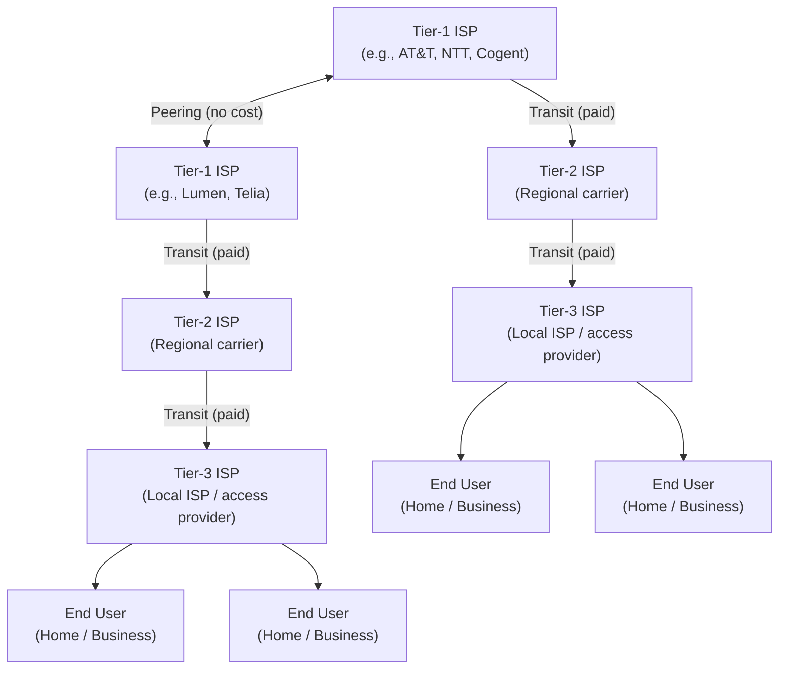
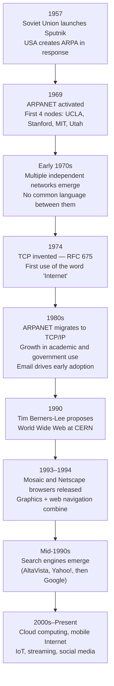
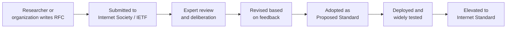
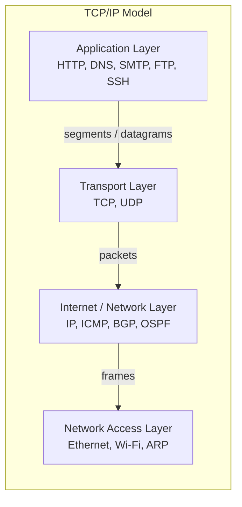

# Internet Fundamentals — Networking Core

## Overview

This guide establishes the conceptual foundation for everything else in this series. Before studying protocols, packet captures, or failure analysis, you need a clear mental model of what the Internet is, how it came to be, and how it is organized. The topics here — network types, the ISP hierarchy, Internet history, standards, layered architecture, and end systems — are the vocabulary and mental scaffolding that make everything else legible.

---

## 1. What is a Network?

A network is a group or system of interconnected entities. A railway network connects stations with tracks. A social network connects people with relationships. A **computer network** connects end systems with communication links — cable, fiber, or wireless radio.

### Two Purposes of Computer Networks

Every computer network exists for one or both of these reasons:

1. **Communication** — enabling computers to exchange information (email, web pages, video calls, API calls)
2. **Resource sharing** — enabling multiple systems to share hardware or services (printers, databases, Internet connections)

An *internet* (lowercase) makes both possible across different networks. The global **Internet** (uppercase) is the interconnection of all such networks worldwide.

> **Note:** The distinction matters. An "internet" is any interconnection of computer networks — a company's internal network connecting two offices is technically an internet. "The Internet" always refers to the global public network.

### Network Types by Geographic Scale

| Type | Scope | Examples |
|------|-------|---------|
| **LAN** — Local Area Network | Building or campus | Home Wi-Fi, office Ethernet |
| **MAN** — Metropolitan Area Network | City or metro region | University campus, city government network |
| **WAN** — Wide Area Network | Country or continent | Corporate WAN connecting offices across countries |
| **Internet** | Global | The public Internet |

> **Note:** "Small area" in LAN refers to geographic distance only, not the number of connected devices. A LAN can contain thousands of end systems.

The Internet itself is a vast collection of LANs interconnected by MANs and WANs.

### Network Components

| Component | Role |
|-----------|------|
| **End systems** (hosts) | Devices at the edge — computers, phones, servers, IoT devices |
| **Routers** | Forward packets between networks; form the network core |
| **Switches** | Forward frames within a network segment (LAN) |
| **Links** | Physical media carrying data — copper, fiber, wireless |
| **Access networks** | Last-mile connections from end systems to the first router |

---

## 2. The Internet: A Network of Networks

The Internet is not a single network — it is a **network of networks**. Your laptop connects to a home router. That router connects to your ISP. Your ISP connects to larger ISPs. Those connect to global backbone providers. The result is a hierarchical mesh of interconnected networks spanning the globe.

### ISP Hierarchy



**How your computer connects to the Internet:**

1. Your device connects to a home router via Wi-Fi or Ethernet
2. The router connects to your Tier-3 ISP (e.g., Comcast, BT) via DSL, cable, or fiber
3. Your Tier-3 ISP purchases *transit* from a Tier-2 regional carrier
4. Tier-2 carriers purchase transit from Tier-1 backbone providers
5. Tier-1 providers peer with each other at no cost, forming the global backbone

> **Note:** Tier-1 ISPs are those that can reach every other network on the Internet through peering alone, without purchasing transit. They sit at the top of the hierarchy and form the backbone of the public Internet.

---

## 3. History of the Internet

Understanding the history of the Internet explains why it is designed the way it is — its emphasis on resilience, decentralization, and open standards all trace back to specific historical decisions.

### Timeline



### Key Events in Detail

**1957 — The Cold War and ARPA**

The Soviet Union launched Sputnik, the first artificial satellite, catching the United States off guard. In response, the U.S. government established the **Advanced Research Projects Agency (ARPA)** — now DARPA — with a mandate for scientific and technological advancement.

**1969 — ARPANET**

ARPA needed its research computers to communicate across the country. The **ARPANET** was built and activated in September 1969. The first four nodes were at:

- UCLA
- Stanford Research Institute
- MIT
- University of Utah

**1970s — The Protocol Problem**

As more independent networks formed, a critical problem emerged: each network had its own protocol (its own language). Computers on different networks could not communicate. This led to the invention of a standardized protocol.

**1974 — TCP and the Word "Internet"**

The **Transmission Control Protocol (TCP)** was invented and documented in RFC 675. Critically, RFC 675 is also the first document in which the term *"Internet"* appears. Later RFCs continued using the term.

**1980s — TCP/IP Becomes the Standard**

ARPANET fully migrated to TCP/IP. Computers were added to the Internet at an increasing rate, primarily from government, academic, and research institutions. Engineers were surprised to find that the most popular early application was **electronic mail** — not the computational resource sharing that originally motivated the network.

**1990 — The World Wide Web**

Tim Berners-Lee, working at CERN (the European Council for Nuclear Research), needed a way to share research documents that cross-referenced one another. In 1990, he introduced the **World Wide Web** — a system for storing and retrieving interconnected (hyperlinked) documents.

> "Creating the web was really an act of desperation because the situation without it was very difficult when I was working at CERN later. Most of the technology involved in the web, like the hypertext, like the Internet, multi font text objects, had all been designed already. I just had to put them together."
> — Tim Berners-Lee

**1993–1994 — Browsers**

The **Mosaic** and **Netscape** browsers enabled combining graphics with web navigation, making the web accessible to non-technical users. Web usage exploded.

**Mid-1990s — Search Engines**

Initially, there were no search engines. Finding a website meant already knowing its address, or stumbling on it via links. People began creating static directory indices, but these could not scale. Automated search engines followed — AltaVista and Yahoo! among the earliest; the W3Catalog was the first automated web index.

**2000s–Present — The Modern Internet**

Cloud computing, mobile Internet (3G, 4G, LTE, 5G), the Internet of Things, video streaming, and social media have transformed the Internet from a research tool into essential infrastructure.

> **Note:** Tim Berners-Lee invented the **World Wide Web** — not the Internet. The Internet is the underlying network infrastructure; the Web is one application that runs on top of it.

---

## 4. Internet Standards

### Why Standards Matter

Different organizations and vendors build hardware and software that must interoperate. Without agreeing on a common protocol, their systems cannot communicate. Standardization is the process by which all interested stakeholders debate and formally agree on a protocol or design.

Standardization enables **interoperability** — a Firefox browser on Linux can talk to an Apache server on FreeBSD because both implement the same HTTP specification.

### Request for Comments (RFCs)

An **RFC (Request for Comments)** is a document containing proposals for new Internet protocols, systems, or best practices. The name was chosen deliberately to encourage discussion and avoid appearing too authoritative.

RFCs were started by **Steve Crocker** to document the development of ARPANET. They were originally typed and distributed as physical copies around ARPA's office.

Today, RFCs are submitted to and managed by the **Internet Society**, which has a sub-body called the **Internet Engineering Task Force (IETF)**. The IETF works on the standardization of Internet protocols. An RFC is deliberated on by experts, revised, and — if accepted — adopted as a standard.

| RFC Type | Description |
|----------|-------------|
| **Proposed Standard** | Well-reviewed and stable, but not yet fully mature |
| **Internet Standard** | Technically competent, practically applicable, publicly recognized |
| **Historic** | Obsolete; describes technologies no longer in active use |
| **Informational / Unknown** | Does not specify a standard; provides context or background |

### How a Protocol Becomes a Standard



**Key RFCs to know:**

- **RFC 675** — First definition of TCP; first use of the word "Internet" (1974)
- **RFC 791** — Internet Protocol (IP) specification
- **RFC 2026** — IETF's documented process for Internet standards
- **RFC 1122** — TCP/IP model technical specification

> **Note:** Anyone can write an RFC. If you develop a better design for an existing protocol, you can write up your findings and submit them through the Internet Society's Independent Submissions process.

---

## 5. The Layered Architecture

### Why Layers?

Building a network from scratch — handling physical signals, addressing, routing, reliability, and application logic all in one monolithic system — would be unmanageable. Layered architectures solve this with **modularity**.

Each layer:
- Performs a specific, well-defined set of tasks
- Provides a service to the layer above it
- Consumes a service from the layer below it
- Hides its implementation details from other layers (abstraction)

This means layers can **evolve independently**. HTTP has gone from version 1.0 to 3.0 without changing how IP routes packets. IP has gone from IPv4 to IPv6 without changing how TCP manages reliability.

### An Analogy: The Postal System

The postal system is naturally layered:

| Layer | Post Analogy | Network Equivalent |
|-------|-------------|-------------------|
| Application | Writing and addressing the letter | Application generating data |
| Transport | Envelope and packaging | Segmentation, reliability |
| Network | Post office routing to destination city | IP routing across networks |
| Physical | The truck, plane, or ship carrying mail | Cable, fiber, wireless signal |

Each layer serves the one above and is unaware of how the layer below does its job. A letter writer doesn't know if their letter crossed the ocean by ship or by air — and doesn't need to.

### The TCP/IP 4-Layer Model

The **TCP/IP model** (also called the Internet protocol suite) is the practical model used on the Internet today. Its technical specification is in RFC 1122, and it was developed with DARPA funding.



### Layer Responsibilities

| Layer | Data Unit | Key Protocols | Responsibility |
|-------|-----------|---------------|----------------|
| **Application** | Message | HTTP, DNS, SMTP, SSH, FTP | User-facing apps; formats data for the network |
| **Transport** | Segment (TCP) / Datagram (UDP) | TCP, UDP | End-to-end delivery; reliability, flow control, port addressing |
| **Internet** | Packet | IP, ICMP, BGP, OSPF | Logical addressing (IP); routing across networks |
| **Network Access** | Frame | Ethernet, Wi-Fi, ARP | Physical delivery on a single link; MAC addressing |

> **Note:** The OSI model splits these 4 layers into 7, separating Presentation and Session from Application, and Data Link from Physical. The OSI model is valuable for conceptual analysis and teaching. The TCP/IP model reflects how protocols are actually implemented and deployed.

### TCP/IP vs. OSI at a Glance

| Aspect | TCP/IP (4 layers) | OSI (7 layers) |
|--------|-------------------|----------------|
| Origin | Emerged from ARPANET practice | Designed by ISO in the 1970s |
| Adoption | Used in practice on the Internet | Conceptual / teaching model |
| Application layer | Encompasses OSI L5 (Session), L6 (Presentation), L7 (Application) | Three separate layers |
| Physical/Data Link | Combined into Network Access layer | Two separate layers |
| Standard | RFC 1122 | ISO/IEC 7498-1 |

### Encapsulation

As data travels **down** the stack on the sending end, each layer adds its own **header** (and sometimes a trailer) to the data it receives from the layer above. This is called **encapsulation**. On the receiving end, each layer removes its header — called **decapsulation**.

```mermaid
graph LR
    subgraph Sender["Sending End System"]
        direction TB
        S_APP["Application\nMessage: HTTP Request"]
        S_TRN["Transport\nTCP Header + Message"]
        S_NET["Internet\nIP Header + TCP Segment"]
        S_LNK["Network Access\nEthernet Header + IP Packet + Trailer"]
        S_APP --> S_TRN --> S_NET --> S_LNK
    end

    subgraph Network["Network Core\n(Routers)"]
        RTR["Router inspects\nIP Header only\nRoutes packet"]
    end

    subgraph Receiver["Receiving End System"]
        direction TB
        R_LNK["Network Access\nStrips Ethernet Header/Trailer"]
        R_NET["Internet\nStrips IP Header"]
        R_TRN["Transport\nStrips TCP Header"]
        R_APP["Application\nReads HTTP Request"]
        R_LNK --> R_NET --> R_TRN --> R_APP
    end

    S_LNK -->|"bits on wire"| RTR
    RTR -->|"bits on wire"| R_LNK
```



A key insight: **routers in the network core only look as deep as the IP header**. They do not inspect the TCP segment or the HTTP payload. This is by design — the intelligence is at the edges (end systems), and the core remains fast and simple. This is called the **end-to-end argument**.

> **Note:** The end-to-end argument was a foundational design choice for the Internet: keep the core network simple and fast; implement intelligence at the endpoints. This enables resilience — packets are routed per-hop and can circumvent failures dynamically.

---

## 6. End Systems and the Network Core

### End Systems (Hosts)

End systems are devices connected to the Internet. They are also called **hosts** because they host (run) applications. Examples include:

- Desktop and laptop computers
- Servers (web servers, database servers, application servers)
- Mobile devices
- IoT devices (smart thermostats, cameras, industrial sensors)

End systems sit at the **edge** of the Internet — they originate and consume data, but do not relay data from one device to another through the network core.

### Clients and Servers

The most common application architecture on the Internet is **client-server**:

| Role | Characteristics |
|------|----------------|
| **Server** | Always-on; stable IP address; controls access to a resource or service |
| **Client** | Initiates connections; consumes services; may have dynamic IP |

When a web server cannot handle demand from a single machine, the server process is replicated across many machines in a **data center**. Data centers are buildings housing thousands of servers, providing redundancy and capacity.

An alternative architecture is **peer-to-peer (P2P)**, in which end systems communicate directly without a dedicated central server. Each peer can act as both client and server. P2P scales without proportional infrastructure cost — as more peers join, they bring their own upload capacity.

| Architecture | Scalability | Infrastructure Cost | Examples |
|---|---|---|---|
| Client-Server | Scales with server capacity | High (data centers) | Web, email, streaming |
| P2P | Scales with peer count | Low (peers contribute) | BitTorrent, some VoIP |
| Hybrid | Scalable with some central coordination | Moderate | Many modern applications |

### The Network Core: Packet Switching

Between end systems, the **network core** consists of interconnected **routers** and **switches** that forward data toward its destination.

The Internet uses **packet switching**: data is broken into smaller units called **packets**, each of which is independently routed through the network. Each router makes a per-hop forwarding decision based on the destination IP address.

**Why packets?** Sending one enormous file as a single transmission would monopolize the link for its entire duration. Breaking it into packets allows multiple end systems to share the same link fairly, interleaving their transmissions.

| Switching Type | How it works | Failure behavior |
|---|---|---|
| **Packet switching** | Each packet routed independently, per hop | Packets reroute around failures dynamically |
| **Circuit switching** | A dedicated path established before transmission | Path failure tears down the connection; must re-establish |

The Internet chose packet switching deliberately: the original ARPANET requirement was for **resilience**. A packet-switched network can route around a destroyed link; a circuit-switched network cannot.

> **Security:** Packet switching means any given packet may traverse a different physical path than the previous one. Without encryption at higher layers (TLS), an adversary with access to any link along the path can read packet contents. This is why end-to-end encryption at the application layer is essential, not optional.

### Addressing: How Packets Find Their Destination

Two addressing mechanisms locate the correct destination:

**IP Addresses** — identify a device on the network

- IPv4: 32-bit number in dotted-decimal notation (e.g., `203.128.22.10`)
- Each octet is 8 bits, ranging from 0 to 255
- Every device on the Internet has at least one IP address

**Port Numbers** — identify an application on a device

- 16-bit numbers, ranging from 0 to 65535
- Multiple applications run on the same device; ports distinguish them
- An IP address + port number together form a **socket**

| Port Range | Category | Examples |
|---|---|---|
| 0–1023 | Well-known ports | 80 (HTTP), 443 (HTTPS), 22 (SSH), 53 (DNS) |
| 1024–49151 | Registered ports | 1433 (SQL Server), 3306 (MySQL) |
| 49152–65535 | Dynamic / ephemeral | Assigned temporarily to client connections |

```bash
# Check your public IP address
curl ifconfig.me -s

# View listening ports and their associated processes
ss -tnlp

# View active connections with port info
ss -tnp
```

---

## Summary

| Concept | Key Takeaway |
|---------|-------------|
| **Network** | Interconnected systems; two purposes: communication and resource sharing |
| **Internet** | Network of networks; hierarchical ISP structure |
| **History** | Cold War → ARPA → ARPANET (1969) → TCP/IP → WWW (1990) → modern era |
| **RFCs / IETF** | The formal mechanism for Internet standardization; open to anyone |
| **Layered architecture** | Modularity through abstraction; layers evolve independently |
| **TCP/IP model** | 4 layers: Application, Transport, Internet, Network Access |
| **Encapsulation** | Each layer adds a header; core only inspects what it needs |
| **End systems** | Hosts at the edge; clients and servers; intelligence lives here |
| **Packet switching** | Per-hop routing; resilient; enables fair link sharing |
| **Addressing** | IP identifies the host; port identifies the application |

---

## What Comes Next

This guide covers the conceptual foundation. The subsequent guides in this series build on it:

- **OSI and TCP/IP Model** (`01-networking-fundamentals/01-osi-tcpip-model.md`) — layer-by-layer debugging frameworks and production tooling
- **DNS** — how hostnames resolve to IP addresses
- **TCP Deep Dive** — connection lifecycle, flow control, congestion control
- **TLS** — how encryption is layered on top of TCP
