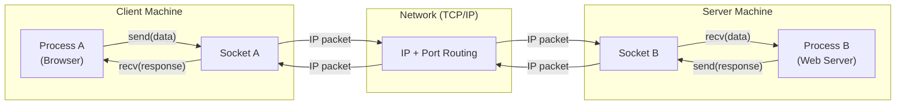
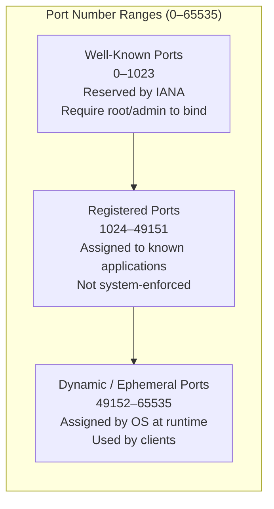
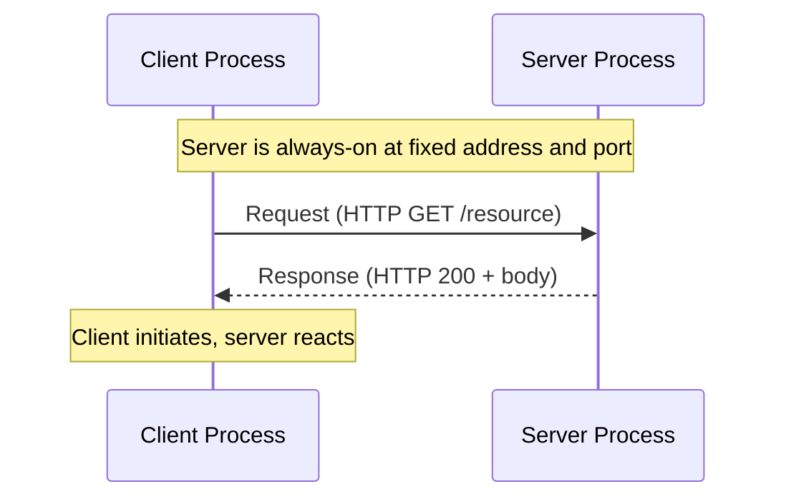
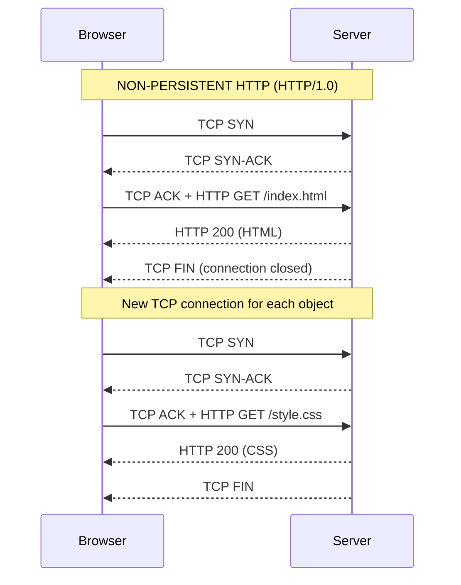
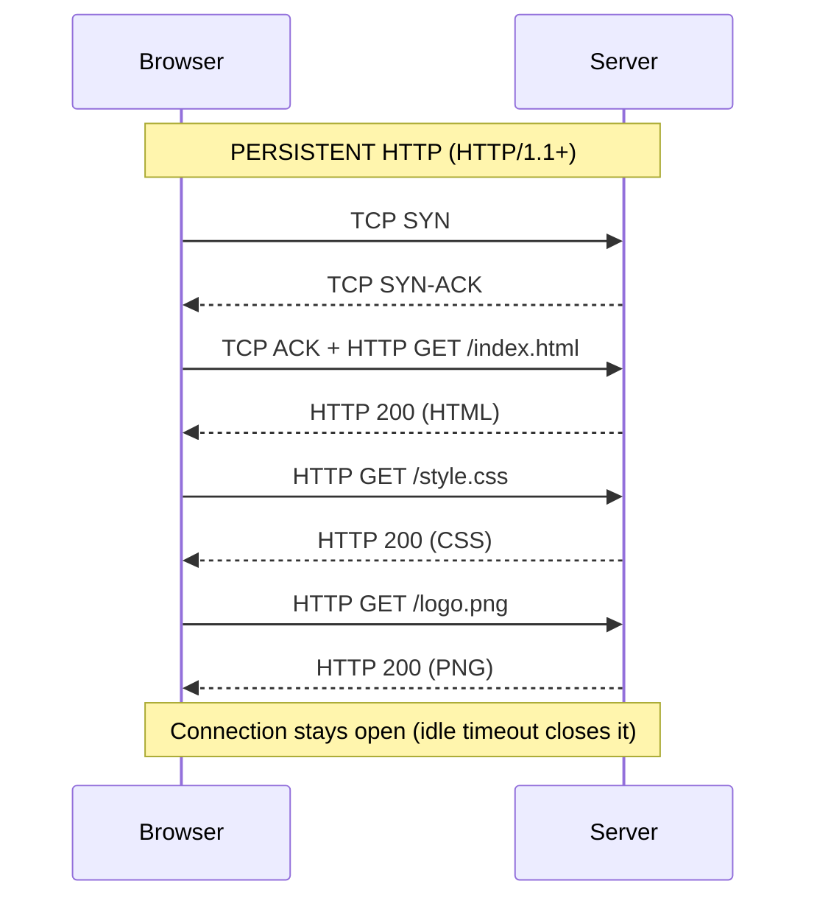
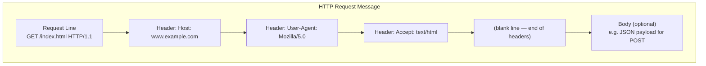
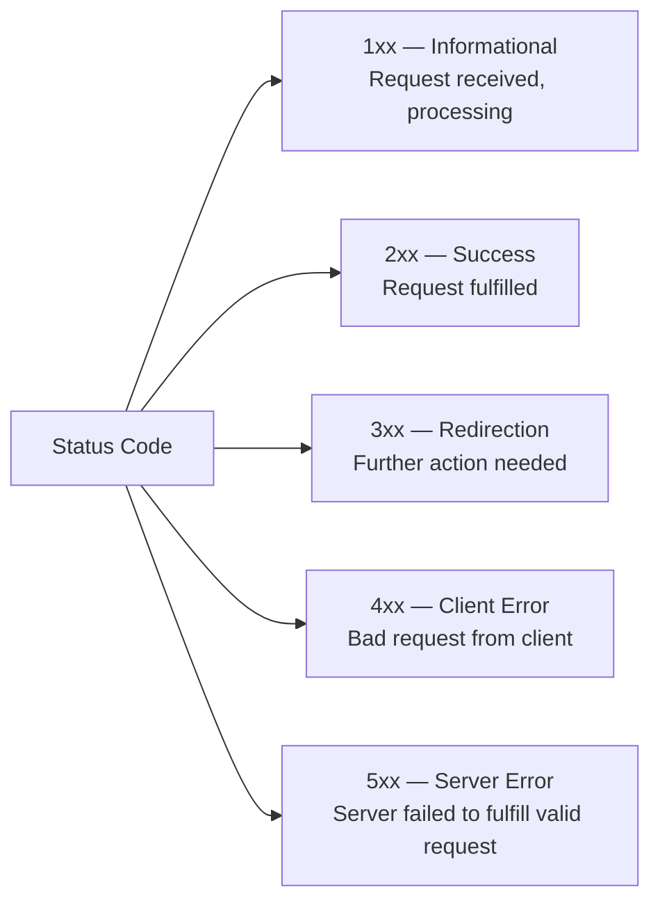
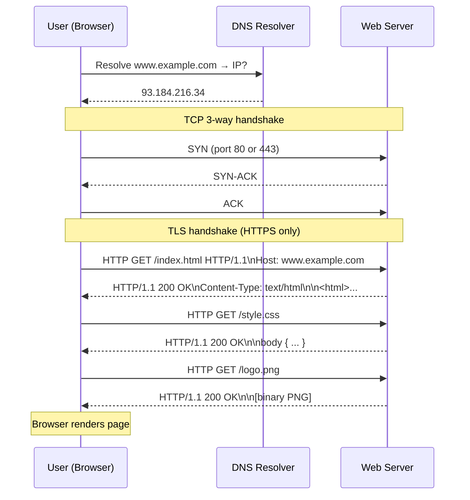

# Application Layer — Networking Core Reference

## Overview

The application layer is where user-facing software meets the network. It defines the protocols and rules that allow distributed programs — running on different machines across the Internet — to exchange meaningful data. Every time a browser fetches a page, an email client sends a message, or a mobile app calls an API, the application layer is doing the work.

Understanding the application layer is foundational for engineers who build, debug, or secure networked systems. It explains not just *what* HTTP is, but *why* it works the way it does — from port numbers that route packets to specific processes, to cookies that paper over HTTP's statelessness.

---

## 1. Programs, Processes, and Threads

Before understanding network communication, you need a clear model of what is actually communicating.

### Definitions

| Concept | Definition | Example |
|---------|-----------|---------|
| **Program** | An executable file stored on disk | `nginx` binary, `python3` interpreter |
| **Process** | A running instance of a program | An active `nginx` worker handling requests |
| **Thread** | A lightweight unit of execution within a process | One thread per HTTP request in a web server |

A single program can spawn multiple processes. A single process can contain multiple threads. Threads within a process share memory; processes do not.

```
Program (MS Word binary on disk)
  └── Process: Editing document.docx
  │     ├── Thread 1: Auto-save
  │     └── Thread 2: Spell checker
  └── Process: Opening report.docx
        ├── Thread 1: Load from disk
        └── Thread 2: Render fonts
```

### Why Processes Communicate Over Networks

Processes on the same machine communicate through the operating system (shared memory, pipes, signals). For processes on *different* machines, they must communicate through the network — exchanging messages according to agreed-upon protocols.

This is the central premise of the application layer: enabling **inter-process communication across a network**.

### Communication Models

| Model | Description | Examples |
|-------|-------------|---------|
| **Client-Server** | Clients request; servers respond. Server runs continuously at a known address. | HTTP, DNS, SMTP, SSH |
| **Peer-to-Peer (P2P)** | Each node acts as both client and server. No central authority. | BitTorrent, some VoIP |

> **Note:** The client-server model dominates the web. Servers run on fixed, well-known port numbers so clients can find them reliably. Clients use dynamically assigned ports.

---

## 2. Sockets

### What Is a Socket?

A **socket** is the software interface between a process and the computer network. It is the door through which an application sends and receives data — the process hands a message to the socket, and the underlying network stack handles everything below.

Sockets are purely software abstractions. They have no hardware component.



### Socket Types

| Type | Transport | Behavior | Use Cases |
|------|-----------|----------|-----------|
| **Stream Socket** | TCP | Reliable, ordered, connection-oriented | HTTP, HTTPS, SSH, SMTP |
| **Datagram Socket** | UDP | Unreliable, unordered, connectionless | DNS, video streaming, VoIP |

### How Applications Use Sockets

The application calls standard system calls (`connect`, `send`, `recv`, `close`) and never directly manipulates IP headers or TCP segments. The OS kernel handles the transport layer and below.

```python
# Minimal TCP client in Python (illustrative)
import socket

s = socket.socket(socket.AF_INET, socket.SOCK_STREAM)  # TCP stream socket
s.connect(("example.com", 80))                          # TCP handshake
s.send(b"GET / HTTP/1.1\r\nHost: example.com\r\n\r\n") # application data
response = s.recv(4096)                                  # receive response
s.close()
```

> **Note:** The socket API is the boundary between application layer and transport layer. Everything above the socket is the application's responsibility. Everything below is the OS's responsibility.

---

## 3. Ports and Addressing

### The Two-Part Address

An IP address alone identifies a machine. To identify a specific *process* on a machine, you need both:

```
[IP Address]:[Port Number]
192.168.1.10:443
```

This pairing — IP address + port — is called a **socket address** (or socket endpoint). Two socket endpoints together define a unique connection:

```
Client: 10.0.0.5:52341  ←→  Server: 93.184.216.34:80
```

### Port Ranges

Every application has a 16-bit port number, ranging from **0 to 65535**.



| Range | Name | Who Uses It |
|-------|------|-------------|
| 0–1023 | Well-known ports | System services (HTTP, SSH, DNS) |
| 1024–49151 | Registered ports | Application servers (databases, middleware) |
| 49152–65535 | Dynamic/ephemeral | Client-side OS-assigned ports |

### Well-Known Ports Reference

| Port | Protocol | Transport | Description |
|------|----------|-----------|-------------|
| 20, 21 | FTP | TCP | File transfer (data / control) |
| 22 | SSH | TCP | Secure shell |
| 25 | SMTP | TCP | Email sending |
| 53 | DNS | UDP/TCP | Domain name resolution |
| 80 | HTTP | TCP | Web (unencrypted) |
| 110 | POP3 | TCP | Email retrieval |
| 143 | IMAP | TCP | Email retrieval (sync) |
| 443 | HTTPS | TCP | Web (TLS-encrypted) |
| 1433 | MS SQL Server | TCP | Microsoft SQL Server |
| 3306 | MySQL | TCP | MySQL database |
| 5432 | PostgreSQL | TCP | PostgreSQL database |
| 6379 | Redis | TCP | Redis key-value store |
| 8080 | HTTP alt | TCP | Common development HTTP |

### Servers vs. Clients: Port Assignment

- **Servers** bind to **fixed, well-known ports** so clients can find them. An HTTP server always listens on port 80. An HTTPS server on 443. This predictability is essential.
- **Clients** use **ephemeral ports** dynamically assigned by the OS. When a browser opens a connection to port 80, the OS assigns the browser an ephemeral port (e.g., 52341) for the return path.

When a server receives multiple clients simultaneously, each connection is uniquely identified by the 4-tuple: `(client IP, client port, server IP, server port)`.

> **Note:** A server can also use ephemeral ports for follow-on communication. A common pattern: a client connects on a well-known port for the initial handshake, and subsequent data flows over an ephemeral port the server assigns.

> **Security:** Binding to well-known ports (0–1023) requires root/administrator privileges on most operating systems. This prevents unprivileged processes from impersonating system services like SSH or HTTP.

---

## 4. Application Layer Protocols Overview

### Role of the Application Layer

The application layer defines the **message format, semantics, and rules** for communication between networked processes. It sits atop the transport layer and relies on TCP or UDP for message delivery — it does not manage routing, reliability at the bit level, or physical transmission.

Key responsibilities:
- Define message structure (headers, body, encoding)
- Define request-response semantics
- Define error handling and status signaling
- Define session/state management

### Key Protocols

| Protocol | Port | Transport | Purpose |
|----------|------|-----------|---------|
| HTTP | 80 | TCP | Web content delivery |
| HTTPS | 443 | TCP | HTTP over TLS |
| DNS | 53 | UDP (primarily) | Hostname to IP resolution |
| FTP | 20/21 | TCP | File transfer |
| SMTP | 25 | TCP | Sending email |
| POP3 | 110 | TCP | Retrieving email (download) |
| IMAP | 143 | TCP | Retrieving email (sync) |
| SSH | 22 | TCP | Encrypted remote shell and tunneling |

### Client-Server Interaction Model



Servers are always-on processes bound to well-known ports, waiting for connections. Clients are transient — they initiate connections, exchange data, and disconnect.

---

## 5. HTTP — The Web Protocol

### What Is HTTP?

**HyperText Transfer Protocol (HTTP)** is the application-layer protocol at the core of the World Wide Web. It defines how web clients (browsers, `curl`, mobile apps) request resources from web servers, and how servers respond.

Key characteristics:
- **Client-server protocol**: clients request, servers respond
- **Stateless**: the server retains no memory of previous requests by default — each request is independent
- **Text-based** (HTTP/1.x): messages are human-readable ASCII
- **Relies on TCP**: HTTP uses TCP for reliable, ordered delivery

> **Note:** HTTP's statelessness simplifies server design — no per-client state means servers scale horizontally. Stateful behavior (shopping carts, logins) is layered on top using cookies or session tokens.

### HTTP Versions

| Version | Year | Key Change |
|---------|------|------------|
| HTTP/1.0 | 1996 | One TCP connection per request |
| HTTP/1.1 | 1997 | Persistent connections, pipelining, `Host` header |
| HTTP/2 | 2015 | Binary framing, multiplexing, header compression |
| HTTP/3 | 2022 | Built on QUIC (UDP), eliminates TCP head-of-line blocking |

### URL Anatomy

A URL (Uniform Resource Locator) specifies the address of a resource on the web.

```
https://www.example.com:443/path/to/resource.html?user=alice&page=2#section3
│       │               │   │                     │                 │
│       │               │   │                     query parameters  fragment
│       │               │   path
│       │               port (optional if default)
│       hostname
protocol (scheme)
```

| Component | Example | Description |
|-----------|---------|-------------|
| Protocol | `https` | Application-layer protocol to use |
| Hostname | `www.example.com` | Domain name or IP address of the server |
| Port | `443` | Port number (omitted if default: 80 for HTTP, 443 for HTTPS) |
| Path | `/path/to/resource.html` | Location of the resource on the server |
| Query string | `?user=alice&page=2` | Key-value parameters passed to the server |
| Fragment | `#section3` | Client-side reference to a section within the document |

### Web Objects

A web page is not a single file — it is a collection of **objects**:

- A base HTML file that references other objects
- Images (PNG, JPEG, WebP)
- Scripts (JavaScript)
- Stylesheets (CSS)
- Video, audio, fonts

Each object has its own URL and must be fetched individually. A single page load may generate dozens to hundreds of HTTP requests.

### Non-Persistent vs. Persistent HTTP





| Characteristic | Non-Persistent (HTTP/1.0) | Persistent (HTTP/1.1+) |
|----------------|--------------------------|------------------------|
| TCP connections per page | One per object | One for all objects in session |
| Connection setup overhead | High (3-way handshake each time) | Low (handshake once) |
| Latency | High (2 RTT per object minimum) | Low (1 RTT after first connection) |
| Server load | Higher (more sockets) | Lower |
| Default behavior | HTTP/1.0 | HTTP/1.1 and later |
| Connection closed by | Server after each response | Server after idle timeout (configurable) |

> **Note:** Even with persistent connections, HTTP/1.1 can only send one request at a time per connection (head-of-line blocking). HTTP/2 multiplexing solves this by allowing multiple concurrent requests over a single connection.

---

## 6. HTTP Request Messages

### Message Structure

An HTTP request message has three parts:

```
┌─────────────────────────────────────────────┐
│  Request Line   (method + URL + version)     │
├─────────────────────────────────────────────┤
│  Header Lines   (key: value pairs, one/line) │
│  ...                                         │
├─────────────────────────────────────────────┤
│  (blank line — marks end of headers)         │
├─────────────────────────────────────────────┤
│  Body           (optional, e.g. POST data)   │
└─────────────────────────────────────────────┘
```

### Example Request

```http
GET /path/to/file/index.html HTTP/1.1\r\n
Host: www.example.com\r\n
Connection: keep-alive\r\n
User-Agent: Mozilla/5.0 (Macintosh; Intel Mac OS X)\r\n
Accept-Language: en-US,en;q=0.9\r\n
Accept: text/html,application/xhtml+xml,application/json\r\n
\r\n
```

> **Note:** Every header line ends with `\r\n` (carriage return + line feed). The blank line (`\r\n`) separating headers from body is mandatory — it signals the end of the header section.

### HTTP Methods

| Method | Purpose | Has Body? | Idempotent | Safe |
|--------|---------|-----------|------------|------|
| **GET** | Retrieve a resource | No | Yes | Yes |
| **POST** | Submit data; create a resource | Yes | No | No |
| **PUT** | Replace a resource at a specific URI | Yes | Yes | No |
| **PATCH** | Partially update a resource | Yes | No | No |
| **DELETE** | Remove a resource | No | Yes | No |
| **HEAD** | Retrieve headers only (no body) | No | Yes | Yes |
| **OPTIONS** | Query supported methods | No | Yes | Yes |

**GET** is by far the most common method — it requests data from the server. The URL is everything.

**POST** sends data in the request body, which avoids length limits of URL parameters and keeps data out of browser history and server logs.

**HEAD** is useful for checking if a resource exists and reading metadata (size, last modified) without downloading the body — valuable for caching and health checks.

**PUT** places data at a specific URI — if the resource exists, it is replaced. If not, it is created.

> **Security:** Sensitive data should never be sent as GET parameters — they appear in URLs, browser history, server access logs, and referrer headers. Use POST with HTTPS instead.

### Common Request Headers

| Header | Example | Purpose |
|--------|---------|---------|
| `Host` | `Host: www.example.com` | Target hostname (required in HTTP/1.1) |
| `User-Agent` | `User-Agent: Mozilla/5.0` | Client software identity |
| `Accept` | `Accept: text/html, application/json` | Content types the client can handle |
| `Accept-Language` | `Accept-Language: en-US` | Preferred response language |
| `Accept-Encoding` | `Accept-Encoding: gzip, br` | Compression formats the client supports |
| `Connection` | `Connection: keep-alive` | Persistent or close after response |
| `Content-Type` | `Content-Type: application/json` | Media type of the request body (POST/PUT) |
| `Content-Length` | `Content-Length: 348` | Size of the request body in bytes |
| `Authorization` | `Authorization: Bearer <token>` | Authentication credentials |
| `Cookie` | `Cookie: session_id=abc123` | Cookies stored for this domain |

### HTTP Message Structure Diagram



---

## 7. HTTP Response Messages

### Message Structure

An HTTP response has three parts:

```
┌─────────────────────────────────────────────┐
│  Status Line    (version + code + phrase)    │
├─────────────────────────────────────────────┤
│  Header Lines   (key: value pairs, one/line) │
│  ...                                         │
├─────────────────────────────────────────────┤
│  (blank line)                                │
├─────────────────────────────────────────────┤
│  Body           (the requested resource)     │
└─────────────────────────────────────────────┘
```

### Example Response

```http
HTTP/1.1 200 OK\r\n
Connection: keep-alive\r\n
Date: Tue, 18 Aug 2015 15:44:04 GMT\r\n
Server: Apache/2.4.39 (CentOS)\r\n
Last-Modified: Tue, 18 Aug 2015 15:11:03 GMT\r\n
Content-Length: 6821\r\n
Content-Type: text/html; charset=UTF-8\r\n
\r\n
<!DOCTYPE html>
<html>...
```

### Status Codes

Status codes are three-digit numbers that tell the client what happened.



| Code | Phrase | Meaning |
|------|--------|---------|
| 200 | OK | Request succeeded; body contains the resource |
| 201 | Created | Resource successfully created (typically POST/PUT) |
| 204 | No Content | Success but no body (common for DELETE) |
| 301 | Moved Permanently | Resource at new URL permanently; update bookmarks |
| 302 | Found | Temporary redirect; keep using old URL |
| 304 | Not Modified | Cached version is current; no body sent |
| 400 | Bad Request | Server could not parse the request |
| 401 | Unauthorized | Authentication required |
| 403 | Forbidden | Authenticated but not permitted |
| 404 | Not Found | Resource does not exist on this server |
| 405 | Method Not Allowed | HTTP method not supported for this resource |
| 429 | Too Many Requests | Rate limit exceeded |
| 500 | Internal Server Error | Unexpected server-side error |
| 502 | Bad Gateway | Upstream server returned an invalid response |
| 503 | Service Unavailable | Server overloaded or down for maintenance |
| 505 | HTTP Version Not Supported | Server does not support the HTTP version used |

### Common Response Headers

| Header | Example | Purpose |
|--------|---------|---------|
| `Content-Type` | `Content-Type: text/html; charset=UTF-8` | Media type of the response body |
| `Content-Length` | `Content-Length: 6821` | Size of body in bytes |
| `Date` | `Date: Tue, 18 Aug 2015 15:44:04 GMT` | Timestamp the response was generated |
| `Server` | `Server: nginx/1.25.0` | Server software (can be suppressed for security) |
| `Last-Modified` | `Last-Modified: Mon, 01 Jan 2024 00:00:00 GMT` | When the resource was last changed |
| `Cache-Control` | `Cache-Control: max-age=3600` | Caching directives for the client |
| `ETag` | `ETag: "1541025663"` | Resource version identifier for conditional requests |
| `Location` | `Location: https://www.example.com/new` | Redirect target URL (3xx responses) |
| `Set-Cookie` | `Set-Cookie: session=abc123; HttpOnly` | Instruct client to store a cookie |

> **Note:** The `Content-Type` header — not the file extension — determines how the browser interprets a response body. A `.txt` file served with `Content-Type: text/html` will be rendered as HTML.

> **Security:** Suppressing or genericizing the `Server` header removes easy fingerprinting of your server software and version — a small but meaningful hardening step.

### Inspecting Real HTTP Responses

```bash
# View full HTTP response headers (no body)
curl -I https://example.com

# View response with headers and body
curl -v https://example.com

# View specific header
curl -s -o /dev/null -w "%{http_code}\n" https://example.com
```

---

## 8. Cookies

### The Problem: HTTP Is Stateless

HTTP's stateless design means every request is independent — the server has no memory of previous interactions. This is efficient for servers (no per-client state to manage), but breaks common application requirements:

- Is this user logged in?
- What items are in their shopping cart?
- What language did they select last visit?

**Cookies** solve this by storing small pieces of state on the client browser, which are sent back to the server on every subsequent request.

### How Cookies Work

```mermaid
sequenceDiagram
    participant B as Browser
    participant S as Server

    Note over B,S: First visit — no cookie yet
    B->>S: GET /index.html HTTP/1.1\n(no Cookie header)
    S-->>B: HTTP/1.1 200 OK\nSet-Cookie: session_id=a3f9b2; Path=/; HttpOnly
    Note over B: Browser stores cookie in cookie file

    Note over B,S: Subsequent request — cookie attached
    B->>S: GET /dashboard HTTP/1.1\nCookie: session_id=a3f9b2
    S-->>B: HTTP/1.1 200 OK\n(personalized response)
    Note over S: Server reads session_id, looks up user session
```

The cookie mechanism involves four components working together:

1. **HTTP response** from server includes `Set-Cookie` header
2. **Cookie file** on the browser stores the cookie
3. **HTTP request** from browser includes `Cookie` header on future requests
4. **Database** on the server maps cookie values to user/session state

### Cookie Attributes

```http
Set-Cookie: session_id=a3f9b2c1; Domain=example.com; Path=/; Expires=Fri, 01 Jan 2027 00:00:00 GMT; Secure; HttpOnly; SameSite=Strict
```

| Attribute | Example | Purpose |
|-----------|---------|---------|
| `name=value` | `session_id=a3f9b2` | The cookie data itself |
| `Domain` | `Domain=example.com` | Which domain can read this cookie |
| `Path` | `Path=/` | Which URL paths the cookie applies to |
| `Expires` / `Max-Age` | `Expires=Fri, 01 Jan 2027` | When the cookie should be deleted |
| `Secure` | `Secure` | Only transmit over HTTPS |
| `HttpOnly` | `HttpOnly` | Inaccessible to JavaScript (prevents XSS theft) |
| `SameSite` | `SameSite=Strict` | Controls cross-site sending (prevents CSRF) |

### Session cookies vs. Persistent cookies

- **Session cookies**: no `Expires` or `Max-Age`. Deleted when the browser closes.
- **Persistent cookies**: have an expiry date. Survive browser restarts.

### Cookie Use Cases

| Use Case | How Cookies Help |
|----------|-----------------|
| **Authentication** | Server sets a session token cookie on login; client sends it on every request |
| **Shopping cart** | Cart contents associated with a session ID stored in a cookie |
| **Personalization** | Language preference, theme, or display settings stored across visits |
| **Analytics** | Track page views and user journeys within a site |
| **Advertising tracking** | Third-party cookies track users across multiple sites |

### Third-Party Cookies and Privacy

A **first-party cookie** is set by the domain the user is visiting. A **third-party cookie** is set by a different domain — typically an advertiser or analytics provider embedded on the page.

**How third-party tracking works:**
1. User visits `amazon.com`. A cookie for `ad-network.com` is set because `ad-network.com` placed an ad on Amazon.
2. User visits `ebay.com`. `ad-network.com` has an ad here too.
3. The same `ad-network.com` cookie is sent — the ad network now knows the user visited both sites and can build a profile.

> **Security:** Third-party cookies enable pervasive cross-site tracking. Modern browsers increasingly block them by default. The `SameSite=Strict` attribute on first-party cookies prevents them from being sent in cross-site requests, defending against Cross-Site Request Forgery (CSRF) attacks. The `HttpOnly` flag prevents JavaScript from reading cookie values, defending against Cross-Site Scripting (XSS) attacks that attempt to steal session tokens.

> **Note:** Even with third-party cookies blocked, tracking persists through other techniques: browser fingerprinting, canvas fingerprinting, entity tags (ETags), and localStorage — cookie blocking alone is not a complete privacy solution.

---

## Full Request-Response Cycle



---

## Quick Reference

### Port Ranges Summary

| Range | Type | Usage |
|-------|------|-------|
| 0–1023 | Well-known | System protocols (HTTP, SSH, DNS) |
| 1024–49151 | Registered | Application services (databases) |
| 49152–65535 | Ephemeral | Client-side OS-assigned |

### HTTP Method Summary

| Method | Operation | Idempotent |
|--------|-----------|------------|
| GET | Read | Yes |
| POST | Create | No |
| PUT | Replace | Yes |
| PATCH | Update | No |
| DELETE | Delete | Yes |
| HEAD | Read headers | Yes |

### Status Code Summary

| Range | Category | Key Examples |
|-------|----------|-------------|
| 2xx | Success | 200 OK, 201 Created, 204 No Content |
| 3xx | Redirect | 301 Permanent, 302 Temporary, 304 Not Modified |
| 4xx | Client Error | 400 Bad Request, 401 Unauthorized, 403 Forbidden, 404 Not Found, 429 Rate Limited |
| 5xx | Server Error | 500 Internal Error, 502 Bad Gateway, 503 Unavailable |

---

## Further Reading

- RFC 9110 — HTTP Semantics (current HTTP standard)
- RFC 9112 — HTTP/1.1
- RFC 9113 — HTTP/2
- RFC 9114 — HTTP/3
- RFC 6265 — HTTP State Management Mechanism (Cookies)
- RFC 793 — Transmission Control Protocol (TCP)
