# Transport Layer — Networking Core Reference

## Overview

The transport layer is where process-to-process communication happens. Below it, the network layer moves packets between hosts using IP addresses. The transport layer adds the next critical dimension: multiplexing, so that many applications on the same host can share the network simultaneously. TCP and UDP are the two protocols that define this layer in the Internet stack.

This guide covers the full transport layer stack: UDP, reliable data transfer principles, TCP internals, congestion control theory, AIMD, slow start, and socket programming.

---

## 1. Transport Layer Overview

### Role and Position

The network layer (IP) provides host-to-host delivery. It can get a packet to the right machine, but it cannot direct that packet to the right process on that machine. The transport layer closes this gap.

| Layer | Addressing | Unit | Guarantee |
|---|---|---|---|
| Network (IP) | IP address | Packet | Best-effort, unreliable |
| Transport (TCP/UDP) | Port number | Segment / Datagram | TCP: reliable / UDP: unreliable |

A port number is a 16-bit integer (0–65535) that identifies a specific process or socket on a host. Together, an IP address and port number form a **socket address**.

### Multiplexing and Demultiplexing

**Multiplexing** (sender side): the transport layer collects data from multiple application sockets, attaches source and destination port numbers, and passes segments down to the network layer.

**Demultiplexing** (receiver side): the transport layer inspects the destination port on arriving segments and routes each one to the correct waiting socket.

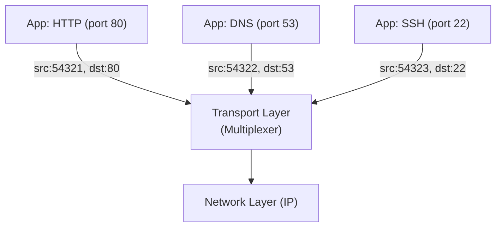

### Two Protocols

| Property | TCP | UDP |
|---|---|---|
| Connection | Connection-oriented | Connectionless |
| Reliability | Guaranteed delivery | Best-effort |
| Ordering | In-order delivery | No ordering |
| Flow control | Yes (receive window) | No |
| Congestion control | Yes (AIMD, slow start) | No |
| Header size | 20–60 bytes | 8 bytes |
| Use cases | HTTP, SSH, FTP, email | DNS, VoIP, gaming, streaming |

---

## 2. User Datagram Protocol (UDP)

### Characteristics

UDP is a thin wrapper over IP. It adds port numbers and a checksum, then gets out of the way. There is no handshake, no retransmission, no ordering guarantee, and no congestion control. What you get in exchange is low overhead and minimal latency.

UDP is described in RFC 768.

### UDP Header Structure

A UDP datagram header is exactly **8 bytes** (64 bits):

```
 0      7 8     15 16    23 24    31
+--------+--------+--------+--------+
| Source Port     | Destination Port |   (4 bytes)
+--------+--------+--------+--------+
| Length          | Checksum         |   (4 bytes)
+--------+--------+--------+--------+
| Data (up to 65,527 bytes)         |
+-----------------------------------+
```

| Field | Size | Description |
|---|---|---|
| Source Port | 2 bytes | Port of sending process (ephemeral or well-known) |
| Destination Port | 2 bytes | Port of receiving process |
| Length | 2 bytes | Total datagram length: header + data (min 8) |
| Checksum | 2 bytes | One's complement checksum over pseudo-header + data |
| Data | 0–65,527 bytes | Application payload |

The maximum payload is 65,527 bytes because the 2-byte length field supports a maximum of 65,535 bytes total, minus the 8-byte header.

### Checksum Calculation

UDP uses a 16-bit one's complement checksum:

1. The payload and a pseudo-header (source IP, destination IP, protocol, length) are divided into 16-bit words.
2. All 16-bit words are summed, wrapping overflow around (one's complement addition).
3. The one's complement of the result is appended as the checksum field.

At the receiver, the same sum is computed over the full datagram including the checksum field. If the result is all 1s (`0xFFFF`), the datagram is intact. Any other result indicates corruption, and the datagram is typically discarded.

> **Note:** If the checksum field itself is corrupted, UDP will assume the message has an error. If the message cannot be perfectly divided into 16-bit chunks, the last word is padded with zeros for checksum computation only — the actual payload is not modified.

### When to Use UDP

| Reason | Explanation |
|---|---|
| Speed-critical applications | Retransmission latency in TCP is unacceptable (e.g., live video, VoIP) |
| Application-level reliability | The application implements its own retransmit logic |
| Simple request-response | DNS: one query, one reply — TCP handshake overhead is wasteful |
| Custom protocols | QUIC (Google) is built on UDP and adds its own reliability |
| Low overhead | 8-byte UDP header vs. 20–60 byte TCP header reduces per-packet cost |

**Well-known applications using UDP:** DNS (port 53), SNMP (port 161), DHCP (ports 67/68), VoIP (RTP), online gaming, video streaming.

---

## 3. Principles of Reliable Data Transfer

The network layer (IP) is unreliable. Three classes of problems must be handled:

1. **Corruption**: bits are flipped in transit
2. **Loss**: segments never arrive
3. **Reordering / Duplication**: segments arrive out of order or multiple times

The transport layer addresses each with a specific mechanism.

### 3.1 Checksums — Detecting Corruption

A checksum is a compact digest computed over the segment. The sender computes and appends the checksum. The receiver recomputes it on arrival and compares. If they differ, the segment is corrupted and is discarded.

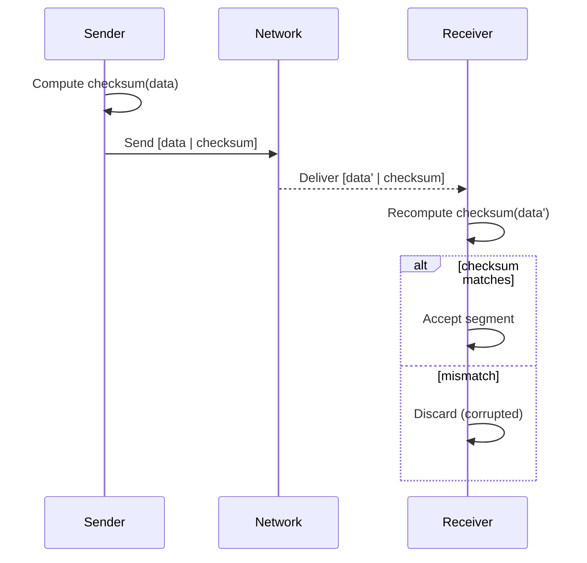

### 3.2 Retransmission Timers — Handling Loss

When the sender transmits a segment, it starts a **retransmission timer**. If the timer expires before an acknowledgment arrives, the sender assumes the segment was lost and retransmits.

The timer value must be **greater than the round-trip time (RTT)** — the time from sending a segment to receiving its ACK. Setting it too low causes unnecessary retransmissions (spurious retransmissions). Setting it too high increases recovery time after genuine loss.

**Spurious retransmissions** are a key pathology: if a timer fires for a segment that is delayed but not lost, the sender retransmits an already-delivered segment. The receiver gets a duplicate. This wastes bandwidth and contributes to **congestion collapse** — a state where all end-systems are transmitting but little is being received, because bandwidth is consumed by retransmissions of packets that were not actually lost.

> **Note:** TCP's retransmission timeout (RTO) is dynamically computed as a function of the measured RTT and its variance: `RTO = SRTT + 4 * RTTVAR`. This is specified in RFC 2988.

### 3.3 Sequence Numbers — Detecting Duplicates and Reordering

Every segment is labeled with a **sequence number** prepended to its header. This allows:

- **Duplicate detection**: if the receiver sees a sequence number it has already processed, it discards the segment (but still ACKs it to prevent the sender from retransmitting indefinitely).
- **Reordering detection**: the receiver can buffer out-of-order segments and deliver them to the application in the correct order.

In TCP, sequence numbers label individual **bytes** (not segments). The sequence number field in the TCP header holds the sequence number of the first byte in that segment's payload.

### 3.4 Acknowledgments — Cumulative ACKs

An **acknowledgment (ACK)** is a control segment sent by the receiver back to the sender, confirming receipt. TCP uses **cumulative ACKs**: an ACK number of `N` means "I have received all bytes up to and including byte N−1, and I am expecting byte N next."

The key benefit of cumulative ACKs is resilience to ACK loss. If ACK for segment 2 is dropped but ACK for segment 3 arrives, the sender knows segments 2 and 3 were received — it does not need to retransmit either.

### 3.5 Sliding Window — Throughput Control

**Stop-and-wait** is the simplest reliability strategy: send one segment, wait for its ACK, then send the next. This is safe but wastes the pipe — while waiting for the ACK, the sender is idle.

**Pipelining** allows the sender to transmit multiple segments before receiving acknowledgments. The **sliding window** defines how many unacknowledged segments the sender is allowed to have in flight at once.

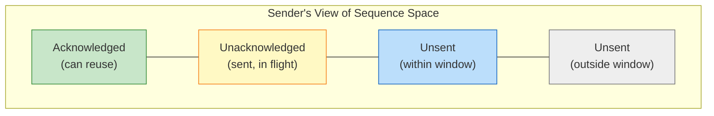

The window **slides** to the right as ACKs arrive. When the ACK for the lowest unacknowledged segment arrives, that segment leaves the "in-flight" zone and the window advances, allowing the next unsent segment to be transmitted.

**Throughput** is directly controlled by window size:

```
Max throughput = Window size / RTT
```

A larger window means more data in flight and higher throughput — provided the network can support it. Congestion control (Section 5–8) determines the safe window size.

**Go-back-N** and **Selective Repeat** are two sliding window strategies for retransmission:

| Strategy | Behavior on Loss |
|---|---|
| Go-back-N | Retransmit all unacknowledged segments from the lost one onward |
| Selective Repeat | Retransmit only the lost segment(s); buffer out-of-order segments |

Go-back-N is simpler but wastes bandwidth under high loss. Selective Repeat is more efficient but requires the receiver to buffer out-of-order segments. TCP uses a hybrid closer to Selective Repeat (via SACK extensions, RFC 2018).

---

## 4. Transmission Control Protocol (TCP)

### Characteristics

TCP is a **connection-oriented, reliable, ordered byte-stream** protocol. It is the backbone of HTTP, SSH, FTP, SMTP, and most other Internet applications where data integrity matters.

Key properties:
- **Connection-oriented**: a connection must be established (three-way handshake) before data transfer and released (FIN exchange) afterward.
- **Full-duplex**: both endpoints can send simultaneously on the same connection.
- **Byte-stream**: TCP treats data as a continuous stream of bytes, not discrete messages. Segmentation is an implementation detail.
- **Point-to-point**: exactly two endpoints per connection. No broadcast or multicast.

### TCP Segment Header Structure

```
 0                   1                   2                   3
 0 1 2 3 4 5 6 7 8 9 0 1 2 3 4 5 6 7 8 9 0 1 2 3 4 5 6 7 8 9 0 1
+-+-+-+-+-+-+-+-+-+-+-+-+-+-+-+-+-+-+-+-+-+-+-+-+-+-+-+-+-+-+-+-+
|          Source Port          |       Destination Port        |
+-+-+-+-+-+-+-+-+-+-+-+-+-+-+-+-+-+-+-+-+-+-+-+-+-+-+-+-+-+-+-+-+
|                        Sequence Number                        |
+-+-+-+-+-+-+-+-+-+-+-+-+-+-+-+-+-+-+-+-+-+-+-+-+-+-+-+-+-+-+-+-+
|                    Acknowledgment Number                      |
+-+-+-+-+-+-+-+-+-+-+-+-+-+-+-+-+-+-+-+-+-+-+-+-+-+-+-+-+-+-+-+-+
|  Data |Rsrvd|C|E|U|A|P|R|S|F|            Window             |
| Offset|     |W|C|R|C|S|S|Y|I|             Size              |
|       |     |R|E|G|K|H|T|N|N|                               |
+-+-+-+-+-+-+-+-+-+-+-+-+-+-+-+-+-+-+-+-+-+-+-+-+-+-+-+-+-+-+-+-+
|           Checksum            |         Urgent Pointer        |
+-+-+-+-+-+-+-+-+-+-+-+-+-+-+-+-+-+-+-+-+-+-+-+-+-+-+-+-+-+-+-+-+
|                    Options (0–40 bytes)                       |
+-+-+-+-+-+-+-+-+-+-+-+-+-+-+-+-+-+-+-+-+-+-+-+-+-+-+-+-+-+-+-+-+
|                    Data (variable)                            |
+-+-+-+-+-+-+-+-+-+-+-+-+-+-+-+-+-+-+-+-+-+-+-+-+-+-+-+-+-+-+-+-+
```

| Field | Size | Description |
|---|---|---|
| Source Port | 2 bytes | Sending process port |
| Destination Port | 2 bytes | Receiving process port |
| Sequence Number | 4 bytes | Byte offset of first byte in this segment's payload |
| Acknowledgment Number | 4 bytes | Next byte the sender expects to receive (cumulative ACK) |
| Data Offset | 4 bits | Header length in 32-bit words (multiply by 4 for bytes) |
| Reserved | 4 bits | Always zero |
| Flags (8 bits) | 1 bit each | CWR, ECE, URG, ACK, PSH, RST, SYN, FIN |
| Window Size | 2 bytes | Receive buffer space available; used for flow control |
| Checksum | 2 bytes | Mandatory integrity check (same algorithm as UDP) |
| Urgent Pointer | 2 bytes | Byte offset to end of urgent data (used with URG flag) |
| Options | 0–40 bytes | MSS, timestamps, window scale, SACK, etc. |

**Key flags:**

| Flag | Purpose |
|---|---|
| SYN | Initiate a connection; synchronize sequence numbers |
| ACK | Acknowledgment field is valid |
| FIN | Sender has finished sending data; initiate graceful close |
| RST | Abort connection immediately |
| PSH | Push buffered data to application immediately |
| URG | Urgent data present; Urgent Pointer field is valid |
| CWR | Congestion Window Reduced — sender has reduced cwnd |
| ECE | ECN Echo — receiver is signaling congestion |

### Three-Way Handshake

A TCP connection requires a three-way handshake before data can flow:

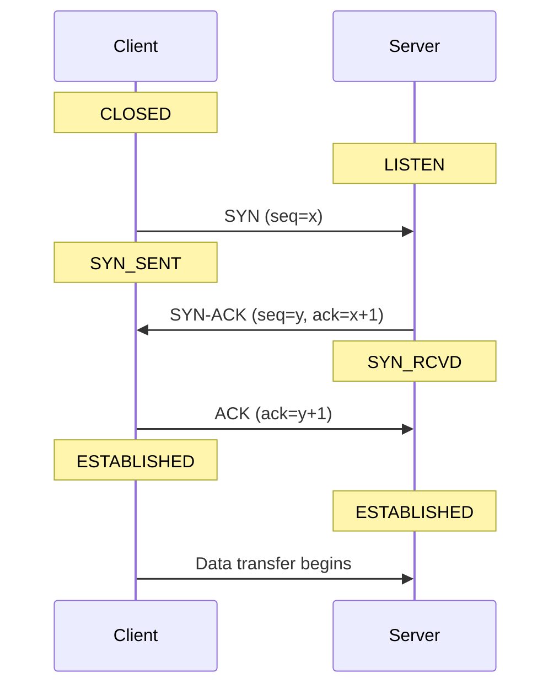

**Why three messages?** Both sides must synchronize their initial sequence numbers and confirm that the other side can receive. Two messages from the initiator and one from the responder achieves this minimum.

> **Note:** Initial sequence numbers are chosen randomly (not starting at 0) to prevent stale segments from a previous connection being mistaken for segments of a new connection on the same port pair.

### Connection Teardown

TCP supports a **graceful four-way close**: each side independently closes its half of the connection using FIN. After sending FIN, the endpoint enters a half-close state where it can still receive but not send.

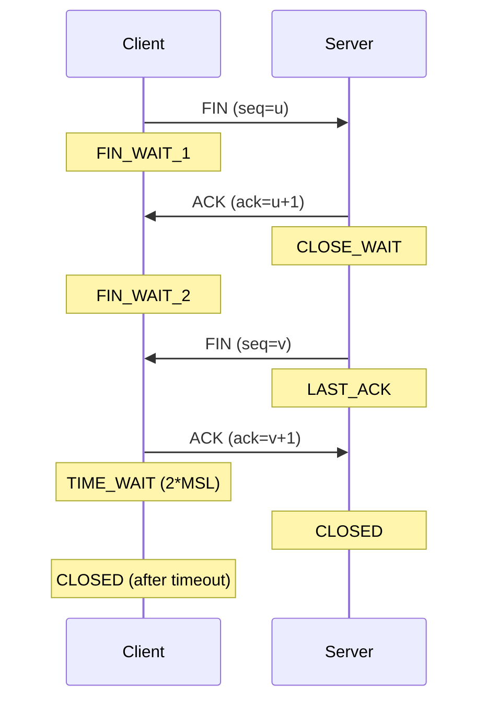

The client waits in `TIME_WAIT` for 2×MSL (Maximum Segment Lifetime, typically 60–120 seconds) to ensure the final ACK reaches the server and any delayed segments from the old connection expire before a new connection on the same port pair can be opened.

**Abrupt teardown** uses RST. A RST immediately terminates the connection with no further data transfer. It is sent when: no process is listening on the destination port, the receiver has crashed, or the connection is being forcibly rejected.

### Flow Control via Receive Window

The receiver advertises its available buffer space in the **Window Size** field of every TCP segment. The sender must not have more unacknowledged bytes in flight than the receiver's advertised window allows:

```
Sender's allowed in-flight bytes <= min(cwnd, recv_window)
```

As the receiver's application consumes buffered data, the window expands. If the application is slow, the window shrinks. This prevents the sender from overwhelming a slow receiver — distinct from congestion control, which prevents overwhelming the network.

---

## 5. Congestion Control — Principles

### What Is Congestion?

Congestion occurs when more packets are injected into the network than the available bandwidth can forward. The result:
- Router queues fill up → **increased delay**
- Queues overflow → **packet drops**
- Senders timeout and retransmit → **spurious retransmissions consume more bandwidth**
- In the extreme: **congestion collapse** — the network is saturated with retransmissions but very little useful data is delivered

> **Note:** Congestion physically occurs at the network layer (in routers), but it is caused by the transport layer sending too much data. Therefore, congestion control must be implemented end-to-end at the transport layer. TCP's congestion control lives entirely in the end-systems, not in the network.

### Why Not Just Allocate Fixed Bandwidth?

Real traffic arrives in **bursts**, not a smooth continuous stream. If four hosts share a 200 Mbps link and each is allocated 50 Mbps, simultaneous bursts will still exceed the link's capacity and cause congestion. Equal static allocation fails in practice.

### The Onset of Congestion

```
Useful throughput rises linearly with transmission rate...
...until the onset of congestion, then collapses.

Delay rises exponentially as the transmission rate approaches capacity.
Past a threshold, packets are dropped instead of experiencing infinite delay.
```

**Congestion collapse** occurs when all end-systems are sending high rates but almost nothing is received — the bandwidth is consumed entirely by retransmissions of packets that were not lost, just delayed (spurious retransmissions).

### Kleinrock's Power Formula (1979)

The optimal transmission rate maximizes **power**:

```
Power = Transmission Rate / Delay
```

Beyond the optimal point, increasing the transmission rate causes a disproportionate increase in delay, reducing power. This is the theoretical basis for why TCP should not push the network to its maximum capacity.

### Bandwidth Allocation Goals

A congestion control scheme must satisfy three goals simultaneously:

1. **Avoid congestion**: the sum of all transmission rates must not exceed the bottleneck link's bandwidth.
2. **Be efficient**: the sum of all transmission rates should be as close to the bottleneck bandwidth as possible (do not leave capacity unused).
3. **Be fair**: no single flow should disproportionately starve others.

Bandwidth is allocated **per connection**, not per host. A host that opens multiple TCP connections gets proportionally more bandwidth — a known limitation of TCP fairness.

### Max-Min Fairness

An allocation of rates to all sources is **max-min fair** if:

1. No link in the network is congested.
2. The rate allocated to source J cannot be increased without decreasing the rate of some source I whose current allocation is already less than or equal to J's allocation.

In plain terms: you cannot make the richest flow richer without making a poorer flow poorer. With a single bottleneck link, max-min fairness reduces to equal allocation.

### Efficiency vs. Fairness

For two hosts A and B sharing a 2 Mbps bottleneck:

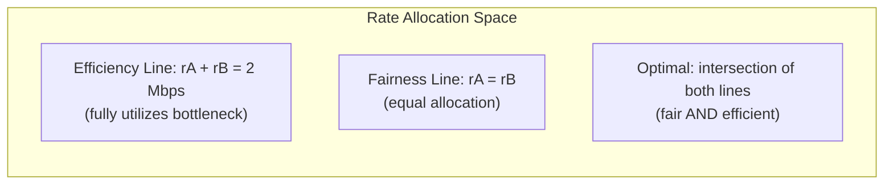

The four regions of the rate allocation graph:
- **Fair and efficient** (intersection of fairness line and efficiency line): the goal
- **Fair but not efficient** (below efficiency line, on fairness line): bandwidth wasted
- **Efficient but not fair** (on efficiency line, off fairness line): one flow dominates
- **Neither** (below efficiency line, off fairness line): worst case

### Convergence

A good congestion control scheme should **converge** to a fair and efficient allocation even as flows arrive and depart. It should not oscillate wildly or hold the allocation far from the optimal point for extended periods.

---

## 6. Additive Increase Multiplicative Decrease (AIMD)

### Mechanism

AIMD is the core algorithm behind TCP congestion control. It adjusts the **congestion window (cwnd)** — the maximum number of bytes the sender is allowed to have unacknowledged at any time:

```
Effective sending window = min(cwnd, recv_window)
Max rate = effective_window / RTT
```

**Additive Increase (AI):** When no congestion is detected, increment cwnd by 1 MSS (Maximum Segment Size) per round-trip time. This is the **congestion avoidance** phase.

```
Every RTT (when ACKs arrive): cwnd += 1 MSS
```

**Multiplicative Decrease (MD):** When congestion is detected (retransmission timer expires), halve cwnd:

```
On congestion: cwnd = cwnd / 2
```

### Congestion Detection

TCP detects congestion when:
- **Retransmission timer expires** (severe congestion): no ACK arrived within the timeout — the segment is assumed lost.
- **Three duplicate ACKs arrive** (mild congestion): the receiver keeps ACKing the last good segment because later segments are arriving out of order past a single loss.

### The Saw-Tooth Pattern

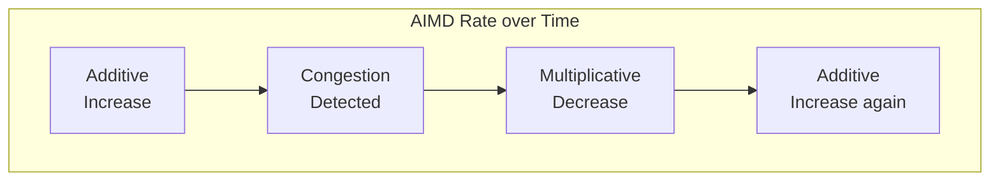

The rate rises linearly (one MSS per RTT) and drops by half on each congestion event, creating the characteristic **saw-tooth** pattern. This is stable and self-regulating.

### Why AIMD Achieves Fairness

Consider two flows sharing a bottleneck. If both use AIMD:
- Both increase toward the efficiency line at the same rate (additive increase is symmetric).
- On congestion, both halve — moving closer to the fairness line.
- Over repeated cycles, the operating point converges to the intersection of the efficiency and fairness lines.

This convergence is provable geometrically: additive increase moves parallel to the efficiency line, and multiplicative decrease moves toward the origin along the line connecting the current point to the origin, which always moves the operating point closer to the fairness line.

---

## 7. TCP Slow Start

### Problem with Pure AIMD

AIMD increases cwnd by 1 MSS per RTT. Starting from cwnd = 1 MSS (one segment), it takes many RTTs to reach an efficient operating point. On a 100 Mbps link with a 100ms RTT and 1500-byte MSS, reaching 1 MB of cwnd would take over 400 RTTs — about 40 seconds. This is unacceptable for short-lived connections.

### Slow Start Algorithm

**Slow start** provides exponential cwnd growth to quickly find the bottleneck capacity:

```
Start: cwnd = 1 MSS
Each RTT: cwnd *= 2  (double the window)
```

Each ACK received increases cwnd by 1 MSS, so for each full RTT of ACKs received, cwnd doubles. Despite the name "slow start," this is exponential growth — it is "slow" only compared to immediately transmitting at full link speed.

### Slow-Start Threshold (ssthresh)

The **slow-start threshold** (`ssthresh`) is an estimate of the last congestion window value that did not cause congestion. It is initialized to the sending window size and updated after each congestion event.

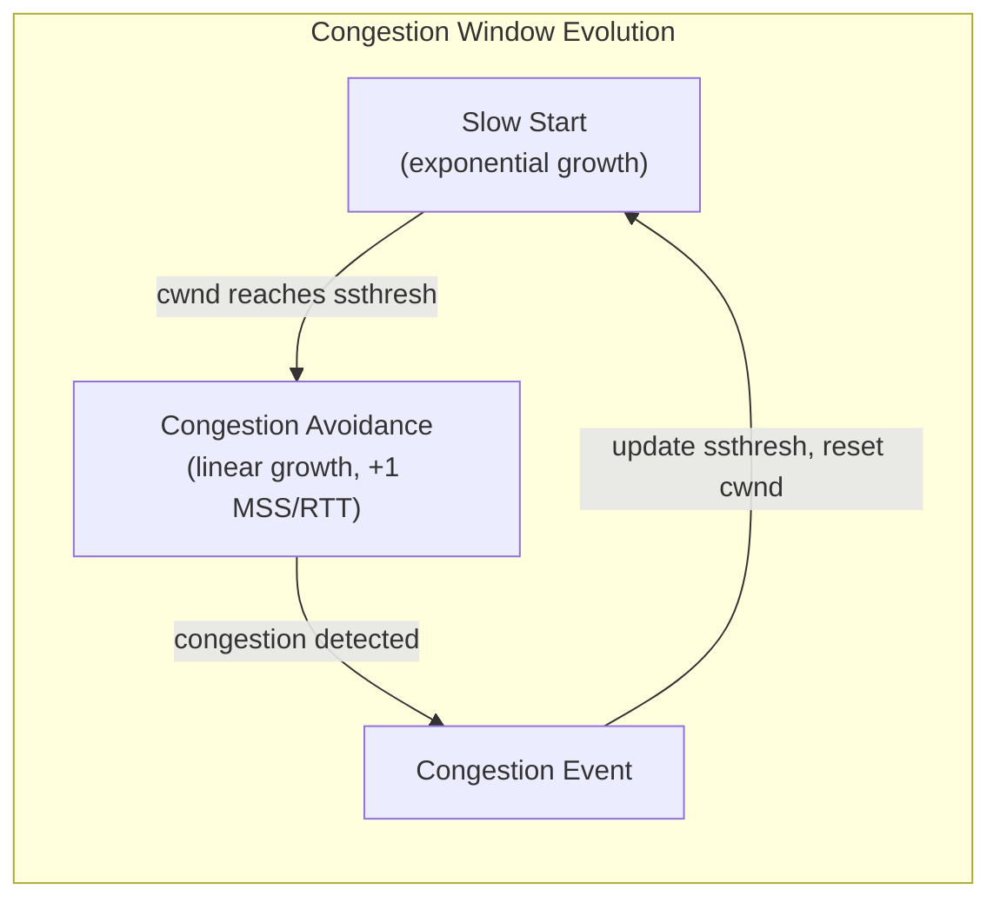

**Transition:** When cwnd reaches ssthresh, slow start stops and TCP switches to **congestion avoidance** — the additive increase phase of AIMD.

```
While cwnd < ssthresh:  slow start (exponential)
While cwnd >= ssthresh: congestion avoidance (linear, +1 MSS/RTT)
```

---

## 8. TCP Congestion Types and Response

TCP distinguishes two severity levels of congestion, each triggering a different response.

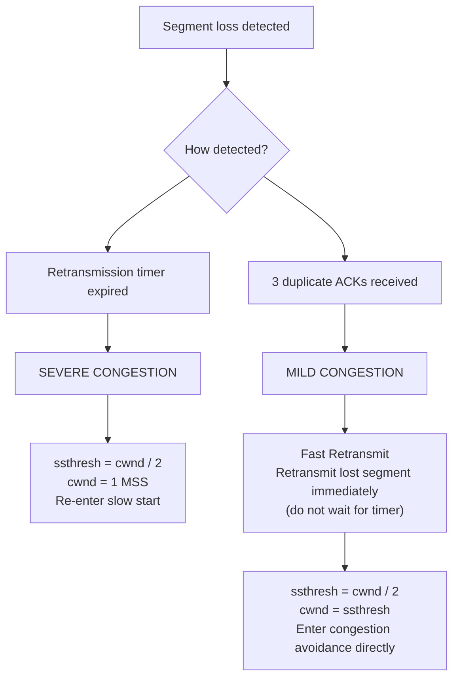

### Severe Congestion (Retransmission Timer Expiry)

The timer fires when no ACK arrives within the timeout — the network may be heavily congested or the path is temporarily broken.

**Response:**
1. Set `ssthresh = cwnd / 2` (record where congestion was first seen)
2. Reset `cwnd = 1 MSS` (back to one segment)
3. Re-enter **slow start** — exponential growth from 1 MSS up to the new ssthresh
4. At ssthresh, switch to **congestion avoidance** (linear growth)
5. Repeat on the next congestion event

This is aggressive: the sender slams the brakes because the timer expiry indicates the network may be severely overloaded.

### Mild Congestion (3 Duplicate ACKs — Fast Retransmit)

When a receiver gets an out-of-order segment, it sends an ACK with the last in-order sequence number. If three such duplicate ACKs arrive for the same sequence number, a single segment is almost certainly lost — but subsequent segments are still arriving (the receiver is sending ACKs for them). The network is not collapsed, just slightly congested.

**Why 3 ACKs = mild?** The receiver is clearly still receiving segments and sending ACKs. The network path is functioning. Only one segment appears to have been dropped.

**Fast Retransmit** allows the sender to retransmit the missing segment immediately — without waiting for the retransmission timer to expire:

**Response:**
1. Retransmit the missing segment immediately (fast retransmit)
2. Set `ssthresh = cwnd / 2`
3. Set `cwnd = ssthresh` (skip slow start — enter congestion avoidance directly)

The key difference from severe congestion: cwnd is halved but **not reset to 1**. The sender does not re-enter slow start because the network is still delivering packets.

### Congestion Window Evolution — Full Picture

```mermaid
graph LR
    subgraph "TCP cwnd Over Time"
        direction LR
        A["1 MSS\n(start)"]
        B["Exponential growth\nSlow Start"]
        C["ssthresh₁\nSwitch to linear"]
        D["Linear growth\nCongestion Avoidance"]
        E["Timer expiry\nSevere congestion"]
        F["ssthresh₂ = cwnd/2\ncwnd = 1 MSS"]
        G["Slow Start again"]
        H["ssthresh₂\nLinear again"]
        I["3 dup ACKs\nMild congestion"]
        J["Fast Retransmit\ncwnd = ssthresh/2"]
        K["Congestion Avoidance\n(no slow start)"]

        A --> B --> C --> D --> E --> F --> G --> H --> I --> J --> K
    end
```

### Comparison: Severe vs. Mild Congestion Response

| Aspect | Severe (Timer Expiry) | Mild (3 Dup ACKs) |
|---|---|---|
| Detection signal | No ACK before timeout | 3 duplicate ACKs received |
| Interpretation | Network may be collapsed | Single segment lost, network still working |
| ssthresh update | `ssthresh = cwnd / 2` | `ssthresh = cwnd / 2` |
| cwnd reset | `cwnd = 1 MSS` | `cwnd = ssthresh` |
| Next phase | Slow start | Congestion avoidance directly |
| Retransmit | After timeout | Immediately (fast retransmit) |

---

## 9. Socket Programming Basics

### What Is a Socket?

A **socket** is a software endpoint exposed by the operating system that allows a process to send and receive data over the network. Sockets abstract away the transport layer — the application writes and reads data from the socket, and the OS handles all the segmentation, ACKing, retransmission, and protocol mechanics.

Every socket is identified by:
- Address family (IPv4 `AF_INET`, IPv6 `AF_INET6`, Unix domain `AF_UNIX`)
- Protocol type (`SOCK_DGRAM` for UDP, `SOCK_STREAM` for TCP)
- A bound IP address and port

TCP sockets use `SOCK_STREAM`; UDP sockets use `SOCK_DGRAM`.

> **Note:** INET sockets (AF_INET / AF_INET6) are accessible from remote machines over the network. UNIX domain sockets (AF_UNIX) are bound to a file path on the local machine and are used for inter-process communication within the same host.

### UDP Socket Workflow

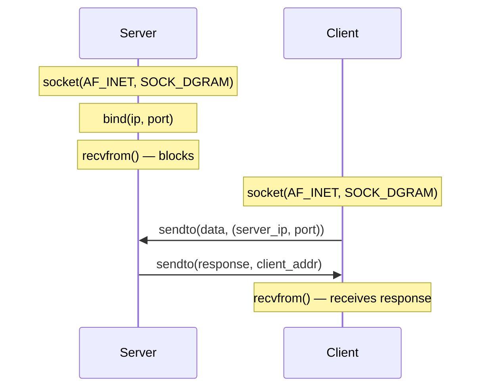

**UDP Server:**

```python
import socket

MAX_SIZE = 65535

# 1. Create UDP socket
s = socket.socket(socket.AF_INET, socket.SOCK_DGRAM)

# 2. Bind to address and port
s.bind(('127.0.0.1', 3000))
print('Listening at', s.getsockname())

# 3. Receive and respond in a loop
while True:
    data, client_addr = s.recvfrom(MAX_SIZE)
    message = data.decode('ascii')
    response = message.upper().encode('ascii')
    s.sendto(response, client_addr)
```

**UDP Client:**

```python
import socket

MAX_SIZE = 65535

# 1. Create UDP socket (OS assigns ephemeral port automatically)
s = socket.socket(socket.AF_INET, socket.SOCK_DGRAM)

# 2. Send data (no bind needed — OS assigns port on first send)
message = input('Enter message: ')
s.sendto(message.encode('ascii'), ('127.0.0.1', 3000))

# 3. Receive response
data, server_addr = s.recvfrom(MAX_SIZE)
print('Server replied:', data.decode('ascii'))
```

The client does not call `bind()` — the OS automatically assigns an ephemeral port when `sendto()` is called. Ports 0–1023 are reserved for well-known system services and should not be bound by application code.

> **Note:** By default, UDP clients accept replies from any machine. Use `connect()` on a UDP socket to restrict replies to a specific server address, or validate the source address in the `recvfrom()` return value.

### TCP Socket Workflow

TCP requires an additional lifecycle: a dedicated **listening socket** on the server waits for incoming connections. When a connection arrives, `accept()` creates a new, separate **connected socket** for that specific client. The listening socket continues accepting new connections.

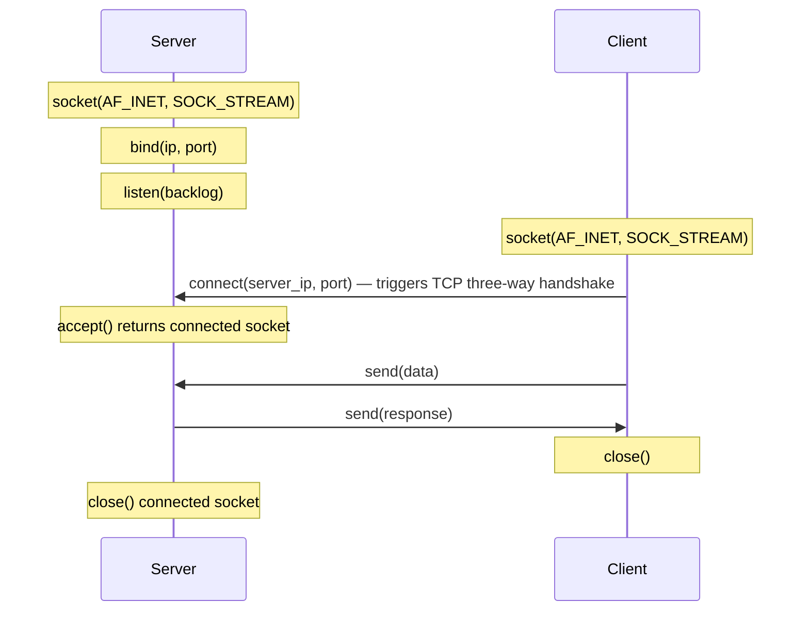

**TCP Server:**

```python
import socket

def recvall(sock, length):
    """Receive exactly `length` bytes, handling fragmentation."""
    data = b''
    while len(data) < length:
        chunk = sock.recv(length - len(data))
        if not chunk:
            raise EOFError('Connection closed before all data received')
        data += chunk
    return data

sock = socket.socket(socket.AF_INET, socket.SOCK_STREAM)
sock.setsockopt(socket.SOL_SOCKET, socket.SO_REUSEADDR, 1)
sock.bind(('127.0.0.1', 3000))
sock.listen(1)  # backlog: max queued connections
print('Listening at', sock.getsockname())

while True:
    conn, addr = sock.accept()  # blocks; returns new socket for each client
    print('Connection from', addr)
    message = recvall(conn, 16)
    conn.sendall(b'Goodbye, client!')
    conn.close()
```

**Key TCP socket differences from UDP:**

| Aspect | UDP | TCP |
|---|---|---|
| Connection before send | No | Yes — `connect()` triggers three-way handshake |
| Receiving | `recvfrom()` | `recv()` on connected socket |
| Sending | `sendto(data, addr)` | `send(data)` or `sendall(data)` |
| Server accept | Not needed | `listen()` + `accept()` |
| Fragmentation | One datagram = one message | May need `recvall()` loop |
| Socket per client | No | Yes — `accept()` returns a new socket |

> **Note:** TCP `send()` may transmit only part of the data (it returns the number of bytes actually sent). Always use `sendall()` or a send loop to ensure complete transmission. Similarly, `recv()` may return less data than requested — use a `recvall()` loop for length-prefixed protocols.

---

## Appendix: Key Formulas and Constants

| Concept | Formula / Value |
|---|---|
| Kleinrock's Power | `Power = Transmission Rate / Delay` |
| Max TCP throughput | `Window / RTT` |
| Effective window | `min(cwnd, recv_window)` |
| AIMD increase | `cwnd += 1 MSS per RTT` |
| AIMD decrease | `cwnd = cwnd / 2 on congestion` |
| ssthresh on severe congestion | `ssthresh = cwnd / 2; cwnd = 1 MSS` |
| ssthresh on mild congestion | `ssthresh = cwnd / 2; cwnd = ssthresh` |
| UDP header size | 8 bytes |
| UDP max payload | 65,527 bytes |
| TCP min header | 20 bytes |
| TCP max header | 60 bytes |
| TCP sequence number space | 0 to 2^32 − 1 (4-byte field) |

---

## Appendix: Debugging Reference

| Symptom | Likely Layer | Tool | What to Check |
|---|---|---|---|
| High retransmissions | Transport (TCP) | `ss -ti`, `netstat -s` | cwnd, retransmit counters |
| Packet loss to specific host | Network / Transport | `ping`, `mtr`, `tcpdump` | ICMP unreachable, drops |
| UDP messages not arriving | Transport | `tcpdump port 53` | Firewall dropping UDP |
| TCP connection refused | Transport | `telnet host port` | Process not listening, RST received |
| High latency on TCP | Congestion | `ss -ti` | cwnd, ssthresh, rtt |
| Duplicate ACKs in capture | Transport | Wireshark | Segment reorder or loss |
| Connection stuck in TIME_WAIT | Transport | `ss -t state time-wait` | Normal — wait 2×MSL before reuse |

```bash
# Show TCP socket stats including cwnd and ssthresh
ss -ti

# Capture TCP handshake for a connection
tcpdump -i eth0 'tcp[tcpflags] & (tcp-syn|tcp-ack|tcp-fin) != 0' -n

# Count TCP retransmissions
netstat -s | grep -i retransmit

# Show all UDP sockets
ss -u -a
```
