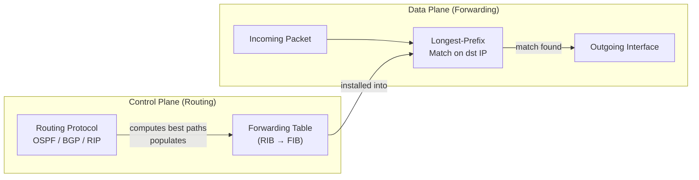
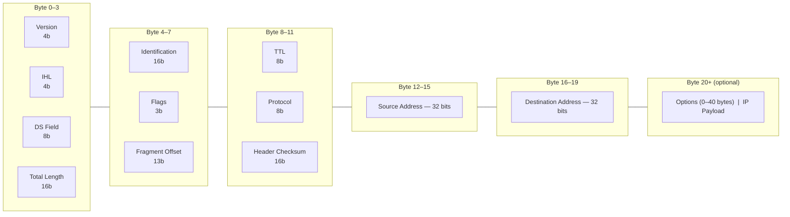
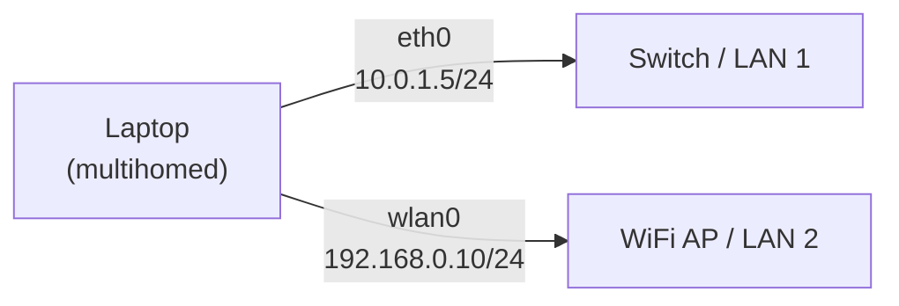
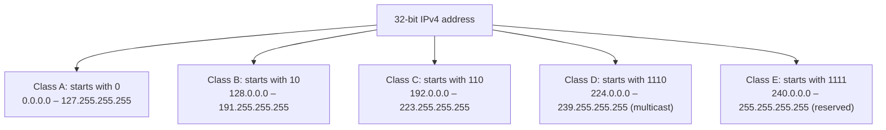
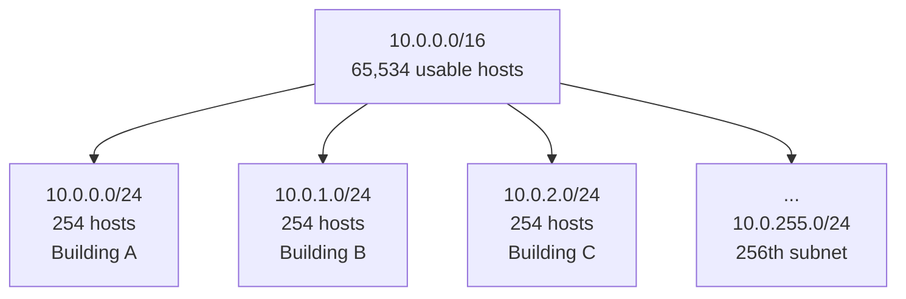
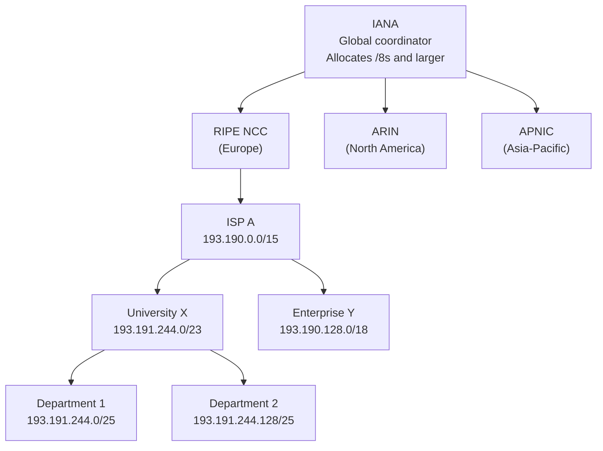
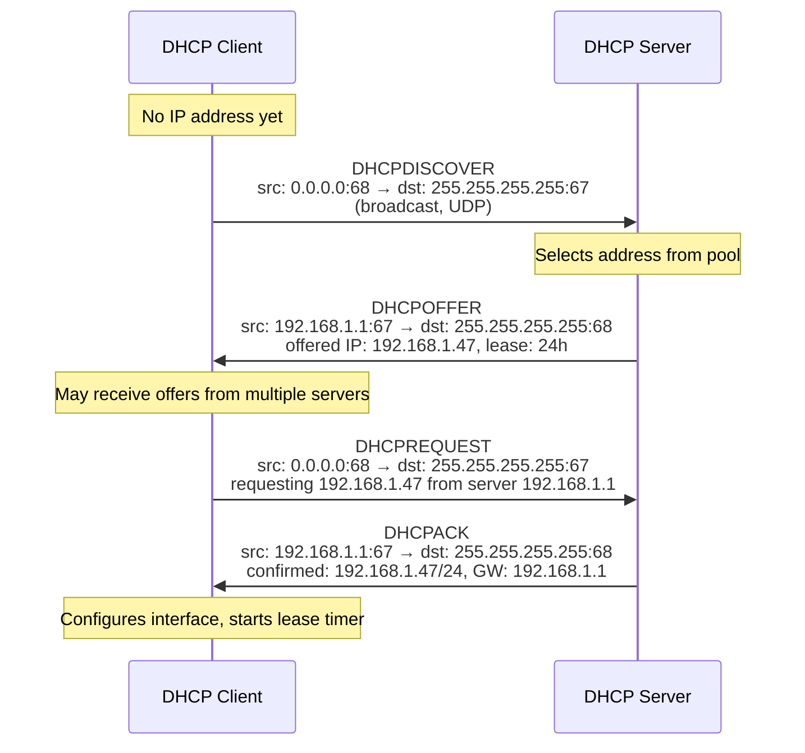
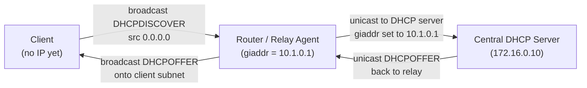
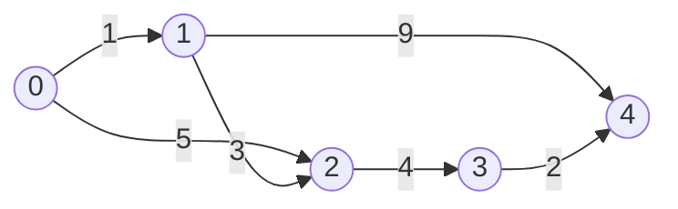

# Network Layer — IPv4, Addressing, Routing

## Overview

The network layer is the backbone of the Internet. It is responsible for **logical end-to-end delivery of packets** between hosts across arbitrarily many intermediate routers. Where the transport layer connects two processes on two endpoints, the network layer connects the endpoints themselves — it does not care which process on the destination host receives the packet.

The Internet Protocol (IP) is the universal glue at this layer. Every device that participates in global routing speaks IP. Everything above (TCP, UDP, application protocols) and below (Ethernet, WiFi, fiber links) is optional; IP is not.

---

## 1. Network Layer Functions

The network layer has two distinct responsibilities that are often conflated:

| Function | Scope | Description |
|---|---|---|
| **Forwarding** | Per-router, local | Move a packet from an incoming interface to the correct outgoing interface using the forwarding table |
| **Routing** | Network-wide, global | Compute the forwarding tables across all routers so that packets reach their destinations |

Forwarding is the fast-path data-plane action that happens millions of times per second. Routing is the control-plane computation — it runs routing protocols (OSPF, BGP) to populate the forwarding tables that forwarding uses.



> **Note:** A useful analogy: routing is planning a road trip on a map; forwarding is the act of turning the steering wheel at each intersection. The separation of these two planes is the architectural foundation of Software Defined Networking (SDN).

---

## 2. IPv4 Design Principles

IPv4 is specified in RFC 791 (1981). Its design was guided by a small set of explicit assumptions that remain influential today.

### Design Assumptions

| Assumption | Implication |
|---|---|
| Unreliable (best-effort) delivery | No guarantees of delivery, ordering, or duplicate-free delivery |
| Connectionless (datagram model) | No per-flow state stored in the network |
| Fixed 32-bit addresses | Simple, fast lookup; limited to ~4.3 billion unique addresses |
| Compatible with any data link layer | IP runs over Ethernet, WiFi, fiber, cellular, satellite |
| Variable-length packets | Up to 65,535 bytes per datagram |

The **datagram model** means every packet carries enough information (source and destination address) to be routed independently. Two packets from the same TCP connection may travel different paths and arrive out of order. Reliability is handled by TCP above IP — not by IP itself.

> **Security:** Because IP is connectionless and unreliable, IP source addresses are trivially forgeable. IP-level authentication (IPsec) or transport-layer mechanisms (TLS) are required to establish identity. This is the root cause of IP spoofing attacks.

---

## 3. IPv4 Header

All IPv4 packets use a 20-byte fixed header, with an optional extension of up to 40 additional bytes.



### Key Fields

| Field | Size | Purpose |
|---|---|---|
| Version | 4 bits | IP version (4 for IPv4) |
| IHL | 4 bits | Header length in 32-bit words (minimum 5 = 20 bytes) |
| DS Field | 8 bits | Differentiated Services / QoS marking |
| Total Length | 16 bits | Entire packet length in bytes (max 65,535) |
| Identification | 16 bits | Unique per-packet ID; copied into all fragments for reassembly |
| Flags | 3 bits | Don't Fragment (DF), More Fragments (MF), Reserved |
| Fragment Offset | 13 bits | Position of this fragment's payload in the original packet (units of 8 bytes) |
| TTL | 8 bits | Decremented by 1 at each hop; packet dropped when TTL = 0 |
| Protocol | 8 bits | Upper-layer protocol: 6 = TCP, 17 = UDP, 1 = ICMP |
| Header Checksum | 16 bits | Protects the header only (not the payload) |
| Source Address | 32 bits | IPv4 address of the originating host |
| Destination Address | 32 bits | IPv4 address of the intended recipient |

> **Note:** TTL prevents routing loops from keeping packets alive forever. The standard starting value is 64 or 128. `traceroute` exploits TTL exhaustion intentionally to map the path.

---

## 4. IPv4 Addresses

### Dotted-Decimal Notation

IPv4 addresses are 32-bit integers written as four decimal octets separated by dots. Each octet represents 8 bits.

```
Address:  1.2.3.4
Binary:   00000001 . 00000010 . 00000011 . 00000100
          ^^^^^^^^   ^^^^^^^^   ^^^^^^^^   ^^^^^^^^
          octet 1    octet 2    octet 3    octet 4

Address:  192.168.1.100
Binary:   11000000 . 10101000 . 00000001 . 01100100
```

### Multihoming

An IPv4 address identifies an **interface**, not a host. A router with four physical links has four IPv4 addresses — one per interface. A laptop with both an Ethernet port and a WiFi adapter also has two IPv4 addresses and is said to be **multihomed**.



When a router forwards a packet, it performs a longest-prefix match on the **destination address** to determine which outgoing interface to use.

---

## 5. Address Classes (Historical)

RFC 791 defined a classful addressing scheme where the high-order bits of an address encode the length of the network identifier. This scheme is now deprecated but explains the structure of many legacy allocations.



### Class Summary

| Class | High-order bits | Subnet ID bits | Host ID bits | Networks | Hosts/network | Default mask |
|---|---|---|---|---|---|---|
| A | `0` | 8 | 24 | 128 (2^7) | 16,777,216 (2^24) | 255.0.0.0 |
| B | `10` | 16 | 16 | 16,384 (2^14) | 65,536 (2^16) | 255.255.0.0 |
| C | `110` | 24 | 8 | 2,097,152 (2^21) | 256 (2^8) | 255.255.255.0 |
| D | `1110` | — | — | Multicast groups | — | — |
| E | `1111` | — | — | Reserved | — | — |

### Problems with Classful Addressing

- **Class A** blocks (16 million hosts each) were allocated to IBM, Stanford, MIT and a handful of others. The vast majority of each block sat unused.
- **Class B** blocks (65,536 hosts) were exactly the size most organizations wanted. All 16,384 Class B blocks were consumed by the early 1990s.
- **Class C** blocks (256 hosts) were too small for most organizations that needed more than 254 hosts.
- Every distinct block required a separate routing table entry, causing **routing table explosion** on backbone routers.

---

## 6. Subnetting

Subnetting splits a block of IP addresses into smaller, logically distinct **subnets**. Routers maintain routes toward subnet blocks, not individual host addresses. This is the mechanism that makes Internet routing scalable.

### Structure of an IPv4 Address

```
10001010.00110000.00011010.00000001
|<-------- network/subnet ID ------>|<-- host ID -->|
```

The **subnet mask** is a 32-bit value where all network bits are `1` and all host bits are `0`. Applied via bitwise AND to an IP address, it yields the network address.

### Network Address and Broadcast Address

Given the subnet `203.128.22.0/24`:

| Address | Value | Description |
|---|---|---|
| Network address | 203.128.22.0 | All host bits = 0. Used in routing table entries. Not assignable to a host. |
| Broadcast address | 203.128.22.255 | All host bits = 1. Sending to this address reaches all hosts on the subnet. |
| Usable host range | 203.128.22.1 – 203.128.22.254 | 254 assignable addresses |

**Formula:** Usable hosts = 2^(host bits) − 2

### CIDR Notation

An IPv4 prefix is written as `A.B.C.D/p` where `p` is the prefix length (number of network bits). This is equivalent to specifying the subnet mask.

```
203.128.22.0/24  →  mask 255.255.255.0  →  254 usable hosts
10.0.0.0/8       →  mask 255.0.0.0      →  16,777,214 usable hosts
192.168.1.0/28   →  mask 255.255.255.240 →  14 usable hosts
```

### Variable-Length Subnet Reference Table

| Prefix | Total addresses | Usable hosts | Lowest address | Highest address |
|---|---|---|---|---|
| /30 | 4 | 2 | x.x.x.0 | x.x.x.3 |
| /29 | 8 | 6 | x.x.x.0 | x.x.x.7 |
| /28 | 16 | 14 | x.x.x.0 | x.x.x.15 |
| /27 | 32 | 30 | x.x.x.0 | x.x.x.31 |
| /26 | 64 | 62 | x.x.x.0 | x.x.x.63 |
| /25 | 128 | 126 | x.x.x.0 | x.x.x.127 |
| /24 | 256 | 254 | x.x.x.0 | x.x.x.255 |
| /23 | 512 | 510 | x.x.x.0 | x.x.x+1.255 |
| /22 | 1,024 | 1,022 | | |
| /20 | 4,096 | 4,094 | | |
| /16 | 65,536 | 65,534 | x.x.0.0 | x.x.255.255 |
| /8 | 16,777,216 | 16,777,214 | x.0.0.0 | x.255.255.255 |

### Subnetting Example: Splitting a /16 into /24s



> **Note:** A /16 block can be split into exactly 256 /24 subnets (2^(24-16) = 256). Each /24 provides 254 usable host addresses. This is the standard enterprise campus design pattern.

### Subnetting Calculation Example

**Problem:** What is the network address, broadcast address, and usable range for host `10.4.8.55/22`?

```
IP address:    10.4.8.55   = 00001010.00000100.00001000.00110111
Subnet mask:   /22         = 11111111.11111111.11111100.00000000
                           = 255.255.252.0

Network addr:  10.4.8.0    (AND of IP and mask)
Broadcast:     10.4.11.255 (network addr OR ~mask)
Host range:    10.4.8.1 – 10.4.11.254
Usable hosts:  2^10 - 2 = 1,022
```

---

## 7. CIDR — Classless Interdomain Routing

RFC 1519 (1993) introduced CIDR to replace classful addressing. CIDR makes three critical changes:

1. **IP address classes are abolished.** All routers use variable-length subnet identifiers.
2. **Hierarchical, aggregatable address allocation.** Contiguous address blocks are assigned to ISPs, which sub-allocate to customers in the same geographic/topological region.
3. **Longest-prefix match forwarding.** Routers always choose the most specific (longest) matching prefix in their forwarding table.

### Why CIDR Replaced Classful Addressing

By the early 1990s, the classful scheme was failing:

- Class B blocks (65,536 hosts) were the most requested size, but only 16,384 existed. They were nearly exhausted.
- Backbone routers were maintaining one routing table entry per allocated block. With thousands of Class B allocations, routing tables had grown beyond the memory capacity of routers of that era.
- Adjacent Class B blocks were often allocated to geographically and topologically unrelated organizations, making aggregation impossible.

CIDR solved this by ensuring that an ISP receives a single large, contiguous block and sub-allocates from it. Any router outside the ISP's region needs only one routing entry for the entire ISP's address space.

### CIDR Allocation Hierarchy



### Route Aggregation (Supernetting)

CIDR allows smaller subnets to be aggregated into a single announcement, shrinking routing tables:

```
Before CIDR (4 separate routes):
  190.10.1.0/24
  190.10.2.0/24
  190.10.3.0/24
  190.10.4.0/24

After CIDR aggregation (1 route):
  190.10.0.0/21
```

This is why ISPs can announce a single route for thousands of their downstream customers.

### Longest-Prefix Match

When a router has multiple routes that match a destination address, it uses the **most specific** (longest prefix) route. This allows CIDR aggregation at the backbone while still supporting exceptions for multihomed organizations.

**Example:** A packet destined for `193.191.245.88` arrives at a backbone router with two matching routes:

```
Route 1:  193.190.0.0/15   (via ISP A)  — matches 16 bits
Route 2:  193.191.244.0/23 (via ISP B)  — matches 23 bits
```

Binary verification:
```
Destination:  11000001.10111111.11110101.01011000  (193.191.245.88)
Route 1 pfx:  11000001.10111110.xxxxxxxx.xxxxxxxx  (193.190.0.0/15)
              match: 16 bits

Route 2 pfx:  11000001.10111111.11110100.xxxxxxxx  (193.191.244.0/23)
              match: 23 bits  <-- LONGEST, this route wins
```

The packet is forwarded via ISP B.

> **Note:** The default route `0.0.0.0/0` always matches with prefix length 0 and acts as the catch-all fallback. It is never preferred over any more-specific route.

### Forwarding Table Example

A typical router forwarding table entry shows destination prefix, next-hop, and outgoing interface:

```
Destination         Next-Hop        Interface
205.135.0.0/16      R3              eth0
205.135.3.0/24      R1              eth1    ← more specific, preferred
205.0.0.0/8         R2              eth2
0.0.0.0/0           R4              eth3    ← default route

Query: where does 205.135.3.2 go?
  Matches 205.0.0.0/8    (8 bits)
  Matches 205.135.0.0/16 (16 bits)
  Matches 205.135.3.0/24 (24 bits)  <-- longest, forward to R1
```

### CIDR vs. Variable-Length Subnets

These two concepts are related but distinct:

| Concept | Direction | Purpose |
|---|---|---|
| Variable-length subnets | Steals bits from the host portion | Fit a subnet precisely to the number of hosts needed |
| CIDR / supernetting | Reduces the prefix length (borrows back bits) | Aggregate multiple smaller subnets into one routing announcement |

Variable-length subnets subdivide a block downward (e.g., /24 → /26). CIDR aggregates upward (e.g., four /24s → one /22). Both are enabled by the same mechanism: abandoning the fixed class boundaries.

---

## 8. Special IPv4 Addresses

Defined in RFC 5735. These ranges must not appear as source or destination addresses on the global Internet (with limited exceptions).

| Block | Name | Usage |
|---|---|---|
| `0.0.0.0/8` | "This network" | Source address only, before a host acquires an IP (e.g., DHCP Discover) |
| `127.0.0.0/8` | Loopback | Traffic to 127.0.0.1 never leaves the host. Used for local IPC. Always up. |
| `10.0.0.0/8` | RFC 1918 private | Large enterprise private networks |
| `172.16.0.0/12` | RFC 1918 private | Covers 172.16.0.0 – 172.31.255.255 |
| `192.168.0.0/16` | RFC 1918 private | SOHO and residential networks |
| `169.254.0.0/16` | Link-local (APIPA) | Auto-assigned when DHCP fails; not routable beyond the local link |
| `224.0.0.0/4` | Multicast | One-to-many delivery to subscribed receivers (Class D) |
| `255.255.255.255/32` | Limited broadcast | Reaches all hosts on the local subnet; not forwarded by routers |

> **Security:** RFC 1918 addresses (10/8, 172.16/12, 192.168/16) should never appear as source addresses on packets arriving from the public Internet. Routers at network edges should apply **ingress filtering** (BCP 38) to drop packets with spoofed private-range sources.

---

## 9. DHCP — Dynamic Host Configuration Protocol

DHCP (RFC 2131) automates IP address assignment. Without DHCP, every device would require manual configuration of its IP address, subnet mask, default gateway, and DNS servers — an error-prone process that does not scale.

### What DHCP Assigns

| Parameter | Example | Purpose |
|---|---|---|
| IP address | 192.168.1.47 | Unique host address on the subnet |
| Subnet mask | 255.255.255.0 (/24) | Defines the subnet boundary |
| Default gateway | 192.168.1.1 | Router for off-subnet traffic |
| DNS server(s) | 8.8.8.8, 8.8.4.4 | Name resolution |
| Lease time | 86400 seconds | How long the assignment is valid |

### DORA Process

DHCP uses a four-message exchange known as DORA: Discover, Offer, Request, Acknowledge.



### DHCP Relay Agents

A DHCP server is tied to a single subnet — routers do not forward broadcast traffic by default. In an enterprise with hundreds of subnets, deploying a DHCP server on every subnet is impractical.

**DHCP relay agents** (RFC 3046) solve this:



The relay agent inserts the **giaddr** (gateway IP address) field into the DHCP packet so the server knows which subnet pool to allocate from. This allows a single DHCP server to service the entire enterprise.

### Key Operational Details

- The DHCP server listens on **UDP port 67**; clients send from **UDP port 68**.
- The initial Discover and Request are sent to `255.255.255.255` because the client has no IP yet.
- DHCP servers are subnet-local — routers do not forward DHCP broadcasts. For multi-subnet deployments, **DHCP relay agents** (RFC 3046) forward DHCP messages to a central server using unicast.
- When a lease expires, the client must renew. If the device is powered off, the address returns to the pool automatically.

> **Security:** DHCP has no built-in authentication. A rogue DHCP server on the same subnet can redirect traffic by advertising a malicious default gateway (DHCP starvation / rogue DHCP attacks). Layer 2 **DHCP snooping** on managed switches mitigates this.

---

## 10. Routing — Dijkstra's Shortest Path Algorithm

Routing protocols compute the shortest (least-cost) paths through the network. At the IP layer, "routing" refers to the computation that produces the forwarding tables. There are two broad families of routing algorithms:

| Algorithm Family | How routers learn topology | Examples |
|---|---|---|
| Link-state | Each router floods its local link info to all routers; every router has a complete map | OSPF, IS-IS |
| Distance-vector | Routers share distance estimates with neighbors iteratively; no router has a complete map | RIP, BGP (path-vector variant) |

Dijkstra's algorithm is used by link-state protocols. Each router builds a graph of the entire network from the link-state database and runs Dijkstra locally to compute all shortest paths.

The network is modeled as a weighted directed graph:

- **Nodes** = routers
- **Edges** = links between routers
- **Edge weights** = cost metrics (delay, bandwidth, administrative preference)

### Dijkstra's Algorithm

Dijkstra's algorithm computes the shortest path from a source node to all other nodes in a graph with non-negative edge weights. It is the foundation of **OSPF** (Open Shortest Path First), the dominant link-state routing protocol in enterprise and ISP networks.

**Algorithm steps:**

1. Initialize: distance to source = 0, distance to all others = infinity. Mark all nodes unvisited.
2. Select the unvisited node with the smallest current distance. Call it `current`.
3. For each unvisited neighbor of `current`: if `distance[current] + edge_weight < distance[neighbor]`, update `distance[neighbor]` and record `current` as the neighbor's parent.
4. Mark `current` as visited.
5. Repeat steps 2–4 until all nodes are visited (or the destination is reached).
6. Trace back through the `parent` array from the destination to reconstruct the path.

**Complexity:**
- Naive (array-based): O(n^2) where n = number of nodes
- Optimized (binary heap / priority queue): O((n + e) log n) where e = number of edges

### Step-by-Step Example

Consider a 5-node network:



**Source = 0, Destination = 3**

| Step | Current | Visited | dist[0] | dist[1] | dist[2] | dist[3] | dist[4] |
|---|---|---|---|---|---|---|---|
| Init | — | {} | 0 | inf | inf | inf | inf |
| 1 | 0 | {0} | 0 | 1 | 5 | inf | inf |
| 2 | 1 | {0,1} | 0 | 1 | **4** | inf | 10 |
| 3 | 2 | {0,1,2} | 0 | 1 | 4 | **8** | 10 |
| 4 | 3 | {0,1,2,3} | 0 | 1 | 4 | 8 | **10** |

Shortest path to node 3: `0 → 1 → 2 → 3`, cost = 8

Shortest path to node 4: `0 → 1 → 2 → 3 → 4`, cost = 10 (not the direct 0→1→4 path which costs 10 equally, but via 3 is the same cost)

### Dijkstra Walk-Through (Detailed)

Using the graph above (adjacency matrix representation where `-1` means no direct link):

```
graph = [
  # 0   1   2   3   4
  [ 0,  1,  5, -1, -1],  # node 0
  [ 1,  0,  3, -1,  9],  # node 1
  [ 5,  3,  0,  4, -1],  # node 2
  [-1, -1,  4,  0,  2],  # node 3
  [-1,  9, -1,  2,  0],  # node 4
]
```

**Iteration trace from source node 0:**

```
Initial:  dist = [0, inf, inf, inf, inf]  parent = [-1, -1, -1, -1, -1]

Visit 0:  neighbors: 1 (cost 1), 2 (cost 5)
          dist[1] = 0+1 = 1, parent[1] = 0
          dist[2] = 0+5 = 5, parent[2] = 0
          dist = [0, 1, 5, inf, inf]

Visit 1:  (smallest unvisited) neighbors: 0(visited), 2 (cost 3), 4 (cost 9)
          dist[2] = min(5, 1+3) = 4, parent[2] = 1  (update!)
          dist[4] = min(inf, 1+9) = 10, parent[4] = 1
          dist = [0, 1, 4, inf, 10]

Visit 2:  (smallest unvisited) neighbors: 0(v), 1(v), 3 (cost 4)
          dist[3] = min(inf, 4+4) = 8, parent[3] = 2
          dist = [0, 1, 4, 8, 10]

Visit 3:  neighbors: 2(v), 4 (cost 2)
          dist[4] = min(10, 8+2) = 10  (no improvement)
          dist = [0, 1, 4, 8, 10]

Visit 4:  all visited — done

Shortest path to 3: trace parents: 3←2←1←0  →  [0, 1, 2, 3]  cost=8
Shortest path to 4: trace parents: 4←1←0    →  [0, 1, 4]     cost=10
```

### Python Implementation (Reference)

```python
def dijkstra(graph, src, dst):
    n = len(graph[0])
    distance = [float('inf')] * n
    parent = [-1] * n
    visited = set()
    distance[src] = 0

    for _ in range(n):
        # Select unvisited node with smallest distance
        current = min(
            (i for i in range(n) if i not in visited),
            key=lambda i: distance[i]
        )
        if distance[current] == float('inf'):
            break
        visited.add(current)
        if current == dst:
            break

        # Relax neighbors
        for neighbor in range(n):
            if graph[current][neighbor] >= 0 and neighbor not in visited:
                new_dist = distance[current] + graph[current][neighbor]
                if new_dist < distance[neighbor]:
                    distance[neighbor] = new_dist
                    parent[neighbor] = current

    # Reconstruct path
    path, cost, curr = [], 0, dst
    while curr != src:
        if parent[curr] == -1:
            return [], -1
        cost += graph[curr][parent[curr]]
        path.append(curr)
        curr = parent[curr]
    path.append(src)
    path.reverse()
    return path, cost
```

> **Note:** OSPF uses Dijkstra on a **link-state database** — each router floods its local link state (neighbors and costs) to all other routers, so every router builds an identical graph and runs Dijkstra locally. This is fundamentally different from distance-vector protocols (RIP) where routers only know next-hop distances without the full topology.

---

## Summary

| Topic | Key Points |
|---|---|
| Network layer role | Logical end-to-end packet delivery between hosts; forwarding + routing |
| IPv4 design | Unreliable, connectionless, datagram-based; 32-bit addresses |
| IPv4 header | 20-byte fixed header; TTL prevents loops; Protocol field demuxes to TCP/UDP |
| Address notation | Dotted-decimal, 4 octets; interface-level (not host-level) |
| Classful addressing | A/B/C/D/E — historical; inflexible; caused routing table explosion |
| Subnetting | Network + host bits; mask selects network; /p CIDR notation |
| CIDR | RFC 1519; variable-length prefixes; hierarchical allocation; aggregation |
| Longest-prefix match | Router always chooses most specific matching route |
| Special addresses | Loopback 127/8, private RFC1918, link-local 169.254/16, multicast 224/4 |
| DHCP | DORA exchange; assigns IP/mask/gateway/DNS; lease-based |
| Dijkstra | Greedy shortest-path on weighted graph; basis of OSPF; O(n^2) naive |
