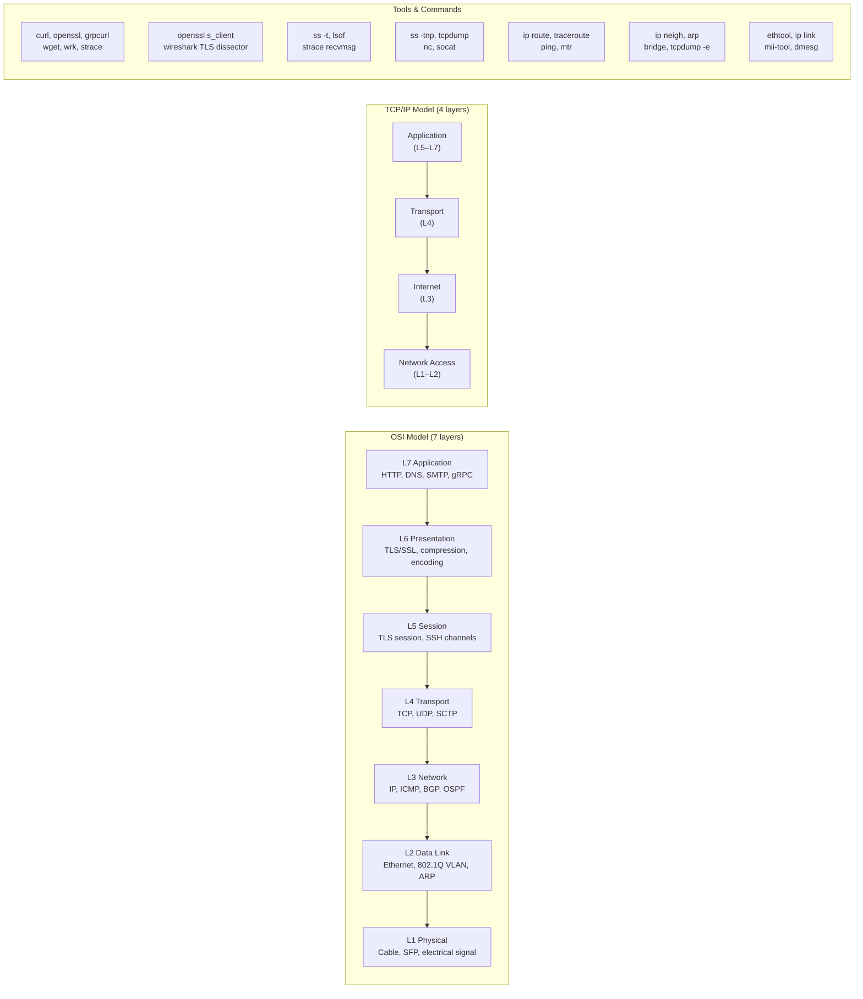
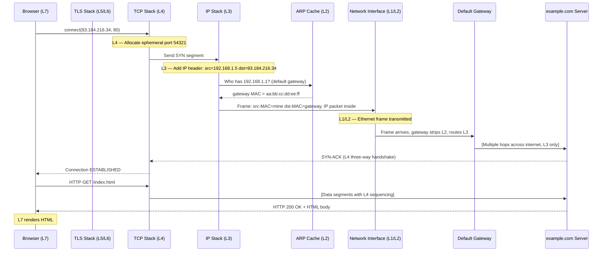
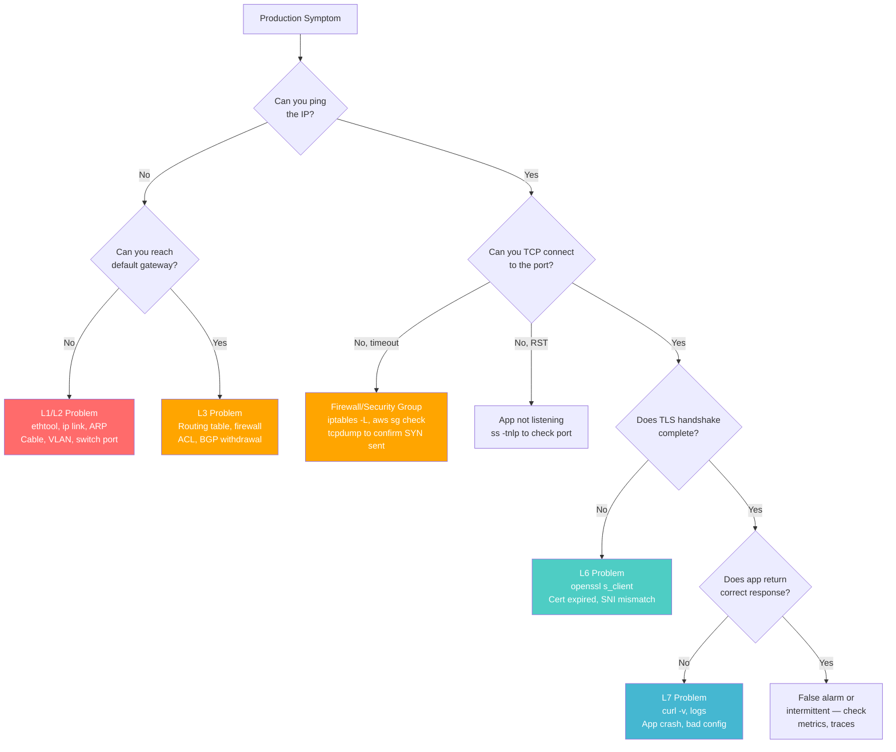

# OSI and TCP/IP Model — SRE Field Guide

## Table of Contents

- [Overview](#overview)
- [OSI vs TCP/IP Model Mapping](#osi-vs-tcpip-model-mapping)
- [Layer-by-Layer: Tools, Failures, and First Response](#layer-by-layer-tools-failures-and-first-response)
  - [Layer 1 — Physical](#layer-1-physical)
  - [Layer 2 — Data Link](#layer-2-data-link)
  - [Layer 3 — Network](#layer-3-network)
  - [Layer 4 — Transport](#layer-4-transport)
  - [Layer 5 — Session](#layer-5-session)
  - [Layer 6 — Presentation](#layer-6-presentation)
  - [Layer 7 — Application](#layer-7-application)
- [Packet Walk: HTTP Request from Browser to Server](#packet-walk-http-request-from-browser-to-server)
- [How Production Failures Present Per Layer](#how-production-failures-present-per-layer)
- [Production Failure Modes](#production-failure-modes)
- [Real-World Production Scenario](#real-world-production-scenario)
- [Debugging Guide: Layer-by-Layer Checklist](#debugging-guide-layer-by-layer-checklist)
- [Security Considerations](#security-considerations)
- [Interview Questions](#interview-questions)
  - [Basic](#basic)
  - [Intermediate](#intermediate)
  - [Advanced / Staff Level](#advanced-staff-level)

---

## Overview

The OSI and TCP/IP models are not memorization exercises — they are **debugging frameworks**. When production fails, the model tells you *which layer to interrogate first* and *which tools apply*. A senior SRE doesn't recite layers; they use layer boundaries to scope a problem from "is the physical link up?" to "is the application interpreting the response correctly?" in under 60 seconds.

Understanding layer boundaries also determines **blast radius**: a misconfigured VLAN affects all tenants on a segment (L2), while a bad TLS certificate only breaks clients enforcing certificate validation (L6/L7). Misidentifying the layer wastes hours.

---

## OSI vs TCP/IP Model Mapping



---

## Layer-by-Layer: Tools, Failures, and First Response

### Layer 1 — Physical

**What it does:** Transmits raw bits over a medium (copper, fiber, wireless).

**Tools:**
```bash
# Check link state and speed
ethtool eth0
# Expected: Speed: 10000Mb/s, Duplex: Full, Link detected: yes

# Check for physical errors (CRC, drops, carrier errors)
ip -s link show eth0
# RX: bytes  packets  errors  dropped  overrun  mcast
#     1234M   8923104  0       0        0        0   <-- errors > 0 = hardware problem

# Check kernel ring buffer for link events
dmesg | grep -i "eth0\|link\|carrier" | tail -20
```

**Failure symptoms:** Interface up/down flapping in logs, high CRC error count, speed negotiation to 100M instead of 10G, packet loss on local segment only.

**First action:** `ethtool eth0` — verify speed, duplex, and link detection. Anything other than expected = cable/SFP/switch port problem.

---

### Layer 2 — Data Link

**What it does:** Frames data for local network segment delivery. MAC addressing, VLAN tagging.

**Tools:**
```bash
# Show ARP cache (L2 MAC to L3 IP mapping)
ip neigh show
# 10.0.1.1 dev eth0 lladdr 02:42:ac:11:00:01 REACHABLE

# Show bridge/VLAN membership (on switch/hypervisor)
bridge vlan show
bridge fdb show

# Capture with MAC addresses visible
tcpdump -e -i eth0 arp
```

**Failure symptoms:** Can ping gateway IP but no internet (ARP cache stale/poisoned), two hosts on same subnet can't reach each other (VLAN misconfiguration), duplicate IP errors in kernel log.

**First action:** `ip neigh show` — verify MAC for gateway is correct and not FAILED state.

---

### Layer 3 — Network

**What it does:** Routes packets between networks using IP addresses. ICMP lives here.

**Tools:**
```bash
# Routing table
ip route show
ip route get 8.8.8.8   # Which interface/gateway for a specific destination

# ICMP reachability
ping -c 4 10.0.1.1
traceroute -n 8.8.8.8   # -n avoids DNS delays

# MTR: combines ping + traceroute, shows per-hop loss%
mtr --report --report-cycles 20 8.8.8.8
```

**Failure symptoms:** Traceroute shows packet loss starting at a specific hop (routing loop or black hole), asymmetric routing (packets go one path, replies take another — breaks stateful firewalls), ICMP Type 3 Code 1 "Host Unreachable" (wrong route or no route to host).

**First action:** `ip route get <dest>` — confirm the correct gateway is selected.

---

### Layer 4 — Transport

**What it does:** End-to-end delivery, multiplexing via ports, reliability (TCP) or speed (UDP).

**Tools:**
```bash
# Active connections with process info
ss -tnp
# ESTAB  0  0  10.0.0.5:52341  10.0.1.100:443  users:(("curl",pid=12345,fd=3))

# Socket statistics summary
ss -s
# TCP:   1024 (estab 892, closed 12, orphaned 3, timewait 108)

# TIME_WAIT and CLOSE_WAIT counts
ss -tn state time-wait | wc -l
ss -tn state close-wait | wc -l

# Capture SYN packets (connection establishment)
tcpdump -i eth0 'tcp[tcpflags] & tcp-syn != 0'
```

**Failure symptoms:** Connection timeouts (SYN sent, no SYN-ACK — firewall drop), CLOSE_WAIT accumulation (application not closing sockets), TIME_WAIT exhaustion (port reuse failure), RST packets (connection rejected at application).

**First action:** `ss -tnp` to see connection states, then `tcpdump` to confirm whether SYN reaches destination.

---

### Layer 5 — Session

**What it does:** Manages session lifecycle. In practice, TLS session establishment and resumption, SSH multiplexed channels.

**Tools:**
```bash
# TLS session inspection
openssl s_client -connect example.com:443 -tls1_3
# Look for: Session-ID, TLSv1.3, Cipher

# Check if TLS session resumption is working (0-RTT / session tickets)
openssl s_client -connect example.com:443 -reconnect 2>&1 | grep -E "Reused|New"
```

**Failure symptoms:** TLS session not resuming (latency spike every request), session ID exhaustion on server.

---

### Layer 6 — Presentation

**What it does:** Data encoding, encryption/decryption, compression. TLS handshake and certificate validation.

**Tools:**
```bash
# Full TLS handshake inspection
openssl s_client -connect api.example.com:443 -showcerts -verify 5

# Check certificate details
echo | openssl s_client -connect example.com:443 2>/dev/null | \
  openssl x509 -noout -dates -subject -issuer

# Test specific TLS version support
openssl s_client -connect example.com:443 -tls1_2
openssl s_client -connect example.com:443 -tls1_3
```

**Failure symptoms:** Certificate expired/untrusted (curl error 60), SNI mismatch (wrong cert served), cipher suite negotiation failure (TLS handshake alert).

---

### Layer 7 — Application

**What it does:** The actual application protocol. HTTP, DNS, gRPC, SMTP.

**Tools:**
```bash
# HTTP response headers and body
curl -v https://api.example.com/health

# HTTP/2 with verbose output
curl --http2 -v https://example.com

# DNS query
dig @8.8.8.8 example.com A +stats

# gRPC health check
grpcurl -plaintext localhost:50051 grpc.health.v1.Health/Check
```

**Failure symptoms:** HTTP 502 (upstream connection failure), HTTP 504 (upstream timeout), DNS SERVFAIL (resolver can't complete query), application-level errors misidentified as network problems.

---

## Packet Walk: HTTP Request from Browser to Server

This traces a single HTTP GET from a browser to `http://example.com/index.html`.



**Key layer transitions:**
1. Browser generates HTTP request (L7)
2. TCP wraps in segment with source/dest port, seq numbers (L4)
3. IP wraps in packet with src/dst IP, TTL (L3)
4. ARP resolves next-hop MAC address (L2)
5. Ethernet frame transmitted on wire (L1/L2)
6. At each router: L1/L2 stripped and rebuilt; L3 IP header TTL decremented

---

## How Production Failures Present Per Layer



---

## Production Failure Modes

| Layer | Failure | Symptoms | Detection | Fix |
|-------|---------|----------|-----------|-----|
| L1 | Duplex mismatch | ~50% packet loss, CRC errors | `ethtool eth0` shows half-duplex | Force full-duplex both ends |
| L1 | Dirty/faulty SFP | Intermittent link drops | `dmesg` link up/down events | Replace SFP transceiver |
| L2 | ARP cache poisoned | Traffic hijacked or dropped | `arp -n` shows unexpected MAC | Static ARP entries, DAI on switch |
| L2 | VLAN misconfiguration | Hosts on same subnet can't communicate | `bridge vlan show`, `tcpdump -e` | Correct trunk/access port VLAN |
| L3 | Missing route | EHOSTUNREACH or routing loop | `ip route get <dst>` wrong gateway | Add/fix route, check BGP |
| L3 | MTU black hole | Large transfers fail, small ones succeed | `ping -s 1400` vs `ping -s 64` | Fix PMTUD, clamp MSS |
| L4 | Firewall silently drops | Connection timeout (not RST) | `tcpdump` SYN with no SYN-ACK | Add firewall rule, security group |
| L4 | Port exhaustion | `EADDRNOTAVAIL` errors | `ss -s`, ephemeral port count | Tune `ip_local_port_range` |
| L5/L6 | Certificate expired | `curl: (60) SSL certificate expired` | `openssl s_client` check dates | Renew cert, automate with ACME |
| L7 | App misconfigured | HTTP 502/504 | `curl -v`, application logs | Fix upstream config |

---

## Real-World Production Scenario

**Incident:** "Service A works, Service B on same host can't reach the database — same subnet, same security group."

**Timeline:**
- 14:23 — Alerts: `db_connection_errors` rising for service-b, service-a healthy
- 14:25 — On-call: `curl` from service-b pod to DB port times out, works from service-a pod
- 14:27 — `ss -tnp` on service-b host: hundreds of `CLOSE_WAIT` connections to DB IP
- 14:28 — `ip neigh show` on service-b host: `10.0.1.50 dev eth0 lladdr 00:00:00:00:00:00 FAILED`
- 14:29 — ARP failure — the DB's IP has no MAC in cache, ARP requests failing

**Root cause:** A database migration had changed the DB's IP address from `10.0.1.50` to `10.0.1.51`. Service-B's application config still pointed to `10.0.1.50`. The stale ARP entry eventually expired to FAILED state. Service-A used a DNS name that had been updated.

**Fix:** Updated service-B's DB connection string to use the DNS name. Added monitoring for ARP FAILED entries.

**Lesson:** Hardcoded IPs bypass the update mechanisms (DNS TTL). Always use service discovery names, not IPs.

---

## Debugging Guide: Layer-by-Layer Checklist

```bash
# ============================================================
# STEP 1: L1 — Is the link up?
# ============================================================
ip link show eth0
# Should show: state UP, not state DOWN or UNKNOWN

ethtool eth0 | grep -E "Speed|Duplex|Link"
# Speed: 10000Mb/s, Duplex: Full, Link detected: yes

ip -s link show eth0 | grep -A2 "RX:"
# errors column should be 0

# ============================================================
# STEP 2: L2 — Is ARP resolving the gateway?
# ============================================================
ip route show default
# default via 10.0.0.1 dev eth0

ip neigh show 10.0.0.1
# 10.0.0.1 dev eth0 lladdr 02:42:ac:11:00:01 REACHABLE
# If FAILED or no entry: ARP broken — tcpdump -e to watch ARP

# ============================================================
# STEP 3: L3 — Does routing work?
# ============================================================
ping -c 3 -W 1 10.0.0.1    # Gateway
ping -c 3 -W 1 8.8.8.8     # Internet

ip route get 10.0.2.50     # Specific host — which interface/gateway?
# 10.0.2.50 via 10.0.0.1 dev eth0 src 10.0.0.5 uid 0

traceroute -n -q 1 10.0.2.50   # -q 1: one probe per hop (faster)

# ============================================================
# STEP 4: L4 — Does TCP connect?
# ============================================================
# Test TCP connect (no data exchange, just SYN/SYN-ACK)
timeout 5 bash -c "echo > /dev/tcp/10.0.2.50/443" && echo "open" || echo "closed/filtered"

# Or with nc
nc -zv -w 3 10.0.2.50 443

# Simultaneously capture to see what's happening
tcpdump -i eth0 -n 'host 10.0.2.50 and port 443' -w /tmp/debug.pcap &

# ============================================================
# STEP 5: L6 — Does TLS handshake complete?
# ============================================================
openssl s_client -connect 10.0.2.50:443 -servername api.example.com

# Check cert validity
echo | openssl s_client -connect 10.0.2.50:443 -servername api.example.com 2>/dev/null \
  | openssl x509 -noout -dates

# ============================================================
# STEP 6: L7 — Does the application respond correctly?
# ============================================================
curl -v --max-time 10 https://api.example.com/health

# With specific host header (bypass DNS)
curl -v --resolve api.example.com:443:10.0.2.50 https://api.example.com/health
```

---

## Security Considerations

**L1/L2:**
- Physical access to a switch port = ability to inject frames. BPDU guard prevents rogue switches.
- ARP spoofing poisons L2 caches to redirect traffic (MITM). Mitigation: Dynamic ARP Inspection (DAI) on switches, static ARP entries for critical hosts.
- VLAN hopping (double-tagging): an attacker on VLAN 10 sends double-tagged frames to reach VLAN 20. Fix: never use VLAN 1 as native VLAN; configure explicit native VLAN on all trunks.

**L3:**
- IP spoofing: packets can claim any source IP. Mitigation: uRPF (unicast Reverse Path Forwarding) — drop packets arriving on an interface where the source IP's return route does NOT use that interface.
- BGP hijacking: advertising more specific prefixes to attract traffic. RPKI/ROA validation prevents accepting invalid advertisements.

**L4:**
- SYN flood: attacker sends SYN packets without completing handshake, exhausting `SYN_RCVD` state. Mitigation: SYN cookies (`net.ipv4.tcp_syncookies=1`).
- Port scanning: `nmap` operates at L4. Detection via connection rate monitoring.

**L7:**
- HTTP request smuggling exploits disagreements between proxy and backend on where one request ends (L7 parsing). Ensure consistent `Content-Length` / `Transfer-Encoding` handling.

---

## Interview Questions

### Basic

**Q: Name the 7 OSI layers.**

Junior answer: "Physical, Data Link, Network, Transport, Session, Presentation, Application."

Staff SRE answer: "The layers I care about operationally: L1 for physical link health, L2 for MAC/VLAN — `ip neigh` and `ethtool`, L3 for routing — `ip route` and `ping`, L4 for TCP state — `ss -tnp`, L6/L7 for TLS and application behavior — `openssl s_client` and `curl -v`. The division at L5/L6 is mostly academic in practice; TLS spans both."

**Q: What's the difference between OSI and TCP/IP?**

TCP/IP collapses OSI L5-L7 into a single Application layer and merges L1-L2 into Network Access. TCP/IP is the real-world implementation; OSI is the reference model used for discussion. When diagnosing, OSI gives finer granularity — L6 TLS failure vs L7 application failure are very different problems with different toolsets.

### Intermediate

**Q: A service works from your laptop but not from a VM in the same datacenter. How do you approach this?**

1. Start at L3: can the VM ping the service IP? If no, routing issue.
2. Check L2: does `ip neigh show` show the gateway as REACHABLE? If FAILED, ARP problem.
3. Check L4: `nc -zv <ip> <port>` — timeout means firewall/SG drop, RST means nothing listening.
4. Check L6: `openssl s_client` — certificate trust store difference between laptop and VM?
5. Check L7: exact same `curl -v` command — different response? Check headers, redirects.

**Q: You see packet loss to a remote host but only for large pings (`ping -s 1400`). What's happening?**

MTU black hole. Large packets requiring fragmentation are being silently dropped (a router in the path is blocking ICMP Type 3 Code 4 "Fragmentation Needed"). Fix: set `ip route change default ... mtu 1400` or configure MSS clamping with iptables `TCPMSS --clamp-mss-to-pmtu`.

### Advanced / Staff Level

**Q: In what scenarios does layer separation break down and why?**

Several real examples:
1. **NAT breaks L3/L4 independence**: modifying the IP header (L3) requires updating TCP checksum (L4) because TCP checksum includes a pseudo-header with source/dest IPs.
2. **ICMP carries IP headers**: ICMP error messages (L3) embed the first 8 bytes of the triggering IP packet including L4 port numbers — PMTUD depends on L4 port information embedded in L3 messages.
3. **VXLAN**: L2 frames are encapsulated in L3/L4 UDP packets — L2 Ethernet frames (the original L2) become payload of L3/L4 (the outer packet). What layer is VXLAN? L4.5.
4. **TLS over TCP**: TLS record boundaries do not align with TCP segment boundaries. A TLS record can span multiple TCP segments, or a segment can contain multiple TLS records — middle-box inspection that reassembles at L4 must understand L6 framing.

**Q: How would you debug a situation where connections succeed but have high latency spikes every ~30 seconds?**

Likely TCP keepalive or TLS session resumption issue. Steps: `ss -tnp` to capture state, `tcpdump -i eth0 -w /tmp/cap.pcap` then analyze in Wireshark looking for TCP retransmits or TLS ClientHello (new handshake = session not resuming). Check `net.ipv4.tcp_keepalive_time` (default 7200s). Also check if a NAT device or firewall is timing out idle connections after 30s and the application isn't detecting it — tune TCP keepalives to 25s to stay under common 30s NAT timeouts.
