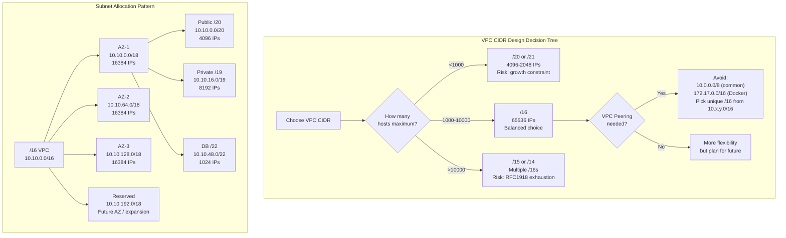
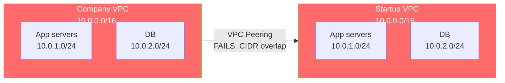

# IP Addressing and Subnetting — SRE Field Guide

## Table of Contents

- [Overview](#overview)
- [CIDR Notation and Subnetting Math](#cidr-notation-and-subnetting-math)
- [Subnetting Cheat Sheet](#subnetting-cheat-sheet)
  - [Special CIDR Cases](#special-cidr-cases)
- [RFC1918 Private Address Ranges](#rfc1918-private-address-ranges)
- [VPC CIDR Design Trade-offs](#vpc-cidr-design-trade-offs)
- [IPv6 Addressing](#ipv6-addressing)
- [Real-World Production Scenario: Overlapping CIDR Blocking VPC Peering](#real-world-production-scenario-overlapping-cidr-blocking-vpc-peering)
- [Interview: Design Subnets for 3-Tier App Scaling to 10,000 Hosts](#interview-design-subnets-for-3-tier-app-scaling-to-10000-hosts)
- [Failure Modes](#failure-modes)
- [Debugging Guide](#debugging-guide)
- [Security Considerations](#security-considerations)
- [Interview Questions](#interview-questions)
  - [Basic](#basic)
  - [Intermediate](#intermediate)
  - [Advanced / Staff Level](#advanced-staff-level)

---

## Overview

Subnetting is one of those topics where a wrong decision costs months of migration work. Choosing a `/24` for a Kubernetes node subnet that eventually needs 300 nodes, or selecting overlapping RFC1918 ranges that prevent VPC peering with a partner — these are expensive mistakes made at design time. This guide covers the math, the cloud-specific trade-offs, and the real failure modes that appear in production.

---

## CIDR Notation and Subnetting Math

CIDR (Classless Inter-Domain Routing) notation represents an IP address and its network prefix length: `10.0.0.0/24`.

**Key formulas:**
- **Host bits** = 32 - prefix_length
- **Total addresses** = 2^(host_bits)
- **Usable hosts** = 2^(host_bits) - 2 (subtract network and broadcast address)
- **Subnet mask** = 32 bits with first `prefix_length` bits set to 1

```
10.0.0.0/24:
  Binary mask: 11111111.11111111.11111111.00000000
  Network:     10.0.0.0
  Broadcast:   10.0.0.255
  Usable:      10.0.0.1 – 10.0.0.254 (254 hosts)
```

**Cloud note:** AWS, GCP, and Azure each reserve 5 addresses per subnet (not 2), so a `/24` gives 251 usable IPs, not 254. AWS reserves: `.0` (network), `.1` (VPC router), `.2` (DNS), `.3` (future use), `.255` (broadcast).

---

## Subnetting Cheat Sheet

| CIDR | Prefix | Total IPs | Usable (Linux) | Usable (AWS) | Subnets of /24 |
|------|--------|-----------|----------------|--------------|----------------|
| /32  | 255.255.255.255 | 1 | 1 (host route) | 1 | — |
| /31  | 255.255.255.254 | 2 | 2 (point-to-point) | 0 | — |
| /30  | 255.255.255.252 | 4 | 2 | — | 64 |
| /29  | 255.255.255.248 | 8 | 6 | 3 | 32 |
| /28  | 255.255.255.240 | 16 | 14 | 11 | 16 |
| /27  | 255.255.255.224 | 32 | 30 | 27 | 8 |
| /26  | 255.255.255.192 | 64 | 62 | 59 | 4 |
| /25  | 255.255.255.128 | 128 | 126 | 123 | 2 |
| /24  | 255.255.255.0 | 256 | 254 | 251 | 1 |
| /23  | 255.255.254.0 | 512 | 510 | 507 | — |
| /22  | 255.255.252.0 | 1024 | 1022 | 1019 | — |
| /21  | 255.255.248.0 | 2048 | 2046 | 2043 | — |
| /20  | 255.255.240.0 | 4096 | 4094 | 4091 | — |
| /16  | 255.255.0.0 | 65536 | 65534 | 65531 | 256x /24 |
| /8   | 255.0.0.0 | 16777216 | 16777214 | — | — |

### Special CIDR Cases

**`/32` — Single host route:**
```bash
# Route to a specific host, bypassing subnet routing
ip route add 10.50.0.5/32 via 10.0.0.1 dev eth0

# Common in: Kubernetes pod routing (Calico routes each pod as /32)
# AWS ENI secondary IPs are assigned as /32
# Loopback: 127.0.0.1/32
```

**`/31` — Point-to-point links (RFC 3021):**
```bash
# Two addresses, no network/broadcast waste
# 10.0.0.0/31: host A = 10.0.0.0, host B = 10.0.0.1
# Used on: router-to-router links, BGP peering sessions
# NOT suitable for subnets with more than 2 endpoints
ip addr add 10.0.0.0/31 dev eth1
```

**`/30` — Minimal subnet with gateway:**
```bash
# 4 addresses: .0 network, .1 gateway, .2 host, .3 broadcast
# Older convention for point-to-point when /31 not supported
# Common in: VPN tunnel addresses, older carrier configurations
```

---

## RFC1918 Private Address Ranges

| Range | CIDR | Size | Common Use |
|-------|------|------|------------|
| `10.0.0.0` – `10.255.255.255` | `10.0.0.0/8` | 16.7M addresses | Enterprise networks, cloud VPCs |
| `172.16.0.0` – `172.31.255.255` | `172.16.0.0/12` | 1.05M addresses | Mid-size networks, Docker default |
| `192.168.0.0` – `192.168.255.255` | `192.168.0.0/16` | 65,536 addresses | Home/small office, lab environments |

**Why these matter in cloud:**

Docker default bridge: `172.17.0.0/16`. If your VPC uses `172.17.0.0/16`, containers can't reach VPC resources — Docker's bridge takes precedence in the routing table on EC2 instances.

```bash
# Check Docker bridge network
docker network inspect bridge | grep Subnet
# If: "Subnet": "172.17.0.0/16" and your VPC uses 172.17.x.x -- conflict

# Fix: change Docker's default bridge
# In /etc/docker/daemon.json:
# {"bip": "172.31.0.1/16"}  <-- use a non-overlapping range
```

**Also note:** `100.64.0.0/10` (RFC 6598) is Carrier-Grade NAT space. AWS uses `100.64.0.0/10` for VPC-internal infrastructure (e.g., the VPC router is reachable at `169.254.0.1` on some interfaces). `169.254.0.0/16` (RFC 3927) is link-local — AWS instance metadata lives at `169.254.169.254`.

---

## VPC CIDR Design Trade-offs



**Design principles:**
1. **Go bigger than you think:** Expanding a VPC CIDR requires adding a secondary CIDR block (AWS limit: 5 per VPC) or migrating. Migration = DNS changes, security group rewrites, re-IP of everything. Use `/16` as default.
2. **Avoid `10.0.0.0/8` monolith:** Every VPC gets the same range — peering impossible. Use a CIDR allocation registry (Terraform `cidrsubnet()`, AWS IPAM).
3. **Reserve space per AZ:** Design for 4 AZs even if you use 3 today. Allocate equal-sized blocks per AZ for predictability.
4. **Subnet sizing by tier:**
   - Public subnets (NAT GW, ALBs): small `/24` each — very few IPs needed
   - Private subnets (app servers, pods): large `/19` or `/18`
   - DB subnets: medium `/22`

---

## IPv6 Addressing

**128-bit addresses** written as 8 groups of 4 hex digits: `2001:0db8:85a3:0000:0000:8a2e:0370:7334`

**Compression rules:**
- Leading zeros in a group can be omitted: `0db8` → `db8`
- Consecutive all-zero groups replaced with `::` (once only): `::1` = `0:0:0:0:0:0:0:1` = loopback

**Key prefixes:**
- `::1/128` — loopback
- `fe80::/10` — link-local (auto-configured, not routable, used for NDP)
- `fd00::/8` — unique local (RFC4193, equivalent to RFC1918 private)
- `2000::/3` — global unicast (public internet)

**`/64` prefix convention:**

The bottom 64 bits are the Interface ID. This is the standard allocation size — `/64` per subnet. Never allocate smaller than `/64` (SLAAC requires it).

```bash
# SLAAC (Stateless Address Autoconfiguration)
# Host derives its own address from /64 prefix + EUI-64 from MAC
# No DHCP needed for addresses (DHCPv6 still used for DNS, NTP)

# AWS: every VPC gets an IPv6 /56, each subnet gets a /64
aws ec2 describe-subnets --query 'Subnets[*].Ipv6CidrBlockAssociationSet'
```

**SLAAC address derivation:**
```
MAC: 00:1A:2B:3C:4D:5E
EUI-64: 021A:2BFF:FE3C:4D5E  (insert FFFE in middle, flip 7th bit)
Link-local: fe80::021a:2bff:fe3c:4d5e
Global: <prefix>::021a:2bff:fe3c:4d5e
```

**Privacy concern:** SLAAC exposes MAC address in IPv6 address. RFC 4941 "temporary addresses" randomize the Interface ID — Linux/macOS use these by default for outbound connections.

---

## Real-World Production Scenario: Overlapping CIDR Blocking VPC Peering

**Situation:** Company acquires a startup. Must connect their AWS VPC (`10.0.0.0/16`) with the startup's AWS VPC (`10.0.0.0/16`). VPC peering requires non-overlapping CIDRs.



**Diagnosis:**
```bash
# Attempt VPC peering creation
aws ec2 create-vpc-peering-connection \
  --vpc-id vpc-company123 \
  --peer-vpc-id vpc-startup456

# Error: "The VPCs must have non-overlapping CIDR blocks"

# Verify overlapping ranges
aws ec2 describe-vpcs --vpc-ids vpc-company123 vpc-startup456 \
  --query 'Vpcs[*].[VpcId,CidrBlock]'
# [["vpc-company123","10.0.0.0/16"],["vpc-startup456","10.0.0.0/16"]]
```

**Options (ranked by effort):**

1. **Transit Gateway with NAT** (fastest, least clean): Use TGW, NAT traffic through a proxy layer that re-IPs traffic. Adds latency, complexity.

2. **Re-IP the startup VPC** (most correct, most work): Assign new CIDR (`10.50.0.0/16`) to startup VPC as secondary CIDR, migrate workloads subnet by subnet, remove old CIDR. 3-6 month project.

3. **PrivateLink** (service-specific): Expose specific startup services via VPC PrivateLink endpoints. No full network connectivity, but works for specific service integrations.

4. **Application-layer proxy** (workaround): NLB in company VPC → forwards to startup via public IPs (never expose to internet) or via direct connect. Not true peering.

**Post-incident action:** Adopt AWS IPAM (IP Address Manager) company-wide. All new VPCs get CIDR from a centrally managed pool, preventing future overlaps.

---

## Interview: Design Subnets for 3-Tier App Scaling to 10,000 Hosts

**Question:** "Design the subnet architecture for a 3-tier application (web, app, DB) in AWS that must scale to 10,000 hosts across 3 availability zones. What CIDR do you choose and why?"

**Answer framework:**

**Step 1: Calculate host requirements**
```
10,000 hosts ÷ 3 AZs = ~3,334 hosts per AZ
Plus headroom (50%): ~5,000 per AZ
App tier (largest): 5,000 hosts → need at least /19 (8190 IPs)
Web tier (ALBs, small): 100 hosts → /24 sufficient
DB tier (controlled): 50 hosts → /26 sufficient
```

**Step 2: Choose VPC CIDR**
```
Each AZ needs: /19 (app) + /24 (web) + /26 (db) = ~8,500 IPs
3 AZs × 8,500 = 25,500 IPs + overhead
Minimum VPC: /17 (32,768 IPs)
Recommendation: /16 (65,536 IPs) — gives room for new tiers, k8s pods, tooling

Choose: 10.42.0.0/16 (avoid 10.0.0.0, 172.17.0.0 — commonly used, high collision risk)
```

**Step 3: Allocate per AZ**
```
AZ-1a: 10.42.0.0/18   (16,384 IPs)
AZ-1b: 10.42.64.0/18  (16,384 IPs)
AZ-1c: 10.42.128.0/18 (16,384 IPs)
Reserved: 10.42.192.0/18

Within AZ-1a:
  Public  (ALB/NAT): 10.42.0.0/24    (251 IPs — ALBs need few IPs)
  Private (App):     10.42.1.0/19    (8,192 IPs — Kubernetes nodes + pods)
  Private (DB):      10.42.33.0/24   (251 IPs — RDS, ElastiCache)
  Private (Tools):   10.42.34.0/24   (251 IPs — monitoring, bastion)
```

**Step 4: Justify the decisions**
- `/19` for app tier: Kubernetes node IPs + pod CIDRs (if using VPC CNI). With `--max-pods=110` per node, each node needs 111 IPs from VPC.
- Public subnets deliberately small: only ALB ENIs and NAT Gateway IPs land here. Limits attack surface.
- Separate DB subnet: separate security group, separate route table (no internet gateway), enables granular network ACLs.
- Reserve `/18`: future expansion, new services, DR testing subnet.

---

## Failure Modes

| Failure | Symptoms | Detection | Fix |
|---------|----------|-----------|-----|
| CIDR overlap in VPC peering | Peering creation fails | `aws ec2 describe-vpcs` | Re-IP or use PrivateLink/TGW |
| Subnet too small for Kubernetes | Node join fails (no IP available) | `kubectl describe node` IPC exhausted | Expand subnet (secondary CIDR) |
| Docker `172.17.0.0/16` conflicts with VPC | Containers can't reach VPC IPs | `ip route show` — Docker bridge wins | Change Docker `bip` in daemon.json |
| AWS reserves 5 IPs per subnet | `/28` only gives 11 hosts, not 14 | Count IPs from console | Use `/27` or larger |
| IPv6 /64 not allocated | SLAAC fails, no IPv6 addresses | `ip -6 addr show` | Assign /64 per subnet (not /65+) |
| Secondary CIDR added but routes missing | New subnet IPs unreachable | `ip route show` in VPC route table | Add routes for secondary CIDR |

---

## Debugging Guide

```bash
# ============================================================
# Check subnet membership of an IP
# ============================================================
# Python one-liner (useful in scripts)
python3 -c "
import ipaddress
net = ipaddress.ip_network('10.0.1.0/24')
ip = ipaddress.ip_address('10.0.1.50')
print(f'{ip} in {net}: {ip in net}')
print(f'Network: {net.network_address}')
print(f'Broadcast: {net.broadcast_address}')
print(f'Hosts: {net.num_addresses - 2}')
"

# ============================================================
# Check for overlapping CIDRs (multiple networks)
# ============================================================
python3 -c "
import ipaddress
nets = ['10.0.0.0/16', '10.0.1.0/24', '172.17.0.0/16']
for i, a in enumerate(nets):
    for j, b in enumerate(nets):
        if i < j:
            na, nb = ipaddress.ip_network(a), ipaddress.ip_network(b)
            if na.overlaps(nb):
                print(f'OVERLAP: {a} overlaps {b}')
"

# ============================================================
# Calculate subnet from CIDR
# ============================================================
ipcalc 10.0.0.0/24
# or
python3 -c "
import ipaddress
n = ipaddress.ip_network('10.0.0.0/24')
print(f'Network:   {n.network_address}')
print(f'Netmask:   {n.netmask}')
print(f'Broadcast: {n.broadcast_address}')
print(f'Hosts:     {n.num_addresses - 2}')
print(f'First:     {list(n.hosts())[0]}')
print(f'Last:      {list(n.hosts())[-1]}')
"

# ============================================================
# Find which subnet an IP belongs to (from route table)
# ============================================================
ip route get 10.0.1.50
# 10.0.1.50 dev eth0 src 10.0.1.5 uid 0
# Tells you: which interface, which source IP will be used

# ============================================================
# AWS: List all VPC CIDRs to check for conflicts
# ============================================================
aws ec2 describe-vpcs --query 'Vpcs[*].[VpcId,CidrBlock,Tags[?Key==`Name`].Value|[0]]' \
  --output table

# ============================================================
# Check available IPs in an AWS subnet
# ============================================================
aws ec2 describe-subnets \
  --query 'Subnets[*].[SubnetId,CidrBlock,AvailableIpAddressCount,Tags[?Key==`Name`].Value|[0]]' \
  --output table
```

---

## Security Considerations

**Subnet segmentation as security boundary:**
- Public subnets: only internet-facing load balancers and NAT Gateways. No application code.
- Private subnets: application servers. Outbound via NAT only. No inbound from internet.
- Isolated subnets: databases. No route to/from internet, no NAT gateway. Only reachable from private subnet.

**Network ACLs (NACLs):**
- Stateless (unlike security groups) — must allow both inbound AND outbound rules explicitly
- Applied at subnet level (not instance level)
- Use for coarse-grained segmentation between subnet tiers; use security groups for fine-grained

**RFC1918 as false security:**
- Private IPs do NOT mean private traffic. A misconfigured security group on a VPC endpoint or a peering route can expose internal services. Defense in depth: security groups + NACLs + no public route.

**IPv6 attack surface:**
- Enabling IPv6 on a subnet without updating security groups can accidentally expose instances — IPv6 bypasses NAT, meaning instances may be directly reachable from the internet if the security group has permissive rules.
- Always audit security groups for `::0/0` IPv6 rules when enabling IPv6.

---

## Interview Questions

### Basic

**Q: What is CIDR notation and how do you calculate the number of hosts in a subnet?**

A: CIDR (Classless Inter-Domain Routing) combines an IP address with a prefix length (e.g., `10.0.1.0/24`). The prefix length indicates how many bits are the network portion. Hosts = 2^(32 - prefix) - 2 (subtract network and broadcast addresses). For `/24`: 2^8 - 2 = 254 hosts. In AWS, subtract 5 more (AWS reserves first 4 IPs + broadcast), so a `/24` gives 251 usable IPs.

**Q: What are the RFC1918 private address ranges?**

A: `10.0.0.0/8`, `172.16.0.0/12`, and `192.168.0.0/16`. These are non-routable on the public internet. AWS VPCs must use these ranges. The `172.17.0.0/16` range is Docker's default bridge network — avoid it in VPC design to prevent conflicts.

**Q: What's the difference between a /28 and a /24?**

A: `/24` has 256 IPs (254 usable); `/28` has 16 IPs (14 usable, 11 in AWS). `/28` is the minimum subnet size for an AWS Application Load Balancer — it needs at least 8 free IPs per AZ for its ENIs.

### Intermediate

**Q: Why should you avoid using `10.0.0.0/16` as your VPC CIDR?**

A: It's the most commonly used range, leading to CIDR overlap issues in VPC peering, AWS Transit Gateway, or Direct Connect connections. If you later need to peer with a partner's VPC or acquire a company, overlapping CIDRs block connectivity with no easy fix. Instead choose non-obvious ranges like `10.42.0.0/16` or use AWS IPAM to allocate from a centralized, non-overlapping pool.

**Q: A Kubernetes cluster is running out of pod IPs. How do you diagnose and fix it?**

A: Diagnosis: `kubectl describe node <node>` shows `PodCIDR` and `kubectl get pods --all-namespaces | wc -l` vs the node's max pods. With AWS VPC CNI, each node borrows IPs directly from its subnet — large instance types get more IPs. Fixes:

1. use a larger subnet,
2. enable prefix delegation in VPC CNI (`ENABLE_PREFIX_DELEGATION=true`) which allocates /28 prefixes per ENI instead of individual IPs,
3. switch to secondary CIDR for pods.

**Q: How does IPv6 SLAAC work, and what's EUI-64?**

A: SLAAC (Stateless Address Autoconfiguration) lets hosts self-configure IPv6 addresses from the /64 subnet prefix advertised by the router via ICMPv6 Router Advertisement. The host generates the interface ID using EUI-64: take the 48-bit MAC address, split it in the middle, insert `FF:FE`, and flip the 7th bit (universal/local bit). This creates a unique 64-bit host portion. Privacy extensions (RFC 4941) randomize this to prevent tracking.

### Advanced / Staff Level

**Q: Design the subnet architecture for a 3-tier application (web, app, DB) in AWS that must scale to 10,000 hosts across 3 availability zones.**

A: See the [design walkthrough above](#interview-design-subnets-for-3-tier-app-scaling-to-10000-hosts).

Key principles: Choose a `/16` VPC to allow expansion. Allocate a `/18` per AZ (16K IPs each). Within each AZ: `/24` for public (ALB/NAT ENIs only — keep attack surface minimal), `/19` for app tier (Kubernetes nodes + VPC CNI pods consume IPs rapidly — with 110 pods/node, each node needs 111 IPs), `/24` for DB (RDS/ElastiCache, no internet route). Reserve one `/18` for future tiers. Avoid `10.0.0.0/8` prefix origins that conflict with common partner/acquired-company VPCs.

**Q: You need to peer two VPCs with overlapping `10.0.0.0/16` CIDRs after an acquisition. What are your options and trade-offs?**

A: Options in order of preference:
1. **PrivateLink** (preferred for specific services): Expose needed services as VPC endpoints. No network-level access. Requires each service to be explicitly plumbed — operational overhead at scale.
2. **Transit Gateway with NAT**: TGW routes traffic; a NAT layer (running NAT instances or ALB) re-IPs traffic before forwarding. Adds hop + latency. Operationally complex.
3. **Re-IP one VPC** (most correct, highest effort): Add secondary CIDR to the startup VPC (`10.50.0.0/16`), migrate workloads subnet-by-subnet using dual-stack or DNS cutover, then remove the old CIDR. 3–6 month project in production, but eliminates the architectural debt.
4. **Application proxy** (workaround): Route traffic through an API layer instead of network-level connectivity. No true peering, but works for simple API consumption patterns.

Recommendation: Use PrivateLink immediately to unblock integration, fund a re-IP project for long-term correctness, and adopt AWS IPAM company-wide to prevent recurrence.
