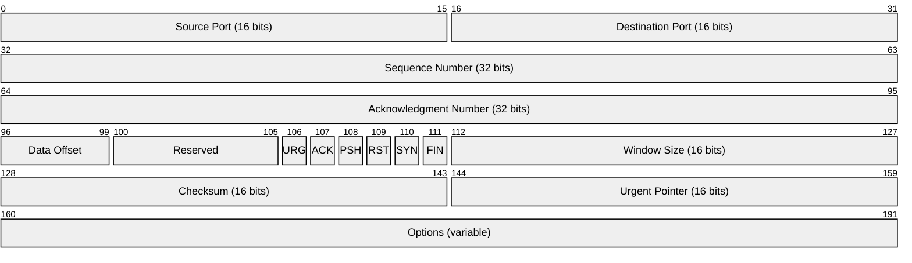
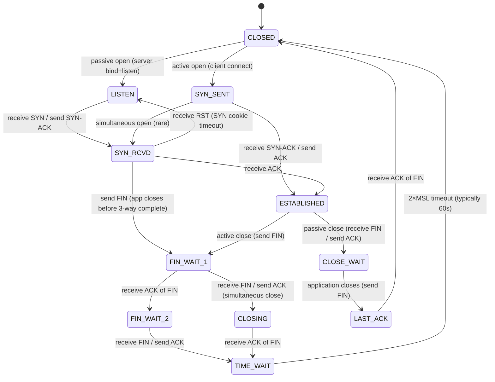
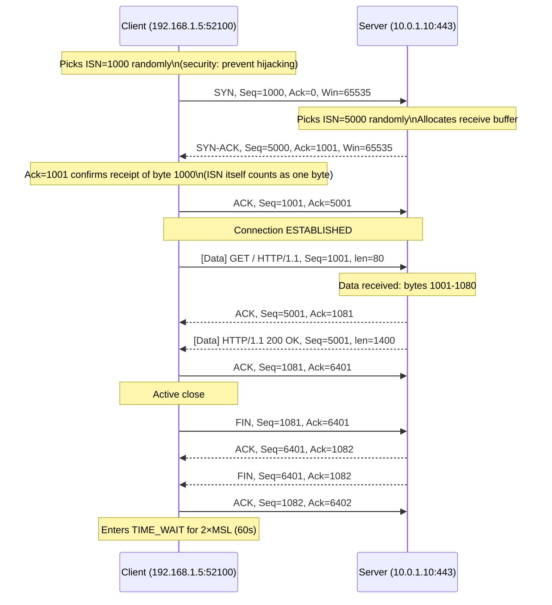
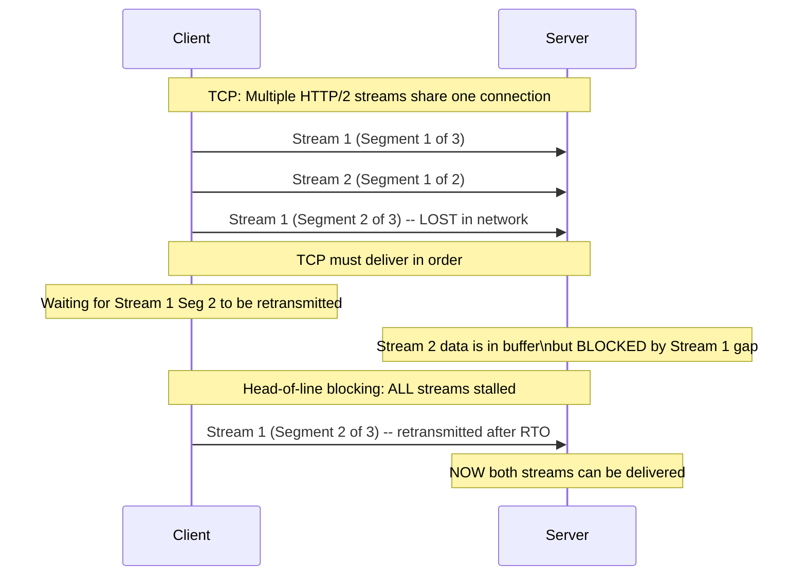

# TCP and UDP Deep Dive — SRE Field Guide

## Table of Contents

- [Overview](#overview)
- [TCP Header Deep Dive](#tcp-header-deep-dive)
  - [TCP Flag Reference](#tcp-flag-reference)
- [TCP State Machine](#tcp-state-machine)
  - [State Descriptions and Production Implications](#state-descriptions-and-production-implications)
- [TCP Three-Way Handshake with Sequence Numbers](#tcp-three-way-handshake-with-sequence-numbers)
- [TCP Congestion Control: CUBIC vs BBR](#tcp-congestion-control-cubic-vs-bbr)
  - [Why Congestion Control Matters](#why-congestion-control-matters)
- [Retransmission: RTO, Backoff, and Spurious Retransmits](#retransmission-rto-backoff-and-spurious-retransmits)
  - [RTO Calculation (RFC 6298)](#rto-calculation-rfc-6298)
  - [Exponential Backoff](#exponential-backoff)
  - [Spurious Retransmits](#spurious-retransmits)
- [CLOSE_WAIT and TIME_WAIT: Production Incidents](#close_wait-and-time_wait-production-incidents)
  - [CLOSE_WAIT Accumulation](#close_wait-accumulation)
  - [TIME_WAIT Accumulation](#time_wait-accumulation)
- [Production Scenario: High Latency Spike from TCP Retransmissions](#production-scenario-high-latency-spike-from-tcp-retransmissions)
  - [Step 1: Confirm retransmits are happening](#step-1-confirm-retransmits-are-happening)
  - [Step 2: Identify which connections are retransmitting](#step-2-identify-which-connections-are-retransmitting)
  - [Step 3: Capture the packet evidence](#step-3-capture-the-packet-evidence)
  - [Step 4: Identify the root cause from evidence](#step-4-identify-the-root-cause-from-evidence)
- [UDP: When to Use It](#udp-when-to-use-it)
  - [Head-of-Line Blocking: Why TCP Fails for Multiplexed Streams](#head-of-line-blocking-why-tcp-fails-for-multiplexed-streams)
- [Failure Modes](#failure-modes)
- [Security Considerations](#security-considerations)
- [Interview Questions](#interview-questions)
  - [Basic](#basic)
  - [Intermediate](#intermediate)
  - [Advanced / Staff Level](#advanced-staff-level)

---

## Overview

TCP is the most debuggable protocol in the stack — its state machine is observable, its headers contain sequence numbers, and every interesting event (retransmit, window shrink, RST) is visible in a packet capture. Understanding TCP internals separates engineers who can resolve "intermittent connection issues" from those who file tickets. This guide covers the complete TCP lifecycle, the failure modes that appear in production at scale, and the exact debugging workflow.

---

## TCP Header Deep Dive



### TCP Flag Reference

| Flag | Hex | When it appears | What it means operationally |
|------|-----|-----------------|----------------------------|
| **SYN** | 0x002 | Connection initiation | Client → Server: "I want to connect, my ISN is X" |
| **SYN-ACK** | 0x012 | Connection acceptance | Server → Client: "Accepted, my ISN is Y, I got your X" |
| **ACK** | 0x010 | After every received segment | "I've received everything up to byte N" |
| **FIN** | 0x001 | Graceful close | "I have no more data to send" (half-close) |
| **RST** | 0x004 | Immediate termination | "Abort — something is wrong, state is invalid" |
| **PSH** | 0x008 | Data delivery hint | "Push this to the application now, don't buffer" |
| **URG** | 0x020 | Rarely used | Out-of-band data pointer; mostly legacy |

**RST causes in production:**
- Port not listening (firewall would drop silently, RST means the host received it)
- Packet arrives for a connection that no longer exists (stale packet after restart)
- Application explicitly closes a socket with unread data (`SO_LINGER` with `l_linger=0`)
- Load balancer drains a backend and RSTs in-flight connections
- Firewall policy reset (AWS Security Group rule removal mid-connection)

---

## TCP State Machine



### State Descriptions and Production Implications

| State | Which side | What's happening | SRE concern |
|-------|-----------|-----------------|-------------|
| `LISTEN` | Server | Socket open, waiting for SYN | `ss -tnlp` to verify |
| `SYN_SENT` | Client | SYN sent, waiting for SYN-ACK | Timeout = firewall drop or server unreachable |
| `SYN_RCVD` | Server | SYN-ACK sent, waiting for ACK | Many = SYN flood in progress |
| `ESTABLISHED` | Both | Active connection | Normal operation |
| `FIN_WAIT_1` | Active closer | FIN sent, waiting for ACK | Transitional, short-lived |
| `FIN_WAIT_2` | Active closer | Got ACK of FIN, waiting for peer's FIN | Can linger if peer doesn't send FIN |
| `CLOSE_WAIT` | Passive closer | Received FIN, application hasn't closed socket | **Accumulation = application bug** |
| `LAST_ACK` | Passive closer | FIN sent, waiting for final ACK | Short-lived |
| `TIME_WAIT` | Active closer | Both FINs ACKed, waiting 2×MSL | **Accumulation = port exhaustion risk** |
| `CLOSING` | Both | Simultaneous close | Rare, self-resolves |
| `CLOSED` | Both | Socket is terminated | Normal end state |

---

## TCP Three-Way Handshake with Sequence Numbers



---

## TCP Congestion Control: CUBIC vs BBR

### Why Congestion Control Matters

TCP must discover available bandwidth without causing network collapse. Two dominant algorithms in production:

**CUBIC (default Linux prior to 5.x, still default on many systems):**
- Loss-based: treats packet loss as congestion signal
- Grows window cubically after loss event, then probes aggressively
- Weakness: on high-bandwidth delay paths (high BDP), buffer bloat causes loss before the link is truly congested — CUBIC backs off needlessly

**BBR (Bottleneck Bandwidth and RTT, Google 2016):**
- Model-based: estimates bottleneck bandwidth and RTT independently
- Doesn't wait for loss — uses bandwidth and RTT measurements to pace
- Wins on: high BDP links (satellite, long-haul WAN), paths with shallow buffers, shared links where CUBIC's aggressiveness causes unfairness

```bash
# Check current congestion control
sysctl net.ipv4.tcp_congestion_control
# net.ipv4.tcp_congestion_control = cubic

# Switch to BBR (kernel >= 4.9, module loaded)
modprobe tcp_bbr
sysctl -w net.ipv4.tcp_congestion_control=bbr
sysctl -w net.core.default_qdisc=fq  # BBR needs Fair Queue for pacing

# Verify
sysctl net.ipv4.tcp_congestion_control
# net.ipv4.tcp_congestion_control = bbr

# Per-connection: check algorithm in use
ss -tni dst 10.0.1.100
# ... bbr wscale:7,7 rto:204 rtt:1.5/0.3 ...
```

**BDP (Bandwidth-Delay Product):**
```
BDP = Bandwidth × RTT
1 Gbps × 100ms RTT = 100 Mb / 8 = 12.5 MB
Sender must have 12.5 MB in-flight to fill the pipe.

TCP window: if window < BDP, throughput is limited by window, not bandwidth.
tcp_rmem/tcp_wmem max must be >= BDP for full utilization.
```

---

## Retransmission: RTO, Backoff, and Spurious Retransmits

### RTO Calculation (RFC 6298)

```
SRTT (smoothed RTT) = (1-α) × SRTT + α × RTT_sample   (α=0.125)
RTTVAR (RTT variance) = (1-β) × RTTVAR + β × |SRTT - RTT_sample|  (β=0.25)
RTO = SRTT + max(G, 4 × RTTVAR)   (G = clock granularity, often 1ms)
Minimum RTO: 1 second (RFC 6298)
```

### Exponential Backoff

```
First retransmit: RTO
Second:          RTO × 2
Third:           RTO × 4
...
After net.ipv4.tcp_retries2 (default: 15) retransmits → connection dropped
Total timeout: ~924 seconds (15+ minutes!) with exponential backoff

SRE implication: A dead backend holds an active TCP connection for up to 15 minutes
before the OS gives up. This is why health checks + LB deregistration matter.
```

### Spurious Retransmits

A spurious retransmit occurs when the original packet arrives but the ACK is delayed — sender retransmits unnecessarily.

```bash
# Detect retransmits via netstat
netstat -s | grep -i retransmit
# 1234 segments retransmitted

# More detail with ss
ss -tni dst 10.0.1.100 | grep retrans
# retrans:3/15   (3 retransmits, 15 total TCP stats samples)

# Real-time retransmit monitoring
watch -n 1 'netstat -s | grep retransmit'

# tcpdump filter for retransmits (via sequence number tracking in Wireshark)
# In tcpdump, capture the stream:
tcpdump -i eth0 -w /tmp/tcp_debug.pcap host 10.0.1.100 and port 443
# Then open in Wireshark → Statistics → TCP Stream Graph → Time-Sequence (tcptrace)
# Retransmits appear as duplicate sequence numbers going backwards
```

---

## CLOSE_WAIT and TIME_WAIT: Production Incidents

### CLOSE_WAIT Accumulation

**What happens:** Server sends FIN (wants to close), client OS sends ACK (transitions to CLOSE_WAIT), then waits for the **application** to call `close()` on the socket. If the application never does — bug, deadlock, goroutine leak — the socket stays in CLOSE_WAIT forever.

```bash
# Detect CLOSE_WAIT buildup
ss -tn state close-wait | wc -l
# Healthy: 0-10
# Problem: 1000+

# Find which process has the stuck sockets
ss -tnp state close-wait
# CLOSE-WAIT  1  0  10.0.0.5:8080  10.0.1.20:54321  users:(("java",pid=1234,fd=45))

# Detailed view with socket memory info
ss -tnmp state close-wait

# Check if it's growing over time
watch -n 5 'ss -tn state close-wait | wc -l'
```

**Root cause pattern:** HTTP/1.1 persistent connections. Client closes connection, server's application doesn't detect EOF and doesn't close the socket. Common in Java applications with connection pooling that doesn't handle connection close events.

**Fix:** Ensure application reads EOF correctly; add `SO_KEEPALIVE` to detect dead connections; use connection pool health checks.

### TIME_WAIT Accumulation

**What happens:** After active close (the side that sent the first FIN), socket enters TIME_WAIT for `2 × MSL = 60 seconds` (MSL=30s on Linux, though `net.ipv4.tcp_fin_timeout` controls this). Purpose: ensure the final ACK reaches the peer; allow stale packets to expire.

**Problem at scale:** A service handling 10,000 connections/second generates 10,000 TIME_WAIT sockets/second. At 60 seconds each: 600,000 TIME_WAIT sockets. If using SNAT (NAT), this exhausts ports.

```bash
# Current TIME_WAIT count
ss -s
# TCP:   654321 (estab 8932, closed 2341, orphaned 12, timewait 643048)
#                                                              ^^^^^^^^^

# Per-destination breakdown
ss -tn state time-wait | awk '{print $5}' | cut -d: -f1 | sort | uniq -c | sort -rn | head

# Options to reduce TIME_WAIT impact:

# 1. Enable SO_REUSEADDR (allows binding to TIME_WAIT port — safe)
# Applications should set this. Check: setsockopt(fd, SOL_SOCKET, SO_REUSEADDR, ...)

# 2. Reduce tcp_fin_timeout (not TIME_WAIT duration, but FIN_WAIT_2 timeout)
sysctl -w net.ipv4.tcp_fin_timeout=15

# 3. Enable tcp_tw_reuse (reuse TIME_WAIT sockets for NEW outbound connections)
# Safe for outbound connections (client side)
sysctl -w net.ipv4.tcp_tw_reuse=1

# WARNING: tcp_tw_recycle was REMOVED in Linux 4.12 — causes issues with NAT
# Never use tcp_tw_recycle on modern systems

# 4. For high-scale servers: use SO_REUSEPORT to spread across multiple sockets
```

---

## Production Scenario: High Latency Spike from TCP Retransmissions

**Incident:** Payment service p99 latency spikes to 5+ seconds every few minutes. Average latency normal. No application errors in logs. CPU and memory healthy.

### Step 1: Confirm retransmits are happening

```bash
# Check retransmit stats, watching for increases
watch -n 2 'netstat -s | grep -i "retransmit\|timeout\|reset"'

# Expected output during incident:
# 1523847 segments retransmitted  <-- count increasing rapidly
# 234 connections reset due to unexpected data

# Better: get rate (delta between two samples)
netstat -s | grep retransmit; sleep 10; netstat -s | grep retransmit
# 1523847  (t=0)
# 1524102  (t=10)  --> 255 retransmits in 10 seconds = 25.5/sec
```

### Step 2: Identify which connections are retransmitting

```bash
# ss with TCP info (requires recent ss from iproute2)
ss -tni
# ESTAB  0  0  10.0.0.5:52341  10.0.1.100:5432
#   cubic wscale:7,7 rto:2000 rtt:1200/600 ato:40 mss:1448
#   rcvmss:1448 advmss:1448 cwnd:10 ssthresh:8 bytes_sent:12345678
#   bytes_retrans:450000 segs_out:8534 segs_in:8100 data_segs_out:8534
#   retrans:5/23  lost:0  sacked:0
#   ^^^^^^^^^  5 retransmits currently in-flight, 23 total

# Filter for connections with retransmits
ss -tni | awk '/retrans:[^0]/{print prev; print} {prev=$0}'
```

### Step 3: Capture the packet evidence

```bash
# Capture traffic to the database
tcpdump -i eth0 -w /tmp/payment_debug.pcap \
  'host 10.0.1.100 and port 5432' -s 96  # snaplen 96 = headers only, fast

# Run for 5 minutes, transfer to Wireshark
# In Wireshark: Analyze → Expert Information → look for [TCP Retransmission]
# Statistics → TCP Stream Graph → Time-Sequence Graph
```

### Step 4: Identify the root cause from evidence

```
Wireshark shows:
- Burst of 3-4 retransmits every ~30 seconds
- RTT suddenly spikes from 0.5ms to 800ms before retransmits
- Window size drops to near zero during spike

Interpretation: RTO timer fires (wait 1 second for ACK), retransmit sent.
Pattern of every 30 seconds → something external is causing it.
```

```bash
# Check if it's correlated with garbage collection
# (Java GC pause causes stop-the-world, no ACKs sent, other side retransmits)
grep "GC" /var/log/app/payment-service.log | grep -E "pause|stop|paused"

# Check if there's a cron job or scheduled task
grep -E "10\.0\.1\.100|postgres|db" /var/spool/cron/* /etc/cron.d/*
```

**Root cause:** PostgreSQL `autovacuum` was running every 30 seconds on a large table, causing query latency spikes on the DB side. The payment service's DB connection had `tcp_keepalive_time=7200` — keepalive only fires after 2 hours, so slow queries appeared as "silent" connection problems.

**Fix:**
1. Tune PostgreSQL `autovacuum_vacuum_cost_delay` to reduce I/O impact
2. Set `tcp_keepalive_time=30` on payment service connections to fail fast on dead connections
3. Add query timeout to payment service DB config: `statement_timeout=500ms`

---

## UDP: When to Use It

| Use Case | Why UDP wins |
|----------|-------------|
| DNS queries | Stateless, small, single request-response. TCP overhead not worth it |
| Real-time video/audio | Ordered delivery not required; late packet is useless anyway |
| QUIC (HTTP/3) | Implements own reliability on top of UDP with better loss recovery |
| SNMP, syslog | Fire-and-forget metrics/logging; occasional loss acceptable |
| NTP | Single UDP packet time sync; stateless |
| Game networking | Low latency more important than reliability |

### Head-of-Line Blocking: Why TCP Fails for Multiplexed Streams



**QUIC's solution:** Each stream is independently flow-controlled. A lost packet for Stream 1 does not block Stream 2. Only Stream 1 stalls until the retransmit.

---

## Failure Modes

| Failure | Symptoms | Detection | Fix |
|---------|----------|-----------|-----|
| SYN flood | `SYN_RCVD` sockets spike, connections time out | `ss -s` SYN_RCVD > 100; netstat -s syn | Enable SYN cookies: `sysctl net.ipv4.tcp_syncookies=1` |
| CLOSE_WAIT leak | Memory growth, file descriptor exhaustion | `ss -tn state close-wait \| wc -l` > 100 | Fix application to close sockets on EOF |
| TIME_WAIT exhaustion | `EADDRNOTAVAIL` on new connections | `ss -s` timewait count, ephemeral port range | `tcp_tw_reuse=1`, increase port range |
| Retransmit storm | Latency spikes, throughput drops | `netstat -s \| grep retransmit` rate | Find and fix the loss source (switch, VM, cable) |
| Zero window | Connection stalls | `tcpdump` window size = 0; Wireshark "ZeroWindow" | Application not reading fast enough; increase socket buffer |
| RST storm | Connection refused errors | `tcpdump 'tcp[tcpflags] & tcp-rst != 0'` | Find source: app restart, firewall change, stale connections |
| Duplicate ACKs | Multiple retransmits, poor throughput | Wireshark "DupACK" markers | Network path issue causing reordering |

---

## Security Considerations

**SYN cookies (`net.ipv4.tcp_syncookies=1`):** When the `SYN` queue is full, instead of dropping, encode a cryptographic token in the ISN. If the ACK returns with the valid token, allow the connection without needing queue state. Defeats SYN floods at the cost of not supporting TCP options (SACK, timestamps) for connections established via cookie.

**TCP sequence prediction:** Historical attack — predict ISN to inject data into a connection. Mitigated by modern OS: ISNs are randomized using a cryptographically secure source.

**RST injection:** Attacker spoofs RST packets to terminate TCP sessions (used by censorship firewalls). TCP Timestamp option makes it harder (RST must have plausible timestamp).

**TCP split handshake:** Certain intrusion detection systems misparse TCP state. Defense: strict firewall stateful tracking.

**`net.ipv4.tcp_syncookies` caveat:** With SYN cookies, you lose the ability to verify the client's MSS and TCP options. Large packet attacks may bypass if firewalls don't track TCP state properly.

---

## Interview Questions

### Basic

**Q: What is the TCP three-way handshake?**

SYN → SYN-ACK → ACK. Client sends SYN with its Initial Sequence Number, server responds with SYN-ACK (acknowledging client's ISN + 1 and sending its own ISN), client sends ACK (acknowledging server's ISN + 1). After this, both sides have synchronized sequence numbers and the connection is ESTABLISHED.

**Q: What causes a RST packet?**

Five scenarios: (1) port not listening — OS rejects the connection, (2) packet arrives for a non-existent connection, (3) application calls `close()` with data in the receive buffer, (4) explicit `SO_LINGER` reset, (5) firewall/load balancer terminating a connection. RST is always a hard abort vs FIN which is a graceful close.

### Intermediate

**Q: You have 100,000 TIME_WAIT sockets. Is this a problem?**

It depends. TIME_WAIT sockets have minimal overhead — they don't hold file descriptors (they're in the kernel's connection table). The real problem is if you're the CLIENT connecting outbound through NAT: each TIME_WAIT socket occupies an ephemeral port, and with a `/32 SNAT` IP and default port range of 32768-60999 (28,231 ports), you can only have ~28K concurrent ports to any single destination. Fix: `tcp_tw_reuse=1` allows reuse of TIME_WAIT ports for new outbound connections.

**Q: What's the difference between CLOSE_WAIT and TIME_WAIT?**

CLOSE_WAIT is a **passive close bug indicator** — the remote side closed the connection but the local application hasn't called `close()` yet. TIME_WAIT is the **normal active-close cleanup state** — the local side closed first and is waiting `2×MSL` to ensure the final ACK was received and stale packets have expired. CLOSE_WAIT accumulation = application bug. TIME_WAIT accumulation = high connection rate (expected behavior, tunable).

### Advanced / Staff Level

**Q: Why does BBR outperform CUBIC on high-BDP paths?**

CUBIC's congestion window grows based on time since last loss event, then backs off multiplicatively on loss. On a 1Gbps WAN link with 150ms RTT (BDP = 18.75 MB), CUBIC's window growth curve is slow to fill the pipe. More critically, intermediate buffers (buffer bloat) fill up before the sender reaches link capacity — CUBIC interprets the resulting loss as congestion and backs off, never achieving line rate.

BBR instead estimates the bottleneck bandwidth and minimum RTT separately, then paces sends at the estimated bottleneck rate. It deliberately operates at a point where the queue is minimal (bandwidth measured without inflating buffers). It doesn't require loss to detect congestion — it detects increasing RTT as evidence of queuing and backs off before loss occurs. This is especially important on satellite links and long-haul WAN where round-trip times are large.

**Q: Walk me through diagnosing a latency spike that appears only at p99, not p50.**

This is a classic TCP retransmit tail latency pattern. At p99:
1. `ss -tni` for connections to the affected service: look for `retrans:` counter > 0, high `rtt` variance.
2. `tcpdump` capture: in Wireshark, look at "Expert Information" → filter for "Retransmission" and "Duplicate ACK."
3. Check TCP retransmit timer values: `ss -tni` shows `rto:` (retransmit timeout). If `rto:4000`, that means the first retransmit waits 4 seconds — this IS the p99 latency spike.
4. Root cause hunt: why is RTO high? Because RTT is high. Why is RTT high? Either genuine network jitter or TCP timestamp mismatch (clock skew between hosts causing SRTT calculation errors).
5. Check `net.ipv4.tcp_min_rto` (default 200ms) — on LAN, consider reducing.
6. Check for Nagle's algorithm interaction: small writes accumulate, PSH not set immediately, waiting for ACK. Disable for latency-sensitive: `TCP_NODELAY` socket option.
