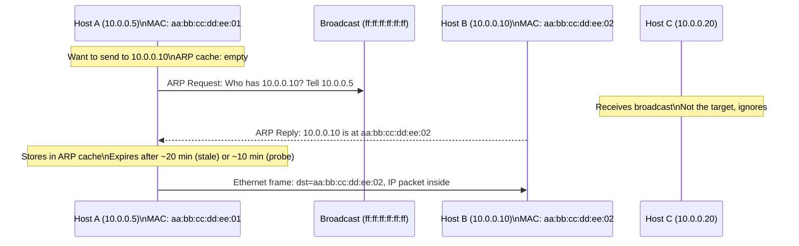
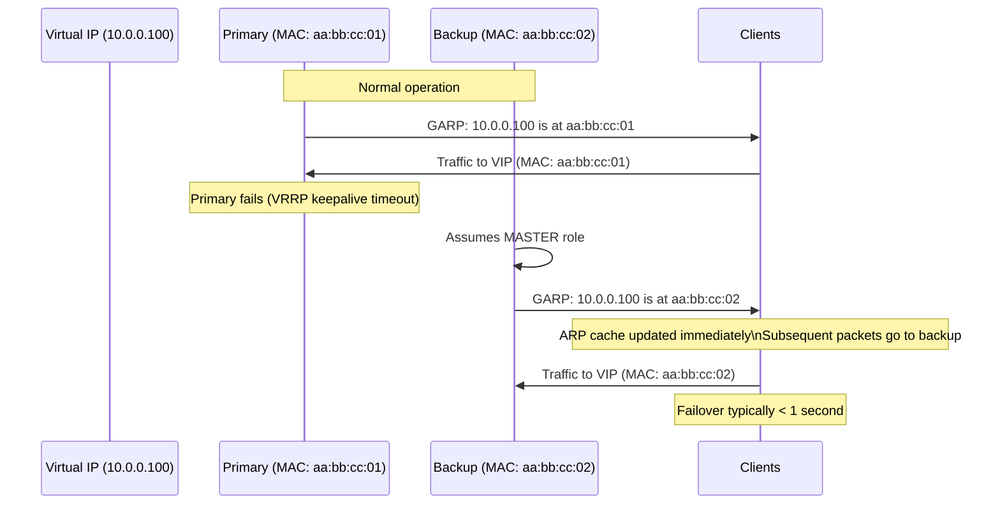
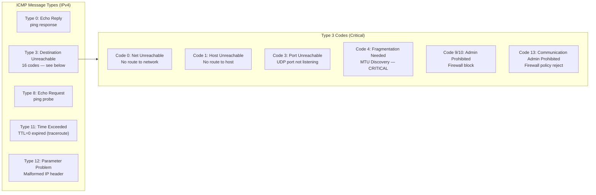
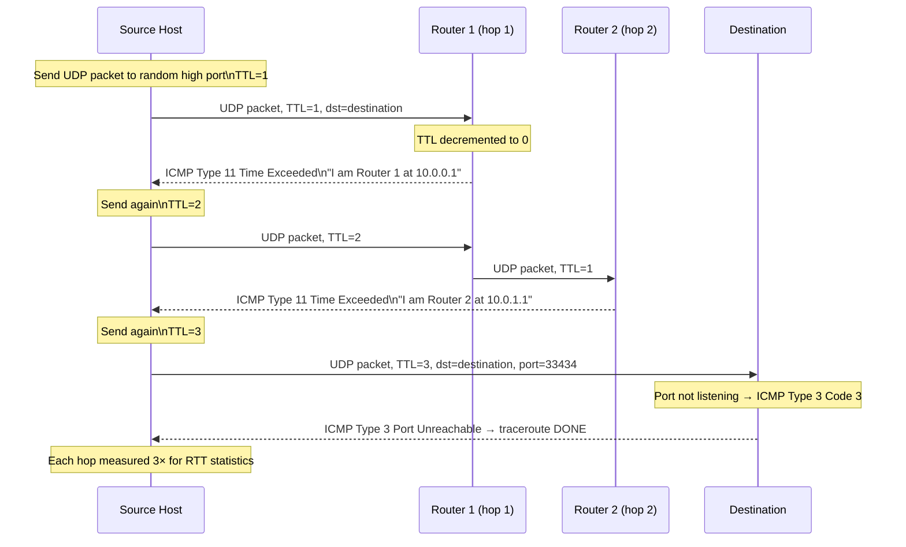
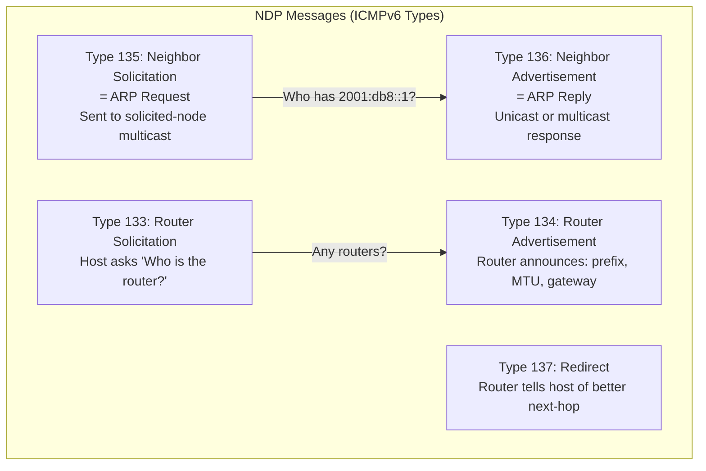

# ARP, ICMP, and NDP — SRE Field Guide

## Table of Contents

- [Overview](#overview)
- [ARP: Address Resolution Protocol](#arp-address-resolution-protocol)
  - [Mechanics](#mechanics)
  - [ARP Cache Operations](#arp-cache-operations)
  - [Gratuitous ARP (GARP) — HA Failover Mechanism](#gratuitous-arp-garp-ha-failover-mechanism)
  - [ARP in AWS (Proxy ARP and VPC ARP)](#arp-in-aws-proxy-arp-and-vpc-arp)
- [ICMP: Internet Control Message Protocol](#icmp-internet-control-message-protocol)
  - [ICMP Types That Matter in Production](#icmp-types-that-matter-in-production)
  - [ICMP Type 3 Code 4: Fragmentation Needed (MTU Black Holes)](#icmp-type-3-code-4-fragmentation-needed-mtu-black-holes)
- [Traceroute and Tracepath Internals](#traceroute-and-tracepath-internals)
- [Production Scenario: MTU Black Hole Causing Silent Packet Drops](#production-scenario-mtu-black-hole-causing-silent-packet-drops)
  - [Investigation](#investigation)
- [NDP: Neighbor Discovery Protocol (IPv6)](#ndp-neighbor-discovery-protocol-ipv6)
- [Failure Modes](#failure-modes)
- [Debugging Guide](#debugging-guide)
- [Security Considerations](#security-considerations)
- [Interview Questions](#interview-questions)
  - [Basic](#basic)
  - [Intermediate](#intermediate)
  - [Advanced / Staff Level](#advanced-staff-level)

---

## Overview

ARP and ICMP are the unsung protocols that make IP networks actually work — and also the source of some of the most confusing production failures. ARP resolves the L3-to-L2 mapping that every IP packet depends on. ICMP carries the error signals that enable path discovery, MTU negotiation, and basic reachability testing. NDP is IPv6's replacement for both. Understanding these protocols deeply means you can diagnose failures that look random but are actually deterministic.

---

## ARP: Address Resolution Protocol

### Mechanics

ARP maps a known IPv4 address to an unknown MAC address on the local segment. It is a broadcast protocol — limited to a single broadcast domain (VLAN/subnet).



### ARP Cache Operations

```bash
# View ARP cache
ip neigh show
# 10.0.0.1  dev eth0 lladdr 02:42:ac:11:00:01 REACHABLE
# 10.0.0.50 dev eth0 lladdr 02:42:ac:11:00:33 STALE
# 10.0.0.99 dev eth0                           FAILED

# ARP states:
# REACHABLE: confirmed recently (within NUD timeout)
# STALE:     cached but not recently confirmed
# DELAY:     recently used, will probe soon
# PROBE:     sending unicast probes to confirm
# FAILED:    probe attempts exhausted, no response

# Manually add a static ARP entry (prevents ARP spoofing for critical hosts)
ip neigh add 10.0.0.1 lladdr 02:42:ac:11:00:01 dev eth0 nud permanent

# Delete a specific entry (force re-resolution)
ip neigh del 10.0.0.1 dev eth0

# Flush entire ARP cache
ip neigh flush all

# Watch ARP table changes in real-time
watch -n 1 'ip neigh show'

# Capture ARP traffic
tcpdump -e -i eth0 arp -n
# 10:00:01.123 aa:bb:cc:dd:ee:01 > ff:ff:ff:ff:ff:ff, ARP Request who-has 10.0.0.10 tell 10.0.0.5
# 10:00:01.124 aa:bb:cc:dd:ee:02 > aa:bb:cc:dd:ee:01, ARP Reply 10.0.0.10 is-at aa:bb:cc:dd:ee:02
```

### Gratuitous ARP (GARP) — HA Failover Mechanism

A gratuitous ARP is an ARP reply sent without a request. The sender announces its own IP → MAC mapping. Every host that receives it updates their ARP cache.

**Use in HA failover (keepalived/VRRP):**



```bash
# Send gratuitous ARP manually (useful for forcing cache refresh after IP reassignment)
arping -I eth0 -A -c 3 10.0.0.100
# -A: ARP reply mode (gratuitous)
# -c 3: send 3 times (retransmit for reliability)

# keepalived GARP configuration
# /etc/keepalived/keepalived.conf:
# garp_master_delay 2      # delay before sending GARP on failover (seconds)
# garp_master_refresh 30   # send GARP every 30s while master (persist in cache)
```

### ARP in AWS (Proxy ARP and VPC ARP)

AWS VPCs do not use broadcast ARP. Instead:

- The **VPC hypervisor** intercepts ARP requests and responds on behalf of all instances
- This is why your instance can never see ARP requests from other instances (they're intercepted)
- Consequence: ARP-based tools like `arping` don't work for scanning AWS VPCs
- AWS explicitly **blocks gratuitous ARPs** that change the MAC for an IP — prevents ARP spoofing between tenants

```bash
# In AWS: this ARP behavior check
# arping from one EC2 to another on same subnet
arping -I eth0 -c 3 10.0.1.50
# ARPING 10.0.1.50 from 10.0.0.5 eth0
# Response from the hypervisor (not actual peer MAC)
# Timeout: 2 packets transmitted, 2 received  <-- usually works because hypervisor responds
```

---

## ICMP: Internet Control Message Protocol

ICMP operates at L3. It carries error messages and operational information. It is not optional infrastructure — many TCP features depend on it.

### ICMP Types That Matter in Production



### ICMP Type 3 Code 4: Fragmentation Needed (MTU Black Holes)

This is the most operationally important ICMP message. It's how **Path MTU Discovery (PMTUD)** works.

**Mechanism:**
1. Host A sends IP packet with `DF` (Don't Fragment) bit set
2. Router in the path has a smaller MTU than the packet
3. Router drops the packet and sends ICMP Type 3 Code 4 back to Host A
4. Host A reduces its send size and retransmits

**The black hole problem:** If a firewall blocks ICMP (common mistake — "block all ICMP for security"), the Fragmentation Needed message never arrives. Host A keeps sending large packets that keep getting silently dropped. **Symptom: small HTTP requests work, large file downloads hang or fail.**

```bash
# Test for MTU black holes
# Start with small probe (works)
ping -c 3 -M do -s 64 10.0.1.100    # -M do = Don't fragment, -s = payload size
# 3 packets transmitted, 3 received — OK

# Medium probe
ping -c 3 -M do -s 1000 10.0.1.100
# 3 packets transmitted, 3 received — OK

# Large probe (above VXLAN/VPN overhead threshold)
ping -c 3 -M do -s 1400 10.0.1.100
# 3 packets transmitted, 0 received — STUCK: this is the MTU black hole

# Binary search for actual MTU
for size in 1400 1300 1200 1100 1000; do
  result=$(ping -c 1 -W 1 -M do -s $size 10.0.1.100 2>&1)
  echo "Size $size: $(echo $result | grep -o 'received [0-9]*' || echo 'dropped')"
done
```

**The VXLAN/VPN overhead math:**

```
Standard Ethernet MTU: 1500 bytes
VXLAN overhead:         50 bytes (Outer Eth 14 + IP 20 + UDP 8 + VXLAN 8)
                                          ↓
VXLAN inner MTU:       1450 bytes max

VPN (WireGuard) overhead: ~60 bytes
VPN inner MTU:            1440 bytes

Kubernetes Pod in VXLAN:
  Pod sends 1500-byte packet → VXLAN node adds 50-byte header → 1550 bytes
  If physical MTU = 1500 → dropped
  Pod never gets ICMP back (firewall blocks it) → black hole
```

---

## Traceroute and Tracepath Internals

Traceroute exploits ICMP TTL Exceeded messages to map network paths.



```bash
# Standard traceroute (UDP probes, destination port 33434+)
traceroute -n 8.8.8.8

# TCP traceroute (bypasses firewalls that block UDP)
traceroute -n -T -p 443 8.8.8.8

# ICMP traceroute (some firewalls prefer)
traceroute -n -I 8.8.8.8

# mtr — continuous traceroute with statistics
mtr --report --report-cycles 50 8.8.8.8
# Shows per-hop loss%, average RTT, jitter
# Loss at hop N but not N+1 = hop N drops probes but forwards traffic (ICMP deprioritized)
# Loss at hop N and all subsequent = real loss

# tracepath — like traceroute but also discovers MTU per hop
tracepath -n 10.0.1.100
# 1: 10.0.0.1  0.3ms
# 2: 10.0.1.100  0.8ms reached
# Resume: pmtu 1500  <-- discovered path MTU
```

---

## Production Scenario: MTU Black Hole Causing Silent Packet Drops

**Incident:** After migrating Kubernetes cluster to VXLAN overlay networking, intermittent failures appear in internal gRPC calls. Small RPCs work. Large data responses (>~1400 bytes) fail with timeout after exactly 15 seconds. `curl` to the same service works for small responses.

### Investigation

```bash
# Step 1: Confirm the symptom pattern — small vs large
# From client pod:
curl -s http://data-service:8080/small-response | wc -c   # Returns immediately: 256 bytes
curl -s http://data-service:8080/large-response | wc -c   # Hangs for 15s then timeout: 0 bytes

# Step 2: Test MTU from inside pod
kubectl exec -it client-pod -- ping -c 3 -M do -s 1400 data-service
# connect: Message too long
# 0 packets received  <-- MTU problem confirmed

kubectl exec -it client-pod -- ping -c 3 -M do -s 1200 data-service
# 3 received  <-- 1200 works

# Step 3: Find the actual working MTU (binary search)
for size in 1400 1350 1300 1250 1200 1450 1380 1350; do
  kubectl exec -it client-pod -- ping -c 1 -W 2 -M do -s $size data-service-ip &>/dev/null \
    && echo "OK: $size" || echo "FAIL: $size"
done
# FAIL: 1450, FAIL: 1400, FAIL: 1380, OK: 1350, OK: 1300

# Step 4: Confirm ICMP Fragmentation Needed is NOT reaching the sender
kubectl exec -it client-pod -- tcpdump -i eth0 icmp &
kubectl exec -it client-pod -- ping -c 1 -M do -s 1400 data-service
# No ICMP type 3 code 4 seen  <-- Fragmentation Needed is blocked

# Step 5: Find where it's blocked
# Check iptables in the pod/node network namespace
iptables -L -n | grep -i icmp
# DROP  icmp -- 0.0.0.0/0  0.0.0.0/0  icmp type 3  <-- !!!
```

**Root cause:** A security-hardening script had added a blanket `iptables -A INPUT -p icmp -j DROP` rule. This blocked ICMP Fragmentation Needed messages, causing PMTUD to fail silently.

**Fix options:**

```bash
# Option 1: Allow ICMP Type 3 (Fragmentation Needed) specifically
iptables -I INPUT -p icmp --icmp-type fragmentation-needed -j ACCEPT
iptables -I FORWARD -p icmp --icmp-type fragmentation-needed -j ACCEPT

# Option 2: Clamp MSS at the Kubernetes node level (prevents oversized TCP segments)
# In network policy or iptables:
iptables -t mangle -A FORWARD -p tcp --tcp-flags SYN SYN \
  -j TCPMSS --clamp-mss-to-pmtu
# This reduces TCP MSS negotiated during handshake to fit within PMTU
# Works even when ICMP is blocked — proactive vs reactive

# Option 3: Set MTU on VXLAN interface explicitly
ip link set dev flannel.1 mtu 1450
# All pods on this node will use 1450 as their effective MTU
```

**Permanent fix:** Add MSS clamping to the Kubernetes network setup (most CNIs do this automatically now). Remove blanket ICMP drop rules; use specific `icmp --icmp-type 3` allows.

---

## NDP: Neighbor Discovery Protocol (IPv6)

NDP replaces both ARP and parts of ICMP for IPv6. It uses ICMPv6 messages.



**Key NDP advantages over ARP:**
- Uses multicast (not broadcast) — more efficient on large segments
- Includes SLAAC (address autoconfiguration) — hosts derive their own IPv6 address
- Includes MTU advertisement (Router Advertisement carries MTU field)
- Secured by SEND (SEcure Neighbor Discovery) in high-security environments

```bash
# View IPv6 neighbor cache (equivalent to ARP cache)
ip -6 neigh show
# 2001:db8::1 dev eth0 lladdr 02:42:ac:11:00:01 REACHABLE
# fe80::1 dev eth0 lladdr 02:42:ac:11:00:01 router REACHABLE

# Watch NDP traffic (neighbor solicitations and advertisements)
tcpdump -i eth0 -n 'icmp6 and (ip6[40] == 135 or ip6[40] == 136)'
# type 135 = Neighbor Solicitation, type 136 = Neighbor Advertisement

# Check Router Advertisements (prefix, MTU info from router)
tcpdump -i eth0 -n 'icmp6 and ip6[40] == 134' -v
# Should show: prefix 2001:db8::/64, MTU 1500, router lifetime

# Manually trigger Router Solicitation
rdisc6 eth0   # from ndisc6 package
```

---

## Failure Modes

| Failure | Symptoms | Detection | Fix |
|---------|----------|-----------|-----|
| ARP cache stale | Traffic goes to old MAC after IP reassignment | `ip neigh show` shows FAILED/STALE | `ip neigh flush all`; send GARP from new owner |
| GARP not working on failover | VIP failover takes 20+ seconds (until ARP expires) | Monitor VIP switch time in keepalived logs | Check `garp_master_delay`; verify GARP not blocked |
| ICMP blocked by firewall | MTU black holes, traceroute shows `* * *` at hops | `ping -M do -s 1400` fails; no ICMP in tcpdump | Allow ICMP Type 3 Code 4 specifically |
| MTU black hole | Large transfers hang/fail, small ones succeed | `ping -M do -s` binary search fails around 1400 | MSS clamping; fix MTU on interfaces; allow ICMP |
| ARP spoofing | Traffic hijacked, MITM visible in captures | `arp -n` shows duplicate MACs; monitor ARP | DAI on switches; static ARP for critical hosts |
| ICMP flood | High CPU on target, bandwidth exhaustion | `tcpdump icmp` shows flood; netstat -s ICMP stats | Rate limit ICMP: `iptables -m limit --limit 10/sec` |
| IPv6 SLAAC failure | No IPv6 address assigned to interface | `ip -6 addr`; no address beyond link-local | Check RA is being sent; router with `ip6tables` |
| NDP cache overflow | IPv6 connectivity flaps on large subnets | `ip -6 neigh show \| wc -l` near `gc_thresh3` | Tune `net.ipv6.neigh.default.gc_thresh*` |

---

## Debugging Guide

```bash
# ============================================================
# ARP debugging
# ============================================================

# Check if gateway ARP is working
ip neigh show $(ip route | grep default | awk '{print $3}')
# Should show: REACHABLE or STALE (not FAILED)

# Trigger ARP probe manually
arping -I eth0 -c 3 10.0.0.1
# ARPING 10.0.0.1 from 10.0.0.5 eth0
# Unicast reply from 10.0.0.1 [02:42:ac:11:00:01]  1.234ms

# Watch for ARP storms (sign of IP conflict or loop)
tcpdump -e -i eth0 arp -nn | head -20
# If same request repeated many times: duplicate IP or loop

# ============================================================
# ICMP/MTU debugging
# ============================================================

# Progressive MTU test (binary search script)
target=10.0.1.100
for size in 1472 1400 1300 1200 1000 576; do
  if ping -c 1 -W 2 -M do -s $size $target &>/dev/null; then
    echo "MTU OK at $size (total packet: $((size+28)) bytes)"
  else
    echo "MTU FAILS at $size (total: $((size+28)) bytes)"
  fi
done

# Check if ICMP is blocked inbound
iptables -L INPUT -n | grep -i icmp
ip6tables -L INPUT -n | grep -i icmp

# Verify PMTUD is enabled (don't fragment bit)
sysctl net.ipv4.ip_no_pmtu_disc
# 0 = PMTUD enabled (correct default)

# ============================================================
# Traceroute interpretation
# ============================================================

# Standard traceroute with better output
mtr --report --report-cycles 20 --no-dns 8.8.8.8

# Interpret results:
# Hop with loss but subsequent hops have no loss → that hop deprioritizes ICMP, not a real problem
# Hop N and all hops after show loss → real packet loss at hop N
# RTT suddenly doubles from hop N → N is crossing a WAN link or satellite link
# *** at all hops after N → ICMP Type 11 blocked by firewall (common at hop after ISP handoff)
```

---

## Security Considerations

**ARP Spoofing:**
- Attacker sends crafted ARP replies mapping the gateway's IP to their own MAC
- All traffic to the gateway is redirected to the attacker (MITM)
- Detection: multiple ARP replies for the same IP with different MACs
- Prevention: Dynamic ARP Inspection (DAI) on enterprise switches validates ARP against DHCP snooping table; static ARP for critical hosts (`ip neigh add ... nud permanent`)

**Gratuitous ARP Abuse:**
- Any host can send a GARP claiming to own any IP
- Used in legitimate HA (keepalived) but also as attack vector
- AWS explicitly blocks GARPs that would change IP-to-MAC mapping outside allocated range

**ICMP-based Attacks:**
- **ICMP flood (Smurf):** Spoof source IP as victim, send ICMP Echo to broadcast address — all hosts reply to victim. Mitigation: disable directed broadcast (`no ip directed-broadcast` on routers); block inbound broadcast ICMP at border.
- **ICMP tunneling:** Data exfiltration via ICMP payload (tools: `icmptunnel`, `ptunnel`). Detection: abnormally large ICMP payloads, high ICMP traffic volume. Mitigation: limit ICMP payload size at firewall; DPI.
- **Ping of Death:** Oversized ICMP packet causes buffer overflow in old kernels. Irrelevant on modern systems.

**What NOT to block:**
- ICMP Type 3 Code 4 (Fragmentation Needed) — blocking causes MTU black holes
- ICMP Type 11 (Time Exceeded) — blocking breaks traceroute-based monitoring
- ICMPv6 Neighbor Solicitation/Advertisement — blocking breaks IPv6 entirely
- ICMPv6 Router Advertisement — blocking prevents SLAAC, breaks IPv6 default gateway

---

## Interview Questions

### Basic

**Q: What is ARP and why is it needed?**

ARP (Address Resolution Protocol) maps a Layer 3 IP address to a Layer 2 MAC address on a local segment. IP routing gets a packet to the right subnet, but Ethernet frames need a MAC address to deliver to the specific host. ARP is the bridge between these two layers. Without ARP, a host can route a packet to the right network but can't deliver the final Ethernet frame to the destination.

**Q: What is ICMP used for?**

ICMP is a signaling protocol at Layer 3. Not for data transfer — for network status and error reporting. Primary uses: (1) Echo Request/Reply for ping/reachability testing, (2) Destination Unreachable for path errors, (3) TTL Exceeded for traceroute, (4) Fragmentation Needed for PMTUD. A common mistake is blocking all ICMP for "security" — this breaks PMTUD and traceroute.

### Intermediate

**Q: How does VRRP/keepalived use gratuitous ARP for failover?**

VRRP nodes elect a master that "owns" the Virtual IP (VIP). The master sends periodic GARP messages advertising its MAC for the VIP. When the master fails, the backup takes over and immediately sends multiple GARPs announcing its own MAC for the VIP. Every host in the broadcast domain updates their ARP cache — subsequent packets are routed to the new master. The failover is essentially instantaneous (limited only by the GARP propagation time, typically <1 second).

**Q: Explain MTU discovery and how it can fail.**

Path MTU Discovery (PMTUD) uses the IP Don't Fragment (DF) bit. The sender marks all packets with DF=1. If any router in the path has a smaller MTU, it drops the packet and returns ICMP Type 3 Code 4 (Fragmentation Needed) with the next-hop MTU value. The sender reduces its packet size accordingly. The failure case — "MTU black hole" — occurs when a firewall blocks ICMP in either direction. The sender never receives the Fragmentation Needed message, keeps sending large packets, they keep getting dropped silently. Fix: explicitly allow ICMP Type 3 Code 4, or use TCP MSS clamping which proactively limits segment size during the TCP handshake (before any ICMP is needed).

### Advanced / Staff Level

**Q: In AWS, why can't you rely on ARP for host discovery, and how does this affect HA designs?**

AWS VPC uses a centralized SDN control plane (not traditional L2 Ethernet). ARP requests are intercepted by the hypervisor, which responds from its own table — you never see broadcast ARP traffic from peer instances. This means: (1) `arping` scans don't enumerate EC2 instances, (2) traditional ARP-based HA (VRRP/keepalived) doesn't work because GARP updates are blocked — AWS won't let one instance steal another's IP via GARP. Instead, AWS HA uses API calls: Elastic IP reassignment (detach EIP from failed instance, re-attach to standby), or Route53 health checks for DNS failover, or NLB health checks for load balancer failover. The failover time is 10-30 seconds (API calls + TTL propagation) vs <1 second for GARP-based VRRP. This is a fundamental architectural difference in cloud vs on-prem HA.
