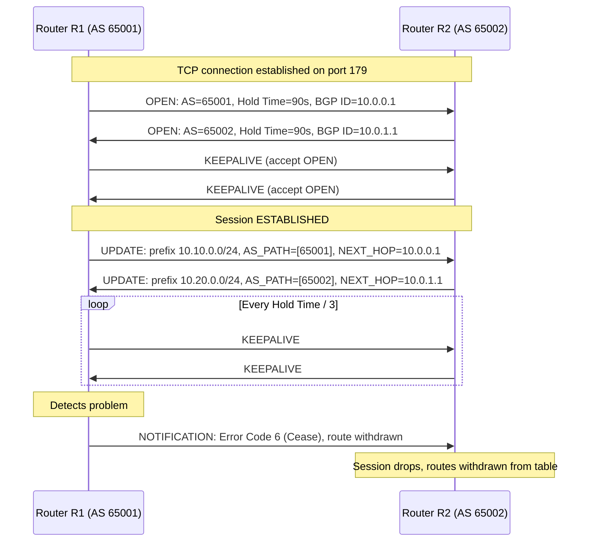
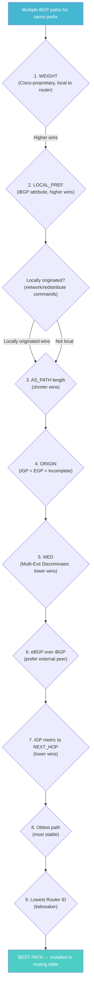
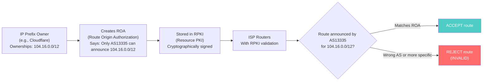
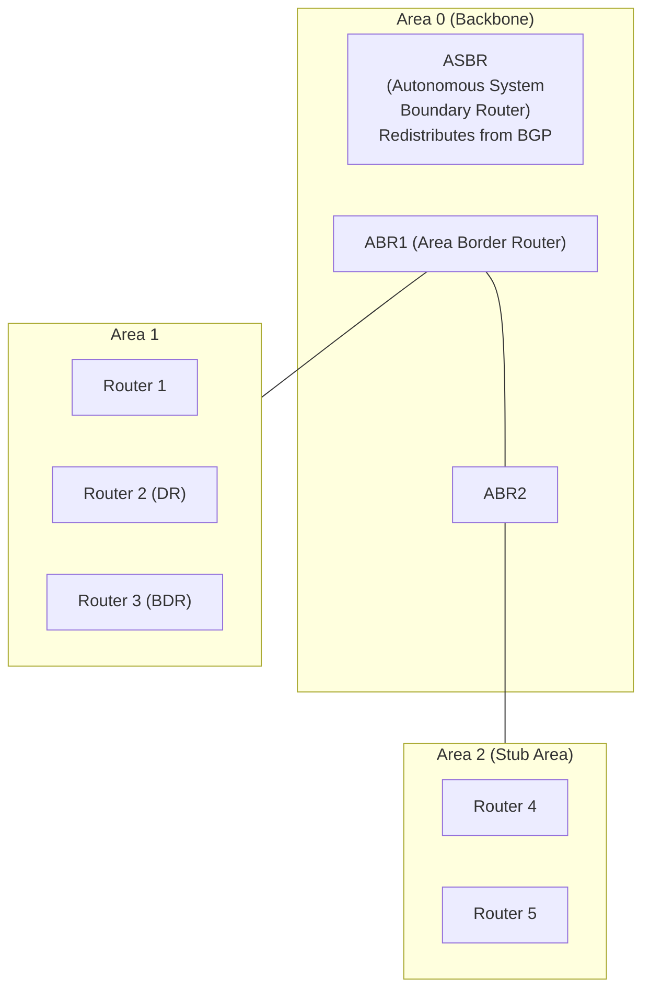
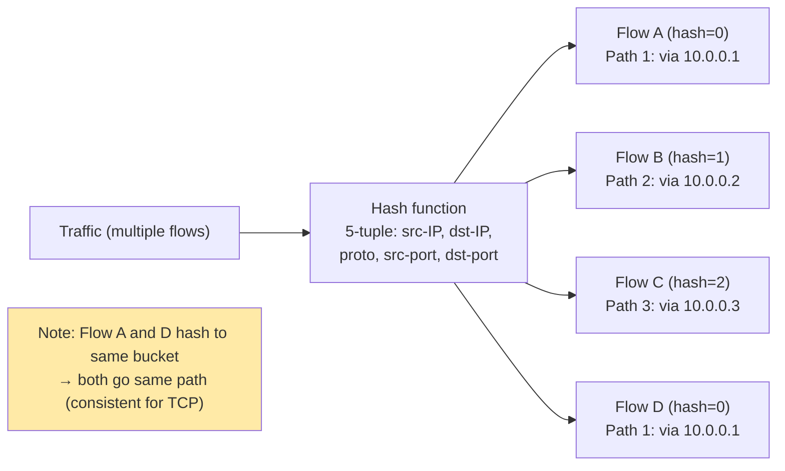

# Routing Protocols — SRE Field Guide

## Table of Contents

- [Overview](#overview)
- [Static vs Dynamic Routing](#static-vs-dynamic-routing)
- [BGP: Border Gateway Protocol](#bgp-border-gateway-protocol)
  - [eBGP vs iBGP](#ebgp-vs-ibgp)
  - [BGP Session Messages](#bgp-session-messages)
  - [BGP Path Selection Algorithm](#bgp-path-selection-algorithm)
  - [BGP in AWS](#bgp-in-aws)
  - [BGP Communities](#bgp-communities)
  - [BGP Route Leaks: Cloudflare 2019 Incident](#bgp-route-leaks-cloudflare-2019-incident)
- [OSPF: Open Shortest Path First](#ospf-open-shortest-path-first)
  - [OSPF Key Concepts](#ospf-key-concepts)
- [ECMP: Equal Cost Multi-Path](#ecmp-equal-cost-multi-path)
  - [ECMP Hash Problems](#ecmp-hash-problems)
- [Production Scenario: BGP Route Withdrawal Causes Partial Connectivity Loss](#production-scenario-bgp-route-withdrawal-causes-partial-connectivity-loss)
  - [Diagnosis Walkthrough](#diagnosis-walkthrough)
- [Failure Modes](#failure-modes)
- [Security Considerations](#security-considerations)
- [Interview Questions](#interview-questions)
  - [Basic](#basic)
  - [Intermediate](#intermediate)
  - [Advanced / Staff Level](#advanced-staff-level)

---

## Overview

Routing is how packets find their way across networks. For SREs, routing failures are some of the most impactful and hardest-to-diagnose problems: a BGP route withdrawal can make an entire cloud region unreachable in seconds, and routing loops cause traffic to spin until TTL=0. Understanding BGP path selection, OSPF convergence, and ECMP behavior is essential for diagnosing cloud networking failures and designing resilient multi-region architectures.

---

## Static vs Dynamic Routing

| Aspect | Static Routing | Dynamic Routing |
|--------|---------------|-----------------|
| Configuration | Manual `ip route add` | Protocol-driven (BGP, OSPF, IS-IS) |
| Convergence | Instant (no protocol) | Seconds to minutes (protocol-dependent) |
| Failure handling | None (manual intervention) | Automatic (next-best path) |
| Scale | Up to ~50 routes practical | Unlimited |
| Use cases | Default route, stub networks, point-to-point links | Internet routing, large enterprise, cloud |
| Cloud use | VPC route tables (manual entries) | Direct Connect BGP, VPN BGP |

```bash
# Static route examples
ip route add 10.0.2.0/24 via 10.0.0.1          # Route via gateway
ip route add 10.0.3.0/24 dev eth1               # Route via interface (directly connected)
ip route add 0.0.0.0/0 via 10.0.0.1             # Default route
ip route add 192.168.0.0/16 blackhole            # Discard route (null route)
ip route add 10.0.4.0/24 via 10.0.0.1 metric 100  # Metric (cost)

# View routing table
ip route show
ip route show table main   # Default table
ip route show table local  # Local addresses (managed by kernel)

# Route for specific destination
ip route get 8.8.8.8
# 8.8.8.8 via 10.0.0.1 dev eth0 src 10.0.0.5 uid 0
```

---

## BGP: Border Gateway Protocol

BGP is the routing protocol of the internet. Every AS (Autonomous System) exchanges reachability information with its peers via BGP. It is a path-vector protocol — each UPDATE message carries the complete AS_PATH, preventing loops.

### eBGP vs iBGP

| Aspect | eBGP (External BGP) | iBGP (Internal BGP) |
|--------|--------------------|--------------------|
| Peers | Between different ASes | Within same AS |
| TTL | 1 (adjacent routers only) | 255 (full iBGP mesh possible) |
| AS_PATH | Prepended with local AS | Not modified |
| NEXT_HOP | Set to self | Not changed (must use IGP to reach next-hop) |
| Loop prevention | AS_PATH contains ASN | Cannot re-advertise to another iBGP peer (split horizon) |
| Typical use | ISP-to-ISP, Direct Connect, VPN | Within service provider network |

### BGP Session Messages



### BGP Path Selection Algorithm

When BGP receives multiple paths to the same prefix, it selects the best using this ordered algorithm:



**Mnemonics for BGP path selection:** "We Love Oranges As Oranges Mean Pure Refreshment" — Weight, Local_pref, Originate, AS_path, Origin, MED, Prefer-eBGP, Router-ID.

### BGP in AWS

```
Direct Connect:
  On-premises router ←→ AWS Direct Connect endpoint via eBGP
  Customer advertises on-prem prefixes; AWS advertises VPC CIDR
  LOCAL_PREF used to prefer primary DX over backup VPN

Transit Gateway (TGW):
  VPC attachments get dynamic routes via TGW route tables
  BGP used between TGW and VPN/Direct Connect
  TGW route table acts like a BGP route reflector for VPC routes

VPN:
  AWS Site-to-Site VPN can use static or BGP (dynamic) routing
  BGP VPN: customer router advertises CIDRs, AWS advertises VPC CIDR
  Redundancy: two VPN tunnels per connection, BGP detects failover
```


```bash
# Check VPN BGP status (from AWS CLI)
aws ec2 describe-vpn-connections --query \
  'VpnConnections[*].VgwTelemetry[*].{Status:Status,Outside:OutsideIpAddress,Received:AcceptedRouteCount}'

# On-prem BGP router (Cisco IOS example)
show bgp summary
# Neighbor        V    AS MsgRcvd MsgSent   Up/Down  State/PfxRcd
# 169.254.0.1     4  7224    1234    1230  1d02h    10

show bgp 10.0.0.0/24
# Best path: from 169.254.0.1 (AWS), AS_PATH: 7224 ...
```

### BGP Communities

BGP communities are 32-bit tags attached to route advertisements. Used for policy and traffic engineering.

```
Format: ASN:value  (e.g., 65001:100)

Common patterns:
  65001:100  → "prefer this path" (set LOCAL_PREF=100 on receiving end)
  65001:200  → "depref this path" (set LOCAL_PREF=50)
  no-export  → don't advertise beyond this AS (well-known community, value 0xFFFFFF01)
  no-advertise → don't advertise to any peer
  local-AS   → don't advertise outside confederation
  blackhole  → 65535:666 (RTBH — tell all peers to drop traffic to this prefix)

AWS Direct Connect communities:
  7224:8100  → propagate routes only to same region
  7224:8200  → propagate to same continent
  7224:9100  → propagate globally (override default)
```

### BGP Route Leaks: Cloudflare 2019 Incident

**What happened (June 24, 2019):**
1. A small network (AS33154) misconfigured their routing software (Vocus), optimizing internal routes
2. They accidentally re-advertised 212,000+ routes learned from peers (including Cloudflare's prefixes) to their upstream provider (CenturyLink, AS209)
3. CenturyLink accepted these routes and propagated them to their peers
4. For ~2 hours, traffic destined for Cloudflare, Amazon, Linode, and others was routed through a small ISP that couldn't handle the load — internet-wide disruption

**Why it happened:**
- No RPKI/ROA validation at CenturyLink (they accepted invalid origin advertisements)
- No route-limit filtering (accepting 212K routes from a peer that should only announce ~100)
- BGP's trust model: by default, you trust what your peers tell you

**RPKI/ROA Mitigation:**



```bash
# Check if your prefix has a valid ROA
# Use a public RPKI validator
curl -s "https://rpki.cloudflare.com/api/v1/validity/AS13335/104.16.0.0/12" | python3 -m json.tool
# "state": "valid"

# Enable RPKI validation on FRRouting
router bgp 65001
  bgp router-id 10.0.0.1
  neighbor 10.0.1.1 remote-as 65002
  !
  address-family ipv4 unicast
    neighbor 10.0.1.1 route-map RPKI-FILTER in
!
rpki
  rpki polling_period 900
  rpki server 192.0.2.1 port 3323 preference 1
```

---

## OSPF: Open Shortest Path First

OSPF is a link-state IGP (Interior Gateway Protocol). Each router maintains a complete map of the network (LSDB — Link State Database) and independently computes shortest paths using Dijkstra's algorithm.

### OSPF Key Concepts



**DR/BDR Election:**

On multi-access segments (Ethernet), OSPF elects a Designated Router (DR) and Backup DR (BDR) to reduce OSPF flooding. All routers form adjacencies with DR/BDR only (not each other). The DR/BDR then floods LSAs to all neighbors.

Election: highest OSPF priority (default 1) → highest Router ID (highest IP). **Priority 0 = never become DR/BDR.**

```bash
# Check OSPF neighbors (FRRouting/Quagga syntax)
show ip ospf neighbor
# Neighbor ID  Pri  State       Dead Time  Address   Interface
# 10.0.1.1     1    Full/DR     32s        10.0.0.2  eth0
# 10.0.1.2     1    Full/BDR    29s        10.0.0.3  eth0

# OSPF link state database
show ip ospf database

# Check OSPF route table
show ip ospf route
# N IA 10.2.0.0/24 [20] via 10.0.0.2, eth0

# Verify OSPF timers (hello/dead)
show ip ospf interface eth0
# Hello interval: 10, Dead interval: 40
```

---

## ECMP: Equal Cost Multi-Path

ECMP distributes flows across multiple equal-cost paths. Key distinction: ECMP distributes **per-flow**, not per-packet, using a 5-tuple hash to maintain flow consistency.



### ECMP Hash Problems

```bash
# See ECMP routes
ip route show
# 10.0.2.0/24
#   nexthop via 10.0.0.1 dev eth0 weight 1
#   nexthop via 10.0.0.2 dev eth1 weight 1

# Problem: hash polarization
# If all flows hash to same value, ECMP doesn't balance
# Common cause: all traffic shares same src/dst IP (e.g., NAT gateway)
# Solution: use 4-tuple (without source port) or entropy fields

# Check ECMP hash algorithm on Linux
sysctl net.ipv4.fib_multipath_hash_policy
# 0 = layer 3 (src/dst IP only) - poor balance for same IP pairs
# 1 = layer 4 (src/dst IP + ports) - better balance
# 2 = layer 3+4 mixed

sysctl -w net.ipv4.fib_multipath_hash_policy=1

# ECMP consistency issue: adding a new path changes hashes for all flows
# This breaks existing TCP connections!
# Use consistent hashing or Maglev algorithm for large-scale ECMP
```

---

## Production Scenario: BGP Route Withdrawal Causes Partial Connectivity Loss

**Incident:** At 14:32, monitoring shows 30% of HTTP requests to `api.company.com` timing out. Some users affected, others not. Internal services unaffected.

### Diagnosis Walkthrough

```bash
# Step 1: Confirm the symptom pattern
# Affected: requests from specific source IPs
# Unaffected: requests from other IPs and internal services
# → Hypothesis: routing issue affecting specific paths

# Step 2: Check BGP session status (on border router or via cloud console)
# FRRouting:
show bgp summary
# Neighbor    AS     Up/Down    State/PfxRcd
# 10.0.0.1  7224    00:01:23   10          ← recently reconnected!
# 10.0.0.2  7224    12d03h     10          ← stable

# Step 3: Check route table for the affected prefix
show bgp 203.0.113.0/24
# No entry! → prefix withdrawn

# Step 4: Check BGP notification history
show log | grep "BGP NOTIFICATION"
# 14:32:01 NOTIFICATION: received from 10.0.0.1, code 6 (Cease), subcode 4 (Admin Reset)
# → Peer reset the session 1 minute ago

# Step 5: During session down, routes via that peer were withdrawn
# ECMP was distributing some flows via that peer
# Flows hashed to that path: dropped until re-advertisement

# Step 6: Confirm traffic was being sent via that path
show bgp 203.0.113.0/24
# After re-advertisement:
# Path: from 10.0.0.1 (newly re-learned), NEXT_HOP=10.0.0.1
# Bestpath: via 10.0.0.2 (since 10.0.0.1 path is newer → path age tiebreaker)
```

**Timeline reconstruction:**
```
14:30:00  BGP peer 10.0.0.1 restarted (software upgrade on neighbor)
14:30:00  ECMP path via 10.0.0.1 removed from routing table
14:30:00  Active flows hashed to that path: timeout or RST
14:30:05  BGP session re-established with 10.0.0.1
14:30:15  Routes re-advertised and re-learned
14:30:20  Normal routing restored
           → 20-second outage for affected flows
```

**Fix and prevention:**
1. Enable BGP Graceful Restart on both peers (allows routing to continue during BGP session reset)
2. Use BFD (Bidirectional Forwarding Detection) with fast timers to detect failures in <1 second instead of BGP hold timer (90 seconds default)
3. For planned maintenance: use `AS_PATH prepending` to shift traffic away before maintenance window

```bash
# BGP Graceful Restart configuration (FRRouting)
router bgp 65001
  bgp graceful-restart
  bgp graceful-restart preserve-fw-state
  neighbor 10.0.0.1 graceful-restart

# BFD for fast failure detection
router bgp 65001
  neighbor 10.0.0.1 bfd

# AS_PATH prepend to deprioritize a path (for maintenance)
route-map DEPRIORITIZE permit 10
  set as-path prepend 65001 65001 65001  # Makes path appear 3 hops longer
neighbor 10.0.0.1 route-map DEPRIORITIZE out
```

---

## Failure Modes

| Failure | Symptoms | Detection | Fix |
|---------|----------|-----------|-----|
| BGP session flap | Intermittent connectivity loss, routes oscillate | `show bgp summary` unstable Up/Down | Fix underlying TCP/physical; BFD timers |
| BGP route leak | Traffic routed through unexpected AS, performance degradation | `show bgp <prefix>` shows unexpected AS_PATH | RPKI/ROA validation; route-limit filters |
| BGP max-prefix limit | Session drops when peer advertises too many routes | NOTIFICATION code 6 subcode 1 | Raise limit; filter unnecessary routes |
| OSPF neighbor stuck in EXSTART | Routes not exchanged | `show ospf neighbor` EXSTART state | MTU mismatch between peers; IP MTU mismatch |
| OSPF area partitioned | Some networks unreachable within OSPF domain | `show ospf database` missing LSAs | Ensure all areas have path to Area 0; virtual links |
| ECMP hash polarization | One path saturated, others idle | Interface traffic counters unbalanced | Change hash policy: `fib_multipath_hash_policy=1` |
| Asymmetric routing | Stateful firewall drops; connections reset | `traceroute` shows different paths inbound/outbound | Fix routing policies; ensure symmetric ECMP |
| Routing loop | Traceroute shows same hops repeating; TTL=0 drops | `traceroute -m 64` repeating pattern | Fix route policy; remove circular static routes |

---

## Security Considerations

**BGP Security:**
- BGP runs over TCP with optional MD5 authentication (`neighbor X.X.X.X password <pw>`) — prevents unauthorized peer sessions but doesn't prevent route injection from authenticated peers
- **RPKI** (Resource PKI): cryptographic ROAs prove prefix ownership. Deploy on all border routers.
- **Route filtering**: accept only expected prefixes and prefix lengths from each peer. Never accept /32 routes from transit peers (too specific, likely leak).
- **BGP max-prefix limits**: `neighbor X.X.X.X maximum-prefix 1000 80` — warn at 80%, drop session at 100%

**OSPF Security:**
- OSPF authentication: MD5 or HMAC-SHA1 per-interface
- Passive interfaces: `passive-interface` on any segment without OSPF routers (prevents rogue router injection)
- Stub areas reduce LSA scope (attackers can't inject type 5 LSAs)

**ECMP and Load Balancing Security:**
- ECMP hash consistency can be exploited: an attacker choosing specific source ports can force all their traffic onto one path, bypassing traffic monitoring on other paths

---

## Interview Questions

### Basic

**Q: What is BGP and why is it called the "routing protocol of the internet"?**

BGP (Border Gateway Protocol) is the protocol that exchanges routing information between Autonomous Systems (ASes). Each ISP, large company, and cloud provider is an AS with a unique ASN. BGP is what allows traffic originating in AS 65001 (your company) to find its way to AS 13335 (Cloudflare) across multiple intermediate networks. It's a path-vector protocol — each route advertisement carries the full list of ASes it passed through (AS_PATH), which both provides routing information and prevents loops (a router won't accept a path containing its own ASN).

**Q: What is the difference between distance-vector, link-state, and path-vector routing protocols?**

Distance-vector (RIP): each router advertises its routing table to neighbors, who add their own distance metric. Simple but slow convergence and prone to loops. Link-state (OSPF, IS-IS): each router floods its local link information, all routers build identical topology maps, each computes shortest path independently. Fast convergence, no loops. Path-vector (BGP): advertises the full path (AS_PATH) along with reachability. Prevents loops by detecting own ASN in path. Designed for policy-based routing across administrative boundaries.

### Intermediate

**Q: Walk me through BGP path selection when you have two paths to the same prefix.**

BGP uses a deterministic tie-breaking algorithm applied in order: (1) highest WEIGHT (local, Cisco-specific), (2) highest LOCAL_PREF (indicates preference within an AS — higher is better), (3) locally originated routes, (4) shortest AS_PATH (fewer hops), (5) lowest ORIGIN type (IGP < EGP < incomplete), (6) lowest MED (Multi-Exit Discriminator — only comparable between paths from same AS), (7) prefer eBGP over iBGP, (8) lowest IGP metric to next-hop, (9) oldest route (stability), (10) lowest router ID. In practice, SREs use LOCAL_PREF for traffic engineering (prefer one path), MED to signal to upstream peers which entry point to use, and AS_PATH prepending to make a path look longer (less preferred) without changing LOCAL_PREF.

### Advanced / Staff Level

**Q: Explain how the 2019 Cloudflare BGP route leak happened and what architectural controls would have prevented it.**

The leak had three root causes: (1) Vocus (AS33154) had a misconfiguration that caused it to re-export transit routes to its upstream provider, violating the fundamental BGP peering policy of not re-advertising learned routes from one transit to another, (2) CenturyLink (AS209) had no RPKI validation — they accepted routes for Cloudflare's prefixes from an AS that had no ROA authorization to announce them, (3) CenturyLink had no max-prefix limits tuned appropriately — accepting 212,000 routes from a peer that should only announce a handful.

Prevention layers: (a) at Vocus: BGP export policies ensuring learned routes are not re-exported; (b) at CenturyLink: RPKI validation dropping INVALID routes, max-prefix limits per peer, prefix-list filtering accepting only expected prefixes; (c) at Cloudflare: creating ROAs for their own prefixes (they now have a public RPKI dashboard) and encouraging peers to validate.

This incident accelerated RPKI adoption — within a year, major ISPs including AT&T, Telia, and NTT enabled RPKI validation.

**Q: How does BGP Graceful Restart work and what are its limitations?**

BGP Graceful Restart (RFC 4724) allows a BGP speaker to signal that it has the capability to preserve forwarding state during a restart. When a Graceful-Restart-capable router restarts, it sends an OPEN message with the GR capability. The peer enters "helper" mode: it marks the restarting router's routes as stale but does not withdraw them from its own forwarding table. The restarting router has a Restart Time (typically 120s) to re-establish the session and re-advertise its routes. Once re-advertisement is complete, the helper removes stale routes.

Limitations: (1) Graceful Restart only works if the forwarding plane (FIB) survives the control-plane restart — ISSU (In-Service Software Upgrade) on some platforms, not always available. (2) If the restart takes longer than the hold time, the peer will eventually tear down the session anyway. (3) In scenarios with many ECMP paths, one path going into GR mode may cause temporary packet loss until re-convergence. (4) Long-lived stale routes during a slow restart can cause blackholing if the restarting router's forwarding table is corrupted during the restart.
