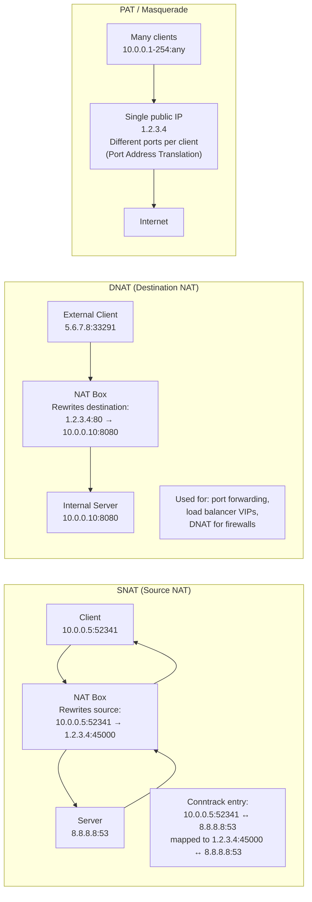
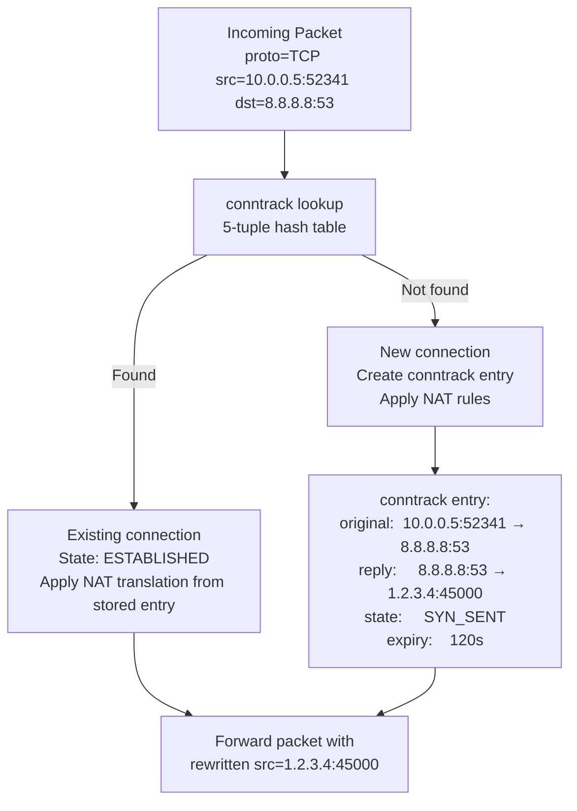
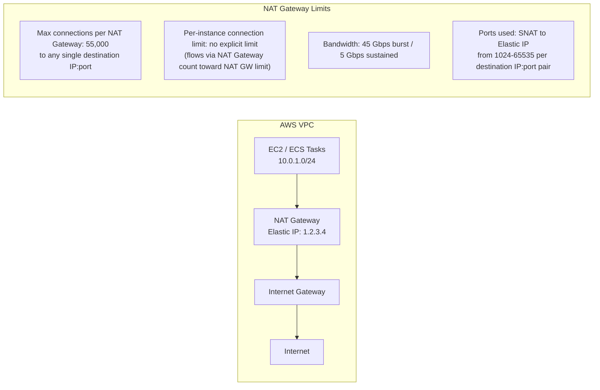

# NAT, PAT, and Ephemeral Ports — SRE Field Guide

## Table of Contents

- [Overview](#overview)
- [SNAT vs DNAT vs PAT](#snat-vs-dnat-vs-pat)
- [conntrack: Linux Connection Tracking](#conntrack-linux-connection-tracking)
  - [conntrack States and Timeouts](#conntrack-states-and-timeouts)
  - [conntrack Timeouts by Protocol](#conntrack-timeouts-by-protocol)
- [conntrack Table Exhaustion](#conntrack-table-exhaustion)
  - [Diagnosis and Fix](#diagnosis-and-fix)
- [Ephemeral Port Range](#ephemeral-port-range)
  - [Port Exhaustion vs conntrack Exhaustion](#port-exhaustion-vs-conntrack-exhaustion)
- [AWS NAT Gateway Limitations](#aws-nat-gateway-limitations)
  - [AWS NAT Gateway SNAT Behavior](#aws-nat-gateway-snat-behavior)
- [Production Scenario: Microservice Can't Open New Connections Despite Low CPU](#production-scenario-microservice-cant-open-new-connections-despite-low-cpu)
  - [Step-by-Step Diagnosis](#step-by-step-diagnosis)
  - [Fix](#fix)
- [Tuning Reference](#tuning-reference)
- [Failure Modes](#failure-modes)
- [Security Considerations](#security-considerations)
- [Interview Questions](#interview-questions)
  - [Basic](#basic)
  - [Intermediate](#intermediate)
  - [Advanced / Staff Level](#advanced-staff-level)

---

## Overview

Network Address Translation is one of those concepts that seems simple until you're staring at a production incident where perfectly healthy services can't open new connections. NAT exhaustion and conntrack table overflow produce identical symptoms — connection failures with no firewall blocks — and distinguishing between them is a matter of knowing exactly which kernel counters to check. This guide covers the full stack: conntrack mechanics, SNAT/DNAT, port exhaustion, and the specific behaviors of AWS NAT Gateway.

---

## SNAT vs DNAT vs PAT



**Masquerade** is a special case of SNAT that automatically uses the outbound interface's IP address — useful when the public IP is dynamically assigned.

```bash
# SNAT: all traffic from 10.0.0.0/24 appears as 1.2.3.4
iptables -t nat -A POSTROUTING -s 10.0.0.0/24 -j SNAT --to-source 1.2.3.4

# Masquerade: use whatever IP is on eth0 (dynamic SNAT)
iptables -t nat -A POSTROUTING -s 10.0.0.0/24 -o eth0 -j MASQUERADE

# DNAT: forward port 80 to internal server
iptables -t nat -A PREROUTING -d 1.2.3.4 -p tcp --dport 80 \
  -j DNAT --to-destination 10.0.0.10:8080

# View current NAT rules
iptables -t nat -L -n -v

# PAT with port range
iptables -t nat -A POSTROUTING -s 10.0.0.0/16 \
  -j SNAT --to-source 1.2.3.4:1024-65535
```

---

## conntrack: Linux Connection Tracking

The `nf_conntrack` kernel module tracks the state of every connection passing through the NAT/firewall. Each tracked connection is identified by its 5-tuple:

```
5-tuple: (protocol, src_ip, src_port, dst_ip, dst_port)
```



### conntrack States and Timeouts

```bash
# View all conntrack entries
conntrack -L
# tcp  6 ESTABLISHED src=10.0.0.5 dst=8.8.8.8 sport=52341 dport=53
#         src=8.8.8.8 dst=1.2.3.4 sport=53 dport=45000 [ASSURED] mark=0 use=1

# Count total entries
conntrack -L 2>/dev/null | wc -l

# Count by state
conntrack -L 2>/dev/null | awk '{print $4}' | sort | uniq -c | sort -rn

# Count by destination (find top consumers)
conntrack -L 2>/dev/null | awk '{print $6}' | sort | uniq -c | sort -rn | head -20

# Watch in real-time
conntrack -E  # event mode: shows as connections created/destroyed

# Check conntrack table limits
sysctl net.netfilter.nf_conntrack_max
# net.netfilter.nf_conntrack_max = 65536

sysctl net.netfilter.nf_conntrack_count
# net.netfilter.nf_conntrack_count = 63891  ← DANGER: near limit!
```

### conntrack Timeouts by Protocol

```bash
# TCP timeouts
sysctl net.netfilter.nf_conntrack_tcp_timeout_established
# 432000 (5 days!) — established TCP connections tracked for 5 days

sysctl net.netfilter.nf_conntrack_tcp_timeout_time_wait
# 120 seconds

sysctl net.netfilter.nf_conntrack_tcp_timeout_close_wait
# 60 seconds

# UDP timeouts (stateless, shorter)
sysctl net.netfilter.nf_conntrack_udp_timeout
# 30 seconds

sysctl net.netfilter.nf_conntrack_udp_timeout_stream
# 180 seconds (UDP "connections" with bidirectional traffic)
```

---

## conntrack Table Exhaustion

**Symptoms:** Connection failures with no firewall block. No log entries. `dmesg` shows the smoking gun.

```bash
# The kernel error message that confirms conntrack exhaustion
dmesg | grep -i "nf_conntrack: table full"
# kernel: nf_conntrack: table full, dropping packet.

# Check if you're near the limit
python3 -c "
count = int(open('/proc/sys/net/netfilter/nf_conntrack_count').read())
max_c = int(open('/proc/sys/net/netfilter/nf_conntrack_max').read())
pct = count/max_c*100
print(f'conntrack: {count}/{max_c} ({pct:.1f}%)')
if pct > 80:
    print('WARNING: High conntrack utilization')
"
```

### Diagnosis and Fix

```bash
# ============================================================
# IMMEDIATE FIX (runtime, reverts on reboot)
# ============================================================

# Increase the table size
sysctl -w net.netfilter.nf_conntrack_max=524288

# Also increase the hash table size (should be ~nf_conntrack_max/8)
# This requires modifying module parameter — requires module reload
# Better: just increase max and let kernel scale internally

# ============================================================
# PERMANENT FIX
# ============================================================
cat >> /etc/sysctl.d/99-conntrack.conf << 'EOF'
net.netfilter.nf_conntrack_max = 524288
net.netfilter.nf_conntrack_tcp_timeout_established = 86400
net.netfilter.nf_conntrack_tcp_timeout_time_wait = 30
EOF
sysctl -p /etc/sysctl.d/99-conntrack.conf

# ============================================================
# BYPASS CONNTRACK FOR HIGH-VOLUME UDP (e.g., syslog, metrics)
# ============================================================
# NOTRACK rule skips conntrack entirely for matched traffic
iptables -t raw -A PREROUTING -p udp --dport 9125 -j NOTRACK
iptables -t raw -A OUTPUT -p udp --sport 9125 -j NOTRACK
# WARNING: NAT won't work for NOTRACKed traffic
```

---

## Ephemeral Port Range

When a client opens an outbound connection, the OS assigns a random **ephemeral (source) port** from a configured range.

```bash
# View the ephemeral port range
cat /proc/sys/net/ipv4/ip_local_port_range
# 32768   60999
# Total ports: 60999 - 32768 + 1 = 28232

# This means:
# From any single local IP, max 28232 concurrent outbound connections
# to any single (dst_ip, dst_port) combination

# Expand the range for high-connection-rate services
sysctl -w net.ipv4.ip_local_port_range="1024 65535"
# Now: 64512 total ports
# Still only 64K per source IP → hard limit

# Check current ephemeral port usage
ss -tn | awk '{print $4}' | cut -d: -f2 | sort -n | \
  awk 'NR==1{min=$1} {max=$1} END{print "Ephemeral ports used: " min "-" max}'
```

### Port Exhaustion vs conntrack Exhaustion

These have identical symptoms (connection failures) but different causes:

| Aspect | Port Exhaustion | conntrack Exhaustion |
|--------|----------------|---------------------|
| Error | `EADDRNOTAVAIL` (errno 99) | Silent drop (`nf_conntrack: table full`) |
| `dmesg` | No specific message | "nf_conntrack: table full, dropping packet" |
| `ss -s` | Many TIME_WAIT sockets | Total socket count normal |
| `conntrack -L \| wc -l` | ~`nf_conntrack_max/4` | Near `nf_conntrack_max` |
| Cause | Too many outbound connections from single IP | Too many tracked flows (NAT or firewall) |
| Fix | More source IPs, `tcp_tw_reuse`, expand port range | Increase `nf_conntrack_max`, NOTRACK |

```bash
# Confirming EADDRNOTAVAIL (port exhaustion on application side)
strace -e connect your-application 2>&1 | grep EADDRNOTAVAIL
# connect(3, {sa_family=AF_INET, sin_port=htons(443), sin_addr=inet_addr("10.0.1.5")}, 16) = -1 EADDRNOTAVAIL

# Check for port exhaustion pattern
ss -s
# Estab: high, Time-wait: very high (>20000) → port exhaustion risk
# Compare to ephemeral range size

# See TIME_WAIT per destination
ss -tn state time-wait | awk '{print $5}' | cut -d: -f1 | \
  sort | uniq -c | sort -rn | head
```

---

## AWS NAT Gateway Limitations

AWS NAT Gateway is a managed SNAT service. It is NOT the Linux `iptables` NAT — it has specific, documented limits that are different from expectations.



### AWS NAT Gateway SNAT Behavior

```
For each unique (source_instance_ip, source_port) → (dst_ip, dst_port):
  - NAT Gateway creates a flow entry
  - Maps to (natgw_elastic_ip, natgw_allocated_port) → (dst_ip, dst_port)

The 55,000 connection limit is PER DESTINATION (ip:port pair).
If all 55,000 connections go to the SAME destination (e.g., one endpoint at 10.1.1.1:443),
you exhaust it completely.
If connections are spread across many destinations, you won't hit the limit.
```

```bash
# Monitor NAT Gateway connection count (CloudWatch)
aws cloudwatch get-metric-statistics \
  --namespace AWS/NatGateway \
  --metric-name ActiveConnectionCount \
  --dimensions Name=NatGatewayId,Value=nat-0123456789abcdef0 \
  --start-time $(date -u -d '5 minutes ago' +%Y-%m-%dT%H:%M:%S) \
  --end-time $(date -u +%Y-%m-%dT%H:%M:%S) \
  --period 60 \
  --statistics Maximum

# Check for ErrorPortAllocation (NAT Gateway port exhaustion)
aws cloudwatch get-metric-statistics \
  --namespace AWS/NatGateway \
  --metric-name ErrorPortAllocation \
  --dimensions Name=NatGatewayId,Value=nat-0123456789abcdef0 \
  --start-time $(date -u -d '1 hour ago' +%Y-%m-%dT%H:%M:%S) \
  --end-time $(date -u +%Y-%m-%dT%H:%M:%S) \
  --period 60 \
  --statistics Sum
```

**AWS NAT Gateway workarounds for connection exhaustion:**
1. Add multiple NAT Gateways (each gets its own Elastic IP, 55K limit per NAT GW)
2. For microservice-to-microservice traffic: use VPC endpoints (no NAT needed for AWS services)
3. For inter-VPC traffic: use VPC peering or Transit Gateway (no NAT)
4. For egress to a specific destination with many connections: Elastic IP on each instance (no NAT at all)

---

## Production Scenario: Microservice Can't Open New Connections Despite Low CPU

**Incident:** At 09:15, the `recommendation-service` begins returning 503 errors. Pod CPU is 12%, memory 40%. `kubectl describe pod` shows healthy. Liveness probe passes. But the service can't make outbound calls to other microservices.

### Step-by-Step Diagnosis

```bash
# Step 1: Are there connection errors in app logs?
kubectl logs recommendation-service-7d4b9-xkz5w | grep -E "error|timeout|refused" | tail -20
# dial tcp 10.0.1.50:8080: connect: cannot assign requested address
#               ^^^^^^^^^^ EADDRNOTAVAIL → port exhaustion!

# Step 2: Check the node this pod runs on
kubectl get pod recommendation-service-7d4b9-xkz5w -o wide
# NODE: ip-10-0-0-50.ec2.internal

# Step 3: SSH to node
ssh ec2-user@10.0.0.50

# Step 4: Check socket statistics on node
ss -s
# TCP:   89453 (estab 8932, closed 1234, orphaned 0, timewait 78234)
#                                                              ^^^^^
# 78,234 TIME_WAIT sockets! Default range is 28,232 ports.
# This is port exhaustion.

# Step 5: Confirm which destination is being hit
ss -tn state time-wait | awk '{print $5}' | cut -d: -f1 | sort | uniq -c | sort -rn | head
# 78111 10.0.1.50   ← virtually all TIME_WAIT pointing to same IP

# Step 6: What port range are we consuming?
cat /proc/sys/net/ipv4/ip_local_port_range
# 32768   60999  (28,232 total)

# Step 7: Confirm EADDRNOTAVAIL in kernel
dmesg | grep -i "address\|port\|exhaust" | tail -5
# No direct message for port exhaustion (unlike conntrack)

# Step 8: Check if this is NAT-related (is traffic going through NAT Gateway?)
ip route show
# default via 10.0.0.1 dev eth0  (goes through NAT Gateway)
```

**Root cause:** The `recommendation-service` was opening a new HTTP connection for every request to `product-service` — no HTTP connection pooling. Each request created a TCP connection, which after close entered TIME_WAIT state for 60 seconds. At 1,500 req/sec × 60 seconds = 90,000 connections needed. The ephemeral port range only has 28,232 ports.

### Fix

```bash
# IMMEDIATE (runtime):
# 1. Enable tcp_tw_reuse (allows reusing TIME_WAIT ports for new outbound connections)
sysctl -w net.ipv4.tcp_tw_reuse=1

# 2. Expand ephemeral port range
sysctl -w net.ipv4.ip_local_port_range="1024 65535"

# 3. Reduce fin_timeout to speed up TIME_WAIT exit
sysctl -w net.ipv4.tcp_fin_timeout=15

# PERMANENT (application fix):
# Add HTTP connection pooling to recommendation-service
# Python requests example:
# session = requests.Session()
# adapter = requests.adapters.HTTPAdapter(pool_connections=20, pool_maxsize=50)
# session.mount('http://', adapter)

# Go http client example:
# http.DefaultTransport.(*http.Transport).MaxIdleConns = 100
# http.DefaultTransport.(*http.Transport).MaxIdleConnsPerHost = 20
# http.DefaultTransport.(*http.Transport).IdleConnTimeout = 90 * time.Second

# Kubernetes: use gRPC with connection reuse (already pooled by default)
```

---

## Tuning Reference

```bash
# ============================================================
# conntrack tuning
# ============================================================

# Maximum tracked connections (default: 65536, often too low)
net.netfilter.nf_conntrack_max = 524288

# TCP established connection timeout (default: 432000 = 5 days!)
# Reduce for high-volume NAT environments
net.netfilter.nf_conntrack_tcp_timeout_established = 86400

# TIME_WAIT timeout in conntrack (separate from TCP TIME_WAIT)
net.netfilter.nf_conntrack_tcp_timeout_time_wait = 30

# UDP stream timeout
net.netfilter.nf_conntrack_udp_timeout_stream = 60

# ============================================================
# Ephemeral port tuning
# ============================================================

# Default: 32768-60999 (28,232 ports)
# Expanded: 1024-65535 (64,512 ports) — avoid ports in use by servers
net.ipv4.ip_local_port_range = 1024 65535

# Reserve ports for local services (prevent conflict)
net.ipv4.ip_local_reserved_ports = 8080,8443,9090,9100

# ============================================================
# TIME_WAIT tuning
# ============================================================

# Allow outbound connections to reuse TIME_WAIT sockets
# Safe: only applies to outbound, requires timestamps
net.ipv4.tcp_tw_reuse = 1

# FIN_WAIT_2 timeout (different from TIME_WAIT duration)
net.ipv4.tcp_fin_timeout = 30

# ============================================================
# tcp_tw_recycle WARNING
# ============================================================
# REMOVED in Linux 4.12
# Was: net.ipv4.tcp_tw_recycle = 1
# Caused SEVERE issues with NAT:
# - Per-host timestamp tracking broke NAT'd clients
# - Multiple clients behind NAT with different timestamps → connections dropped
# NEVER USE on systems with NAT in the path (cloud, load balancers, home routers)
```

---

## Failure Modes

| Failure | Symptoms | Detection | Fix |
|---------|----------|-----------|-----|
| conntrack table full | Connection failures, `dmesg` "table full" | `nf_conntrack_count` near `nf_conntrack_max` | Increase `nf_conntrack_max`, NOTRACK rules |
| Port exhaustion (SNAT) | `EADDRNOTAVAIL`, app log "cannot assign address" | `ss -s` many TIME_WAIT; `ip_local_port_range` too small | Expand port range, `tcp_tw_reuse`, connection pooling |
| AWS NAT GW limit | `ErrorPortAllocation` in CloudWatch | CloudWatch `ErrorPortAllocation > 0` | Multiple NAT GWs, VPC endpoints, reduce connections |
| DNAT not working | Port forwarding fails, connections refused | `iptables -t nat -L -n -v` no DNAT rule | Add PREROUTING DNAT rule, verify FORWARD rules |
| Asymmetric NAT | Connections work one way, fail other | `conntrack -L` missing entries | Ensure NAT box is in both forward and return path |
| conntrack timeout mismatch | Long-idle connections fail when reused | `conntrack -L \| grep` the specific connection | Reduce `tcp_timeout_established`; add TCP keepalives |
| TIME_WAIT accumulation | High TIME_WAIT count, port range shrinks | `ss -s` timewait count; `ss -tn state time-wait \| wc -l` | Connection pooling; `tcp_tw_reuse`; reduce fin_timeout |

---

## Security Considerations

**conntrack and firewalls:**
- `iptables` stateful rules depend on conntrack (`-m conntrack --ctstate ESTABLISHED,RELATED`)
- conntrack exhaustion disables stateful firewalling — new connections are dropped (packets matching no rule get default DROP), but you may be dropping legitimate traffic unintentionally
- Attacker can deliberately exhaust conntrack table with many connection attempts, causing DoS

**SNAT and source IP visibility:**
- SNAT hides the real source IP. For compliance and forensics, log the original source IP at the NAT point before translation
- AWS VPC Flow Logs capture the pre-NAT source IP for EC2 instances but post-NAT for NAT Gateway egress

**NAT pinhole exploits:**
- Hairpinning: a NAT'd client connecting to the public IP of a service behind the same NAT. Some NAT implementations allow this, creating unexpected internal routing paths.

**NOTRACK security implications:**
- NOTRACK bypasses conntrack entirely for performance. But it also bypasses stateful firewall rules. Only use NOTRACK on traffic that is trusted (e.g., inter-cluster UDP on a private interface) or on traffic that doesn't need stateful inspection (UDP syslog from internal sources).

---

## Interview Questions

### Basic

**Q: What is the difference between SNAT and DNAT?**

SNAT (Source NAT) modifies the source IP (and sometimes port) of outgoing packets — used when internal hosts with RFC1918 addresses need to reach the internet. DNAT (Destination NAT) modifies the destination IP of incoming packets — used for port forwarding, exposing internal services on a public IP, and load balancer VIPs. Both require conntrack to maintain the mapping so that return packets can be translated back correctly.

**Q: What is the ephemeral port range?**

When a client opens an outbound connection, the OS assigns a random source port from the ephemeral range (default `32768-60999` on Linux). This is how multiple connections to the same server are distinguished — each gets a different source port in the 5-tuple. The range limits how many concurrent outbound connections a single IP can have to the same (dst_ip, dst_port) pair: ~28,000 by default. Expanding to `1024-65535` gives ~64,500 ports.

### Intermediate

**Q: You're seeing connection failures at high throughput but CPU is low and there are no firewall drops. What are you checking?**

Two suspects: conntrack exhaustion and port exhaustion. To distinguish: check `dmesg | grep nf_conntrack` — if "table full" appears, it's conntrack. Check `ss -s` — if TIME_WAIT count is close to the ephemeral port range size (28K default), it's port exhaustion. Application logs: `EADDRNOTAVAIL` confirms port exhaustion. Fix conntrack: increase `nf_conntrack_max`. Fix port exhaustion: enable `tcp_tw_reuse`, expand port range, add connection pooling in the application.

### Advanced / Staff Level

**Q: Why was `tcp_tw_recycle` removed and what's the difference from `tcp_tw_reuse`?**

`tcp_tw_recycle` (removed in Linux 4.12) aggressively recycled TIME_WAIT sockets by enforcing per-destination timestamp monotonicity. The per-host timestamp tracking worked fine for direct connections but broke catastrophically with NAT: when multiple clients behind a NAT box connected to the same server, their TCP timestamps didn't increase monotonically from the server's perspective (each client had independent clocks). The server would reject connections from clients whose timestamps were lower than a recently seen timestamp, dropping connections silently. This caused widespread failures in cloud environments and home networks.

`tcp_tw_reuse` is safe: it allows reusing a TIME_WAIT socket for a new outbound connection only if the TCP timestamp option is enabled AND the timestamp of the new SYN is higher than the last seen timestamp on that TIME_WAIT socket. The check is per-socket, not per-host, so NAT doesn't interfere. However, it only applies to outbound (client-initiated) connections — a server can't use it for inbound connections. The correct solution for high-connection-rate servers is connection pooling in the application layer, which eliminates the TIME_WAIT problem at its source.
