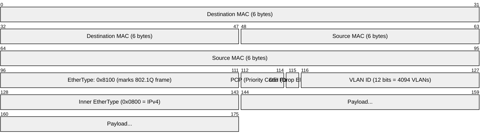
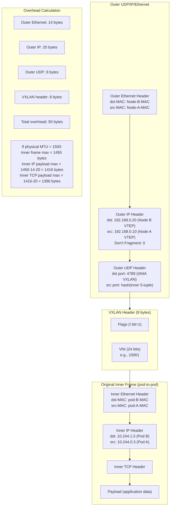
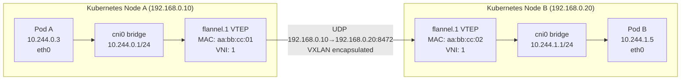
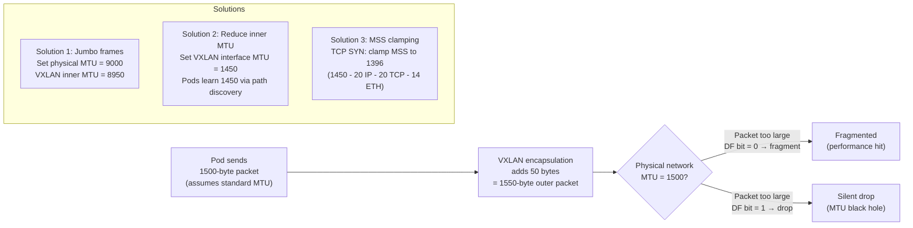

# VLAN, VXLAN, and Overlay Networks — SRE Field Guide

## Table of Contents

- [Overview](#overview)
- [802.1Q VLAN](#8021q-vlan)
  - [Frame Structure](#frame-structure)
  - [Trunk vs Access Ports](#trunk-vs-access-ports)
- [VXLAN: Virtual Extensible LAN](#vxlan-virtual-extensible-lan)
  - [VXLAN Packet Encapsulation](#vxlan-packet-encapsulation)
  - [VTEP: VXLAN Tunnel Endpoint](#vtep-vxlan-tunnel-endpoint)
- [VXLAN in Kubernetes CNIs](#vxlan-in-kubernetes-cnis)
  - [Flannel VXLAN Mode](#flannel-vxlan-mode)
  - [Calico VXLAN Mode](#calico-vxlan-mode)
- [GENEVE: Generic Network Virtualization Encapsulation](#geneve-generic-network-virtualization-encapsulation)
- [VXLAN MTU Problem in Production](#vxlan-mtu-problem-in-production)
- [Production Scenario: Intermittent Drops in K8s Pod-to-Pod Communication](#production-scenario-intermittent-drops-in-k8s-pod-to-pod-communication)
  - [Investigation](#investigation)
- [Failure Modes](#failure-modes)
- [Security Considerations](#security-considerations)
- [Interview Questions](#interview-questions)
  - [Basic](#basic)
  - [Intermediate](#intermediate)
  - [Advanced / Staff Level](#advanced-staff-level)

---

## Overview

Overlay networks exist to solve a fundamental problem: physical network topology constrains logical network design. VLANs segment a physical network into isolated broadcast domains — but they're limited to 4094 segments and require physical switch configuration. VXLAN extends this concept to cloud scale: 16 million virtual segments, spanning any number of physical switches, using standard UDP packets as a transport. Understanding VXLAN is essential for any SRE working with Kubernetes, where every pod network in production is either VXLAN, GENEVE, or a close relative.

---

## 802.1Q VLAN

### Frame Structure



**Key fields:**
- **VLAN ID (VID):** 12 bits → 4094 usable VLANs (0 and 4095 reserved)
- **PCP (Priority Code Point):** QoS marking (0-7, 7 = highest)
- **Native VLAN:** traffic without an 802.1Q tag is assigned to the native VLAN on trunk ports

### Trunk vs Access Ports

| Port Type | What It Carries | Configuration | Use |
|-----------|----------------|---------------|-----|
| **Access port** | Untagged frames for one VLAN | `switchport mode access; switchport access vlan 10` | End devices (servers, desktops) |
| **Trunk port** | Tagged frames for multiple VLANs | `switchport mode trunk; switchport trunk allowed vlan 10,20,30` | Switch-to-switch, switch-to-router, hypervisor uplinks |
| **Native VLAN** | Untagged frames on a trunk | `switchport trunk native vlan 99` | Untagged legacy devices on a trunk |

**Security risk — VLAN hopping:**

```
Attack: double-tagging
1. Attacker on native VLAN (e.g., VLAN 1) sends frame with two 802.1Q tags:
   Outer tag: VLAN 1 (native, gets stripped at first switch)
   Inner tag: VLAN 20 (attacker's target VLAN)
2. First switch strips outer tag (native VLAN behavior)
3. Second switch sees inner tag: VLAN 20 — delivers to VLAN 20!

Mitigation:
- Never use VLAN 1 as native VLAN
- Set native VLAN to a dedicated unused VLAN (e.g., VLAN 999)
- Use `switchport nonegotiate` to disable DTP
```

---

## VXLAN: Virtual Extensible LAN

VXLAN solves the fundamental scaling limits of 802.1Q:
- **Segment limit:** 4094 VLANs → 16 million VXLAN segments (24-bit VNI)
- **Geographical limit:** VLANs require L2 adjacency → VXLAN tunnels over L3 (UDP/IP)
- **Operational limit:** VLAN config requires switch access → VXLAN configured in software

### VXLAN Packet Encapsulation



### VTEP: VXLAN Tunnel Endpoint

A VTEP (VXLAN Tunnel Endpoint) is the component that encapsulates/decapsulates VXLAN packets. In Kubernetes:
- Every node that runs pods is a VTEP
- The VTEP IP is typically the node's primary IP
- Kubernetes CNIs (Flannel, Calico in VXLAN mode) configure VTEPs automatically

```bash
# View VXLAN interfaces (created by CNI)
ip -d link show type vxlan
# 4: flannel.1@NONE: <BROADCAST,MULTICAST,UP,LOWER_UP> mtu 1450 qdisc noqueue
#     vxlan id 1 local 192.168.0.10 dev eth0 srcport 0 0 dstport 8472 ...
#                ^^^^^^^^                    ^^^^^^^^^^^^^^^^^^^^^^^^^^^
#                VNI=1                       Flannel uses 8472, not standard 4789

# Show VTEP forwarding database (MAC-to-VTEP-IP mappings)
bridge fdb show dev flannel.1
# 00:00:00:00:00:00 dst 192.168.0.20 self permanent
# 00:00:00:00:00:00 dst 192.168.0.30 self permanent
# → These are the other nodes' VTEP IPs (destination for encapsulated traffic)

# More detail on the VXLAN tunnel
ip -d link show flannel.1 | grep -E "vxlan|mtu|qdisc"
```

---

## VXLAN in Kubernetes CNIs

### Flannel VXLAN Mode



**Flannel path for pod-A → pod-B:**
1. Pod A sends to 10.244.1.5, default route via `cni0`
2. Node A's routing table: `10.244.1.0/24 via 10.244.1.0 dev flannel.1 onlink`
3. Flannel.1 VTEP: looks up pod-B subnet in VTEP FDB, finds Node B's VTEP IP
4. Encapsulates: adds VXLAN+UDP+IP header, sends to 192.168.0.20:8472
5. Node B's flannel.1 decapsulates, delivers inner frame to cni0
6. cni0 routes to pod-B's veth pair

### Calico VXLAN Mode

Calico in VXLAN mode is similar but uses the standard port 4789 and programs per-route VTEP entries (not per-node):

```bash
# Calico creates vxlan.calico interface
ip -d link show vxlan.calico
# vxlan id 4096 local 192.168.0.10 dev eth0 srcport 0 0 dstport 4789

# Each pod subnet has an explicit route via the destination VTEP
ip route show table main | grep 10.244
# 10.244.0.0/24 via 10.244.0.0 dev vxlan.calico onlink  (local pods)
# 10.244.1.0/24 via 10.244.1.0 dev vxlan.calico onlink  (remote node)
# 10.244.2.0/24 via 10.244.2.0 dev vxlan.calico onlink  (remote node)
```

---

## GENEVE: Generic Network Virtualization Encapsulation

GENEVE is VXLAN's successor, designed to be more extensible. It uses variable-length option headers, allowing tunnel metadata.

**AWS uses GENEVE internally for VPC traffic** (between ENIs on different hosts). AWS Nitro hypervisors terminate GENEVE tunnels.

**Cilium uses GENEVE** as its preferred tunnel mode (in eBPF-based networking).

```bash
# GENEVE interface in Cilium
ip -d link show type geneve
# cilium_vxlan: <BROADCAST,MULTICAST,UP,LOWER_UP> mtu 1500 qdisc noqueue
#   geneve id 2 remote 0.0.0.0 ttl auto dstport 6081

# GENEVE vs VXLAN:
# GENEVE port: 6081 (IANA assigned)
# VXLAN port:  4789 (IANA) or 8472 (Flannel legacy)
# GENEVE supports option TLVs (Type-Length-Value) in header (variable length)
# VXLAN header is fixed 8 bytes
```

---

## VXLAN MTU Problem in Production

This is the single most common VXLAN failure mode.



```bash
# Check VXLAN interface MTU
ip link show flannel.1
# mtu 1450  (correct — Flannel sets this)
# mtu 1500  (wrong — needs to be reduced)

# Set VXLAN interface MTU
ip link set dev flannel.1 mtu 1450

# For Calico: vxlan.calico should also be 1450
ip link set dev vxlan.calico mtu 1450

# Verify pod-level MTU (should inherit from host's VXLAN interface)
kubectl exec -it test-pod -- cat /sys/class/net/eth0/mtu
# 1450 (correct after CNI properly propagates MTU)

# MSS clamping (belt-and-suspenders approach)
iptables -t mangle -A FORWARD -p tcp --tcp-flags SYN SYN \
  -j TCPMSS --clamp-mss-to-pmtu

# Or explicit value
iptables -t mangle -A FORWARD -p tcp --tcp-flags SYN SYN \
  -j TCPMSS --set-mss 1396
```

---

## Production Scenario: Intermittent Drops in K8s Pod-to-Pod Communication

**Incident:** Payment processing pod intermittently fails to receive responses from inventory service. Small health check calls work fine. Large product catalog responses (>~1400 bytes) fail with timeout after 30 seconds.

### Investigation

```bash
# Step 1: Determine if this is pod-to-pod or external
kubectl exec -it payment-pod -- wget -O- http://inventory-service/health
# OK  (small response)

kubectl exec -it payment-pod -- wget -O- http://inventory-service/catalog/all
# Hanging...

# Step 2: Test MTU from inside the pod
kubectl exec -it payment-pod -- ping -c 3 -M do -s 1400 $(kubectl get svc inventory-service -o jsonpath='{.spec.clusterIP}')
# PING ... data bytes
# connect: Message too long  ← MTU problem confirmed

# Determine working MTU
for size in 1450 1420 1400 1380 1350 1300; do
  kubectl exec -it payment-pod -- ping -c 1 -W 2 -M do -s $size inventory-pod-ip &>/dev/null \
    && echo "OK: $size bytes" || echo "FAIL: $size bytes"
done
# OK: 1300, OK: 1350, OK: 1380, FAIL: 1400, FAIL: 1420

# Step 3: Check VXLAN interface MTU on node
NODE=$(kubectl get pod payment-pod -o jsonpath='{.spec.nodeName}')
# SSH to node:
ip link show flannel.1
# flannel.1: mtu 1500  ← BUG: should be 1450

# Step 4: Check pod's MTU
kubectl exec -it payment-pod -- cat /sys/class/net/eth0/mtu
# 1500  ← Pod sees 1500, but physical VXLAN can only carry 1450

# Step 5: Verify ICMP fragmentation needed is blocked
kubectl exec -it payment-pod -- tcpdump -i eth0 icmp &
kubectl exec -it payment-pod -- ping -c 1 -M do -s 1400 inventory-pod-ip
# No ICMP type 3 code 4 seen → PMTUD signal blocked somewhere

# Step 6: Find the iptables rule blocking ICMP
iptables -L -n | grep icmp
# DROP icmp -- 0.0.0.0/0 0.0.0.0/0  icmp type 3 ← This is blocking Fragmentation Needed
```

**Root cause:** Two problems stacked:
1. `flannel.1` MTU had been reset to 1500 (a previous engineer ran `ip link set flannel.1 mtu 1500` while debugging something else)
2. A security hardening script had added `iptables -A INPUT -p icmp -j DROP`, which blocked ICMP Fragmentation Needed messages

**Fix:**

```bash
# Fix flannel.1 MTU
ip link set dev flannel.1 mtu 1450

# Fix ICMP rules
iptables -D INPUT -p icmp -j DROP  # Remove blanket drop
# Add specific allows:
iptables -I INPUT -p icmp --icmp-type fragmentation-needed -j ACCEPT
iptables -I INPUT -p icmp --icmp-type echo-request -j ACCEPT
iptables -I INPUT -p icmp --icmp-type echo-reply -j ACCEPT

# Add MSS clamping (belt-and-suspenders)
iptables -t mangle -A FORWARD -p tcp --tcp-flags SYN SYN \
  -j TCPMSS --clamp-mss-to-pmtu

# Make permanent in Flannel DaemonSet config:
# Set NET_CONF_JSON in ConfigMap to include "MTU": 1450
kubectl edit configmap kube-flannel-cfg -n kube-flannel
# Add to net-conf.json: {"MTU": 1450, ...}
```

---

## Failure Modes

| Failure | Symptoms | Detection | Fix |
|---------|----------|-----------|-----|
| VXLAN MTU mismatch | Large transfers fail, small ones work | `ping -M do -s 1400` fails inside pod | Set VXLAN MTU to 1450; MSS clamping |
| VTEP FDB miss | Pod-to-pod connectivity fails across nodes | `bridge fdb show` missing remote VTEP entries | Restart CNI; check VTEP learning/discovery |
| VXLAN port blocked by firewall | Pod-to-pod fails across nodes | `tcpdump -i eth0 udp port 4789` no traffic | Allow UDP 4789 (or 8472 for Flannel) between nodes |
| Jumbo frames not end-to-end | VXLAN works for small traffic, drops at 8950+ | `ping -M do -s 8900` fails | Verify ALL switches in path support jumbo frames |
| Native VLAN mismatch | Untagged traffic goes to wrong VLAN | `bridge vlan show` wrong native VLAN | Align native VLAN config on both switch ports |
| VLAN trunk not allowing VID | VLAN traffic drops between switches | `show interfaces trunk` missing VLAN ID | Add VLAN to allowed list on trunk |
| GENEVE/VXLAN encryption missing | Pod-to-pod traffic readable on wire | `tcpdump -i eth0 udp port 4789` shows plaintext inner frames | Enable WireGuard/IPSec in CNI (Cilium, Calico) |

---

## Security Considerations

**VXLAN has no native authentication or encryption.** Inner frames are carried as plaintext UDP payload. On a shared physical network:

```bash
# Attacker can capture ALL VXLAN traffic with:
tcpdump -i eth0 -w /tmp/vxlan.pcap udp port 4789
# Then in Wireshark: inner frames fully visible

# An attacker who can send UDP to port 4789 can inject frames
# into any VXLAN segment they know the VNI for
```

**Encryption options:**

1. **Cilium with WireGuard:** Encrypts all pod-to-pod traffic using WireGuard between nodes. No VXLAN needed — Cilium uses eBPF for routing and WireGuard for encryption.

```bash
# Enable WireGuard encryption in Cilium
helm upgrade cilium cilium/cilium \
  --set encryption.enabled=true \
  --set encryption.type=wireguard

# Verify encryption is active
cilium encrypt status
# Encryption: Wireguard   [...]
# Keys in use: 1
```

2. **Calico with WireGuard:**

```bash
# Enable WireGuard for Calico
kubectl patch felixconfiguration default \
  --type='merge' \
  -p '{"spec":{"wireguardEnabled":true}}'
```

3. **IPSec (Calico/Cilium):** Transport-mode IPSec between nodes. More CPU overhead than WireGuard, but FIPS-compliant option.

**Network segmentation with VNIs:**
- Different tenants/namespaces should use different VNIs
- Kubernetes doesn't enforce this by default — all pods share the same VNI in Flannel
- Cilium with network policies can enforce L3/L4 segmentation even within same VNI

---

## Interview Questions

### Basic

**Q: What is the difference between a VLAN and a VXLAN?**

VLAN (802.1Q) is a hardware-based segmentation technology that adds a 12-bit VLAN ID tag to Ethernet frames — limited to 4094 segments and requires L2 adjacency (same broadcast domain). VXLAN is a software overlay that encapsulates L2 frames inside UDP/IP packets — enables 16 million virtual segments (24-bit VNI) and can tunnel across L3 networks. VXLAN is what cloud providers use internally to implement VPCs, and what Kubernetes CNIs use for pod-to-pod networking across different physical hosts.

**Q: What port does VXLAN use?**

IANA-assigned port 4789 for VXLAN. However, Flannel historically used 8472. GENEVE uses 6081. When configuring security groups or firewalls for a Kubernetes cluster, you need to allow UDP traffic on these ports between nodes (not just TCP 6443 and TCP 10250).

### Intermediate

**Q: Why does VXLAN require MTU adjustment and how do you fix it?**

VXLAN adds a 50-byte overhead: 14-byte outer Ethernet + 20-byte outer IP + 8-byte outer UDP + 8-byte VXLAN header. If the physical MTU is 1500 bytes, the inner frame can only be 1450 bytes. If a pod sends a standard 1500-byte IP packet and the VXLAN interface has MTU=1500, the encapsulated packet becomes 1550 bytes — too large for the physical network, causing drops.

Fixes: (1) Set the VXLAN interface MTU to 1450 so pods inherit this value and don't send frames larger than 1450. (2) Enable MSS clamping with iptables `TCPMSS --clamp-mss-to-pmtu` to reduce TCP segment sizes during handshake. (3) Configure jumbo frames (9000-byte MTU) on the physical network — VXLAN overhead then leaves 8950 bytes for inner frames.

### Advanced / Staff Level

**Q: Compare Flannel VXLAN, Calico VXLAN, and Cilium GENEVE architectures. Which would you choose for a new production Kubernetes deployment and why?**

Flannel VXLAN is the simplest: a flat VXLAN network, no network policy enforcement, uses VTEP learning with UDP flood-and-learn or etcd-based VTEP discovery. It's easy to operate but has no built-in security (no network policies) and uses non-standard port 8472.

Calico VXLAN provides both overlay networking (VXLAN) and network policies. It uses BGP for VTEP route distribution (no flood-and-learn), making it more deterministic. Calico can also run in native routing mode (no VXLAN if physical network supports it), which eliminates overhead.

Cilium with GENEVE (or eBPF native routing) is the most sophisticated: eBPF programs in the kernel replace iptables for policy enforcement, providing 10x better performance for network policies at scale. Cilium integrates WireGuard encryption, L7 policy (HTTP-level), and observability (Hubble). The operational complexity is higher, but for large Kubernetes deployments the performance and security benefits are significant.

For production: if the team has capacity to operate it, Cilium with native routing + WireGuard is the best choice for security and performance. If simplicity is paramount and the cluster is <100 nodes, Calico with VXLAN provides a good balance of features and operability.
