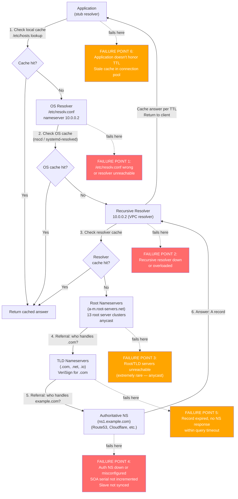
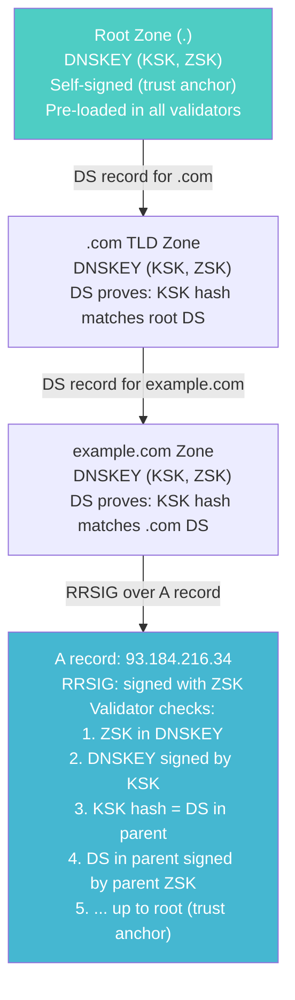
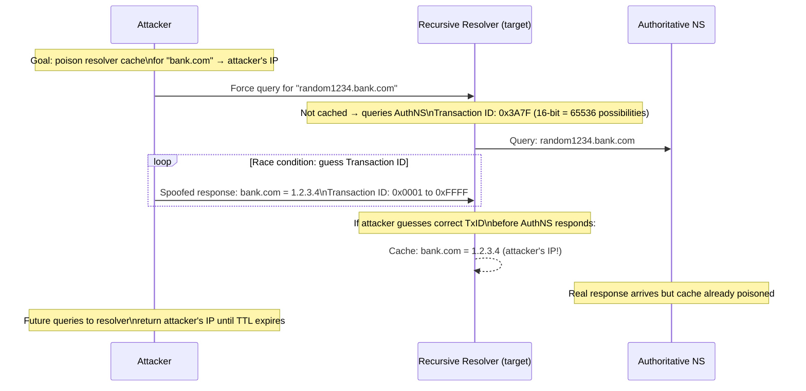
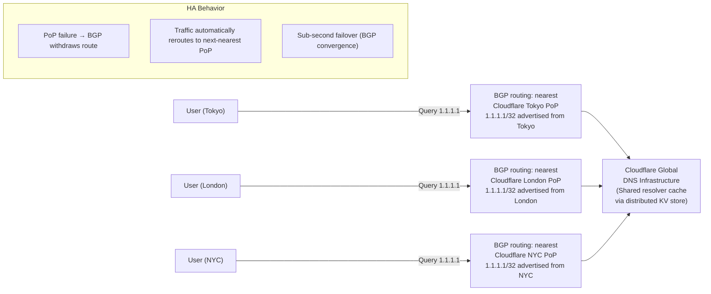
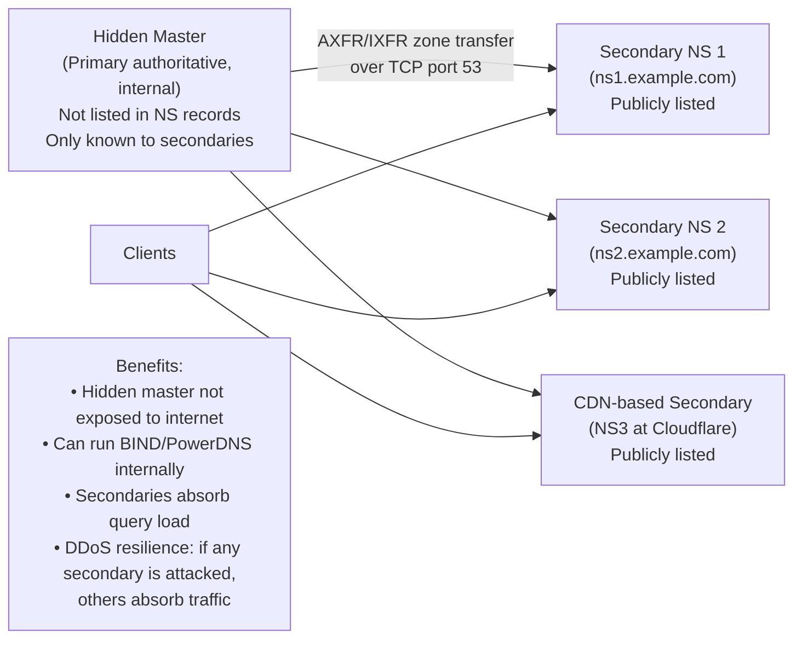
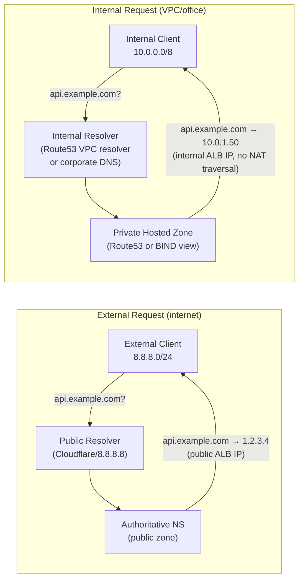

# DNS Comprehensive — SRE Field Guide

## Overview

DNS is simultaneously the simplest protocol in your stack (a name lookup) and the most dangerous single point of failure (everything depends on it). The Dyn 2016 DDoS took down Twitter, GitHub, Spotify, and Reddit simultaneously — DNS. The 2021 Fastly outage took down a significant fraction of the web in under a minute — also DNS-adjacent (BGP to DNS providers). Every production incident response should start with "is DNS working?" This guide extends the foundational DNS knowledge with the depth needed to operate DNS at scale, debug failures that appear to be application bugs, and defend against DNS-based attacks.

---

## DNS Record Types Reference

| Record | Purpose | Example Value | SRE Notes |
|--------|---------|---------------|-----------|
| **A** | IPv4 address | `93.184.216.34` | Primary record type; multiple A records = round-robin |
| **AAAA** | IPv6 address | `2606:2800:220:1:248:1893:25c8:1946` | Must maintain parity with A records |
| **CNAME** | Alias to another name | `www.example.com → example.com` | Cannot coexist with other types at same name |
| **MX** | Mail exchanger + priority | `10 mail.example.com` | Priority: lower = preferred |
| **TXT** | Arbitrary text | SPF, DKIM, domain verification tokens | Max 255 chars per string; multiple strings concatenated |
| **NS** | Authoritative name servers | `ns1.example.com` | Delegation record; must match registrar NS |
| **SOA** | Zone authority metadata | Serial, refresh, retry, expire, minimum | Serial must increment on every change |
| **SRV** | Service locator | `_http._tcp 10 5 80 web.example.com` | Priority, weight, port, target |
| **CAA** | Cert authority authorization | `0 issue "letsencrypt.org"` | Restricts which CAs can issue certs |
| **PTR** | Reverse DNS (IP → name) | `34.216.184.93.in-addr.arpa → example.com` | Required for mail servers |
| **DS** | DNSSEC delegation signer | Hash of child KSK | Parent zone delegates DNSSEC to child |
| **DNSKEY** | DNSSEC public key | Zone signing key / key signing key | Used to verify RRSIG records |
| **RRSIG** | DNSSEC signature | Signature over RRset | Validated against DNSKEY |
| **NSEC/NSEC3** | Authenticated denial | Proves record does NOT exist | NSEC3 uses hashing to prevent zone enumeration |

---

## DNS Resolution Chain with Failure Points



---

## DNSSEC: Chain of Trust

### How DNSSEC Validation Works



**DNSSEC components:**
- **ZSK (Zone Signing Key):** Signs actual DNS records (A, AAAA, MX, etc.). Rotated frequently (monthly).
- **KSK (Key Signing Key):** Signs the DNSKEY record containing the ZSK. Changed less frequently (yearly). Its hash (DS record) is published in the parent zone.
- **RRSIG:** Signature covering an entire RRset (all records of one type for one name).
- **DS record:** Hash of child zone's KSK, published in parent zone. This is how trust is delegated.
- **NSEC3:** Authenticated denial of existence using hashed owner names (prevents zone walking).

### DNSSEC Failure Modes

```bash
# Test DNSSEC validation
dig +dnssec example.com A
# Look for "ad" flag in response flags (Authenticated Data)
# NOERROR + ad flag = DNSSEC validated

# SERVFAIL with DNSSEC = validation failure
dig @8.8.8.8 +dnssec broken-dnssec.example.com A
# ;; ->>HEADER<<- opcode: QUERY, status: SERVFAIL
# No answer section

# To bypass DNSSEC validation (for debugging)
dig @8.8.8.8 +cd broken-dnssec.example.com A
# +cd = Checking Disabled — skips validation
# If this works but normal query fails → DNSSEC signature problem

# Check with Verisign's DNSSEC debugger
dig @dnscheck.verisignlabs.com broken-dnssec.example.com A +dnssec

# Common DNSSEC failures:
# 1. Signature expired (RRSIG validity period passed)
# 2. Clock skew: validator's clock more than ~5 minutes off → signatures appear expired
# 3. KSK rollover botched: new KSK published, DS record in parent not updated
# 4. Zone re-signed with new keys but old DS still in parent (stale DS)
```

---

## DNS Security Attacks

### Kaminsky Cache Poisoning Attack (2008)



**Why pre-2008 DNS was vulnerable:** The original DNS used predictable or low-entropy transaction IDs. An attacker could send thousands of spoofed responses with different IDs and win the race.

**Mitigations:**
1. **Source port randomization (RFC 5452):** Modern resolvers randomize both TxID (16-bit) AND source port (16-bit) — attacker must guess both: 65535 × 65535 = 4 billion combinations.
2. **DNSSEC:** Cryptographic signatures mean a poisoned response will fail validation.
3. **DNS-over-TLS/HTTPS:** Encrypted channel eliminates spoofing possibility.

### DNS Rebinding Attack

```
Attack flow:
1. Victim visits malicious page: attacker.com
2. DNS A record for attacker.com = attacker's server (TTL=1s)
3. JavaScript loads from attacker.com, runs in browser
4. After 1 second, DNS TTL expires
5. attacker.com DNS now resolves to 192.168.1.1 (victim's router)
6. Browser's same-origin policy checks hostname, not IP
7. JavaScript makes XHR to attacker.com → browser resolves to 192.168.1.1
8. Router's admin interface is now accessible via browser

Impact: SSRF via browser, bypass of local service restrictions
Mitigation: DNS rebinding protection in resolvers (block private IPs for public names),
           application-level Host header validation,
           bind services to 127.0.0.1 not 0.0.0.0
```

### DNS Amplification DDoS

```
Attack:
1. Attacker spoofs victim's IP as source
2. Sends DNS queries to open resolvers: "dig ANY isc.org @8.8.8.8"
3. Small query (40-60 bytes) → large response (4000+ bytes)
4. Amplification factor: ~70x
5. Distributed across many open resolvers → volumetric DDoS against victim

Mitigation:
- Never run open resolvers (only answer queries from your own networks)
- Rate limit outbound DNS responses (Response Rate Limiting/RRL)
- BCP38: ISPs filter spoofed source IPs (prevents IP spoofing at source)
- DNSSEC: responses larger but attacker has less control; use NSEC3 to limit DNS ANY responses
```

---

## DoH vs DoT: Operational Trade-offs

| Aspect | DNS-over-TLS (DoT) | DNS-over-HTTPS (DoH) |
|--------|-------------------|---------------------|
| Port | TCP/853 | TCP/443 |
| Protocol | TLS over TCP | HTTP/2 or HTTP/3 over TLS |
| Identifiability | Port 853 is distinctly DNS — easily blocked or monitored | Uses port 443 — indistinguishable from HTTPS traffic |
| Performance | Dedicated connection, low overhead | HTTP framing overhead; connection multiplexing helps |
| Deployment | OS/resolver level (systemd-resolved, Android) | Browser-level (Firefox, Chrome); application-level |
| Proxy/intercept | Enterprise proxies can block port 853 | Enterprise proxies can't inspect DoH (TLS) without MITM |
| DNS-based filtering | Bypassed by client | Bypassed by client |
| Split-horizon DNS | Works with per-network DoT resolver config | Works with per-network DoH resolver URL |
| RCODE visibility | Full DNS semantics preserved | Full DNS semantics in HTTP response body |
| Operational concern | Firewall rule needed (allow TCP/853 outbound) | Transparent to firewalls — concerns about bypassing enterprise DNS |

**Enterprise SRE implication:**
- DoH in browsers bypasses corporate DNS filtering and split-horizon configurations
- Firefox's "Trusted Recursive Resolver" (Cloudflare by default) sends all DNS to Cloudflare, not corporate resolver
- Detection/mitigation: configure `network.trr.mode=5` via enterprise policy (disables DoH); or block DoH providers by IP
- Split-horizon can be preserved: configure the browser/OS to use a specific DoH provider that implements your internal zones (e.g., a self-hosted NextDNS or Cloudflare Gateway)

```bash
# Test DoT (DNS-over-TLS)
kdig -d @1.1.1.1 +tls-ca example.com A
# or with openssl:
openssl s_client -connect 1.1.1.1:853 -servername 1.1.1.1

# Test DoH (DNS-over-HTTPS)
curl -H "accept: application/dns-json" \
  "https://cloudflare-dns.com/dns-query?name=example.com&type=A"
# {"Status":0,"TC":false,"RD":true,"RA":true,"AD":false,"CD":false,
#  "Question":[{"name":"example.com","type":1}],
#  "Answer":[{"name":"example.com","type":1,"TTL":1234,"data":"93.184.216.34"}]}

# Configure systemd-resolved for DoT
# /etc/systemd/resolved.conf:
[Resolve]
DNS=1.1.1.1#cloudflare-dns.com 1.0.0.1#cloudflare-dns.com
DNSOverTLS=yes

systemctl restart systemd-resolved
resolvectl status
```

---

## Anycast DNS: How Cloudflare 1.1.1.1 Works

Anycast is a routing technique where multiple servers share the same IP address. BGP routes traffic to the geographically nearest server.



**Why anycast DNS is resilient:**
- Single VIP address, but physically distributed — no single point of failure
- BGP-level load balancing across PoPs
- Local failure causes BGP withdrawal; traffic flows to next-nearest PoP automatically
- Ddos mitigation: volumetric attacks are absorbed across all PoPs globally

**Secondary DNS / Hidden Master pattern:**



---

## Split-Horizon DNS

Split-horizon DNS serves different answers for the same name based on the requester's source network.



### Implementation with BIND Views

```bash
# BIND named.conf split-horizon via views
view "internal" {
    match-clients { 10.0.0.0/8; 192.168.0.0/16; };
    recursion yes;

    zone "example.com" {
        type master;
        file "/etc/bind/zones/internal/db.example.com";
    };
};

view "external" {
    match-clients { any; };
    recursion no;  # Public view: no recursion!

    zone "example.com" {
        type master;
        file "/etc/bind/zones/external/db.example.com";
    };
};
```

### Implementation with CoreDNS (Kubernetes)

```yaml
# CoreDNS Corefile with split-horizon
apiVersion: v1
kind: ConfigMap
metadata:
  name: coredns
  namespace: kube-system
data:
  Corefile: |
    .:53 {
        errors
        health { lameduck 5s }
        ready
        kubernetes cluster.local in-addr.arpa ip6.arpa {
           pods insecure
           fallthrough in-addr.arpa ip6.arpa
        }
        # Internal domain: resolve from internal DNS
        rewrite name api.example.com api-internal.example.com
        hosts {
            10.0.1.50 api-internal.example.com
            fallthrough
        }
        prometheus :9153
        forward . /etc/resolv.conf {
          max_concurrent 1000
        }
        cache 30
        loop
        reload
        loadbalance
    }
    # External domain with internal override
    example.com:53 {
        errors
        file /etc/coredns/example.com.db
        cache 30
    }
```

```bash
# Route53: private hosted zone with same name as public zone
# Public zone: example.com (public) → api.example.com = 1.2.3.4
# Private zone: example.com (private, associated with VPC vpc-abc123)
#   → api.example.com = 10.0.1.50

# Verify internal vs external resolution
# From inside VPC:
dig @169.254.169.253 api.example.com
# Should return: 10.0.1.50

# From external:
dig @8.8.8.8 api.example.com
# Should return: 1.2.3.4
```

---

## DNS Performance: Negative TTL, NXDOMAIN Caching, Resolver Sizing

### Negative TTL

The SOA record's MINIMUM field controls how long resolvers cache NXDOMAIN (non-existent domain) responses.

```bash
# Check SOA for negative TTL
dig example.com SOA
# example.com. 900 IN SOA ns1.example.com. admin.example.com.
#   2024010101 (serial)
#   7200       (refresh)
#   900        (retry)
#   1814400    (expire)
#   300        (minimum/negative TTL)
#              ^^^
#              NXDOMAINs cached for 300 seconds

# If you recently created a record but clients get NXDOMAIN:
# They may have cached the NXDOMAIN for up to 300s
# Nothing you can do except wait or flush their resolver cache
```

### NXDOMAIN Caching Impact

```bash
# Kubernetes ndots:5 problem creates excessive NXDOMAIN lookups
# Pod resolving "redis":
# 1. redis.default.svc.cluster.local → NXDOMAIN (cached 300s)
# 2. redis.default.cluster.local → NXDOMAIN (cached 300s)
# 3. redis.cluster.local → NXDOMAIN (cached 300s)
# 4. redis.svc.cluster.local → wait, this shouldn't be tried
# Actually: ndots:5 means any name with <5 dots tries all search domains FIRST

# See /etc/resolv.conf in a pod
kubectl exec -it some-pod -- cat /etc/resolv.conf
# nameserver 10.96.0.10
# search default.svc.cluster.local svc.cluster.local cluster.local
# options ndots:5

# The 5 search domains × all queries = 5x DNS traffic!
# With NXDOMAIN caching, subsequent lookups hit cache but first lookup is slow.

# Fix: use FQDNs with trailing dot (skip search domain lookup)
# redis.default.svc.cluster.local.   ← note trailing dot
# Or tune ndots to 2:
```

```yaml
# Per-pod DNS configuration to reduce search overhead
apiVersion: v1
kind: Pod
spec:
  dnsConfig:
    options:
      - name: ndots
        value: "2"
      - name: timeout
        value: "5"
      - name: attempts
        value: "2"
```

### Resolver Cache Sizing

```bash
# CoreDNS cache configuration
# In Corefile:
cache 120 {
    # Maximum TTL to cache (overrides record TTL if lower)
    # success 9984 120   # 9984 entries for successful responses, max 120s TTL
    # denial  9984 30    # 9984 entries for NXDOMAIN responses, max 30s
    success 9984 120
    denial 9984 30
    prefetch 10          # Prefetch popular entries when 10% of TTL remains
}

# Check CoreDNS metrics
kubectl port-forward -n kube-system svc/kube-dns 9153:9153 &
curl localhost:9153/metrics | grep -E "cache|request"
# coredns_cache_entries{server="dns://:53",type="denial"} 234
# coredns_cache_entries{server="dns://:53",type="success"} 4521
# coredns_cache_hits_total{...} 89421
# coredns_cache_misses_total{...} 1234
# Cache hit rate: 89421 / (89421 + 1234) = 98.6% (healthy)
```

---

## Production Scenario: DNS Propagation Delay Causing Multi-Region Inconsistency

**Incident:** Blue-green deployment of `api.company.com` completes at 14:00. Traffic shifted via DNS change (`api.company.com` A record updated from `10.0.1.50` to `10.0.2.50`). At 14:20, monitoring shows 15% of requests still hitting old backend (10.0.1.50). Old backend is scheduled for shutdown at 14:30.

### Investigation

```bash
# Step 1: Confirm the DNS change propagated to authoritative NS
dig @ns1.company.com api.company.com A +short
# 10.0.2.50 ← correct, change propagated to auth NS

# Step 2: Check TTL before the change
# (From pre-change query logs or monitoring)
# api.company.com TTL was 300 seconds

# Step 3: Identify which resolvers are returning old answer
# Check multiple resolvers:
dig @8.8.8.8 api.company.com A +short
# 10.0.2.50 ✓

dig @1.1.1.1 api.company.com A +short
# 10.0.2.50 ✓

# Check corporate/VPC resolver:
dig @10.0.0.2 api.company.com A +short
# 10.0.1.50  ← STALE! Corporate resolver hasn't expired cached entry

# Step 4: Find TTL remaining on cached entry
dig @10.0.0.2 api.company.com A
# ;; ANSWER SECTION:
# api.company.com. 187 IN A 10.0.1.50
#                  ^^^
#                  187 seconds remaining in cache
# Old TTL was 300s, change happened at 14:00, it's now 14:03 (3 min in)
# 300 - 180 = 120s remaining → should clear by 14:05

# Step 5: Trace which clients are using the corporate resolver
# From load balancer access logs:
grep "10.0.1.50" /var/log/nginx/access.log | awk '{print $1}' | sort -u
# → These are internal clients still hitting old IP

# Step 6: Forced flush of corporate resolver (if it's yours)
# For BIND:
rndc flushname api.company.com

# For CoreDNS (in Kubernetes):
# No flush command — must restart pods for immediate effect
kubectl rollout restart deployment/coredns -n kube-system
```

### The 0 TTL Trade-off

Setting TTL=0 (zero) means resolvers should NOT cache the record at all — every query goes to the authoritative server.

| Aspect | TTL=0 | TTL=60 | TTL=300 | TTL=3600 |
|--------|-------|--------|---------|---------|
| Propagation time | Instant | 60 sec | 5 min | 1 hour |
| Query volume | Very high (no caching) | High | Moderate | Low |
| Auth NS load | Every query hits auth NS | High | Moderate | Low |
| Cost | High (Route53 charges per query) | Moderate | Low | Very low |
| DDoS resilience | None (auth NS exposed to all queries) | Some | Good | Good |
| Use case | A/B testing, rapid failover | Migration windows | Normal prod | Stable infra |

**Why not use TTL=0 permanently:**
1. Auth NS load scales with all resolver queries, not just unique clients
2. Route53 pricing: $0.40/million queries — at 10K RPS: 864M queries/day = $345/day
3. Single auth NS failure = instant DNS failure for all clients
4. Latency: every DNS lookup requires a round trip to auth NS (~50ms) instead of serving from cache (<1ms)

**Best practice for migrations:**
```
T-48h: Lower TTL from 3600 → 300
T-24h: Confirm TTL=300 is visible everywhere
T-0:   Make DNS change. Propagation ≤ 300 seconds.
T+6h:  Raise TTL back to 3600
```

---

## Debugging Guide

```bash
# ============================================================
# Basic DNS debugging
# ============================================================

# Full trace from root to authoritative
dig example.com A +trace

# Check TTL remaining in answer
dig example.com A
# ANSWER SECTION:
# example.com. 287 IN A 93.184.216.34
#              ^^^  remaining TTL in seconds

# Query specific nameserver
dig @ns1.example.com example.com A

# Check all NS records and validate they're consistent
for ns in $(dig example.com NS +short); do
  echo "=== $ns ==="; dig @$ns example.com A +short
done

# Measure DNS resolution time
time dig example.com A +noall +answer

# ============================================================
# DNSSEC debugging
# ============================================================

# Check if answer is DNSSEC validated (ad flag)
dig +dnssec example.com A | grep "flags:"
# flags: qr rd ra ad  ← "ad" = authenticated data

# Check validation with explicit DNSSEC query
dig +dnssec example.com DNSKEY
dig +dnssec example.com RRSIG

# Test validation bypass (for debugging broken DNSSEC)
dig +cd +dnssec example.com A  # +cd = checking disabled

# Check DNSSEC chain
delv @8.8.8.8 example.com A +rtrace
# Shows each validation step in the chain

# ============================================================
# Kubernetes DNS debugging
# ============================================================

# Check CoreDNS pods are running
kubectl get pods -n kube-system -l k8s-app=kube-dns

# Check CoreDNS logs
kubectl logs -n kube-system -l k8s-app=kube-dns -f

# Test DNS from inside a pod
kubectl run -it --rm debug --image=busybox --restart=Never -- sh
  nslookup kubernetes
  nslookup kubernetes.default.svc.cluster.local
  cat /etc/resolv.conf

# Test specific DNS patterns (ndots behavior)
kubectl exec -it debug-pod -- nslookup redis
# Should work within same namespace without FQDN

# CoreDNS metrics
kubectl port-forward -n kube-system svc/kube-dns 9153:9153
curl -s localhost:9153/metrics | grep -E "cache|request|error"

# ============================================================
# Split-horizon debugging
# ============================================================

# Confirm which answer you're getting
dig api.example.com A
# Check if returned IP is internal or external

# Compare internal vs external resolver answers
dig @10.0.0.2 api.example.com A +short  # Internal
dig @8.8.8.8 api.example.com A +short   # External

# Check Route53 private hosted zone is associated with your VPC
aws route53 list-hosted-zones-by-vpc \
  --vpc-id vpc-0123456789abcdef0 \
  --vpc-region us-east-1
```

---

## Route 53 Advanced Routing Policies

```bash
# Weighted routing (canary deployment)
# 90% → v1, 10% → v2
aws route53 change-resource-record-sets --hosted-zone-id Z123 --change-batch '{
  "Changes": [
    {
      "Action": "UPSERT",
      "ResourceRecordSet": {
        "Name": "api.example.com",
        "Type": "A",
        "SetIdentifier": "v1",
        "Weight": 90,
        "TTL": 60,
        "ResourceRecords": [{"Value": "10.0.1.50"}]
      }
    },
    {
      "Action": "UPSERT",
      "ResourceRecordSet": {
        "Name": "api.example.com",
        "Type": "A",
        "SetIdentifier": "v2",
        "Weight": 10,
        "TTL": 60,
        "ResourceRecords": [{"Value": "10.0.2.50"}]
      }
    }
  ]
}'

# Failover routing (active-passive)
# Primary with health check
aws route53 change-resource-record-sets --hosted-zone-id Z123 --change-batch '{
  "Changes": [{
    "Action": "UPSERT",
    "ResourceRecordSet": {
      "Name": "api.example.com",
      "Type": "A",
      "SetIdentifier": "primary",
      "Failover": "PRIMARY",
      "TTL": 60,
      "HealthCheckId": "hc-0123456789abcdef0",
      "ResourceRecords": [{"Value": "10.0.1.50"}]
    }
  }]
}'
```

---

## Failure Modes

| Failure | Symptoms | Detection | Fix |
|---------|----------|-----------|-----|
| Auth NS down | SERVFAIL for all records in zone | `dig @auth-ns example.com` SERVFAIL | Restore NS; ensure 2+ NS in different networks |
| DNSSEC expired signature | SERVFAIL from validating resolvers | `delv` shows validation error; `+cd` bypasses it | Re-sign zone; ensure auto-signing is configured |
| Stale cache after migration | Old IPs still returned post-migration | `dig @resolver` shows stale TTL | Wait for TTL; flush corporate resolver; reduce TTL pre-migration |
| CNAME at apex | MX/NS/SOA broken; email fails | `dig example.com CNAME` at zone apex | Use A/AAAA or Route53 ALIAS record |
| SOA serial not incremented | Slave NS doesn't pick up changes | `dig example.com SOA` on primary vs secondary | Increment serial; use YYYYMMDDNN format |
| ndots:5 causing slow lookup | Pod DNS resolution adds 100-500ms | `tcpdump port 53` shows multiple NXDOMAIN before success | Set ndots:2 in pod spec; use FQDNs |
| DNS tunneling | Exfiltration; high DNS query volume | Abnormal TXT/NULL record queries; large query payloads | DPI; DNS query rate monitoring; restrict record types |
| NXDOMAIN cached | New record not resolving for clients | `dig @resolver` returns cached NXDOMAIN | Wait for negative TTL to expire; pre-lower SOA minimum |
| Route53 health check failure | Failover routing redirects to secondary prematurely | CloudWatch `HealthCheckStatus` metric | Fix endpoint health or adjust health check thresholds |

---

## Security Considerations

**DNSSEC deployment checklist:**
- Enable at registrar: add DS record to parent zone
- Auto-signing: configure zone signing with automatic key rollover
- NSEC3 (not NSEC): prevents zone enumeration by hashing owner names
- Monitor signature expiry: alert when RRSIG expiry < 7 days

**DNS monitoring for security:**
```bash
# Monitor for DNS tunneling indicators
# Excessively long DNS query names (tunneling encodes data in name)
tcpdump -i eth0 'udp port 53' -l | \
  awk '/Query/ {if(length($NF) > 50) print "Long query:", $NF}'

# Monitor for high NXDOMAIN rates (reconnaissance or misconfiguration)
# In CoreDNS metrics:
coredns_dns_responses_total{rcode="NXDOMAIN"}

# DNS query rate alerting
# If rate > baseline × 5: possible amplification attack or misconfigured client
```

**CAA records — restrict certificate issuance:**
```bash
# Only Let's Encrypt can issue certs for example.com
dig example.com CAA
# example.com. 3600 IN CAA 0 issue "letsencrypt.org"
# example.com. 3600 IN CAA 0 issuewild ";"  ← no wildcards

# Add CAA records to all zones — prevents unauthorized cert issuance even if DNS is compromised
# This is defense-in-depth: attacker who poisons your DNS cannot get a CA to issue certs
# because CA checks CAA before issuing
```

---

## Interview Questions

### Basic

**Q: What is the difference between a recursive resolver and an authoritative nameserver?**

An authoritative nameserver knows the definitive answer for records in its zone — it's the source of truth. A recursive resolver queries on behalf of clients: if it doesn't have the answer cached, it follows the referral chain (root → TLD → authoritative) to find the answer, caches it, and returns it to the client. Clients typically talk to a recursive resolver (their ISP's resolver, 8.8.8.8, 1.1.1.1, or a VPC resolver). Recursive resolvers talk to authoritative nameservers. A server can be both, but it's a security best practice to separate them (authoritative NS should not perform recursion for untrusted clients).

**Q: What is DNSSEC and does it encrypt DNS traffic?**

DNSSEC adds cryptographic signatures to DNS responses, allowing resolvers to verify that the answer came from the legitimate zone owner and was not modified in transit. It does NOT encrypt DNS traffic — queries and responses are still visible on the wire. DNSSEC prevents cache poisoning (Kaminsky attack) and response spoofing by creating a chain of trust from the root zone down to the specific record. DNS-over-TLS and DNS-over-HTTPS provide encryption but are separate from DNSSEC.

### Intermediate

**Q: You're migrating a service to a new IP. How do you minimize downtime from DNS propagation delay?**

48-72 hours before cutover: lower TTL from production value (often 3600s) to 60-300s. At cutover time: update the DNS record. All resolvers with cached entries will re-query within the new TTL window (max 300 seconds). Keep the old IP responding for at least one old-TTL period after the change (in case any resolver ignores TTL reductions). After stabilization, raise TTL back to 3600s to reduce resolver load and authoritative NS queries. Common mistake: changing the DNS and immediately decommissioning the old IP — this breaks clients whose resolvers haven't expired the old entry.

**Q: Explain the Kaminsky DNS cache poisoning attack and how modern DNS prevents it.**

Kaminsky discovered that by forcing a resolver to query for a name under an attacker-controlled subdomain, and simultaneously flooding the resolver with spoofed responses containing different transaction IDs, an attacker could probabilistically poison the resolver's cache for the parent domain. The fix has two components: (1) randomize both the transaction ID (16-bit, 65536 options) and the source port (16-bit, 65536 options) — the attacker must now guess both simultaneously (4 billion combinations, impractical in a typical query window); (2) DNSSEC makes the entire class of attack moot for DNSSEC-signed zones because forged responses fail cryptographic validation.

### Advanced / Staff Level

**Q: How would you design a multi-region DNS architecture for a service with <1-minute failover requirement?**

Architecture: Route53 with latency-based routing + health checks + separate records per region.

Design:
1. **Per-region A records** with Route53 health checks: `api-us-east.example.com → 1.2.3.4`, `api-eu-west.example.com → 5.6.7.8`. Health checks hit `/health` every 30 seconds from 3 Route53 health check regions.
2. **Latency-based routing** with health checks for the main record `api.example.com`: clients route to lowest-latency region; if health check fails, Route53 removes that region from consideration.
3. **TTL = 60 seconds**: gives <1 minute propagation on failover. Trade-off: increased query volume (manageable with Route53).
4. **Health check sensitivity**: set 3 consecutive failures before marking unhealthy. With 30-second check intervals: 90 seconds to detect failure + 60-second TTL expiry = ~2.5 minutes worst case. For <1 minute SLA: reduce health check interval to 10 seconds (Route53 fast health checks, higher cost), set 1 failure threshold, and pre-warm DNS caches with `prefetch` in resolvers.
5. **Secondary DNS**: add a secondary DNS provider (NS1, Cloudflare) as backup for Route53 itself — the Dyn 2016 incident showed single DNS provider risk.
6. **Operational runbook**: test failover monthly; monitor `Route53ResolverQueryVolume` and `HealthCheckStatus`; alert on `HealthCheckStatus = 0` for any region.
