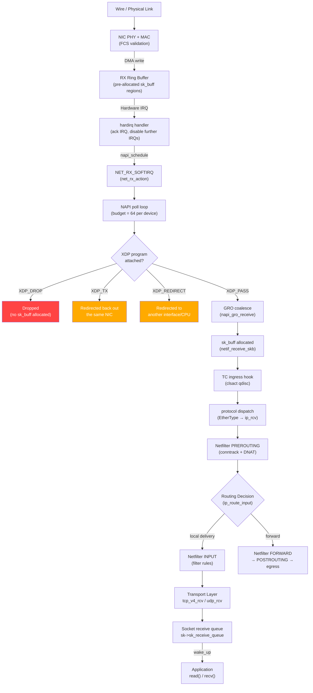
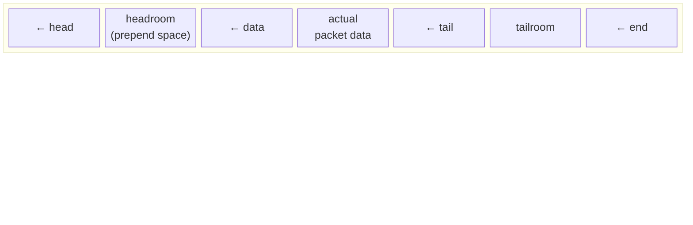
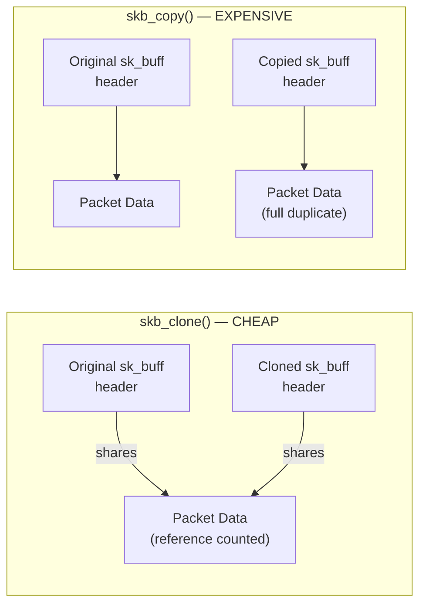
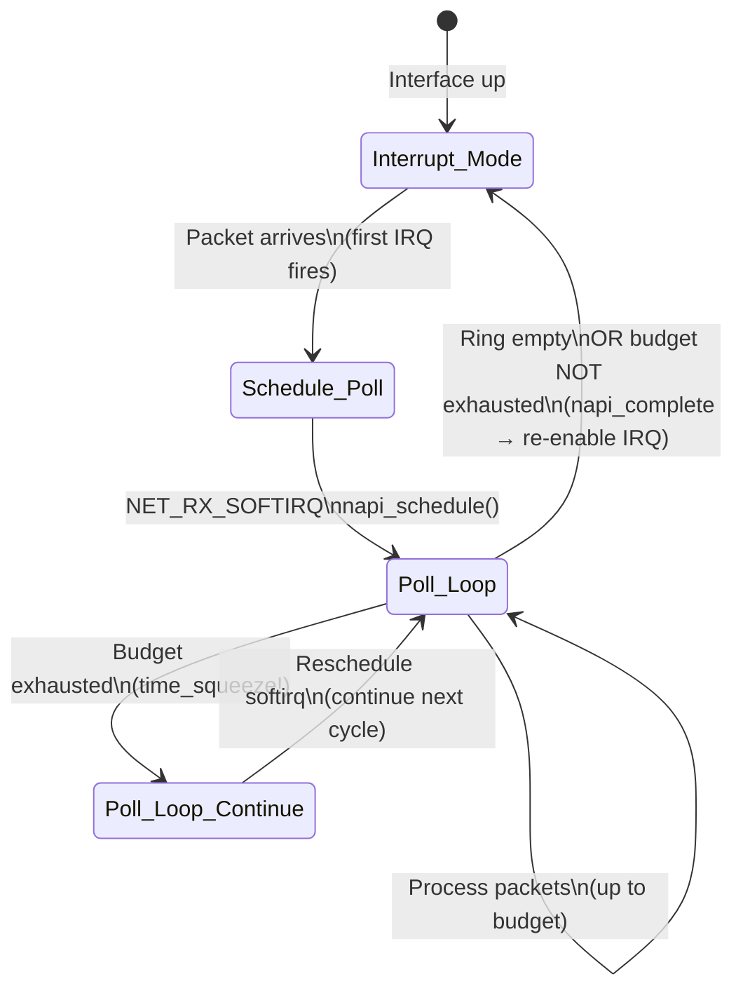
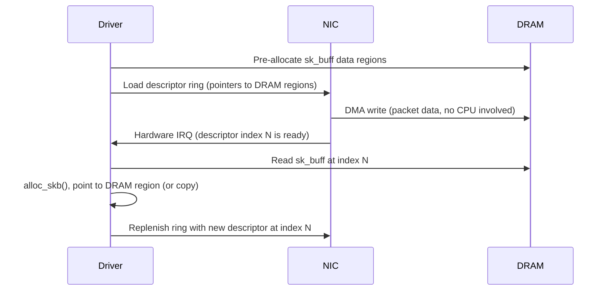

# Linux Network Stack Internals

## Table of Contents

- [Overview](#overview)
- [Complete Packet Ingress Path](#complete-packet-ingress-path)
  - [NIC → Socket: The Full Journey](#nic-socket-the-full-journey)
  - [Stage-by-Stage Failure Modes](#stage-by-stage-failure-modes)
- [sk_buff: The Kernel's Packet Representation](#sk_buff-the-kernels-packet-representation)
  - [Buffer Layout](#buffer-layout)
  - [Key Fields Beyond Pointers](#key-fields-beyond-pointers)
  - [Clone vs Copy: Why It Matters](#clone-vs-copy-why-it-matters)
  - [Headroom: The Encapsulation Budget](#headroom-the-encapsulation-budget)
- [NAPI: New API for High-Performance RX](#napi-new-api-for-high-performance-rx)
  - [The Pre-NAPI Problem](#the-pre-napi-problem)
  - [NAPI Hybrid Model](#napi-hybrid-model)
  - [Budget Parameters](#budget-parameters)
  - [Tuning Strategy](#tuning-strategy)
- [Ring Buffer: DMA and Sizing](#ring-buffer-dma-and-sizing)
  - [How the RX Ring Works](#how-the-rx-ring-works)
  - [Sizing the Ring Buffer](#sizing-the-ring-buffer)
  - [Ring Buffer Size Trade-offs](#ring-buffer-size-trade-offs)
- [Real-World Production Scenario](#real-world-production-scenario)
  - [Scenario: Node Experiencing Silent Packet Drops After Traffic Spike](#scenario-node-experiencing-silent-packet-drops-after-traffic-spike)
- [Failure Modes Reference](#failure-modes-reference)
- [Debugging Guide](#debugging-guide)
  - [Systematic Drop Investigation (Bottom-Up)](#systematic-drop-investigation-bottom-up)
  - [Packet Tracing with ftrace/perf](#packet-tracing-with-ftraceperf)
- [Security Considerations](#security-considerations)
- [Interview Questions](#interview-questions)
  - [Basic](#basic)
  - [Intermediate](#intermediate)
  - [Advanced / Staff Level](#advanced-staff-level)

---

## Overview

Every Senior SRE should be able to answer: "A customer reports intermittent packet loss — where do you start?" The answer is a systematic walk from NIC hardware through the kernel to userspace. Jumping straight to "check the firewall" reveals a dangerous knowledge gap. This file covers the complete ingress path, the sk_buff data structure, NAPI polling, ring buffers, and every failure mode along the way.

---

## Complete Packet Ingress Path

### NIC → Socket: The Full Journey



### Stage-by-Stage Failure Modes

Each stage in the path has a distinct failure signature:

```
Stage 1: NIC RX Ring Buffer
  FAILURE: ring overflow → packets dropped before kernel sees them
  DETECTION: ethtool -S eth0 | grep -E '(rx_missed|rx_no_buffer|rx_dropped)'
  FIX: ethtool -G eth0 rx 4096

Stage 2: NAPI softirq processing
  FAILURE: budget exhausted → time_squeeze events, processing deferred
  DETECTION: cat /proc/net/softnet_stat  (column 3 = time_squeeze)
  FIX: sysctl -w net.core.netdev_budget=600

Stage 3: netdev backlog queue
  FAILURE: queue full → packets dropped silently
  DETECTION: /proc/net/softnet_stat column 2 (dropped)
  FIX: sysctl -w net.core.netdev_max_backlog=10000

Stage 4: Netfilter / conntrack
  FAILURE: conntrack table full → ALL new connections dropped
  DETECTION: dmesg | grep "nf_conntrack: table full"
  FIX: sysctl -w net.netfilter.nf_conntrack_max=262144

Stage 5: TCP socket backlog (SYN queue)
  FAILURE: SYN queue full → new connections dropped (with syncookies: degraded)
  DETECTION: nstat -z | grep TcpExtListenDrops
  FIX: sysctl -w net.ipv4.tcp_max_syn_backlog=4096

Stage 6: Accept queue overflow
  FAILURE: completed handshakes dropped (app too slow to accept())
  DETECTION: nstat -z | grep ListenOverflows; ss -tnl (Recv-Q near Send-Q)
  FIX: increase listen() backlog, increase somaxconn, scale app

Stage 7: Socket receive buffer full
  FAILURE: kernel drops data, sends zero-window
  DETECTION: nstat -z | grep TCPRcvQDrop; ss showing Recv-Q near buffer limit
  FIX: increase tcp_rmem max, enable tcp_moderate_rcvbuf
```

---

## sk_buff: The Kernel's Packet Representation

Every packet in the Linux kernel is represented by `struct sk_buff`. Understanding its memory layout explains why certain operations are "free" and others are expensive.

### Buffer Layout



| Pointer | Meaning | Performance Implication |
|---------|---------|------------------------|
| `head` | Start of allocated buffer | Fixed at allocation |
| `data` | Start of valid packet data | Can advance (strip headers) or retreat (prepend headers) |
| `tail` | End of valid packet data | Advances as data appended |
| `end` | End of allocated buffer | Fixed at allocation |
| `len` | `tail - data` + frag lengths | O(1) read |

### Key Fields Beyond Pointers

| Field | Size | Purpose |
|-------|------|---------|
| `protocol` | 2 bytes | L3 type (ETH_P_IP, ETH_P_IPV6) |
| `mark` | 32 bits | Arbitrary mark — set by iptables `-j MARK` or eBPF, used for routing decisions |
| `cb[48]` | 48 bytes | Per-layer scratchpad — TCP uses it for sequence numbers, timestamps |
| `nf_conntrack` | pointer | Attached conntrack entry (set at PREROUTING) |
| `priority` | 32 bits | QoS priority (maps to TC class) |

### Clone vs Copy: Why It Matters



**Clone** (`skb_clone()`): Creates a new sk_buff header that references the same data pages. The data is not copied — only the metadata struct is duplicated. Used by:
- Multicast fan-out (one packet, N clones delivered to N sockets)
- Packet tapping (tcpdump, libpcap receive a clone)
- Overhead: ~240 bytes for the new header

**Copy** (`skb_copy()`): Full duplication including all data pages. Required when a cloned sk_buff needs modification (e.g., NAT header rewrite on a cloned packet). Expensive: proportional to packet size.

**Hidden expensive operation: `skb_linearize()`**

Modern NICs use scatter-gather I/O, so packet data may span multiple memory pages (stored as `skb_frag_t` structs in the `frags[]` array). Some kernel paths require all data in contiguous memory and call `skb_linearize()`, which forces a full data copy. This is a hidden performance killer in:
- Some iptables operations on fragmented skbs
- IPsec encryption paths
- Old NIC drivers that don't support SG

### Headroom: The Encapsulation Budget

The gap between `head` and `data` is "headroom." When the kernel needs to prepend a header (e.g., VXLAN encapsulation adds 50 bytes), it retreats the `data` pointer into the headroom — no memory allocation or copy needed.

```
Default headroom: ~NET_SKB_PAD bytes (varies, typically 64-128)
VXLAN overhead: 50 bytes (14 Ethernet + 20 IP + 8 UDP + 8 VXLAN)
GRE overhead: 24 bytes
```

If headroom is insufficient, the kernel calls `skb_realloc_headroom()`, which allocates a new larger buffer and copies the data — expensive. Monitor with `ethtool -S eth0 | grep tx_dma_map_err` on some drivers.

---

## NAPI: New API for High-Performance RX

### The Pre-NAPI Problem

Before NAPI, every incoming packet triggered a hardware interrupt. At 1 Mpps, the CPU handled 1 million interrupts/second, spending more time on interrupt overhead than actual packet processing — an "interrupt livelock."

### NAPI Hybrid Model



**Critical detail:** When the NAPI poll function processes fewer packets than its budget (64 per device by default), it calls `napi_complete()` which re-enables hardware interrupts. When it exhausts the budget, it does NOT call `napi_complete()` — it stays in polling mode and is rescheduled. This is a `time_squeeze` event.

### Budget Parameters

```bash
# Global budget: max total packets across ALL devices per softirq run
sysctl net.core.netdev_budget          # default: 300
sysctl net.core.netdev_budget_usecs    # default: 2000 (2ms time limit)

# Per-device weight: max packets per device per poll call
# Controlled by driver (usually 64), visible in /sys/class/net/<dev>/gro_flush_timeout

# Read time_squeeze events (column 3, per-CPU)
cat /proc/net/softnet_stat
# 0029b8c7 00000000 00000001 ...
#             ↑ dropped     ↑ time_squeeze
```

**What time_squeeze means:** The softirq handler ran out of budget before emptying the ring buffer. The remaining packets wait for the next softirq cycle, adding latency and potentially causing subsequent ring buffer overflow.

### Tuning Strategy

```bash
# Step 1: Identify if squeezes are happening
awk 'NR>0 {squeeze += strtonum("0x"$3)} END {print "time_squeeze:", squeeze}' /proc/net/softnet_stat

# Step 2: If squeeze > 0 and incrementing, increase budget
sysctl -w net.core.netdev_budget=600
sysctl -w net.core.netdev_budget_usecs=8000

# Step 3: Threaded NAPI (kernel 5.11+) — move NAPI to dedicated kernel threads
# Prevents NAPI from starving timer/scheduler softirqs
echo 1 > /sys/class/net/eth0/threaded
```

**Trade-off:** Higher budget means longer softirq runs, which delays other softirqs (timers, scheduler). On latency-sensitive systems, keep budget at 300 but increase ring buffer size instead.

---

## Ring Buffer: DMA and Sizing

### How the RX Ring Works



The ring is a circular array of **descriptors**. Each descriptor holds a physical memory address where the NIC should DMA the next packet. The driver keeps the ring filled with fresh sk_buff data regions ("RX refill"). If the driver can't refill fast enough — or if the ring is simply too small — the NIC runs out of descriptors and drops incoming packets.

### Sizing the Ring Buffer

```bash
# Check current and maximum ring sizes
ethtool -g eth0
# Ring parameters for eth0:
# Pre-set maximums:
# RX:     4096
# TX:     4096
# Current hardware settings:
# RX:     256      ← this is too small for high-traffic servers
# TX:     256

# Increase ring buffer
ethtool -G eth0 rx 4096 tx 4096

# Make persistent (example for systemd-based systems)
cat >> /etc/systemd/network/10-eth0.network << 'EOF'
[Link]
RxBufferSize=4096
TxBufferSize=4096
EOF
```

### Ring Buffer Size Trade-offs

| Ring Size | Burst Absorption | Memory per Descriptor (1500 MTU) | Memory per Descriptor (9000 MTU) | Worst-case Latency at 10Gbps |
|-----------|-----------------|----------------------------------|----------------------------------|------------------------------|
| 256 | Minimal | ~480 KB total | ~2.8 MB total | ~0.3ms |
| 1024 | Good | ~1.9 MB total | ~11 MB total | ~1.2ms |
| 4096 | Excellent | ~7.5 MB total | ~44 MB total | ~5ms |

**Threshold:** If `rx_missed_errors` in `ethtool -S` increments more than once per second, increase ring size. If p99 latency is the primary concern and ring size is already >1024, consider reducing it.

```bash
# Monitor for ring overflow (driver-specific counter names vary)
ethtool -S eth0 | grep -E '(rx_missed_errors|rx_no_buffer_count|rx_dropped|rx_fifo_errors)'

# Watch in real time
watch -n 1 "ethtool -S eth0 | grep -E '(miss|drop|overflow)'"
```

---

## Real-World Production Scenario

### Scenario: Node Experiencing Silent Packet Drops After Traffic Spike

**Alert triggered:** Application error rate rises to 2%, TCP retransmission rate triples, but no firewall rule changes were made.

**Investigation:**

```bash
# Step 1: Check NIC ring buffer overflow
ethtool -S eth0 | grep -E '(rx_missed|rx_no_buffer)'
# rx_missed_errors: 142891   ← FOUND: ring buffer overflowing

# Step 2: Check current ring size
ethtool -g eth0
# RX: 256  ← default, too small

# Step 3: Immediate fix
ethtool -G eth0 rx 4096

# Step 4: Verify drops stop
watch -n 1 "ethtool -S eth0 | grep rx_missed"
# Counter stops incrementing

# Step 5: Check softirq for secondary issues
cat /proc/net/softnet_stat
# CPU 0: 0029b8c7 00000002 00000087   ← dropped=2, time_squeeze=135!
# Squeeze events mean budget was also too low

sysctl -w net.core.netdev_budget=600
sysctl -w net.core.netdev_budget_usecs=8000

# Step 6: Check if GRO is enabled (reduces per-packet overhead)
ethtool -k eth0 | grep generic-receive-offload
# generic-receive-offload: off  ← turn it on!
ethtool -K eth0 gro on

# Step 7: Make changes persistent
cat > /etc/sysctl.d/99-network-perf.conf << 'EOF'
net.core.netdev_budget = 600
net.core.netdev_budget_usecs = 8000
net.core.netdev_max_backlog = 10000
EOF
```

**Root cause:** A traffic spike (3x normal load) overwhelmed the default 256-entry ring buffer. The NIC dropped packets before the kernel even saw them, which is why no firewall logs or conntrack stats showed the drops.

---

## Failure Modes Reference

| Failure | Symptoms | Detection | Fix |
|---------|----------|-----------|-----|
| RX ring overflow | Silent drops at NIC layer; no kernel counters increment | `ethtool -S \| grep rx_missed_errors` | `ethtool -G eth0 rx 4096` |
| softirq time_squeeze | Growing drops visible in softnet_stat col 3; latency spikes | `awk '{sum+=strtonum("0x"$3)} END{print sum}' /proc/net/softnet_stat` | Increase `netdev_budget`, enable threaded NAPI |
| netdev backlog full | Drops in softnet_stat col 2 | `cat /proc/net/softnet_stat` col 2 | `sysctl net.core.netdev_max_backlog=10000` |
| sk_buff allocation failure | Drops at memory allocation stage | `/proc/net/softnet_stat` col 2; `dmesg \| grep "skb alloc"` | Check `slabtop` for kmalloc-512/1024 pressure |
| GRO off | Higher per-packet CPU, lower throughput | `ethtool -k eth0 \| grep gro` | `ethtool -K eth0 gro on` |
| NAPI budget too low for mixed workload | Timer/scheduler latency jitter | `perf top` showing high `net_rx_action` | Threaded NAPI or reduce budget |

---

## Debugging Guide

### Systematic Drop Investigation (Bottom-Up)

```bash
# 1. NIC layer — hardware drops before kernel
ethtool -S eth0 | grep -vE ': 0$' | grep -iE '(drop|miss|error|discard)'

# 2. NAPI/softirq layer
cat /proc/net/softnet_stat
# Format per CPU: processed dropped time_squeeze <others> throttled rps_flow
# Key columns:
#   col 1 (hex): total processed
#   col 2 (hex): dropped (backlog queue full)
#   col 3 (hex): time_squeeze (budget exhausted)

# 3. Protocol layer drops
nstat -z | grep -iE '(drop|overflow|prune|fail)'

# 4. TCP listen queue
nstat -z | grep -E '(ListenOverflows|ListenDrops|TCPReqQFull)'
ss -tnl  # Recv-Q = current accept queue depth; near Send-Q = overflow risk

# 5. Socket receive buffer pressure
nstat -z | grep -E '(PruneCalled|RcvPruned|TCPRcvQDrop)'
ss -tm   # Check per-socket skmem

# 6. Conntrack
sysctl net.netfilter.nf_conntrack_count
sysctl net.netfilter.nf_conntrack_max
dmesg | tail -20 | grep conntrack

# 7. Application layer
ss -tnp | awk '{print $2}' | sort -rn | head -5
# High Recv-Q on established connections = app not calling read() fast enough
```

### Packet Tracing with ftrace/perf

```bash
# Trace where packets are dropped using perf
perf record -g -e 'net:*' -a sleep 5
perf report

# Or use tracepoints directly
echo 1 > /sys/kernel/debug/tracing/events/net/netif_receive_skb/enable
echo 1 > /sys/kernel/debug/tracing/events/net/kfree_skb/enable
cat /sys/kernel/debug/tracing/trace_pipe | head -50

# kfree_skb shows the kernel function where the packet was freed (dropped)
# The location field identifies the exact drop point
```

---

## Security Considerations

| Vector | Description | Mitigation |
|--------|-------------|------------|
| Ring buffer exhaustion (DoS) | Flood of packets fills ring, legitimate traffic dropped | Rate limiting at upstream router; NIC-level RSS to distribute load |
| softirq starvation | Crafted traffic pattern causes time_squeeze, delaying other softirqs (timers, scheduling) | Threaded NAPI; `isolcpus` to dedicate network CPUs |
| sk_buff mark manipulation | eBPF programs or iptables can set `skb->mark` to manipulate routing; privileged operation but worth auditing | Audit eBPF programs; restrict CAP_NET_ADMIN |
| GRO exploitation | Historically, malformed GRO sequences caused kernel panics (CVE-2021-43267, etc.) | Keep kernel patched; monitor for GRO-related dmesg errors |
| XDP drop without counters | XDP_DROP bypasses all standard kernel drop counters | Monitor XDP programs via `bpftool prog show`; require eBPF audit trail |

---

## Interview Questions

### Basic

**Q: What is the purpose of the NAPI polling model?**
A: NAPI switches from interrupt-driven to poll-driven packet reception under high load. The first packet triggers an interrupt; the handler disables further interrupts and schedules a softirq poll loop. The poll loop processes packets in batches (up to 64 per device) until the ring is empty, then re-enables interrupts. This prevents "interrupt livelock" at high packet rates where the CPU would otherwise spend more time handling interrupts than processing packets.

**Q: What does `rx_missed_errors` mean in `ethtool -S` output?**
A: The NIC's RX ring buffer ran out of pre-allocated descriptors. Incoming packets had nowhere to be stored and were dropped at the hardware level — the kernel never saw these packets. This does not appear in any kernel drop counters. Fix: increase ring buffer size with `ethtool -G eth0 rx 4096`.

**Q: What is an sk_buff and what is headroom?**
A: `sk_buff` (socket buffer) is the kernel's packet data structure. It contains `head`, `data`, `tail`, `end` pointers defining the buffer layout, plus metadata fields (mark, priority, protocol, conntrack pointer). Headroom is the gap between `head` and `data` — reserved space that allows prepending headers (e.g., VXLAN, GRE tunnels) without reallocating the buffer. Insufficient headroom forces `skb_realloc_headroom()`, an expensive copy operation.

### Intermediate

**Q: You see column 3 of `/proc/net/softnet_stat` incrementing. What does this mean and how do you fix it?**
A: Column 3 is `time_squeeze` — the NAPI poll loop exhausted its budget (default 300 total packets or 2ms per softirq cycle) before emptying the ring buffer. The remaining packets had to wait for the next softirq cycle, adding latency and risking ring overflow. Fix: increase `net.core.netdev_budget` (try 600) and `net.core.netdev_budget_usecs` (try 8000). Also verify GRO is on (reduces per-packet overhead) and RSS is spreading load across CPUs.

**Q: Explain the difference between sk_buff cloning and copying. When does each occur?**
A: Cloning (`skb_clone()`) creates a new header struct sharing the same data pages — cheap (240 bytes). Used for multicast fan-out and tcpdump tapping. Copying (`skb_copy()`) duplicates everything including all data — expensive, O(packet size). Occurs when a cloned sk_buff needs modification (kernel cannot modify shared data), or when `skb_linearize()` is needed (requires contiguous memory). A hidden performance issue is scatter-gather sk_buffs (multiple pages) hitting code paths that require linearization.

**Q: How does GRO reduce per-packet CPU overhead, and when should you disable it?**
A: GRO (Generic Receive Offload) aggregates multiple received TCP segments belonging to the same flow into a single larger sk_buff before passing it up the stack. Instead of 4 × 1500-byte sk_buffs traversing the entire stack, GRO produces 1 × 6000-byte sk_buff — one traversal instead of four. This dramatically reduces per-packet overhead. Disable GRO when capturing with tcpdump/wireshark (GRO-aggregated packets don't represent wire-level reality) or when debugging TCP segment timing. Command: `ethtool -K eth0 gro off`.

### Advanced / Staff Level

**Q: A packet arrives on a multi-queue NIC. Walk me through how RSS ensures it's processed on a NUMA-local CPU and why this matters.**
A: RSS (Receive Side Scaling) hashes the 4-tuple (src/dst IP, src/dst port) and uses the hash to select one of N hardware RX queues via the indirection table (`ethtool -X`). Each queue has a dedicated MSI-X interrupt pinned to a specific CPU via `/proc/irq/<irq>/smp_affinity`. NAPI polling runs on the CPU that received the interrupt, ensuring packet processing is cache-local. NUMA matters because on multi-socket systems, if the NIC is on PCIe attached to NUMA node 0 but interrupts are delivered to NUMA node 1 CPUs, every sk_buff allocation and access crosses the QPI/UPI interconnect (~50-100ns latency penalty, 10-30% throughput reduction). Check `cat /sys/class/net/eth0/device/numa_node` to identify the NIC's NUMA node, then pin IRQs to that node's CPUs.

**Q: You're investigating a production issue where iperf3 shows 10 Gbps but application throughput is 2 Gbps. The socket buffer is large enough and there's no packet loss. What do you look for next?**
A: First, check if `skb_linearize()` is being triggered — look for `tx_linearize` or similar counters in `ethtool -S`. If the application is sending non-contiguous buffers (via writev/sendmsg with multiple iov_base entries), but something in the path (IPsec, some iptables modules, old driver) requires linear skbs, each send triggers an expensive copy. Second, check TSO/GSO status: if TSO is disabled, the kernel must segment each 64KB write into MTU-sized packets before handing to the NIC — massive per-packet overhead. `ethtool -k eth0 | grep tcp-segmentation`. Third, check CPU affinity: if the application is running on a different CPU than the NIC's NUMA node, all sk_buff operations cross NUMA. Fourth, profile with `perf top` during the transfer to identify the hot function.

**Q: Explain why threaded NAPI was introduced in kernel 5.11 and what problem it solves.**
A: Classic NAPI runs in softirq context (NET_RX_SOFTIRQ). Softirqs run on a CPU that is in "softirq mode" — they prevent other softirqs (timer, scheduler) from running on that CPU until the softirq handler returns. Under sustained high traffic, if NAPI repeatedly exhausts its budget and reschedules, timer softirqs are delayed, causing scheduler latency jitter affecting all applications on that CPU — not just networking. Threaded NAPI moves each device's NAPI polling to a dedicated kernel thread (e.g., `napi/eth0-0`). These threads can be preempted by higher-priority tasks, isolating network processing from timer/scheduler softirqs. Enable per-interface: `echo 1 > /sys/class/net/eth0/threaded`. The trade-off is slightly higher per-packet overhead due to thread scheduling, making it unsuitable for ultra-low-latency applications.
