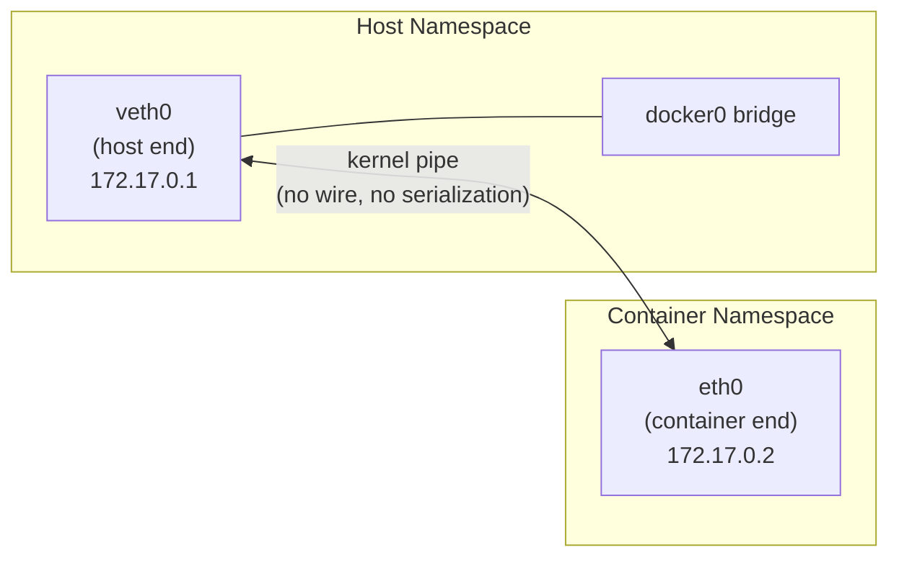
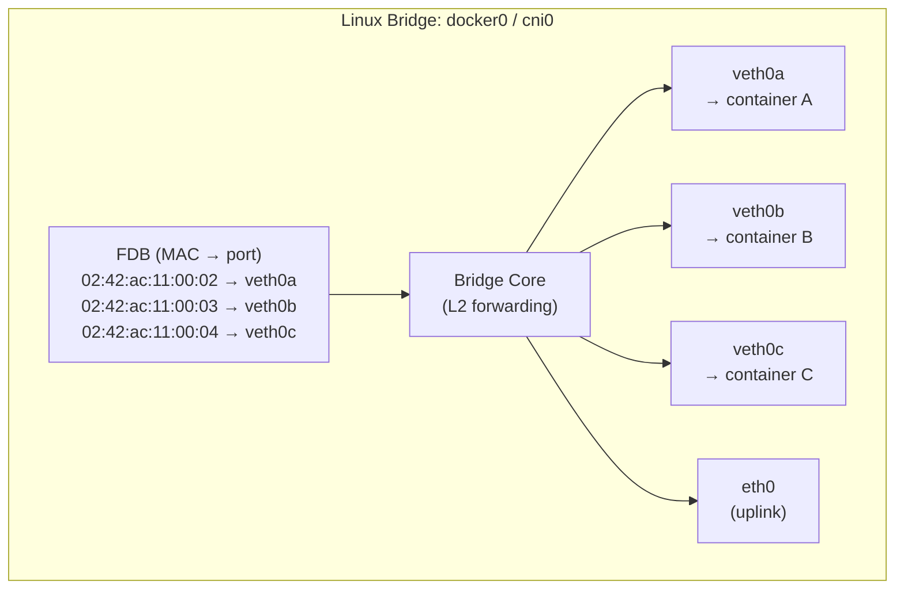
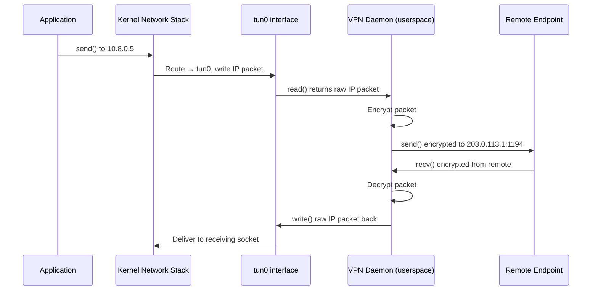
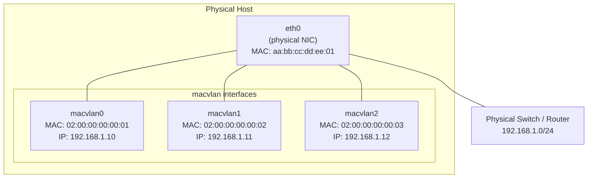
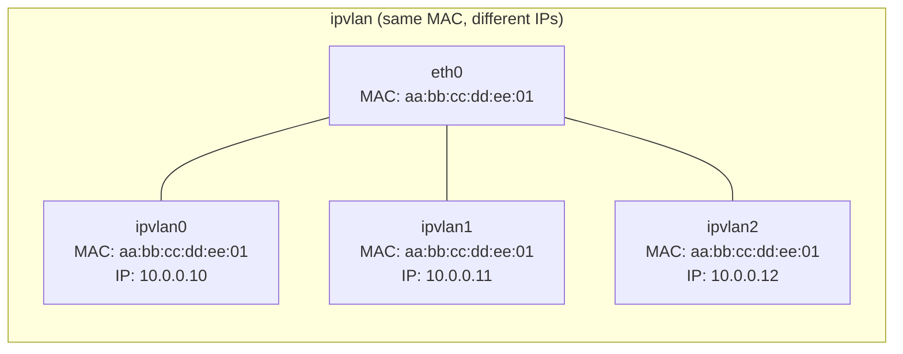
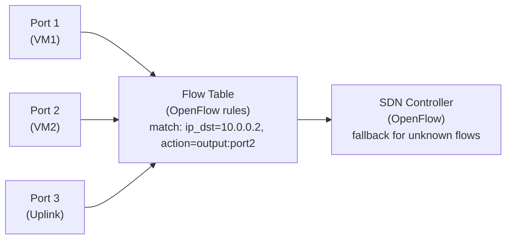
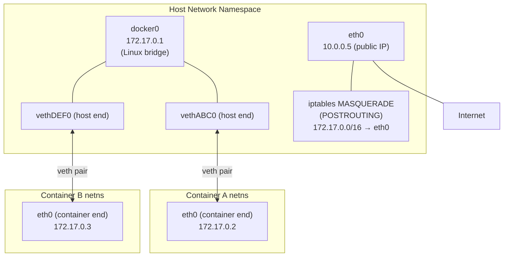
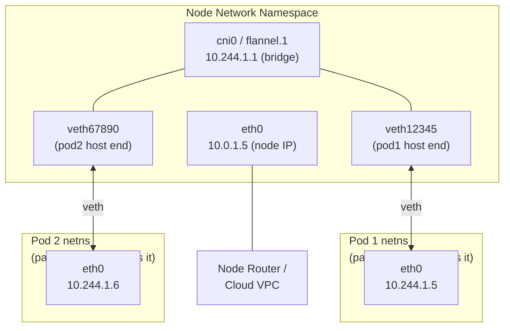
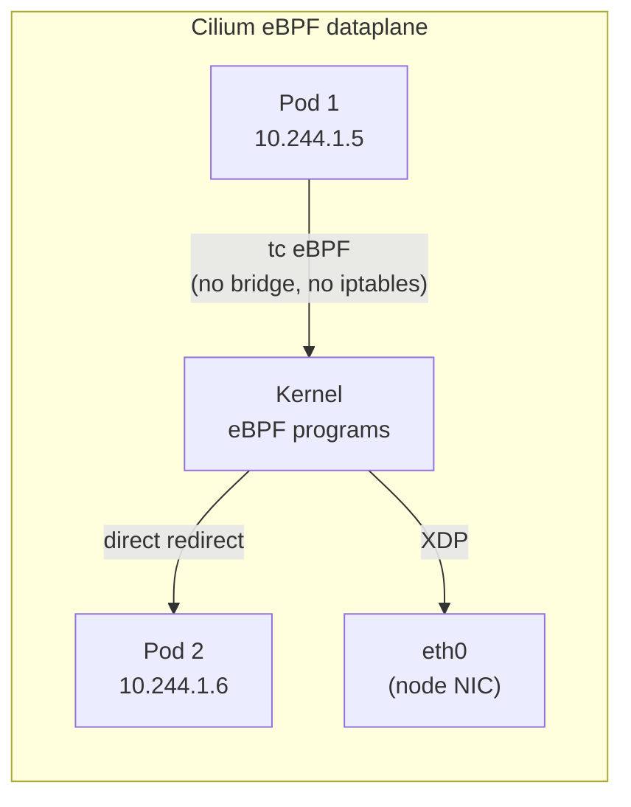

# Virtual Networking: veth, Bridge, tun/tap, macvlan, ipvlan, OVS

## Table of Contents

- [Overview](#overview)
- [veth Pairs](#veth-pairs)
  - [How veth Works](#how-veth-works)
  - [Creating and Inspecting veth Pairs](#creating-and-inspecting-veth-pairs)
  - [veth Performance Characteristics](#veth-performance-characteristics)
- [Linux Bridge](#linux-bridge)
  - [MAC Learning and Forwarding](#mac-learning-and-forwarding)
  - [Bridge Internals](#bridge-internals)
- [tun/tap: L3 and L2 Tunnels](#tuntap-l3-and-l2-tunnels)
  - [tun (L3) vs tap (L2)](#tun-l3-vs-tap-l2)
- [macvlan: 4 Modes](#macvlan-4-modes)
  - [macvlan Modes](#macvlan-modes)
- [ipvlan: Shares the Host MAC](#ipvlan-shares-the-host-mac)
- [OVS (Open vSwitch): Brief Overview](#ovs-open-vswitch-brief-overview)
- [Docker Networking Deep Dive](#docker-networking-deep-dive)
  - [Bridge Network Topology](#bridge-network-topology)
- [Kubernetes Pod Networking](#kubernetes-pod-networking)
  - [veth + Bridge Model (Flannel, Calico iptables)](#veth-bridge-model-flannel-calico-iptables)
  - [eBPF Bypass (Cilium)](#ebpf-bypass-cilium)
- [Real-World Production Scenario](#real-world-production-scenario)
  - [Scenario: Pod Can't Reach External Internet](#scenario-pod-cant-reach-external-internet)
- [Failure Modes](#failure-modes)
- [Security Considerations](#security-considerations)
- [Interview Questions](#interview-questions)
  - [Basic](#basic)
  - [Intermediate](#intermediate)
  - [Advanced / Staff Level](#advanced-staff-level)

---

## Overview

Virtual networking devices are the foundation of every container and VM deployment. When a Kubernetes pod can't reach the internet, the first suspect isn't a cloud firewall rule — it's the chain of virtual devices between the pod's network namespace and the physical NIC. This file covers how each virtual device type works at the kernel level, their production use cases, and how Docker and Kubernetes use them.

---

## veth Pairs

### How veth Works

A veth (virtual Ethernet) pair is a bidirectional kernel pipe with two endpoints. Sending a packet into one end causes it to emerge immediately on the other end. From the kernel's perspective, each end is a full `net_device` with its own MAC address, IP address, and statistics.



**Critical property:** A veth pair is implemented as two `net_device` structs that point to each other via `priv->peer`. `dev_hard_start_xmit()` on veth0 calls `netif_rx()` on veth1, triggering a software interrupt on the receiving side. This means crossing a veth pair always costs one software interrupt and sk_buff processing — typically ~1-3 microseconds.

### Creating and Inspecting veth Pairs

```bash
# Create a veth pair
ip link add veth0 type veth peer name veth1

# Move one end into a network namespace
ip link add ns1 type netns
ip link set veth1 netns ns1

# Verify from both sides
ip link show veth0
ip netns exec ns1 ip link show veth1

# Check that one end going down affects the other
ip link set veth0 down
ip netns exec ns1 ip link show veth1
# State will show NO-CARRIER

# Check peer device (cross-reference)
ethtool -S veth0 | grep peer_ifindex
# peer_ifindex: 7   (verify with: ip link show | grep "^7:")
```

### veth Performance Characteristics

- **Throughput:** 10-20 Gbps for TCP bulk transfers (single core)
- **Latency:** ~1-3 µs per packet (software interrupt + sk_buff processing)
- **Limitation:** veth pairs are not hardware-offload aware. TSO/GSO segments must be handled in software. Set MTU matching to avoid fragmentation.

```bash
# Always set matching MTU on both ends
ip link set veth0 mtu 1500
ip netns exec ns1 ip link set veth1 mtu 1500
```

---

## Linux Bridge

### MAC Learning and Forwarding

The Linux bridge operates at Layer 2, maintaining a Forwarding Database (FDB) that maps MAC addresses to bridge ports. It learns MAC addresses by observing source MACs of incoming frames.



### Bridge Internals

```bash
# View the Forwarding Database
bridge fdb show dev docker0
# 02:42:ac:11:00:02 dev docker0 master docker0
# 02:42:ac:11:00:03 dev docker0 master docker0
# 33:33:00:00:00:01 dev docker0 self permanent

# Show bridge port states (relevant when STP is enabled)
bridge link show
# 5: veth0a@if6: <BROADCAST,MULTICAST,UP,LOWER_UP> mtu 1500 master docker0 state forwarding

# Bridge statistics
ip -s link show docker0
```

**STP trade-off:** Spanning Tree Protocol prevents Layer 2 loops but introduces a 30-second convergence delay (15s listening + 15s learning) on port state changes. In container environments, STP is disabled by default because the topology is tree-shaped by construction (no loops). Enabling STP causes pod startup failures — the container is created with a new veth port, which sits in STP `listening` state for 15 seconds before forwarding traffic.

```bash
# Check if STP is enabled (bridge_id present = STP is running)
cat /sys/class/net/docker0/bridge/stp_state
# 0 = disabled (default for Docker/K8s bridges)

# Enable STP only if you have bridge-to-bridge connections
ip link set docker0 type bridge stp_state 1
```

---

## tun/tap: L3 and L2 Tunnels

### tun (L3) vs tap (L2)

| Device | OSI Layer | Frame type | Primary use |
|--------|-----------|------------|-------------|
| `tun` | L3 | IP packets | VPNs (OpenVPN, WireGuard userspace) |
| `tap` | L2 | Ethernet frames | VMs (QEMU/KVM), L2 VPNs |



**tun device:** The VPN daemon reads and writes raw IP packets via the `/dev/net/tun` file descriptor. The kernel routes outbound packets to `tun0` like any other interface; the VPN daemon reads them, encrypts, and sends over UDP/TCP. Inbound: the daemon receives encrypted data, decrypts, and writes the inner IP packet to the tun fd, causing the kernel to process it as if it arrived on tun0.

**tap device:** Works the same but at L2. The daemon reads/writes Ethernet frames, so it can participate in ARP, send broadcasts, etc. QEMU attaches a tap device to give a VM a virtual NIC connected to the host's network.

```bash
# Create a tun device (requires CAP_NET_ADMIN)
ip tuntap add dev tun0 mode tun user $(whoami)
ip addr add 10.8.0.1/24 dev tun0
ip link set tun0 up

# Create a tap device for QEMU
ip tuntap add dev tap0 mode tap
ip link set tap0 master br0  # attach to bridge for VM connectivity
ip link set tap0 up
```

---

## macvlan: 4 Modes

macvlan creates virtual interfaces that share the host's physical NIC but each have their own MAC address. Unlike veth+bridge, macvlan frames go directly to the NIC without bridge overhead — higher performance.



### macvlan Modes

| Mode | Container-to-Container | Container-to-Host | Container-to-External |
|------|----------------------|-------------------|----------------------|
| **bridge** | Yes (via NIC) | No (kernel limitation) | Yes |
| **private** | No | No | Yes |
| **vepa** | Via external switch | No | Yes |
| **passthru** | Single macvlan only | No | Yes |

```bash
# Create macvlan in bridge mode (most common)
ip link add macvlan0 link eth0 type macvlan mode bridge
ip addr add 192.168.1.100/24 dev macvlan0
ip link set macvlan0 up

# Bridge mode: containers can talk to each other by going through the NIC
# but CANNOT talk to the host eth0 directly (different MAC domain)

# VEPA mode: all traffic goes out to the switch, even intra-host
ip link add macvlan0 link eth0 type macvlan mode vepa
# Requires: switch must support hairpin/reflective relay

# Check mode
ip -d link show macvlan0 | grep macvlan
```

**Production use — Kubernetes Multus secondary NICs:** When a pod needs two network interfaces (e.g., primary for Kubernetes cluster traffic, secondary for low-latency trading traffic), Multus CNI creates a macvlan interface as the secondary NIC directly on the node's physical interface. This bypasses the bridge entirely for the secondary interface, reducing latency.

---

## ipvlan: Shares the Host MAC

ipvlan is similar to macvlan but all virtual interfaces **share the parent's MAC address**. Differentiation happens at IP layer (L2 mode) or routing layer (L3 mode).



| Feature | macvlan | ipvlan |
|---------|---------|--------|
| MAC address per interface | Unique | Same as parent |
| Promiscuous mode required | No | No |
| Works with switches that limit MACs per port | No | Yes |
| ARP behavior | Independent per MAC | Shared |

**ipvlan L3 mode:** The kernel acts as a router between ipvlan interfaces. Traffic between containers goes through the kernel's routing table, not L2 forwarding. This enables routing policies per-container.

```bash
# Create ipvlan L3 mode
ip link add ipvlan0 link eth0 type ipvlan mode l3
ip addr add 10.0.1.0/24 dev ipvlan0
ip link set ipvlan0 up
```

---

## OVS (Open vSwitch): Brief Overview

OVS is a production-grade virtual switch used heavily in OpenStack and SDN deployments. Unlike the Linux bridge (simple FDB-based forwarding), OVS implements a full match-action flow table pipeline.



```bash
# View OVS bridges and ports
ovs-vsctl show

# View the flow table
ovs-ofctl dump-flows br0

# Add a flow (match all traffic from port 1, output to port 2)
ovs-ofctl add-flow br0 "in_port=1,actions=output:2"

# Monitor OVS statistics
ovs-vsctl list interface vhostuser0 | grep statistics
```

**When to use OVS:** OpenStack Neutron (the canonical use case), complex SDN deployments requiring per-flow actions, environments needing OpenFlow controller integration. For Kubernetes, OVS is used by OVN-Kubernetes CNI.

---

## Docker Networking Deep Dive

### Bridge Network Topology



**Docker networking bootstrap sequence:**
1. `dockerd` creates `docker0` bridge on startup
2. Per container: creates veth pair, attaches host-end to docker0, moves container-end to container's new network namespace
3. Container namespace gets: IP assignment, default route (via 172.17.0.1), DNS config (from `/etc/resolv.conf` templated by dockerd)
4. Host gets: iptables MASQUERADE rule for container subnet, DNAT rule for published ports

```bash
# Trace Docker's iptables rules
iptables -t nat -L DOCKER -n -v
# Shows DNAT rules for port-published containers

iptables -t nat -L POSTROUTING -n -v
# Shows MASQUERADE rule for docker0 subnet

# View Docker bridge setup
ip link show docker0
bridge fdb show dev docker0

# Find veth peer for a container
container_pid=$(docker inspect --format '{{.State.Pid}}' <container>)
nsenter -t $container_pid -n ip link show eth0
# Note the "ifindex" number (e.g., 7)
# Then on host: ip link | grep "^7:"
```

---

## Kubernetes Pod Networking

### veth + Bridge Model (Flannel, Calico iptables)



**Pause container:** In Kubernetes, the `pause` (also called "sandbox" or "infra") container is the first container created in a pod. Its sole purpose is to hold the network namespace alive. All other containers in the pod are created with `--network=container:<pause_id>`, sharing the pause container's network namespace. This means all containers in a pod share the same IP address, the same port space, and can communicate via localhost.

### eBPF Bypass (Cilium)



Cilium attaches eBPF programs at the `tc` (Traffic Control) hook on each pod's veth interface. Instead of routing through a bridge, the eBPF program uses `bpf_redirect_peer()` to move the packet directly to the destination veth's peer, bypassing the bridge entirely. This removes one full bridge lookup and packet traversal from every inter-pod packet.

---

## Real-World Production Scenario

### Scenario: Pod Can't Reach External Internet

**Symptom:** Pod can ping other pods in the cluster but cannot reach 8.8.8.8.

**Diagnosis:**

```bash
# Step 1: Enter pod's namespace
POD_PID=$(kubectl get pod mypod -o jsonpath='{.status.podIP}' | xargs -I{} grep -r {} /proc/*/net/fib_trie 2>/dev/null | head -1 | cut -d/ -f3)
# Easier way:
kubectl exec -it mypod -- /bin/sh
# From inside pod:

# Step 2: Check route table in pod
ip route show
# default via 10.244.1.1 dev eth0    ← default route exists (good)
# 10.244.0.0/16 via 10.244.1.1 dev eth0

# Step 3: Check connectivity to gateway
ping 10.244.1.1   # gateway (cni0 bridge)
# WORKS

# Step 4: Check IP forwarding on node
kubectl exec -it mypod -- cat /proc/sys/net/ipv4/ip_forward
# OR on node:
sysctl net.ipv4.ip_forward
# 0   ← IP FORWARDING DISABLED — this is the bug!

# Fix on node:
sysctl -w net.ipv4.ip_forward=1
echo "net.ipv4.ip_forward = 1" >> /etc/sysctl.d/99-k8s.conf

# Step 5: Verify MASQUERADE rule exists (for node-to-external NAT)
iptables -t nat -L POSTROUTING -n -v | grep -E '(MASQ|10\.244)'
# If missing — CNI plugin didn't install its rules
# For Flannel:
kubectl -n kube-system delete pod -l app=flannel  # restart CNI daemon

# Step 6: Check the veth pair is properly connected to bridge
ip link show | grep -A1 veth
bridge fdb show dev cni0  # should show pod MAC addresses

# Step 7: Verify MTU alignment
# Pod eth0 MTU must be <= node eth0 MTU (minus tunnel overhead for VXLAN: -50)
ip link show eth0  # node NIC MTU
kubectl exec -it mypod -- ip link show eth0  # pod MTU
# Mismatch causes silent drops for large packets (PMTUD black hole)
```

**Root causes encountered in production:**
1. `ip_forward=0` — common after kernel upgrades that reset sysctls
2. Missing MASQUERADE rule — CNI daemonset pod crashed and didn't reinstall rules
3. MTU mismatch — veth MTU set to 1500 but node eth0 uses 9001 (jumbo frames), causing issues with VXLAN overlay
4. iptables FORWARD chain DROP policy with no ACCEPT rule for pod CIDR

---

## Failure Modes

| Failure | Symptoms | Detection | Fix |
|---------|----------|-----------|-----|
| veth host-end deleted | Container loses all connectivity | `ip link show veth* \| grep NO-CARRIER` | Recreate veth pair; restart container |
| Bridge missing default forward | Inter-container traffic blocked | `iptables -L FORWARD -n \| grep REJECT` | Add `-j ACCEPT` rule for bridge subnet |
| ip_forward disabled | Pods can't reach external hosts | `sysctl net.ipv4.ip_forward` = 0 | `sysctl -w net.ipv4.ip_forward=1` |
| MASQUERADE rule missing | Pod IP leaks to external; no reply | `iptables -t nat -L POSTROUTING` | Reinstall CNI; add MASQUERADE rule |
| MTU mismatch | Packets >1400 bytes silently dropped (VXLAN paths) | `tcpdump -i eth0 'icmp and icmp[0] == 3'` (ICMP unreachable type 3 = frag needed) | Set pod MTU to node MTU minus tunnel overhead |
| STP blocking new veth ports | New pods take 30s to get network | `bridge link show \| grep blocking` | Disable STP on CNI bridge |
| macvlan can't reach host | macvlan containers isolated from host | By design; use veth to bridge instead | Add a separate veth pair for host-to-container communication |

---

## Security Considerations

| Vector | Description | Mitigation |
|--------|-------------|------------|
| Container escape via bridge | A compromised container can ARP-spoof other containers on the same bridge | Enable `net.bridge.bridge-nf-call-iptables=1` + ebtables anti-spoofing; use Calico network policies |
| macvlan promiscuous mode | In VEPA mode, all traffic sent to switch — potential for eavesdropping if switch doesn't isolate | Use macvlan bridge mode; enable port security on physical switch |
| tun/tap privilege escalation | Creating tun/tap requires CAP_NET_ADMIN — a compromised container with this capability can create arbitrary network interfaces | Never grant CAP_NET_ADMIN to untrusted containers; use seccomp profiles |
| VLAN hopping via bridge | VLAN-unaware bridge can forward tagged frames, potentially crossing VLAN boundaries | Enable bridge VLAN filtering (`ip link add br0 type bridge vlan_filtering 1`) |
| veth traffic snooping | Host root can attach tcpdump to any veth, reading all container traffic in plaintext | Encrypt intra-cluster traffic (mTLS via Istio/Cilium) |

---

## Interview Questions

### Basic

**Q: What is a veth pair and how is it used in container networking?**
A: A veth pair is a bidirectional kernel pipe implemented as two `net_device` endpoints. Packets sent to one end appear on the other instantly (via software interrupt). In container networking, one end is placed inside the container's network namespace (appears as `eth0`) and the other is left in the host namespace (where it's connected to a bridge). The container sees a regular network interface; the host sees a bridge port.

**Q: Why can't a macvlan container communicate with the host?**
A: macvlan interfaces share the physical NIC but have different MAC addresses. The Linux kernel does not permit traffic between a macvlan interface and its parent interface (the host's eth0) because they would appear as different MACs on the same device, causing confused routing. To communicate between a macvlan container and the host, you need a separate communication channel — typically a veth pair or a loopback route.

**Q: What is the pause container in Kubernetes and why does it exist?**
A: The pause container (also called infra/sandbox container) is the first container created in a pod. It does nothing except sleep — its only purpose is to own the network namespace. All other containers in the pod join the pause container's namespace via `--network=container:<pause_id>`. If a regular container in the pod restarts, the network namespace (IP address, routes) is preserved because the pause container keeps it alive.

### Intermediate

**Q: Docker's default bridge networking uses iptables MASQUERADE. What exactly does this rule do, and what happens if it's missing?**
A: The MASQUERADE rule in the POSTROUTING chain rewrites the source IP of packets leaving the host from any container IP (e.g., 172.17.0.2) to the host's outgoing interface IP (e.g., eth0's IP). This is SNAT where the source IP is automatically set to the outgoing interface's IP. Without it, packets from containers reach external hosts with the private 172.17.x.x source IP — which is not routable on the internet, so replies never return. Symptoms: containers can't reach external IPs but can reach other containers and the default gateway.

**Q: A pod's `eth0` has MTU 1500 but the node runs VXLAN overlay (adds 50 bytes of overhead). What happens to large packets and how do you detect it?**
A: Large packets (>1450 bytes of payload) will exceed the physical MTU after VXLAN encapsulation. If PMTUD (Path MTU Discovery) is working, the host sends an ICMP "Fragmentation Needed" back to the pod, which should lower its effective MTU. If PMTUD is blocked (common in many cloud environments), packets are silently dropped. Detection: `tcpdump -i eth0 'icmp and icmp[0]==3 and icmp[1]==4'` for "Fragmentation Needed" messages. Also test with: `ping -M do -s 1400 8.8.8.8` from the pod — if it fails but `ping -s 100 8.8.8.8` works, MTU is the issue. Fix: set pod MTU to 1450 in the CNI config.

**Q: How does Cilium's eBPF model differ from the standard veth+bridge model in terms of per-packet overhead?**
A: Standard veth+bridge: a packet from Pod A to Pod B traverses pod A's veth → bridge FDB lookup → host-end veth → bridge kernel code → pod B's veth → pod B's namespace. This involves 2 veth crossings (2 software interrupts) + bridge MAC table lookup + potential iptables traversal (for NetworkPolicy). Cilium eBPF: attaches a tc eBPF program to pod A's veth. The program uses `bpf_redirect_peer()` to redirect directly to pod B's veth without going through a bridge — 0 bridge operations, 0 iptables traversal. For NetworkPolicy, the eBPF program does map lookups instead of iptables linear scan. Result: ~40% reduction in CPU per packet for inter-pod traffic at scale.

### Advanced / Staff Level

**Q: You need to give a VM running in QEMU direct L2 network access to the same broadcast domain as the host. What device type do you use, and how does packet flow work?**
A: Use a `tap` device attached to a Linux bridge. Setup: create `tap0` with `ip tuntap add dev tap0 mode tap`, attach it to bridge `br0` with `ip link set tap0 master br0`, also attach the host's `eth0` to `br0`. QEMU is started with `-netdev tap,id=n1,ifname=tap0,script=no -device virtio-net-pci,netdev=n1`. Flow: VM guest sends Ethernet frame → QEMU reads it from `/dev/net/tun` (tap0 fd) → writes it to tap0 → bridge forwards based on FDB → eth0 → physical network. The VM appears as a full L2 peer on the physical network, gets its own MAC, can receive broadcasts, and can be assigned an IP from the same subnet as physical machines. Security note: the VM has full L2 access — ARP spoofing, DHCP impersonation, etc. are possible without additional controls.

**Q: How would you design the network for a Kubernetes node to support both standard pod traffic and high-performance secondary NICs for a trading application, and what device types would you use?**
A: Use a Multus CNI configuration with two separate networks: (1) Primary network: standard veth+bridge (Calico or Flannel) for K8s cluster traffic, DNS, API server, etc. (2) Secondary network: macvlan or ipvlan in L3 mode directly on a dedicated NIC (e.g., `ens4f0`). The trading pod gets two interfaces: `eth0` (primary, managed by main CNI) and `net1` (secondary, macvlan on `ens4f0`). macvlan avoids bridge overhead — trading traffic goes directly to the NIC without any bridge processing. MTU must be carefully managed: if trading uses jumbo frames (9000 MTU) on the secondary NIC, the macvlan interface must also be set to 9000. Additionally, consider NUMA affinity: pin the macvlan secondary NIC to the same NUMA node as the trading application's CPU cores to avoid NUMA crossings.
