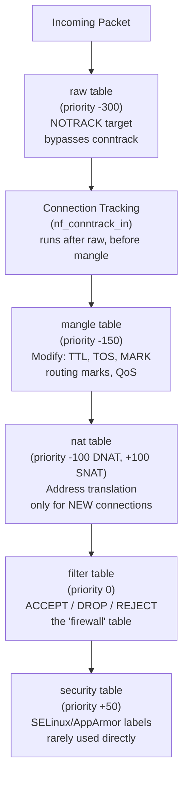
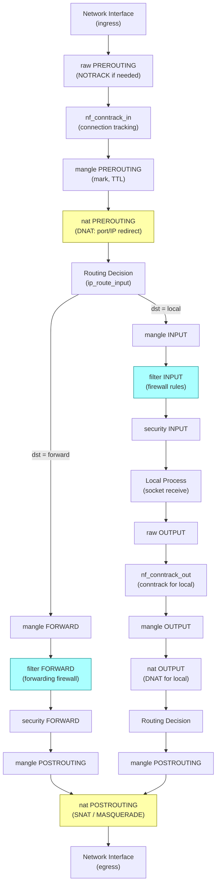
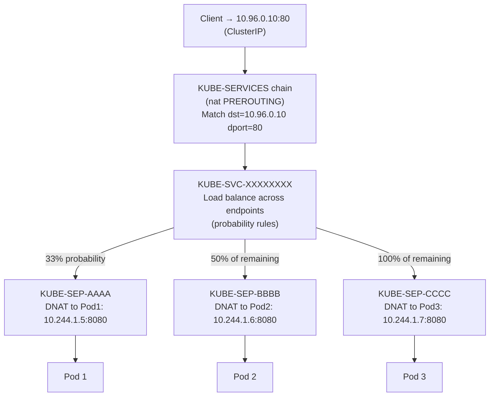
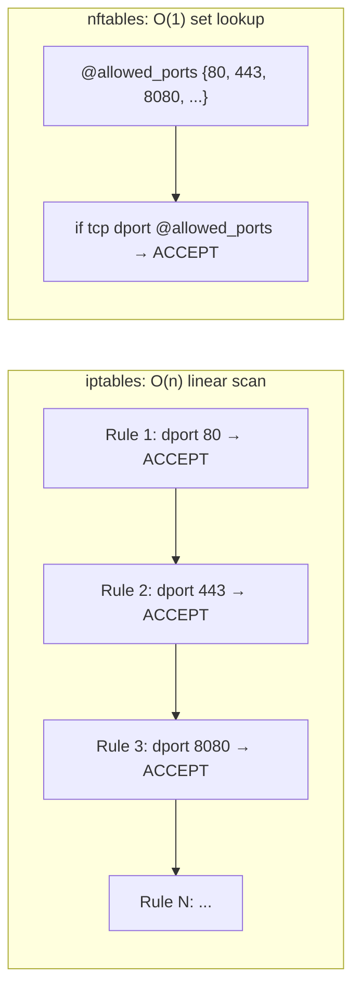

# iptables and nftables: Packet Filtering Deep Dive

## Overview

iptables underpins almost every Linux firewall, NAT implementation, and Kubernetes service proxy in existence. nftables is the successor — faster, atomic, and increasingly the default. A Senior SRE who can't walk through the iptables traversal order, explain why kube-proxy's rule chains scale poorly, and debug silent drops with TRACE is missing critical operational knowledge. This file covers both tools at production depth.

---

## iptables Architecture

### Five Tables, Five Purposes



| Table | Priority | Chains | Purpose |
|-------|----------|--------|---------|
| `raw` | -300 | PREROUTING, OUTPUT | NOTRACK target to bypass conntrack |
| `mangle` | -150 | All 5 chains | Modify packet fields (TTL, DSCP, MARK, CONNMARK) |
| `nat` | -100 (DNAT), +100 (SNAT) | PREROUTING, OUTPUT, POSTROUTING | Address translation |
| `filter` | 0 | INPUT, FORWARD, OUTPUT | Allow/deny decisions |
| `security` | +50 | INPUT, FORWARD, OUTPUT | MAC policy labels (SELinux) |

### Complete Packet Traversal Path



### First-Match-Wins and Performance Implications

iptables chains are linear lists. Every packet traverses rules one-by-one until a match is found. This is O(n) per chain traversal.

```bash
# View rules with packet/byte counters
iptables -L INPUT -n -v --line-numbers
# Chain INPUT (policy DROP 0 packets, 0 bytes)
# num  pkts bytes target     prot opt in     out     source       destination
# 1    1.2M  890M ACCEPT     all  --  *      *       0.0.0.0/0    0.0.0.0/0    state RELATED,ESTABLISHED
# 2       0     0 ACCEPT     tcp  --  *      *       0.0.0.0/0    0.0.0.0/0    tcp dpt:22
# 3       0     0 DROP       all  --  *      *       0.0.0.0/0    0.0.0.0/0

# Performance: Rule 1 matches most traffic (established connections) → fast
# If the most common match is rule 100 instead of rule 1 → 100 evaluations per packet
```

**Performance implication:** In kube-proxy iptables mode, a cluster with 5,000 services generates 20,000+ rules. Every new connection traverses chains linearly until matching. At 10,000 services this creates measurable latency: ~1-2ms per new connection setup, and rule reload time exceeds 10 seconds.

---

## kube-proxy iptables Mode

### How kube-proxy Creates Service Routing



```bash
# Inspect kube-proxy chains
iptables -t nat -L KUBE-SERVICES -n | head -20
# Lists one rule per service (for each Service ClusterIP:port)

iptables -t nat -L KUBE-SVC-XXXXXXXXXXXXXXXX -n
# Chain KUBE-SVC-XXXXXXXXXXXXXXXX
# KUBE-MARK-MASQ  all  ...  /* ns/svc: cluster IP */  statistic mode random probability 0.33333...
# KUBE-SEP-AAAA   all  ...
# KUBE-MARK-MASQ  all  ...  statistic mode random probability 0.50000...
# KUBE-SEP-BBBB   all  ...
# KUBE-SEP-CCCC   all  ...

# Count total kube-proxy rules
iptables-save | wc -l
# 50k+ lines in large clusters
```

### Why kube-proxy iptables Scales Poorly

| Cluster Size | Rules | Connection Setup Overhead | Rule Reload Time |
|-------------|-------|--------------------------|-----------------|
| 100 services | ~400 | Negligible | <1s |
| 1,000 services | ~4,000 | ~0.1ms | ~3s |
| 5,000 services | ~20,000 | ~0.5ms | ~11s |
| 10,000 services | ~40,000 | ~1-2ms | ~25s |

**Scalability failure mode:** Rule updates are not atomic. kube-proxy does `iptables-restore` which briefly clears and reloads rules — during this window, new connections may not be load-balanced correctly. Additionally, every endpoint change (pod scale up/down) triggers a full rule reload.

---

## nftables: Modern Alternative

### Key Advantages over iptables



### nftables Core Concepts

```bash
# nftables structure: tables → chains → rules
# Tables are NOT the same as iptables tables (filter/nat/etc.)
# nftables tables are arbitrary namespaces

# List everything
nft list ruleset

# Create a basic firewall
nft add table inet myfilter
nft add chain inet myfilter input { type filter hook input priority 0 \; policy drop \; }
nft add rule inet myfilter input ct state established,related accept
nft add rule inet myfilter input tcp dport 22 accept
nft add rule inet myfilter input drop

# Use sets for O(1) lookup (vs iptables multiport which is still linear)
nft add set inet myfilter allowed_ports { type inet_service \; flags interval \; }
nft add element inet myfilter allowed_ports { 80, 443, 8080, 9090 }
nft add rule inet myfilter input tcp dport @allowed_ports accept

# Atomic ruleset update (NO race window)
nft -f /etc/nftables/ruleset.nft
# The entire file is applied atomically — either all rules load or none do
```

### nftables vs iptables Comparison

| Aspect | iptables | nftables |
|--------|----------|----------|
| Rule evaluation | Linear O(n) per chain | Sets/maps: O(1) for membership tests |
| Atomic updates | No (iptables-restore has window) | Yes (`nft -f` is atomic) |
| IPv4 + IPv6 | Separate iptables + ip6tables | Unified `nft` with `inet` family |
| DNAT maps | Not supported | `dnat to ip daddr map @svc_map` |
| Counter/quota objects | Per-rule only | Standalone named objects |
| Kubernetes kube-proxy | iptables mode (legacy) | nftables mode (K8s 1.30+, KEP-3866) |
| Debugging | `-L` only shows rules, LOG target | `nft monitor trace` shows per-packet |

---

## iptables-to-nftables Migration

### The iptables-nft Compatibility Shim

```bash
# Check which iptables backend is active
iptables -V
# iptables v1.8.7 (nf_tables)   ← using nftables backend
# iptables v1.8.7 (legacy)       ← using old x_tables backend

# Translate iptables rule to nftables syntax
iptables-translate -A INPUT -p tcp --dport 80 -j ACCEPT
# nft add rule ip filter INPUT tcp dport 80 counter accept

# Translate entire iptables-save output
iptables-save | iptables-restore-translate -f - | nft -f -

# CAUTION: Rules from iptables-legacy and iptables-nft shim coexist
# and may interact unexpectedly. Audit with:
nft list ruleset    # shows nftables rules
iptables -L         # shows rules through the shim (may be duplicated!)
```

### Migration Strategy

1. Audit all tools that write iptables rules: Docker, CNI plugins, fail2ban, ufw, custom scripts
2. Verify each tool has an nftables-compatible mode or replacement
3. Test on non-production nodes: switch `iptables` symlink to `iptables-nft`
4. Monitor for rule conflicts using `nft monitor trace`
5. Gradually migrate custom rules to native nftables syntax for clarity

---

## Debugging: iptables and nftables

### iptables: LOG and TRACE Targets

```bash
# LOG target: logs matching packets to kernel ring buffer / syslog
# Insert BEFORE the DROP rule to see what's being dropped
iptables -I INPUT 1 -j LOG --log-prefix "IPT-DEBUG: " --log-level 4 --log-uid

# Read the log
journalctl -k | grep "IPT-DEBUG"
# kernel: IPT-DEBUG: IN=eth0 OUT= MAC=... SRC=10.0.0.5 DST=192.168.1.1 PROTO=TCP SPT=45678 DPT=80

# TRACE target: traces a packet through ALL tables/chains
# Must be added to the raw table (earliest hook)
iptables -t raw -I PREROUTING -s 10.0.0.5 -p tcp --dport 80 -j TRACE
iptables -t raw -I OUTPUT -d 10.0.0.5 -p tcp --sport 80 -j TRACE

# Enable trace logging
modprobe nf_log_ipv4
sysctl net.netfilter.nf_log.2=nf_log_ipv4  # IPv4 logging

# Read trace output
dmesg | grep TRACE | head -20
# TRACE: raw:PREROUTING:rule:1 IN=eth0 SRC=10.0.0.5 DST=... PROTO=TCP DPT=80
# TRACE: raw:PREROUTING:return:2 ...
# TRACE: filter:FORWARD:rule:5 ...  ← shows which rule matched

# Clean up trace rules after debugging
iptables -t raw -D PREROUTING -s 10.0.0.5 -p tcp --dport 80 -j TRACE
iptables -t raw -D OUTPUT -d 10.0.0.5 -p tcp --sport 80 -j TRACE
```

### nftables: nft monitor trace

```bash
# Add trace rule (much cleaner than iptables TRACE)
nft add table inet debug
nft add chain inet debug trace_chain { type filter hook prerouting priority -300 \; }
nft add rule inet debug trace_chain ip saddr 10.0.0.5 tcp dport 80 meta nftrace set 1

# Monitor trace output in real time
nft monitor trace
# trace id 0x1234 ip filter input packet: iif "eth0" ip saddr 10.0.0.5
# trace id 0x1234 ip filter input rule ip saddr 10.0.0.5 tcp dport 80 drop (verdict drop)
# ^ Shows exact rule that matched and the verdict

# Clean up
nft delete table inet debug
```

---

## Real-World Production Scenario

### Scenario: Service Traffic Mysteriously Dropped — iptables Rule Conflict

**Alert:** Application team reports that requests to service `payments-svc` (ClusterIP `10.96.100.50:443`) intermittently fail with connection refused after a security team pushed new firewall rules.

**Investigation:**

```bash
# Step 1: Check if the ClusterIP is reachable at all
curl -v https://10.96.100.50:443 --connect-timeout 5
# Connection timed out — not "connection refused" which would mean the port is closed

# Step 2: Check conntrack — is the connection being tracked?
conntrack -L | grep "10.96.100.50"
# tcp ESTABLISHED src=10.244.1.5 dst=10.96.100.50 sport=45678 dport=443 ...
# Traffic reaches conntrack but something drops it after PREROUTING

# Step 3: Enable TRACE on the problematic traffic
iptables -t raw -I PREROUTING -p tcp -d 10.96.100.50 --dport 443 -j TRACE
dmesg | grep TRACE | grep "10.96.100.50" | head -30

# Step 4: Read trace output
# TRACE: raw:PREROUTING:rule:1   [matched TRACE rule]
# TRACE: nat:PREROUTING:rule:45  [kube-proxy DNAT matched, translating to 10.244.2.8:8443]
# TRACE: filter:FORWARD:rule:3   [DROPPED here]

# Step 5: Inspect the FORWARD chain rule 3
iptables -L FORWARD -n -v --line-numbers | grep "^3 "
# 3     1500  98000 DROP  all  --  *  *  0.0.0.0/0  10.244.0.0/16  /* security-team: block pod CIDR */

# FOUND: Security team added a DROP rule for the pod CIDR BEFORE the kube-proxy ACCEPT rules
# The DNAT in PREROUTING changed the destination from 10.96.100.50 to 10.244.2.8 (pod IP)
# The FORWARD chain DROP rule matches the pod IP destination
# This came BEFORE the KUBE-FORWARD ACCEPT rule

# Step 6: Check rule ordering
iptables -L FORWARD -n -v --line-numbers | head -20
# 1    ...  KUBE-FORWARD  all  --  *  *  ...  /* kubernetes forward rules */
# 2    ...  KUBE-PROXY    all  --  *  *  ...
# 3    ...  DROP          all  --  *  *  10.244.0.0/16  ← WRONG: should be after KUBE-FORWARD

# Step 7: Fix — move the security DROP rule AFTER KUBE-FORWARD
iptables -D FORWARD 3  # delete the misplaced rule
iptables -A FORWARD -d 10.244.0.0/16 -j DROP  # add at end (after kube-proxy ACCEPT rules)

# Or better: use REJECT with a reason for debugging
iptables -A FORWARD -d 10.244.0.0/16 -j REJECT --reject-with icmp-admin-prohibited

# Step 8: Remove TRACE rules
iptables -t raw -D PREROUTING -p tcp -d 10.96.100.50 --dport 443 -j TRACE
```

**Root cause:** Rule order matters — first match wins. The security team's DROP rule for the pod CIDR was inserted at position 3, before kube-proxy's ACCEPT rules. After DNAT translated the ClusterIP to a pod IP (in PREROUTING), the FORWARD chain saw the pod IP as destination and dropped it before the kube-proxy ACCEPT rules could match.

---

## Failure Modes

| Failure | Symptoms | Detection | Fix |
|---------|----------|-----------|-----|
| DROP rule before ACCEPT (wrong order) | Silent drops, connection timeout | `iptables -t raw -I PREROUTING -j TRACE` | Reorder rules (iptables -I vs -A) |
| Missing FORWARD rule after DNAT | ClusterIP accessible, pod IP blocked | TRACE shows FORWARD DROP after nat chain | Add ACCEPT in FORWARD for pod CIDR |
| conntrack table full | All new connections dropped | `dmesg \| grep conntrack: table full` | Increase `nf_conntrack_max` |
| MASQUERADE missing | Pods can't reach internet, external IPs unreachable from pods | `iptables -t nat -L POSTROUTING` missing MASQUERADE | Reinstall CNI; add MASQUERADE rule |
| iptables-nft + iptables-legacy coexistence | Rules appear in one tool but not other; double-counting | `iptables -V` to check backend | Choose one backend, migrate all rules |
| nftables atomic update failure | `nft -f` returns error, rules partially applied | Check `nft list ruleset` and compare with file | Fix syntax error, retry atomic load |

---

## Security Considerations

| Vector | Description | Mitigation |
|--------|-------------|------------|
| kube-proxy rule gap during reload | During `iptables-restore`, there's a brief window with no rules | Migrate to nftables kube-proxy (K8s 1.30+) for atomic updates |
| Overly permissive FORWARD | Default FORWARD ACCEPT allows containers to route arbitrary traffic through the host | Set FORWARD default to DROP; whitelist only necessary pod CIDRs |
| iptables TRACE in production | Leaving TRACE rules on generates massive log volume, CPU overhead | Always remove TRACE rules immediately after debugging |
| conntrack bypass via raw NOTRACK | NOTRACK disables both stateful firewalling and NAT for that traffic | Audit all `-t raw -j NOTRACK` rules; ensure they're intentional |
| IPv6 iptables gap | Many deployments configure IPv4 iptables but forget ip6tables, leaving IPv6 wide open | Use nftables `inet` family which handles both; audit ip6tables separately |

---

## Interview Questions

### Basic

**Q: What is the order of iptables table evaluation for an incoming packet destined for the local machine?**
A: raw PREROUTING → mangle PREROUTING → nat PREROUTING → routing decision → mangle INPUT → filter INPUT → security INPUT → local process. Key points: raw runs first (can skip conntrack with NOTRACK), nat PREROUTING handles DNAT before the routing decision (which is why DNAT can redirect to different hosts/ports), and filter INPUT is where firewall allow/deny rules live.

**Q: Explain the difference between the filter and nat tables.**
A: The filter table is for accept/drop/reject decisions — it's the "firewall." It has INPUT, FORWARD, and OUTPUT chains. The nat table is for address translation — DNAT (changing destination IP/port) in PREROUTING, and SNAT/MASQUERADE (changing source IP) in POSTROUTING. Critical: nat rules only apply to the FIRST packet of a connection (new connections). Subsequent packets in an established connection use the conntrack entry to apply the same translation automatically, bypassing the nat table. This is why iptables NAT is efficient — only one rule lookup per connection, not per packet.

### Intermediate

**Q: Why does kube-proxy's iptables mode have scalability problems at 10,000+ services?**
A: Each Kubernetes service creates approximately 4 iptables rules: one in KUBE-SERVICES (match ClusterIP:port), one KUBE-SVC chain (with probability rules per endpoint), and per endpoint a KUBE-SEP chain (DNAT to pod IP). With 10,000 services and 3 endpoints each, that's ~40,000 rules in linear chains. Every new connection traverses KUBE-SERVICES linearly until matching — O(n) per service lookup. Additionally, any endpoint change (pod restart, scale event) triggers a full `iptables-restore` of all rules, which takes 25+ seconds and creates a brief inconsistency window. kube-proxy in nftables mode (K8s 1.30+) uses a map lookup for O(1) service matching.

**Q: What is the difference between `-j DROP` and `-j REJECT` and when would you use each?**
A: DROP silently discards the packet — the sender gets no response and must wait for timeout (~75 seconds for TCP SYN by default). REJECT sends an ICMP error back (default: ICMP port-unreachable for UDP, TCP RST for TCP). Use REJECT for interactive services where you want clients to fail fast rather than hang. Use DROP for: DDoS mitigation (not revealing your presence), hiding service existence from attackers, and rate-limiting scenarios where you don't want to generate ICMP traffic. Security teams sometimes debate this — REJECT is better for operational clarity (connection fails immediately, not after timeout), DROP is better for stealth. In Kubernetes, network policies that block traffic use DROP, causing application retries and slow failures that are hard to debug.

### Advanced / Staff Level

**Q: Walk me through the complete path of a packet sent from a Kubernetes pod to a ClusterIP service, identifying every iptables table and chain it traverses.**
A: Starting in the pod's network namespace: the packet with dst=ClusterIP exits the pod through its veth. In the host network namespace: (1) raw PREROUTING — probably no rules, passes through; (2) conntrack — creates NEW entry for this connection; (3) mangle PREROUTING — passes; (4) **nat PREROUTING KUBE-SERVICES** — matches ClusterIP:port, jumps to KUBE-SVC chain, applies probability rule, jumps to KUBE-SEP chain, applies DNAT to change dst from ClusterIP:port to PodIP:containerPort; (5) routing decision — now with the translated pod IP, routes to the destination pod (may be same node: loopback, or different node: eth0); (6) **filter FORWARD** — KUBE-FORWARD chain accepts established traffic, kube-proxy ACCEPT rules accept traffic in pod CIDR; (7) **nat POSTROUTING** — KUBE-POSTROUTING applies MASQUERADE for packets marked for masquerade, MASQUERADE changes source IP to node IP if needed (for NodePort); (8) packet exits node. On the destination pod: the pod sees a connection from the source pod's IP (or node IP if masqueraded) to its containerPort.

**Q: A security engineer wants to block all traffic from a specific IP using nftables with the minimum possible performance overhead. What approach do you take and why?**
A: Use an nftables set with the `drop` verdict in a map for O(1) lookup, and attach it at the earliest possible hook point (raw PREROUTING at the highest priority, before conntrack): `nft add set inet filter blocklist { type ipv4_addr \; flags dynamic, timeout \; timeout 1h \; }`. Then: `nft add chain inet filter raw_pre { type filter hook prerouting priority -400 \; }` and `nft add rule inet filter raw_pre ip saddr @blocklist drop`. For high-volume DDoS, go even earlier: attach an XDP program that checks the set before sk_buff allocation. Performance: nftables set uses a hash table for O(1) lookup regardless of blocklist size (iptables with individual rules is O(n)). Adding `-300` priority (before conntrack) avoids even creating conntrack entries for blocked traffic. XDP avoids sk_buff allocation entirely — the most efficient possible drop.
