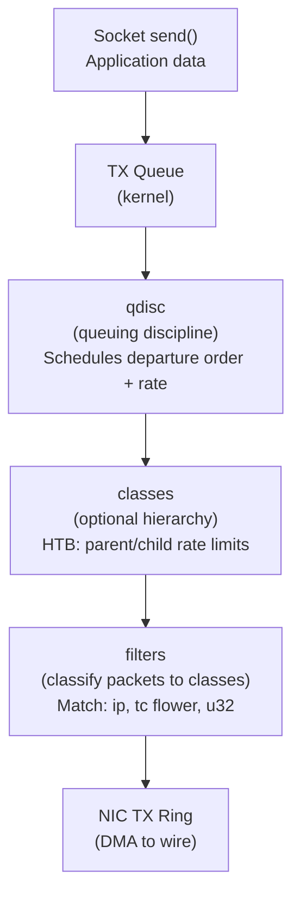
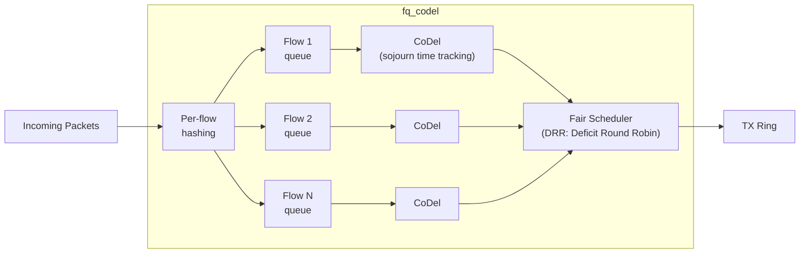
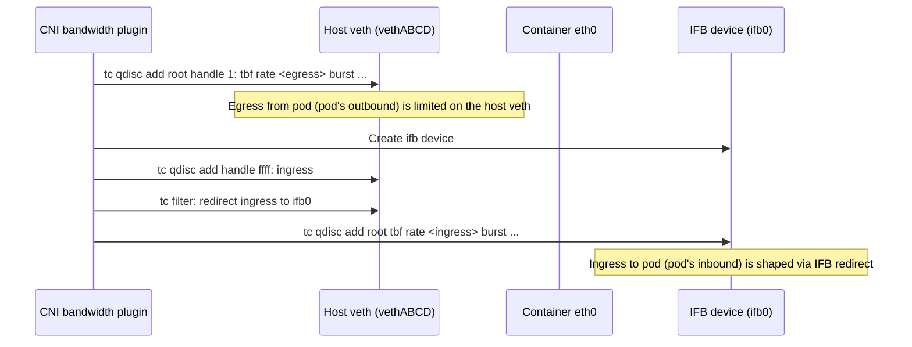

# TC: Traffic Control and Queuing Disciplines

## Table of Contents

- [Overview](#overview)
- [TC Architecture](#tc-architecture)
  - [The Three Components](#the-three-components)
  - [TC Object Hierarchy](#tc-object-hierarchy)
- [Queueing Disciplines](#queueing-disciplines)
  - [pfifo_fast (Legacy Default)](#pfifo_fast-legacy-default)
  - [fq_codel (Fair Queuing + Controlled Delay)](#fq_codel-fair-queuing-controlled-delay)
  - [HTB: Hierarchical Token Bucket](#htb-hierarchical-token-bucket)
  - [TBF: Token Bucket Filter](#tbf-token-bucket-filter)
  - [fq: Fair Queuing with Pacing](#fq-fair-queuing-with-pacing)
- [netem: Network Emulation for Testing](#netem-network-emulation-for-testing)
- [CNI Bandwidth Plugin: TC in Kubernetes](#cni-bandwidth-plugin-tc-in-kubernetes)
  - [How the Bandwidth CNI Plugin Works](#how-the-bandwidth-cni-plugin-works)
- [Real-World Production Scenario](#real-world-production-scenario)
  - [Scenario: Bandwidth Throttling Not Working for Noisy Neighbor Pod](#scenario-bandwidth-throttling-not-working-for-noisy-neighbor-pod)
- [Failure Modes](#failure-modes)
- [Debugging Commands Reference](#debugging-commands-reference)
- [Security Considerations](#security-considerations)
- [Interview Questions](#interview-questions)
  - [Basic](#basic)
  - [Intermediate](#intermediate)
  - [Advanced / Staff Level](#advanced-staff-level)

---

## Overview

Traffic Control (TC) in Linux is the layer between the kernel's packet processing and the NIC transmit ring. It decides: what order packets leave, at what rate, and whether some get dropped to prevent congestion. For SREs, TC matters when: a "noisy neighbor" pod exhausts bandwidth, you're emulating network conditions in staging, or you need to understand why Kubernetes bandwidth-limited pods still saturate node links. This file covers the full TC architecture from qdisc primitives to CNI integration.

---

## TC Architecture

### The Three Components



Every egress packet passes through a qdisc. The qdisc implements a queuing algorithm that determines: which packet to send next, at what rate, and which packets to drop when the queue is full. There is no ingress qdisc by default (packets are processed immediately on receipt), but `tc ingress` and `clsact` qdiscs add hooks for ingress filtering and shaping.

### TC Object Hierarchy

```
Device eth0
└── qdisc (root) — e.g., HTB handle 1:0
    ├── class 1:1 (root class, rate=1gbit)
    │   ├── class 1:10 (app-a, rate=500mbit, ceil=800mbit)
    │   │   └── qdisc (leaf) — e.g., fq_codel
    │   └── class 1:20 (app-b, rate=200mbit, ceil=500mbit)
    │       └── qdisc (leaf) — e.g., fq_codel
    └── class 1:30 (default, rate=100mbit)
        └── qdisc (leaf) — e.g., pfifo
```

---

## Queueing Disciplines

### pfifo_fast (Legacy Default)

Three-priority FIFO. Packets are sorted into bands 0 (highest) through 2 (lowest) based on IP TOS/DSCP bits. Within a band, pure FIFO. No rate shaping, no fairness, no bufferbloat mitigation.

```bash
# View current qdisc
tc qdisc show dev eth0
# qdisc pfifo_fast 0: root refcnt 2 bands 3 priomap 1 2 2 2 1 2 0 0 1 1 1 1 1 1 1 1

# pfifo_fast should NOT be used in production — it has no bufferbloat mitigation
# Default changed to fq_codel in most modern distributions
```

### fq_codel (Fair Queuing + Controlled Delay)

The modern default qdisc (since kernel 3.5). Combines per-flow fair queuing with the CoDel (Controlled Delay) algorithm to actively manage queue depth and eliminate bufferbloat.



**CoDel algorithm:** Tracks the "sojourn time" — how long a packet has been waiting in the queue. If sojourn time exceeds `target` (default 5ms) for a duration longer than `interval` (default 100ms), CoDel starts dropping packets at an increasing rate. This proactively controls queue depth without relying on queue length.

```bash
# Deploy fq_codel
tc qdisc replace dev eth0 root fq_codel

# Tune fq_codel parameters
tc qdisc replace dev eth0 root fq_codel \
    target 5ms \       # acceptable sojourn delay
    interval 100ms \   # sliding window for CoDel measurement
    quantum 1514 \     # bytes per round per flow (MTU + Ethernet header)
    limit 10240        # max packets in queue (hard limit)

# View statistics
tc -s qdisc show dev eth0
# qdisc fq_codel 8003: root refcnt 2 limit 10240p flows 1024 quantum 1514 target 5ms interval 100ms
#  Sent 1234567 bytes 89012 pkt (dropped 5, overlimits 0 requeues 0)
#  backlog 0b 0p requeues 0
#    maxpacket 1514 drop_overlimit 0 new_flow_count 234 ecn_mark 0
#    new_flows_len 0 old_flows_len 0
```

**Why fq_codel eliminates bufferbloat:** Traditional qdiscs (pfifo) fill up before dropping, causing seconds of queuing delay (bufferbloat). CoDel monitors actual delay and drops when delay exceeds the target, keeping queuing latency bounded to ~5ms regardless of queue depth.

### HTB: Hierarchical Token Bucket

The standard tool for bandwidth shaping. HTB uses a token bucket to limit traffic to a configured rate, with optional borrowing from parent classes.

```bash
# Scenario: eth0 = 1Gbps uplink
# app-a gets guaranteed 500Mbps, can burst to 800Mbps
# app-b gets guaranteed 200Mbps, can burst to 500Mbps
# default traffic: 100Mbps max

# 1. Create root HTB qdisc (handle 1:, default class 1:30)
tc qdisc add dev eth0 root handle 1: htb default 30

# 2. Root class (represents total link capacity)
tc class add dev eth0 parent 1: classid 1:1 htb rate 1gbit

# 3. Child classes with rate (guaranteed) and ceil (maximum burst)
tc class add dev eth0 parent 1:1 classid 1:10 htb rate 500mbit ceil 800mbit burst 15k
tc class add dev eth0 parent 1:1 classid 1:20 htb rate 200mbit ceil 500mbit burst 15k
tc class add dev eth0 parent 1:1 classid 1:30 htb rate 100mbit ceil 1gbit burst 15k

# 4. Add leaf qdiscs (fq_codel per class for fairness within class)
tc qdisc add dev eth0 parent 1:10 handle 10: fq_codel
tc qdisc add dev eth0 parent 1:20 handle 20: fq_codel
tc qdisc add dev eth0 parent 1:30 handle 30: fq_codel

# 5. Filters to classify traffic to classes
# Classify by source IP (example: containers on different subnets)
tc filter add dev eth0 parent 1: protocol ip u32 \
    match ip src 10.244.1.0/24 flowid 1:10
tc filter add dev eth0 parent 1: protocol ip u32 \
    match ip src 10.244.2.0/24 flowid 1:20
```

**HTB rate vs ceil:**
- `rate`: Guaranteed minimum bandwidth (class can always get this even if the link is congested)
- `ceil`: Maximum bandwidth (class can borrow up to this from unused bandwidth of sibling classes)
- When parent bandwidth exceeds sum of `rate` values, unused tokens are redistributed among classes that need them, up to `ceil`

### TBF: Token Bucket Filter

Simpler than HTB — only one level, one rate. Good for simple rate limiting without hierarchy.

```bash
# Limit a single interface to 10Mbps
tc qdisc add dev eth0 root tbf rate 10mbit burst 32kbit latency 400ms
# rate: target rate
# burst: token bucket size (larger = allows larger bursts)
# latency: max time a packet waits in queue before being dropped
```

### fq: Fair Queuing with Pacing

Similar to fq_codel but optimized for use with BBR congestion control. fq implements packet pacing (sending at calculated rate instead of bursts), which BBR relies on for accurate bandwidth estimation.

```bash
# Deploy fq (recommended when using BBR)
tc qdisc replace dev eth0 root fq

# fq + BBR = optimal for high-BDP WAN links
sysctl -w net.ipv4.tcp_congestion_control=bbr
tc qdisc replace dev eth0 root fq
```

---

## netem: Network Emulation for Testing

netem adds configurable delay, loss, corruption, duplication, and reordering to simulate real-world network conditions in testing and staging environments.

```bash
# Add 100ms fixed delay
tc qdisc add dev eth0 root netem delay 100ms

# Add 100ms delay with 20ms jitter (normal distribution)
tc qdisc add dev eth0 root netem delay 100ms 20ms distribution normal

# Add 1% packet loss
tc qdisc add dev eth0 root netem loss 1%

# Combine: 50ms delay with 10ms jitter and 0.5% loss
tc qdisc add dev eth0 root netem delay 50ms 10ms loss 0.5%

# Corrupt 0.1% of packets
tc qdisc add dev eth0 root netem corrupt 0.1%

# Reorder 25% of packets with 50ms delay (10ms ahead of baseline 100ms delay)
tc qdisc add dev eth0 root netem delay 100ms reorder 25% gap 5

# IMPORTANT: netem is applied to EGRESS only
# To simulate network conditions on INGRESS:
# Use an IFB (Intermediate Functional Block) device to redirect ingress to netem

ip link add ifb0 type ifb
ip link set ifb0 up
tc qdisc add dev eth0 handle ffff: ingress
tc filter add dev eth0 parent ffff: protocol ip u32 match u32 0 0 \
    action mirred egress redirect dev ifb0
tc qdisc add dev ifb0 root netem delay 100ms loss 1%

# Clean up
tc qdisc del dev eth0 root netem
```

**Production use case:** Run netem in staging to reproduce a WAN link with 150ms RTT and 0.3% loss to verify BBR vs CUBIC performance before a production rollout.

---

## CNI Bandwidth Plugin: TC in Kubernetes

The Kubernetes CNI bandwidth plugin uses TC HTB + ingress policing to limit pod bandwidth. This is how you implement "noisy neighbor" controls.

### How the Bandwidth CNI Plugin Works



```json
// CNI configuration with bandwidth limits
{
  "cniVersion": "0.3.1",
  "name": "my-network",
  "plugins": [
    {
      "type": "bridge",
      "bridge": "cni0"
    },
    {
      "type": "bandwidth",
      "ingressRate": 1000000000,
      "ingressBurst": 10000000,
      "egressRate": 100000000,
      "egressBurst": 1000000
    }
  ]
}
```

```bash
# View what the bandwidth plugin created on a pod's host veth
POD_VETH=$(ip link | grep -A1 "$(crictl inspect <container_id> | jq -r '.info.runtimeSpec.linux.namespaces[] | select(.type=="network") | .path' | xargs basename)" | grep veth | awk '{print $2}' | tr -d ':')

tc qdisc show dev $POD_VETH
tc -s qdisc show dev $POD_VETH

# Alternative: find pod veth by annotation
kubectl get pod mypod -o jsonpath='{.metadata.annotations}'
# Look for bandwidth annotations
```

---

## Real-World Production Scenario

### Scenario: Bandwidth Throttling Not Working for Noisy Neighbor Pod

**Alert:** A data-processing pod is saturating the node's 10Gbps link, degrading all other pods. CNI bandwidth limits are supposed to cap it at 1Gbps but it's sending at 8Gbps.

**Diagnosis:**

```bash
# Step 1: Identify the pod's host-side veth
# Method: find by pod's container ID
CONTAINER_ID=$(kubectl get pod data-pod -o jsonpath='{.status.containerStatuses[0].containerID}' | cut -d/ -f3)
# Find the veth index from the container's namespace
CTR_PID=$(crictl inspect $CONTAINER_ID | python3 -c "import sys,json; d=json.load(sys.stdin); print(d['info']['pid'])")
nsenter -t $CTR_PID -n ip link show eth0 | grep -oP 'if\K[0-9]+'
# Returns: 42 (the ifindex of the host-side veth peer)
ip link | grep "^42:"
# 42: vethABCDEFGH@if3: ...

HOST_VETH="vethABCDEFGH"

# Step 2: Check if TC qdisc is installed on the host veth
tc qdisc show dev $HOST_VETH
# qdisc noqueue 0: root refcnt 2
# ← NO qdisc installed! The bandwidth plugin failed to configure TC

# Step 3: Check CNI logs
journalctl -u kubelet | grep -i bandwidth | tail -50
# bandwidth: failed to set tc on vethABCDEFGH: exec: "tc": executable not found
# ← 'tc' binary missing from CNI plugin's environment

# Step 4: Verify tc is available
which tc
ls -la /sbin/tc /usr/sbin/tc 2>/dev/null

# Step 5: Manual fix (install tc, restart CNI or pod)
apt-get install -y iproute2  # or yum install iproute
# Delete and recreate the pod to trigger CNI reconfiguration
kubectl delete pod data-pod

# Step 6: Verify TC is now configured
tc qdisc show dev $HOST_VETH
# qdisc tbf 1: root refcnt 2 rate 1Gbit burst 10Mb lat 25ms
# qdisc ingress ffff: parent ffff:fff1 ----------------

# Step 7: Test that throttling is active
kubectl exec -it data-pod -- iperf3 -c <target> -t 10
# Result: 987 Mbits/sec  ← capped at ~1Gbps (success)

# Step 8: View TC statistics to confirm drops
tc -s qdisc show dev $HOST_VETH
# Sent 12345678 bytes 8901 pkt (dropped 234, overlimits 567 requeues 0)
# ↑ dropped and overlimits confirm shaping is active
```

**Second scenario: TC is installed but throttling doesn't work at the desired rate**

```bash
# Check if rate is in bits or bytes (common mistake)
# CNI bandwidth plugin uses bits/sec
# ingressRate: 1000000000 = 1 Gbps (1 billion BITS per second)
# NOT 1 GB/s = 8 Gbps

# Verify with:
tc qdisc show dev $HOST_VETH
# rate 1Gbit  ← correct for 1Gbps

# If you see rate 125Mbit when you expected 1Gbps, the value was interpreted as bytes
# Fix: multiply by 8 in the CNI config, or check plugin documentation
```

---

## Failure Modes

| Failure | Symptoms | Detection | Fix |
|---------|----------|-----------|-----|
| No qdisc configured (noqueue) | Bandwidth limits ignored; unbounded TX | `tc qdisc show dev <veth>` shows `noqueue` | Reinstall CNI bandwidth plugin; recreate pod |
| Wrong rate unit (bits vs bytes) | Throttling at 1/8th or 8x expected rate | `tc qdisc show` — compare rate to expectation | Fix CNI config: multiply by 8 (bytes→bits) |
| IFB device missing for ingress shaping | Ingress (pod inbound) not throttled | `ip link show ifb*` — no IFB devices | CNI plugin needs `ip link add ifb0 type ifb` |
| fq_codel drops legitimate traffic | Unexpected drops under moderate load | `tc -s qdisc show` — non-zero drops, sojourn time high | Increase `limit` or `target`; check for CPU saturation |
| HTB class starvation | Low-priority class never gets bandwidth | `tc -s class show` — zero packets for a class | Increase `rate` for starved class; check `ceil` of parent |
| netem left in production | Unexpected latency/loss in production | `tc qdisc show dev eth0` shows netem | `tc qdisc del dev eth0 root` |

---

## Debugging Commands Reference

```bash
# Show all qdiscs on a device
tc qdisc show dev eth0

# Show qdiscs with statistics (drops, bytes, backlog)
tc -s qdisc show dev eth0

# Show classes (for HTB)
tc class show dev eth0

# Show class statistics
tc -s class show dev eth0

# Show filters (classifiers)
tc filter show dev eth0

# Show filter with details
tc -s filter show dev eth0

# Watch qdisc statistics in real time
watch -n 1 "tc -s qdisc show dev eth0"

# Monitor for changes
tc monitor

# Delete root qdisc (reverts to default noqueue)
tc qdisc del dev eth0 root

# Show ingress qdisc
tc qdisc show dev eth0 ingress
```

---

## Security Considerations

| Vector | Description | Mitigation |
|--------|-------------|------------|
| Bandwidth exhaustion (noisy neighbor) | A pod without TC limits saturates node link, degrading all pods | Enforce CNI bandwidth plugin for all pods in security-sensitive namespaces |
| TC filter bypass | High-privileged container with `CAP_NET_ADMIN` can delete TC rules or install its own | Restrict `CAP_NET_ADMIN`; use seccomp to block `setsockopt(TC*)` |
| netem injection | A compromised node-level process could inject netem to degrade specific pods | Audit TC rules on all interfaces; alert on unexpected qdisc types |
| HTB bypass via IP spoofing | If TC filters classify by source IP, spoofed source escapes limits | Use marks (cgroup-based marks) instead of IP-based classification |

---

## Interview Questions

### Basic

**Q: What is a qdisc and what is its role in Linux networking?**
A: A qdisc (queuing discipline) is the algorithm that controls how packets are scheduled for egress transmission. Every network interface has one attached at the root. The qdisc decides: what order packets leave (priority, fairness), at what rate (shaping via token buckets), and which packets to drop when the queue is full (tail drop, CoDel, RED). Without a qdisc, all packets would be sent in FIFO order with no rate control. The default qdisc changed from `pfifo_fast` to `fq_codel` in most modern Linux distributions to address bufferbloat.

**Q: What is bufferbloat and how does fq_codel address it?**
A: Bufferbloat is excessive latency caused by large network buffers. When a buffer is full (e.g., a pfifo qdisc with 1000 packets), late-arriving packets wait behind all earlier packets before being transmitted — potentially seconds of delay. CoDel (Controlled Delay) in fq_codel tracks each packet's sojourn time (time waiting in queue). If sojourn time exceeds `target` (5ms) for longer than `interval` (100ms), CoDel actively drops packets to reduce the queue. This keeps queuing latency bounded to ~5ms regardless of traffic load.

### Intermediate

**Q: You need to limit a pod to 100Mbps egress but the CNI bandwidth plugin isn't available. How do you implement it manually with TC?**
A: Find the pod's host-side veth interface (e.g., `vethABC`). Use TBF for a simple single-rate limit:
```bash
tc qdisc add dev vethABC root tbf rate 100mbit burst 1mb latency 10ms
```
For ingress limiting (traffic to the pod), you need an IFB device because TC only natively shapes egress:
```bash
ip link add ifb0 type ifb && ip link set ifb0 up
tc qdisc add dev vethABC handle ffff: ingress
tc filter add dev vethABC parent ffff: protocol ip u32 match u32 0 0 \
    action mirred egress redirect dev ifb0
tc qdisc add dev ifb0 root tbf rate 100mbit burst 1mb latency 10ms
```
Verify: `tc -s qdisc show dev vethABC` — check `dropped` counter increases when the pod exceeds 100Mbps.

**Q: Explain the difference between HTB `rate` and `ceil`. When does a class get more than its `rate`?**
A: `rate` is the guaranteed minimum bandwidth. `ceil` is the maximum bandwidth a class can use. A class gets more than `rate` only when:

1. sibling classes are NOT using their full `rate` allocation (they have excess tokens), and
2. the parent class has unused capacity. The borrowing happens automatically — when class A is idle, its unused tokens are distributed to the class's parent, which redistributes them to other classes that are demand-limited up to their `ceil`. This is "hierarchical token bucket borrowing." If you want a class to be strictly limited to `rate` (no borrowing allowed), set `ceil = rate`.

### Advanced / Staff Level

**Q: How does the Kubernetes bandwidth CNI plugin handle both ingress and egress limiting, and what are its known limitations in production?**
A: For egress (traffic leaving the pod): the plugin attaches a TBF qdisc to the host-side veth. Traffic queues here before going to the bridge/NIC. For ingress (traffic entering the pod): TC has no native ingress shaping (only ingress policing which drops rather than queues). The plugin uses an IFB (Intermediate Functional Block) virtual device: it installs an ingress qdisc + filter on the host veth that redirects all inbound traffic to an IFB device, then attaches TBF on the IFB device. Known production limitations:

1. The plugin uses TBF (single rate), not HTB, so there's no borrowing or burst-above-rate capability — bursts are immediately shaped.
2. Accuracy: at very high packet rates, the kernel's token replenishment timer granularity (~4ms by default) causes rate deviations of ±10%.
3. The `ingressRate`/`egressRate` are in bits/sec — a common misconfiguration is specifying bytes/sec, resulting in 8x over or under-limiting.
4. Per-pod IFB devices consume kernel resources; at 1000 pods per node with strict bandwidth, you have 1000 IFB devices. This is generally fine but worth monitoring with `ip link show type ifb | wc -l`.
