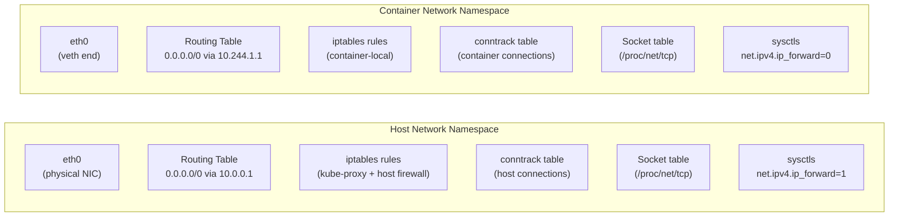
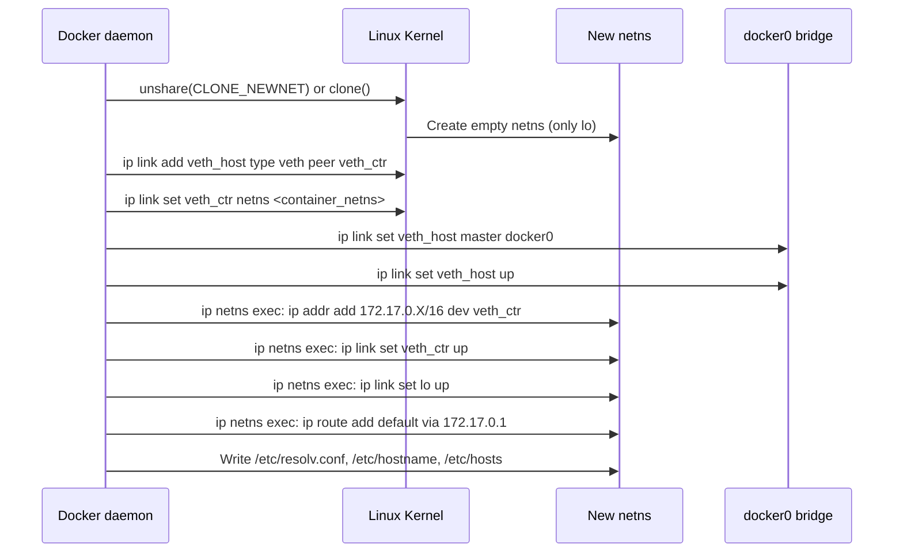
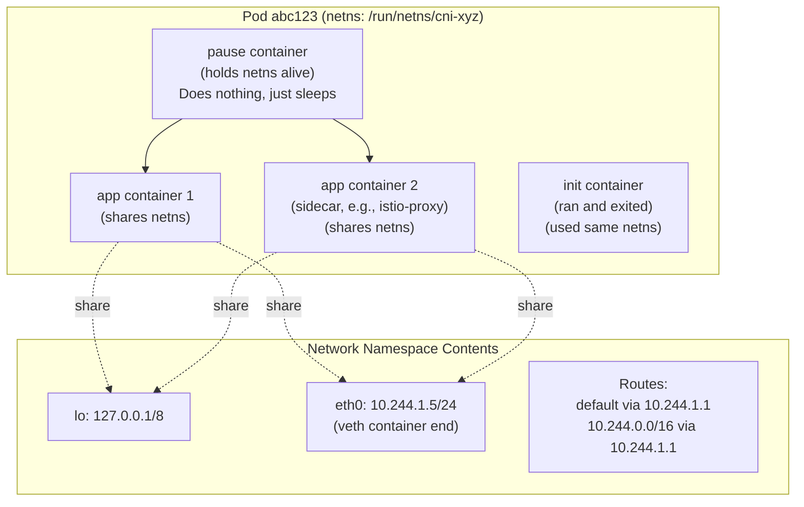

# Network Namespaces: Container Network Isolation

## Table of Contents

- [Overview](#overview)
- [Namespace Types and Composition](#namespace-types-and-composition)
  - [What Network Namespace Isolation Means](#what-network-namespace-isolation-means)
- [Creating and Managing Namespaces](#creating-and-managing-namespaces)
  - [Manual Namespace Operations](#manual-namespace-operations)
  - [Building a Namespace with Connectivity](#building-a-namespace-with-connectivity)
- [Container Networking: How Docker and containerd Connect Namespaces](#container-networking-how-docker-and-containerd-connect-namespaces)
  - [Docker Network Bootstrap Sequence](#docker-network-bootstrap-sequence)
  - [How containerd/CRI Creates Pod Namespaces](#how-containerdcri-creates-pod-namespaces)
- [Kubernetes Pod netns: The Pause Container Model](#kubernetes-pod-netns-the-pause-container-model)
- [Debugging Containers by Entering Namespaces](#debugging-containers-by-entering-namespaces)
  - [nsenter: The Essential Tool](#nsenter-the-essential-tool)
  - [ip netns exec for Named Namespaces](#ip-netns-exec-for-named-namespaces)
  - [kubectl debug and netshoot](#kubectl-debug-and-netshoot)
- [Real-World Production Scenario](#real-world-production-scenario)
  - [Scenario: Container Can't Resolve DNS](#scenario-container-cant-resolve-dns)
- [Failure Modes](#failure-modes)
- [Security Considerations](#security-considerations)
- [Interview Questions](#interview-questions)
  - [Basic](#basic)
  - [Intermediate](#intermediate)
  - [Advanced / Staff Level](#advanced-staff-level)

---

## Overview

Network namespaces are the kernel mechanism that makes container networking possible. Every Docker container, Kubernetes pod, and network-isolated process runs in a separate network namespace — a complete, private copy of the networking stack. Understanding namespaces at the kernel level lets you debug container networking issues that are invisible from the outside: you enter the namespace and use the same tools you'd use on a real host. This file covers the implementation, composition with other namespace types, Docker/Kubernetes integration, and production debugging techniques.

---

## Namespace Types and Composition

Linux has seven namespace types. Containers use all of them together, but they are independent kernel mechanisms:

| Namespace | Flag | Isolates |
|-----------|------|---------|
| Network | `CLONE_NEWNET` | Network interfaces, routing tables, iptables, conntrack, sockets, /proc/net/* |
| PID | `CLONE_NEWPID` | Process tree (container sees its own PID 1) |
| Mount | `CLONE_NEWNS` | Filesystem mount points |
| UTS | `CLONE_NEWUTS` | Hostname and domain name |
| IPC | `CLONE_NEWIPC` | System V IPC, POSIX message queues |
| User | `CLONE_NEWUSER` | UID/GID mapping (rootless containers) |
| Cgroup | `CLONE_NEWCGROUP` | cgroup root view |

A container is the intersection of all seven. When you run `docker run --rm ubuntu sleep 1000`, Docker calls `clone(CLONE_NEWNET | CLONE_NEWPID | CLONE_NEWNS | CLONE_NEWUTS | CLONE_NEWIPC)` to create the container process in new namespaces simultaneously.

### What Network Namespace Isolation Means



**Per-namespace resources (fully isolated):**
- Network interfaces (each namespace starts with only `lo`)
- Routing tables and policy routing rules
- iptables/nftables rules and chains
- Connection tracking table (`nf_conn` entries)
- Socket table (port 80 in namespace A is independent of port 80 in B)
- `/proc/net/*` entries (each namespace sees its own `/proc/net/tcp`, etc.)
- Most `net.*` sysctls (per-namespace since kernel 4.15)
- Neighbor/ARP table

**Shared (NOT namespace-isolated):**
- Physical NIC hardware (only one namespace can "own" an interface at a time)
- Kernel memory (socket buffers, conntrack entries all use shared kernel memory — DoS possible)
- CPU for packet processing (no bandwidth isolation without TC)
- BPF program loading state (loading a module affects all namespaces)

---

## Creating and Managing Namespaces

### Manual Namespace Operations

```bash
# Create a named network namespace (persisted as /var/run/netns/<name>)
ip netns add myns

# List namespaces
ip netns list
# myns (id: 5)

# Execute a command in the namespace
ip netns exec myns ip link show
# 1: lo: <LOOPBACK> mtu 65536 qdisc noop state DOWN mode DEFAULT
# Only loopback exists — completely isolated

# Delete namespace
ip netns del myns

# Check namespace ID of a process
readlink /proc/$$/ns/net
# net:[4026531840]  ← host namespace NID
# Different NIDs = different namespaces
```

### Building a Namespace with Connectivity

```bash
# Scenario: Create a namespace "web" with internet access via NAT

# Step 1: Create namespace
ip netns add web

# Step 2: Create veth pair
ip link add veth-host type veth peer name veth-web

# Step 3: Move container end to namespace
ip link set veth-web netns web

# Step 4: Configure host end
ip addr add 10.100.0.1/24 dev veth-host
ip link set veth-host up

# Step 5: Configure container end (inside namespace)
ip netns exec web ip addr add 10.100.0.2/24 dev veth-web
ip netns exec web ip link set veth-web up
ip netns exec web ip link set lo up

# Step 6: Add default route in container namespace
ip netns exec web ip route add default via 10.100.0.1

# Step 7: Enable IP forwarding on host (to forward between namespaces)
sysctl -w net.ipv4.ip_forward=1

# Step 8: NAT for internet access
iptables -t nat -A POSTROUTING -s 10.100.0.0/24 -j MASQUERADE

# Step 9: Test
ip netns exec web ping -c1 8.8.8.8
ip netns exec web curl https://example.com

# Verify route in namespace
ip netns exec web ip route show
# default via 10.100.0.1 dev veth-web
# 10.100.0.0/24 dev veth-web proto kernel scope link src 10.100.0.2
```

---

## Container Networking: How Docker and containerd Connect Namespaces

### Docker Network Bootstrap Sequence



### How containerd/CRI Creates Pod Namespaces

containerd uses runc (or another OCI runtime) to create namespaces. The CRI (Container Runtime Interface) flow:

1. `RunPodSandbox` → creates the sandbox container (pause/infra)
2. Creates a new network namespace (`/run/netns/cni-<UUID>`)
3. Calls the CNI plugin: `CNI_COMMAND=ADD CNI_NETNS=/run/netns/cni-<UUID>` with the pod's network config
4. CNI plugin configures the namespace: creates veth, assigns IP, installs routes
5. `CreateContainer` for each app container with `--network=container:<sandbox_id>` → shares the sandbox namespace

---

## Kubernetes Pod netns: The Pause Container Model



**Why the pause container exists:** If all containers in a pod shared a namespace through one of the app containers, the namespace would be destroyed when that app container restarts. The pause container is a stable anchor — it rarely restarts, and its namespace persists for the pod's lifetime. App containers can restart independently without affecting the network identity.

**What containers in a pod share:**
- Same IP address (all containers have the same pod IP)
- Same port namespace (two containers cannot bind the same port)
- Same loopback (`localhost` communication works between containers in the same pod)
- Same network policies (enforced at the namespace level)

**What they don't share:**
- PID namespace (each container has its own process tree, unless `shareProcessNamespace: true`)
- Filesystem mounts
- IPC namespace (by default — configurable with `hostIPC`)

---

## Debugging Containers by Entering Namespaces

### nsenter: The Essential Tool

```bash
# Find the PID of a process inside a container
docker inspect --format '{{.State.Pid}}' <container_name>
# 12345

# In Kubernetes:
kubectl get pod mypod -o jsonpath='{.status.hostIP}'  # find node
# Then on the node:
crictl ps | grep mypod
CONTAINER_ID="abc123"
PID=$(crictl inspect $CONTAINER_ID | python3 -c "import sys,json; d=json.load(sys.stdin); print(d['info']['pid'])")

# Enter the container's NETWORK namespace only (use host's tools)
nsenter -t $PID -n ip addr
nsenter -t $PID -n ip route
nsenter -t $PID -n ss -tlnp
nsenter -t $PID -n netstat -tlnp

# Run tcpdump in the container's namespace (capture container's traffic)
nsenter -t $PID -n tcpdump -i eth0 -w /tmp/capture.pcap

# Enter ALL namespaces (full container environment)
nsenter -t $PID --all

# Enter only specific namespaces
nsenter -t $PID -n -u  # network + UTS (hostname)
```

### ip netns exec for Named Namespaces

```bash
# Named namespaces (created by ip netns add, or linked by CNI)
ip netns list
# cni-abc12345 (id: 7)
# cni-def67890 (id: 8)

ip netns exec cni-abc12345 ip addr
ip netns exec cni-abc12345 ss -tlnp

# CNI creates namespace files in /run/netns/
ls /run/netns/
# cni-abc12345-1234-5678-9012-abcdefghij

# Link a container's netns to ip netns (for debugging)
container_pid=12345
ln -s /proc/$container_pid/ns/net /run/netns/debug-container
ip netns exec debug-container ip route show
# Clean up:
rm /run/netns/debug-container
```

### kubectl debug and netshoot

For Kubernetes, when tools are missing inside the container:

```bash
# Create a debug container in the same pod/namespace (K8s 1.23+)
kubectl debug -it mypod --image=nicolaka/netshoot --target=mycontainer

# Ephemeral container shares the pod's namespaces
# Now you can run:
# dig, nslookup (DNS debugging)
# curl, wget (HTTP connectivity)
# tcpdump (packet capture in the pod's namespace)
# ss, netstat (socket inspection)
# ip, route (routing inspection)

# For older K8s: use a debug pod with host namespaces
kubectl run debug --rm -it --image=nicolaka/netshoot --overrides='
{
  "spec": {
    "hostNetwork": true,
    "hostPID": true,
    "containers": [{
      "name": "debug",
      "image": "nicolaka/netshoot",
      "securityContext": {"privileged": true}
    }]
  }
}' -- bash
# From inside: nsenter -t $POD_PID -n <command>
```

---

## Real-World Production Scenario

### Scenario: Container Can't Resolve DNS

**Alert:** Application in a pod returns `java.net.UnknownHostException: postgres.database.svc.cluster.local` intermittently, but not always.

**Diagnosis:**

```bash
# Step 1: Enter the pod's namespace
POD_PID=$(crictl inspect $(crictl ps | grep mypod | awk '{print $1}') | python3 -c "import sys,json; d=json.load(sys.stdin); print(d['info']['pid'])")

nsenter -t $POD_PID -n -m sh

# Step 2: Check /etc/resolv.conf inside the namespace
cat /etc/resolv.conf
# nameserver 10.96.0.10       ← kube-dns ClusterIP
# search default.svc.cluster.local svc.cluster.local cluster.local
# options ndots:5

# Step 3: Test DNS resolution directly
dig postgres.database.svc.cluster.local @10.96.0.10
# ;; ANSWER SECTION:
# postgres.database.svc.cluster.local. 5 IN A 10.96.50.100
# WORKS — DNS resolves correctly when queried directly

# Step 4: But why is it intermittent from the app?
# With ndots:5, the FQDN "postgres.database.svc.cluster.local" has 4 dots
# so it gets .default.svc.cluster.local appended FIRST (search domain)
# This results in TWO simultaneous DNS queries:
# - postgres.database.svc.cluster.local.default.svc.cluster.local (NXDOMAIN)
# - postgres.database.svc.cluster.local (A record)

# Step 5: Check conntrack for insert_failed (DNS race condition)
nsenter -t $POD_PID -n conntrack -S | grep insert_failed
# insert_failed: 47  ← UDP DNS query conntrack race!

# Explanation:
# Java app sends A and AAAA queries simultaneously for the same name
# Both queries create UDP conntrack entries with same 5-tuple (same source port randomization)
# One succeeds, one fails and gets dropped
# The lost query waits for 5-second timeout, causing intermittent 5-second delays

# Step 6: Solution A — use FQDN with trailing dot in app config
# postgres.database.svc.cluster.local.   ← trailing dot = absolute name, no search suffix

# Step 7: Solution B — reduce ndots (apply to specific deployment)
# In pod spec:
# dnsConfig:
#   options:
#     - name: ndots
#       value: "2"

# Step 8: Solution C — deploy NodeLocal DNSCache
# Routes DNS queries to a local cache on each node, avoids conntrack for DNS
kubectl apply -f https://k8s.io/examples/admin/dns/nodelocaldns.yaml

# Verify NodeLocal DNS is working
nsenter -t $POD_PID -n cat /etc/resolv.conf
# nameserver 169.254.20.10   ← NodeLocal DNSCache link-local address
```

**Root cause:** The conntrack `insert_failed` counter is the smoking gun for the Kubernetes DNS 5-second timeout issue. When two UDP DNS queries from the same source port (A and AAAA) reach the conntrack table simultaneously, one fails to insert and the packet is dropped. The application waits for the DNS timeout (5 seconds) before retrying. NodeLocal DNSCache solves this by using TCP for DNS (no UDP conntrack race) and caching responses.

---

## Failure Modes

| Failure | Symptoms | Detection | Fix |
|---------|----------|-----------|-----|
| Namespace deleted (pause container killed) | Pod loses all connectivity | `ip link show` in namespace shows no eth0 | Kubernetes will recreate pod; don't kill pause containers |
| Default route missing in namespace | `connect: Network is unreachable` for non-local destinations | `nsenter -t $PID -n ip route` | Add default route; fix CNI plugin |
| DNS conntrack insert_failed | Intermittent 5-second DNS delays | `conntrack -S \| grep insert_failed` increasing | Deploy NodeLocal DNSCache; use TCP DNS; reduce ndots |
| Wrong DNS nameserver in resolv.conf | DNS always fails | `cat /etc/resolv.conf` inside namespace | Fix kubelet `--cluster-dns` argument |
| MTU mismatch at veth | Large packets silently dropped | `ping -M do -s 1400 <dst>` from inside namespace | Set matching MTU: `ip link set eth0 mtu 1450` |
| iptables in namespace blocking traffic | Unexpected drops from container | `nsenter -t $PID -n iptables -L` | Application-level iptables rules; audit and remove |

---

## Security Considerations

| Vector | Description | Mitigation |
|--------|-------------|------------|
| Namespace escape via kernel exploit | Container processes can escape namespace isolation via kernel CVEs | Keep kernel patched; use gVisor/Kata for untrusted workloads |
| CAP_NET_ADMIN in container | Container can modify host network routes/rules | Never grant CAP_NET_ADMIN unless explicitly required; audit with `kubectl describe pod` |
| Shared kernel memory DoS | Container creating millions of sockets exhausts kernel memory shared with other namespaces | Set `ulimit -n` (file descriptor limits); use cgroup v2 memory limits |
| hostNetwork: true pod | Pod bypasses namespace isolation, uses host network directly | Restrict with PodSecurityAdmission or OPA/Gatekeeper policy |
| nsenter access | Any process with root on the host can enter any container's namespace | Protect host root access; audit privileged containers |
| /proc/$PID/ns/* traversal | A process can read namespace file descriptors, potentially entering other namespaces | Mount /proc with `hidepid=2`; use seccomp to block `setns()` |

---

## Interview Questions

### Basic

**Q: What does a network namespace isolate in Linux?**
A: A network namespace provides an isolated copy of: all network interfaces (container starts with only `lo`), IP addresses and routing tables, iptables/nftables rules and chains, the connection tracking table, socket bindings (port 80 in one namespace doesn't conflict with port 80 in another), `/proc/net/*` virtual files, and most `net.*` sysctls. Notably NOT isolated: the kernel itself (same code runs for all namespaces), CPU and memory (controlled by cgroups), and physical NIC hardware (must be moved to a namespace or shared via bridge/macvlan).

**Q: What is the pause container in Kubernetes and why can't we use an app container to hold the namespace?**
A: The pause container is a minimal container whose only purpose is to hold the pod's network namespace alive. If we used an app container, the namespace would be destroyed whenever that app container is killed or crashes — causing all other containers in the pod to lose their network identity. The pause container rarely restarts, providing stable namespace lifetime. All other containers in the pod join the pause container's namespace via the `--network=container:<pause_id>` Docker/containerd flag.

### Intermediate

**Q: How do you debug network issues inside a container that has no debugging tools (no curl, no ss, no ip)?**
A: Three approaches: (1) `nsenter`: find the container's PID with `crictl inspect`, then `nsenter -t $PID -n ip addr` — this runs the host's `ip` binary inside the container's network namespace. You get full access to the container's networking without having to install anything inside it. (2) `kubectl debug -it pod/mypod --image=nicolaka/netshoot` — attaches an ephemeral container that shares the pod's namespaces, giving you a full toolbox. (3) `kubectl exec` into a sidecar (like istio-proxy) that is in the same namespace and has more tools. The nsenter approach is most versatile for node-level debugging since it doesn't require Kubernetes API access.

**Q: Explain the DNS conntrack insert_failed race condition in Kubernetes and why it causes 5-second delays.**
A: When an application sends both A (IPv4) and AAAA (IPv6) DNS queries simultaneously for the same hostname, both UDP packets may have the same 5-tuple (same source port if the DNS resolver reuses ports). When two packets race to create a conntrack entry with identical tuples, one succeeds and one fails — `insert_failed` counter increments. The failed packet is dropped silently. Since DNS is UDP with no retransmission, the application waits for the query's timeout (default 5 seconds in most resolvers, including glibc) before retrying. This appears as intermittent 5-second DNS latency. Fix: NodeLocal DNSCache (uses TCP for DNS, avoiding the UDP conntrack race) or setting `ndots: 2` in pod DNS config to reduce the number of simultaneous search-domain queries.

### Advanced / Staff Level

**Q: Walk through exactly what happens at the kernel level when `docker run` creates a new container with its own networking.**
A: (1) dockerd calls `clone(CLONE_NEWNET | CLONE_NEWPID | CLONE_NEWNS | ...)` which creates the container process in fresh namespaces. The new network namespace starts with only a loopback interface in DOWN state. (2) dockerd calls `ip link add veth_host type veth peer name veth_ctr` in the host namespace, creating two linked `net_device` structs. (3) dockerd calls `ip link set veth_ctr netns <container_netns_fd>` which moves the `veth_ctr` device to the container's namespace by changing the `dev->nd_net` pointer to the container's `struct net`. The device disappears from the host namespace. (4) dockerd attaches `veth_host` to the `docker0` bridge with `ip link set veth_host master docker0`. (5) Via `nsenter` or `setns`, dockerd enters the container's namespace and configures: IP address on `veth_ctr`, brings interfaces up, adds default route, writes `/etc/resolv.conf` and `/etc/hosts`. (6) The container process executes with `veth_ctr` as its `eth0`, fully isolated from other namespaces but connected via the veth→bridge→NAT path.

**Q: A security engineer wants to prevent any container on a node from accessing the host's metadata service at 169.254.169.254. How do you implement this robustly in a multi-tenant Kubernetes cluster?**
A: Use multiple layers: (1) Network policy (Kubernetes-level): create a NetworkPolicy in each namespace that blocks egress to `169.254.169.254/32` — but this requires a CNI that enforces NetworkPolicy (Calico, Cilium) and must be applied to all namespaces (use a Kyverno/OPA policy to automatically inject it). (2) iptables at the node level (defense in depth): add a rule in the host namespace's FORWARD chain to block traffic from pod CIDRs to 169.254.169.254 — this catches anything that bypasses namespace-level NetworkPolicy. (3) For stronger isolation (Cilium): use a HostFirewall CiliumNetworkPolicy that blocks this at the eBPF level before packets even reach iptables. (4) At the cloud level: use instance metadata service v2 (IMDSv2 on AWS, which requires a PUT token request) and configure the metadata service to reject requests from non-node IPs. The layered approach ensures that bypassing one layer (e.g., a CNI that doesn't enforce NetworkPolicy) doesn't expose the metadata endpoint.
