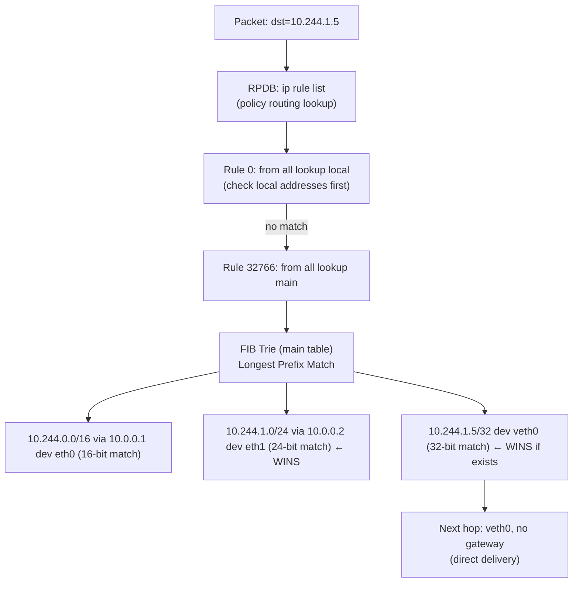
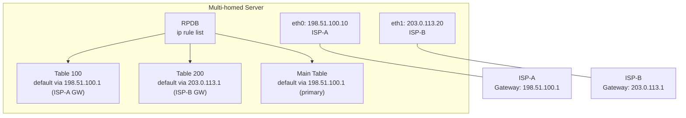
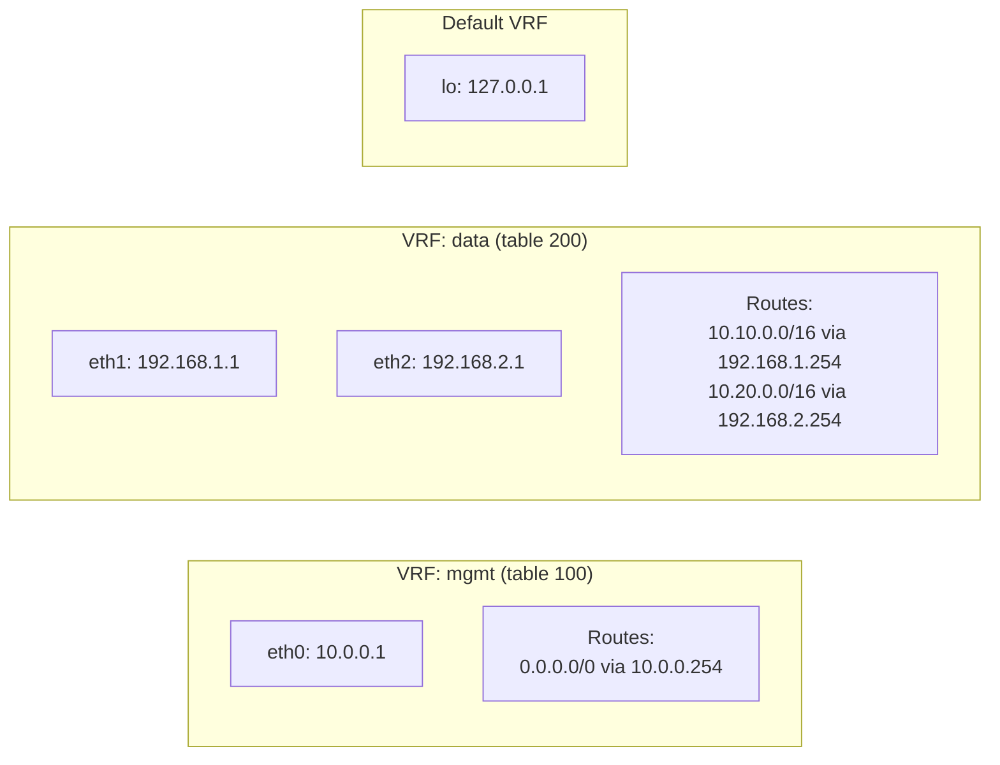
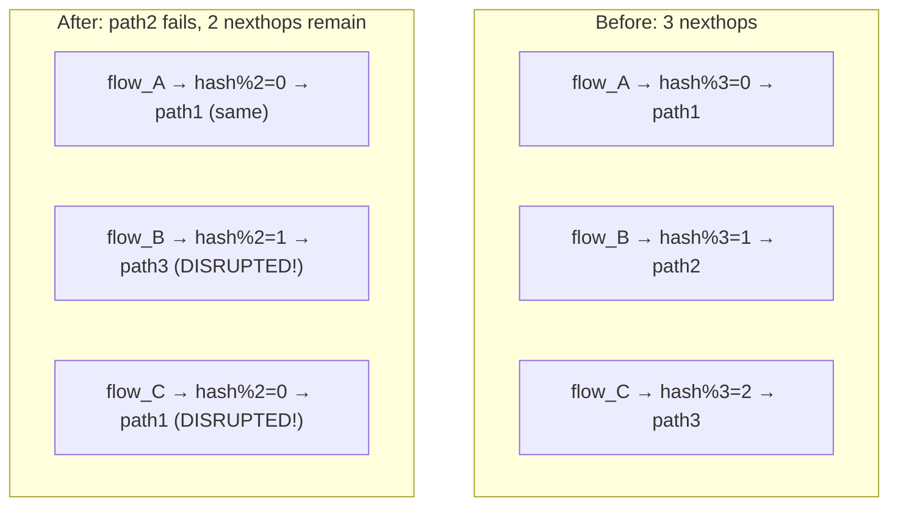

# Linux Routing and Policy Routing

## Overview

Linux routing is more powerful and more complex than most engineers realize. Beyond the basic "ip route show" there's a Policy Routing Database (RPDB) with 253 routing tables, source-based routing, VRF isolation, and ECMP with resilient hashing. When traffic takes an unexpected path on a multi-homed server, understanding the RPDB is the only way to diagnose it. This file covers the full routing architecture with production scenarios for multi-homed servers, VRF isolation, and ECMP failover.

---

## Linux Routing: Route Lookup Algorithm

### Longest Prefix Match



The kernel uses a trie (FIB trie, since kernel 3.6 which removed route cache) for lookups. Each level of the trie represents one bit of the address. The longest matching prefix wins. Lookup is O(W) where W=32 for IPv4 — consistent regardless of table size.

```bash
# Show main routing table
ip route show
# default via 192.168.1.1 dev eth0 proto dhcp src 192.168.1.100 metric 100
# 10.244.0.0/16 via 10.0.0.1 dev eth0 proto static
# 192.168.1.0/24 dev eth0 proto kernel scope link src 192.168.1.100

# Show all routes in all tables
ip route show table all

# Find which route a specific destination uses
ip route get 8.8.8.8
# 8.8.8.8 via 192.168.1.1 dev eth0 src 192.168.1.100 uid 0
#     cache

# Find route with specific source address (useful for multi-homed debugging)
ip route get 8.8.8.8 from 10.0.0.5
# 8.8.8.8 from 10.0.0.5 via 192.168.1.1 dev eth0

# Show FIB trie statistics (routing table size info)
cat /proc/net/fib_triestat
```

### Route Attributes

```bash
# Route types and their meanings
ip route show | head -20

# Key attributes:
# proto kernel  = added by kernel when interface configured
# proto static  = added manually with ip route
# proto dhcp    = added by DHCP client
# proto bgp/ospf= added by routing daemon (FRR/BIRD)
# scope link    = directly connected (no gateway)
# scope global  = needs next-hop routing
# metric N      = preference (lower = preferred for same prefix)
# src X.X.X.X   = preferred source address for outgoing packets

# Verify metric tie-breaking (both ISPs have default route)
ip route show
# default via 192.168.1.1 dev eth0 metric 100
# default via 10.0.0.1 dev eth1 metric 200  ← higher metric = fallback
```

---

## Policy Routing: The Routing Policy Database (RPDB)

The RPDB is the master lookup mechanism. Before consulting any routing table, the kernel walks through the RPDB rules in priority order. Each rule specifies a condition (source IP, destination IP, fwmark, incoming interface) and which routing table to consult.

```bash
# View all RPDB rules
ip rule show
# 0:     from all lookup local    ← always first: local addresses (127/8, broadcast)
# 32766: from all lookup main     ← the "main" routing table
# 32767: from all lookup default  ← typically empty; historical fallback

# Rule priority: lower number = evaluated first
# First matching rule wins — its specified table is consulted
```

### Three Built-in Tables

| Table | Number | Purpose |
|-------|--------|---------|
| `local` | 255 | Loopback, broadcast, local host addresses |
| `main` | 254 | Default routing table (what `ip route show` displays) |
| `default` | 253 | Typically empty; historical fallback for default gateway |

```bash
# View local table (contains loopback and broadcast routes)
ip route show table local
# broadcast 127.0.0.0 dev lo proto kernel scope link src 127.0.0.1
# local 127.0.0.0/8 dev lo proto kernel scope link src 127.0.0.1
# local 127.0.0.1 dev lo proto kernel scope link src 127.0.0.1
# broadcast 192.168.1.0 dev eth0 proto kernel scope link src 192.168.1.100
# local 192.168.1.100 dev eth0 proto kernel scope link src 192.168.1.100

# The local table is how the kernel knows a destination is "local" vs "forward"
```

---

## Source-Based Routing: Multi-Homed Server

A multi-homed server with two ISPs must ensure that responses to traffic arriving on ISP-A's interface leave via ISP-A's default gateway, not ISP-B's. Without policy routing, the response takes the wrong path (asymmetric routing), and the ISP's ingress filtering drops it.



### Configuring Source-Based Routing

```bash
# Routing tables 100 and 200 (add to /etc/iproute2/rt_tables for named access)
echo "100 isp_a" >> /etc/iproute2/rt_tables
echo "200 isp_b" >> /etc/iproute2/rt_tables

# Table 100: all routes for traffic going out ISP-A
ip route add 198.51.100.0/24 dev eth0 table isp_a        # local subnet
ip route add default via 198.51.100.1 table isp_a         # ISP-A default

# Table 200: all routes for traffic going out ISP-B
ip route add 203.0.113.0/24 dev eth1 table isp_b          # local subnet
ip route add default via 203.0.113.1 table isp_b           # ISP-B default

# RPDB rules: traffic from ISP-A source → use ISP-A table
ip rule add from 198.51.100.10 table isp_a
# Traffic from ISP-B source → use ISP-B table
ip rule add from 203.0.113.20 table isp_b

# Test: simulating a packet from external hitting eth0 (src = 198.51.100.10 after SNAT)
ip route get 8.8.8.8 from 198.51.100.10
# 8.8.8.8 from 198.51.100.10 via 198.51.100.1 dev eth0  ← uses ISP-A gateway (correct)

ip route get 8.8.8.8 from 203.0.113.20
# 8.8.8.8 from 203.0.113.20 via 203.0.113.1 dev eth1   ← uses ISP-B gateway (correct)
```

### fwmark-Based Routing (Used by Kubernetes/VPNs)

```bash
# Route traffic with a specific firewall mark to a custom table
# Common use: kube-proxy marks traffic for masquerade, VPN marks tunnel traffic

# Mark packets with iptables (e.g., all traffic to VPN subnet)
iptables -t mangle -A OUTPUT -d 10.8.0.0/8 -j MARK --set-mark 0x1

# Route marked traffic through table 300
ip rule add fwmark 0x1 table 300
ip route add default via 10.8.0.1 table 300  # VPN gateway

# Verify
iptables -t mangle -L OUTPUT -n -v | grep MARK
ip rule show | grep fwmark
```

---

## VRF: Virtual Routing and Forwarding

VRF creates completely isolated routing domains in Linux (since kernel 4.3). Unlike multiple routing tables (which are all visible to the same process), VRF-bound interfaces and sockets are fully isolated.



```bash
# Create VRF devices
ip link add vrf-mgmt type vrf table 100
ip link set vrf-mgmt up

ip link add vrf-data type vrf table 200
ip link set vrf-data up

# Bind interfaces to VRFs
ip link set eth0 master vrf-mgmt
ip link set eth1 master vrf-data
ip link set eth2 master vrf-data

# Routes are added to the VRF's table
ip route add 0.0.0.0/0 via 10.0.0.254 vrf vrf-mgmt
ip route add 10.10.0.0/16 via 192.168.1.254 vrf vrf-data

# View routes per VRF
ip route show vrf vrf-mgmt
ip route show vrf vrf-data

# Bind a socket to a VRF (SO_BINDTODEVICE)
# Application must call setsockopt(fd, SOL_SOCKET, SO_BINDTODEVICE, "vrf-mgmt", 9)
# Or: run the application in the VRF namespace
ip vrf exec vrf-mgmt ping 10.0.0.254

# Check VRF binding
ip link show type vrf
# 5: vrf-mgmt: <NOARP,MASTER,UP,LOWER_UP> mtu 65536 qdisc noqueue master
#     vrf table 100
```

**Production use case:** Network equipment running in-band management alongside data plane traffic. The management plane (SSH, SNMP) uses `vrf-mgmt` table, data plane traffic uses `vrf-data` table. Even if the data plane is compromised, the management interfaces are unreachable via the data plane routing domain.

---

## ECMP: Equal-Cost Multi-Path Routing

ECMP allows the kernel to split traffic across multiple equal-cost paths. Critical for high-availability networking where multiple paths exist between systems.

```bash
# Add a multipath route (ECMP with two next-hops)
ip route add 10.0.0.0/8 \
    nexthop via 192.168.1.1 dev eth0 weight 1 \
    nexthop via 192.168.2.1 dev eth1 weight 1

# Weight-based ECMP (70/30 split)
ip route add 10.0.0.0/8 \
    nexthop via 192.168.1.1 dev eth0 weight 7 \
    nexthop via 192.168.2.1 dev eth1 weight 3

# View the ECMP route
ip route show 10.0.0.0/8
# 10.0.0.0/8
#   nexthop via 192.168.1.1 dev eth0 weight 1
#   nexthop via 192.168.2.1 dev eth1 weight 1
```

### Hash-Based Flow Selection

```bash
# Control which packet fields are hashed for path selection
sysctl net.ipv4.fib_multipath_hash_policy
# 0: src_ip + dst_ip (L3 only) — all connections between same hosts use same path
# 1: src_ip + dst_ip + src_port + dst_port + proto (L3+L4) — recommended
# 2: L3+L4 + inner headers for encapsulated traffic (VXLAN/GRE) — for overlay networks

sysctl -w net.ipv4.fib_multipath_hash_policy=1

# Test which path a specific flow takes
ip route get 10.5.5.5
# Uses kernel's hash to select nexthop
ip route get 10.5.5.5 from 192.168.1.100 sport 45678 dport 80 proto tcp
# Simulates a specific flow's path selection
```

### Resilient ECMP (Kernel 5.12+)

The classic ECMP problem: when one nexthop fails and is removed, the hash function changes for ALL flows, disrupting existing TCP connections.



Resilient nexthop groups solve this: only buckets assigned to the failed nexthop are reassigned.

```bash
# Create nexthop objects (kernel 5.2+)
ip nexthop add id 1 via 192.168.1.1 dev eth0
ip nexthop add id 2 via 192.168.2.1 dev eth1
ip nexthop add id 3 via 192.168.3.1 dev eth2

# Create a resilient nexthop group (kernel 5.12+)
# buckets: hash table size (more buckets = finer-grained redistribution)
# idle_timer: how long before an idle bucket is rebalanced
# unbalanced_timer: max time an unbalanced group is allowed to persist
ip nexthop add id 10 group 1/2/3 type resilient \
    buckets 128 idle_timer 60 unbalanced_timer 300

# Use in a route
ip route add 10.0.0.0/8 nhid 10

# View nexthop group state
ip nexthop show id 10

# View individual bucket assignments
ip nexthop bucket show id 10
# id 10 index 0 idle 23.45 nhid 1
# id 10 index 1 idle 23.45 nhid 2
# id 10 index 2 idle 23.45 nhid 3
# ... (128 buckets distributed across 3 nexthops)
```

---

## Real-World Production Scenario

### Scenario: Traffic Taking Wrong Path in Multi-Homed Server

**Alert:** After a security incident, the team added a new route to redirect monitoring traffic to a separate interface. Now customer traffic intermittently fails with timeouts.

**Diagnosis:**

```bash
# Step 1: Check all routing tables and rules
ip rule show
# 0:     from all lookup local
# 100:   from 10.0.0.0/8 lookup monitoring   ← NEW RULE from security team
# 32766: from all lookup main
# 32767: from all lookup default

ip route show table monitoring
# default via 192.168.99.1 dev mgmt0  ← monitoring traffic goes out mgmt0

# Step 2: The problem — rule "from 10.0.0.0/8 lookup monitoring" is TOO BROAD
# Customer traffic FROM 10.0.0.0/8 is being routed out mgmt0 instead of main table
# mgmt0 is an internal management interface with no internet path

# Step 3: Verify with ip route get
ip route get 8.8.8.8 from 10.44.1.5
# 8.8.8.8 from 10.44.1.5 via 192.168.99.1 dev mgmt0  ← WRONG! Should be via eth0

# Step 4: What was intended
# Security team wanted ONLY monitoring agent traffic (from a specific source IP)
# to use the monitoring table, not ALL traffic from 10.0.0.0/8

# Step 5: Fix — narrow the rule
ip rule del from 10.0.0.0/8 table monitoring
ip rule add from 10.0.5.10/32 table monitoring  # only monitoring agent IP

# Or better: use fwmark to avoid IP-based rule fragility
iptables -t mangle -A OUTPUT -p tcp --dport 9090 -j MARK --set-mark 0x10
ip rule add fwmark 0x10 table monitoring
ip rule del from 10.0.0.0/8 table monitoring  # remove the broad rule

# Step 6: Verify fix
ip route get 8.8.8.8 from 10.44.1.5
# 8.8.8.8 from 10.44.1.5 via 10.0.0.1 dev eth0  ← CORRECT

ip route get 192.168.99.2  # monitoring endpoint
# 192.168.99.2 dev mgmt0  ← still works via monitoring table (now fwmark-based)

# Step 7: Document — forgotten rules are a production hazard
ip rule show
# Review ALL rules, not just new ones
# Add monitoring/audit for unexpected rules: alert if ip rule show changes
```

---

## Failure Modes

| Failure | Symptoms | Detection | Fix |
|---------|----------|-----------|-----|
| Overly broad RPDB rule | Traffic takes unexpected path; asymmetric routing | `ip route get <dst> from <src>` shows wrong nexthop | Narrow rule to specific source IP/fwmark |
| Forgotten policy rule from debugging | Persistent unexpected routing; hard to reproduce | `ip rule show` — look for non-standard rules | `ip rule del` to remove forgotten rules |
| ECMP rehashing on nexthop failure | Existing TCP connections disrupted | Traffic counters drop to 0 on some flows; `ip nexthop show` shows fewer nexthops | Migrate to resilient nexthop groups (kernel 5.12+) |
| Asymmetric routing | Packets go in on eth0, replies go out eth1; stateful firewall drops reply | `ip route get dst from src` for both directions | Source-based routing tables |
| Missing route in VRF | Traffic in VRF goes to wrong table | `ip route show vrf <name>` | Add missing route: `ip route add ... vrf <name>` |
| ip_forward=0 | All forwarding fails; containers can't reach internet | `sysctl net.ipv4.ip_forward` | `sysctl -w net.ipv4.ip_forward=1` |

---

## Debugging Commands Reference

```bash
# The essential routing debug toolkit

# 1. Show all routing tables
ip route show table all

# 2. Show all policy rules
ip rule show

# 3. Simulate route lookup (most important debugging command)
ip route get <destination>
ip route get <destination> from <source>
ip route get <destination> from <source> sport <sport> dport <dport> proto tcp

# 4. Show specific table
ip route show table <number_or_name>

# 5. Watch routing table changes in real time
ip route monitor

# 6. Show FIB statistics (routing table size, memory)
cat /proc/net/fib_triestat

# 7. Show neighbor/ARP table
ip neigh show
ip neigh show dev eth0

# 8. Trace a specific packet through the kernel (uses nf_log)
iptables -t mangle -I PREROUTING -s 10.0.0.1 -j LOG --log-prefix "ROUTE-DEBUG: "

# 9. Monitor nexthop changes (for ECMP/BFD environments)
ip nexthop monitor

# 10. Show all routes to a prefix (including all tables)
ip route show root 10.0.0.0/8
```

---

## Security Considerations

| Vector | Description | Mitigation |
|--------|-------------|------------|
| RPDB rule injection via CAP_NET_ADMIN | A process with CAP_NET_ADMIN can insert RPDB rules to redirect traffic | Restrict CAP_NET_ADMIN; audit rules with `ip rule show` monitoring |
| Source route forgery | Applications can set SO_DONTROUTE or bind to specific interfaces to bypass routing | Filter with iptables using `-m owner` to restrict which UIDs can open specific sockets |
| Route leak between VRFs | Misconfigured cross-VRF route could allow data plane to reach management VRF | Validate VRF membership before adding routes; use strict VRF binding with SO_BINDTODEVICE |
| ECMP load imbalance = DDoS amplification | Hash collision sends all traffic to one nexthop | Use L3+L4 hash policy; monitor per-path traffic distribution |
| BGP route injection | If a routing daemon (FRR/BIRD) is compromised, it can inject routes | Restrict BGP peers; use route filters; run routing daemon with minimal privileges |

---

## Interview Questions

### Basic

**Q: What is the Routing Policy Database (RPDB) in Linux and how does it differ from the main routing table?**
A: The RPDB is the master lookup mechanism the kernel uses before consulting any routing table. It contains rules (viewable with `ip rule show`) that specify conditions (source IP, destination IP, fwmark, incoming interface) and which routing table to use when the condition matches. The kernel evaluates rules in priority order (lower number first) and uses the first matching rule's specified table. The "main" routing table is just one of up to 253 tables — rule 32766 in the RPDB says "for all packets, consult the main table." You can add rules with higher priority (lower numbers) that redirect specific traffic to custom tables, which is the foundation of policy routing, VPNs, and Kubernetes service routing.

**Q: What is `ip route get` and when do you use it?**
A: `ip route get` simulates the kernel's route lookup for a specific destination. It shows exactly which route and nexthop the kernel would use — including which RPDB rule matched and which table was consulted. Essential for debugging: `ip route get 8.8.8.8 from 10.0.0.5` shows what path traffic sourced from 10.0.0.5 would take to reach 8.8.8.8. If the output shows a wrong gateway or interface, you've identified a routing misconfiguration. More powerful than reading `ip route show` because it accounts for RPDB rule evaluation and longest-prefix matching.

### Intermediate

**Q: A multi-homed server has two NICs connected to different ISPs. Outbound traffic works but inbound traffic from ISP-B is being dropped. What is the root cause and how do you fix it?**
A: This is asymmetric routing caused by missing source-based routing. When ISP-B sends a packet to the server's eth1 (203.0.113.20), the server receives it on eth1. The server processes the packet and sends a reply. Without source-based routing, the reply uses the main routing table's default gateway — which is ISP-A's gateway via eth0. The server's reply leaves via eth0 with source 203.0.113.20. ISP-A's upstream router receives a packet from 203.0.113.20 (which is ISP-B's address space) and drops it (bogon or uRPF filtering). Fix: create a custom routing table for ISP-B: `ip route add default via 203.0.113.1 table isp_b`, then add an RPDB rule: `ip rule add from 203.0.113.20 table isp_b`. Now replies from 203.0.113.20 use ISP-B's gateway.

**Q: Explain ECMP resilient hashing and the problem it solves.**
A: Classic ECMP distributes flows across N nexthops by computing `hash(flow_5tuple) % N`. When a nexthop fails and N decreases to N-1, the modulo operation produces different results for most flows — not just the ones that were using the failed nexthop. This causes 67% of existing flows to switch paths (for 3→2 nexthops), disrupting established TCP connections. Resilient nexthop groups solve this with a fixed-size bucket table (e.g., 128 buckets). Each bucket is assigned to a nexthop. When nexthop 2 fails, only its buckets (e.g., buckets 43-85) are reassigned to surviving nexthops. Buckets belonging to nexthops 1 and 3 are untouched — those flows continue uninterrupted. Configuration requires kernel 5.12+ and iproute2 5.12+. The `idle_timer` allows rebalancing of buckets that haven't seen traffic recently.

### Advanced / Staff Level

**Q: Design the routing configuration for a Linux server acting as a router with three zones: internet (eth0), management (eth1), and data (eth2). The server should: (1) route internet traffic only for data zone, (2) management traffic must never be reachable from internet or data, (3) support ECMP across two internet uplinks.**
A:
```bash
# VRFs for strict zone isolation
ip link add vrf-mgmt type vrf table 100; ip link set vrf-mgmt up
ip link add vrf-data type vrf table 200; ip link set vrf-data up
ip link set eth1 master vrf-mgmt    # management in mgmt VRF
ip link set eth2 master vrf-data    # data in data VRF

# eth0 stays in default VRF (internet), but we add ECMP
# Add a second internet link eth0b for ECMP
ip nexthop add id 1 via 198.51.100.1 dev eth0
ip nexthop add id 2 via 203.0.113.1 dev eth0b
ip nexthop add id 10 group 1/2 type resilient buckets 64
ip route add 0.0.0.0/0 nhid 10  # ECMP default in main/default VRF

# Data zone can reach internet via NAT
ip route add 0.0.0.0/0 nhid 10 vrf vrf-data
iptables -t nat -A POSTROUTING -o eth0 -j MASQUERADE
iptables -t nat -A POSTROUTING -o eth0b -j MASQUERADE

# Management zone: no internet route, only local
# vrf-mgmt table 100 has ONLY local routes — no default, so no internet access
ip route add 10.0.0.0/8 via 10.0.0.254 vrf vrf-mgmt

# Firewall: ensure cross-VRF traffic is blocked (VRF isolation is not automatic for forwarding)
iptables -A FORWARD -i vrf-mgmt -o vrf-data -j DROP
iptables -A FORWARD -i vrf-data -o vrf-mgmt -j DROP
iptables -A FORWARD -i eth0 -o vrf-mgmt -j DROP  # internet → mgmt: blocked
iptables -A FORWARD -i eth0 -o vrf-data -m conntrack --ctstate RELATED,ESTABLISHED -j ACCEPT
```
Key design decisions: VRFs provide routing-level isolation (management can't even route to internet because its table has no default route). Resilient nexthop groups ensure ECMP failover doesn't disrupt existing data zone connections. iptables FORWARD rules add defense-in-depth at the packet level.
