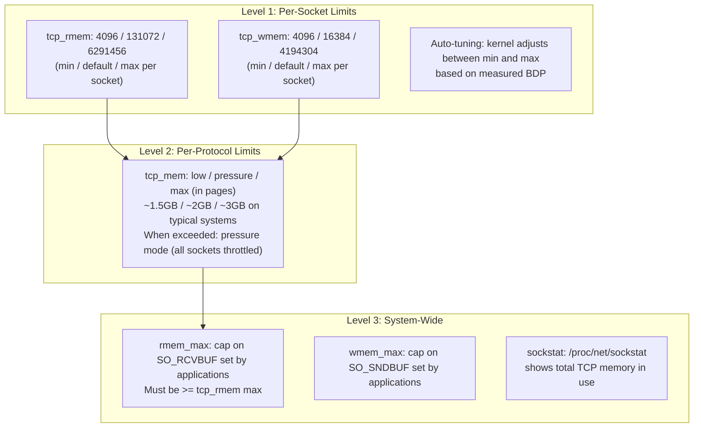
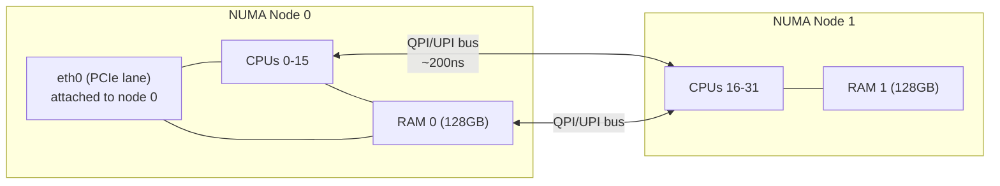
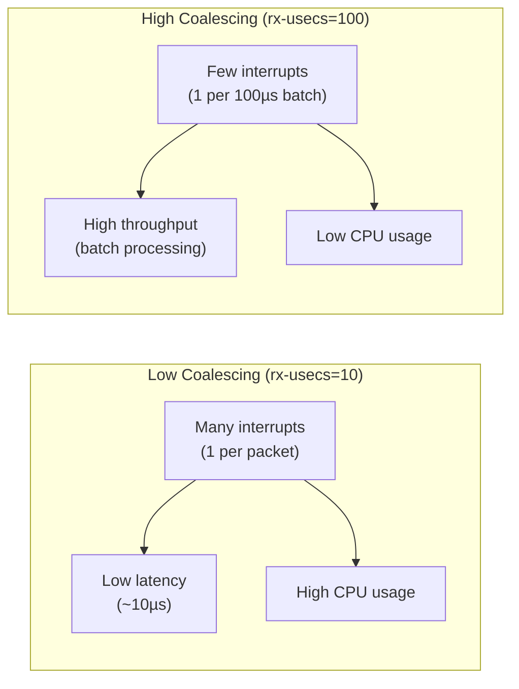

# Socket Tuning and Network Performance

## Overview

Default Linux socket parameters are tuned for a 1990s internet — 64KB buffers, 128-connection listen backlog, 28K ephemeral ports. A modern production server handling 100K connections to a CDN over 10Gbps WAN links needs fundamentally different parameters. This file covers the complete socket tuning stack: from per-socket buffers to global TCP memory limits, RSS for multi-core scaling, and how to correctly interpret benchmarking results.

---

## Socket Buffer Architecture: Three Levels



### Level 1: Per-Socket Buffer Sizing

```bash
# TCP buffer sizes: [min, default, max] in bytes
sysctl net.ipv4.tcp_rmem
# 4096    131072    6291456
# min     default   max (6MB)

sysctl net.ipv4.tcp_wmem
# 4096    16384     4194304
# min     default   max (4MB)

# For high-BDP paths (10Gbps, 50ms RTT):
# BDP = 1.25 GB/s × 0.05s = 62.5MB
# Buffer must be >= BDP for full link utilization
sysctl -w net.ipv4.tcp_rmem="4096 131072 67108864"  # 64MB max
sysctl -w net.ipv4.tcp_wmem="4096 16384 67108864"   # 64MB max

# The system-wide cap (must be >= tcp_rmem/wmem max)
sysctl -w net.core.rmem_max=67108864
sysctl -w net.core.wmem_max=67108864
```

**Auto-tuning mechanics:** `net.ipv4.tcp_moderate_rcvbuf=1` (default: on) enables auto-tuning. The kernel tracks the actual bandwidth-delay product for each connection and adjusts the socket's buffer to approximately 2× BDP. For a 1Gbps connection with 10ms RTT, BDP = 1.25MB, so the kernel grows the buffer to ~2.5MB. For a 10Mbps connection with 1ms RTT, BDP = 1.25KB — the buffer stays near the default. Auto-tuning prevents memory waste on low-bandwidth connections while allowing high-bandwidth ones to scale.

**Critical nuance: `rmem_max` vs `tcp_rmem` max**
- `tcp_rmem` max: ceiling for **auto-tuning** — the kernel won't auto-scale beyond this
- `core.rmem_max`: ceiling for **explicit `setsockopt(SO_RCVBUF)`** calls by applications
- If an application calls `setsockopt(SO_RCVBUF, 128MB)`, it's capped at `rmem_max`
- `setsockopt(SO_RCVBUF)` also **disables auto-tuning** for that socket
- Always ensure `rmem_max >= tcp_rmem max` to avoid confusing limit interactions

### Level 2: Per-Protocol (tcp_mem)

```bash
# Global TCP memory budget (values in 4KB pages)
sysctl net.ipv4.tcp_mem
# 383616   511488   767232
# low      pressure max
# Convert to bytes: × 4096
# low: 1.5GB, pressure: 2GB, max: 3GB

# When total TCP memory exceeds "pressure":
# - New socket buffers allocated at minimum size
# - Auto-tuning disabled for new connections
# - Existing connections may see window size reductions

# Monitor for pressure events
nstat -z | grep TcpExtTCPMemoryPressures
# Non-zero = you're hitting the global TCP memory limit

# Tune for 100K connections (example server with 64GB RAM)
sysctl -w net.ipv4.tcp_mem="4000000 6000000 8000000"
# low: 15GB, pressure: 23GB, max: 30GB
```

### Level 3: Socket Memory Monitoring

```bash
# Total socket memory usage
cat /proc/net/sockstat
# sockets: used 45823
# TCP: inuse 38000 orphan 50 tw 5000 alloc 40000 mem 150000
#                                                       ^^^
# mem is in pages: 150000 × 4096 = 600MB

# Per-socket buffer inspection
ss -tm    # -m shows memory info per socket
# skmem:(r<recv_buf>,rb<recv_buf_limit>,t<send_buf>,tb<send_buf_limit>,...,bl<backlog>)

# Check for receive buffer pruning (kernel dropping data from full buffers)
nstat -z | grep -E '(PruneCalled|RcvPruned|OfoPruned)'
# TcpExtPruneCalled > 0: kernel pruning receive buffers (memory pressure)
# TcpExtRcvPruned > 0: kernel dropped data from receive queue!
# TcpExtOfoPruned > 0: out-of-order queue pruned
```

---

## TCP Window Scaling

### Why Window Scaling Matters

Standard TCP window field is 16 bits: maximum 65,535 bytes. On a 10Gbps link with 50ms RTT:
- BDP = 1.25GB/s × 0.05s = 62.5MB
- Without window scaling: 65535 / 0.05 = 1.3 Mbps maximum (despite 10Gbps link!)
- With window scaling (scale factor 10, window × 1024): 65535 × 1024 / 0.05 = 1.3 Gbps

RFC 7323 window scaling is negotiated in the SYN/SYN-ACK options. The scale factor (0-14) multiplies the window field: max window = 65535 × 2^14 = ~1GB.

```bash
# Window scaling should always be enabled
sysctl net.ipv4.tcp_window_scaling  # 1 = enabled (default)

# Verify window scaling is actually negotiated on a connection
ss -ti dst <remote_ip>
# wscale:7,7  ← scale factor 7 on both sides (window multiplied by 128)
# If wscale:0,0 → window scaling NOT negotiated — a middlebox stripped it!

# Check current window on a connection
ss -ti
# rcv_space:3225600   ← 3.2MB receive window (after scaling)
# snd_wnd:32768       ← 32KB window offered by remote (small!)
```

### Diagnosing Window Scaling Issues

```bash
# A middlebox (firewall/NAT/load balancer) stripped TCP window scale option
# from the SYN packet — maximum throughput cap: 65535 / RTT

# Detection: capture SYN on both sides of middlebox
tcpdump -i eth0 'tcp[tcpflags] & tcp-syn != 0' -w /tmp/syn.pcap
# On the server side:
tshark -r /tmp/syn.pcap -Y 'tcp.flags.syn == 1' -T fields -e tcp.options.wscale

# If window scale option present on client side but absent on server side:
# the middlebox stripped it
# Fix: configure middlebox to pass TCP options unmodified
```

---

## Sysctls Reference Table

| Parameter | Default | Production Recommendation | Notes |
|-----------|---------|--------------------------|-------|
| `net.core.somaxconn` | 128-4096 | 65535 | Accept queue max per listening socket |
| `net.ipv4.tcp_max_syn_backlog` | 128-1024 | 4096-65535 | SYN queue (half-open connections) |
| `net.ipv4.ip_local_port_range` | 32768-60999 | 1024-65535 | Ephemeral ports for outbound connections |
| `net.ipv4.tcp_fin_timeout` | 60 | 15 | FIN_WAIT2 timeout; reduce to reclaim sockets faster |
| `net.ipv4.tcp_tw_reuse` | 2 (loopback only) | 1 | Reuse TIME_WAIT sockets for outbound; safe with timestamps |
| `net.ipv4.tcp_timestamps` | 1 | 1 (never disable) | Required for tw_reuse, PAWS, accurate RTT |
| `net.ipv4.tcp_syncookies` | 1 | 1 (always on) | SYN flood protection |
| `net.core.netdev_budget` | 300 | 600 | NAPI softirq packet budget |
| `net.core.netdev_max_backlog` | 1000 | 10000-50000 | Per-CPU packet queue before netdev processing |
| `net.ipv4.tcp_rmem` | 4096/131072/6291456 | 4096/131072/67108864 | Socket receive buffer: min/default/max |
| `net.ipv4.tcp_wmem` | 4096/16384/4194304 | 4096/16384/67108864 | Socket send buffer: min/default/max |
| `net.core.rmem_max` | 212992 | 67108864 | Max SO_RCVBUF value; must be >= tcp_rmem max |
| `net.core.wmem_max` | 212992 | 67108864 | Max SO_SNDBUF value; must be >= tcp_wmem max |
| `net.ipv4.tcp_keepalive_time` | 7200 | 600 | Keepalive interval; reduce to detect dead connections faster |
| `net.ipv4.tcp_moderate_rcvbuf` | 1 | 1 (never disable) | TCP auto-tuning |
| `net.netfilter.nf_conntrack_max` | 65536 | 262144-1048576 | Conntrack table size |

### Critical Interactions

```bash
# TIME_WAIT handling (common source of "cannot allocate port" errors)
# Issue: high-rate short-lived connections exhaust ephemeral ports
ss -s
# TCP: 45231 (estab 2100, closed 120, orphaned 3, timewait 42891)
# 42K TIME_WAIT sockets consuming port space!

# Fix 1: Enable tcp_tw_reuse (safe since kernel 4.12 with timestamps)
sysctl -w net.ipv4.tcp_tw_reuse=1
# Allows reuse of TIME_WAIT sockets for new outbound connections
# Safe because kernel validates timestamps are newer

# Fix 2: Widen ephemeral port range
sysctl -w net.ipv4.ip_local_port_range="1024 65535"
# Increases from ~28K to ~64K ports per destination IP

# Fix 3: Reduce tcp_fin_timeout
sysctl -w net.ipv4.tcp_fin_timeout=15
# FIN_WAIT2 state cleaned up in 15s instead of 60s

# WARNING: tcp_tw_recycle was REMOVED in kernel 4.12
# Do NOT use it — it breaks NAT environments (same source IP, different clients)
```

---

## NUMA-Aware Networking

### Why NUMA Matters for Network Performance

On multi-socket servers, each CPU socket has "local" memory (fast: ~100ns) and "remote" memory (slow: ~200ns, across QPI/UPI bus). The NIC's DMA operations write to kernel memory. If the NIC is physically attached to NUMA node 0's PCIe, but the kernel processes packets on NUMA node 1 CPUs, every sk_buff access crosses the interconnect — 10-30% throughput reduction.



```bash
# Check NIC NUMA node
cat /sys/class/net/eth0/device/numa_node
# 0  ← eth0 is on NUMA node 0

# List CPUs on NUMA node 0
numactl --hardware
# node 0 cpus: 0 1 2 3 4 5 6 7 8 9 10 11 12 13 14 15
# node 1 cpus: 16 17 18 19 20 21 22 23 24 25 26 27 28 29 30 31

# Pin NIC interrupts to NUMA-local CPUs (CPUs 0-15 for eth0 on node 0)
for irq in $(grep eth0 /proc/interrupts | awk -F: '{print $1}' | tr -d ' '); do
    echo "0-15" > /proc/irq/$irq/smp_affinity_list
done

# Verify IRQ affinity
cat /proc/irq/<irq>/smp_affinity_list

# Pin application to same NUMA node
numactl --cpunodebind=0 --membind=0 ./my_server

# Verify with numastat
numastat -p $(pgrep my_server)
# Shows per-NUMA-node memory hits and misses
```

---

## RSS and NIC Queue Tuning

### Receive Side Scaling

RSS distributes incoming packets across multiple NIC hardware queues, each mapped to a different CPU via MSI-X interrupts. This parallelizes packet processing.

```bash
# Check current and maximum queue count
ethtool -l eth0
# Channel parameters for eth0:
# Pre-set maximums:  Combined: 32
# Current hardware settings: Combined: 8

# Set queue count (typically = number of cores on NUMA node)
ethtool -L eth0 combined 16

# View RSS hash indirection table
ethtool -x eth0
# RX flow hash indirection table for eth0 with 8 RXs:
#    0:      0     1     2     3     4     5     6     7
#    8:      0     1     2     3     4     5     6     7
# Distribute evenly across all queues:
ethtool -X eth0 equal 16

# Configure which fields are hashed (default: src/dst IP + ports for TCP)
ethtool -n eth0 rx-flow-hash tcp4
# TCP over IPV4 flows use these fields for computing Hash flow key:
# IP SA
# IP DA
# L4 bytes 0 & 1 [TCP/UDP src port]
# L4 bytes 2 & 3 [TCP/UDP dst port]
```

### NIC Ring Buffer Tuning

```bash
# Increase ring buffer to absorb bursts
ethtool -G eth0 rx 4096 tx 4096

# View current settings
ethtool -g eth0
```

---

## Interrupt Coalescing

### The Latency vs Throughput Trade-off



```bash
# View current coalescing settings
ethtool -c eth0
# Coalesce parameters for eth0:
# rx-usecs: 50         ← generate interrupt after 50µs
# rx-frames: 64        ← OR after 64 frames, whichever first
# adaptive-rx: off

# For throughput (bulk data transfer):
ethtool -C eth0 rx-usecs 100 rx-frames 128

# For latency (trading, real-time, interactive):
ethtool -C eth0 rx-usecs 10 rx-frames 8

# Adaptive mode (NIC adjusts automatically):
ethtool -C eth0 adaptive-rx on adaptive-tx on

# For ultra-low latency (eliminate interrupt delay entirely):
ethtool -C eth0 rx-usecs 0 rx-frames 1
# Then use busy polling to poll NIC from application thread:
sysctl -w net.core.busy_poll=50  # poll for 50µs before blocking
sysctl -w net.core.busy_read=50
# Application must: setsockopt(fd, SOL_SOCKET, SO_BUSY_POLL, 50)
```

| Setting | Throughput | Latency | CPU |
|---------|-----------|---------|-----|
| rx-usecs=0, rx-frames=1 | Moderate | ~5µs | Very high |
| rx-usecs=10, rx-frames=8 | Good | ~15µs | High |
| adaptive-rx=on | Best for mixed | Variable | Moderate |
| rx-usecs=100, rx-frames=128 | Highest | ~120µs | Low |

---

## Benchmarking: Tools and Interpretation

### iperf3: Throughput Testing

```bash
# Server
iperf3 -s -p 5201

# Client: single stream (measures single-flow throughput)
iperf3 -c <server> -t 30

# Client: multiple streams (tests RSS distribution and aggregate throughput)
iperf3 -c <server> -t 30 -P 8

# Client: test reverse direction (server → client)
iperf3 -c <server> -t 30 -R

# Client: UDP throughput test
iperf3 -c <server> -u -b 1G -t 30

# Interpret results:
# Sender/Receiver: check BOTH — high sender, low receiver = loss
# Retr: non-zero = packet loss during test (fix: check congestion control, MTU)
# Cwnd: constantly low = buffer limited (fix: increase tcp_rmem max)
```

### netperf: Latency Testing

```bash
# Request-Response test (measures transaction latency)
netperf -t TCP_RR -H <server> -l 30 -- -r 1,1
# Output: Trans/s = transactions per second
# Latency = 1 / (Trans/s) seconds

# Stream test with statistics
netperf -t TCP_STREAM -H <server> -l 30 -- -m 1460

# Key: TCP_RR shows per-transaction latency (critical for microservices)
# TCP_STREAM shows bulk throughput (critical for data pipelines)
```

### ss: Real-Time Connection Inspection

```bash
# View all TCP connections with timing info
ss -ti

# Key fields to watch during a throughput test:
# rtt: round-trip time (should be stable)
# cwnd: congestion window (should grow to large value for bulk transfers)
# ssthresh: slow start threshold (low value = previous congestion event)
# retrans: retransmission count (non-zero = packet loss)
# rcv_space: receive buffer space offered to sender
# send: sending rate

# Example healthy 1Gbps connection:
# rtt:0.5/0.1 ato:40 mss:1448 pmtu:1500 rcvmss:1448 advmss:1448
# cwnd:850 ssthresh:648 bytes_sent:1234567 bytes_retrans:0
# rcv_space:3225600
```

---

## Real-World Production Scenario

### Scenario: iperf3 Shows 1Gbps but Application Only Achieves 100Mbps

**Alert:** Application team reports data pipeline to a remote data center achieves only 100Mbps despite a 1Gbps dedicated link. iperf3 from the same server shows 980Mbps.

**Diagnosis:**

```bash
# Step 1: Establish baseline with iperf3
iperf3 -c datacenter-server -t 30
# [SUM]  0-30 sec: 3.43 GBytes  987 Mbits/sec  (0 retransmits)
# iperf3 works fine at 987Mbps

# Step 2: Check application connection details
ss -ti dst datacenter-server
# rtt:50.0/0.5 ato:40 mss:1448 pmtu:1500 rcvmss:1448
# cwnd:45 ssthresh:32 bytes_sent:45678901 bytes_retrans:0
# rcv_space:87380   ← FOUND: receive window is only 87KB!

# Step 3: Calculate what this means
# max_throughput = rcv_space / RTT = 87380 bytes / 0.050s = 1.75MB/s = 14 Mbps
# But they're seeing 100Mbps — something is partially working but still limited

# Step 4: Check if the application is setting SO_RCVBUF explicitly
# This disables auto-tuning and caps at the specified value
strace -e trace=setsockopt -p $APP_PID 2>&1 | grep -i rcvbuf
# setsockopt(fd, SOL_SOCKET, SO_RCVBUF, [131072], 4)
# ← Application is setting 128KB receive buffer explicitly!
# This DISABLES auto-tuning and caps the buffer at 128KB

# Step 5: Check rmem_max (application's setsockopt is capped by this)
sysctl net.core.rmem_max
# 212992   ← 212KB maximum for SO_RCVBUF (application can't set higher)

# Step 6: Root cause
# Application hard-codes SO_RCVBUF=128KB
# rmem_max=212KB limits any explicit setsockopt attempt
# Auto-tuning is disabled for this socket
# BDP = 1.25MB/s × 0.050 = 62.5MB needed, but only 128KB available
# Max throughput: 128KB / 0.050 = 2.56MB/s... but seeing 100Mbps

# Re-examine: the application has SO_RCVBUF on the SEND side
ss -ti dst datacenter-server
# snd_wnd:8388608  ← send window is 8MB (fine)
# rcv_space:87380  ← but receive window is 87KB (85KB, kernel's auto value)

# The remote server has the small receive window!
ssh datacenter-server "sysctl net.ipv4.tcp_rmem"
# 4096   87380   174760   ← MAX IS ONLY 170KB!

# Step 7: Fix on remote server
ssh datacenter-server "sysctl -w net.ipv4.tcp_rmem='4096 131072 67108864'"
ssh datacenter-server "sysctl -w net.core.rmem_max=67108864"

# Step 8: Verify (no app restart needed — auto-tuning kicks in for new connections)
# Existing connections won't benefit; need reconnect
# After reconnect:
ss -ti dst datacenter-server
# rcv_space:3225600   ← 3.2MB receive window (auto-tuned to ~BDP)
# Application throughput: now 820Mbps
```

---

## Failure Modes

| Failure | Symptoms | Detection | Fix |
|---------|----------|-----------|-----|
| tcp_rmem max too small | Throughput capped below link capacity | `ss -ti` shows small `rcv_space`; throughput = rcv_space / RTT | Increase `tcp_rmem` max and `rmem_max` |
| Application sets SO_RCVBUF (disables auto-tuning) | Performance floor regardless of sysctl changes | `ss -ti` shows fixed buffer that doesn't grow | Fix application code; or increase `rmem_max` so SO_RCVBUF can be set larger |
| window scaling stripped by middlebox | Max throughput = 65535 / RTT bytes/s | `ss -ti` shows `wscale:0,0` | Fix/bypass middlebox; check firewall TCP option handling |
| somaxconn too low | New connections silently dropped under load | `nstat \| grep ListenOverflows` non-zero | Increase `somaxconn` and application `listen()` backlog |
| Port exhaustion (TIME_WAIT) | `connect: Cannot assign requested address` | `ss -s` shows many timewait; `ip_local_port_range` exhausted | Increase port range; enable `tcp_tw_reuse=1` |
| NUMA misalignment | 10-30% throughput reduction; high cross-NUMA memory accesses | `numastat -p $(pgrep app)` shows high remote hits | Pin NIC IRQs to NUMA-local CPUs |
| Interrupt coalescing too high for latency | High throughput but high p99 latency | `ethtool -c` shows high rx-usecs; p99 >> p50 | Reduce coalescing: `ethtool -C eth0 rx-usecs 10` |

---

## Security Considerations

| Vector | Description | Mitigation |
|--------|-------------|------------|
| TCP_ABORT_ON_OVERFLOW | Setting `net.ipv4.tcp_abort_on_overflow=1` sends RST on accept queue overflow instead of silently dropping — reveals server is listening | Leave at 0 (default); fix the actual overflow with `somaxconn` |
| Port exhaustion DoS | An attacker making many short-lived connections to the same destination can exhaust local ports | Rate-limit new connections per source IP; increase port range |
| SO_RCVBUF amplification | An application that reads data slowly fills the receive buffer, causing the sender to keep the connection open indefinitely (memory holding) | Implement read timeouts; close idle connections |
| tcp_tw_recycle | Removed in kernel 4.12 but documentation still references it; enabling it in old kernels breaks NAT clients | Never configure `tcp_tw_recycle` even if present |
| Large tcp_rmem max | Very large buffers (128MB) allow a single malicious connection to consume excessive kernel memory | Set reasonable maxima (64-128MB); rely on tcp_mem pressure to throttle extreme usage |

---

## Interview Questions

### Basic

**Q: What is the BDP and why does it matter for TCP buffer sizing?**
A: BDP (Bandwidth-Delay Product) = bandwidth (bytes/sec) × RTT (seconds). It represents the amount of data "in flight" on a network path when the pipe is full. For a TCP connection to fully utilize the link, the receive window must be at least BDP. Example: 10Gbps link, 50ms RTT — BDP = 1.25GB/s × 0.05s = 62.5MB. If `tcp_rmem` max is 6MB, the connection can never advertise a window larger than 6MB, capping throughput at 6MB/0.05s = 120MB/s = 960Mbps — far below 10Gbps. Fix: set `tcp_rmem` max to at least 2× BDP, and `rmem_max` to the same value.

**Q: What is the difference between `net.core.somaxconn` and `net.ipv4.tcp_max_syn_backlog`?**
A: There are two separate queues for a listening TCP socket. `tcp_max_syn_backlog` controls the SYN queue — connections that have received a SYN but haven't completed the three-way handshake (half-open connections). `somaxconn` controls the accept queue — connections that have completed the handshake but haven't been returned by `accept()` to the application. When the accept queue overflows, the kernel silently drops new SYN packets (clients will retry). Detection: `nstat | grep ListenOverflows`. The actual accept queue size is `min(application_backlog, somaxconn)` — both must be increased for high-connection-rate servers.

### Intermediate

**Q: An application explicitly calls `setsockopt(SO_RCVBUF, 128*1024)`. What are the consequences?**
A: Three consequences: (1) The socket's receive buffer is set to 128KB (the kernel doubles the value internally for metadata overhead, so the effective value is ~256KB); (2) TCP **auto-tuning is disabled** for this socket — the kernel will not grow the buffer based on measured BDP; (3) The value is capped at `net.core.rmem_max` — if `rmem_max` is 212KB and the app requests 256KB, it gets 212KB. This is the most common source of "I set tcp_rmem to 64MB but my application is still slow" problems. The fix: either remove the explicit `setsockopt` (let auto-tuning work) or increase `rmem_max` to allow the application to set a larger value.

**Q: Your server processes 500K new connections per second and experiences frequent `EADDRINUSE` errors. Diagnose and fix.**
A: `EADDRINUSE` on outbound connections means ephemeral port exhaustion. Each outbound TCP connection requires a unique `(src_ip, src_port, dst_ip, dst_port)` tuple. With the default port range (32768-60999 = 28,231 ports) and a single destination IP/port, you can only have 28K outbound connections at once. At 500K new/sec with TIME_WAIT lasting 60 seconds, you need 500K × 60 = 30M ports — impossible. Solutions: (1) Widen port range: `sysctl -w net.ipv4.ip_local_port_range="1024 65535"` (gains ~37K ports); (2) Enable `tcp_tw_reuse=1` (allows reuse of TIME_WAIT sockets for new outbound connections); (3) Add multiple source IPs — each source IP gets its own ~64K ports; (4) Use connection pooling in the application to amortize the port cost; (5) Reduce `tcp_fin_timeout` and `tcp_tw_timeout` to reclaim sockets faster.

### Advanced / Staff Level

**Q: A service achieves 15 Gbps with iperf3 -P 8 but only 3 Gbps with iperf3 -P 1. Explain why and what you would tune.**
A: Single-flow performance is limited by single-CPU processing. With `-P 1`, a single TCP flow is hashed by RSS to one NIC queue and processed by one CPU. The bottleneck is how fast a single CPU can run the TCP stack — typically limited by: interrupt coalescing, per-packet processing in softirq, and the single CPU's cache bandwidth. With `-P 8` and 8 separate flows, RSS hashes them to 8 different queues on 8 different CPUs — parallelizing the entire stack. To improve single-flow performance: (1) Enable TSO/GSO — the NIC handles segmentation, dramatically reducing per-packet CPU overhead; (2) Increase NAPI budget per device; (3) Use hardware segmentation offload confirmation: `ethtool -k eth0 | grep segmentation`; (4) Enable GRO for the receiving side; (5) Consider Receive Flow Steering (RFS) to ensure the application and its network processing run on the same CPU (cache locality); (6) For the absolute maximum single-flow throughput, enable hardware multi-queue and RPS, and pin the application thread to the same CPU as the NIC's queue that processes its flow.

**Q: Explain TCP auto-tuning in detail: what triggers it, what does it adjust, and what are its failure modes?**
A: TCP auto-tuning (controlled by `net.ipv4.tcp_moderate_rcvbuf=1`) adjusts each socket's receive buffer dynamically based on the measured bandwidth-delay product. Mechanism: the kernel tracks the actual throughput of each connection in `tcp_rcv_nxt` and measures RTT from ACK timestamps. Every ~200ms, if the current buffer is too small (buffer < 2 × BDP), the kernel doubles the buffer, up to `tcp_rmem` max. Failure modes: (1) Application called `setsockopt(SO_RCVBUF)` — disables auto-tuning for that socket; (2) `tcp_rmem` max set too low — auto-tuning can't scale up enough; (3) Short-lived connections — auto-tuning doesn't have time to ramp up before the transfer ends; large files transferred in <5 RTTs may underperform. (4) `tcp_mem` pressure — when global TCP memory is high, auto-tuning is suspended and all new sockets get minimum buffers; monitor `TcpExtTCPMemoryPressures` in `/proc/net/netstat`. (5) `rmem_max` < `tcp_rmem` max — auto-tuning works internally but if the application tries to read with a buffer check, it may see a mismatch. Monitoring: `nstat -z | grep TcpExtTCPRcvCoalesce` and `ss -ti` showing `rcv_space` growing for a new connection are signs of healthy auto-tuning.
