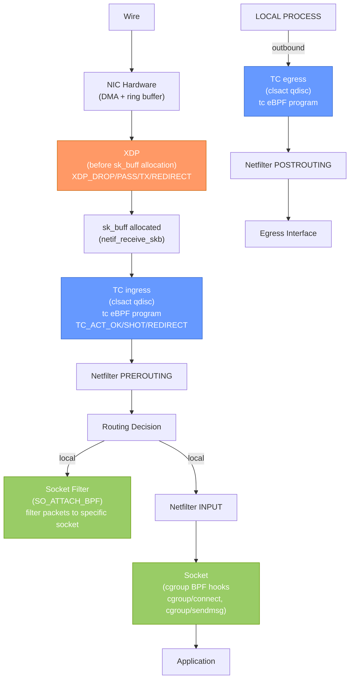
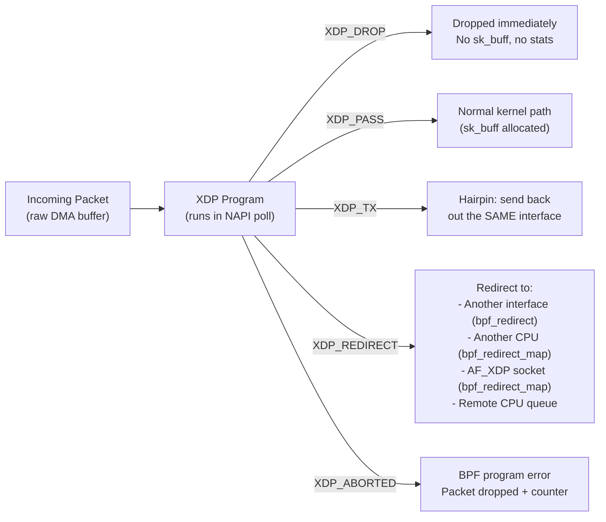
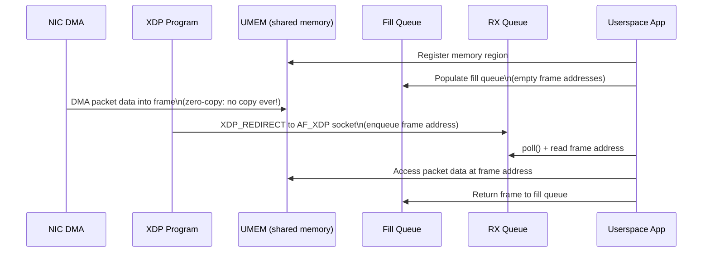
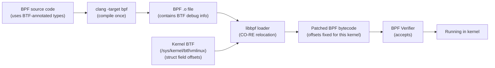
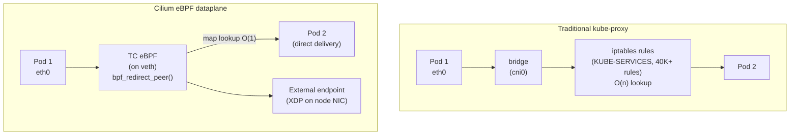

# eBPF and XDP: Programmable Kernel Networking

## Table of Contents

- [Overview](#overview)
- [BPF Program Types for Networking](#bpf-program-types-for-networking)
  - [BPF Program Types Reference](#bpf-program-types-reference)
- [BPF Maps: Sharing State Between Programs and Userspace](#bpf-maps-sharing-state-between-programs-and-userspace)
  - [Map Types](#map-types)
- [BPF Verifier: The Safety Gate](#bpf-verifier-the-safety-gate)
  - [Common Verifier Rejection Reasons](#common-verifier-rejection-reasons)
- [XDP: eXpress Data Path](#xdp-express-data-path)
  - [XDP Return Codes](#xdp-return-codes)
  - [XDP Modes](#xdp-modes)
  - [Production XDP: DDoS Mitigation Pattern](#production-xdp-ddos-mitigation-pattern)
- [TC eBPF: clsact Qdisc](#tc-ebpf-clsact-qdisc)
  - [TC eBPF Return Codes](#tc-ebpf-return-codes)
  - [Cilium's Use of TC eBPF](#ciliums-use-of-tc-ebpf)
- [AF_XDP: Zero-Copy Userspace Processing](#af_xdp-zero-copy-userspace-processing)
  - [Architecture](#architecture)
  - [Four Ring Buffers](#four-ring-buffers)
  - [Zero-Copy vs Copy Mode](#zero-copy-vs-copy-mode)
- [bpftrace: One-Liners for Network Debugging](#bpftrace-one-liners-for-network-debugging)
- [CO-RE: Compile Once, Run Everywhere](#co-re-compile-once-run-everywhere)
- [Cilium: eBPF-Native Kubernetes Networking](#cilium-ebpf-native-kubernetes-networking)
  - [Key Cilium eBPF Programs](#key-cilium-ebpf-programs)
- [Real-World Production Scenario](#real-world-production-scenario)
  - [Scenario: XDP Program Dropping Legitimate Traffic](#scenario-xdp-program-dropping-legitimate-traffic)
- [Failure Modes](#failure-modes)
- [Security Considerations](#security-considerations)
- [Interview Questions](#interview-questions)
  - [Basic](#basic)
  - [Intermediate](#intermediate)
  - [Advanced / Staff Level](#advanced-staff-level)

---

## Overview

eBPF has fundamentally changed Linux networking. Cilium replaces iptables and kube-proxy entirely with eBPF. Cloudflare uses XDP to drop DDoS traffic at 100Gbps. Facebook uses AF_XDP for high-speed packet processing. A Senior SRE who has only used iptables is already behind the curve. This file covers the complete eBPF networking stack: program types, maps, the verifier, XDP for in-kernel packet processing, AF_XDP for near-zero-copy userspace processing, and bpftrace for observability.

---

## BPF Program Types for Networking



### BPF Program Types Reference

| Program Type | Attach Point | Context | Primary Use |
|-------------|-------------|---------|------------|
| `XDP` | NIC driver hook (before sk_buff) | `xdp_md` (raw DMA buffer) | DDoS mitigation, load balancing at wire speed |
| `BPF_PROG_TYPE_SCHED_CLS` | TC clsact qdisc (ingress/egress) | `__sk_buff` (full sk_buff) | Packet mangling, redirection, bandwidth shaping |
| `BPF_PROG_TYPE_SOCKET_FILTER` | Raw socket / `SO_ATTACH_BPF` | `__sk_buff` | Per-socket filtering (tcpdump uses classic BPF) |
| `BPF_PROG_TYPE_SK_SKB` | sockmap (stream parsers) | `__sk_buff` | L7 proxy/load balancing via sockmap |
| `BPF_PROG_TYPE_CGROUP_SKB` | cgroup v2 net_cls | `__sk_buff` | Per-cgroup traffic control |
| `BPF_PROG_TYPE_CGROUP_SOCK_ADDR` | `cgroup/connect4`, `cgroup/bind4` | `bpf_sock_addr` | Transparently redirect connections (service mesh) |
| `BPF_PROG_TYPE_KPROBE` | Any kernel function | `pt_regs` | Observability, tracing |
| `BPF_PROG_TYPE_TRACEPOINT` | Kernel tracepoints | tracepoint context | Stable observability API |

---

## BPF Maps: Sharing State Between Programs and Userspace

BPF maps are kernel-side data structures accessible from both BPF programs and userspace (via the `bpf()` syscall). They enable: stateful packet processing (connection tracking), coordination between multiple BPF programs, and real-time monitoring without perf buffers.

### Map Types

| Map Type | Kernel Type | Complexity | Use Case |
|----------|------------|------------|---------|
| `BPF_MAP_TYPE_HASH` | Hash table | O(1) avg | IP blocklists, connection tables |
| `BPF_MAP_TYPE_ARRAY` | Fixed-size array | O(1) | Per-CPU counters, configuration |
| `BPF_MAP_TYPE_LRU_HASH` | Hash + LRU eviction | O(1) | Connection tracking (auto-evicts stale) |
| `BPF_MAP_TYPE_PERCPU_HASH` | Per-CPU hash | O(1) | High-speed counters (no lock) |
| `BPF_MAP_TYPE_RINGBUF` | Lock-free ring buffer | O(1) enqueue | Streaming events to userspace |
| `BPF_MAP_TYPE_DEVMAP` | Device redirections | O(1) | XDP_REDIRECT to devices |
| `BPF_MAP_TYPE_SOCKMAP` | Socket references | O(1) | SK_SKB stream programs |
| `BPF_MAP_TYPE_LPM_TRIE` | Longest-prefix-match trie | O(W) | IP subnet matching in XDP |

```c
// Example: BPF map definition (CO-RE with BTF)
struct {
    __uint(type, BPF_MAP_TYPE_LRU_HASH);
    __uint(max_entries, 1024 * 1024);  // 1M entries
    __type(key, struct connection_key);  // 5-tuple
    __type(value, struct connection_stats);
} conn_stats SEC(".maps");

// Access from BPF program
struct connection_stats *stats = bpf_map_lookup_elem(&conn_stats, &key);
if (stats) {
    __sync_fetch_and_add(&stats->bytes, skb->len);
}

// Access from userspace
int fd = bpf_obj_get("/sys/fs/bpf/conn_stats");
bpf_map_lookup_elem(fd, &key, &value);
```

---

## BPF Verifier: The Safety Gate

Every BPF program must pass the verifier before it can run in kernel space. The verifier performs static analysis to guarantee:

1. **No unbounded loops** (in older kernels): BPF programs must terminate. Kernel 5.3+ allows bounded loops (with a provably finite iteration count)
2. **Memory safety**: all pointer dereferences must be verified with explicit bounds checks. If you access `data[offset]`, the verifier checks `data + offset < data_end`
3. **Register state tracking**: verifier tracks the type and range of every register at every instruction
4. **No uninitialized reads**: all memory must be initialized before reading
5. **Valid helper calls**: only approved `bpf_*` helper functions are callable

```c
// This XDP program will be REJECTED by verifier (missing bounds check)
SEC("xdp")
int bad_program(struct xdp_md *ctx) {
    struct ethhdr *eth = (void *)(long)ctx->data;
    // REJECTED: no check that eth + sizeof(ethhdr) <= ctx->data_end
    if (eth->h_proto == htons(ETH_P_IP)) {
        return XDP_DROP;
    }
    return XDP_PASS;
}

// Corrected version (accepted by verifier)
SEC("xdp")
int good_program(struct xdp_md *ctx) {
    void *data = (void *)(long)ctx->data;
    void *data_end = (void *)(long)ctx->data_end;
    struct ethhdr *eth = data;

    // Explicit bounds check: verifier now knows eth access is safe
    if ((void *)(eth + 1) > data_end)
        return XDP_PASS;

    if (eth->h_proto == htons(ETH_P_IP))
        return XDP_DROP;

    return XDP_PASS;
}
```

### Common Verifier Rejection Reasons

```bash
# View verifier output (includes full state trace)
bpftool prog load my_xdp.o /sys/fs/bpf/my_xdp type xdp 2>&1
# libbpf: prog 'my_xdp': BPF program load failed: Permission denied
# ...
# 0: (79) r1 = *(u64 *)(r1 +0)
# R1 type=ctx expected=fp
# pointer arithmetic on pkt_ptr only allowed on packets

# Common rejections:
# "unbounded memory access"       → missing bounds check on packet data
# "invalid indirect read from stack" → reading uninitialized stack memory
# "pointer arithmetic on pkt_ptr" → complex pointer arithmetic rejected
# "unreachable insn" → dead code path (clean it up)
# "back-edge from insn X to Y"   → backward jump = potential infinite loop (old kernels)
```

---

## XDP: eXpress Data Path

XDP is the earliest kernel hook point for packet processing — it runs inside the NIC driver's NAPI poll function, **before** sk_buff allocation. This means XDP can drop or redirect packets without ever creating a kernel socket buffer, dramatically reducing per-packet overhead.

### XDP Return Codes



### XDP Modes

| Mode | How | Performance | Requirement |
|------|-----|-------------|-------------|
| `native` | In NIC driver, before sk_buff | Highest (~60-80 Mpps) | NIC driver support |
| `generic` | After sk_buff allocation (fallback) | Lower (~5-10 Mpps) | Any NIC |
| `offloaded` | In NIC firmware (SmartNIC) | Extreme (line rate) | SmartNIC (Netronome, etc.) |

```bash
# Attach XDP program to interface
ip link set eth0 xdp obj my_xdp.o sec xdp

# Check XDP mode
ip link show eth0
# 2: eth0: <BROADCAST,MULTICAST,UP,LOWER_UP> mtu 1500 xdp qdisc fq ...
#     link/ether aa:bb:cc:dd:ee:ff brd ff:ff:ff:ff:ff:ff
#     prog/xdp id 42 tag aabbccddeeff name my_prog

# Force native mode (fails if driver doesn't support)
ip link set eth0 xdp obj my_xdp.o sec xdp mode native

# Force generic mode (universal but slow)
ip link set eth0 xdp obj my_xdp.o sec xdp mode skbmode

# Detach
ip link set eth0 xdp off

# Inspect loaded program
bpftool prog show id 42
bpftool prog dump xlated id 42  # show BPF bytecode
bpftool prog dump jited id 42   # show JIT-compiled x86 code
```

### Production XDP: DDoS Mitigation Pattern

```c
// Simplified XDP DDoS mitigation: block IPs in a blocklist map
struct {
    __uint(type, BPF_MAP_TYPE_LPM_TRIE);
    __uint(max_entries, 1000000);
    __uint(map_flags, BPF_F_NO_PREALLOC);
    __type(key, struct bpf_lpm_trie_key_ipv4);  // {prefixlen, data[4]}
    __type(value, __u64);  // drop counter
} blocklist SEC(".maps");

SEC("xdp")
int xdp_ddos_filter(struct xdp_md *ctx) {
    void *data = (void *)(long)ctx->data;
    void *data_end = (void *)(long)ctx->data_end;
    struct ethhdr *eth = data;
    struct iphdr *ip;

    if ((void *)(eth + 1) > data_end) return XDP_PASS;
    if (eth->h_proto != htons(ETH_P_IP)) return XDP_PASS;

    ip = (void *)(eth + 1);
    if ((void *)(ip + 1) > data_end) return XDP_PASS;

    // LPM lookup: check if source IP is in blocklist
    struct bpf_lpm_trie_key_ipv4 key = {
        .prefixlen = 32,
        .data = ip->saddr,
    };
    __u64 *counter = bpf_map_lookup_elem(&blocklist, &key);
    if (counter) {
        __sync_fetch_and_add(counter, 1);
        return XDP_DROP;
    }
    return XDP_PASS;
}
```

---

## TC eBPF: clsact Qdisc

TC (Traffic Control) eBPF programs attach to the `clsact` qdisc, which provides ingress and egress hooks. Unlike XDP, TC programs see the full `sk_buff`, allowing access to socket information, conntrack state, and metadata fields.

```bash
# Attach TC eBPF program (ingress)
tc qdisc add dev eth0 clsact
tc filter add dev eth0 ingress bpf da obj my_tc.o sec tc_ingress

# Attach TC eBPF program (egress)
tc filter add dev eth0 egress bpf da obj my_tc.o sec tc_egress

# View TC filters
tc filter show dev eth0 ingress
tc filter show dev eth0 egress

# View with full info
tc -s filter show dev eth0 ingress

# Delete TC program
tc filter del dev eth0 ingress
tc qdisc del dev eth0 clsact
```

### TC eBPF Return Codes

| Code | Meaning |
|------|---------|
| `TC_ACT_OK` (0) | Continue processing |
| `TC_ACT_SHOT` (2) | Drop the packet |
| `TC_ACT_REDIRECT` (7) | Redirect to another interface/socket |
| `TC_ACT_UNSPEC` (-1) | Use default action (ok for classifiers) |

### Cilium's Use of TC eBPF

Cilium attaches TC programs to each pod's veth interface for both ingress and egress. Instead of traversing the Linux bridge and iptables chains, Cilium's TC program:
1. Checks the destination pod's identity (via BPF map lookup)
2. Verifies NetworkPolicy allows the connection (BPF policy map)
3. Uses `bpf_redirect_peer()` to send the packet directly to the destination veth's peer

This bypasses bridge, iptables, conntrack, and kube-proxy entirely for pod-to-pod traffic.

---

## AF_XDP: Zero-Copy Userspace Processing

AF_XDP provides a socket type that receives packets redirected from an XDP program, with optional zero-copy from the NIC's DMA buffer to userspace memory.

### Architecture



### Four Ring Buffers

| Ring | Direction | Content |
|------|-----------|---------|
| **Fill Queue (FQ)** | App → Kernel | Empty frame addresses for NIC to use |
| **Completion Queue (CQ)** | Kernel → App | Transmitted frame addresses (reuse) |
| **RX Ring** | Kernel → App | Received frame descriptors (address + length) |
| **TX Ring** | App → Kernel | Frame descriptors to transmit |

```c
// Minimal AF_XDP socket setup (simplified)
#include <linux/if_xdp.h>
#include <sys/socket.h>

// Step 1: Allocate UMEM (shared memory)
void *umem_area = mmap(NULL, UMEM_SIZE, PROT_READ|PROT_WRITE,
                       MAP_PRIVATE|MAP_ANONYMOUS|MAP_HUGETLB, -1, 0);

// Step 2: Create AF_XDP socket
int xsk_fd = socket(AF_XDP, SOCK_RAW, 0);

// Step 3: Register UMEM with kernel
struct xdp_umem_reg umem_reg = {
    .addr = (uint64_t)umem_area,
    .len = UMEM_SIZE,
    .chunk_size = FRAME_SIZE,  // 2048 or 4096
    .headroom = 0,
};
setsockopt(xsk_fd, SOL_XDP, XDP_UMEM_REG, &umem_reg, sizeof(umem_reg));

// Step 4: Create fill and completion queues
// Step 5: Create RX and TX rings
// Step 6: Bind to interface queue
struct sockaddr_xdp sxdp = {
    .sxdp_family = AF_XDP,
    .sxdp_ifindex = ifindex,
    .sxdp_queue_id = 0,
    .sxdp_flags = XDP_ZEROCOPY,  // request zero-copy
};
bind(xsk_fd, (struct sockaddr *)&sxdp, sizeof(sxdp));
```

### Zero-Copy vs Copy Mode

| Mode | NIC Driver | Performance | Memory Model |
|------|-----------|-------------|-------------|
| Zero-copy | Intel ixgbe/ice, Mellanox mlx5 | 20-30 Mpps | NIC DMA → UMEM directly |
| Copy mode | Any NIC (fallback) | 5-10 Mpps | NIC DMA → kernel → memcpy → UMEM |

```bash
# Check if NIC supports AF_XDP zero-copy
ethtool -i eth0 | grep driver
# driver: ixgbe  → zero-copy supported

# Load the XDP redirect program (required before AF_XDP works)
ip link set eth0 xdp obj xdp_redirect.o sec xdp
```

**Cloudflare production use:** Cloudflare uses AF_XDP in their DDoS mitigation pipeline. When an XDP program identifies a DoS attack pattern, it redirects suspicious traffic to an AF_XDP socket. A userspace process reads the traffic, performs deep inspection (checking DNS amplification, HTTP flood patterns), and drops or rate-limits based on the analysis. Normal traffic continues through `XDP_PASS` to the kernel stack. This allows packet-level inspection at 20+ Mpps without blocking normal traffic.

---

## bpftrace: One-Liners for Network Debugging

bpftrace provides a high-level language for dynamic kernel tracing using eBPF, inspired by DTrace.

```bash
# Install bpftrace
apt-get install bpftrace   # or via package manager

# Trace all new TCP connections (src, dst, port)
bpftrace -e '
kprobe:tcp_v4_connect {
    printf("TCP connect: %s → %s:%d\n",
        comm,
        ntop(AF_INET, args->uaddr->sa_data[2]),
        ((args->uaddr->sa_data[0] & 0xFF) << 8) | (args->uaddr->sa_data[1] & 0xFF)
    );
}'

# Trace TCP retransmits (detect packet loss)
bpftrace -e '
kprobe:tcp_retransmit_skb {
    $sk = (struct sock *)arg0;
    printf("RETRANSMIT: %s:%d → %d\n",
        ntop(2, $sk->__sk_common.skc_rcv_saddr),
        $sk->__sk_common.skc_num,
        $sk->__sk_common.skc_dport >> 8 | $sk->__sk_common.skc_dport << 8
    );
}'

# Count packets dropped by kfree_skb (shows drop location)
bpftrace -e '
kprobe:kfree_skb {
    @drops[kstack(5)] = count();
}
END { print(@drops); }'

# Trace accept() backlog overflows
bpftrace -e '
kprobe:tcp_v4_syn_recv_sock / retval == 0 / {
    @listen_drops = count();
}'

# Monitor socket receive buffer fullness
bpftrace -e '
tracepoint:net:net_dev_queue {
    printf("%s: %d bytes\n", args->name, args->len);
}'

# Trace conntrack table full events
bpftrace -e '
kprobe:nf_conntrack_alloc / retval == 0 / {
    @conntrack_drops = count();
}'

# Track per-process network send/recv bytes
bpftrace -e '
kprobe:tcp_sendmsg { @send[comm] = sum(arg2); }
kprobe:tcp_recvmsg { @recv[comm] = sum(arg2); }
END { print(@send); print(@recv); }'
```

---

## CO-RE: Compile Once, Run Everywhere

Before CO-RE, eBPF programs that accessed kernel structs by field offset would break when the kernel version changed (offsets shift between versions). CO-RE solves this.



**BTF (BPF Type Format):** The kernel exposes its own type information at `/sys/kernel/btf/vmlinux`. libbpf uses this to relocate field accesses in the compiled BPF program to match the exact field offsets for the running kernel. A BPF program compiled on kernel 5.15 will have its struct offsets automatically adjusted to run on kernel 6.1.

```bash
# Check if kernel has BTF support
ls /sys/kernel/btf/vmlinux
# /sys/kernel/btf/vmlinux  ← exists = CO-RE capable

# Generate vmlinux.h for development (all kernel types)
bpftool btf dump file /sys/kernel/btf/vmlinux format c > vmlinux.h
# Use this header instead of kernel source headers in BPF programs
```

---

## Cilium: eBPF-Native Kubernetes Networking

Cilium replaces kube-proxy and the iptables data plane entirely with eBPF. Understanding Cilium's architecture is increasingly a requirement for Kubernetes-focused SRE roles.



### Key Cilium eBPF Programs

| Program | Attach Point | Function |
|---------|-------------|----------|
| `bpf_lxc.c` | TC ingress on pod veth | Enforce NetworkPolicy, service routing |
| `bpf_host.c` | TC on host namespace | Node-level routing, NodePort handling |
| `bpf_xdp.c` | XDP on node NIC | Early drop for DDoS, NodePort acceleration |
| `bpf_sock.c` | cgroup/connect | Socket-level load balancing (bypass iptables entirely) |

```bash
# Inspect Cilium eBPF programs
cilium bpf policy list
cilium bpf lb list          # service load balancing map
cilium bpf ct list global   # connection tracking map (replaces conntrack)
cilium bpf endpoint list    # endpoint identity map

# Monitor policy enforcement
cilium monitor --type drop  # show packets dropped by NetworkPolicy

# Check eBPF program status
bpftool prog list | grep cilium
bpftool map list | grep cilium
```

---

## Real-World Production Scenario

### Scenario: XDP Program Dropping Legitimate Traffic

**Alert:** After deploying an XDP-based DDoS filter, legitimate users report connection failures. The XDP program is supposed to only drop packets matching attack signatures.

**Diagnosis:**

```bash
# Step 1: Confirm XDP is loaded and dropping traffic
bpftool prog show
# 42: xdp  name ddos_filter  tag aabbccdd  gpl
#     loaded_at 2026-03-27T10:00:00  uid 0
#     xlated 1234B  jited 2345B  memlock 4096B  map_ids 7

ip link show eth0 | grep xdp
# prog/xdp id 42 tag aabbccdd name ddos_filter

# Step 2: Check XDP drop counters via program map
bpftool map show id 7
# 7: hash  name drop_counters  flags 0x0
#    key 4B  value 8B  max_entries 1000000  memlock 134217728B

# Dump the blocklist map to see what IPs are being blocked
bpftool map dump id 7 | head -50
# key: 8b d5 31 28 (= 139.213.49.40 = legitimate user's IP!)
# value: 00 00 00 00 00 00 27 10 (= 10000 drops)

# Step 3: The blocklist was incorrectly populated
# Check how the blocklist is managed
# The DDoS filter uses a BGP blackholing feed — check if the feed is accurate

# Step 4: Trace which packets are being dropped with bpftrace
bpftrace -e '
kprobe:xdp_do_redirect / retval != 0 / {
    printf("XDP drop: %s\n", comm);
}' &

# Better: add tracing to the XDP program itself with bpf_trace_printk
# (requires recompile, but shows exact match reason)

# Step 5: Read XDP program's internal state
bpftool prog dump xlated id 42  # show BPF bytecode instructions

# Step 6: Inspect the LPM trie blocklist for the affected IP
python3 - << 'EOF'
import struct, subprocess, json

# Query the blocklist map for 139.213.49.40
key_bytes = struct.pack("IH4B", 32, 0, 139, 213, 49, 40)  # prefixlen=32, IP
result = subprocess.run(
    ["bpftool", "map", "lookup", "id", "7", "key", "hex"] +
    [f"{b:02x}" for b in key_bytes],
    capture_output=True, text=True
)
print(result.stdout)
EOF

# Step 7: Remove false positive from blocklist
bpftool map delete id 7 key hex $(python3 -c "
import struct
k = struct.pack('IH4B', 32, 0, 139, 213, 49, 40)
print(' '.join(f'{b:02x}' for b in k))")

# Step 8: Verify the IP is no longer blocked
ip route get 139.213.49.40  # from local machine

# Step 9: Add monitoring to prevent future false positives
# Create a whitelist map that XDP checks BEFORE the blocklist
# Any IP in the whitelist gets XDP_PASS regardless of blocklist

# Step 10: Audit the blocklist feed source
# If using a BGP blackholing feed, verify it properly excludes RFC 1918 and
# your own legitimate IP ranges before importing to the XDP map
```

---

## Failure Modes

| Failure | Symptoms | Detection | Fix |
|---------|----------|-----------|-----|
| XDP drops legitimate traffic | Users report connection failures; standard firewall logs show nothing | `bpftool map dump` on blocklist map | Remove false positive: `bpftool map delete` |
| BPF verifier rejection | Program fails to load; no drop, just can't attach | `bpftool prog load` returns error with verifier log | Fix: add missing bounds checks, remove unbounded loops |
| XDP in generic mode (fallback) | XDP active but performance much lower than expected | `ip link show` — check `xdp` tag (native vs generic) | Load driver that supports native XDP, or use XDP generic knowingly |
| CO-RE failure on kernel without BTF | Program fails to load on old kernel | `ls /sys/kernel/btf/vmlinux` missing | Compile with explicit offsets (pre-CO-RE style), or upgrade kernel |
| bpf_map full (no space for new entries) | BPF program returns XDP_ABORTED or drops new entries | Check map statistics in `bpftool map show` | Increase `max_entries`; implement eviction policy (use LRU maps) |
| TC eBPF clsact qdisc conflict | Multiple tools try to attach to same hook (Cilium + manual tc) | `tc filter show dev eth0 ingress` shows unexpected programs | Coordinate with CNI; don't manually add tc rules on Cilium-managed interfaces |

---

## Security Considerations

| Vector | Description | Mitigation |
|--------|-------------|------------|
| Unprivileged BPF (CVE surface) | Unprivileged users loading BPF programs can exploit verifier bugs | Set `kernel.unprivileged_bpf_disabled=1`; require CAP_BPF |
| XDP_DROP without logging | XDP drops are invisible to standard tools (no conntrack, no firewall log) | Instrument XDP programs with ring buffer events to userspace; use bpftrace for visibility |
| BPF map information disclosure | Loaded maps are visible to root; may contain sensitive data (IPs, connection state) | Pin maps to `/sys/fs/bpf/` with appropriate permissions; use `BPF_F_NO_PREALLOC` for sensitive maps |
| Backdoor via BPF kprobe | Attacker with root can attach kprobes to any kernel function, read arguments | Monitor `/sys/kernel/debug/tracing/events/bpf/` for unexpected program loads; require BPF audit |
| XDP wrong return code (XDP_ABORTED) | Bug in XDP program causes XDP_ABORTED, incrementing error counter, packet dropped | Enable xdp_exception tracepoint monitoring; test programs in generic mode first |

---

## Interview Questions

### Basic

**Q: What is the key difference between XDP and TC eBPF in terms of where they run in the packet path?**
A: XDP runs inside the NIC driver's NAPI poll function, **before sk_buff allocation**. It operates on a raw `xdp_buff` that maps directly to the DMA buffer. This is why XDP is so fast — dropping a packet with `XDP_DROP` never creates a kernel socket buffer, never goes through any softirq processing, and uses minimal CPU. TC eBPF (via `clsact` qdisc) runs **after sk_buff allocation**, on the full `__sk_buff` context. TC programs can access: socket metadata, conntrack state, routing marks, cgroup information — things XDP cannot see. Use XDP for maximum performance (DDoS drop, load balancing). Use TC when you need full sk_buff metadata (service mesh, complex classification).

**Q: Why does every XDP program need explicit bounds checks on packet data?**
A: The BPF verifier requires it for safety. XDP programs receive a raw pointer to DMA memory (`ctx->data` to `ctx->data_end`). Without bounds checks, an XDP program could read memory beyond the packet, potentially accessing other memory regions. The verifier tracks register ranges and rejects any program that might access memory outside `[data, data_end)`. Every pointer dereference must be preceded by a check: `if ((void *)(eth + 1) > data_end) return XDP_PASS;`. This is checked at compile time by the verifier — there are no runtime bounds-check exceptions in BPF.

### Intermediate

**Q: What are BPF maps and how do they enable stateful packet processing?**
A: BPF maps are kernel-side data structures that persist across program invocations and are accessible from both BPF programs and userspace. Types include hash, array, LRU hash, ring buffer. Stateful processing example: an XDP DDoS filter stores blocked IPs in an `LRU_HASH` map. When a packet arrives, the XDP program does a `bpf_map_lookup_elem()` — if the source IP is in the map, `XDP_DROP`. Userspace adds entries with `bpf_map_update_elem()`. The LRU automatically evicts old entries. This provides connection tracking, rate limiting, and blocklisting without the overhead of the kernel's conntrack subsystem. Pin maps to `/sys/fs/bpf/` to make them persistent across program reloads.

**Q: Explain what AF_XDP's UMEM is and how zero-copy works.**
A: UMEM (User Memory) is a memory region allocated by the userspace application and registered with the kernel via `setsockopt(XDP_UMEM_REG)`. It's divided into fixed-size frames (2048 or 4096 bytes each). The kernel and userspace share this memory without copying. Zero-copy flow: (1) Userspace fills the Fill Queue with addresses of empty frames in UMEM; (2) When a packet arrives, the NIC's DMA engine writes directly into a UMEM frame (bypassing all kernel buffers); (3) The XDP program redirects the packet to the AF_XDP socket; (4) Userspace polls the RX ring, gets the frame address, and reads the packet data — it accesses the same memory the NIC wrote to, no copy at any point. This enables 20-30 Mpps with zero copy on supported NICs (Intel ixgbe, ice; Mellanox mlx5). Copy mode (fallback for unsupported NICs) does one `memcpy` but is still faster than `recv()` due to batch processing.

### Advanced / Staff Level

**Q: How does Cilium use eBPF to replace both iptables and kube-proxy, and what are the performance implications?**
A: Cilium implements four key replacements: (1) **Service load balancing**: Instead of kube-proxy's O(n) iptables chains, Cilium uses a `cgroup/connect` BPF program that intercepts `connect()` syscalls and rewrites the destination using a BPF map O(1) lookup. The socket sees the pod IP directly — no DNAT at all, no conntrack entry for service routing. (2) **NetworkPolicy**: Instead of iptables FORWARD rules (O(n) per policy), Cilium attaches TC programs to each pod's veth. The program does O(1) policy map lookups indexed by source endpoint identity. (3) **Inter-pod routing**: TC programs use `bpf_redirect_peer()` to send packets directly to the destination veth without going through a bridge — eliminates bridge MAC lookup, reduces stack traversal. (4) **NodePort/ExternalIP**: XDP programs on the node NIC handle NodePort traffic at XDP speed, before sk_buff allocation. Performance results from Cilium benchmarks: ~40% reduction in CPU per packet for service traffic vs iptables kube-proxy; linear connection setup time regardless of service count (iptables degrades O(n)); ~60% reduction in P99 connection establishment latency at 10K services.

**Q: Walk through the complete lifecycle of a BPF program from source code to execution, including CO-RE and the verifier.**
A: (1) **Source**: Write BPF C code using `vmlinux.h` (generated by `bpftool btf dump`) for CO-RE — uses BTF-annotated types. (2) **Compile**: `clang -target bpf -g -O2 -c prog.c -o prog.o`. The `-g` flag embeds BTF (type info) in the object. (3) **Load**: Application calls `bpf_object__open()` and `bpf_object__load()` via libbpf. libbpf: (a) reads the program's BTF; (b) compares with `/sys/kernel/btf/vmlinux` (kernel's BTF); (c) performs CO-RE relocation — patches struct field offsets in the BPF bytecode to match this kernel's actual field positions. (4) **Verifier**: The patched bytecode is passed to the kernel via `bpf()` syscall with `BPF_PROG_LOAD`. The verifier does: (a) DAG validation (no unbounded loops); (b) register state tracking through all code paths; (c) memory bounds verification for all pointer dereferences; (d) helper function validation. If any path might violate safety, the program is rejected. (5) **JIT**: If the verifier passes, the BPF interpreter (or JIT compiler) translates BPF bytecode to native x86-64 instructions. JIT is enabled by default on x86-64 (`net.core.bpf_jit_enable=1`). (6) **Attach**: Application calls `bpf_program__attach_xdp()` or `tc_hook` API to attach to the interface. (7) **Execution**: On each packet, the JIT-compiled code runs in softirq context (for XDP/TC) or process context (for cgroup programs).
