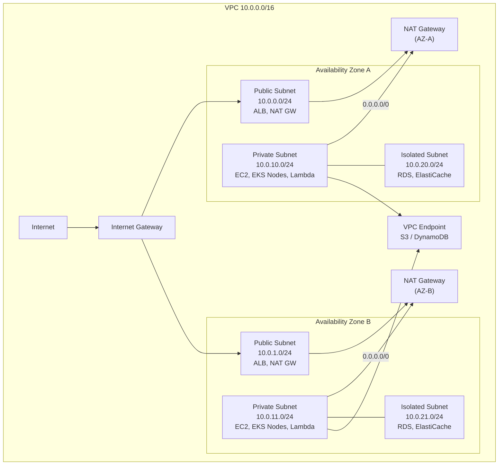
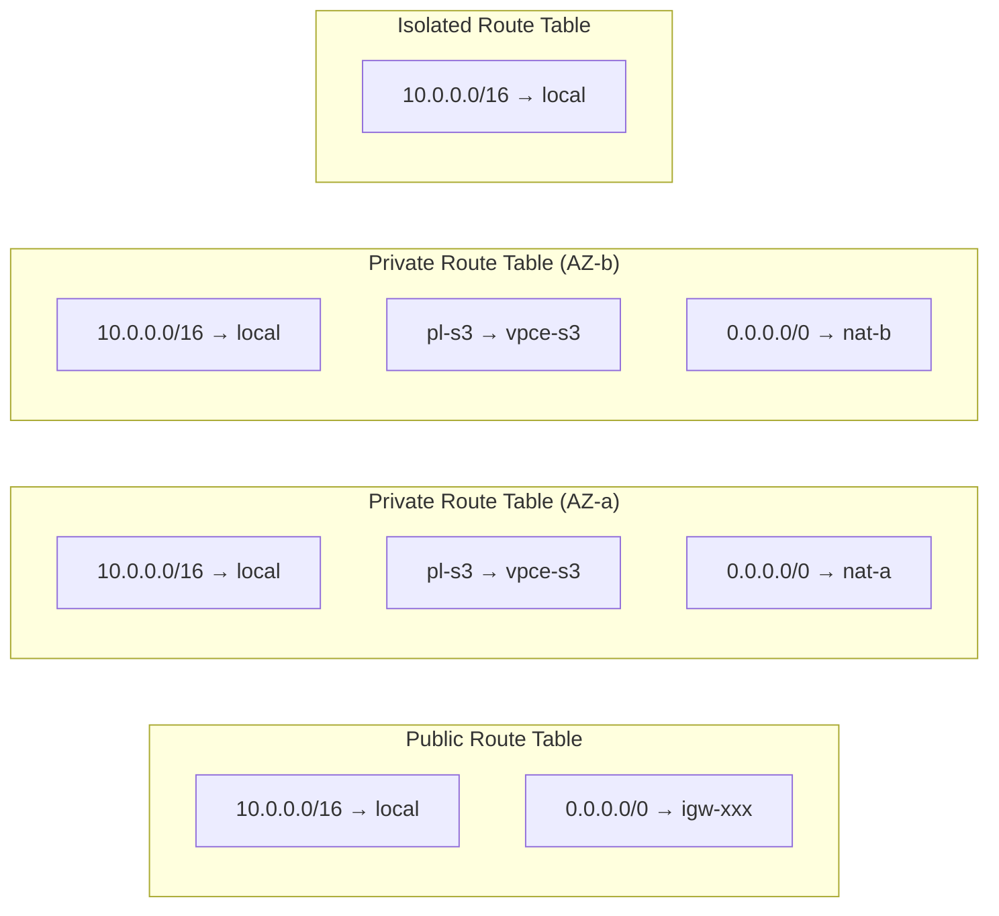
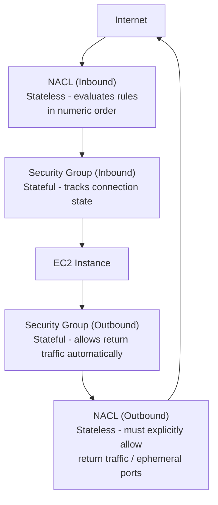
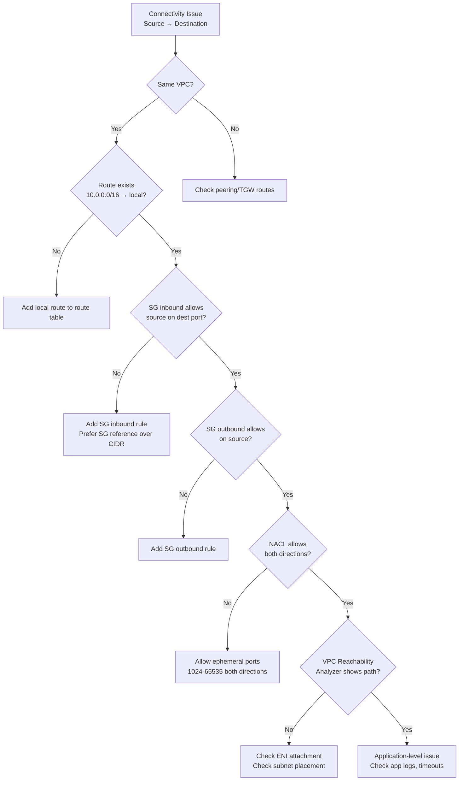

# VPC Fundamentals

> Senior SRE Interview Prep | AWS Networking | Production-Grade Reference

---

## Overview

A Virtual Private Cloud (VPC) is a logically isolated section of AWS where you define a virtual network. Every production application on AWS lives inside a VPC — understanding how it routes packets, enforces security, and fails is foundational knowledge for any Senior SRE.

The core mental model: a VPC is a software-defined data center. You control IP addressing, routing, firewall rules, and internet access. AWS provides the physical underlay; you define the virtual topology.

---

## VPC Components

### CIDR Blocks

The VPC CIDR is the master address space. Choose RFC 1918 ranges:

| RFC 1918 Range | Common VPC CIDR | Subnets Available |
|---|---|---|
| 10.0.0.0/8 | 10.0.0.0/16 | 65,536 IPs |
| 172.16.0.0/12 | 172.16.0.0/16 | 65,536 IPs |
| 192.168.0.0/16 | 192.168.0.0/20 | 4,096 IPs |

**Production guidelines:**
- Use /16 for most VPCs — gives 65K IPs, room to grow
- Plan ahead for VPC peering and Transit Gateway — overlapping CIDRs cannot be connected
- Use a CIDR allocation strategy across accounts: e.g., prod=10.0.0.0/16, staging=10.1.0.0/16, dev=10.2.0.0/16
- Secondary CIDRs can be added (up to 5 total), but cannot overlap with primary or peer VPCs

### The 5 Reserved IPs Per Subnet

For every subnet you create, AWS reserves **5 IP addresses** at the bottom of the range:

| Reserved IP | Purpose |
|---|---|
| x.x.x.0 | Network address |
| x.x.x.1 | VPC router (implicit gateway) |
| x.x.x.2 | AWS DNS server (VPC base +2) |
| x.x.x.3 | Reserved for future use |
| x.x.x.255 | Broadcast address (AWS doesn't use broadcast but reserves it) |

For a /24 subnet (256 addresses), this leaves **251 usable IPs**. For a /28 (16 addresses), only **11 usable IPs**. This matters for EKS: a /28 prefix delegation block yields 11 pods per ENI slot.

### Internet Gateway (IGW)

An IGW is a horizontally scaled, redundant, HA VPC component that provides internet connectivity. It performs NAT translation for public IPs: when a packet leaves an EC2 instance with a public IP, the IGW translates the private IP to the public Elastic IP.

Key property: **one IGW per VPC maximum**. The IGW itself is not a bandwidth bottleneck — it scales automatically.

### NAT Gateway

A NAT Gateway allows instances in **private subnets** to initiate outbound connections to the internet while blocking inbound connections. It runs in a **public subnet** and has an Elastic IP.

**Critical production detail**: Deploy one NAT Gateway per AZ. If you have a single NAT Gateway in AZ-a, traffic from AZ-b crosses AZ boundaries (costly and creates a single point of failure).

| Property | Value |
|---|---|
| Bandwidth | Up to 100 Gbps burst |
| Connections | 55,000 simultaneous per destination |
| Cost | Per-hour + per-GB data processing charge |
| HA | Per-AZ deployment required |

**NAT Gateway vs NAT Instance**: NAT Gateway is managed, scales automatically, and requires no maintenance. NAT Instances (EC2) give you more control (custom routing, filtering) but require patching, sizing, and HA design.

### VPC Endpoints

VPC Endpoints allow private connectivity to AWS services without using the internet, IGW, or NAT Gateway.

**Gateway Endpoints** (free):
- Only for S3 and DynamoDB
- Adds a route to the route table pointing to the AWS service prefix list
- Traffic stays on the AWS backbone
- Route table entry: `pl-xxxxxxxx (com.amazonaws.us-east-1.s3)` → `vpce-xxxxx`

**Interface Endpoints** (priced per hour + per GB):
- Creates an ENI in your subnet with a private IP
- DNS resolves the service name to the private IP
- Supports 100+ AWS services: SSM, ECR, STS, KMS, CloudWatch, etc.
- Uses PrivateLink under the hood

**When to use**: Always use Gateway Endpoints for S3/DynamoDB in production — they are free and eliminate NAT Gateway data charges for S3 traffic (which can be enormous). Use Interface Endpoints for services your workloads call frequently (SSM for instance management, ECR for container pulls, STS for IAM role assumption).

---

## Default VPC vs Custom VPC

### Why Never Use the Default VPC in Production

AWS creates a default VPC in every region with these properties:
- CIDR: 172.31.0.0/16
- All subnets are public (route 0.0.0.0/0 → IGW)
- All instances get public IPs by default
- No private subnets, no NAT Gateway, no isolation

The default VPC is designed for getting started quickly — not for production. Specific risks:

1. **No network segmentation**: Every instance is internet-reachable by default
2. **Shared CIDR across accounts**: 172.31.0.0/16 conflicts with every other AWS account's default VPC, making peering impossible without re-addressing
3. **No private tier**: Databases and internal services should never be in public subnets
4. **Security group sprawl**: Default SG allows all inbound from members of the same SG, which is far too permissive
5. **No flow logs by default**: No visibility into network traffic

**Production rule**: Delete the default VPC in every account and region using automation (AWS Config, Service Control Policies). Create custom VPCs with explicit subnet tiers, route tables, and security controls.

---

## Subnet Design Patterns



### Subnet Tier Responsibilities

**Public Subnets** (10.0.0.0/24, 10.0.1.0/24):
- Hosts: ALB, NLB, NAT Gateways, bastion hosts (if used)
- Route: `0.0.0.0/0 → IGW`
- Auto-assign public IP: typically disabled (let ALB/NAT GW handle it)
- Never run application workloads here

**Private Subnets** (10.0.10.0/24, 10.0.11.0/24):
- Hosts: EC2 application servers, EKS nodes, Lambda in VPC, ECS tasks
- Route: `0.0.0.0/0 → NAT GW` (same AZ), `10.0.0.0/16 → local`
- Can initiate outbound internet connections; cannot receive inbound from internet
- S3 traffic should use VPC Gateway Endpoint (no NAT charges)

**Isolated Subnets** (10.0.20.0/24, 10.0.21.0/24):
- Hosts: RDS, ElastiCache, OpenSearch, internal microservices with no internet need
- Route: **No default route** — only local VPC traffic
- Cannot reach internet at all; cannot be reached from internet
- Access only from private subnet via security groups

---

## Route Table Design



Route evaluation uses **longest prefix match**. A packet destined for 10.0.5.10 matches `10.0.0.0/16 → local` over `0.0.0.0/0 → NAT GW`. A packet to 8.8.8.8 only matches `0.0.0.0/0`.

---

## Security Groups vs NACLs



### Security Groups

| Property | Detail |
|---|---|
| Statefulness | **Stateful** — return traffic automatically allowed |
| Scope | Instance/ENI level |
| Default | Allow all outbound; deny all inbound |
| Rule types | Allow only (no explicit deny) |
| Evaluation | All rules evaluated; most permissive wins |
| References | Can reference other security groups (not just CIDRs) |

**Best practices**:
- Use security group references instead of CIDRs for internal traffic (e.g., allow RDS port from `sg-app-servers` rather than `10.0.10.0/24`)
- Principle of least privilege: no `0.0.0.0/0` on inbound for non-public-facing resources
- Separate SGs per tier: alb-sg, app-sg, db-sg

### NACLs (Network Access Control Lists)

| Property | Detail |
|---|---|
| Statefulness | **Stateless** — must allow both directions explicitly |
| Scope | Subnet level |
| Default | Allow all inbound and outbound |
| Rule types | Allow and Deny |
| Evaluation | Lowest rule number first; first match wins |
| Ephemeral ports | Must allow 1024-65535 for return traffic |

**Common NACL mistake**: Blocking outbound but forgetting to allow ephemeral ports (1024-65535). TCP responses use source ports in the ephemeral range. A NACL that allows inbound TCP/443 but doesn't allow outbound TCP/1024-65535 will silently drop all HTTPS responses.

**When to use NACLs**: NACLs are blunt instruments. Use them for:
- Broad CIDR-level deny rules (e.g., block an abusive IP range)
- Defense-in-depth as a secondary barrier behind security groups
- Blocking specific on-premises subnets from reaching isolated subnets

For fine-grained application-level rules, always use security groups.

---

## VPC Flow Logs

VPC Flow Logs capture metadata about IP traffic to/from network interfaces. They do NOT capture packet payloads.

**What flow logs capture:**
- Source/destination IP and port
- Protocol
- Bytes and packets transferred
- Action (ACCEPT or REJECT)
- Start/end timestamps
- VPC, subnet, and ENI identifiers

**What flow logs miss:**
- DNS queries (use Route 53 Resolver query logs instead)
- DHCP traffic
- Instance metadata service (169.254.169.254) traffic
- Packet payloads and application data

**Flow log destinations**: CloudWatch Logs, S3 (Parquet or text), Kinesis Data Firehose

**Security investigation use case**: Flow logs are the first tool for network forensics. If an instance is behaving suspiciously, query flow logs for: (1) unexpected outbound connections, (2) large data transfers, (3) connections to known-bad IPs. Athena queries on S3-stored flow logs make this practical at scale.

```sql
-- Athena query: Find top talkers from a private subnet
SELECT srcaddr, dstaddr, SUM(bytes) as total_bytes
FROM vpc_flow_logs
WHERE srcaddr LIKE '10.0.10.%'
  AND action = 'ACCEPT'
  AND date >= DATE '2026-03-01'
GROUP BY srcaddr, dstaddr
ORDER BY total_bytes DESC
LIMIT 20;
```

---

## Real-World Production Scenario

**Scenario**: RDS not reachable from Lambda — is it a Security Group or NACL issue?

A Lambda function in a private subnet (10.0.10.0/24) cannot connect to RDS in an isolated subnet (10.0.20.0/24). The Lambda times out after 30 seconds.

### Debugging Walkthrough

**Step 1: Confirm VPC configuration for Lambda**

Lambda functions in a VPC get an ENI in the configured subnet. If Lambda is NOT VPC-attached, it uses AWS-managed infrastructure and cannot reach private VPC resources. Check:
```bash
aws lambda get-function-configuration --function-name my-function \
  --query 'VpcConfig'
# Must show SubnetIds and SecurityGroupIds
```

**Step 2: Check Lambda security group — outbound rules**

Lambda's SG must allow outbound TCP/5432 (PostgreSQL) or TCP/3306 (MySQL) to the RDS subnet CIDR or RDS security group.
```bash
aws ec2 describe-security-groups --group-ids sg-lambda-xxx \
  --query 'SecurityGroups[].IpPermissionsEgress'
# Look for: port 5432, destination 10.0.20.0/24 or sg-rds-xxx
```

**Step 3: Check RDS security group — inbound rules**

RDS security group must allow inbound from Lambda's security group (SG reference) or Lambda's subnet CIDR.
```bash
aws ec2 describe-security-groups --group-ids sg-rds-xxx \
  --query 'SecurityGroups[].IpPermissions'
# Look for: port 5432, source sg-lambda-xxx
```

**Step 4: Check NACLs on both subnets**

NACLs are stateless. Check both the isolated subnet NACL (inbound) AND the private subnet NACL (outbound ephemeral ports).
```bash
# Check NACL for isolated subnet (inbound rules)
aws ec2 describe-network-acls \
  --filters Name=association.subnet-id,Values=subnet-isolated-a

# Common mistake: inbound ALLOW on port 5432 but outbound DENY on
# ephemeral ports 1024-65535 (needed for TCP response)
```

**Step 5: Check route tables**

Both subnets must have a `10.0.0.0/16 → local` route. If an isolated subnet accidentally has no route or a misconfigured route, traffic is dropped.

**Step 6: Verify with VPC Reachability Analyzer**

AWS provides a managed tool that traces the path without generating actual traffic:
```bash
aws ec2 create-network-insights-path \
  --source eni-lambda-xxx \
  --destination eni-rds-xxx \
  --protocol tcp \
  --destination-port 5432
aws ec2 start-network-insights-analysis --network-insights-path-id nip-xxx
```

The analysis identifies exactly which security group rule or NACL entry is blocking traffic.

**Root cause found 90% of the time**: Missing inbound rule on the RDS security group. Developers add outbound rules on Lambda's SG but forget inbound rules on the destination SG.

---

## Failure Modes

| Failure | Symptoms | Detection | Fix |
|---|---|---|---|
| NAT Gateway in single AZ | Cross-AZ traffic adds latency; full outage if AZ fails | CloudWatch `ErrorPortAllocation` metric; latency spikes | Deploy NAT GW per AZ; use per-AZ route tables |
| Security group allows 0.0.0.0/0 inbound | Exposed to internet attacks | AWS Security Hub, GuardDuty finding | Scope to specific CIDRs or SG references |
| NACL blocking ephemeral ports | TCP connections established but no responses | Flow logs show REJECT on outbound; timeouts in app | Allow TCP 1024-65535 outbound on NACLs |
| Missing VPC Endpoint for S3 | All S3 traffic routes through NAT GW | High NAT GW data processing costs; increased latency | Create Gateway Endpoint, update route tables |
| Subnet runs out of IPs | New ENIs/instances fail to launch | EC2 launch failures: "InsufficientFreeAddressesInSubnet" | Add secondary CIDR, create new subnets |
| Flow logs not enabled | Security incidents undetectable | Manual audit; AWS Config rule `vpc-flow-logs-enabled` | Enable flow logs to S3; set retention policy |
| Lambda cold start timeout | First Lambda invocation times out in VPC | Lambda `Init Duration` high; ENI creation delays | Use Provisioned Concurrency; increase timeout |

---

## Debugging Guide



---

## Security Considerations

1. **Never attach IGW to isolated subnets**: Isolated subnets should have no route to IGW or NAT GW
2. **Use VPC Endpoints for AWS services**: Eliminates internet exposure for S3, DynamoDB, SSM, ECR traffic
3. **Enable VPC Flow Logs from day one**: Retroactive enablement means you miss the incident that prompted investigation
4. **Security groups as firewalls, not documentation**: Regularly audit and remove unused rules; use AWS Access Analyzer
5. **Restrict default security group**: AWS default SG allows all traffic between members — immediately restrict it
6. **Separate NACLs per tier**: Create distinct NACLs for public, private, and isolated subnets
7. **Private subnets for workloads**: Application EC2, ECS, Lambda — never in public subnets unless they ARE the public-facing component
8. **Avoid `0.0.0.0/0` on security group inbound**: For internet-facing resources, use ALB as the entry point with its own SG; application SG only allows from ALB SG

---

## Interview Questions

### Basic

**Q: What are the 5 IPs AWS reserves in every subnet, and why does this matter?**

A: Network address (.0), VPC router (.1), AWS DNS (.2), reserved (.3), broadcast (.255). Matters for capacity planning — a /28 has only 11 usable IPs, which can be exhausted quickly by EKS pods or Lambda ENIs.

**Q: What is the difference between a Security Group and a NACL?**

A: Security groups are stateful (return traffic auto-allowed), apply at the ENI level, and support allow-only rules. NACLs are stateless (must explicitly allow both directions), apply at the subnet level, support both allow and deny rules, and evaluate in numeric order. Use SGs for fine-grained control; NACLs for broad subnet-level barriers.

**Q: What is the difference between a Gateway Endpoint and an Interface Endpoint?**

A: Gateway Endpoints (free, only S3/DynamoDB) add a route to your route table. Interface Endpoints (paid, 100+ services) create an ENI with a private IP in your subnet. Gateway Endpoints are implemented as route table entries; Interface Endpoints use PrivateLink.

### Intermediate

**Q: You have a Lambda function that times out connecting to RDS. Walk me through debugging.**

A: Check Lambda VPC config (is it VPC-attached?). Check Lambda SG outbound rule for RDS port. Check RDS SG inbound rule from Lambda SG. Check NACLs on both subnets — especially outbound ephemeral ports (1024-65535). Check route tables for `10.0.0.0/16 → local`. Use VPC Reachability Analyzer to trace the path. Enable flow logs to see ACCEPT/REJECT decisions.

**Q: Why should you deploy one NAT Gateway per AZ, not one per VPC?**

A: Single NAT Gateway creates a single point of failure — if that AZ is impaired, all private subnet instances lose internet access. Additionally, cross-AZ traffic incurs data transfer charges ($0.01/GB). Per-AZ NAT Gateways eliminate both the availability risk and the inter-AZ data charge. The cost of an extra NAT GW is almost always less than the cross-AZ data transfer charges at production scale.

**Q: What does VPC Flow Logs NOT capture?**

A: Packet payloads (no content inspection), DNS queries (use Route 53 Resolver logs), DHCP traffic, and traffic to/from the instance metadata service (169.254.169.254). This is critical for security investigations — flow logs tell you WHO talked to WHOM on WHICH port, but not WHAT they said.

### Advanced / Staff Level

**Q: Design a VPC architecture for a multi-tier application that needs to connect to on-premises systems, comply with PCI-DSS, and minimize inter-AZ data transfer costs.**

A: Three-tier VPC (public/private/isolated) with subnets in 3 AZs. One NAT Gateway per AZ with separate route tables pointing each private subnet to its AZ-local NAT GW. VPC Gateway Endpoints for S3 and DynamoDB. Interface Endpoints for SSM (no bastion needed), ECR, STS. For on-prem: Virtual Private Gateway with Direct Connect (private VIF) and VPN backup. NACL deny rules block direct cross-tier access (private → isolated only via app SG references). PCI workloads in isolated subnets with no internet route. VPC Flow Logs enabled with S3 + Athena for forensics. AWS Config rules: vpc-flow-logs-enabled, restricted-ssh, no-unrestricted-admin-ports.

**Q: A customer reports intermittent connectivity failures from their private subnet EC2 instances to a third-party SaaS API. The failures happen roughly every 4 hours and resolve themselves. How do you investigate?**

A: This pattern suggests NAT Gateway connection table exhaustion or SNAT port exhaustion. NAT GW supports 55,000 simultaneous connections per unique destination (IP:port). If the app holds many long-lived TCP connections to the same API IP:port, it can exhaust SNAT ports. Check CloudWatch metric `ErrorPortAllocation` on the NAT Gateway. Also check `PacketsDropCount`. Mitigation: distribute connections across multiple destination IPs (if the SaaS uses multiple IPs), implement connection pooling in the app, or add additional NAT Gateways with Route 53 weighted routing for outbound traffic distribution. The 4-hour cycle may correspond to TCP keepalive timeouts or connection pool refresh intervals in the application.

**Q: How do you prevent a misconfigured application from exfiltrating data through DNS (DNS tunneling) in a VPC?**

A: Multiple controls in depth: (1) Route 53 Resolver DNS Firewall — create a rule group that blocks known-malicious domains and domains with unusual query patterns; (2) Enable Route 53 Resolver query logging to CloudWatch — query logs capture every DNS query for analysis; (3) VPC Interface Endpoint for Route 53 Resolver keeps DNS queries inside the VPC without going through the DNS server at VPC+2; (4) Use VPC Flow Logs to detect anomalous traffic patterns on UDP/53; (5) GuardDuty has a specific finding type `Backdoor:EC2/DNSDataExfiltration` that uses ML to detect DNS tunneling patterns. The key detection signal is high-entropy subdomain names (e.g., `a3f8k2m9p.attacker.com`) or unusually large TXT record responses.
