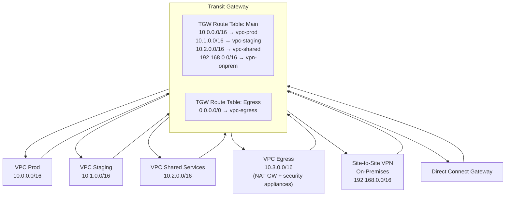
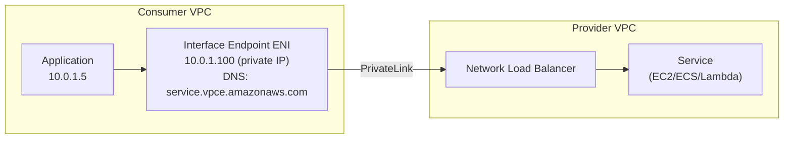
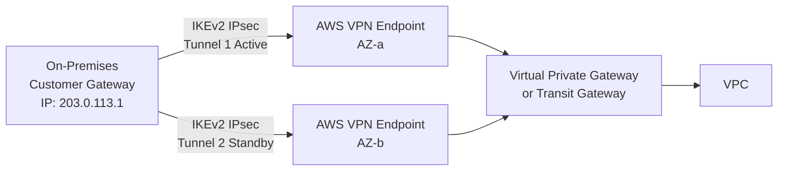
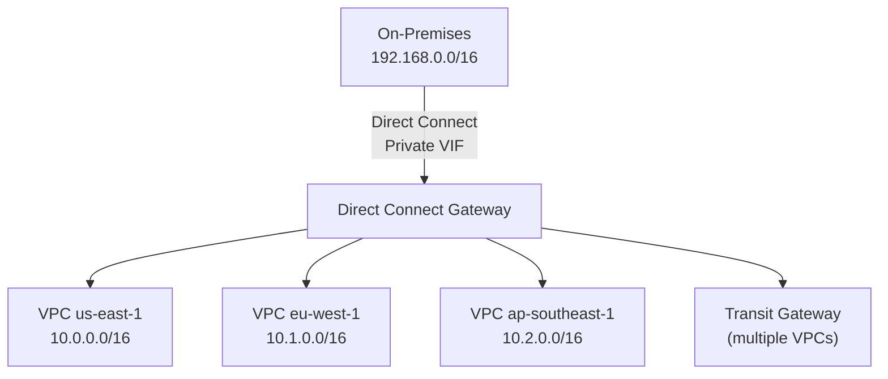

# VPC Connectivity

> Senior SRE Interview Prep | AWS Networking | Production-Grade Reference

---

## Table of Contents

- [Overview](#overview)
- [VPC Peering](#vpc-peering)
  - [Hard Constraints](#hard-constraints)
  - [Route Table Requirement](#route-table-requirement)
  - [When to Use Peering](#when-to-use-peering)
- [Transit Gateway (TGW)](#transit-gateway-tgw)
  - [TGW Route Tables](#tgw-route-tables)
  - [TGW Inter-Region Peering](#tgw-inter-region-peering)
  - [TGW Limits](#tgw-limits)
  - [Centralized Egress Pattern](#centralized-egress-pattern)
- [AWS PrivateLink](#aws-privatelink)
  - [How It Works](#how-it-works)
  - [PrivateLink Properties](#privatelink-properties)
  - [When to Use PrivateLink](#when-to-use-privatelink)
- [Site-to-Site VPN](#site-to-site-vpn)
  - [Architecture](#architecture)
  - [Key Technical Properties](#key-technical-properties)
  - [BGP vs Static Routing](#bgp-vs-static-routing)
  - [Common VPN Issues](#common-vpn-issues)
- [AWS Direct Connect](#aws-direct-connect)
  - [Connection Types](#connection-types)
  - [Virtual Interfaces (VIFs)](#virtual-interfaces-vifs)
  - [Link Aggregation Group (LAG)](#link-aggregation-group-lag)
  - [Direct Connect Gateway](#direct-connect-gateway)
  - [DX + VPN for Encryption](#dx-vpn-for-encryption)
- [Decision Matrix](#decision-matrix)
- [Real-World Production Scenario](#real-world-production-scenario)
  - [Debugging Walkthrough](#debugging-walkthrough)
- [Failure Modes](#failure-modes)
- [Security Considerations](#security-considerations)
- [Interview Questions](#interview-questions)
  - [Basic](#basic)
  - [Intermediate](#intermediate)
  - [Advanced / Staff Level](#advanced-staff-level)

---

## Overview

Connecting VPCs to each other, to on-premises networks, and to the internet is the core challenge of AWS networking at scale. The options — VPC Peering, Transit Gateway, PrivateLink, Site-to-Site VPN, and Direct Connect — each have hard constraints that make the wrong choice expensive or impossible to fix after deployment.

The Senior SRE must know not just what each service does, but exactly where it breaks in production and how to debug it.

---

## VPC Peering

> A VPC peering connection is a networking connection between two VPCs that enables you to route traffic between them using private IPv4 or IPv6 addresses. Instances in either VPC can communicate with each other as if they were within the same network. A peering connection can be created between your own VPCs, with a VPC in another AWS account, or with a VPC in another AWS Region.
> — [AWS Docs: VPC Peering](https://docs.aws.amazon.com/vpc/latest/peering/what-is-vpc-peering.html)

VPC Peering creates a direct, private network connection between two VPCs. Traffic flows over AWS's internal network, not the public internet.

### Hard Constraints

> VPC peering has several non-negotiable limitations that make it unsuitable for large-scale topologies. Routing is non-transitive — traffic cannot pass through an intermediate VPC — and CIDRs across all peered VPCs must not overlap. Each VPC supports a maximum of 125 active peering connections.
> — [AWS Docs: VPC Peering Limitations](https://docs.aws.amazon.com/vpc/latest/peering/vpc-peering-basics.html#vpc-peering-limitations)

| Constraint | Detail |
|---|---|
| Non-transitive | If VPC-A peers with VPC-B and VPC-B peers with VPC-C, VPC-A cannot reach VPC-C through VPC-B |
| No overlapping CIDRs | Even a single overlapping IP prevents peering creation |
| Maximum peers per VPC | 125 active peering connections |
| Cross-region | Supported; data transfer charges apply |
| Same account or cross-account | Both supported |

### Route Table Requirement

Creating a peering connection is only step 1. You must **manually add routes** to route tables on both sides:

```
VPC-A route table: 10.1.0.0/16 → pcx-xxxxxxxx
VPC-B route table: 10.0.0.0/16 → pcx-xxxxxxxx
```

Without these routes, the peering exists but traffic is dropped. This is a common "why can't I connect?" gotcha.

### When to Use Peering

> VPC peering is most appropriate for a small number of VPCs with direct, point-to-point connectivity requirements where the non-transitive routing limitation is not a concern. It incurs no attachment fee (unlike Transit Gateway) and has lower latency, making it the cost-effective choice when full mesh or hub-and-spoke routing is not needed.
> — [AWS Docs: VPC Peering Use Cases](https://docs.aws.amazon.com/vpc/latest/peering/vpc-peering-basics.html)

- Small number of VPCs (< 10) with point-to-point connectivity requirements
- Low-latency requirements (peering has slightly lower latency than Transit Gateway)
- Simple topology: no transitive routing needed
- Cost-sensitive: peering data transfer is cheaper than TGW attachment fees

---

## Transit Gateway (TGW)

> AWS Transit Gateway is a network transit hub that connects your VPCs and on-premises networks through a central gateway. It acts as a highly scalable cloud router — every new connection is made to the Transit Gateway, not to every other router in the network, significantly simplifying your network architecture and reducing operational overhead.
> — [AWS Docs: Transit Gateway](https://docs.aws.amazon.com/vpc/latest/tgw/what-is-transit-gateway.html)

Transit Gateway is a regional, fully managed, hub-and-spoke network transit hub. Every VPC and VPN connection attaches to the TGW, and the TGW routes between them.



### TGW Route Tables

> Each Transit Gateway has a default route table, and you can create additional route tables for network segmentation. By associating attachments with specific route tables and enabling selective route propagation, you can control which VPCs and networks can communicate — for example, isolating production traffic from development traffic at the routing layer.
> — [AWS Docs: TGW Route Tables](https://docs.aws.amazon.com/vpc/latest/tgw/tgw-route-tables.html)

TGW supports **multiple route tables** — this is what enables network segmentation at scale. Unlike a single shared routing domain, you can create:

- **Production route table**: Prod VPCs + Shared Services; no staging VPCs
- **Staging route table**: Staging + Shared Services; isolated from prod
- **Egress route table**: Catch-all 0.0.0.0/0 → Egress VPC for centralized internet access

Each TGW attachment (VPC, VPN, Direct Connect) is associated with one route table and can propagate routes to multiple route tables.

### TGW Inter-Region Peering

> Transit Gateway supports peering connections between Transit Gateways in different AWS Regions, enabling you to route traffic between VPCs and on-premises networks across regions. Inter-region peering traffic travels over the AWS global backbone network — not the public internet — providing improved security and consistent bandwidth.
> — [AWS Docs: TGW Inter-Region Peering](https://docs.aws.amazon.com/vpc/latest/tgw/tgw-peering.html)

TGW supports peering between TGWs in different regions. Traffic flows over AWS's backbone, not the internet. Use this for multi-region architectures instead of VPC peering across regions at scale.

### TGW Limits

| Limit | Value |
|---|---|
| Attachments per TGW | 5,000 |
| Route tables per TGW | 20 |
| Routes per route table | 10,000 |
| Bandwidth per VPC attachment | Up to 50 Gbps burst |

### Centralized Egress Pattern

> A centralized egress architecture uses a dedicated Egress VPC connected to a Transit Gateway to provide internet access for all spoke VPCs. NAT Gateways and security appliances reside in the Egress VPC, allowing uniform enforcement of egress filtering, logging, and inspection policies without deploying appliances in every spoke VPC.
> — [AWS Docs: Centralized Outbound Routing](https://docs.aws.amazon.com/vpc/latest/tgw/transit-gateway-nat-igw.html)

All VPCs route `0.0.0.0/0` to a dedicated Egress VPC via TGW. The Egress VPC contains NAT Gateways, security appliances, and optionally a proxy. Benefits:

- Single point for egress filtering and logging
- Fewer NAT Gateways (one per AZ in Egress VPC, not per-VPC)
- Centralized security inspection without per-VPC appliances

**Route configuration for centralized egress:**
```
Spoke VPC route table:   0.0.0.0/0 → tgw-xxxxxxxx
TGW main route table:    0.0.0.0/0 → vpc-egress-attachment
Egress VPC route table:  0.0.0.0/0 → nat-gw
```

---

## AWS PrivateLink

> AWS PrivateLink provides private connectivity between VPCs, AWS services, and your on-premises networks without exposing traffic to the public internet. It enables you to create Interface VPC Endpoints that appear as private IP addresses in your VPC, allowing access to services across account boundaries without VPC peering, route tables, or CIDR conflicts.
> — [AWS Docs: AWS PrivateLink](https://docs.aws.amazon.com/vpc/latest/privatelink/what-is-privatelink.html)

PrivateLink provides private connectivity to services without VPC peering, route tables, or internet exposure. It uses a consumer/provider model:




### How It Works

1. Provider creates a **VPC Endpoint Service** backed by an NLB
2. Consumer creates a **VPC Interface Endpoint** that provisions an ENI in the consumer's subnet
3. DNS automatically resolves the endpoint service name to the ENI's private IP
4. Traffic flows: Consumer → Interface Endpoint ENI → PrivateLink → NLB → Service

### PrivateLink Properties

- Supports overlapping CIDRs (no routing required)
- Traffic never leaves AWS backbone
- The consumer sees a private IP in their VPC; provider's VPC CIDR is invisible
- Supports cross-account and cross-region
- NLB in provider VPC handles load balancing across multiple service instances

### When to Use PrivateLink

> PrivateLink is the preferred connectivity model when you need one-directional service access across VPCs or accounts without granting access to the full network, when overlapping CIDR blocks prevent VPC peering, or when integrating with third-party SaaS providers who expose their services via VPC Endpoint Services.
> — [AWS Docs: PrivateLink Best Practices](https://docs.aws.amazon.com/vpc/latest/privatelink/privatelink-access-aws-services.html)

- SaaS vendor integration: vendor exposes their service via PrivateLink; you consume without VPC peering
- Overlapping CIDRs: when VPC peering is impossible due to CIDR conflicts
- Security isolation: consumer cannot scan provider's network; only the specific service port is accessible
- AWS service access: all Interface VPC Endpoints use PrivateLink (SSM, ECR, KMS, etc.)

---

## Site-to-Site VPN

> AWS Site-to-Site VPN creates encrypted IPsec connections between your network and your Amazon VPCs or AWS Transit Gateways over the public internet. Each VPN connection provides two redundant tunnels terminating in different Availability Zones, and supports both BGP dynamic routing and static routing configurations.
> — [AWS Docs: Site-to-Site VPN](https://docs.aws.amazon.com/vpn/latest/s2svpn/VPC_VPN.html)

Site-to-Site VPN connects on-premises networks to AWS VPCs over IPsec tunnels over the internet.

### Architecture



### Key Technical Properties

| Property | Value |
|---|---|
| Protocol | IKEv2 (recommended) or IKEv1 |
| Tunnels | 2 per VPN connection (HA; both terminate in different AZs) |
| Bandwidth per tunnel | 1.25 Gbps maximum |
| Total bandwidth | 2.5 Gbps (both tunnels active-active with ECMP on TGW) |
| Routing | BGP (dynamic) or static |
| Encryption | AES-256 with SHA-256 (configurable) |
| Dead Peer Detection (DPD) | Enabled by default |

### BGP vs Static Routing

> AWS Site-to-Site VPN supports both BGP (Border Gateway Protocol) dynamic routing and static routing. BGP is strongly recommended for production environments as it enables automatic route advertisement, automatic failover between tunnels, and flexible traffic engineering via attributes such as AS-path prepending and local preference.
> — [AWS Docs: VPN Routing Options](https://docs.aws.amazon.com/vpn/latest/s2svpn/VPNRoutingTypes.html)

**BGP (preferred for production)**:
- Automatic failover between tunnels
- Supports route summarization and filtering
- Path preference via AS-prepending
- Required for Direct Connect and recommended for VPN

**Static routing**:
- Simpler but manual; no automatic failover
- Use only for simple, non-critical connectivity

### Common VPN Issues

1. **Both tunnels use same AZ endpoint**: VPN has two tunnels, but if you configure only one, you lose HA. Always configure both.
2. **BGP not established**: Check customer gateway firewall — must allow TCP/179 (BGP) and UDP/500+4500 (IKE/NAT-T).
3. **Asymmetric routing**: Return traffic taking a different path. With BGP, ensure symmetric path preferences.

---

## AWS Direct Connect

> AWS Direct Connect links your on-premises network to AWS over a dedicated network connection, bypassing the public internet. This provides more consistent network performance, increased bandwidth throughput, and reduced bandwidth costs compared to internet-based connections — with latency as low as sub-millisecond depending on proximity to a Direct Connect location.
> — [AWS Docs: Direct Connect](https://docs.aws.amazon.com/directconnect/latest/UserGuide/Welcome.html)

Direct Connect provides dedicated private connectivity between on-premises and AWS, bypassing the public internet.

### Connection Types

| Type | Bandwidth Options | Provisioning |
|---|---|---|
| Dedicated | 1 Gbps, 10 Gbps, 100 Gbps | AWS directly; ~weeks lead time |
| Hosted | 50 Mbps to 10 Gbps | Through APN partner; faster setup |

### Virtual Interfaces (VIFs)

> A virtual interface (VIF) is the logical component of a Direct Connect connection that carries traffic to a specific destination. Private VIFs connect to VPCs via a Virtual Private Gateway, Public VIFs connect to AWS public endpoints, and Transit VIFs connect to Transit Gateways — each serving a distinct connectivity use case.
> — [AWS Docs: Virtual Interfaces](https://docs.aws.amazon.com/directconnect/latest/UserGuide/WorkingWithVirtualInterfaces.html)

| VIF Type | Connects To | Use Case |
|---|---|---|
| Private VIF | Single VPC via Virtual Private Gateway | VPC connectivity |
| Public VIF | AWS public services (S3, DynamoDB endpoints) | Public AWS service access without internet |
| Transit VIF | Transit Gateway | Multiple VPCs + VPN via single DX |

### Link Aggregation Group (LAG)

LAG bundles multiple Direct Connect connections into a single logical link for increased bandwidth and redundancy:
- Up to 4 connections in a LAG (must be same speed, same location)
- LACP (Link Aggregation Control Protocol)
- If a single connection fails, LAG continues with reduced bandwidth

### Direct Connect Gateway

> A Direct Connect Gateway is a globally available, logical resource that you can use to connect your on-premises networks to multiple Amazon VPCs across different AWS Regions through a single Direct Connect connection. It eliminates the need for multiple dedicated connections to each Region, reducing provisioning complexity and cost.
> — [AWS Docs: Direct Connect Gateways](https://docs.aws.amazon.com/directconnect/latest/UserGuide/direct-connect-gateways-intro.html)

A Direct Connect Gateway (DXGW) is a global resource that connects your on-premises network to multiple VPCs across regions via a single Direct Connect connection:



### DX + VPN for Encryption

Direct Connect does NOT encrypt traffic by default. For environments requiring encryption in transit (PCI-DSS, HIPAA):
- Run IPsec VPN over Direct Connect (VPN over DX)
- Or use MACsec (Layer 2 encryption) on dedicated connections
- Or use application-layer TLS (most common)

---

## Decision Matrix

| Scenario | Best Choice | Why |
|---|---|---|
| 2-3 VPCs, simple connectivity | VPC Peering | Lowest cost, simplest routing |
| 10+ VPCs, hub-and-spoke | Transit Gateway | Avoids N×(N-1) peering connections |
| Overlapping CIDRs | PrivateLink | No routing conflicts; service-level access |
| SaaS integration | PrivateLink | Security isolation; no VPC exposure |
| Transitive routing needed | Transit Gateway | Peering is non-transitive |
| On-premises, < 1.25 Gbps, cost-sensitive | Site-to-Site VPN | Lower cost; acceptable latency |
| On-premises, > 1.25 Gbps or latency-critical | Direct Connect | Dedicated bandwidth, consistent latency |
| Multiple regions connected to on-premises | Direct Connect Gateway | Single connection to all regions |
| Centralized egress / security inspection | TGW + Egress VPC | All traffic through single choke point |

---

## Real-World Production Scenario

**Scenario**: Direct Connect failover to VPN not working — BGP route preference debugging.

Your on-premises data center has both a 10 Gbps Direct Connect and a Site-to-Site VPN as backup. Direct Connect goes down. Application teams report the service is unreachable — the VPN backup is not taking traffic.

### Debugging Walkthrough

**Step 1: Confirm Direct Connect is down**

```bash
# Check DX connection state
aws directconnect describe-connections --connection-id dxcon-xxx
# State should be: 'down' during failure

# Check virtual interface BGP state
aws directconnect describe-virtual-interfaces --virtual-interface-id dxvif-xxx
# bgpPeers[].bgpStatus should be 'down'
```

**Step 2: Check if VPN is up**

```bash
# Check VPN connection status
aws ec2 describe-vpn-connections --vpn-connection-id vpn-xxx \
  --query 'VpnConnections[].VgwTelemetry'
# Should show: Status=UP for at least one tunnel
# OutsideIpAddress, StatusMessage, LastStatusChange
```

**Step 3: Check BGP route table on VGW/TGW**

This is the most common failure point. VPN routes must be in the TGW route table for failover to work:

```bash
# Check TGW route table for on-premises prefix
aws ec2 search-transit-gateway-routes \
  --transit-gateway-route-table-id tgw-rtb-xxx \
  --filters Name=type,Values=propagated

# Look for: 192.168.0.0/16 via vpn-xxx
# If missing: VPN is not propagating routes
```

**Step 4: Check BGP AS-path preference**

BGP prefers routes with shorter AS-paths. If VPN was configured with AS-prepending (e.g., 3× prepend), it has a longer AS-path than DX. After DX fails, VPN routes should be the ONLY option and should be selected automatically. But if VPN BGP session never established, there are no VPN routes to fall back to.

```bash
# Check if VPN has BGP peering established
# Check the VPN tunnel BGP log on the customer gateway router
# BGP state must be 'Established' for routes to propagate

# On Cisco IOS (customer gateway):
show bgp summary
show bgp 192.168.0.0/16
# Look for: AS_PATH, LOCAL_PREF, MED values
```

**Step 5: Verify route propagation is enabled**

Route propagation must be enabled on the VPC route tables to receive VGW-propagated routes:

```bash
aws ec2 describe-route-tables --route-table-id rtb-xxx \
  --query 'RouteTables[].PropagatingVgws'
# Must show the VGW ID with: 'GatewayId': 'vgw-xxx'

# If not propagating, enable it:
aws ec2 enable-vgw-route-propagation \
  --route-table-id rtb-xxx \
  --gateway-id vgw-xxx
```

**Root cause**: VPN BGP session was never in `Established` state because the customer firewall was blocking TCP/179. The VPN tunnels showed `UP` (IPsec established) but BGP never peered, so no routes were propagated. DX failure had nothing to fall back to.

**Fix**: Allow TCP/179 on the customer gateway firewall for the AWS BGP peer IPs. After BGP establishes and routes propagate, VPN correctly becomes the active path.

---

## Failure Modes

| Failure | Symptoms | Detection | Fix |
|---|---|---|---|
| VPC peering missing routes | Timeout connecting between VPCs | VPC Reachability Analyzer; traceroute hits no path | Add route to both VPC route tables |
| TGW route table missing attachment | VPC-to-VPC traffic dropped | TGW route table search returns no match | Associate attachment to route table; add propagation |
| VPN BGP not established | VPN UP but no traffic flows; DX failover fails | `aws ec2 describe-vpn-connections` VgwTelemetry | Allow TCP/179 on customer firewall |
| DX single connection | DX failure = total loss | No redundant connection/LAG | Add second DX connection or DX + VPN backup |
| Missing DX encryption | Compliance audit failure | AWS Config; architecture review | Add MACsec or IPsec VPN over DX |
| TGW bandwidth saturation | Increased latency, packet drops | TGW `BytesIn/Out` CloudWatch metrics | Add ECMP paths; use multiple VPN tunnels |
| PrivateLink endpoint DNS not resolving | Application can't reach endpoint service | `dig service.vpce.amazonaws.com` returns public IP | Enable Private DNS on Interface Endpoint |

---

## Security Considerations

1. **Encrypt Direct Connect**: DX is not encrypted by default. Use MACsec (Layer 2) or IPsec VPN over DX
2. **Restrict TGW attachments**: Use Resource Access Manager (RAM) to control which accounts can attach to your TGW
3. **TGW route table isolation**: Separate production and non-production VPCs into different TGW route tables to prevent lateral movement
4. **PrivateLink endpoint policies**: Attach resource policies to Interface Endpoints to restrict which principals can use them
5. **VPN pre-shared key rotation**: Rotate PSKs on Site-to-Site VPNs annually; use certificate-based authentication for better security
6. **BGP security**: Filter BGP advertisements; reject unexpected prefixes from customer gateways using prefix lists and AS-path filters
7. **Flow logs on TGW**: Enable TGW Flow Logs to monitor all inter-VPC traffic (separate from VPC Flow Logs)

---

## Interview Questions

### Basic

**Q: Why is VPC peering non-transitive, and how do you solve it at scale?**

A: Peering creates a direct route between two VPCs, but AWS does not allow traffic to flow through a VPC to reach a third VPC — it must be addressed directly from source to destination. At scale (10+ VPCs), you'd need N×(N-1)/2 peering connections for full mesh connectivity. Transit Gateway solves this by acting as a regional hub where all VPCs connect, and the TGW's route table handles routing between them.

**Q: What are the two tunnels in a Site-to-Site VPN, and why are both needed?**

A: Each VPN connection has two IPsec tunnels terminating in different AWS Availability Zones. If one AZ is impaired, the second tunnel (in a different AZ) maintains connectivity. Both tunnels should be active — configure BGP or static routes for both. Without the second tunnel, an AZ failure breaks the VPN.

### Intermediate

**Q: When would you use PrivateLink instead of VPC peering to connect to a service in another VPC?**

A: Use PrivateLink when:

1. the VPCs have overlapping CIDRs (peering is impossible)
2. you want one-way service exposure without giving the consumer access to the entire provider VPC
3. you're integrating with a SaaS vendor's PrivateLink endpoint service
4. you need cross-account access where full peering would be too permissive. PrivateLink gives the consumer a private IP in their own VPC subnet; they can only reach the specific service, not probe the provider network.

**Q: How does a Transit Gateway route table differ from a VPC route table?**

A: A VPC route table controls which gateway handles outbound traffic from a subnet (IGW, NAT GW, TGW, VGW). A TGW route table controls how the Transit Gateway forwards traffic between its attachments (VPCs, VPNs, DX). A TGW can have multiple route tables — you associate each attachment with one route table (for inbound) and configure propagation to control which attachments learn each other's routes. This enables network segmentation: prod VPCs can be isolated from dev VPCs at the TGW level.

### Advanced / Staff Level

**Q: Design a highly available Direct Connect architecture for a financial institution that requires < 100ms failover and no unencrypted traffic.**

A: Two dedicated Direct Connect connections at 10 Gbps each, from two different DX locations (or one from a DX location and one via hosted connection at a different facility). Both connect to a Transit Gateway via Transit VIF through a Direct Connect Gateway. BFD (Bidirectional Forwarding Detection) enabled on both for ~300ms failure detection. BGP configured with equal-cost multi-path (ECMP) for active-active use when both are up; AS-prepending on secondary for active-passive fallback. MACsec encryption enabled on both dedicated connections for Layer 2 encryption. VPN over DX as tertiary fallback with higher AS-path length. Monitoring: CloudWatch alarms on DX connection state, BGP peer status, and BFD session state with PagerDuty integration.

**Q: A team reports that cross-VPC traffic via Transit Gateway is 3x higher than expected. Walk through investigating and reducing these costs.**

A: First, enable TGW Flow Logs to understand which VPCs are generating the most cross-VPC traffic. Check if traffic patterns match expectations (legitimate service calls) or anomalies. Common causes of unexpectedly high TGW traffic:

1. EC2 instances in VPC-A resolving DNS names to IPs in VPC-B and then making data-plane calls that could be local — check if these should use VPC Endpoints instead
2. Backup/replication traffic that should stay within a region but is routed through TGW
3. Monitoring agents sending all telemetry to a collector in another VPC — consider local collectors with aggregated forwarding
4. NTP traffic flowing across VPCs. For each traffic category, evaluate: VPC Endpoint (avoid TGW entirely for AWS services), colocation of services within the same VPC, or caching. Calculate TGW attachment fee + data processing fee vs. the cost of adding VPC Endpoints or restructuring VPCs.
