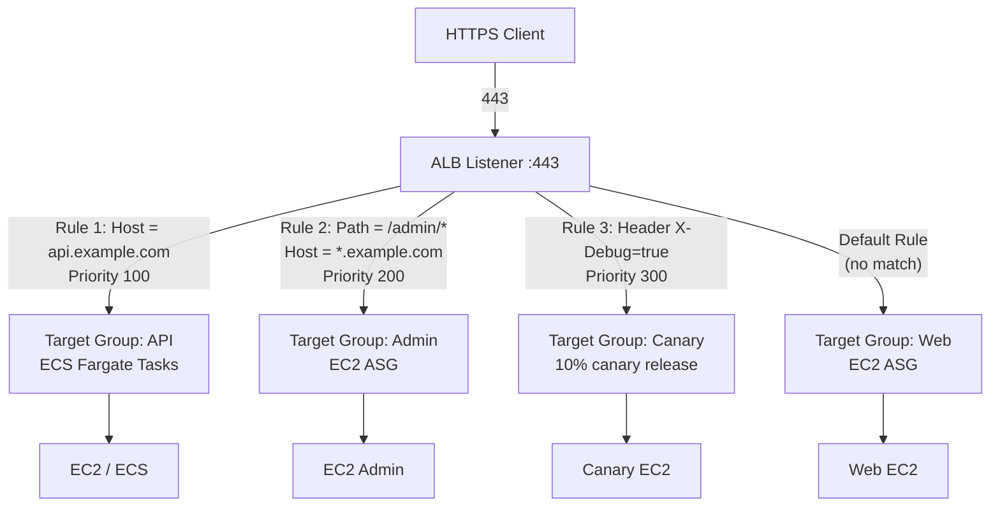
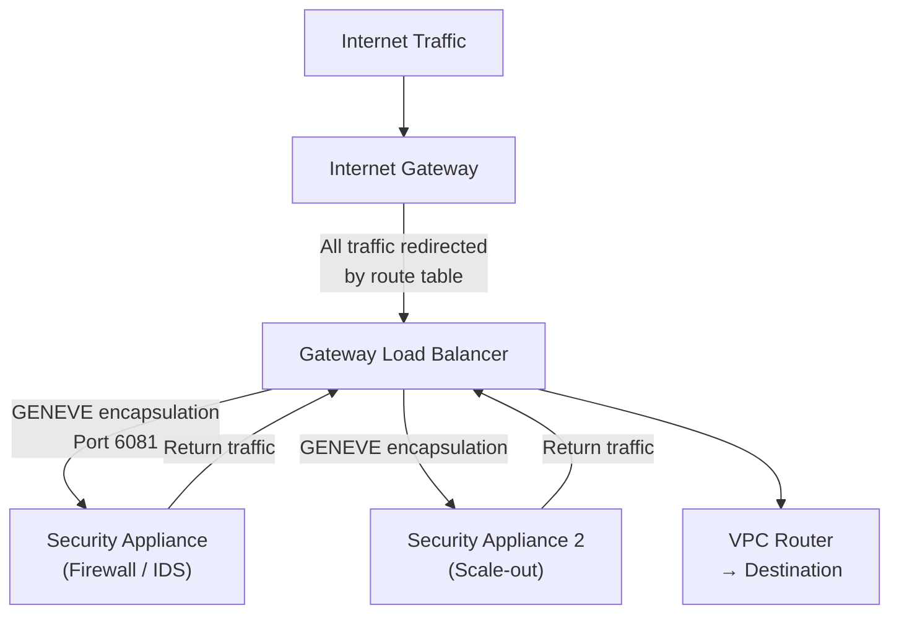
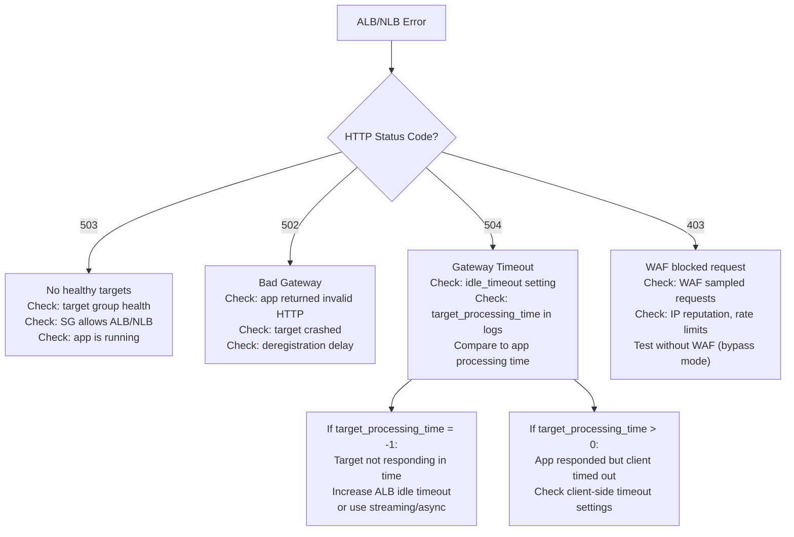

# AWS Load Balancers

> Senior SRE Interview Prep | AWS Networking | Production-Grade Reference

---

## Table of Contents

- [Overview](#overview)
- [ALB vs NLB vs GLB: Feature Matrix](#alb-vs-nlb-vs-glb-feature-matrix)
- [Application Load Balancer (ALB)](#application-load-balancer-alb)
  - [Content-Based Routing with Listener Rules](#content-based-routing-with-listener-rules)
  - [Rule Match Conditions](#rule-match-conditions)
  - [Target Groups](#target-groups)
  - [Weighted Target Groups for Canary Deployments](#weighted-target-groups-for-canary-deployments)
  - [ALB Idle Timeout](#alb-idle-timeout)
- [Network Load Balancer (NLB)](#network-load-balancer-nlb)
  - [Source IP Preservation](#source-ip-preservation)
  - [Static IPs Per AZ](#static-ips-per-az)
  - [TLS Passthrough Mode](#tls-passthrough-mode)
  - [Performance](#performance)
- [Gateway Load Balancer (GLB)](#gateway-load-balancer-glb)
  - [Bump-in-the-Wire Pattern](#bump-in-the-wire-pattern)
  - [GENEVE Protocol](#geneve-protocol)
  - [Use Cases](#use-cases)
- [Connection Draining (Deregistration Delay)](#connection-draining-deregistration-delay)
  - [The Trade-Off](#the-trade-off)
- [WAF Integration with ALB](#waf-integration-with-alb)
  - [Attaching a WAF ACL](#attaching-a-waf-acl)
  - [WAF Rule Types](#waf-rule-types)
  - [Rate Limiting Example](#rate-limiting-example)
- [ALB Access Logs](#alb-access-logs)
  - [Enabling Access Logs](#enabling-access-logs)
  - [Key Fields in Access Logs](#key-fields-in-access-logs)
  - [Querying with Athena](#querying-with-athena)
- [Real-World Production Scenario](#real-world-production-scenario)
  - [Debugging Walkthrough](#debugging-walkthrough)
- [Failure Modes](#failure-modes)
- [Debugging Guide](#debugging-guide)
- [Security Considerations](#security-considerations)
- [Interview Questions](#interview-questions)
  - [Basic](#basic)
  - [Intermediate](#intermediate)
  - [Advanced / Staff Level](#advanced-staff-level)

---

## Overview

AWS Elastic Load Balancing (ELB) provides three managed load balancer types: ALB (Application), NLB (Network), and GLB (Gateway). Each operates at a different layer with fundamentally different performance characteristics, feature sets, and use cases.

The Senior SRE must know not just which to use when, but why each breaks in production, how to tune connection draining, how to integrate WAF, and how to debug 504 errors from access logs.

Source material from `/le-study-notes/networking/04-load-balancing.md` covers L4 vs L7 fundamentals, algorithms, and HAProxy/NGINX configuration. This document extends that knowledge with AWS-specific implementation depth.

---

## ALB vs NLB vs GLB: Feature Matrix

| Feature | ALB | NLB | GLB |
|---|---|---|---|
| OSI Layer | 7 (HTTP/HTTPS/gRPC) | 4 (TCP/UDP/TLS) | 3 (IP/GENEVE) |
| Protocol awareness | Host, path, header, query, gRPC method | TCP/UDP/TLS only | Transparent pass-through |
| Static IPs | No (use NLB in front) | Yes, one per AZ | Yes |
| Source IP preservation | No (uses X-Forwarded-For) | Yes (native) | Yes |
| TLS termination | Yes | Yes (TLS passthrough also supported) | No |
| Performance | Thousands of RPS | Millions of RPS | Ultra-high (L3) |
| WAF integration | Yes | No | No |
| WebSocket | Yes | Yes | N/A |
| gRPC | Yes | No | No |
| Lambda targets | Yes | No | No |
| PrivateLink support | No | Yes | No |
| Use case | Web apps, APIs, microservices | TCP services, static IPs, extreme performance | Security appliance insertion |

---

## Application Load Balancer (ALB)

> An Application Load Balancer operates at the request level (Layer 7), routing traffic to targets such as EC2 instances, containers, IP addresses, and Lambda functions based on the content of the request — including host headers, URL paths, query strings, and HTTP headers. It supports advanced request routing, TLS termination, WebSocket, and HTTP/2.
> — [AWS Docs: Application Load Balancer](https://docs.aws.amazon.com/elasticloadbalancing/latest/application/introduction.html)

ALB is the primary choice for HTTP/HTTPS workloads. It terminates TLS, parses HTTP, and routes based on content.

### Content-Based Routing with Listener Rules



### Rule Match Conditions

ALB listener rules support multiple condition types, evaluated together (AND logic within a rule):

| Condition | Example | Notes |
|---|---|---|
| Host header | `api.example.com` | Wildcard: `*.example.com` |
| Path pattern | `/api/*` | Wildcard: `?` and `*` |
| HTTP header | `X-Feature: dark-mode` | Custom headers |
| HTTP method | `POST` | GET, POST, PUT, etc. |
| Query string | `env=staging` | Key-value pairs |
| Source IP | `10.0.0.0/8` | CIDR block |

Rules have **priorities** (1-50,000). Lower number = higher priority. A rule matches when ALL conditions in the rule match (AND). The default rule has no conditions and always matches.

### Target Groups

> A target group routes requests to one or more registered targets using the configured protocol and port. Each target group has its own health check settings, and you can register different types of targets — EC2 instances, IP addresses, Lambda functions, or other ALBs — within the same or across different target groups.
> — [AWS Docs: Target Groups](https://docs.aws.amazon.com/elasticloadbalancing/latest/application/load-balancer-target-groups.html)

| Target Type | Use Case | Notes |
|---|---|---|
| `instance` | EC2 instances registered by ID | Traffic goes to instance's primary ENI |
| `ip` | Any IP (ECS tasks, Lambda, on-prem via DX) | Required for Fargate and EKS pods in IP mode |
| `lambda` | AWS Lambda functions | ALB invokes Lambda directly; JSON payload |
| `alb` | Another ALB | NLB-to-ALB chaining pattern |

### Weighted Target Groups for Canary Deployments

> ALB supports weighted target groups, allowing you to distribute incoming traffic across multiple target groups by specifying a relative weight for each. This enables canary deployments and blue/green releases directly at the load balancer level, without DNS changes or external orchestration tools.
> — [AWS Docs: Weighted Target Groups](https://docs.aws.amazon.com/elasticloadbalancing/latest/application/load-balancer-listeners.html#forward-actions)

ALB supports traffic splitting between target groups using weighted forwarding:

```json
{
  "Type": "forward",
  "ForwardConfig": {
    "TargetGroups": [
      { "TargetGroupArn": "arn:...stable", "Weight": 90 },
      { "TargetGroupArn": "arn:...canary", "Weight": 10 }
    ]
  }
}
```

This enables blue-green and canary releases without DNS changes or external tools. Weights are relative (not percentages). 90+10 = 90% to stable, 10% to canary.

### ALB Idle Timeout

> The idle timeout controls how long the ALB waits for data to be sent on an established connection. If no data is transmitted within the idle timeout period, the load balancer closes the connection. This applies to both the front-end connection (client to ALB) and the back-end connection (ALB to target).
> — [AWS Docs: Connection Idle Timeout](https://docs.aws.amazon.com/elasticloadbalancing/latest/application/application-load-balancers.html#connection-idle-timeout)

ALB has a configurable idle timeout (default: 60 seconds). If no data is sent on an established connection for this duration, ALB closes the connection. This is the source of one of the most common production 504 errors (see Production Scenario below).

---

## Network Load Balancer (NLB)

> A Network Load Balancer operates at the connection level (Layer 4), routing connections to targets based on IP protocol data. It is capable of handling millions of requests per second while maintaining ultra-low latencies, and provides static IP addresses per Availability Zone for use in firewall whitelisting and PrivateLink configurations.
> — [AWS Docs: Network Load Balancer](https://docs.aws.amazon.com/elasticloadbalancing/latest/network/introduction.html)

NLB operates at Layer 4. It does not inspect HTTP — it routes based on TCP/UDP/TLS and does not modify the packet beyond necessary rewriting.

### Source IP Preservation

> Unlike the Application Load Balancer, the Network Load Balancer preserves the source IP address of the client in the TCP packet delivered to targets. This allows backend applications to see the actual client IP directly in the connection, rather than relying on the `X-Forwarded-For` HTTP header.
> — [AWS Docs: NLB Target Groups](https://docs.aws.amazon.com/elasticloadbalancing/latest/network/load-balancer-target-groups.html)

Unlike ALB (which uses X-Forwarded-For), NLB preserves the original client IP address. The backend sees the actual client IP directly in the TCP connection. This matters for:
- IP-based access control on backends
- Audit logs showing real client IPs
- Applications that read IP from connection (not headers)

**Trade-off**: The backend must allow inbound from the full client IP range. With ALB, backends only need to allow ALB's security group.

### Static IPs Per AZ

> Each Network Load Balancer node is assigned one static IP address per Availability Zone, and optionally an Elastic IP address. These IP addresses do not change for the lifetime of the load balancer, making NLB the right choice when downstream clients or firewalls require a fixed, unchanging IP address for whitelisting.
> — [AWS Docs: NLB IP Addresses](https://docs.aws.amazon.com/elasticloadbalancing/latest/network/network-load-balancers.html#availability-zones)

NLB creates one static Elastic IP per AZ. These IPs don't change even if the NLB scales. This makes NLB the right choice when:
- Customers need to whitelist your IP addresses in their firewall
- A legacy system cannot use DNS and needs a fixed IP
- PrivateLink requires an NLB (ALB cannot back PrivateLink)

### TLS Passthrough Mode

> When an NLB listener is configured with the `TCP` protocol (rather than `TLS`), it forwards raw TCP traffic without decrypting the TLS connection. The target receives the full encrypted payload and performs TLS termination itself, enabling end-to-end encryption and preserving client certificates for mutual TLS (mTLS) authentication.
> — [AWS Docs: NLB TLS Listeners](https://docs.aws.amazon.com/elasticloadbalancing/latest/network/create-tls-listener.html)

NLB can forward TLS connections without decrypting them (TLS passthrough). The backend terminates TLS, enabling:
- End-to-end encryption where the LB never holds the private key
- mTLS between client and server (client certificates are preserved)
- Custom TLS implementations on the backend

Configure by using `TCP` protocol listener (not `TLS`) — NLB passes raw TCP without inspection.

### Performance

NLB is designed for extreme scale: millions of requests per second with ultra-low latency. AWS's internal networking infrastructure (Nitro hypervisor) handles the packet processing. Unlike ALB, NLB has no CPU-intensive HTTP parsing overhead.

---

## Gateway Load Balancer (GLB)

> A Gateway Load Balancer enables you to deploy, scale, and manage third-party virtual network appliances such as firewalls, intrusion detection and prevention systems, and deep packet inspection systems. It provides a transparent bump-in-the-wire architecture using the GENEVE protocol (port 6081) to pass packets to appliances without modifying source or destination IP addresses.
> — [AWS Docs: Gateway Load Balancer](https://docs.aws.amazon.com/elasticloadbalancing/latest/gateway/introduction.html)

GLB inserts transparent network security appliances into the traffic path. It operates at Layer 3 and uses the GENEVE protocol (port 6081) to encapsulate packets to and from security appliances.

### Bump-in-the-Wire Pattern



Traffic enters via the IGW, is routed to the GLB (via route table: `0.0.0.0/0 → GLB`), forwarded to security appliances using GENEVE encapsulation, inspected, and returned to GLB which forwards to the original destination. Applications are unaware of inspection.

### GENEVE Protocol

> GENEVE (Generic Network Virtualization Encapsulation) is a tunneling protocol used by the Gateway Load Balancer to forward traffic to appliances. It encapsulates the original packet with metadata context, allowing the appliance to process and return the packet without modifying the original source or destination addresses, preserving the appearance of normal through traffic.
> — [AWS Docs: GENEVE Protocol](https://docs.aws.amazon.com/elasticloadbalancing/latest/gateway/target-groups.html)

GENEVE (Generic Network Virtualization Encapsulation) carries metadata about the original traffic along with the encapsulated packet. GLB uses GENEVE on UDP port 6081. Security appliances must support this protocol (most next-gen firewalls support it as of 2024).

### Use Cases

- Inserting third-party firewalls (Palo Alto, Fortinet, Check Point) into VPC traffic
- IDS/IPS inspection for all ingress/egress traffic
- Traffic mirroring and deep packet inspection at scale
- Compliance requirements for stateful inspection of all traffic

---

## Connection Draining (Deregistration Delay)

> Deregistration delay (also known as connection draining) is the time that Elastic Load Balancing waits for in-flight requests to complete before deregistering a target. During this delay, the load balancer stops routing new requests to the target while allowing existing connections to complete, ensuring graceful instance removal during deployments and scale-in events.
> — [AWS Docs: Deregistration Delay](https://docs.aws.amazon.com/elasticloadbalancing/latest/application/load-balancer-target-groups.html#deregistration-delay)

When a target is deregistered from a target group (deployment, scale-in, maintenance), ALB/NLB stops sending NEW requests but allows IN-FLIGHT requests to complete. This is connection draining.

**Default deregistration delay: 300 seconds (5 minutes)**

### The Trade-Off

| Delay Setting | Effect | When to Use |
|---|---|---|
| Too long (> 300s) | Deployments are slow; old pods block rollout | Never (default too high for most apps) |
| Too short (< 30s) | In-flight long-lived requests (uploads, streaming) get broken mid-request | Only for stateless, short-lived requests |
| Tuned to request P99 | Deployments complete in reasonable time; no broken requests | Always tune to match your application's max request duration |

**Production recommendation**: Set deregistration delay to 2x the P99 request latency. If your P99 is 5 seconds, set delay to 10-15 seconds. For file upload endpoints with long timeouts, use a separate target group with a longer delay.

```bash
# Set deregistration delay to 30 seconds (for a fast-response API)
aws elbv2 modify-target-group-attributes \
  --target-group-arn arn:aws:elasticloadbalancing:... \
  --attributes Key=deregistration_delay.timeout_seconds,Value=30
```

---

## WAF Integration with ALB

> AWS WAF is a web application firewall that can be associated with an Application Load Balancer to inspect and filter HTTP/HTTPS web requests before they reach your backend targets. WAF rules can block common web exploits, filter traffic based on IP addresses and geographic location, and apply rate-based limits to protect against denial-of-service attacks.
> — [AWS Docs: WAF with ALB](https://docs.aws.amazon.com/waf/latest/developerguide/waf-chapter.html)

AWS WAF (Web Application Firewall) can be attached to an ALB. It inspects HTTP/HTTPS requests before they reach backend targets.

### Attaching a WAF ACL

```bash
# Associate WAF Web ACL with ALB
aws wafv2 associate-web-acl \
  --web-acl-arn arn:aws:wafv2:us-east-1:123456:regional/webacl/production-waf/xxx \
  --resource-arn arn:aws:elasticloadbalancing:us-east-1:123456:loadbalancer/app/prod-alb/xxx
```

### WAF Rule Types

| Rule Type | Purpose |
|---|---|
| AWS Managed Rules | Pre-built rules: Core Rule Set (CRS), Known Bad Inputs, SQL injection, Linux/POSIX OS rules |
| IP reputation lists | Block IPs from Tor exit nodes, botnets, scanners |
| Rate-based rules | Block IPs exceeding N requests per 5-minute window |
| Geo-blocking | Block or allow specific countries |
| Custom rules | SQL injection, XSS, custom regex patterns |

### Rate Limiting Example

```json
{
  "Name": "RateLimitPerIP",
  "Priority": 1,
  "Statement": {
    "RateBasedStatement": {
      "Limit": 2000,
      "AggregateKeyType": "IP"
    }
  },
  "Action": { "Block": {} },
  "VisibilityConfig": {
    "SampledRequestsEnabled": true,
    "CloudWatchMetricsEnabled": true,
    "MetricName": "RateLimitPerIP"
  }
}
```

**WAF counts** (sampled requests, block/allow counts) are visible in CloudWatch. Set alarms on `BlockedRequests` to detect attack patterns.

---

## ALB Access Logs

> Access logs for Application Load Balancers capture detailed information about every request sent to the load balancer, including the time, client IP address, latency, request paths, server response codes, and the IP addresses of the backend targets that processed each request. Logs are stored in Amazon S3 and can be queried with Amazon Athena for incident investigation and performance analysis.
> — [AWS Docs: ALB Access Logs](https://docs.aws.amazon.com/elasticloadbalancing/latest/application/load-balancer-access-logs.html)

ALB writes detailed access logs to S3 for every request (disabled by default; must be enabled).

### Enabling Access Logs

```bash
aws elbv2 modify-load-balancer-attributes \
  --load-balancer-arn arn:... \
  --attributes \
    Key=access_logs.s3.enabled,Value=true \
    Key=access_logs.s3.bucket,Value=my-alb-logs \
    Key=access_logs.s3.prefix,Value=prod-alb
```

### Key Fields in Access Logs

| Field | Description | Debug Use |
|---|---|---|
| `type` | http/https/h2/ws/wss | Protocol detection |
| `elb_status_code` | ALB's response code | 504 = ALB timeout; 502 = bad gateway |
| `backend_status_code` | Target's response code | 500 = app error; - = no response |
| `request_processing_time` | Time from receive to first byte forwarded to target | Routing delay |
| `backend_processing_time` | Time from first byte sent to last byte received from target | App latency |
| `response_processing_time` | Time from last byte received from target to first byte sent to client | ALB overhead |
| `request` | "METHOD URI HTTP/version" | Path analysis |
| `target_port_list` | Which target received the request | Instance-level debugging |
| `target_status_code_list` | Status codes from each target tried | Retry detection |

### Querying with Athena

```sql
-- ALB 504 analysis: which targets are timing out
CREATE EXTERNAL TABLE IF NOT EXISTS alb_logs (
    type string, time string, elb string,
    client_ip string, client_port int,
    target_ip string, target_port int,
    request_processing_time double,
    target_processing_time double,
    response_processing_time double,
    elb_status_code int,
    target_status_code string
)
ROW FORMAT SERDE 'org.apache.hadoop.hive.serde2.RegexSerDe'
LOCATION 's3://my-alb-logs/prod-alb/AWSLogs/123456/elasticloadbalancing/us-east-1/';

-- Find 504 errors and their target IPs
SELECT target_ip, target_port,
       COUNT(*) as timeout_count,
       AVG(target_processing_time) as avg_processing_time
FROM alb_logs
WHERE elb_status_code = 504
  AND date >= '2026-03-01'
GROUP BY target_ip, target_port
ORDER BY timeout_count DESC;
```

---

## Real-World Production Scenario

**Scenario**: ALB returning 504 errors on long-running requests — idle timeout vs application timeout mismatch.

A data export API that generates large reports (typically 90-120 seconds of processing) starts returning HTTP 504 after exactly 60 seconds, but only for large reports. Small reports (< 60s) succeed.

### Debugging Walkthrough

**Step 1: Identify the 504 pattern from access logs**

```sql
-- Check backend_processing_time distribution for 504 errors
SELECT
    ROUND(target_processing_time, 0) as processing_seconds,
    COUNT(*) as request_count,
    elb_status_code
FROM alb_logs
WHERE elb_status_code IN (504, 200)
  AND request LIKE '%/api/export%'
GROUP BY ROUND(target_processing_time, 0), elb_status_code
ORDER BY processing_seconds;
```

Result shows: all 504 errors have `target_processing_time = -1` (no response from target) and the 60-second pattern correlates with ALB idle timeout.

**Step 2: Understand what 504 means on ALB**

ALB returns 504 (Gateway Timeout) when:
- The target does not respond within the ALB's idle timeout
- The target connection is reset

`target_processing_time = -1` means ALB did not receive any bytes from the target before the timeout. The target IS processing, but sent no bytes.

**Step 3: Check ALB idle timeout setting**

```bash
aws elbv2 describe-load-balancer-attributes \
  --load-balancer-arn arn:... \
  --query 'Attributes[?Key==`idle_timeout.timeout_seconds`]'
# Returns: Value=60
```

The ALB idle timeout is 60 seconds. Since the export takes 90-120 seconds and returns no data until complete, ALB closes the connection at 60s.

**Step 4: Solutions (choose based on requirements)**

Option A — Increase ALB idle timeout (simplest):
```bash
aws elbv2 modify-load-balancer-attributes \
  --load-balancer-arn arn:... \
  --attributes Key=idle_timeout.timeout_seconds,Value=300
```
Maximum ALB idle timeout: 4000 seconds.

Option B — Streaming response (proper fix):
Change the application to send chunked HTTP responses or periodic heartbeat bytes during processing. As long as data bytes flow, ALB does not timeout. This is the correct architectural fix.

Option C — Async pattern (best for long-running operations):
Change the API to immediately return a job ID (HTTP 202 Accepted) and have the client poll `/api/export/{job_id}/status`. The background job runs outside the HTTP connection lifecycle. This is the recommended pattern for operations > 30 seconds.

**Root cause**: Default ALB idle timeout (60s) mismatched with synchronous long-running API design. The application architecture was the real problem.

---

## Failure Modes

| Failure | Symptoms | Detection | Fix |
|---|---|---|---|
| ALB 504 on long requests | Reports, uploads timeout at exact 60s | Access logs: `target_processing_time=-1`, 60s gap | Increase idle timeout or use async pattern |
| NLB health check failure on high-port app | NLB shows all targets unhealthy | NLB health check using TCP; app on non-standard port | Configure health check port explicitly |
| ALB returning 502 | "Bad Gateway" errors | Access logs: `target_status_code=-` or `000` | Target crashed/restarted; check app logs, deregistration delay |
| Deregistration delay too long | Deployments take 5+ minutes | Deployment pipeline timing; old pods stay in service | Reduce to 30-60s for fast-response APIs |
| WAF blocking legitimate traffic | Users get 403 during peak | WAF sampled requests show false positives | Review WAF rules; use COUNT mode before BLOCK |
| ALB targets not passing health checks | 503 Service Unavailable | ALB target group console; zero healthy targets | Fix health check path/port; check SG allows ALB |
| NLB preserving source IP breaks SG | Backend SG needs to allow all client IPs | Health checks pass but traffic fails | Expand SG to allow 0.0.0.0/0 or use ALB SG model |

---

## Debugging Guide



---

## Security Considerations

1. **Attach WAF to all internet-facing ALBs**: Minimum: AWS Managed Rules Core Rule Set and IP reputation list. Add rate-based rules for brute force protection.
2. **Enable ALB deletion protection**: `deletion_protection.enabled = true` to prevent accidental deletion via IaC errors.
3. **ALB access logs to S3 with lifecycle policy**: Retain 90 days for incident response; archive to Glacier for 1 year.
4. **NLB with static IPs + IP whitelisting**: Use NLB's static per-AZ IPs when partner firewall whitelisting is required.
5. **TLS policy enforcement**: Use `ELBSecurityPolicy-TLS13-1-2-2021-06` — enforces TLS 1.2+ and TLS 1.3, disables weak ciphers. Never use `ELBSecurityPolicy-2016-08` (allows TLS 1.0/1.1).
6. **HTTPS redirect rule**: Every ALB listener on port 80 should have a redirect rule: `HTTP → HTTPS (301)`.
7. **Target group health check path returns minimal info**: `/health` should return 200 OK with no sensitive info (no version numbers, stack traces, internal IPs).
8. **GLB appliance security**: Security appliances behind GLB must be patched and monitored — a compromised appliance sees all traffic.

---

## Interview Questions

### Basic

**Q: What is the main difference between ALB and NLB?**

A: ALB operates at Layer 7 (HTTP) and routes based on content (host, path, headers, query string). It terminates TLS and parses HTTP. NLB operates at Layer 4 (TCP/UDP), does not inspect application content, preserves the original source IP, and provides static per-AZ IPs. ALB is for web apps and APIs needing content-based routing; NLB is for extreme performance, TCP services, static IPs, or PrivateLink backends.

**Q: What causes an ALB to return a 504 error?**

A: ALB returns 504 (Gateway Timeout) when the target does not return any data within the ALB's idle timeout (default 60 seconds). Common causes: synchronous long-running requests (reports, large uploads), application deadlock, or database queries blocking indefinitely. Debug via access logs: check `target_processing_time` — if `-1`, the target never responded.

**Q: What is connection draining and why does it matter for deployments?**

A: Connection draining (deregistration delay) gives in-flight requests time to complete when a target is deregistered. Without it, a deployment that terminates instances immediately would break active requests. Too long (300s default) and deployments are slow. Tune to 2x your P99 request latency — if requests complete in < 5s, use a 15-30 second delay.

### Intermediate

**Q: How would you implement a canary deployment using ALB without DNS changes?**

A: Create two target groups — stable and canary. Configure the ALB listener's default rule with weighted forwarding: `[{TargetGroup: stable, Weight: 90}, {TargetGroup: canary, Weight: 10}]`. Monitor error rates and latency in both target groups via CloudWatch. Gradually shift weight toward canary. If issues arise, set stable weight to 100 and canary to 0 for instant rollback. This is atomic — no DNS TTL delays.

**Q: A backend EC2 instance is passing ALB health checks but returning 500 errors for real requests. How do you detect and auto-eject it?**

A: ALB health checks can only verify the health check endpoint (e.g., `/health`). Real requests hit `/api/...` paths which can return 500s. To detect unhealthy targets in production traffic: (1) Check CloudWatch per-target metrics (`HealthyHostCount`, `HTTPCode_Target_5XX_Count` per target); (2) Use ALB access logs with `target_ip` field to identify the failing instance; (3) Configure Auto Scaling Group health checks based on ALB health — after repeated 5xx, trigger instance replacement; (4) At the application level, implement a `/health` endpoint that actually tests dependencies (DB connectivity, cache). If any dependency fails, return 503 — this makes the health check meaningful.

### Advanced / Staff Level

**Q: Explain how you would design a zero-downtime deployment pipeline for an ALB-fronted service with a mix of short-lived API requests and long-lived WebSocket connections.**

A: Two separate target groups: one for REST API (deregistration delay: 30s) and one for WebSocket connections (deregistration delay: 300s). ALB listener routes based on the `Upgrade: websocket` header to the WebSocket TG. During deployment: (1) Deregister old instances from the API TG — after 30s, API connections drain; (2) The WebSocket TG drains slowly — new instances accept new connections while old instances finish existing WebSocket sessions (up to 300s); (3) Use rolling deployment (not blue-green) so new instances absorb new WebSocket connections immediately. Monitor `ActiveConnectionCount` metric per target group to confirm draining. For very long-lived WebSocket connections (> 5 minutes), implement client-side reconnection logic — connections will eventually be terminated and clients must gracefully reconnect to a new instance.

**Q: How does WAF integrate with ALB at the network level, and what are the performance implications?**

A: WAF is evaluated inline before the request reaches the target group. The ALB offloads WAF evaluation to AWS's managed WAF service — it does not run in the ALB's data path on the same hardware. WAF adds roughly 1-2ms of latency per request for rule evaluation. Performance impact scales with rule complexity: managed rule groups with many regex patterns have higher overhead than simple IP-based rules. The WAF WCU (Web ACL Capacity Unit) system limits rule complexity — each rule costs WCUs, and a Web ACL has a maximum of 5,000 WCUs. At very high RPS (> 100K), WAF costs (per million requests) can become significant. Mitigation: put CloudFront in front of ALB and attach WAF to CloudFront (evaluated at edge, reduces requests reaching ALB). For bot protection, use AWS WAF Bot Control which specifically optimizes for bot detection without inspecting every request with expensive regex rules.
