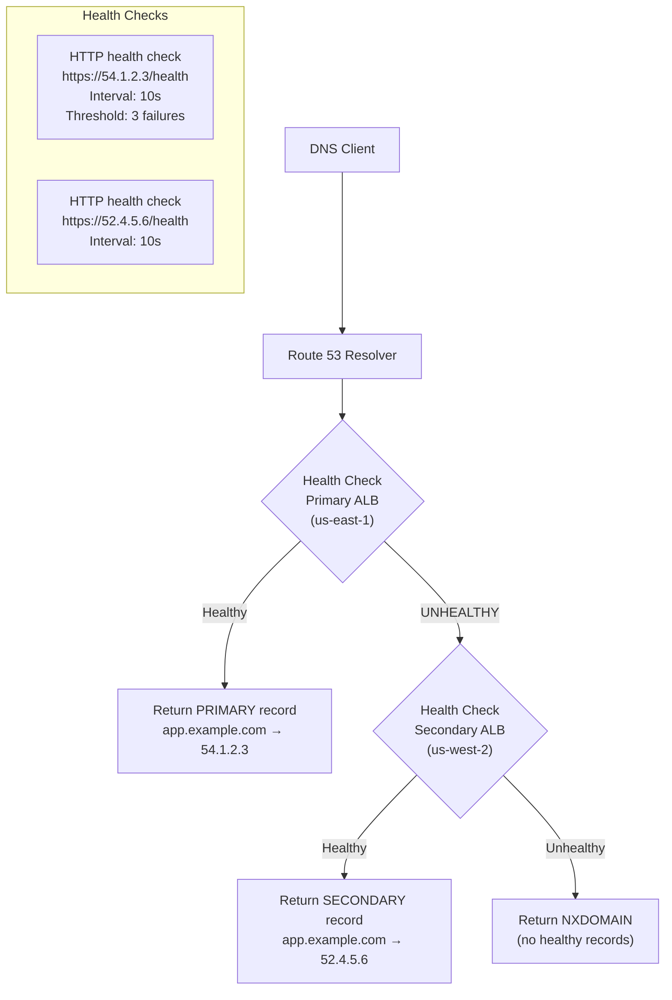
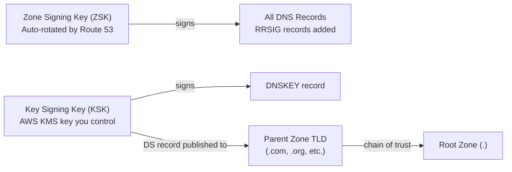
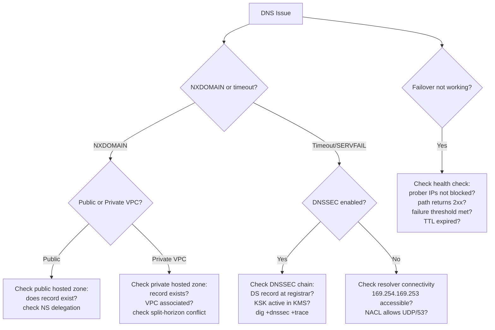

# Route 53 and DNS

> Senior SRE Interview Prep | AWS Networking | Production-Grade Reference

---

## Table of Contents

- [Overview](#overview)
- [Hosted Zones](#hosted-zones)
  - [Public Hosted Zones](#public-hosted-zones)
  - [Private Hosted Zones](#private-hosted-zones)
  - [Split-Horizon DNS](#split-horizon-dns)
- [Routing Policies](#routing-policies)
  - [Policy Comparison](#policy-comparison)
  - [Weighted Routing](#weighted-routing)
  - [Failover Routing](#failover-routing)
  - [Geolocation vs Geoproximity](#geolocation-vs-geoproximity)
- [Health Checks](#health-checks)
  - [Health Check Types](#health-check-types)
  - [Health Check Configuration](#health-check-configuration)
- [Route 53 Resolver](#route-53-resolver)
  - [Inbound Endpoints (On-Premises → AWS)](#inbound-endpoints-on-premises-aws)
  - [Outbound Endpoints (AWS → On-Premises)](#outbound-endpoints-aws-on-premises)
  - [Resolver DNS Firewall](#resolver-dns-firewall)
- [DNSSEC in Route 53](#dnssec-in-route-53)
  - [Enabling DNSSEC](#enabling-dnssec)
- [TTL Strategy](#ttl-strategy)
- [Real-World Production Scenario](#real-world-production-scenario)
  - [Debugging Walkthrough](#debugging-walkthrough)
- [Failure Modes](#failure-modes)
- [Debugging Guide](#debugging-guide)
- [Security Considerations](#security-considerations)
- [Interview Questions](#interview-questions)
  - [Basic](#basic)
  - [Intermediate](#intermediate)
  - [Advanced / Staff Level](#advanced-staff-level)

---

## Overview

Route 53 is AWS's managed authoritative DNS service, domain registrar, and health checking system. Beyond basic DNS, it provides intelligent routing, hybrid DNS resolution for on-premises connectivity, and DNSSEC for cryptographic integrity.

This document extends the DNS fundamentals from `/le-study-notes/networking/01-dns-basics.md` (which covers record types, resolution process, DNSSEC theory, CoreDNS, and TTL management) with AWS-specific Route 53 production depth.

---

## Hosted Zones

> A hosted zone is a container for DNS records for a specific domain, such as `example.com`, and its subdomains. Route 53 hosted zones come in two types: public hosted zones that answer queries from the internet, and private hosted zones that answer queries only within associated Amazon VPCs.
> — [AWS Docs: Hosted Zones](https://docs.aws.amazon.com/Route53/latest/DeveloperGuide/hosted-zones-working-with.html)

A hosted zone is a container for DNS records for a domain. Route 53 supports two types.

### Public Hosted Zones

> A public hosted zone contains records that specify how you want Route 53 to route traffic on the internet for a domain and its subdomains. When you create a public hosted zone, Route 53 automatically assigns four name servers that are part of its globally distributed, anycast network with a 100% SLA.
> — [AWS Docs: Public Hosted Zones](https://docs.aws.amazon.com/Route53/latest/DeveloperGuide/AboutHZWorkingWith.html)

Visible to the internet. When you create a public hosted zone for `example.com`, Route 53 assigns four name servers (NS records). You must update your domain registrar to point to these NS records.

**Key production detail**: Route 53's NS servers are part of a distributed, anycast network. The four assigned NS servers span multiple geographically separated PoPs. This is why Route 53 has 100% SLA — losing one PoP doesn't affect availability.

### Private Hosted Zones

> A private hosted zone is a container that holds information about how you want Route 53 to respond to DNS queries for a domain and its subdomains within one or more VPCs. It provides internal DNS resolution for resources within your private network without exposing those names to the internet.
> — [AWS Docs: Private Hosted Zones](https://docs.aws.amazon.com/Route53/latest/DeveloperGuide/hosted-zones-private.html)

Only visible within associated VPCs. A private hosted zone for `internal.example.com` resolves only when a query originates from an associated VPC.

```bash
# Associate a private hosted zone with a VPC
aws route53 associate-vpc-with-hosted-zone \
  --hosted-zone-id Z1234567890ABC \
  --vpc VPCRegion=us-east-1,VPCId=vpc-xxxxx
```

Private hosted zones can be associated with VPCs across **multiple accounts** (requires cross-account association using `authorize-vpc-association` + `associate-vpc-with-hosted-zone`).

### Split-Horizon DNS

> Split-horizon DNS (also called split-view DNS) allows you to serve different DNS answers for the same domain name depending on the origin of the query. In Route 53, you achieve this by creating both a public hosted zone and a private hosted zone for the same domain, associating the private zone with VPCs that should receive internal answers.
> — [AWS Docs: Private and Public Zones](https://docs.aws.amazon.com/Route53/latest/DeveloperGuide/hosted-zone-private-considerations.html)

Split-horizon uses the same domain name in both a public and private hosted zone, returning different IPs based on where the query originates:

```
Public zone (example.com):  api.example.com → 54.210.1.1 (ALB public IP)
Private zone (example.com): api.example.com → 10.0.1.100 (internal IP)
```

**Use cases**:
- Route internal traffic to private endpoints (bypassing NAT Gateway costs)
- Expose different versions of services to internal vs external clients
- Keep internal service topology hidden from public DNS

**Critical gotcha**: When both public and private zones exist for the same domain and a VPC is associated with the private zone, Route 53 **always serves the private zone answer** to queries from that VPC — even if the record is missing from the private zone. Missing records return NXDOMAIN from the private zone, not a fallback to the public zone.

---

## Routing Policies

> Route 53 routing policies determine how Route 53 responds to DNS queries when multiple resource record sets exist for the same name and type. Route 53 supports eight routing policies — from simple single-resource routing to complex policies based on latency, geographic location, health checks, and weighted distribution.
> — [AWS Docs: Routing Policies](https://docs.aws.amazon.com/Route53/latest/DeveloperGuide/routing-policy.html)

Route 53 routing policies determine how DNS responds when multiple records exist for the same name.

### Policy Comparison

| Policy | Returns | Use Case | Health Check Required |
|---|---|---|---|
| Simple | All records (random order if multiple) | Single resource; no routing logic | Optional |
| Weighted | One record, probabilistically | Canary deploys (90/10 split) | Optional |
| Latency-based | Record with lowest latency for the user's region | Multi-region active-active | Recommended |
| Failover | Primary if healthy, secondary otherwise | Active-passive DR | Required |
| Geolocation | Based on user's continent/country/US state | Compliance, localization | Optional |
| Geoproximity | Based on distance (biasable toward a region) | Fine-grained geographic distribution | Optional |
| Multi-value answer | Up to 8 healthy records | Simple DNS-level load balancing | Recommended |
| IP-based | Based on CIDR of DNS resolver | ISP-level routing control | Optional |

### Weighted Routing

> Weighted routing lets you associate multiple resources with a single domain name and control what proportion of DNS queries are routed to each resource. This is useful for load balancing between regions and for testing new versions of software by sending a small portion of traffic to the new version while the rest goes to the existing version.
> — [AWS Docs: Weighted Routing](https://docs.aws.amazon.com/Route53/latest/DeveloperGuide/routing-policy-weighted.html)

Each record has a weight (0-255). The probability of returning a record = `weight / sum(all weights)`.

```
app.example.com  →  ALB-v1  Weight: 90
app.example.com  →  ALB-v2  Weight: 10
```

Weight 0 = never returned (useful to park a record without deleting it). If all records have weight 0, Route 53 returns all records equally (treats as Simple routing).

### Failover Routing

> Failover routing lets you route traffic to a resource when it is healthy, and route traffic to a different resource when the primary resource is not healthy. You configure health checks on your primary records; if they fail, Route 53 automatically responds to queries using the secondary record, providing an active-passive failover configuration.
> — [AWS Docs: Failover Routing](https://docs.aws.amazon.com/Route53/latest/DeveloperGuide/routing-policy-failover.html)



Failover policy requires:
1. A **primary** record with an associated health check
2. A **secondary** record (health check optional)

Route 53 health checkers from multiple global regions probe the endpoint. If the failure threshold is met, the record is considered unhealthy and failover occurs.

### Geolocation vs Geoproximity

> Geolocation routing lets you choose the resources that serve your traffic based on the geographic location of your end users — continent, country, or US state — enabling compliance with regional regulations. Geoproximity routing routes traffic based on the geographic distance between your users and your resources, with an optional bias parameter to shift more or less traffic to a region.
> — [AWS Docs: Geolocation Routing](https://docs.aws.amazon.com/Route53/latest/DeveloperGuide/routing-policy-geo.html)

**Geolocation**: Exact continent/country/US state matching. Traffic from France → always goes to EU region, regardless of latency. Used for GDPR compliance (EU data must stay in EU) or legal jurisdictions.

**Geoproximity**: Distance-based with a **bias** parameter (-99 to +99). Positive bias expands the region's effective coverage; negative bias shrinks it. Allows shifting the geographic boundary without exact country matching. Use in Traffic Flow (advanced routing) only.

---

## Health Checks

> Amazon Route 53 health checks monitor the health and performance of your web applications, web servers, and other resources. Route 53 health checkers around the world send requests to your application and, if the application does not respond correctly, Route 53 can route DNS queries away from the unhealthy resource.
> — [AWS Docs: Route 53 Health Checks](https://docs.aws.amazon.com/Route53/latest/DeveloperGuide/dns-failover.html)

Route 53 health checks are distinct from load balancer health checks. They determine whether a DNS record should be returned.

### Health Check Types

**Endpoint health check**: Route 53 probes the endpoint from multiple AWS regions (us-east-1, eu-west-1, ap-southeast-1, etc.).

| Protocol | Configuration |
|---|---|
| HTTP | Port, path, expected response body string |
| HTTPS | Port, path, SSL certificate validation (optional) |
| TCP | Port only; checks TCP connection establishment |

**CloudWatch Alarm health check**: Route 53 considers a record unhealthy when a CloudWatch alarm is in `ALARM` state. Use this when the health indicator is a metric (e.g., queue depth, error rate) rather than an HTTP endpoint.

**Calculated health check**: Combines multiple health checks with AND/OR logic. For example: healthy if at least 2 of 3 regional health checks are healthy.

### Health Check Configuration

```bash
aws route53 create-health-check \
  --caller-reference unique-string-$(date +%s) \
  --health-check-config '{
    "Type": "HTTPS",
    "FullyQualifiedDomainName": "api.example.com",
    "ResourcePath": "/health",
    "Port": 443,
    "RequestInterval": 10,
    "FailureThreshold": 3,
    "MeasureLatency": true,
    "Regions": ["us-east-1", "eu-west-1", "ap-southeast-1"]
  }'
```

| Parameter | Effect |
|---|---|
| `RequestInterval` | 10s (fast, more expensive) or 30s (standard) |
| `FailureThreshold` | Consecutive failures before marking unhealthy (1-10) |
| `Regions` | Which Route 53 health checker locations probe the endpoint |
| `MeasureLatency` | Enables latency graphs in CloudWatch; adds latency metric data |

**Fast health checks (10s interval)**: Detect failures in 30-100 seconds (3-10 failures × 10s). Standard (30s interval): 90-300 seconds. For active-passive failover in production, always use 10s interval.

**Health check region considerations**: Health checker IPs are published by AWS (`aws route53 list-health-checks`). If your endpoint is behind a WAF or firewall that blocks IPs, you must whitelist Route 53 health checker IPs (published via `aws route53 get-checker-ip-ranges`).

---

## Route 53 Resolver

> Route 53 Resolver is a regional DNS service that answers DNS queries for Amazon EC2 instances and on-premises resources using the resolver at the VPC+2 IP address. It supports inbound and outbound endpoints to enable hybrid DNS resolution between your AWS VPCs and on-premises networks, without the need to manage your own DNS servers.
> — [AWS Docs: Route 53 Resolver](https://docs.aws.amazon.com/Route53/latest/DeveloperGuide/resolver.html)

Route 53 Resolver is the DNS resolver built into every VPC (the .2 address in each subnet — e.g., 10.0.0.2). It handles:
- Private hosted zone resolution
- Public DNS forwarding
- Hybrid DNS for on-premises connectivity

### Inbound Endpoints (On-Premises → AWS)

> Route 53 Resolver inbound endpoints enable DNS queries originating from your on-premises network or other VPCs to be resolved by Route 53 Resolver. Each inbound endpoint provisions Elastic Network Interfaces (ENIs) in your VPC subnets, providing IP addresses that your on-premises DNS servers can use as forwarding targets.
> — [AWS Docs: Resolver Inbound Endpoints](https://docs.aws.amazon.com/Route53/latest/DeveloperGuide/resolver-forwarding-inbound-queries.html)

An inbound endpoint creates ENIs in your VPC subnets. On-premises DNS servers forward queries for AWS internal names (e.g., `*.internal.example.com`) to these ENI IPs.

```
On-premises DNS server: forward zone internal.example.com to 10.0.1.50, 10.0.2.50
                         ↓
Route 53 Resolver Inbound Endpoint (10.0.1.50 in subnet-a, 10.0.2.50 in subnet-b)
                         ↓
Route 53 Private Hosted Zone: internal.example.com → 10.0.10.5
```

### Outbound Endpoints (AWS → On-Premises)

> Route 53 Resolver outbound endpoints enable DNS queries from your VPC to be forwarded to your on-premises DNS servers or resolvers. You define forwarding rules that specify which domain names should be forwarded and to which DNS server IP addresses, enabling seamless name resolution for on-premises resources from within AWS.
> — [AWS Docs: Resolver Outbound Endpoints](https://docs.aws.amazon.com/Route53/latest/DeveloperGuide/resolver-forwarding-outbound-queries.html)

An outbound endpoint creates ENIs in your VPC. Forwarding rules route specific domain queries to on-premises DNS servers.

```bash
# Create outbound endpoint
aws route53resolver create-resolver-endpoint \
  --creator-request-id unique-$(date +%s) \
  --direction OUTBOUND \
  --ip-addresses SubnetId=subnet-a,Ip=10.0.1.100 SubnetId=subnet-b,Ip=10.0.2.100 \
  --security-group-ids sg-resolver-xxx

# Create forwarding rule
aws route53resolver create-resolver-rule \
  --rule-type FORWARD \
  --domain-name corp.example.com \
  --resolver-endpoint-id rslvr-out-xxx \
  --target-ips Ip=192.168.1.53,Port=53 Ip=192.168.2.53,Port=53
```

Queries from VPC for `*.corp.example.com` are forwarded to on-premises DNS servers at 192.168.1.53.

### Resolver DNS Firewall

> Route 53 Resolver DNS Firewall lets you filter and block DNS queries for domain names that you specify in domain lists. You can use it to block queries to malicious, unauthorized, or unintended domains while allowing queries to trusted destinations, providing a DNS-layer control for your VPC resources without requiring inline network appliances.
> — [AWS Docs: Resolver DNS Firewall](https://docs.aws.amazon.com/Route53/latest/DeveloperGuide/resolver-dns-firewall.html)

Route 53 Resolver DNS Firewall allows you to block DNS queries for malicious or unauthorized domains at the resolver level.

```bash
# Create a DNS Firewall domain list
aws route53resolver create-firewall-domain-list \
  --name malicious-domains \
  --domains '["malware.example.com", "c2.attacker.net"]'

# Create a rule group
aws route53resolver create-firewall-rule-group \
  --name production-firewall

# Add a BLOCK rule
aws route53resolver create-firewall-rule \
  --firewall-rule-group-id rslvr-frg-xxx \
  --firewall-domain-list-id rslvr-fdl-xxx \
  --priority 100 \
  --action BLOCK \
  --block-response NXDOMAIN

# Associate with VPC
aws route53resolver associate-firewall-rule-group \
  --firewall-rule-group-id rslvr-frg-xxx \
  --vpc-id vpc-xxx \
  --priority 100 \
  --name production
```

DNS Firewall can also **log all DNS queries** per VPC — query logs go to CloudWatch Logs, S3, or Kinesis Data Firehose. This is critical for detecting data exfiltration via DNS tunneling.

---

## DNSSEC in Route 53

> DNSSEC (Domain Name System Security Extensions) is a set of protocols that add a layer of security to the DNS lookup and exchange processes to protect against cache poisoning and DNS spoofing attacks. Route 53 supports DNSSEC signing for public hosted zones, using AWS KMS customer-managed keys to sign zone records and establish a cryptographic chain of trust from the root zone.
> — [AWS Docs: DNSSEC in Route 53](https://docs.aws.amazon.com/Route53/latest/DeveloperGuide/dns-configuring-dnssec.html)

DNSSEC adds cryptographic signatures to DNS records, preventing cache poisoning and DNS spoofing.



### Enabling DNSSEC

```bash
# Step 1: Enable DNSSEC signing on hosted zone
aws route53 enable-hosted-zone-dnssec \
  --hosted-zone-id Z1234567890ABC \
  --signing-status SIGNING

# Step 2: Route 53 generates a KSK using your CMK in KMS
aws route53 create-key-signing-key \
  --hosted-zone-id Z1234567890ABC \
  --key-management-service-arn arn:aws:kms:us-east-1:123456:key/xxx \
  --name production-ksk \
  --status ACTIVE

# Step 3: Get the DS record to publish at your registrar
aws route53 get-dnssec \
  --hosted-zone-id Z1234567890ABC
# Returns DS records to add at the TLD registrar
```

**Important**: DNSSEC must be enabled at both the Route 53 level AND at the domain registrar (who publishes the DS record to the TLD). Without the DS record at the registrar, DNSSEC signing is in place but the chain of trust is not established — validators will not verify the signatures.

**DNSSEC gotcha**: Enabling DNSSEC on a zone with a very low TTL (< 1800s) can cause issues with signature validation at some resolvers. Use minimum TTL of 1800s (30 min) for DNSSEC-signed zones.

---

## TTL Strategy

> The time-to-live (TTL) value in a DNS record specifies how long, in seconds, DNS resolvers worldwide should cache that record before checking Route 53 for an updated value. Lower TTLs allow faster propagation of DNS changes but increase the number of queries Route 53 must answer; higher TTLs improve resolver cache efficiency and reduce query costs.
> — [AWS Docs: TTL Values](https://docs.aws.amazon.com/Route53/latest/DeveloperGuide/resource-record-sets-values-basic.html#rrsets-values-basic-ttl)

TTL determines how long DNS resolvers cache a record before querying again.

| Scenario | Recommended TTL | Rationale |
|---|---|---|
| Normal operation (A records) | 300s (5 min) | Fast propagation; reasonable cache hit rate |
| Pre-migration (lower) | 60s (1 min) | Lower 24-48h before any DNS change |
| Stable records (NS, SOA) | 172800s (2 days) | Rarely change; high cache hit rate |
| Failover records | 60-300s | Health check interval + TTL = actual failover time |
| CDN records (ALIAS to CloudFront) | N/A | ALIAS records use the target's TTL |

**TTL and failover time**: Total time to failover = health check failure detection time + DNS TTL. With 10s health check interval × 3 failures + 60s TTL = ~90 seconds worst case. This is why Route 53 health check failure thresholds and TTL must be tuned together.

**Cost implication**: Low TTLs mean more DNS queries. Route 53 charges $0.40/million queries (standard) or $0.60/million (latency routing). For high-traffic domains, 300s TTL is a good balance. For very high-traffic domains (billions of queries/month), consider Alias records (free for Route 53 integration targets like ALBs, CloudFront).

---

## Real-World Production Scenario

**Scenario**: Failover routing not triggering — health check configuration errors causing stale failover.

A multi-region active-passive deployment: primary ALB in us-east-1, secondary in us-west-2. The us-east-1 ALB returns errors. Customer reports the service is down, but Route 53 is not failing over to us-west-2.

### Debugging Walkthrough

**Step 1: Check health check status in Route 53**

```bash
# List all health checks and their status
aws route53 list-health-checks \
  --query 'HealthChecks[*].[Id,HealthCheckConfig.FullyQualifiedDomainName,HealthCheckConfig.Type]'

# Check the current health status
aws route53 get-health-check-status \
  --health-check-id abc123
# StatusReport[].Status should be "Failure: Connection refused"
# or should it be "Success: 200 OK"?
```

**Step 2: Check what the health check is actually probing**

The most common misconfiguration: health check is probing the wrong endpoint.
```bash
aws route53 get-health-check \
  --health-check-id abc123 \
  --query 'HealthCheck.HealthCheckConfig'
# Key fields: FullyQualifiedDomainName, ResourcePath, Port
# Common issue: ResourcePath is "/healthz" but app serves "/health"
# Common issue: Port is 80 but ALB only listens on 443
```

**Step 3: Test the health check endpoint manually**

```bash
# Simulate what Route 53 health checkers do
curl -v https://api.example.com/health \
  --resolve api.example.com:443:54.1.2.3
# If this returns 200, the endpoint is fine — health check config is wrong
# If this returns 503, the endpoint is actually down
```

**Step 4: Check if health checker IPs are blocked**

```bash
# Get Route 53 health checker IP ranges
aws route53 get-checker-ip-ranges \
  --query 'CheckerIpRanges'

# Check if WAF or security group blocks these ranges
aws ec2 describe-security-groups --group-ids sg-alb-xxx \
  --query 'SecurityGroups[].IpPermissions'
# If ALB SG only allows 0.0.0.0/0 on 443, health checkers should be fine
# If NACLs or WAF block specific IPs, health checkers may be blocked
```

**Step 5: Check the DNS record configuration**

```bash
aws route53 list-resource-record-sets \
  --hosted-zone-id ZXXXXX \
  --query 'ResourceRecordSets[?Name==`api.example.com.`]'
# Verify:
# Primary record has Failover=PRIMARY and HealthCheckId set
# Secondary record has Failover=SECONDARY
# Both records have identical Name and Type
```

**Step 6: Check TTL delay**

Even if health check triggers, TTL determines how long clients hold the old IP:
```bash
dig api.example.com +short  # Returns primary IP
# Check TTL of the answer
dig api.example.com | grep -A5 "ANSWER SECTION"
# api.example.com. 58 IN A 54.1.2.3
# TTL=58 means this resolver's cache expires in 58 seconds
```

**Root causes found**:
1. Health check path was `/healthz` but app served `/health` — health checker always got 404, which Route 53 interpreted as a transient error (not failure) because 404 can be a "success" depending on response string matching configuration
2. The failure threshold was set to 10 (300 seconds of failure detection) — made failover appear broken
3. Secondary record was missing the `Failover=SECONDARY` designation — it was a Simple record, not a Failover record

**Fix**: Correct health check path to `/health`, set failure threshold to 3, add `Failover=SECONDARY` to the secondary record. Verify with `aws route53 get-health-check-status` showing the primary as unhealthy and observing DNS response shift to secondary.

---

## Failure Modes

| Failure | Symptoms | Detection | Fix |
|---|---|---|---|
| Failover not triggering | Service down; Route 53 still returns primary IP | `get-health-check-status` shows healthy despite failures | Fix health check endpoint/path/port; lower failure threshold |
| Split-horizon NXDOMAIN | Internal clients can't resolve domain | `dig` from VPC returns NXDOMAIN; from internet returns IP | Add missing record to private hosted zone |
| High TTL after migration | Users still hitting old server hours after cutover | `dig +trace` shows long TTL cached | Pre-lower TTL 48h before migration |
| Weighted routing not distributing | All traffic goes to one record | Monitor target group request counts | Verify weights are set correctly; ensure health checks pass |
| Health checker blocked by WAF | Route 53 marks healthy endpoint as unhealthy | Health check shows failures; endpoint manually accessible | Whitelist Route 53 health checker IP ranges |
| DNSSEC validation failure | SERVFAIL for domain after DNSSEC enabled | `dig +dnssec example.com` shows SERVFAIL | Verify DS record published at registrar; check KSK status |
| Private zone not resolving | VPC instances can't resolve internal names | `dig` from EC2 returns empty | Verify VPC is associated with private hosted zone |

---

## Debugging Guide



---

## Security Considerations

1. **Enable DNSSEC** for all public zones to prevent cache poisoning; Route 53 handles the operational complexity
2. **Route 53 Resolver DNS Firewall** on all VPCs: block known-malicious domains and log all DNS queries
3. **Enable Resolver query logging**: log all DNS queries to CloudWatch; use for security investigations and detecting DNS exfiltration
4. **Health checker IP whitelisting**: Do not block Route 53 health checker IPs in WAF or firewalls — doing so causes false health check failures and unintended failovers
5. **Private hosted zone association audit**: Regularly audit which VPCs are associated with private hosted zones; misconfigured associations expose internal DNS to wrong VPCs
6. **Restrict public record creation**: Use Route 53 resource policies (via AWS Organizations SCP) to prevent public DNS records from being created for internal IP ranges
7. **TTL strategy for security events**: In a security incident requiring IP rotation, pre-setting low TTL (60s) ensures the old IP stops receiving traffic within minutes of the DNS change

---

## Interview Questions

### Basic

**Q: What is the difference between a Route 53 public and private hosted zone?**

A: Public hosted zones resolve on the internet for any DNS query. Private hosted zones only resolve within associated VPCs. Both can serve the same domain (split-horizon) — when a VPC is associated with a private zone, it always gets the private zone answer even if the public zone has different records. A missing record in the private zone returns NXDOMAIN (no fallback to public zone).

**Q: What Route 53 routing policy would you use for active-passive DR?**

A: Failover routing. Create a primary record pointing to the active region with an associated health check. Create a secondary record pointing to the DR region. When the health check fails the primary, Route 53 returns the secondary record. Set health check interval to 10s and failure threshold to 3 for ~30-second detection. TTL of 60s ensures clients pick up the change within 90 seconds total.

**Q: Explain the ndots:5 problem in Kubernetes DNS.**

A: Kubernetes pods have `/etc/resolv.conf` with `ndots:5` (from DNS basics source material). Any hostname with fewer than 5 dots triggers the resolver to append search domains before trying the name as-is. For example, resolving `api.example.com` (3 labels, 2 dots) causes the resolver to first try `api.example.com.default.svc.cluster.local`, then `api.example.com.svc.cluster.local`, then `api.example.com.cluster.local`, then finally `api.example.com`. This is 4 failed queries before the correct one. Fix: use FQDNs with trailing dot (`api.example.com.`) or reduce ndots to 2 in pod dnsConfig.

### Intermediate

**Q: How does Route 53 health check failover differ from ALB health checks?**

A: ALB health checks control whether a target receives traffic from the load balancer — they're local to a single region. Route 53 health checks control which DNS record is returned — they trigger regional failover at the DNS level. Route 53 health checkers probe from multiple AWS regions globally; ALB health checkers only probe from within the VPC. Route 53 failover has DNS TTL delay (clients cache the old IP); ALB failover is immediate (no DNS involved). Use both: ALB for within-region target health, Route 53 for cross-region failover.

**Q: You need to route EU users to your EU region for GDPR compliance and US users to your US region, regardless of latency. Which routing policy do you use?**

A: Geolocation routing (not latency-based). Latency-based routing selects the region with lowest latency — a US user could be routed to EU if EU has lower measured latency. Geolocation routing strictly uses the origin country: create one record for `Europe` pointing to EU region and one for `Default` (catches all other locations) pointing to US region. The country determination is based on the resolver's IP geolocation, not the client IP. This meets GDPR requirements because EU-sourced traffic always stays in the EU region.

### Advanced / Staff Level

**Q: Design a DNS architecture for a global SaaS application that needs: regional failover under 2 minutes, GDPR compliance (EU data stays in EU), canary deploys, and hybrid on-premises connectivity.**

A: Public hosted zone with layered routing: (1) Geolocation records for EU traffic → EU ALB, with a Route 53 health check. Behind the EU ALB, use weighted target groups (90/10) for canary deploys — this is ALB-level, not DNS-level, to avoid DNS propagation delays for canary rollback. (2) Default geolocation → US ALB with same canary pattern. (3) Both health checks use 10s interval, threshold 3, probing from 3 regions. TTL = 60s. Total failover time ≤ 30s detection + 60s TTL = 90 seconds. (4) For hybrid on-premises: Route 53 Resolver outbound endpoint with forwarding rules for `corp.internal` → on-premises DNS. Private hosted zone for `internal.saas.com` with split-horizon for internal service discovery. (5) DNSSEC enabled on public zone with KSK in KMS (with key rotation policy). (6) Resolver DNS Firewall on all VPCs blocking threat intel feeds. (7) All DNS queries logged to S3 for 1 year retention.

**Q: A DNS outage at Dyn in 2016 took down major internet services. How would you design Route 53 usage to survive an equivalent AWS Route 53 outage?**

A: Route 53 outages are extremely rare (100% SLA) but the design should account for it. Multi-provider DNS: use Route 53 as primary but also configure an NS record set pointing to Cloudflare or another DNS provider with identical zone contents. Use a tool like external-dns or Terraform to keep both providers synchronized. For critical records (apex, API endpoints), distribute across both providers: half the resolvers use Route 53's NS, half use Cloudflare's NS. With both providers, a Route 53 outage means only clients whose resolvers had cached Route 53's NS records are affected — and those caches expire (NS TTL typically 2 days, but most resolvers re-query sooner during resolution failures). For the fastest possible mitigation: run your own authoritative name servers (BIND, PowerDNS) on EC2 in multiple regions as tertiary NS records. These give you full control but require operational maintenance.
