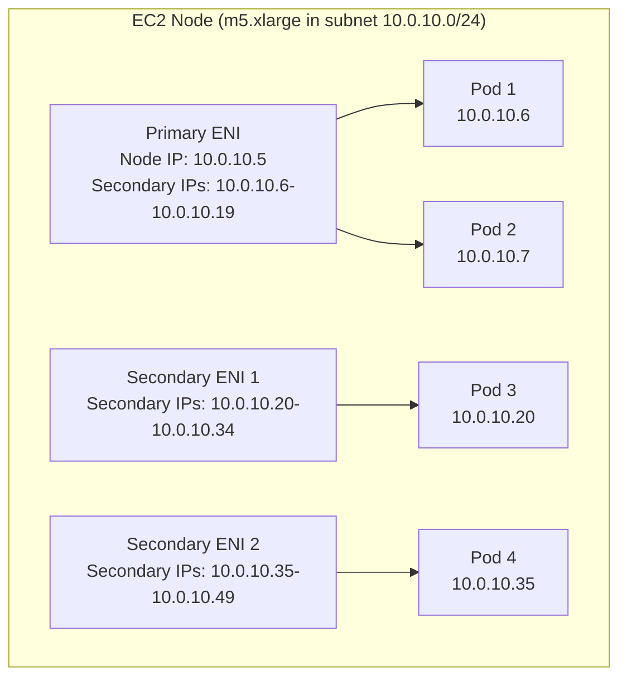
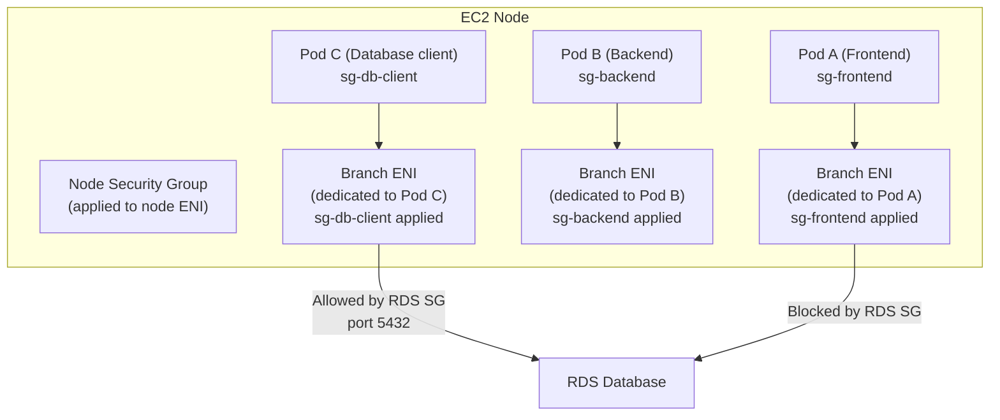
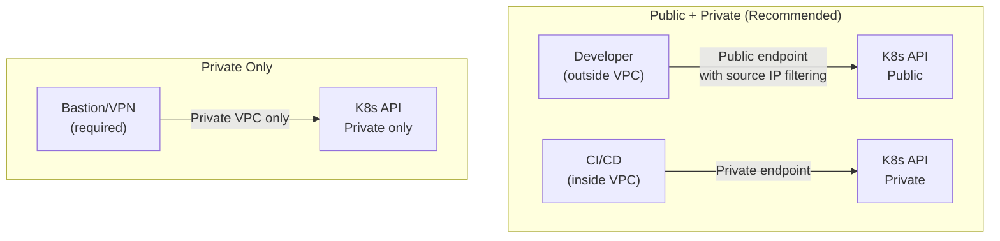
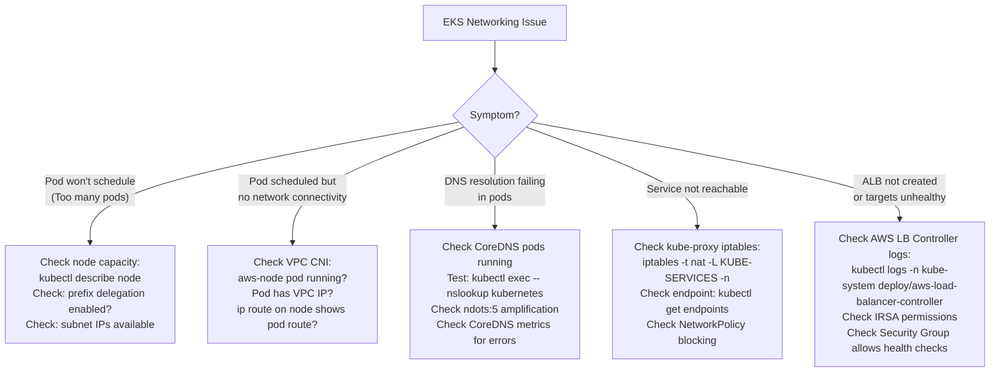

# EKS Networking

> Senior SRE Interview Prep | AWS Networking | Production-Grade Reference

---

## Table of Contents

- [Overview](#overview)
- [EKS Networking Fundamentals](#eks-networking-fundamentals)
  - [Pod Networking Models](#pod-networking-models)
- [VPC CNI (aws-node)](#vpc-cni-aws-node)
  - [Maximum Pods Formula](#maximum-pods-formula)
  - [ENI Management and Warm Pool](#eni-management-and-warm-pool)
- [Prefix Delegation Mode](#prefix-delegation-mode)
  - [Enabling Prefix Delegation](#enabling-prefix-delegation)
- [Security Groups for Pods](#security-groups-for-pods)
  - [SecurityGroupPolicy CRD](#securitygrouppolicy-crd)
  - [Security Groups for Pods: Trade-offs](#security-groups-for-pods-trade-offs)
- [EKS Cluster Endpoint Modes](#eks-cluster-endpoint-modes)
- [CoreDNS in EKS](#coredns-in-eks)
  - [ndots:5 Problem](#ndots5-problem)
  - [Optimization](#optimization)
- [kube-proxy in EKS](#kube-proxy-in-eks)
  - [iptables vs IPVS Mode](#iptables-vs-ipvs-mode)
  - [Disabling kube-proxy for Cilium](#disabling-kube-proxy-for-cilium)
- [AWS Load Balancer Controller](#aws-load-balancer-controller)
  - [IngressClass Annotation](#ingressclass-annotation)
  - [Service (creates NLB)](#service-creates-nlb)
  - [IP Mode vs Instance Mode](#ip-mode-vs-instance-mode)
- [Real-World Production Scenario](#real-world-production-scenario)
  - [Debugging Walkthrough](#debugging-walkthrough)
- [Failure Modes](#failure-modes)
- [Debugging Guide](#debugging-guide)
- [Security Considerations](#security-considerations)
- [Interview Questions](#interview-questions)
  - [Basic](#basic)
  - [Intermediate](#intermediate)
  - [Advanced / Staff Level](#advanced-staff-level)

---

## Overview

EKS (Elastic Kubernetes Service) networking is the intersection of Kubernetes networking abstractions and AWS VPC infrastructure. Unlike other CNI plugins that use overlays, the VPC CNI plugin gives pods real VPC IP addresses — meaning pods are first-class citizens in the VPC routing domain.

This creates unique operational advantages (no overlay overhead, native VPC routing, security group enforcement) and unique failure modes (IP exhaustion, ENI management, prefix delegation complexity).

---

## EKS Networking Fundamentals

> Amazon EKS uses the VPC Container Network Interface (CNI) plugin by default, which assigns each pod a real IP address from the VPC subnet. This means pods are native VPC resources — they are directly addressable by other AWS resources, security groups, and route tables — without requiring overlay networks or NAT translation.
> — [AWS Docs: EKS Networking](https://docs.aws.amazon.com/eks/latest/userguide/eks-networking.html)

EKS nodes are EC2 instances running in VPC subnets. Every node has a primary ENI for node traffic. The VPC CNI (aws-node DaemonSet) manages additional ENIs to provide IP addresses for pods.

### Pod Networking Models

> With the Amazon VPC CNI plugin, every pod receives an IP address from a secondary IPv4 or IPv6 address assigned to an Elastic Network Interface (ENI) on the EC2 worker node. Pods can communicate directly with other pods, EC2 instances, and AWS services using native VPC routing, with no encapsulation overhead.
> — [AWS Docs: Pod Networking](https://docs.aws.amazon.com/eks/latest/userguide/pod-networking.html)



Each pod gets an IP address from a secondary IP on an ENI attached to its node. The pod IP is a real VPC IP — routable from any other resource in the VPC without any overlay or NAT.

---

## VPC CNI (aws-node)

> The Amazon VPC CNI plugin for Kubernetes runs as a DaemonSet (`aws-node`) on each worker node and is responsible for attaching ENIs to nodes, assigning secondary IP addresses to pods, and configuring host-level routing rules so that traffic between pods and other VPC resources flows correctly.
> — [AWS Docs: VPC CNI Plugin](https://docs.aws.amazon.com/eks/latest/userguide/managing-vpc-cni.html)

The VPC CNI runs as a DaemonSet (`aws-node`) in `kube-system`. It is responsible for:
1. Attaching additional ENIs to the node
2. Assigning secondary IPs from those ENIs to pods
3. Setting up network rules (`ip route`, `iptables`) to route pod traffic

### Maximum Pods Formula

```
Max Pods = (Max ENIs per instance type × (IPs per ENI - 1)) + 2
```

The `-1` accounts for the ENI's primary IP (used for the ENI itself, not a pod). The `+2` accounts for the `aws-node` and `kube-proxy` system pods.

**Example: m5.xlarge**
- Max ENIs: 4
- IPs per ENI: 15
- Max pods = (4 × (15 - 1)) + 2 = (4 × 14) + 2 = **58 pods**

This is a hard limit. Attempting to schedule more pods results in `Insufficient cpu` or `0/N nodes are available: N Too many pods` errors.

| Instance Type | Max ENIs | IPs per ENI | Max Pods (standard) |
|---|---|---|---|
| t3.small | 3 | 4 | 11 |
| t3.large | 3 | 12 | 35 |
| m5.large | 3 | 10 | 29 |
| m5.xlarge | 4 | 15 | 58 |
| m5.2xlarge | 4 | 15 | 58 |
| m5.4xlarge | 8 | 30 | 234 |
| c5.9xlarge | 8 | 30 | 234 |

**Why m5.xlarge and m5.2xlarge have the same max pods**: The limit is based on ENI count and IPs per ENI, not CPU/memory. Larger instances with the same ENI limits hit the same pod ceiling despite having more compute resources.

### ENI Management and Warm Pool

> The VPC CNI plugin maintains a warm pool of pre-allocated ENIs and secondary IP addresses on each node to reduce latency when new pods are scheduled. The size of the warm pool is configurable via environment variables on the aws-node DaemonSet, allowing you to balance IP consumption against pod scheduling speed.
> — [AWS Docs: VPC CNI Configuration Variables](https://docs.aws.amazon.com/eks/latest/userguide/cni-env-vars.html)

The VPC CNI maintains a warm pool of pre-allocated ENIs and IPs to avoid cold-start latency when pods are scheduled:

| Environment Variable | Default | Effect |
|---|---|---|
| `WARM_ENI_TARGET` | 1 | Keep this many unused ENIs attached |
| `WARM_IP_TARGET` | N/A | Keep this many unused IPs available |
| `MINIMUM_IP_TARGET` | N/A | Minimum IPs to always maintain |

**Production tuning**: For burst workloads (auto-scaling, batch jobs), set `WARM_IP_TARGET=10` and `MINIMUM_IP_TARGET=5`. This pre-allocates IPs so new pods start instantly. For steady-state workloads, leave defaults to reduce IP usage.

---

## Prefix Delegation Mode

> With IPv4 prefix delegation, the Amazon VPC CNI plugin assigns a /28 IPv4 prefix to each ENI slot instead of a single secondary IP address. This increases the number of pods that a node can host by a factor of 16, enabling higher pod density from the same instance type and subnet CIDR range without changing instance types or subnets.
> — [AWS Docs: Prefix Delegation](https://docs.aws.amazon.com/eks/latest/userguide/cni-increase-ip-addresses.html)

Standard VPC CNI assigns individual IPs — one IP per ENI slot. Prefix delegation assigns an entire /28 CIDR block (16 IPs) per ENI slot, dramatically increasing pod density.

```
Standard mode:  1 ENI slot = 1 IP address
Prefix mode:    1 ENI slot = 1 /28 prefix = 16 IP addresses (15 usable)
```

**Revised max pods formula with prefix delegation:**
```
Max Pods = (Max ENIs × ((IPs per ENI - 1) × 16)) + 2
```

For m5.xlarge: (4 × (15 - 1) × 16) + 2 = (4 × 224) + 2 = **898 pods**

This is sufficient for almost any workload.

### Enabling Prefix Delegation

```bash
# Enable prefix delegation on VPC CNI
kubectl set env daemonset aws-node \
  -n kube-system \
  ENABLE_PREFIX_DELEGATION=true

# Set IP targets (now counts individual IPs, not ENI slots)
kubectl set env daemonset aws-node \
  -n kube-system \
  WARM_PREFIX_TARGET=1
```

**Prerequisites**:
- Node must use Nitro-based instance types (all modern instance families)
- Subnet must have sufficient /28 blocks available (a /24 subnet has 16 non-overlapping /28 prefixes)
- EKS add-on version >= v1.9.0

**Prefix delegation gotcha**: The subnet must have enough contiguous address space for /28 allocations. If your subnet is fragmented (many individual IPs used), AWS may not be able to allocate a /28 prefix even if there are 16+ free IPs. Use dedicated subnets for EKS nodes with prefix delegation.

---

## Security Groups for Pods

> Security groups for pods enable you to assign AWS security groups to individual Kubernetes pods, providing network-level isolation at the pod level rather than the node level. Each pod receives a dedicated branch ENI with the assigned security group, allowing fine-grained inbound and outbound rule enforcement for individual workloads within a shared cluster.
> — [AWS Docs: Security Groups for Pods](https://docs.aws.amazon.com/eks/latest/userguide/security-groups-for-pods.html)

By default, all pods on a node share the node's security group. Security Groups for Pods allows pod-level security group enforcement.



### SecurityGroupPolicy CRD

> The SecurityGroupPolicy custom resource is an Amazon EKS-specific Kubernetes resource that associates a set of AWS security groups with pods matching a label selector within a namespace. When a pod matches the selector, the VPC CNI plugin automatically attaches a dedicated branch ENI with those security groups to the pod.
> — [AWS Docs: SecurityGroupPolicy](https://docs.aws.amazon.com/eks/latest/userguide/security-groups-for-pods.html#security-groups-pods-deployment)

```yaml
apiVersion: vpcresources.k8s.aws/v1beta1
kind: SecurityGroupPolicy
metadata:
  name: backend-pod-sg
  namespace: production
spec:
  podSelector:
    matchLabels:
      app: backend
  securityGroups:
    groupIds:
      - sg-backend-xxx
      - sg-db-client-xxx
```

Pods matching the selector get dedicated branch ENIs with the specified security groups.

### Security Groups for Pods: Trade-offs

| Feature | Supported | Notes |
|---|---|---|
| IPv6 | No | Branch ENIs do not support IPv6 |
| Windows nodes | No | Linux only |
| Custom networking | No | Conflicts with trunk/branch ENI model |
| Calico network policy | No | Incompatible with branch ENI security group enforcement |
| Pod startup latency | Increased | Branch ENI provisioning adds 1-3 seconds |
| Nitro instances required | Yes | All modern instance types qualify |

**When to use**: When regulatory compliance requires pod-level firewall rules (PCI-DSS: only payment service pods can reach payment network), or when multiple tenants share a cluster and strong isolation is required. For general use, Kubernetes NetworkPolicy is simpler and more portable.

---

## EKS Cluster Endpoint Modes

> The Amazon EKS API server endpoint can be configured to be accessible publicly from the internet, privately within the VPC only, or both. The public endpoint can be restricted to specific CIDR ranges, while the private endpoint routes API server traffic through AWS PrivateLink to stay within the VPC network.
> — [AWS Docs: Cluster Endpoint Access](https://docs.aws.amazon.com/eks/latest/userguide/cluster-endpoint.html)

The Kubernetes API server endpoint can be configured in three modes:



| Mode | Pros | Cons |
|---|---|---|
| Public only | Simple; works from anywhere | API server exposed on internet |
| Public + Private | Flexible; CI/CD stays private; devs can access | Default; slight complexity |
| Private only | Maximum security; no internet exposure | Requires VPN or Direct Connect for all access; kubectl from outside VPC needs VPN |

**Production recommendation**: Public + Private with API server endpoint access control (restrict public endpoint to specific CIDR ranges: VPN, bastion, CI/CD runner IPs).

```bash
# Restrict public endpoint to specific CIDRs
aws eks update-cluster-config \
  --name production-cluster \
  --resources-vpc-config \
    endpointPublicAccess=true,\
    endpointPrivateAccess=true,\
    publicAccessCidrs=203.0.113.0/24,198.51.100.0/24
```

---

## CoreDNS in EKS

> CoreDNS is the DNS server deployed by Amazon EKS in the `kube-system` namespace for in-cluster DNS resolution. It handles service discovery (resolving Kubernetes Service names), external name resolution, and can be configured with custom forwarding rules to resolve on-premises domain names via Route 53 Resolver outbound endpoints.
> — [AWS Docs: CoreDNS Add-on](https://docs.aws.amazon.com/eks/latest/userguide/managing-coredns.html)

CoreDNS runs as a Deployment (typically 2 replicas) in `kube-system`. It handles all in-cluster DNS resolution.

### ndots:5 Problem

> Kubernetes configures pods with `ndots:5` in `/etc/resolv.conf` by default, meaning any DNS name with fewer than 5 dots is treated as a relative name and the resolver tries appending each search domain suffix before attempting the name as an absolute (FQDN). This causes multiple failed DNS queries (NXDOMAIN responses) for external domain names, amplifying CoreDNS query load significantly.
> — [Kubernetes Docs: DNS for Services and Pods](https://kubernetes.io/docs/concepts/services-networking/dns-pod-service/#pod-dns-config)

Every Kubernetes pod has `ndots:5` in `/etc/resolv.conf` by default. This causes 5 DNS lookups for a short name like `api.example.com` before resolving correctly:

1. `api.example.com.production.svc.cluster.local` → NXDOMAIN
2. `api.example.com.svc.cluster.local` → NXDOMAIN
3. `api.example.com.cluster.local` → NXDOMAIN
4. `api.example.com` → A 93.184.216.34 (success)

Each NXDOMAIN response is a round-trip to CoreDNS. At high request rates, this multiplies DNS query load by 4x.

### Optimization

```yaml
# Per-pod dnsConfig optimization
spec:
  dnsConfig:
    options:
      - name: ndots
        value: "2"
      - name: single-request-reopen
      - name: timeout
        value: "2"
```

With `ndots:2`, names with 2+ dots are treated as FQDNs first. `api.example.com` (2 dots) resolves directly without search domain appending.

**CoreDNS scaling**: CoreDNS is a bottleneck for large clusters. Each CoreDNS pod handles ~10,000 QPS. For 500+ node clusters with high external DNS traffic:
1. Scale CoreDNS replicas (increase from 2 to `ceil(node_count/50)`)
2. Use NodeLocal DNSCache: runs a DNS cache on each node, intercepting DNS queries before they reach CoreDNS

```yaml
# CoreDNS ConfigMap for EKS with external forwarding to Route 53
data:
  Corefile: |
    .:53 {
        errors
        health
        kubernetes cluster.local in-addr.arpa ip6.arpa {
            pods insecure
            fallthrough in-addr.arpa ip6.arpa
            ttl 30
        }
        prometheus :9153
        forward . 169.254.169.253  # Route 53 Resolver in VPC
        cache 30
        loop
        reload
        loadbalance
    }
```

---

## kube-proxy in EKS

> kube-proxy is a network proxy that runs on each node in a Kubernetes cluster, implementing part of the Kubernetes Service concept. It maintains network rules on nodes that allow network communication to pods from inside or outside of your cluster, programming iptables or IPVS rules based on Service and Endpoint objects watched from the Kubernetes API.
> — [Kubernetes Docs: kube-proxy](https://kubernetes.io/docs/concepts/overview/components/#kube-proxy)

kube-proxy runs as a DaemonSet on every node. It programs iptables (or IPVS) rules to implement Kubernetes Service routing.

### iptables vs IPVS Mode

> kube-proxy can operate in iptables mode (the default) or IPVS mode. In iptables mode, Service rules are implemented as sequential iptables chains with O(n) lookup complexity that degrades at scale. In IPVS mode, rules are stored in an in-kernel hash table with O(1) lookup complexity, supporting thousands of Services with consistent performance.
> — [Kubernetes Docs: IPVS Proxier](https://kubernetes.io/docs/concepts/services-networking/service/#proxy-mode-ipvs)

| Property | iptables (default) | IPVS |
|---|---|---|
| Lookup time | O(n) — traverses all iptables rules | O(1) — hash table |
| Scale | Degrades at 1,000+ services | Handles 10,000+ services |
| Algorithms | Only round-robin | Round-robin, least connections, source hash, etc. |
| Connection tracking | Via conntrack | Has own connection tracking |

**When to switch to IPVS**: Clusters with > 500 services or > 2,000 service endpoints. iptables rule traversal at this scale adds measurable latency.

🧠 **Interview One-liner**

> IPVS is a Linux kernel-based Layer 4 load balancer used by Kubernetes kube-proxy to efficiently route traffic to services using hash-based lookups.

🎯 **When to use IPVS**

**Use when:**

- Large Kubernetes clusters  
- High number of services  
- Need better performance than iptables

### Disabling kube-proxy for Cilium

If using Cilium CNI with kube-proxy replacement enabled, kube-proxy is unnecessary and can be disabled:

```bash
# When installing Cilium with kube-proxy replacement
helm install cilium cilium/cilium \
  --set kubeProxyReplacement=true \
  --set k8sServiceHost=API_SERVER_IP \
  --set k8sServicePort=443
```

Running both kube-proxy and Cilium kube-proxy replacement causes iptables rule conflicts.

---

## AWS Load Balancer Controller

> The AWS Load Balancer Controller is a Kubernetes controller that manages AWS Elastic Load Balancers for a Kubernetes cluster. It provisions Application Load Balancers for Kubernetes Ingress resources and Network Load Balancers for Kubernetes Service resources of type `LoadBalancer`, using IAM Roles for Service Accounts (IRSA) for secure API access.
> — [AWS Docs: AWS Load Balancer Controller](https://docs.aws.amazon.com/eks/latest/userguide/aws-load-balancer-controller.html)

The AWS Load Balancer Controller (formerly ALB Ingress Controller) manages ALBs and NLBs from Kubernetes resources.

### IngressClass Annotation

```yaml
# Ingress (creates ALB)
apiVersion: networking.k8s.io/v1
kind: Ingress
metadata:
  name: app-ingress
  annotations:
    alb.ingress.kubernetes.io/scheme: internet-facing
    alb.ingress.kubernetes.io/target-type: ip
    alb.ingress.kubernetes.io/certificate-arn: arn:aws:acm:...
    alb.ingress.kubernetes.io/ssl-redirect: '443'
    alb.ingress.kubernetes.io/group.name: production  # Share ALB across Ingresses
spec:
  ingressClassName: alb
  rules:
    - host: api.example.com
      http:
        paths:
          - path: /
            pathType: Prefix
            backend:
              service:
                name: api-service
                port:
                  number: 8080
```

### Service (creates NLB)

```yaml
apiVersion: v1
kind: Service
metadata:
  name: tcp-service
  annotations:
    service.beta.kubernetes.io/aws-load-balancer-type: external
    service.beta.kubernetes.io/aws-load-balancer-nlb-target-type: ip
    service.beta.kubernetes.io/aws-load-balancer-scheme: internet-facing
spec:
  type: LoadBalancer
  selector:
    app: tcp-app
  ports:
    - port: 443
      targetPort: 8443
      protocol: TCP
```

### IP Mode vs Instance Mode

> In instance target mode, the AWS Load Balancer Controller registers EC2 instances as targets using their NodePort. In IP target mode, it registers the individual pod IP addresses directly as targets, bypassing kube-proxy and enabling the load balancer to communicate directly with pods for lower-latency routing and preserved client IP addresses.
> — [AWS Docs: Target Type](https://docs.aws.amazon.com/eks/latest/userguide/alb-ingress.html#alb-ingress-annotations)

| Mode | How it works | Use case |
|---|---|---|
| `instance` | ALB targets the node's NodePort; kube-proxy routes to pod | Default; works with any networking |
| `ip` | ALB targets the pod IP directly (bypasses kube-proxy) | Required for Fargate; better with VPC CNI; avoids double NAT |

**IP mode requirement**: The pod must have a VPC-routable IP (VPC CNI). If using a non-VPC CNI with overlay IPs (Weave, Flannel), IP mode does not work.

**IP mode advantage**: Preserves actual client source IP in HTTP headers (via `X-Forwarded-For`). In instance mode, kube-proxy SNAT hides the client IP.

---

## Real-World Production Scenario

**Scenario**: EKS pods running out of IPs — VPC CNI tuning with WARM_IP_TARGET and prefix delegation.

A team reports intermittent pod scheduling failures: `0/10 nodes are available: 10 Too many pods`. The cluster is running m5.xlarge nodes. Pod density per node hits 58 and new pods cannot be scheduled even though nodes have available CPU and memory.

### Debugging Walkthrough

**Step 1: Check pod count per node vs max pods**

```bash
# Check pods per node
kubectl get pods --all-namespaces -o wide | \
  awk '{print $8}' | sort | uniq -c | sort -rn

# Check node capacity and allocatable
kubectl describe node ip-10-0-10-100.ec2.internal | \
  grep -A5 "Capacity:\|Allocatable:"
# Look for: pods: 58 (Capacity) and pods: 58 (Allocatable)
```

**Step 2: Verify the actual IP pool on a node**

```bash
# Check the CNINode resource (VPC CNI v1.12+)
kubectl get cninode ip-10-0-10-100.ec2.internal -o yaml
# Shows: ENIs attached, prefixes assigned, IPs allocated

# Check the ipamd logs directly
kubectl logs -n kube-system -l k8s-app=aws-node --tail=100 | \
  grep -i "ip\|eni\|prefix\|warm"
```

**Step 3: Check subnet IP exhaustion**

The pods-out-of-IPs issue may also be subnet exhaustion (different from node-level exhaustion):

```bash
# Check available IPs in subnets
aws ec2 describe-subnets \
  --filters Name=tag:kubernetes.io/cluster/production,Values=shared \
  --query 'Subnets[*].[SubnetId,CidrBlock,AvailableIpAddressCount]'
# If AvailableIpAddressCount is near 0, subnet is exhausted
```

**Step 4: Enable prefix delegation (long-term fix)**

```bash
# Confirm instances support prefix delegation (Nitro required)
kubectl get nodes -o jsonpath='{.items[*].metadata.labels}' | \
  grep instance-type

# Enable prefix delegation
kubectl set env daemonset aws-node -n kube-system \
  ENABLE_PREFIX_DELEGATION=true \
  WARM_PREFIX_TARGET=1

# Verify - pods should now show higher capacity
# Drain and cycle nodes to pick up new configuration
kubectl drain ip-10-0-10-100.ec2.internal --ignore-daemonsets
# Terminate node via ASG; new node launches with prefix delegation
# New capacity: (4 × (15-1) × 16) + 2 = 898 pods
```

**Step 5: Tune WARM_IP_TARGET for burst workloads**

```bash
# For batch jobs that spin up many pods quickly:
kubectl set env daemonset aws-node -n kube-system \
  WARM_IP_TARGET=10 \
  MINIMUM_IP_TARGET=5

# This keeps 10 IPs pre-allocated per node, reducing pod start latency
# During a burst of 20 new pods:
# - First 10 assign immediately (from warm pool)
# - VPC CNI requests more IPs in background for next burst
```

**Root cause summary**: m5.xlarge hard limit of 58 pods was reached. VPC CNI default settings (no prefix delegation, WARM_ENI_TARGET=1) meant no pre-allocation buffer for bursts. Fix: enable prefix delegation (898 pod capacity), tune WARM_IP_TARGET to reduce scheduling latency.

---

## Failure Modes

| Failure | Symptoms | Detection | Fix |
|---|---|---|---|
| Pod IP exhaustion (node) | "Too many pods" scheduling failure | `kubectl describe node` pods capacity = 0 | Enable prefix delegation; use larger instance types |
| Subnet IP exhaustion | Pods pending; ENI attachment fails | `AvailableIpAddressCount` near 0 | Add secondary CIDR to VPC; create new subnets |
| aws-node DaemonSet not running | All pods fail to start; no IPs assigned | `kubectl get pods -n kube-system -l k8s-app=aws-node` | Investigate aws-node pod crash; check IRSA permissions |
| CoreDNS overloaded | DNS timeouts; ndots:5 amplification | CoreDNS `core_dns_requests_total` metric spike | Scale CoreDNS replicas; deploy NodeLocal DNSCache |
| Security group for pods ENI throttling | Pod startup latency 10-30 seconds | CloudWatch: EC2 `NetworkInterfaceViolations` | Reduce Security Groups for Pods scope; use node-level SGs |
| kube-proxy iptables rule growth | Service creation/deletion slow; high node CPU | iptables rule count > 10K; `perf` showing iptables overhead | Switch to IPVS mode or migrate to Cilium kube-proxy replacement |
| ALB Controller IRSA misconfigured | Ingress creates ALB but targets never register | Controller logs: "AccessDenied" | Fix IAM role trust policy for service account |
| Private cluster endpoint inaccessible | kubectl fails outside VPC | `kubectl` timeout; no VPN/DX | Add VPN/Direct Connect or enable public endpoint with IP restriction |

---

## Debugging Guide



---

## Security Considerations

1. **Use Security Groups for Pods for sensitive workloads**: PCI-DSS and HIPAA workloads should use pod-level security groups to enforce network segmentation at the ENI level
2. **Private cluster endpoint with IP restrictions**: Never leave the API server public without CIDR restrictions; ideally private-only with VPN access
3. **Restrict ENI creation via IAM**: VPC CNI uses IRSA (IAM Role for Service Accounts); scope the IAM policy to only allow ENI operations in specific subnets and with specific tags
4. **Dedicated subnets for EKS nodes**: Separate from other VPC resources; easier to scope NACLs and security groups; required for prefix delegation to work efficiently
5. **Enable Pod Security Standards**: Use `baseline` for all namespaces and `restricted` for critical namespaces — prevents privileged pods that could bypass network controls
6. **Network Policies with Calico or Cilium**: Default-deny NetworkPolicy for all namespaces; explicit allow rules for required paths; VPC CNI native network policy (beta) as an alternative
7. **CoreDNS security**: Disable the CoreDNS `/health` endpoint external exposure; restrict CoreDNS pod security context; monitor for DNS amplification or tunneling

---

## Interview Questions

### Basic

**Q: Why do EKS pods with VPC CNI have real VPC IP addresses instead of an overlay network?**

A: VPC CNI assigns secondary IPs from ENIs attached to the EC2 node directly to pods. These are real IPs within the VPC subnet — no encapsulation, no overlay. The benefit is that pods are first-class VPC citizens: they can be targeted directly by security groups, NACLs, and route tables. The trade-off is that pod density is limited by ENI and IP limits per instance type, and pods consume IPs from the VPC subnet.

**Q: What is the maximum pod limit on an m5.large instance with standard VPC CNI?**

A: (3 ENIs × (10 IPs per ENI - 1)) + 2 = (3 × 9) + 2 = 29 pods. With prefix delegation: (3 × (10-

1. ×
2. + 2 = 434 pods.

**Q: What does ndots:5 mean and why is it a problem?**

A: `ndots:5` in `/etc/resolv.conf` means names with fewer than 5 dots are treated as short names, triggering search domain appending before trying the name as-is. For external names like `api.example.com` (2 dots), the resolver tries 3-4 search domain combinations (NXDOMAIN each) before resolving the actual name. Each failure is a round-trip to CoreDNS. At high request rates, this causes 4x DNS query amplification and CoreDNS overload.

### Intermediate

**Q: A node has available CPU and memory but pods are failing to schedule with "Too many pods." How do you fix this?**

A: The pod limit is per instance type (ENI count × IPs per ENI - 1 + 2). For m5.xlarge it's 58 pods. Solutions:

1. Enable prefix delegation on VPC CNI — /28 blocks per ENI slot increase capacity to 898 pods on m5.xlarge
2. Use larger instances with more ENIs (m5.4xlarge: 234 pods, m5.24xlarge: 737 pods)
3. Switch to instance types with more IPs per ENI
4. Reduce pod count via rightsizing — many over-provisioned pods. Prefix delegation is usually the right first step — it's a configuration change, not a node replacement.

**Q: How does the AWS Load Balancer Controller differ between IP mode and instance mode for ALB targets?**

A: 
Instance mode: ALB targets the EC2 node's NodePort. Traffic goes ALB → Node (any node) → kube-proxy (iptables) → Pod. Source IP is NAT'd by kube-proxy. Instance mode works with any CNI. 

IP mode: ALB targets the pod IP directly (requires VPC CNI for routable pod IPs). Traffic goes ALB → Pod (direct). Preserves client source IP in `X-Forwarded-For`. Bypasses kube-proxy's SNAT. Required for Fargate (no NodePort concept). IP mode is preferred for EKS clusters using VPC CNI.

### Advanced / Staff Level

**Q: Your EKS cluster has 200 nodes and is experiencing CoreDNS latency spikes that correlate with batch job deployments. How do you investigate and fix it?**

A: Investigation:

1. CoreDNS Prometheus metrics on `:9153` — check `coredns_dns_request_duration_seconds` histogram spikes; look at `coredns_dns_requests_total` by type (A, AAAA, errors).
2. Identify ndots:5 amplification: if batch jobs make many external DNS calls to `api.external.com` (2 dots), each call generates 4 CoreDNS queries instead of 1.
3. Check if batch job pods have dnsConfig optimization. Fix strategy:
4. Deploy NodeLocal DNSCache — a DaemonSet running a DNS cache on each node (using 169.254.20.10 link-local IP); this intercepts DNS queries before they reach CoreDNS, handling cache hits locally
5. Scale CoreDNS during batch windows using KEDA or a scheduled HPA
6. Add `ndots:2` to all batch job pod specs
7. Use FQDNs with trailing dots in batch job configurations. NodeLocal DNSCache typically reduces CoreDNS load by 60-70% by serving cached responses locally.

**Q: Design an EKS network architecture for a multi-tenant platform where different tenant pods must have strict network isolation, separate security group policies, and shared cluster infrastructure.**

A: Namespace-per-tenant model with Defense-in-Depth:

1. VPC CNI with Security Groups for Pods — each tenant namespace has a dedicated security group; pods in that namespace get the tenant SG via SecurityGroupPolicy CRD; tenants cannot communicate directly even on the same node.
2. Kubernetes NetworkPolicy — default-deny in each namespace; explicit allow for intra-tenant traffic; deny cross-tenant traffic at L3/L4.
3. Cilium as CNI — enables L7 NetworkPolicy (HTTP method/path level) for API-level isolation; provides native network observability per tenant.
4. Separate node groups per tenant tier (Spot for batch, On-Demand for production) with node selectors and taints/tolerations; tenant workloads are physically separated on different nodes, eliminating cross-pod attack surface.
5. Separate ALBs per tenant (using ALB group.name annotation to segregate) so load balancer logs and WAF rules are tenant-scoped.
6. OPA/Gatekeeper policies enforce namespace-based network policy requirements — new namespaces automatically get default-deny NetworkPolicy applied via admission webhook.


