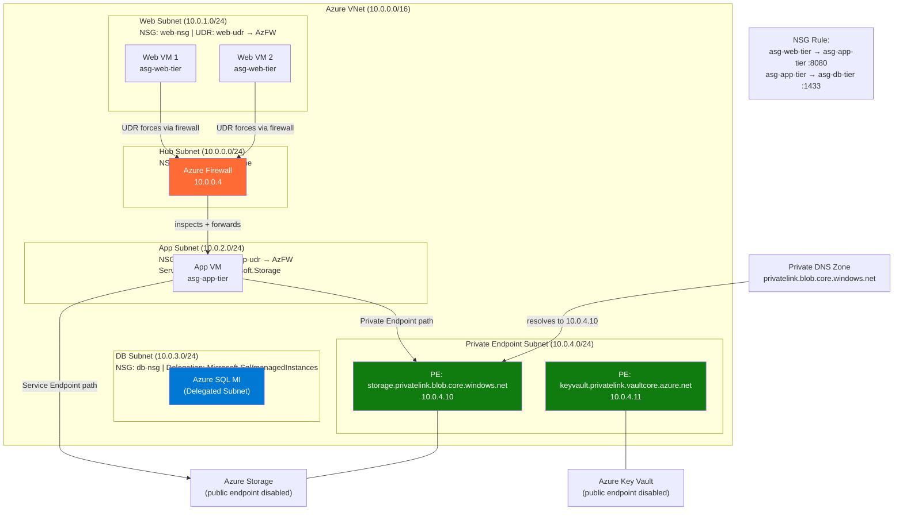

# Azure VNet Fundamentals

## Table of Contents

- [Overview](#overview)
- [VNet Address Space and Subnet Reservations](#vnet-address-space-and-subnet-reservations)
  - [Multiple CIDR Blocks on a VNet](#multiple-cidr-blocks-on-a-vnet)
- [Network Security Groups (NSGs)](#network-security-groups-nsgs)
  - [NSG Attachment Points](#nsg-attachment-points)
  - [Priority System](#priority-system)
  - [NSG Service Tags](#nsg-service-tags)
- [Application Security Groups (ASGs)](#application-security-groups-asgs)
- [Subnet Delegation](#subnet-delegation)
- [User-Defined Routes (UDRs)](#user-defined-routes-udrs)
  - [Key Next-Hop Types](#key-next-hop-types)
  - [UDR for NVA Hairpinning](#udr-for-nva-hairpinning)
- [Azure DNS](#azure-dns)
  - [Private DNS Zones](#private-dns-zones)
  - [Split-Horizon DNS](#split-horizon-dns)
- [Service Endpoints vs Private Endpoints](#service-endpoints-vs-private-endpoints)
  - [Service Endpoints](#service-endpoints)
  - [Private Endpoints](#private-endpoints)
  - [Comparison](#comparison)
- [Architecture Diagram](#architecture-diagram)
- [Real-World Production Scenario](#real-world-production-scenario)
  - ["AKS Pod Cannot Reach Azure Storage — Service Endpoint vs Private Endpoint Confusion"](#aks-pod-cannot-reach-azure-storage-service-endpoint-vs-private-endpoint-confusion)
- [Failure Modes](#failure-modes)
- [Debugging Guide](#debugging-guide)
  - [Step 1: Azure Network Watcher — IP Flow Verify](#step-1-azure-network-watcher-ip-flow-verify)
  - [Step 2: Effective Routes](#step-2-effective-routes)
  - [Step 3: Effective NSG Rules](#step-3-effective-nsg-rules)
  - [Step 4: NSG Flow Logs](#step-4-nsg-flow-logs)
  - [Step 5: Private Endpoint DNS Verification](#step-5-private-endpoint-dns-verification)
- [Security Considerations](#security-considerations)
- [Interview Questions](#interview-questions)
  - [Basic](#basic)
  - [Intermediate](#intermediate)
  - [Advanced / Staff Level](#advanced-staff-level)

---

## Overview

Azure Virtual Network (VNet) is the fundamental building block of Azure networking. Unlike AWS VPCs where you get one CIDR block, Azure VNets support multiple CIDR blocks assigned to the same VNet — a key architectural flexibility that matters when you need non-contiguous address space or are expanding an existing VNet without downtime.

Understanding VNet internals is not just about knowing the concepts — a Senior SRE must know exactly how Azure reserves addresses, how NSG priority conflicts manifest in production outages, and why choosing between Service Endpoints and Private Endpoints has security consequences that bite teams six months later.

---

## VNet Address Space and Subnet Reservations

> When you create a subnet in an Azure Virtual Network, Azure reserves five IP addresses within the subnet's CIDR range. These reserved addresses include the network address, Azure's default gateway, the Azure DNS resolver (two addresses), and the broadcast address, leaving the remaining addresses for your resources.
> — [Azure Docs: Azure VNet Subnets](https://learn.microsoft.com/azure/virtual-network/virtual-networks-faq#are-there-any-restrictions-on-using-ip-addresses-within-these-subnets)

Azure reserves 5 IP addresses in every subnet — the same count as AWS but at different positions:

| Offset | Purpose |
|--------|---------|
| `.0` | Network address |
| `.1` | Default gateway (Azure-managed) |
| `.2` | Azure DNS resolver |
| `.3` | Azure DNS resolver (secondary) |
| `.255` | Broadcast address |

A `/29` subnet gives you only 3 usable IPs (8 - 5 = 3). For AKS node pools or large workloads, undersized subnets are a production killer. Always calculate: `2^(32-prefix) - 5`.

### Multiple CIDR Blocks on a VNet

> Azure Virtual Networks support multiple address spaces, allowing you to associate more than one CIDR block with a single VNet. You can add additional address spaces to an existing VNet without recreating it, enabling you to expand capacity or accommodate non-contiguous IP ranges from different organizational units or acquisitions.
> — [Azure Docs: Create, Change, or Delete a Virtual Network](https://learn.microsoft.com/azure/virtual-network/manage-virtual-network)

Azure VNets support adding multiple address spaces. This allows:
- Expanding a VNet without recreating it (add a new `/16` alongside the original)
- Non-contiguous ranges when you've inherited conflicting IP schemes from acquisitions
- Peering with partners who already hold part of your original range

```bash
# Add a second CIDR block to existing VNet
az network vnet update \
  --resource-group prod-rg \
  --name prod-vnet \
  --add addressSpace.addressPrefixes "172.20.0.0/16"
```

---

## Network Security Groups (NSGs)

> A Network Security Group (NSG) in Azure contains security rules that allow or deny inbound or outbound network traffic to resources in an Azure Virtual Network. NSGs operate at Layer 4 and are stateful, meaning return traffic for allowed connections is automatically permitted without the need to write explicit reverse rules.
> — [Azure Docs: Network Security Groups](https://learn.microsoft.com/azure/virtual-network/network-security-groups-overview)

NSGs are stateful L4 firewalls. "Stateful" means return traffic for an established connection is automatically allowed — you do not write a reverse rule. This is a common interview trap: if you allow TCP 443 inbound, the response traffic on ephemeral ports outbound is automatically permitted.

### NSG Attachment Points

NSGs can be applied at two levels:
- **Subnet**: Applies to all traffic entering/leaving the subnet
- **NIC (Network Interface Card)**: Applies to the specific VM's NIC

When both are applied, traffic must pass BOTH NSGs. Inbound traffic hits the subnet NSG first, then the NIC NSG. Outbound hits NIC NSG first, then subnet NSG.

### Priority System

> NSG security rules are evaluated and applied based on the priority number assigned to each rule. Rules with lower priority numbers are processed before rules with higher priority numbers. The first matching rule is applied and no subsequent rules are evaluated. Priority numbers range from 100 (highest priority) to 4096 (lowest priority).
> — [Azure Docs: NSG Rule Priority](https://learn.microsoft.com/azure/virtual-network/network-security-groups-overview#security-rules)

Priority ranges from **100 to 4096**. Lower number = higher priority = evaluated first. Rules are evaluated in priority order and the first match wins — subsequent rules are not evaluated.

| Priority | Rule Name | Source | Dest | Port | Action |
|----------|-----------|--------|------|------|--------|
| 65000 | AllowVnetInBound | VirtualNetwork | VirtualNetwork | Any | Allow |
| 65001 | AllowAzureLoadBalancerInBound | AzureLoadBalancer | Any | Any | Allow |
| 65500 | DenyAllInBound | Any | Any | Any | Deny |

**Production failure pattern**: Team adds a `DenyAllInbound` rule at priority 1000, forgetting that Azure Load Balancer health probes come from the `AzureLoadBalancer` service tag. The built-in rule at 65001 allows LB probes, but the custom deny at 1000 hits first, dropping health probes and taking all backends out of rotation.

### NSG Service Tags

> Service tags represent groups of IP address prefixes from a given Azure service. Microsoft manages the address prefixes encompassed by the service tag and automatically updates the tag as addresses change, minimizing the complexity of frequent updates to network security rules and avoiding the need to hardcode lists of Azure service IP addresses.
> — [Azure Docs: Service Tags](https://learn.microsoft.com/azure/virtual-network/service-tags-overview)

Service tags represent groups of IP prefixes managed by Microsoft. Avoid hardcoding IPs:

```
AzureLoadBalancer   - Azure LB health probe source
VirtualNetwork      - all VNet address space + peered VNets
Internet            - everything outside VNet
AzureCloud          - all Azure datacenter IPs
Storage.EastUS      - Azure Storage in East US region
```

---

## Application Security Groups (ASGs)

> Application Security Groups (ASGs) enable you to configure network security as a natural extension of an application’s structure, grouping virtual machines by function (e.g., web tier, database tier) and using those groups as sources or destinations in NSG rules. This eliminates the need to maintain lists of IP addresses and allows security policies to scale automatically as the application grows.
> — [Azure Docs: Application Security Groups](https://learn.microsoft.com/azure/virtual-network/application-security-groups)

ASGs let you group VMs by role and use those groups as source/destination in NSG rules — eliminating IP address maintenance entirely.

Without ASGs, an NSG rule allowing web tier to access DB tier looks like:
- Source: `10.1.1.0/24` → Dest: `10.1.2.0/24` on port 5432

With ASGs:
- Source: `asg-web-tier` → Dest: `asg-db-tier` on port 5432

When a VM is scaled out, you add its NIC to the ASG — no NSG rule changes required. When an IP changes due to redeployment, the ASG membership still applies.

```bash
# Create ASGs
az network asg create -g prod-rg -n asg-web-tier
az network asg create -g prod-rg -n asg-db-tier

# Associate NIC with ASG
az network nic ip-config update \
  --resource-group prod-rg \
  --nic-name web-vm-nic \
  --name ipconfig1 \
  --application-security-groups asg-web-tier

# Create NSG rule using ASGs
az network nsg rule create \
  --resource-group prod-rg \
  --nsg-name prod-nsg \
  --name AllowWebToDb \
  --priority 200 \
  --source-asgs asg-web-tier \
  --destination-asgs asg-db-tier \
  --destination-port-ranges 5432 \
  --protocol Tcp \
  --access Allow
```

---

## Subnet Delegation

> Subnet delegation gives explicit permissions to an Azure service to create service-specific resources in a subnet, enabling the service to establish its own network policies within that subnet. A delegated subnet is exclusively reserved for the designated service and cannot host other resource types simultaneously.
> — [Azure Docs: Subnet Delegation](https://learn.microsoft.com/azure/virtual-network/subnet-delegation-overview)

Subnet delegation is Azure's mechanism for dedicating a subnet to a specific managed service. When you delegate a subnet, the Azure service can inject NICs, manage routes, and apply its own NSG-equivalent policies within that subnet.

Common delegations:
| Service | Delegation Name |
|---------|----------------|
| AKS | `Microsoft.ContainerService/managedClusters` |
| Azure SQL Managed Instance | `Microsoft.Sql/managedInstances` |
| Azure App Service | `Microsoft.Web/serverFarms` |
| Azure Firewall | `AzureFirewallSubnet` (no delegation, but reserved name) |
| Azure Bastion | `AzureBastionSubnet` (reserved name) |

**Important**: A delegated subnet cannot be used for other resources. SQL MI requires a `/28` minimum dedicated subnet. AKS with kubenet uses the node subnet; Azure CNI requires either a large subnet or Azure CNI Overlay.

---

## User-Defined Routes (UDRs)

> User-defined routes (UDRs) allow you to override Azure's default system routes to control how traffic is routed between subnets in a VNet, between VNets, and to on-premises or external destinations. Each route specifies a next-hop type and, when applicable, a next-hop IP address such as a network virtual appliance (NVA) private IP.
> — [Azure Docs: User-Defined Routes](https://learn.microsoft.com/azure/virtual-network/virtual-networks-udr-overview)

Azure automatically creates system routes for VNet communication. UDRs override these defaults to force traffic through Network Virtual Appliances (NVAs) like Azure Firewall or third-party firewalls (Palo Alto, Fortinet).

### Key Next-Hop Types

| Next Hop | Use Case |
|----------|----------|
| `VirtualAppliance` | Route through NVA/firewall — provide NVA private IP |
| `VirtualNetworkGateway` | Send to VPN/ExpressRoute gateway |
| `Internet` | Force to public internet (bypass private routes) |
| `None` | Drop traffic (black hole route) |
| `VirtualNetwork` | Keep within VNet (rarely needed explicitly) |

### UDR for NVA Hairpinning

> A common pattern for centralizing network inspection is to force all subnet traffic through a Network Virtual Appliance (NVA) such as Azure Firewall using a UDR with a `VirtualAppliance` next hop. All traffic — including east-west subnet traffic and internet-bound traffic — is redirected to the NVA's private IP for inspection before being forwarded to its destination.
> — [Azure Docs: Route Network Traffic with a Route Table](https://learn.microsoft.com/azure/virtual-network/tutorial-create-route-table-portal)

The canonical pattern: all spoke traffic must traverse Azure Firewall in the hub before reaching other spokes or the internet.

```bash
# UDR on spoke subnet: send all traffic to Azure Firewall
az network route-table route create \
  --resource-group prod-rg \
  --route-table-name spoke-udr \
  --name default-to-firewall \
  --address-prefix 0.0.0.0/0 \
  --next-hop-type VirtualAppliance \
  --next-hop-ip-address 10.0.0.4  # Azure Firewall private IP
```

**Production trap**: Asymmetric routing with UDRs. If you route outbound through a firewall but return traffic takes a different path (because the source has no UDR), TCP sessions drop. The firewall sees SYN but not SYN-ACK, or vice versa.

---

## Azure DNS

### Private DNS Zones

> Azure Private DNS provides a reliable, secure DNS service to manage and resolve domain names in a virtual network without the need to add a custom DNS solution. You can link private DNS zones to VNets to enable name resolution for resources within those VNets, with optional auto-registration to create DNS records for VMs automatically.
> — [Azure Docs: Azure Private DNS](https://learn.microsoft.com/azure/dns/private-dns-overview)

Azure Private DNS allows you to use custom domain names (e.g., `internal.contoso.com`) within VNets without managing DNS servers.

- A Private DNS Zone is a global resource — not tied to a region
- It must be linked to VNets to be resolvable from those VNets
- **Autoregistration**: when enabled on a VNet link, Azure automatically creates DNS records for VMs in that VNet

```bash
az network private-dns zone create \
  -g prod-rg \
  -n "internal.contoso.com"

az network private-dns link vnet create \
  -g prod-rg \
  -n prod-vnet-link \
  -z "internal.contoso.com" \
  -v prod-vnet \
  --registration-enabled true  # autoregistration
```

### Split-Horizon DNS

> Split-horizon DNS in Azure is achieved by creating both a public DNS zone and a private DNS zone for the same domain name. Resources within VNets linked to the private zone receive internal IP addresses, while external clients receive the public IP address — enabling the same FQDN to route traffic differently based on the origin of the DNS query.
> — [Azure Docs: Private DNS Zone Split-Horizon](https://learn.microsoft.com/azure/dns/private-dns-scenarios#scenario-split-horizon-functionality)

Same domain resolves differently inside vs outside Azure:
- Public: `api.contoso.com` → `203.0.113.50` (public IP, goes through WAF)
- Private: `api.contoso.com` → `10.1.0.10` (private IP, stays on backbone)

Implementation: Create a Private DNS Zone with the same name as the public domain, linked to internal VNets. Azure DNS resolves private zone records for linked VNets, public DNS for everyone else.

---

## Service Endpoints vs Private Endpoints

> Azure provides two mechanisms to restrict access to PaaS services to private network traffic. Service Endpoints extend VNet subnet identity to the PaaS service without creating a private IP, while Private Endpoints provision a private network interface within your VNet that maps to a specific PaaS resource — enabling the public endpoint to be fully disabled and providing stronger isolation.
> — [Azure Docs: Compare Private Endpoints and Service Endpoints](https://learn.microsoft.com/azure/virtual-network/vnet-integration-for-azure-services)

This distinction is critical and frequently tested at staff level interviews.

### Service Endpoints

Service Endpoints extend the VNet's identity to Azure PaaS services. The PaaS service learns the VNet's subnet ID and allows access from it.

- Traffic leaves the VNet subnet but stays on Azure's backbone — NOT on the public internet
- The PaaS service's public endpoint is used, but restricted to allowed VNets/subnets
- No private IP is created; the storage account's FQDN still resolves to a public IP
- Firewall rules on the storage account say: "allow from subnet X in VNet Y"

```bash
# Enable service endpoint on subnet
az network vnet subnet update \
  -g prod-rg -n app-subnet -vnet-name prod-vnet \
  --service-endpoints Microsoft.Storage

# Allow specific subnet on storage account
az storage account network-rule add \
  -g prod-rg -n prodstorage \
  --vnet-name prod-vnet \
  --subnet app-subnet
```

### Private Endpoints

> A private endpoint is a network interface that uses a private IP address from your virtual network. It connects you privately and securely to a service powered by Azure Private Link. By creating a private endpoint, you bring the service into your VNet, requiring DNS configuration to override the service's public FQDN with the private IP address.
> — [Azure Docs: Private Endpoints](https://learn.microsoft.com/azure/private-link/private-endpoint-overview)

Private Endpoints place a private NIC with a private IP into your VNet that maps to a specific Azure PaaS resource. DNS for the resource's FQDN is overridden to return the private IP.

- The storage account FQDN resolves to `10.1.0.50` inside your VNet (via Private DNS Zone)
- Traffic never uses the public endpoint at all
- The storage account can have its public endpoint disabled entirely
- Stronger isolation: even if someone gains access to a different subnet in your subscription, they cannot reach this storage account via its private endpoint unless they're in the approved VNet

### Comparison

| Dimension | Service Endpoint | Private Endpoint |
|-----------|-----------------|-----------------|
| Private IP in VNet | No | Yes |
| DNS override | No | Yes (required) |
| Public endpoint disabled | No | Yes (optional) |
| Cross-tenant access | No | Yes |
| Cross-region | No | Yes |
| Cost | Free | ~$7/month per endpoint |
| Data exfiltration prevention | Partial | Stronger |

---

## Architecture Diagram



---

## Real-World Production Scenario

### "AKS Pod Cannot Reach Azure Storage — Service Endpoint vs Private Endpoint Confusion"

**The Setup**: A team migrated their application to AKS. The storage account was previously accessed from VMs using Service Endpoints on the app subnet. The AKS nodes are on a new subnet (`aks-nodes-subnet`). Pods are deployed with Azure CNI (each pod gets a VNet IP from the AKS subnet). The app works fine in dev but fails silently in prod — HTTP 403 from the storage SDK.

**Timeline of Investigation**:

1. **Check NSG on AKS subnet** — NSG allows outbound on 443, no immediate block visible
2. **Check storage account network rules** — Service Endpoint is configured for `app-subnet` only. The `aks-nodes-subnet` is NOT listed
3. **Misdiagnosis**: Team adds `aks-nodes-subnet` to the storage account's allowed list and enables Service Endpoint on the subnet. App works — but only when pods land on a node; pod-originated traffic still gets 403

**Root Cause**: With Azure CNI, each pod has its own VNet IP from the AKS subnet. Service Endpoints are tied to the subnet the traffic originates from. However, the storage account network rules check the source subnet of the TCP connection. Pod traffic originates from pod IPs in the AKS subnet — which IS the same subnet as the nodes. This should work... unless the AKS subnet is different from what was configured.

**Actual root cause revealed**: Two AKS node pools were configured. The second node pool (`gpu-nodepool`) uses a different subnet (`aks-gpu-subnet`) that was never added to the storage network rules.

**Fix and Improvement Path**:
```bash
# Short-term: add GPU subnet
az network vnet subnet update \
  -g prod-rg -n aks-gpu-subnet -vnet-name prod-vnet \
  --service-endpoints Microsoft.Storage

az storage account network-rule add \
  -g prod-rg -n prodstorage \
  --vnet-name prod-vnet --subnet aks-gpu-subnet

# Long-term: migrate to Private Endpoint
# Private Endpoint doesn't require per-subnet rules — any VNet IP can reach it
az network private-endpoint create \
  -g prod-rg -n pe-prodstorage \
  --vnet-name prod-vnet --subnet pe-subnet \
  --private-connection-resource-id /subscriptions/.../storageAccounts/prodstorage \
  --group-id blob \
  --connection-name storage-pe-conn
```

**Why Private Endpoint eliminates this class of failure**: A Private Endpoint creates a private IP in the VNet. Any traffic within the VNet (or peered VNets, or via VPN/ExpressRoute) that can reach `10.0.4.10` reaches storage. There's no subnet whitelist to maintain. Add a new node pool? New subnet? Doesn't matter — as long as routing reaches the PE subnet.

---

## Failure Modes

| Failure | Symptoms | Detection | Fix |
|---------|----------|-----------|-----|
| NSG rule shadowed by lower-priority deny | Connection refused/timeout to specific service; other traffic works | `az network watcher flow-log` + NSG flow logs in Log Analytics | Adjust priority ordering; check for blanket deny rules |
| UDR missing for return traffic | Asymmetric routing; TCP sessions reset after 3-way handshake | `az network watcher packet-capture`, tcpdump on NVA | Add UDR to the return path subnet |
| Service Endpoint missing on new subnet | HTTP 403 from Azure PaaS | `az storage account network-rule list` | Add Service Endpoint to new subnet + update PaaS firewall rules |
| Private Endpoint DNS not overriding | FQDN resolves to public IP; traffic hits public endpoint | `nslookup storageaccount.blob.core.windows.net` from inside VNet | Create Private DNS Zone + VNet link |
| Subnet delegation conflict | Cannot deploy service; portal shows "subnet in use" | `az network vnet subnet show` → check delegations | Use a dedicated subnet for each delegated service |
| NSG blocking Azure LB health probes | All backends show unhealthy; no user traffic forwarded | Azure Monitor LB health probe metrics; NSG flow logs | Add allow rule for `AzureLoadBalancer` service tag before deny-all |
| Private Endpoint NIC policy blocking | Private Endpoint unreachable even with correct DNS | `az network vnet subnet show --query privateEndpointNetworkPolicies` | Set `privateEndpointNetworkPolicies` to `Disabled` on PE subnet |

---

## Debugging Guide

### Step 1: Azure Network Watcher — IP Flow Verify

Instantly tells you if an NSG is blocking a specific traffic flow:
```bash
az network watcher test-ip-flow \
  --vm prod-vm \
  --direction Inbound \
  --protocol TCP \
  --local 10.0.1.10:443 \
  --remote 1.2.3.4:52000 \
  --resource-group prod-rg
```
Output: `Access: Allow` or `Access: Deny` with the NSG rule name that matched.

### Step 2: Effective Routes

Shows the merged system + UDR routes for a specific NIC:
```bash
az network nic show-effective-route-table \
  --resource-group prod-rg \
  --name prod-vm-nic \
  --output table
```
Look for unexpected `None` (black hole) entries or missing default routes.

### Step 3: Effective NSG Rules

Shows the merged NSG rules (both subnet-level and NIC-level) in priority order:
```bash
az network nic list-effective-nsg \
  --resource-group prod-rg \
  --name prod-vm-nic
```

### Step 4: NSG Flow Logs

Enable flow logs on NSGs and stream to Log Analytics:
```bash
az network watcher flow-log create \
  --resource-group prod-rg \
  --name prod-nsg-flowlog \
  --nsg prod-nsg \
  --storage-account /subscriptions/.../storageAccounts/flowlogsa \
  --enabled true \
  --retention 30 \
  --log-version 2
```

Query in Log Analytics:
```kusto
AzureNetworkAnalytics_CL
| where SubType_s == "FlowLog"
| where SrcIP_s == "10.0.1.10"
| where FlowStatus_s == "D"  // Denied flows
| summarize count() by NSGRule_s, DestIP_s, DestPort_d
```

### Step 5: Private Endpoint DNS Verification

```bash
# From inside VNet — should return private IP
nslookup prodstorage.blob.core.windows.net

# Expected:
# Non-authoritative answer:
# prodstorage.blob.core.windows.net  canonical name = prodstorage.privatelink.blob.core.windows.net
# Address: 10.0.4.10

# If still returning public IP:
az network private-dns zone list -g prod-rg
az network private-dns link vnet list -g prod-rg -z "privatelink.blob.core.windows.net"
az network private-dns record-set a list -g prod-rg -z "privatelink.blob.core.windows.net"
```

---

## Security Considerations

**NSG as defense layer, not perimeter**: NSGs are not a replacement for application-layer controls. A misconfigured NSG rule — especially one accidentally using `Any` for source — exposes entire subnets. Pair NSGs with Azure Defender for Network and Azure Policy to enforce NSG requirements.

**Service Endpoint data exfiltration risk**: Service Endpoints allow traffic from your subnet to ANY Azure storage account in the service — including attacker-owned ones. An attacker who compromises a VM can exfiltrate data to their storage account in another subscription. Mitigation: use Service Endpoint Policies to restrict which specific storage accounts are reachable.

```bash
az network service-endpoint policy create \
  -g prod-rg -n restrict-to-prod-storage
az network service-endpoint policy-definition create \
  -g prod-rg --policy-name restrict-to-prod-storage \
  -n allow-prod-storage \
  --service Microsoft.Storage \
  --service-resources /subscriptions/PROD_SUB_ID/resourceGroups/prod-rg/providers/Microsoft.Storage/storageAccounts/prodstorage
```

**Private Endpoint NIC policy**: By default, NSGs and UDRs do not apply to Private Endpoint NICs (they bypass NSG). This can be surprising. To enforce NSG rules on PE NICs, set `privateEndpointNetworkPolicies: Enabled` on the subnet.

**VNet flow logs for compliance**: NSG Flow Logs v2 include traffic analytics that can detect anomalous lateral movement patterns. Required for many compliance frameworks (PCI-DSS, HIPAA). Store with immutability policies on the storage account.

**Subnet sizing and segmentation**: Over-large subnets reduce your blast radius control. A compromised VM in a `/16` subnet can reach thousands of other workloads. Right-size subnets for workload isolation, and use NSGs + ASGs for micro-segmentation within subnets.

---

## Interview Questions

### Basic

**Q: How many IP addresses does Azure reserve in a subnet, and which ones?**
A: 5 addresses: `.0` (network), `.1` (default gateway), `.2` and `.3` (Azure DNS), `.255` (broadcast). A `/29` subnet has 3 usable IPs.

**Q: What is the difference between applying an NSG to a subnet vs a NIC?**
A: Both can be applied simultaneously. Inbound traffic hits subnet NSG first, then NIC NSG. Outbound hits NIC NSG first, then subnet NSG. Traffic must pass both.

**Q: What are the default NSG rules that Azure creates and why do they matter?**
A: AllowVnetInBound (65000), AllowAzureLoadBalancerInBound (65001), DenyAllInBound (65500). The LB rule matters because health probes come from the `AzureLoadBalancer` service tag — blocking this causes all backends to appear unhealthy.

**Q: What is subnet delegation?**
A: Dedicating a subnet exclusively to a specific Azure managed service (e.g., Azure SQL MI, AKS). The service can inject NICs and manage routing within that subnet. Other resources cannot use a delegated subnet.

### Intermediate

**Q: Explain the difference between Service Endpoints and Private Endpoints. When would you choose each?**
A: Service Endpoints extend VNet subnet identity to PaaS services — traffic uses Azure backbone but the PaaS service's public endpoint. No private IP is created. Private Endpoints place a private NIC in your VNet — DNS overrides the FQDN to a private IP, and the public endpoint can be disabled. Choose Private Endpoints for stronger isolation, cross-tenant/cross-region access, and when you need public endpoint disabled. Service Endpoints are free and sufficient when same-region, same-subscription access is acceptable and you don't need the public endpoint disabled.

**Q: How does NSG statefulness work for return traffic?**
A: NSGs track connection state. If you allow inbound TCP 443, the stateful engine allows the return traffic on ephemeral ports automatically without an explicit outbound rule. The state table tracks the 5-tuple (src IP, dst IP, src port, dst port, protocol).

**Q: You have a UDR routing `0.0.0.0/0` to an Azure Firewall NVA. A developer reports their VM can't SSH to another VM in the same subnet. What could cause this?**
A: UDRs apply to traffic leaving the subnet, not traffic within the same subnet. Intra-subnet traffic uses VNet's built-in routing, bypassing UDRs. If SSH between same-subnet VMs fails, the issue is NSG, not UDR. However, if the VMs are in different subnets and the UDR routes traffic through the firewall, the firewall may be blocking SSH. Check Azure Firewall rules and NSG rules on both source and destination subnets.

### Advanced / Staff Level

**Q: A team is using Service Endpoints for storage access. They report a security audit finding about data exfiltration risk. Explain the risk and how to mitigate it without migrating to Private Endpoints.**
A: Service Endpoints grant any storage account in the service access, not just your own. A compromised VM in the subnet could `azcopy` data to an attacker's storage account in a different subscription, and the traffic would still use the Azure backbone (not flagged as internet egress). Mitigation: Service Endpoint Policies — these restrict which specific storage account resource IDs are reachable via the Service Endpoint from your subnet. Even with Service Endpoint Policies, Private Endpoints are still preferred for production workloads because they also disable the public endpoint, eliminating the attack surface entirely.

**Q: You're designing a multi-region application on Azure. How do you implement split-horizon DNS so that `api.contoso.com` resolves to private IPs for internal traffic and public IPs for external traffic?**
A: Create a Private DNS Zone named `contoso.com` and link it to all internal VNets with autoregistration disabled. Add an A record for `api.contoso.com` pointing to the internal load balancer IP (e.g., `10.0.2.100`). Azure DNS for VNets linked to this private zone will return the private IP. Public DNS (e.g., Azure DNS public zone or external registrar) has `api.contoso.com` pointing to the public IP of the Application Gateway/Front Door with WAF. Internal resolution hits the private zone first (linked VNets take precedence), external resolution hits public DNS. For on-premises clients accessing via ExpressRoute, configure on-premises DNS to forward `contoso.com` queries to the Azure Firewall DNS proxy or a custom DNS server in the VNet that uses the private zone.

**Q: Explain exactly what happens at the network level when an AKS pod (using Azure CNI) makes a TCP connection to an Azure Storage account configured with a Private Endpoint. Trace every hop.**
A:

1. Pod initiates TCP SYN to `prodstorage.blob.core.windows.net`.
2. DNS resolution: the pod uses the node's DNS, which is configured for Azure DNS (168.63.129.16). Azure DNS checks if there's a Private DNS Zone `privatelink.blob.core.windows.net` linked to the VNet — there is, with an A record mapping to `10.0.4.10`. DNS returns `10.0.4.10`.
3. Pod routes to `10.0.4.10` — this is within the VNet (Azure CNI pod IPs are VNet IPs), so no gateway is needed. Azure SDN routing handles VNet-internal traffic.
4. Traffic arrives at the Private Endpoint NIC (`10.0.4.10`) on the PE subnet.
5. Azure translates the destination from the PE NIC IP to the actual storage account backend — this is Azure's Private Link internal DNAT.
6. Response follows the reverse path. The key: no public internet, no gateway, just Azure SDN internal routing. If the PE subnet has `privateEndpointNetworkPolicies: Disabled` (default), NSGs on the PE subnet do not apply to the PE NIC — which is why enabling this policy is a security hardening recommendation.


