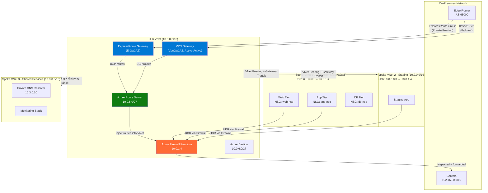

# Azure Connectivity: VNet Peering, VPN, ExpressRoute, and vWAN

## Overview

Azure connectivity architecture is a layer of decisions that compound. Get VNet peering transitivity wrong and you need UDRs everywhere. Choose Basic VPN Gateway SKU and your failover doesn't support BGP. Pick ExpressRoute without Global Reach and regional failover requires a second circuit. Senior SREs who have managed production Azure environments have all hit these walls — this guide walks through each connectivity primitive, the failure modes, and the design decisions that separate functional from resilient.

---

## VNet Peering

VNet Peering connects two VNets at the Azure SDN layer. Traffic flows over Microsoft's backbone, not the public internet. Latency is single-digit milliseconds within a region.

### Critical Property: Non-Transitive Routing

Azure VNet Peering is **NOT transitive by default**. If VNet-A peers with VNet-B, and VNet-B peers with VNet-C, then VNet-A cannot reach VNet-C.

```
VNet-A <--peering--> VNet-B <--peering--> VNet-C
        X                                        X
        VNet-A CANNOT reach VNet-C directly
```

This is the most common architectural mistake in Azure hub-spoke deployments. Teams set up a hub VNet, peer all spokes to the hub, and expect spokes to communicate via the hub — they cannot, unless you add UDRs that route inter-spoke traffic through an NVA (like Azure Firewall) in the hub.

### Gateway Transit

Peering supports gateway transit: a spoke VNet can use the hub's VPN Gateway or ExpressRoute Gateway to reach on-premises networks.

```bash
# Hub VNet: allow gateway transit (hub has the gateway)
az network vnet peering create \
  --resource-group prod-rg \
  --name hub-to-spoke \
  --vnet-name hub-vnet \
  --remote-vnet spoke-vnet \
  --allow-gateway-transit true

# Spoke VNet: use remote gateways
az network vnet peering create \
  --resource-group prod-rg \
  --name spoke-to-hub \
  --vnet-name spoke-vnet \
  --remote-vnet hub-vnet \
  --use-remote-gateways true
```

Gateway transit works in one direction only — the spoke uses the hub's gateway. The hub does NOT use the spoke's gateway.

### Global VNet Peering

Peering works across Azure regions (global peering). Traffic stays on Microsoft's WAN backbone. Higher latency than same-region peering, bandwidth limits apply per peering link. Global peering charges data transfer fees.

### Peering State Issues

Peering has two sides — both must be in `Connected` state. If one side is deleted or the VNet is deleted, the other side shows `Disconnected`. Always check both peerings:

```bash
az network vnet peering list --resource-group prod-rg --vnet-name hub-vnet -o table
az network vnet peering list --resource-group spoke-rg --vnet-name spoke-vnet -o table
```

---

## Azure Virtual WAN (vWAN)

Azure Virtual WAN is a Microsoft-managed networking service that provides hub-and-spoke topology with automatic transit routing. It solves the transitivity problem that basic VNet peering cannot.

### Standard vs Basic Tier

| Feature | Basic | Standard |
|---------|-------|----------|
| Site-to-site VPN | Yes | Yes |
| VNet connections | Yes | Yes |
| ExpressRoute | No | Yes |
| P2S VPN | No | Yes |
| Transit routing between VNets | No | Yes |
| Azure Firewall in hub | No | Yes (Secured Hub) |
| NVA in hub | No | Yes |
| BGP peering | No | Yes |

**Standard tier is the production choice.** Basic vWAN is suitable only for simple VPN scenarios.

### How vWAN Transit Routing Works

When you connect VNets to a vWAN hub, the hub's managed router automatically handles routing between connected VNets. VNet-A to VNet-B traffic flows: VNet-A → vWAN Hub → VNet-B. No UDRs needed, no NVA required for basic transit.

For secured hubs (Azure Firewall integrated), all traffic — including VNet-to-VNet — can be routed through the hub firewall. The hub's routing policies handle this automatically.

### vWAN Routing Intent

Introduced to simplify secured hub configuration:
```
Private Traffic Routing: send all private (RFC1918) traffic through Azure Firewall
Internet Traffic Routing: send all internet-bound traffic through Azure Firewall
```

Previously required manual route tables in vWAN — Routing Intent automates this.

---

## VPN Gateway

Azure VPN Gateway creates encrypted IPSec/IKE tunnels between Azure and on-premises networks or other Azure VNets.

### Policy-Based vs Route-Based

| Type | Use Case | BGP | Multiple Tunnels |
|------|----------|-----|-----------------|
| Policy-based | Legacy devices, specific traffic selectors | No | One tunnel only |
| Route-based | Modern devices, any-to-any, dynamic routing | Yes | Multiple tunnels |

Use route-based for all new deployments. Policy-based exists for legacy on-premises VPN devices that don't support IKEv2 with route-based selectors.

### Gateway SKUs and Performance

| SKU | Throughput | BGP | Zones | Active-Active |
|-----|-----------|-----|-------|--------------|
| Basic | 100 Mbps | No | No | No |
| VpnGw1 | 650 Mbps | Yes | No | Yes |
| VpnGw2 | 1 Gbps | Yes | No | Yes |
| VpnGw3 | 1.25 Gbps | Yes | No | Yes |
| VpnGw1AZ | 650 Mbps | Yes | Yes | Yes |
| VpnGw2AZ | 1 Gbps | Yes | Yes | Yes |
| VpnGw5AZ | 10 Gbps | Yes | Yes | Yes |

Basic SKU does not support BGP, cannot be active-active, and cannot be upgraded to higher SKUs without recreation. Never use Basic in production.

### Active-Active Configuration

Active-active deploys two gateway instances with two public IPs. On-premises must maintain BGP sessions to both. If one instance fails, BGP reconverges to the surviving instance. Without active-active, failover requires cold standby instance promotion (~90 seconds downtime).

```bash
az network vnet-gateway create \
  --resource-group prod-rg \
  --name prod-vpn-gw \
  --public-ip-address vpn-pip1 vpn-pip2 \  # Two PIPs for active-active
  --vnet hub-vnet \
  --gateway-type Vpn \
  --vpn-type RouteBased \
  --sku VpnGw2AZ \
  --asn 65001 \
  --active-active true
```

### BGP with VPN Gateway

BGP allows dynamic route exchange between Azure and on-premises. Routes advertised by on-premises appear in Azure route tables automatically. Azure advertises VNet prefixes to on-premises BGP peers. This is essential for large environments where static routes are unmaintainable.

---

## ExpressRoute

ExpressRoute provides a private, dedicated connection between on-premises and Azure using a connectivity provider (ISP or exchange provider). The connection is NOT over the public internet.

### Circuit Characteristics

- Bandwidth: 50 Mbps to 100 Gbps
- Providers: AT&T, Equinix, BT, Verizon, etc.
- Redundancy: Two physical paths (primary + secondary) are provisioned automatically
- SLA: 99.95% for standard, 99.99% for Premium circuits with redundant providers
- Two peering types: **Private Peering** (Azure VNets) and **Microsoft Peering** (Azure PaaS + M365)

### Private Peering

Connects on-premises to Azure VNets. Traffic flows: On-premises router → Provider → Microsoft Edge (MSEE) → ExpressRoute Gateway → VNets.

BGP is mandatory for ExpressRoute private peering. Azure uses AS 12076 (Microsoft's public ASN).

### Microsoft Peering

Connects on-premises to Azure public services (Storage, SQL, Cosmos DB) and Microsoft 365. Traffic to PaaS services uses Microsoft's backbone rather than the internet. Requires BGP with public IP prefixes.

### ExpressRoute Global Reach

Without Global Reach, two ExpressRoute-connected sites cannot communicate via Azure — they must use the internet or a separate WAN circuit. Global Reach extends the ExpressRoute backbone to provide site-to-site connectivity through Microsoft's network:

```
Site-A (Japan) --ER--> Microsoft Backbone --ER--> Site-B (London)
                    (Global Reach required)
```

### FastPath

By default, data traffic flows through the ExpressRoute Gateway, creating a bottleneck. FastPath bypasses the gateway for data traffic (gateway still handles control plane). Maximum throughput scales significantly with FastPath enabled on UltraPerformance or ErGw3AZ SKUs.

---

## Azure Route Server

Azure Route Server (ARS) solves the pain of UDR maintenance when using NVAs. Without ARS:
- NVA learns routes dynamically from on-premises via BGP
- But Azure VMs don't know to use the NVA — you must manually create and maintain UDRs

With ARS:
- NVA peers BGP with ARS
- ARS propagates NVA-learned routes into Azure VNet route tables automatically
- No manual UDR maintenance for dynamic routing scenarios

```bash
az network routeserver create \
  --resource-group prod-rg \
  --name prod-route-server \
  --hosted-subnet /subscriptions/.../subnets/RouteServerSubnet \
  --public-ip-address rs-pip

# Create BGP peer (NVA)
az network routeserver peering create \
  --resource-group prod-rg \
  --routeserver prod-route-server \
  --name nva-peer \
  --peer-asn 65002 \
  --peer-ip 10.0.0.5  # NVA private IP
```

ARS requires a dedicated subnet named `RouteServerSubnet` with minimum `/27`. It uses ASN 65515 by default.

---

## Private Link Service

While Private Endpoints are for consuming Azure PaaS services privately, Private Link Service allows you to expose YOUR OWN service privately to other Azure customers or tenants.

Use cases:
- SaaS provider exposing services to customers without peering
- Internal platform teams exposing services across subscription boundaries
- Third-party vendors accessing your data without VNet peering

```
Customer VNet
└── Private Endpoint → ← Private Link Service → Your Standard LB → Your VMs
    (customer's private IP)                      (your VNet)
```

The customer creates a Private Endpoint in their VNet. The Private Endpoint connects to your Private Link Service (which is attached to your Standard Load Balancer). Customer traffic flows to your backend via Microsoft's backbone, with no VNet peering or IP routing.

---

## Hub-Spoke with Azure Firewall

The canonical enterprise Azure topology:



### UDR Requirements in Hub-Spoke

Every spoke subnet needs a UDR routing `0.0.0.0/0` to the Azure Firewall private IP in the hub. Without this, inter-spoke traffic and internet traffic bypass the firewall:

```bash
# Create route table for spoke subnets
az network route-table create -g prod-rg -n spoke1-udr

az network route-table route create \
  -g prod-rg --route-table-name spoke1-udr \
  -n default-to-firewall \
  --address-prefix 0.0.0.0/0 \
  --next-hop-type VirtualAppliance \
  --next-hop-ip-address 10.0.1.4  # Azure Firewall

# Also need route for hub subnet to bypass firewall for peering
az network route-table route create \
  -g prod-rg --route-table-name spoke1-udr \
  -n hub-direct \
  --address-prefix 10.0.0.0/16 \
  --next-hop-type VirtualNetworkGateway
```

---

## Decision Matrix: Connectivity Options

| Scenario | Recommended | Why |
|----------|-------------|-----|
| Dev/test Azure VNet to VNet | VNet Peering | Free, low latency, simple |
| Small on-premises (<100 Mbps) | VPN Gateway VpnGw1AZ | Cost-effective, sufficient bandwidth |
| Large enterprise, dedicated bandwidth | ExpressRoute | Predictable latency, private connection, SLA |
| Many branch offices | vWAN + S2S VPN | Managed transit, scales to 1000s of sites |
| Multi-region enterprise | vWAN Standard + ExpressRoute | Automatic transit, Global Reach via vWAN |
| Expose internal service to other tenants | Private Link Service | No peering required, strong isolation |
| Dynamic routing with NVAs | Azure Route Server | Avoids UDR maintenance at scale |
| Compliance requiring private ExpressRoute+VPN | ExpressRoute + VPN coexistence | ER primary, VPN failover, same gateway |

---

## Real-World Production Scenario

### "ExpressRoute Failover to VPN Not Triggering Automatically"

**The Setup**: A financial services company has ExpressRoute (2 Gbps) as primary connectivity and a VPN Gateway (VpnGw2AZ) as backup. ExpressRoute goes down. VPN was configured and tested, but production workloads are not failing over — on-premises servers cannot reach Azure VMs for 45 minutes.

**Investigation**:

**Step 1: Check ExpressRoute circuit status**
```bash
az network express-route show \
  -g prod-rg -n prod-er-circuit \
  --query "circuitProvisioningState"
# Output: "Enabled" (circuit is provisioned but provider link is down)

az network express-route show \
  -g prod-rg -n prod-er-circuit \
  --query "serviceProviderProvisioningState"
# Output: "NotProvisioned" (provider side is down)
```

**Step 2: Check BGP session status on ExpressRoute Gateway**
```bash
az network vnet-gateway list-bgp-peer-status \
  -g prod-rg -n hub-er-gateway
# BGP sessions show "Idle" — routes not being advertised
```

**Step 3: Check VPN Gateway BGP sessions**
```bash
az network vnet-gateway list-bgp-peer-status \
  -g prod-rg -n hub-vpn-gateway
# BGP sessions to on-premises show "Connect" — VPN is up but not passing traffic
```

**Root Cause Found**: The on-premises BGP router is advertising the Azure prefixes (`10.0.0.0/8`) with a lower AS-PATH preference for the VPN path. When ExpressRoute was active, ER routes had lower BGP weight and were preferred. When ER went down, the VPN BGP routes should have taken over. They did — but on the Azure side, not the on-premises side.

The on-premises router was still trying to route to Azure via the failed ER path because the BGP session to ER was not immediately terminating. BGP keepalive was configured at 60 seconds hold timer — meaning the on-premises router waited 60 seconds to detect the BGP failure and reconverge to VPN.

**Fix**:
```
# On-premises BGP configuration fix
# Reduce BGP timers for faster convergence
neighbor 10.0.X.X timers 10 30  # 10s keepalive, 30s hold timer
# (Azure ExpressRoute side is configured by Microsoft — you control on-premises side)

# Azure-side: enable BFD (Bidirectional Forwarding Detection) for faster detection
# BFD is supported on ExpressRoute to detect failures in ~1 second vs 30-60s BGP timers
```

**Long-term design fix**: The issue wasn't just timers — the architecture was wrong. ExpressRoute and VPN coexisting on the SAME gateway creates a routing conflict when ER fails because Azure's SDN prefers ER routes and may not immediately withdraw them.

Better design:
- Use **separate gateways** for ExpressRoute and VPN (Azure supports this)
- Configure on-premises BGP with explicit preference: VPN routes get higher LOCAL-PREF only when ER routes are unavailable (use BGP route maps)
- Enable BFD on both sides for sub-second failure detection
- Test failover by putting the ER circuit into maintenance mode, not by pulling a cable

```bash
# Separate ER and VPN gateways in same GatewaySubnet is NOT supported
# They must use different subnets — design for this from day 1
# GatewaySubnet for ER gateway
# VpnGatewaySubnet for VPN gateway (custom name allowed now)
```

---

## Failure Modes

| Failure | Symptoms | Detection | Fix |
|---------|----------|-----------|-----|
| VNet peering not connected (one-sided) | Intermittent connectivity between VNets | `az network vnet peering list` — check both sides show `Connected` | Recreate the broken peering side |
| Gateway transit not enabled | Spoke cannot reach on-premises via hub gateway | `az network vnet peering show --query allowGatewayTransit/useRemoteGateways` | Set `allowGatewayTransit=true` on hub side, `useRemoteGateways=true` on spoke side |
| UDR missing on spoke subnet | Spoke traffic bypasses Azure Firewall; no security inspection | `az network nic show-effective-route-table` — check for correct next hop | Add UDR with `0.0.0.0/0 → VirtualAppliance → AzFirewall IP` to all spoke subnets |
| ExpressRoute BGP session down | All on-premises connectivity fails; Azure route table loses on-prem routes | Azure Monitor ER circuit metrics + `az network express-route list-arp-tables` | Contact provider; check BGP timers and authentication config |
| VPN active-active split-brain | Asymmetric traffic via different VPN instances | Both BGP sessions show Connected but packet loss | Verify on-premises has ECMP or active-standby with correct path preference |
| Azure Route Server BGP misconfiguration | NVA routes not appearing in VNet route tables | `az network routeserver peering list-learned-routes` | Check NVA is advertising correct prefixes; verify BGP ASN configuration |
| vWAN routing intent conflicts | Custom routes overriding vWAN managed routes | vWAN effective routes via portal/CLI | Do not mix custom UDRs with vWAN routing intent — use one or the other |

---

## Debugging Guide

### Diagnose VNet Connectivity

```bash
# Network Watcher Connection Monitor
az network watcher connection-monitor create \
  --resource-group prod-rg \
  --name spoke1-to-spoke2-monitor \
  --location eastus \
  --source-resource-id /subscriptions/.../VMs/spoke1-vm \
  --dest-resource-id /subscriptions/.../VMs/spoke2-vm \
  --monitoring-intervals 30

# Check effective routes on a VM
az network nic show-effective-route-table \
  -g prod-rg -n spoke1-vm-nic --output table

# Trace packets with packet capture
az network watcher packet-capture create \
  -g prod-rg \
  --vm spoke1-vm \
  --name debug-capture \
  --storage-account debugsa \
  --time-limit 300 \
  --filters '[{"protocol":"TCP","remoteIPAddress":"10.2.0.10","remotePort":"8080"}]'
```

### ExpressRoute Diagnostics

```bash
# Check ARP tables (layer 2 reachability to MSEE)
az network express-route list-arp-tables \
  -g prod-rg -n prod-er-circuit \
  --peering-name AzurePrivatePeering \
  --path Primary

# Check BGP route tables
az network express-route list-route-tables \
  -g prod-rg -n prod-er-circuit \
  --peering-name AzurePrivatePeering \
  --path Primary

# Check gateway health
az network vnet-gateway show \
  -g prod-rg -n hub-er-gateway \
  --query "bgpSettings"
```

### vWAN Route Troubleshooting

```bash
# Get effective routes for vWAN hub
az network vhub get-outbound-routes \
  -g prod-rg \
  --name prod-vhub \
  --resource-type Microsoft.Network/virtualNetworks \
  --resource-id /subscriptions/.../virtualNetworks/spoke1-vnet

# List virtual hub route tables
az network vhub route-table list \
  -g prod-rg \
  --vhub-name prod-vhub
```

---

## Security Considerations

**ExpressRoute does not encrypt**: ExpressRoute is a private circuit, not an encrypted one. Traffic on the ExpressRoute circuit between your on-premises and Azure is in plaintext at the IP layer. For compliance scenarios requiring encryption in transit (even on private circuits), use MACsec (available on ExpressRoute Direct connections) or run IPSec VPN over the ExpressRoute circuit. Running IPSec over ExpressRoute gives you both the dedicated bandwidth of ER and the encryption of VPN.

**VPN Gateway IKE configuration**: Default IKE proposals in Azure VPN Gateway accept weak ciphers for compatibility. In production, define custom IPSec/IKE policies using AES-256, SHA-256, and DH Group 14 minimum:

```bash
az network vpn-connection ipsec-policy add \
  -g prod-rg \
  --connection-name prod-vpn-conn \
  --ike-encryption AES256 \
  --ike-integrity SHA256 \
  --dh-group DHGroup14 \
  --ipsec-encryption AES256 \
  --ipsec-integrity SHA256 \
  --pfs-group PFS2048 \
  --sa-lifetime 27000 \
  --sa-datasize 102400000
```

**vWAN routing: implicit vs explicit trust**: vWAN's automatic transit routing means a compromised workload in one connected VNet can reach all other connected VNets without firewall inspection — unless you deploy a Secured Hub with Azure Firewall and configure routing policies to force all traffic through inspection. Default vWAN hub routing is "flat" — treat it like you would an open VNet unless you've explicitly enabled the Secured Hub and routing intent.

**Private Link service approval**: When exposing a service via Private Link, use manual approval for private endpoint connections from unknown tenants. Automatic approval means any Azure customer who knows your Private Link Service resource ID can create a private endpoint to your service without your explicit approval.

**BGP route filtering**: On ExpressRoute, advertise only the specific prefixes your on-premises network needs to reach in Azure. Do not advertise `0.0.0.0/0` from on-premises unless you explicitly want Azure to route all internet traffic through your on-premises network. This is a common misconfiguration that routes Azure VMs' internet traffic via on-premises, creating unexpected costs and latency.

---

## Interview Questions

### Basic

**Q: Why is Azure VNet peering non-transitive?**
A: Azure peering works at the SDN (software-defined networking) level — it creates a direct routing relationship between two VNets only. There is no mechanism to forward packets from VNet-A through VNet-B to VNet-C — VNet-B's routing table only knows about A and C separately, not that A wants to reach C via B. This is a deliberate design choice. For transit routing, you must use an NVA or Azure Virtual WAN Standard.

**Q: What is the difference between ExpressRoute and VPN Gateway?**
A: VPN Gateway creates encrypted IPSec tunnels over the public internet. It's flexible and low-cost but has limited bandwidth (max ~10 Gbps for highest SKU) and variable latency. ExpressRoute is a private dedicated circuit through a connectivity provider, not over the public internet. It offers dedicated bandwidth (up to 100 Gbps), predictable latency, and is NOT encrypted by default. ExpressRoute costs significantly more and requires a provider relationship.

**Q: What is gateway transit in VNet peering?**
A: Gateway transit allows spoke VNets to use the hub VNet's VPN or ExpressRoute gateway to reach on-premises networks. The hub must enable `allowGatewayTransit=true` and the spoke must enable `useRemoteGateways=true`. Without this, each spoke would need its own gateway — which is expensive and unmanageable at scale.

### Intermediate

**Q: Explain Azure Route Server's role in an NVA deployment.**
A: Without Route Server, when an NVA (e.g., Palo Alto firewall) learns routes from on-premises via BGP, those routes only exist in the NVA's routing table. Azure VNet VMs still use Azure SDN's default routes. You'd have to manually create UDRs for every on-premises prefix and update them as prefixes change. Azure Route Server acts as a BGP reflector between NVAs and Azure's SDN. The NVA peers with ARS, advertises learned routes, and ARS injects those routes into VNet route tables automatically. This eliminates UDR maintenance for dynamic routing scenarios.

**Q: How does ExpressRoute FastPath work and when would you use it?**
A: By default, all data traffic flowing over ExpressRoute goes through the ExpressRoute Gateway VM in Azure — this gateway can become a bottleneck at high throughput. FastPath bypasses the gateway for data-plane traffic (the gateway still handles BGP and control plane). FastPath is enabled on the connection itself and requires either the UltraPerformance or ErGw3AZ gateway SKU. Use it when you need maximum throughput for high-bandwidth workloads (SAP HANA, large file transfers, high-frequency databases) and are hitting gateway bandwidth limits.

**Q: A spoke VNet can reach the hub but cannot reach another spoke. What's the likely cause and how do you fix it?**
A: VNet peering is non-transitive. The spoke VNets each have a peering to the hub, but not to each other. Traffic from Spoke-1 reaches the hub but has no route to Spoke-2. Fix options: 1) Add UDRs in each spoke pointing `0.0.0.0/0` or specific spoke prefixes to an NVA (Azure Firewall) in the hub, which then forwards to the destination spoke. 2) Migrate to Azure Virtual WAN Standard, which handles transit routing automatically. 3) Add direct peering between spoke VNets (not recommended at scale — N*(N-1)/2 peerings needed).

### Advanced / Staff Level

**Q: Design an ExpressRoute + VPN coexistence architecture that provides sub-30-second failover. What are the BGP design considerations?**
A: The architecture requires: 1) Both ER Gateway and VPN Gateway in the hub (they can share GatewaySubnet in newer Azure releases, or use separate subnets). 2) On-premises BGP must prefer ER routes over VPN routes using LOCAL-PREF or AS-PATH prepending on VPN-originated routes. 3) BFD (Bidirectional Forwarding Detection) must be enabled to detect ER failure in ~1 second rather than waiting for BGP hold timer expiry (typically 90 seconds). 4) On-premises BGP timers should be tuned: keepalive 10s, hold timer 30s. With BFD, detection can be <1 second. 5) VPN must maintain its BGP sessions in warm-standby mode — the tunnel should be up and BGP session established but routes deprioritized. 6) Azure VPN Gateway active-active is required so VPN failover itself doesn't introduce additional delay. With BFD and pre-established BGP sessions, failover is ~5-15 seconds. Without BFD, you're at 30-90 seconds minimum.

**Q: You're migrating from a hub-spoke topology with manual UDRs to Azure Virtual WAN. What are the key migration steps and what can go wrong?**
A: Migration steps: 1) Create vWAN and Standard hub in same region. 2) Connect spoke VNets to vWAN hub (this creates managed VNet connections). 3) Remove existing VNet peerings to old hub. 4) Migrate ExpressRoute circuits from old ER Gateway to vWAN ER Gateway. 5) Migrate VPN connections. 6) Configure routing intent if deploying Secured Hub. Key risks: a) vWAN creates its own route tables (`defaultRouteTable`, `noneRouteTable`) — custom UDRs in spoke VNets can conflict with vWAN-managed routes. b) vWAN does not support all NVA types in the hub — only certified NVAs (Barracuda, Cisco, Fortinet, Palo Alto) can be deployed in vWAN hub; your existing NVA may not be supported. c) Address space overlap: vWAN requires all connected VNets and branches to have non-overlapping address spaces — if your existing topology has overlaps, vWAN will reject the connections. d) Routing intent enables ALL-or-nothing inspection: you cannot selectively route some spoke traffic through firewall and not others without custom route tables. e) The vWAN hub has its own managed AS number (65515) — on-premises BGP configuration must be updated.

**Q: How would you prevent BGP route leaking in a complex hub-spoke topology where dev and prod spokes must be strictly isolated?**
A: BGP route leaking prevention in Azure requires a combination of approaches: 1) **vWAN custom route tables**: Create separate route tables for prod and dev, each with their own propagation and association rules. Prod spokes associate with the prod route table and only propagate to prod routes; dev similarly. The hub firewall is the only resource associated with both tables. 2) **Azure Firewall policy**: Even if routing tables prevent direct routing, explicitly deny cross-environment traffic in Firewall Network Rules using CIDR ranges. 3) **NSG as backstop**: Apply NSGs to every spoke subnet that explicitly deny the opposite environment's CIDR blocks — defense in depth. 4) **Private DNS isolation**: Use separate Private DNS Zones for prod and dev, linked only to their respective VNets, preventing DNS-based lateral movement. 5) **Monitor with Azure Policy**: Enforce that no UDRs exist in prod subnets pointing to dev address space and vice versa. The layered approach ensures that even if vWAN routing tables are misconfigured, NSGs and firewall rules provide independent isolation.
