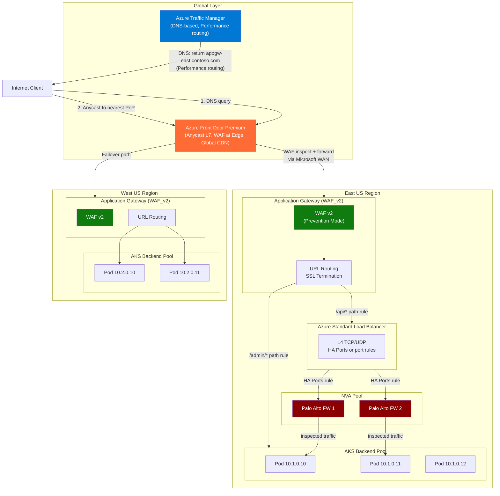

# Azure Load Balancers: From L4 to Global

## Table of Contents

- [Overview](#overview)
- [Azure Load Balancer (Standard)](#azure-load-balancer-standard)
  - [Key Components](#key-components)
  - [HA Ports Mode](#ha-ports-mode)
  - [Standard vs Basic ALB](#standard-vs-basic-alb)
  - [Outbound Rules and SNAT](#outbound-rules-and-snat)
- [Application Gateway](#application-gateway)
  - [Key Features](#key-features)
  - [Autoscaling (v2 SKU)](#autoscaling-v2-sku)
  - [Health Probe Configuration](#health-probe-configuration)
- [Azure Front Door](#azure-front-door)
  - [Key Architecture Concepts](#key-architecture-concepts)
  - [Origins and Origin Groups](#origins-and-origin-groups)
- [Azure Traffic Manager](#azure-traffic-manager)
  - [Routing Methods](#routing-methods)
  - [Traffic Manager Limitations](#traffic-manager-limitations)
- [Load Balancer Architecture Diagram](#load-balancer-architecture-diagram)
- [Decision Matrix](#decision-matrix)
- [Real-World Production Scenario](#real-world-production-scenario)
  - ["Application Gateway 502 Errors for Specific Backends — Health Probe Misconfiguration"](#application-gateway-502-errors-for-specific-backends-health-probe-misconfiguration)
- [Failure Modes](#failure-modes)
- [Debugging Guide](#debugging-guide)
  - [Application Gateway Health and Diagnostics](#application-gateway-health-and-diagnostics)
  - [Azure Load Balancer Diagnostics](#azure-load-balancer-diagnostics)
  - [Front Door Diagnostics](#front-door-diagnostics)
- [Security Considerations](#security-considerations)
- [Interview Questions](#interview-questions)
  - [Basic](#basic)
  - [Intermediate](#intermediate)
  - [Advanced / Staff Level](#advanced-staff-level)

---

## Overview

Azure's load balancing portfolio spans four distinct products — each operating at a different layer and scope. A Senior SRE must understand not just what each product does, but the failure modes unique to each, and critically, how they compose. An Application Gateway behind Azure Front Door behind an Azure Load Balancer is a real production topology — and when something breaks, you need to know which layer to investigate first.

---

## Azure Load Balancer (Standard)

> Azure Standard Load Balancer is a highly available, zone-redundant Layer 4 (TCP/UDP) load balancer that distributes inbound network flows across backend instances. It provides sub-millisecond switching, supports up to 1,000 backend instances, and includes built-in availability zone support, SNAT for outbound connectivity, and rich diagnostics through Azure Monitor.
> — [Azure Docs: Azure Load Balancer](https://learn.microsoft.com/azure/load-balancer/load-balancer-overview)

Azure Load Balancer operates at Layer 4 (TCP/UDP). It makes routing decisions based on IP address and port — no HTTP awareness. Standard SKU is the production-grade option; Basic SKU is being deprecated.

### Key Components

**Frontend IP Configuration**: The IP address(es) the load balancer listens on. Can be public (Standard Public IP) or private (VNet IP). A single load balancer can have multiple frontends (useful for multi-tenant or multi-port scenarios).

**Backend Pool**: The set of resources receiving traffic. Standard ALB supports:
- Virtual Machines (via NIC IP configuration)
- Virtual Machine Scale Sets
- IP addresses (for scenarios like AKS pods in direct-IP mode)

**Health Probes**: The mechanism for determining backend health. Types:
- TCP probe: checks if port accepts connections (SYN/SYN-ACK)
- HTTP/HTTPS probe: checks for specific HTTP response code (default: 2xx)
- Custom path and interval configuration

**Load Balancing Rules**: Defines frontend IP + port → backend pool + port mapping. Includes session persistence (hash-based or client IP affinity), idle timeout, and floating IP settings.

### HA Ports Mode

> HA ports is a configuration of an internal load balancer that allows a single load balancing rule to handle all TCP and UDP flows on all ports simultaneously. This enables transparent pass-through for all traffic to a backend pool of Network Virtual Appliances (NVAs) without enumerating individual ports, making it ideal for high-availability NVA deployments.
> — [Azure Docs: HA Ports](https://learn.microsoft.com/azure/load-balancer/load-balancer-ha-ports-overview)

HA ports is a load balancing rule that uses port `0` and protocol `All`. This creates a rule that load-balances ALL TCP and UDP traffic on ALL ports simultaneously. Typically used for NVA (firewall/router) scenarios where you want all traffic flowing through the NVA without configuring individual port rules:

```bash
az network lb rule create \
  -g prod-rg --lb-name internal-lb \
  -n ha-ports-rule \
  --protocol All \
  --frontend-port 0 \
  --backend-port 0 \
  --frontend-ip-name frontend \
  --backend-pool-name nva-pool \
  --probe-name nva-probe
```

HA ports rules cannot coexist with specific port rules on the same frontend. Use a dedicated internal LB for NVA deployments.

### Standard vs Basic ALB

| Feature | Standard | Basic |
|---------|----------|-------|
| SLA | 99.99% | None |
| Availability Zones | Zone-redundant | Not supported |
| Backend pool size | Up to 1000 | Up to 300 |
| Backend types | VMs, VMSS, IPs | VMs, VMSS (same AS) |
| Health probe protocols | TCP, HTTP, HTTPS | TCP, HTTP |
| Secure by default | Yes (NSG required) | No (open by default) |
| AKS requirement | Required | Not supported |
| Outbound rules | Explicit control | Automatic SNAT |
| Diagnostics | Full metrics + flow logs | Limited |
| Deprecation | Active | Deprecated |

**Critical**: Standard ALB requires NSG to allow traffic. Unlike Basic, it does not allow inbound traffic by default. A common cause of "ALB deployed but no traffic flows" is missing NSG rule allowing the load-balanced port.

### Outbound Rules and SNAT

> Azure Load Balancer outbound rules give you full control over outbound source network address translation (SNAT) for your virtual machines. You can configure the number of SNAT ports allocated per backend instance, the public IPs used for outbound connections, and the protocols and timeout values — providing explicit management of outbound connectivity scaling.
> — [Azure Docs: Outbound Rules](https://learn.microsoft.com/azure/load-balancer/outbound-rules)

Standard ALB's outbound SNAT (Source NAT) requires explicit configuration via Outbound Rules. This is different from Basic, which provides automatic SNAT.

SNAT port exhaustion is a real production failure mode. Each frontend public IP provides ~64,000 SNAT ports. With many backend instances making many outbound connections, these ports can be exhausted.

```bash
# Create outbound rule with multiple public IPs for more SNAT ports
az network lb outbound-rule create \
  -g prod-rg --lb-name prod-lb \
  -n outbound-rule \
  --address-pool backend-pool \
  --frontend-ip-configs pip1-frontend pip2-frontend pip3-frontend \
  --protocol All \
  --idle-timeout 15 \
  --outbound-ports 10000  # explicit SNAT port allocation per instance
```

Monitor SNAT port exhaustion:
```
Azure Monitor metric: SNAT Connection Count (State=Failed)
Alert threshold: >0 failed SNAT connections
```

---

## Application Gateway

> Azure Application Gateway is a web traffic load balancer operating at Layer 7 that enables you to manage traffic to your web applications based on host headers, URL paths, and other HTTP attributes. It includes built-in SSL/TLS termination, cookie-based session affinity, URL-path-based routing, and an integrated Web Application Firewall (WAF) to protect against common web exploits.
> — [Azure Docs: Application Gateway Overview](https://learn.microsoft.com/azure/application-gateway/overview)

Application Gateway is Azure's L7 load balancer with WAF capabilities. It terminates TCP connections, reads HTTP headers/paths, and makes routing decisions based on application-layer content.

### Key Features

**SSL Termination**: SSL is terminated at the Application Gateway. Traffic between AppGW and backends can be HTTP or re-encrypted HTTPS (end-to-end SSL). For PCI compliance, end-to-end SSL is required.

**URL-Based Routing**: Route requests to different backend pools based on URL path:
- `/api/*` → api-backend-pool (API servers)
- `/static/*` → storage-backend-pool (Azure Storage static content)
- `/*` → web-backend-pool (web servers)

**Cookie-Based Affinity**: When enabled, Application Gateway inserts an `ApplicationGatewayAffinity` cookie on the first response. Subsequent requests from the same client include this cookie and are routed to the same backend. Essential for stateful applications that don't use distributed session stores.

**WAF v2**: Web Application Firewall protects against OWASP Top 10. Mode options:
- Detection mode: logs threats, does not block (use during initial deployment)
- Prevention mode: blocks requests matching rules

```bash
az network application-gateway waf-policy create \
  -g prod-rg -n prod-waf-policy \
  --location eastus

# Set to Prevention mode
az network application-gateway waf-policy policy-setting update \
  -g prod-rg --policy-name prod-waf-policy \
  --mode Prevention \
  --state Enabled \
  --request-body-check true \
  --max-request-body-size 128 \
  --file-upload-limit-in-mb 100
```

### Autoscaling (v2 SKU)

> Application Gateway v2 (Standard_v2 and WAF_v2 SKUs) supports autoscaling, automatically scaling the number of gateway instances up or down based on traffic load patterns. You configure minimum and maximum instance counts; the gateway provisions and releases capacity within those bounds without manual intervention.
> — [Azure Docs: Application Gateway Autoscaling](https://learn.microsoft.com/azure/application-gateway/application-gateway-autoscaling-zone-redundant)

Application Gateway v2 (WAF_v2 or Standard_v2) supports autoscaling. You define minimum and maximum instance counts. The gateway scales between min and max based on traffic load.

```bash
az network application-gateway create \
  -g prod-rg -n prod-appgw \
  --sku WAF_v2 \
  --capacity 2 \          # min instances
  --max-capacity 10 \     # max instances
  --zones 1 2 3           # zone-redundant
```

**V2 subnet requirements**: Application Gateway v2 requires a dedicated subnet with minimum `/24` recommended (gateway uses IPs from this subnet for scaling — one IP per instance).

### Health Probe Configuration

> Application Gateway health probes continuously monitor the health of servers in a backend pool. When a server fails to respond to health probe requests within the configured thresholds, it is marked unhealthy and removed from the rotation until it responds successfully again. Custom probes allow you to configure specific paths, hostnames, ports, and success status code ranges.
> — [Azure Docs: Application Gateway Health Probes](https://learn.microsoft.com/azure/application-gateway/application-gateway-probe-overview)

The most common source of production 502 errors is health probe misconfiguration. Default probes send HTTP GET to `/` on the same port as the backend HTTP setting. Override with custom probes for accurate health detection:

```bash
az network application-gateway probe create \
  -g prod-rg --gateway-name prod-appgw \
  -n custom-health-probe \
  --protocol Https \
  --host-name-from-http-settings true \  # use backend's hostname
  --path /health \
  --interval 30 \
  --timeout 30 \
  --threshold 3 \
  --match-status-codes "200-399"
```

**Common probe failure causes**:
1. Probe sends requests to port 80 but backend only listens on 8080
2. Probe uses IP address but backend requires SNI (Host header) for SSL — use `--host-name-from-http-settings true`
3. Probe path returns 200 only after warmup — threshold too low causes backends to flip during deployment
4. NSG on backend subnet blocks `65200-65535` (Application Gateway infrastructure subnet range) — this is the source of AppGW health probes

---

## Azure Front Door

> Azure Front Door is Microsoft's modern cloud Content Delivery Network (CDN) that provides fast, reliable, and secure access between your users and your applications' static and dynamic web content across the globe. It delivers content using Microsoft's global edge network with hundreds of global and local points of presence close to both enterprise and consumer end users.
> — [Azure Docs: Azure Front Door Overview](https://learn.microsoft.com/azure/frontdoor/front-door-overview)

Azure Front Door is Microsoft's global L7 CDN and load balancer. Unlike Application Gateway (regional), Front Door has Points of Presence (PoPs) in 100+ locations worldwide.


### Key Architecture Concepts

> Azure Front Door uses anycast to direct end-user requests to the nearest Front Door point of presence (PoP). Connections terminate at the PoP, and Front Door then uses its own optimized WAN path to route requests to the best available origin — accelerating both connection establishment for end users and content delivery from origins.
> — [Azure Docs: Front Door Routing](https://learn.microsoft.com/azure/frontdoor/front-door-routing-architecture)

**Anycast routing**: Client DNS resolution returns the nearest Front Door PoP IP. Traffic enters Microsoft's network at the closest PoP and traverses Microsoft's WAN backbone to reach the origin. This dramatically reduces time-to-first-byte for globally distributed clients.

**Health Probes**: Front Door sends health probes from all PoP locations to your origins. This means a backend that appears healthy from one region may be unhealthy from another. Front Door can route around regional backend failures automatically.

**Routing Methods**:
| Method | Behavior |
|--------|----------|
| Latency | Send to lowest-latency origin (measured by Front Door probes) |
| Priority | Send to highest-priority origin; failover to next priority on failure |
| Weighted | Distribute traffic proportionally by weight (useful for canary deployments) |
| Session Affinity | Route the same client to the same origin |

**WAF at the Edge**: Front Door WAF runs at the PoP, blocking malicious traffic before it reaches your origin. This is more cost-effective than running WAF at Application Gateway alone because malicious traffic is blocked globally at the edge.

### Origins and Origin Groups

> In Azure Front Door Standard and Premium, an origin represents the backend application server or service that Front Door delivers content from. An origin group is a set of origins with health probe configuration and load balancing settings — Front Door routes incoming requests to the healthiest, lowest-latency origin within the group.
> — [Azure Docs: Front Door Origins](https://learn.microsoft.com/azure/frontdoor/origin)

Front Door Standard/Premium (the current generation, replacing classic Front Door):
- **Origin**: A backend endpoint (App Service, AKS Ingress IP, Storage, custom IP)
- **Origin Group**: A set of origins with health probe settings and load balancing method
- **Route**: Maps a domain + path pattern to an origin group

```bash
# Create origin group
az afd origin-group create \
  -g prod-rg --profile-name prod-afd \
  --origin-group-name prod-origins \
  --probe-request-type GET \
  --probe-protocol Https \
  --probe-interval-in-seconds 30 \
  --probe-path /health \
  --sample-size 4 \
  --successful-samples-required 3 \
  --additional-latency-in-milliseconds 50

# Add origins
az afd origin create \
  -g prod-rg --profile-name prod-afd \
  --origin-group-name prod-origins \
  --origin-name eastus-origin \
  --host-name api-eastus.contoso.com \
  --priority 1 \
  --weight 1000
```

---

## Azure Traffic Manager

> Azure Traffic Manager is a DNS-based traffic load balancer that distributes traffic optimally to services across global Azure regions, while providing high availability and responsiveness. It works by applying DNS-level routing policies to direct end-user requests to different endpoints based on traffic routing methods, endpoint health checks, and geographic location.
> — [Azure Docs: Azure Traffic Manager](https://learn.microsoft.com/azure/traffic-manager/traffic-manager-overview)

Traffic Manager is **DNS-based** global load balancing. It does NOT proxy traffic — it returns DNS responses directing clients to specific endpoints. The client connects directly to the endpoint.


This is fundamentally different from Front Door: Front Door is a reverse proxy that terminates connections; Traffic Manager just influences DNS resolution.

### Routing Methods

> Azure Traffic Manager supports six traffic-routing methods to control how DNS queries are answered and which endpoint receives client traffic. You can combine routing methods using nested Traffic Manager profiles for complex multi-region, multi-layered load balancing scenarios.
> — [Azure Docs: Traffic Manager Routing Methods](https://learn.microsoft.com/azure/traffic-manager/traffic-manager-routing-methods)

| Method | Use Case |
|--------|----------|
| Performance | Route to lowest-latency endpoint (uses Azure's endpoint latency data) |
| Priority | Active/passive failover — primary gets all traffic, secondary is standby |
| Weighted | Distribute traffic by weight — useful for blue/green deployments |
| Geographic | Route based on client's geographic location (for data residency compliance) |
| Multivalue | Return multiple healthy endpoints (client chooses) |
| Subnet | Route based on client IP subnet |

### Traffic Manager Limitations

> Because Traffic Manager is a DNS-based service, it cannot failover faster than the DNS TTL allows — clients that have cached a DNS response will continue using the previously resolved endpoint until the TTL expires. Additionally, Traffic Manager does not inspect or modify actual application traffic, so it cannot provide WAF protection, request manipulation, or TLS termination.
> — [Azure Docs: Traffic Manager FAQ](https://learn.microsoft.com/azure/traffic-manager/traffic-manager-faqs)

- **TTL-based failover**: Traffic Manager relies on DNS TTL. Default TTL is 300 seconds (5 minutes). If a primary endpoint fails, clients who have cached the DNS response will continue hitting the failed endpoint for up to TTL seconds. Reduce TTL to 60 seconds for faster failover (with increased DNS query load as a trade-off).
- **No connection visibility**: Traffic Manager cannot see the actual HTTP requests. WAF, rate limiting, and request inspection must be at the origin or a proxy layer.
- **No IP affinity**: Since TM returns IPs via DNS, the client IP seen by the origin is the actual client IP (no proxy in the path). This is useful for logging but means you cannot centralize TLS termination at TM.
- **Health probe limitations**: TM probes check HTTP status codes from Azure's infrastructure, not all geographic locations. A regional DNS failure affecting your clients will not be detected by TM health probes.

---

## Load Balancer Architecture Diagram



---

## Decision Matrix

| Scenario | Use | Why |
|----------|-----|-----|
| TCP/UDP load balancing within VNet | Azure Standard LB (internal) | L4, no HTTP awareness needed |
| Expose VMs/AKS to internet (HTTP) | Application Gateway + WAF | L7, WAF, SSL termination |
| Global HTTP(S) with CDN caching | Azure Front Door Premium | Anycast, edge caching, global WAF |
| Multi-region active-active (HTTP) | Azure Front Door | Built-in origin health + routing |
| Multi-region failover (non-HTTP) | Azure Traffic Manager | DNS-based, works for any TCP service |
| Data residency routing (EU-only) | Traffic Manager Geographic | Route by client geography |
| NVA (firewall) load balancing | Azure Standard LB internal + HA ports | HA ports passes all protocols |
| Blue/green global deployment | Front Door Weighted routing | Shift traffic percentage without DNS TTL |
| Legacy non-HTTP TCP applications | Traffic Manager + Standard LB | TM routes DNS, LB handles L4 |

---

## Real-World Production Scenario

### "Application Gateway 502 Errors for Specific Backends — Health Probe Misconfiguration"

**The Situation**: A team deploys Application Gateway (WAF_v2) in front of an AKS cluster. The Application Gateway has two URL-path rules: `/api/*` routes to the API backend pool, `/*` routes to the web frontend backend pool. After deploying a new version of the API service, 30% of `/api/*` requests return 502 Bad Gateway. The AKS pods appear healthy in Kubernetes (`kubectl get pods` shows all Running).

**Step 1: Check Application Gateway backend health**
```bash
az network application-gateway show-backend-health \
  -g prod-rg -n prod-appgw \
  --query "backendAddressPools[?name=='api-backend-pool'].backendHttpSettingsCollection[].servers[]"

# Output:
# [
#   {"address": "10.1.0.10", "health": "Healthy"},
#   {"address": "10.1.0.11", "health": "Unhealthy", "healthProbeLog": "Connection refused"},
#   {"address": "10.1.0.12", "health": "Healthy"}
# ]
```

One backend is `Unhealthy`. AppGW continues sending 30% of traffic to it (based on round-robin) — those requests get 502.

**Step 2: Check what the probe is actually hitting**
```bash
az network application-gateway probe show \
  -g prod-rg --gateway-name prod-appgw \
  -n api-probe

# Output:
# path: /health
# port: 80        <-- PROBLEM
# protocol: Http
```

The health probe is hitting port 80. But the new API service version changed its health endpoint to HTTPS on port 443 only. The old version was running both 80 and 443. The new version dropped port 80 entirely.

**Step 3: Check if NSG is blocking AppGW probe source range**
```bash
az network nsg show -g prod-rg -n aks-nsg \
  --query "securityRules[?direction=='Inbound' && access=='Allow']" -o table
```

No rule for ports 65200-65535 (AppGW management and probe traffic range). But this is not the issue here since health probes come from AppGW's private IP.

**Root Cause**: Health probe misconfigured — hardcoded port 80 with HTTP instead of using the backend HTTP settings (which correctly specify HTTPS on 443).

**Fix**:
```bash
az network application-gateway probe update \
  -g prod-rg --gateway-name prod-appgw \
  -n api-probe \
  --protocol Https \
  --port 443 \
  --host-name-from-http-settings true \  # use hostname from backend HTTP setting (for SNI)
  --path /health

# Also ensure backend HTTP setting has hostname set (for SNI/certificate validation)
az network application-gateway http-settings update \
  -g prod-rg --gateway-name prod-appgw \
  -n api-http-settings \
  --host-name-from-backend-pool true
```

**Deeper Issue — Why 30% not 33%?**: AppGW has 3 backends; 1 is unhealthy. AppGW v2 removes unhealthy backends from the pool within ~30 seconds of the probe failure (3 consecutive failures × 10s interval). During that 30-second window, 33% of requests fail. After the unhealthy backend is removed, traffic goes to the 2 healthy backends. The 30% was an average during the failover window. After the probe fix, all 3 backends become healthy and 502s stop.

**Prevention**: Always use `--host-name-from-http-settings true` on probes and `--host-name-from-backend-pool true` on HTTP settings for HTTPS backends. And version-gate health endpoint behavior changes separately from application deployment.

---

## Failure Modes

| Failure | Symptoms | Detection | Fix |
|---------|----------|-----------|-----|
| ALB: NSG blocking load-balanced port | No traffic reaches backends; LB frontend responds with reset | Network Watcher IP Flow Verify from LB frontend IP to backend IP | Add NSG inbound rule for load-balanced port on backend subnet |
| ALB: SNAT port exhaustion | Connection failures for outbound connections from backends; high latency | Azure Monitor: `SNAT Connection Count (State=Failed)` > 0 | Add outbound rule with additional public IPs or increase SNAT port allocation |
| AppGW: probe hitting wrong port/path | Some backends unhealthy; 502 for those backends | `az network application-gateway show-backend-health` | Update probe port/path/protocol to match backend configuration |
| AppGW: NSG blocking probe source | All backends unhealthy (not just some) | Check NSG on AppGW subnet and backend subnet | Allow TCP from `GatewayManager` service tag; allow AppGW subnet CIDR to backend subnet |
| AppGW: subnet too small for scaling | AppGW fails to scale up; 503 during traffic spikes | Azure Monitor AppGW instance count + `az monitor metrics list` | Expand AppGW subnet or recreate with larger subnet |
| Front Door: origin unhealthy from some PoPs | Elevated latency/errors for clients in specific regions | Front Door health probe status per PoP in diagnostics | Check origin's behavior from those geographic regions; verify no geo-blocking |
| Traffic Manager: DNS TTL delays failover | Traffic still hitting failed endpoint after health check detects failure | Client-side DNS cache; TM TTL setting | Reduce TTL to 60s; implement client-side retry logic |
| AppGW: WAF false positive | Legitimate requests blocked with 403 | AppGW WAF logs in Log Analytics: `AzureDiagnostics | where ResourceType == "APPLICATIONGATEWAYS" and OperationName == "ApplicationGatewayFirewall"` | Add WAF exclusions for specific parameters/headers that trigger false positives |
| ALB: asymmetric traffic with NVA | Intermittent TCP resets; traffic drops after initial connection | Packet captures on NVA showing incomplete TCP flows | Ensure both directions of traffic flow through same NVA instance; use HA ports on internal LB |

---

## Debugging Guide

### Application Gateway Health and Diagnostics

```bash
# Detailed backend health with unhealthy reasons
az network application-gateway show-backend-health \
  -g prod-rg -n prod-appgw --output json

# Enable diagnostics to Log Analytics
az monitor diagnostic-settings create \
  --resource /subscriptions/.../applicationGateways/prod-appgw \
  --name appgw-diag \
  --workspace /subscriptions/.../workspaces/prod-law \
  --logs '[{"category":"ApplicationGatewayAccessLog","enabled":true},
           {"category":"ApplicationGatewayFirewallLog","enabled":true}]' \
  --metrics '[{"category":"AllMetrics","enabled":true}]'
```

Log Analytics queries for AppGW debugging:
```kusto
-- 502 errors and which backend caused them
AzureDiagnostics
| where ResourceType == "APPLICATIONGATEWAYS"
| where httpStatus_d == 502
| summarize count() by serverRouted_s, TimeGenerated
| order by TimeGenerated desc

-- WAF blocked requests
AzureDiagnostics
| where ResourceType == "APPLICATIONGATEWAYS"
| where OperationName == "ApplicationGatewayFirewall"
| where action_s == "Blocked"
| project TimeGenerated, clientIP_s, requestUri_s, ruleId_s, Message
```

### Azure Load Balancer Diagnostics

```bash
# Check health probe status
az network lb probe show -g prod-rg --lb-name prod-lb -n http-probe

# View load balancer metrics
az monitor metrics list \
  --resource /subscriptions/.../loadBalancers/prod-lb \
  --metric "SnatConnectionCount" \
  --filter "State eq 'Failed'" \
  --interval PT1M \
  --start-time 2024-01-01T00:00:00Z \
  --end-time 2024-01-01T01:00:00Z
```

### Front Door Diagnostics

```bash
# Check origin health
az afd origin show \
  -g prod-rg --profile-name prod-afd \
  --origin-group-name prod-origins \
  --origin-name eastus-origin \
  --query "enabledState"

# View Front Door WAF logs
# In Log Analytics:
```

```kusto
AzureDiagnostics
| where ResourceType == "FRONTDOORS"
| where Category == "FrontdoorWebApplicationFirewallLog"
| where action_s == "Block"
| summarize count() by clientIP_s, ruleId_s
| order by count_ desc
```

---

## Security Considerations

**Standard ALB secure-by-default**: Standard ALB does not allow inbound traffic unless NSG rules explicitly permit it. This is security-positive but catches teams off guard. Always pair ALB deployment with NSG review. Basic ALB allows inbound traffic by default — another reason to never use Basic in production.

**Application Gateway WAF in Prevention mode**: Always deploy WAF in Detection mode first for at least one sprint, collect logs, tune exclusions for false positives, then switch to Prevention mode. Deploying directly in Prevention mode risks blocking legitimate traffic on day one.

**Front Door with Private Link origins**: Front Door Premium supports Private Link to origins — meaning your Application Gateway or AKS Ingress does not need a public IP. Traffic flows: Client → Front Door PoP → Private Link → Private IP of your origin. This eliminates the need for network-level access controls on your origin because it's not publicly reachable.

```bash
az afd origin create \
  --enable-private-link true \
  --private-link-resource /subscriptions/.../applicationGateways/prod-appgw \
  --private-link-location eastus \
  --private-link-sub-resource-type appGwPrivateFrontendIpIPv4 \
  --private-link-request-message "FrontDoor connection"
```

**Bypass risk**: Any service that accepts traffic directly (public IP on Application Gateway or ALB frontend) bypasses Front Door WAF. To prevent bypass: restrict the AppGW/origin to only accept traffic from Front Door's IP ranges (use the `AzureFrontDoor.Backend` service tag in NSGs).

```bash
az network nsg rule create \
  -g prod-rg --nsg-name appgw-nsg \
  -n allow-frontdoor-only \
  --priority 100 \
  --source-address-prefixes AzureFrontDoor.Backend \
  --destination-port-ranges 443 \
  --access Allow \
  --direction Inbound
```

**Traffic Manager and DDoS**: Traffic Manager returns backend IPs directly in DNS responses. If an attacker can resolve your TM profile, they get your backend IPs and can attack them directly, bypassing TM's health checks. Always layer DDoS protection (Azure DDoS Standard) on your origin IPs when using Traffic Manager. Consider Front Door instead, where origin IPs are hidden behind anycast infrastructure.

---

## Interview Questions

### Basic

**Q: What is the difference between Azure Load Balancer and Application Gateway?**
A: Azure Load Balancer operates at L4 (TCP/UDP) — it makes routing decisions based on IP address and port without understanding HTTP content. Application Gateway operates at L7 — it can route based on URL paths, hostnames, HTTP headers, and includes WAF. Use ALB for non-HTTP workloads or when you need raw throughput without HTTP inspection. Use Application Gateway when you need URL-based routing, SSL termination, or WAF.

**Q: Why do you need an NSG to allow traffic to a Standard Azure Load Balancer backend?**
A: Standard ALB is secure by default — it does not allow inbound traffic unless NSG rules on the backend subnet (or NIC) explicitly permit it. The ALB frontend IP receives traffic, but before forwarding to a backend, the backend's NSG must have a rule allowing the inbound port. This is different from Basic ALB which allows inbound traffic by default.

**Q: What are HA ports on Azure Load Balancer and when would you use them?**
A: HA ports is a load balancing rule using port 0 and protocol All, which matches ALL TCP/UDP traffic on all ports simultaneously. It's used for NVA deployments (firewalls, routers) where you want to load-balance all traffic through the appliance without enumerating every port. HA ports rules cannot coexist with specific port rules on the same frontend IP.

### Intermediate

**Q: Explain how Azure Front Door differs from Azure Traffic Manager for global load balancing.**
A: Traffic Manager is purely DNS-based — it returns a DNS response pointing the client to a specific backend endpoint. The client connects directly to the backend; TM is not in the data path. Failover speed is limited by DNS TTL. Front Door is a reverse proxy — clients connect to the nearest Front Door PoP, and Front Door proxies the connection to the origin. This provides real-time health-based routing without DNS TTL delays, plus WAF and caching at the edge. Choose Front Door for HTTP(S) workloads needing low latency, WAF, or caching. Use Traffic Manager for non-HTTP protocols or when you specifically need DNS-based routing (e.g., geographic routing).

**Q: How does Application Gateway health probe handle HTTPS backends with SNI?**
A: By default, probes send requests using the backend's IP address as the hostname, which fails SNI validation when backends require a specific hostname in the TLS handshake. To fix this: set `--host-name-from-http-settings true` on the probe, which uses the hostname configured in the backend HTTP settings. This ensures the correct SNI hostname is presented during the TLS handshake. If the backend's certificate is self-signed or from a private CA, you must upload the trusted certificate to Application Gateway's SSL policy.

**Q: A deployment team reports that after a new API service version deployment, 33% of requests are returning 502 for about 30 seconds before recovering. What's happening?**
A: This is Application Gateway health probe failover behavior. AppGW probes each backend at the configured interval. When a new version is deployed, the backend pod restarts and temporarily fails health probes (3 consecutive failures by default = marked unhealthy, at 10s interval = ~30s). During this 30-second window, AppGW still routes to that backend, causing 502s for that fraction of traffic. After marking the backend unhealthy, AppGW removes it from rotation. Fix: implement a readiness probe in Kubernetes (AppGW reads K8s readiness state when using AGIC) and use pod disruption budgets to prevent all replicas from being simultaneously unavailable during rollout. Also configure the probe failure threshold to 1 for faster detection.

### Advanced / Staff Level

**Q: How would you architect a globally available API that needs to: handle 1 million requests/second peak, comply with GDPR data residency (EU data stays in EU), provide WAF protection, and failover in under 10 seconds?**
A: Architecture: Azure Front Door Premium as the global entry point with WAF policies at the edge. Front Door's geographic routing rules ensure EU clients are routed to EU origins (West Europe + North Europe regions). Configure routing intent with priority so EU clients always hit EU origins and only fail over to EU origins (not US origins) — ensuring EU data never leaves EU jurisdiction. Each region has Application Gateway behind Front Door (with Private Link so AppGW has no public IP). AppGW handles regional SSL termination and URL routing to AKS backend pools. For the 10-second failover: Front Door health probes are configured at 10-second intervals with 3-sample window. With Front Door's anycast architecture, once an origin is marked unhealthy, new connections from clients are redirected to the next healthy origin within one probe cycle. The key configuration: `--additional-latency-in-milliseconds 0` so Front Door doesn't add latency tolerance when choosing between origins, ensuring true lowest-latency routing. For 1M RPS: AppGW v2 can autoscale up to 125 instances; Front Door's distributed PoP architecture has virtually unlimited capacity.

**Q: You're running an NVA (Palo Alto NGFW) behind an Azure Standard Internal Load Balancer using HA ports. You observe intermittent connection resets on long-lived TCP connections. What are the likely causes and how do you diagnose and fix?**
A: Long-lived TCP connections through an LB+NVA pair can reset due to several causes:

1. **TCP idle timeout**: Azure Standard LB has a configurable idle timeout (default 4 minutes). TCP connections idle longer than this have their state table entry removed. When a packet arrives after timeout, it's treated as a new connection that doesn't match the NVA's stateful session table → reset. Fix: increase idle timeout to 30 minutes on the LB rule, and implement TCP keepalives in the application.
2. **NVA SNAT asymmetry**: LB distributes new connections across NVA instances using 5-tuple hash. If the NVA performs SNAT, the return traffic may not hash to the same NVA instance. The second NVA instance has no session state → drops/resets the packet. Fix: configure the NVA pool LB to use session persistence, or ensure both inbound and outbound traffic flows through the same NVA instance using separate internal LBs and UDRs.
3. **NVA instance failover**: When one NVA fails, LB redistributes flows to surviving NVAs. Existing TCP sessions are lost because the new NVA has no state. Fix: implement NVA state synchronization (Palo Alto HA pairs) so the backup NVA has full session state. Diagnose by correlating LB health probe state changes with connection reset timestamps in application logs.


