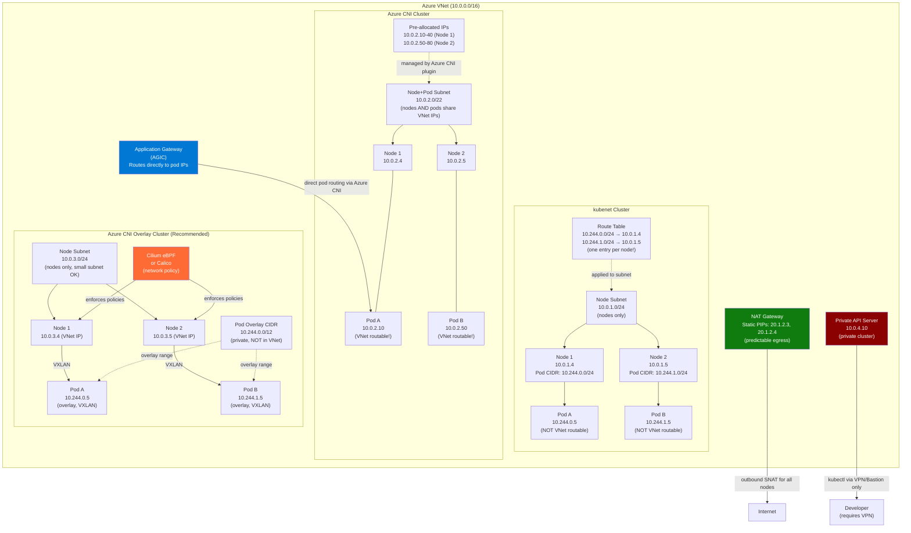

# AKS Networking: CNI Models, Policies, and Production Patterns

## Table of Contents

- [Overview](#overview)
- [AKS Networking Models](#aks-networking-models)
  - [kubenet](#kubenet)
  - [Azure CNI](#azure-cni)
  - [Azure CNI Overlay](#azure-cni-overlay)
- [Network Policy Engines on AKS](#network-policy-engines-on-aks)
  - [Azure Network Policy (Native)](#azure-network-policy-native)
  - [Calico on AKS](#calico-on-aks)
  - [Azure CNI Powered by Cilium](#azure-cni-powered-by-cilium)
- [AGIC (Application Gateway Ingress Controller)](#agic-application-gateway-ingress-controller)
- [Azure Load Balancer Integration with AKS](#azure-load-balancer-integration-with-aks)
- [Private AKS Clusters](#private-aks-clusters)
- [NAT Gateway for AKS Outbound](#nat-gateway-for-aks-outbound)
- [AKS Networking Architecture Diagram](#aks-networking-architecture-diagram)
- [Real-World Production Scenario](#real-world-production-scenario)
  - ["AKS Pods Running Out of VNet IPs — Migrating from Azure CNI to Azure CNI Overlay"](#aks-pods-running-out-of-vnet-ips-migrating-from-azure-cni-to-azure-cni-overlay)
- [Failure Modes](#failure-modes)
- [Debugging Guide](#debugging-guide)
  - [Pod Network Connectivity Debugging](#pod-network-connectivity-debugging)
  - [Azure CNI IP Allocation Check](#azure-cni-ip-allocation-check)
  - [Network Policy Debugging with Calico](#network-policy-debugging-with-calico)
  - [Cilium Observability with Hubble](#cilium-observability-with-hubble)
  - [Private Cluster Access Debugging](#private-cluster-access-debugging)
- [Security Considerations](#security-considerations)
- [Interview Questions](#interview-questions)
  - [Basic](#basic)
  - [Intermediate](#intermediate)
  - [Advanced / Staff Level](#advanced-staff-level)

---

## Overview

AKS networking is one of the most operationally complex areas in Azure. The choice of CNI plugin has cascading effects on VNet IP consumption, network policy capabilities, pod-to-pod latency, and your ability to scale node pools. Getting this wrong early in a cluster's life means a disruptive migration — potentially requiring workload downtime. This guide covers the real trade-offs, production failure patterns, and what a Staff SRE needs to know about AKS networking internals.


---

## AKS Networking Models

> Azure Kubernetes Service (AKS) supports multiple network plugin options that determine how pod networking, IP address allocation, and network policies are configured for your cluster. The choice of network plugin has significant implications for IP address consumption, pod density, network policy capabilities, and compatibility with other Azure services.
> — [Azure Docs: AKS Network Concepts](https://learn.microsoft.com/azure/aks/concepts-network)

### kubenet

> Kubenet is a basic network plugin that configures the Linux kernel's networking stack to use a virtual network for pod communication. With kubenet, nodes receive IP addresses from the Azure VNet subnet, but pods receive IP addresses from a logically different address space. Azure uses user-defined routes (UDRs) to enable cross-node pod communication by routing pod traffic through the node's IP address.
> — [Azure Docs: Kubenet Networking](https://learn.microsoft.com/azure/aks/use-kubenet)

kubenet is AKS's simple overlay networking model. Nodes get VNet IPs; pods get IPs from a private overlay range (default `10.244.0.0/16`) that is NOT routable in the VNet.

**How it works**:
- Each node gets a `/24` pod CIDR from the overlay range
- Pods on the same node communicate directly
- Pods on different nodes communicate via the node's IP with SNAT (Azure routes pod traffic via node IP)
- Azure installs a custom UDR per node in the route table, mapping that node's pod CIDR to the node's IP

```
Node 1: 10.0.1.4 (VNet IP)  → pods get 10.244.0.0/24
Node 2: 10.0.1.5 (VNet IP)  → pods get 10.244.1.0/24

Pod on Node 1 (10.244.0.5) → Pod on Node 2 (10.244.1.5):
  Packet: src=10.244.0.5, dst=10.244.1.5
  Node 1 encapsulates → src=10.0.1.4 (SNAT), dst=10.0.1.5
  Azure UDR: 10.244.1.0/24 → next-hop=10.0.1.5
  Node 2 decapsulates, delivers to pod
```

**Limitations**:
- UDRs are created per node — Azure allows max **400 routes** per route table. With kubenet, each node consumes 1 route entry. This limits kubenet clusters to ~400 nodes.
- Cross-node pod traffic uses SNAT — pod source IP is lost; origin appears as node IP to the destination
- Performance overhead from encapsulation
- Not compatible with some network policies (Calico works, Azure CNI Network Policy does not apply)

**When to use kubenet**: Small clusters (<200 nodes), development environments, or when VNet IP space is extremely constrained and workloads are not network-intensive.

### Azure CNI

> With Azure CNI, every pod gets an IP address from the subnet and can be accessed directly. These IP addresses must be unique across your network space and must be planned in advance. Each node has a maximum number of pods it can support, and each supported pod has one IP address reserved in the subnet. This approach requires more IP address planning but allows direct pod connectivity and enables Azure network policies.
> — [Azure Docs: Azure CNI Networking](https://learn.microsoft.com/azure/aks/configure-azure-cni)

Azure CNI assigns each pod a real VNet IP address. Pods are first-class citizens in the VNet — they're directly reachable from on-premises, other VNets, and Azure services without any encapsulation.

**How it works**:
- Azure CNI pre-allocates a pool of IP addresses on each node's NIC at node creation
- Default pre-allocation: node counts × `--max-pods` (default 30) IPs must fit in the subnet
- Pods receive IPs from this pool; when pods are deleted, IPs return to the pool

**The VNet IP exhaustion problem**:
```
Cluster: 50 nodes × 30 max-pods = 1500 VNet IPs required minimum
Add safety margin (rolling updates = 2x nodes temporarily): 3000 IPs
Subnet: /21 = 2048 - 5 = 2043 usable → NOT ENOUGH for rolling updates

Required subnet size for 50 nodes, 30 pods/node, safe rolling:
50 × 30 + 50 × 30 (surge) = 3000 → minimum /20 (4096 IPs)
```

This is the #1 mistake teams make with Azure CNI: undersized subnets.

**Advantages**:
- Pods are directly routable (no NAT, no encapsulation)
- No route table scaling limit (no UDRs per pod)
- Service accounts and network policies can use real pod IPs
- Compatible with Azure Network Policy and Calico
- Required for certain AKS features (Azure Application Gateway Ingress Controller direct pod routing)

### Azure CNI Overlay

> Azure CNI Overlay is an updated networking model that separates pod IP addressing from the VNet address space. Nodes receive VNet IPs, while pods receive IPs from a private overlay CIDR that does not consume VNet address space. This significantly reduces VNet IP consumption compared to standard Azure CNI while retaining support for Azure network policies, Calico, and Cilium.
> — [Azure Docs: Azure CNI Overlay](https://learn.microsoft.com/azure/aks/azure-cni-overlay)

Azure CNI Overlay is the recommended model for new clusters as of 2023. It combines the best of both worlds:
- **Nodes** get VNet IPs (directly routable, manageable count)
- **Pods** get IPs from a private overlay CIDR (not VNet-routable, no VNet IP exhaustion)
- Uses VXLAN for pod-to-node traffic, Azure CNI for node-level routing

**How it differs from kubenet**:
- Richer networking features (Azure Network Policy, Calico, Cilium all supported)
- No per-node UDR requirement (overlay handles routing within the cluster)
- Pod IPs are stable within the cluster but not routable from outside the cluster
- Service mesh and network policies work correctly with pod IPs
- No 400-node limit from UDR table

**IP math with Azure CNI Overlay**:
```
Cluster: 50 nodes, 250 pods/node (max)
VNet IPs needed: 50 (one per node) + load balancer IPs + management
Pod IPs: from overlay CIDR 10.244.0.0/12 (completely separate)
Subnet size: /26 (64 IPs) can comfortably hold 50 nodes + overhead
```

This is the model that solves VNet IP exhaustion without losing network policy capabilities.

---

## Network Policy Engines on AKS

> Kubernetes network policies control traffic flow at the IP address or port level between pods within a cluster. AKS supports multiple network policy engines — Azure Network Policy Manager, Calico, and Cilium — each implementing the Kubernetes NetworkPolicy API with different performance characteristics, additional features, and compatibility requirements.
> — [Azure Docs: AKS Network Policies](https://learn.microsoft.com/azure/aks/use-network-policies)

### Azure Network Policy (Native)

> Azure Network Policy Manager (NPM) is Microsoft's native implementation of Kubernetes network policies for AKS. It translates Kubernetes NetworkPolicy objects into Linux iptables rules on each node, enforcing pod-level network segmentation within the cluster. It is designed for simpler policy scenarios and is being superseded by Azure CNI Powered by Cilium for new workloads.
> — [Azure Docs: Azure NPM](https://learn.microsoft.com/azure/aks/use-network-policies#network-policy-options-in-aks)

Microsoft's native network policy implementation. It uses Linux iptables rules on each node.

**Limitations** (critical for production decisions):
- Supports only **ingress policies** — no egress network policies
- No FQDN-based policies (cannot allow pod X to reach `api.stripe.com`)
- Limited to Kubernetes NetworkPolicy spec v1
- Performance degrades with large numbers of pods due to iptables chain length
- Being superseded by Cilium in new AKS releases

### Calico on AKS

> Calico is an open-source networking and network policy engine for Kubernetes that can be used with AKS. It enforces Kubernetes NetworkPolicy using iptables or eBPF rules on each node and extends the standard API with its own CRDs (GlobalNetworkPolicy, NetworkSet) for cluster-wide policy defaults, FQDN-based policies, and richer logging capabilities.
> — [Azure Docs: Use Calico Network Policies](https://learn.microsoft.com/azure/aks/use-network-policies)

Project Calico, now maintained by Tigera, is the most widely deployed network policy engine. Microsoft recommends Calico for production AKS.

```bash
az aks create \
  -g prod-rg -n prod-cluster \
  --network-plugin azure \
  --network-policy calico \
  --network-plugin-mode overlay
```

**Calico advantages over Azure Network Policy**:
- Full NetworkPolicy spec support including egress
- `GlobalNetworkPolicy` resource for cluster-wide defaults (e.g., default-deny-all)
- Better performance with eBPF dataplane (when enabled)
- Richer logging and diagnostics
- FQDN-based policies with Calico Enterprise (paid)

### Azure CNI Powered by Cilium

> Azure CNI Powered by Cilium is the most advanced AKS networking option, combining Azure CNI Overlay for IP address management with Cilium as the networking and security dataplane. Cilium uses eBPF (extended Berkeley Packet Filter) for high-performance network policy enforcement, replaces kube-proxy for service load balancing, and provides Hubble for built-in network observability and flow logging.
> — [Azure Docs: Azure CNI Powered by Cilium](https://learn.microsoft.com/azure/aks/azure-cni-powered-by-cilium)

The newest AKS networking option combines Azure CNI Overlay with Cilium as the dataplane. This replaces kube-proxy with Cilium's eBPF-based load balancing and provides:
- eBPF-based network policies (significantly better performance than iptables)
- L7 network policies (HTTP, gRPC, DNS filtering at the network level)
- Hubble for network observability (flow logs, metrics, distributed tracing)
- Cluster Mesh for multi-cluster connectivity

```bash
az aks create \
  -g prod-rg -n prod-cluster \
  --network-plugin azure \
  --network-dataplane cilium \
  --network-plugin-mode overlay
```

**When to choose Cilium**:
- Large clusters (>500 nodes) where iptables performance is degrading
- Need for L7 network policies or FQDN-based policies
- Need for built-in network observability without installing a service mesh
- eBPF-based service load balancing without kube-proxy

---

## AGIC (Application Gateway Ingress Controller)

> The Application Gateway Ingress Controller (AGIC) is a Kubernetes application that runs as a pod within your AKS cluster. AGIC monitors the Kubernetes Ingress resources and translates them into Application Gateway-specific configuration updates, allowing a single Application Gateway to serve traffic for multiple services in AKS without requiring a separate load balancer or proxy.
> — [Azure Docs: AGIC Overview](https://learn.microsoft.com/azure/application-gateway/ingress-controller-overview)

AGIC is a Kubernetes Ingress controller that provisions and manages Azure Application Gateway resources in response to Kubernetes Ingress objects.

**Architecture**:
```
Ingress object created → AGIC reads it → AGIC calls Azure ARM API → AppGW configured
Client request → AppGW → Pod IP directly (no Kubernetes Service NodePort/ClusterIP hop)
```

The key advantage: AGIC routes directly to pod IPs when using Azure CNI. There's no kube-proxy, no iptables NAT, no NodePort overhead. Traffic goes AppGW → Pod.

**AGIC deployment options**:
1. **AKS Add-on (managed)**: Microsoft manages AGIC lifecycle; integrated with AKS cluster lifecycle
2. **Helm-deployed**: Manual management, more flexibility but operational overhead

```bash
# Enable AGIC add-on on existing cluster
az aks enable-addons \
  -g prod-rg -n prod-cluster \
  --addons ingress-appgw \
  --appgw-name prod-appgw \
  --appgw-subnet-cidr 10.0.5.0/24
```

**AGIC limitations**:
- Only works with Azure CNI (pods need VNet IPs for AppGW to route directly to pods)
- AppGW v2 SKU required (v1 not supported)
- One AGIC per AppGW; one AppGW per cluster (or shared AppGW across clusters with proper isolation)
- Namespace isolation: multiple teams sharing one AppGW must use `IngressClass` and AGIC ProhibitedTargets

---

## Azure Load Balancer Integration with AKS

> When you create a Kubernetes Service of type `LoadBalancer` in AKS, the Azure Cloud Controller Manager automatically provisions an Azure Standard Load Balancer with a public or private frontend IP. The controller manages the LB lifecycle alongside the Service object, including backend pool membership, health probe configuration, and load balancing rules.
> — [Azure Docs: Load Balancer in AKS](https://learn.microsoft.com/azure/aks/load-balancer-standard)

When you create a Kubernetes `Service` of type `LoadBalancer`, AKS automatically creates an Azure Standard Load Balancer. The integration uses the Azure Cloud Controller Manager.

```yaml
apiVersion: v1
kind: Service
metadata:
  name: my-service
  annotations:
    service.beta.kubernetes.io/azure-load-balancer-internal: "true"  # internal LB
    service.beta.kubernetes.io/azure-load-balancer-internal-subnet: "aks-ilb-subnet"
    service.beta.kubernetes.io/azure-pip-name: "my-specific-pip"  # use specific public IP
spec:
  type: LoadBalancer
  ports:
  - port: 80
    targetPort: 8080
```

**Important behaviors**:
- AKS uses a single shared ALB per cluster by default (for cost efficiency)
- Multiple services share the same ALB with different frontend IPs or ports
- To use a dedicated ALB per service: use `loadBalancerClass: azure.microsoft.com/single-lb` (requires AKS 1.27+)
- Internal LB annotation forces ALB frontend to a private VNet IP

---

## Private AKS Clusters

> A private AKS cluster ensures that network traffic between the API server and node pools remains on the private network only. The API server endpoint has no public IP address and is routable solely within the VNet via a Private Endpoint, preventing the Kubernetes control plane from being exposed to the internet.
> — [Azure Docs: Private AKS Cluster](https://learn.microsoft.com/azure/aks/private-cluster)

A private AKS cluster exposes the API server exclusively via a Private Endpoint — no public IP on the API server.

```bash
az aks create \
  -g prod-rg -n prod-cluster \
  --enable-private-cluster \
  --private-dns-zone system  # Azure manages private DNS
```

**What this means operationally**:
- `kubectl` from developer laptops requires VPN, ExpressRoute, or Azure Bastion
- CI/CD pipelines must run inside the VNet (use self-hosted agents on VMs/AKS in the VNet, or Azure DevOps Private Agents)
- `az aks get-credentials` works, but `kubectl` commands require connectivity to the private API server IP

**Private DNS zone options**:
| Option | Behavior |
|--------|---------|
| `system` | Azure creates and manages a private DNS zone in the node resource group |
| `/subscriptions/.../privateDnsZones/name` | Bring your own private DNS zone |
| `none` | No private DNS zone created — you manage DNS yourself |

For enterprise setups with custom DNS servers, use `none` and configure your DNS to resolve the API server FQDN to the private IP.

---

## NAT Gateway for AKS Outbound

> Azure NAT Gateway provides outbound internet connectivity for resources in private subnets by using a pool of static public IP addresses for source network address translation (SNAT). When attached to an AKS node subnet, it ensures all outbound traffic from cluster nodes and pods uses predictable, stable public IP addresses with a large pool of SNAT ports.
> — [Azure Docs: NAT Gateway for AKS](https://learn.microsoft.com/azure/aks/nat-gateway)

AKS nodes need outbound internet access (for pulling container images, calling external APIs). Three outbound methods:

| Method | Use Case | Drawbacks |
|--------|----------|-----------|
| Default Azure SNAT (managed LB) | Simple clusters | Shared SNAT ports; unpredictable source IPs |
| Public IPs on nodes | Development | Each node has its own IP; hard to whitelist |
| NAT Gateway | Production | Predictable IPs; scales automatically |
| User-defined routing (UDR to NVA) | Enterprise with firewall | All egress inspected; complex routing |

NAT Gateway provides:
- 1-16 static public IP addresses for all outbound connections
- Each public IP provides 64,512 SNAT ports
- Predictable source IPs — whitelist these IPs in external services' firewalls

```bash
# Create NAT Gateway
az network nat gateway create \
  -g prod-rg -n aks-nat-gw \
  --public-ip-addresses aks-nat-pip \
  --idle-timeout 10

# Attach to AKS node subnet
az network vnet subnet update \
  -g prod-rg -n aks-nodes-subnet \
  --vnet-name prod-vnet \
  --nat-gateway aks-nat-gw
```

---

## AKS Networking Architecture Diagram




---

## Real-World Production Scenario

### "AKS Pods Running Out of VNet IPs — Migrating from Azure CNI to Azure CNI Overlay"

**The Situation**: A team built their production cluster 18 months ago with Azure CNI on a `/22` subnet (1019 usable IPs). Initial cluster was 20 nodes × 30 max-pods = 600 IPs needed. Looked fine. But the cluster grew: now 40 nodes × 30 max-pods = 1200 IPs needed — already over the subnet size. Worse, during rolling node pool upgrades, Azure creates a surge node (40+1=41 nodes temporarily), and the Azure CNI pre-allocates IPs per node even for nodes not yet running pods. IP allocation failures start appearing.

**Symptoms**:
```
Events on Pod:
  Warning  FailedCreatePodSandBox: Failed to create pod sandbox:
  rpc error: code = Unknown desc = failed to set up sandbox container
  "x" network for pod "y": networkPlugin cni failed to set up pod
  "y_namespace" network: failed to allocate for range 0: no IP
  addresses available in range set
```

Nodes also start showing:
```
kubectl describe node aks-nodepool1-12345678-vmss000042
  ...
  Conditions:
    NetworkUnavailable: True  # new nodes can't get IPs
```

**Investigation**:
```bash
# Check available IPs in subnet
az network vnet subnet show \
  -g MC_prod-rg_prod-cluster_eastus \
  -n aks-subnet \
  --vnet-name prod-vnet \
  --query "ipConfigurations | length(@)"
# Output: 1019 (all IPs allocated)

# Check Azure CNI IP allocation logs on a node
kubectl get nodes -o wide
# All nodes show STATUS=NotReady or pods pending on new nodes

# Check if it's Azure CNI exhaustion vs subnet exhaustion
kubectl get pods -A | grep -v Running  # shows Pending pods
kubectl describe pod <pending-pod> | grep Events
```

**The Migration Plan — Azure CNI to Azure CNI Overlay**:

In-place CNI migration is NOT supported. You must migrate workloads. The approach:

**Phase 1: Prepare a new cluster**
```bash
# New cluster with Azure CNI Overlay
az aks create \
  -g prod-rg \
  -n prod-cluster-v2 \
  --network-plugin azure \
  --network-plugin-mode overlay \
  --pod-cidr 10.244.0.0/12 \
  --service-cidr 10.100.0.0/16 \
  --dns-service-ip 10.100.0.10 \
  --vnet-subnet-id /subscriptions/.../subnets/aks-nodes-subnet-new \
  # Note: new node subnet can be /24 (just node IPs, not pod IPs)
  --network-policy calico \
  --enable-private-cluster
```

**Phase 2: Validate networking equivalence**
```bash
# Verify Calico policies migrated correctly
kubectl get networkpolicies -A
# Test pod-to-pod connectivity
kubectl exec -n test deploy/frontend -- curl http://backend.test.svc.cluster.local

# Verify egress via NAT Gateway (same static IPs)
kubectl exec -n test deploy/test-pod -- curl ifconfig.me
```

**Phase 3: Blue-green migration**
- Update DNS/Front Door/ALB to route a percentage of traffic to new cluster
- Use weighted routing: 5% → new cluster, monitor error rates
- Gradually shift to 100% once validated
- Decommission old cluster

**Why this happens and how to prevent it**: When initially sizing the subnet, the formula must account for: `(max_nodes × max_pods_per_node) × 2` (surge capacity) `+ system_pods + LB_IPs`. With Azure CNI Overlay, the formula simplifies to: `max_nodes × 1 (VNet IP per node) + LB_IPs` — a 30x reduction in VNet IP requirements.

---

## Failure Modes

| Failure | Symptoms | Detection | Fix |
|---------|----------|-----------|-----|
| Azure CNI VNet IP exhaustion | Pods pending; `NetworkUnavailable` on nodes; "no IP addresses available" in kubelet logs | `az network vnet subnet show` — count IP configurations; `kubectl describe node` | Expand subnet CIDR or migrate to Azure CNI Overlay |
| kubenet UDR table full (>400 nodes) | New nodes cannot join cluster; route insertion fails | Check Azure route table route count; node join errors in kube-controller-manager logs | Migrate to Azure CNI or Azure CNI Overlay (no per-node UDR required) |
| NSG blocking pod egress | Pods cannot reach external endpoints; DNS resolution fails | `kubectl exec pod -- curl https://api.external.com`; NSG flow logs | Add NSG outbound rule allowing pod subnet or node subnet to internet |
| AGIC cannot update AppGW | Ingress changes not reflected in AppGW; AGIC pod shows ARM API errors | `kubectl logs -n kube-system deploy/ingress-appgw-deployment`; AGIC controller errors | Check AGIC managed identity permissions — needs `Contributor` on AppGW resource |
| Private cluster kubectl fails | `Unable to connect to server: dial tcp <private-ip>: connect: connection refused` | `kubectl cluster-info` — FQDN resolution returns private IP not reachable | Ensure kubectl is run from within VNet (use Bastion, VPN, or jump host) |
| NAT Gateway SNAT port exhaustion | Outbound connection failures from pods; logs show connection timeouts | Azure Monitor: NAT Gateway `SNATConnectionFailed` metric | Add additional public IPs to NAT Gateway (each IP adds 64,512 SNAT ports) |
| Calico network policy race condition | Pods start receiving traffic before NetworkPolicy is applied | `kubectl get networkpolicy` shows policy; but brief window during pod start without policy | Enable Calico's `failsafePolicyEnabled`; use `calico-kube-controllers` |
| AKS node pool subnet different from pod subnet in Azure CNI | New node pool pods get 403 from Azure Storage Service Endpoints | Service Endpoint network rules miss new subnet | Add Service Endpoint and storage network rule for each node pool subnet; prefer Private Endpoints |

---

## Debugging Guide

### Pod Network Connectivity Debugging

```bash
# Check pod-to-pod connectivity
kubectl exec -n app-namespace deploy/frontend -- \
  curl -v http://backend.app-namespace.svc.cluster.local:8080/health

# Check DNS resolution
kubectl exec -n app-namespace deploy/frontend -- \
  nslookup kubernetes.default.svc.cluster.local

# Check if NetworkPolicy is blocking
kubectl get networkpolicies -n app-namespace -o yaml

# Temporarily test without network policy (in test env only)
kubectl delete networkpolicy --all -n app-namespace

# Check Calico policy enforcement
kubectl exec -n kube-system deploy/calico-kube-controllers -- \
  calico-kube-controllers show
```

### Azure CNI IP Allocation Check

```bash
# Check Azure CNI plugin logs on a node
kubectl get pods -n kube-system | grep azure-cni
kubectl logs -n kube-system azure-cni-networkmonitor-xxxxx

# Check IP pool on a node (SSH to node or use privileged debug pod)
kubectl debug node/aks-nodepool1-12345678-vmss000001 -it --image=ubuntu

# Inside debug pod:
# cat /var/log/azure-cni.log | grep "IP allocation"
# ip addr show | grep "inet "
```

### Network Policy Debugging with Calico

```bash
# Check if Calico is blocking connections
kubectl exec -n kube-system deploy/calico-node -- \
  calicoctl get workloadendpoints --all-namespaces

# Check effective policies on a pod
kubectl exec -n kube-system deploy/calico-node -- \
  calicoctl get policy -o wide

# Use Calico's flow logs
kubectl logs -n kube-system ds/calico-node | grep "DENIED"
```

### Cilium Observability with Hubble

```bash
# Enable Hubble (if using Azure CNI Powered by Cilium)
cilium hubble enable --ui

# Watch live traffic flows
hubble observe --namespace app-namespace --follow

# Check dropped flows (network policy denials)
hubble observe --verdict DROPPED --namespace app-namespace

# Get connectivity report
cilium connectivity test
```

### Private Cluster Access Debugging

```bash
# Check API server private endpoint
az aks show -g prod-rg -n prod-cluster --query "privateFqdn"
# Output: prod-cluster-xxxxx.privatelink.eastus.azmk8s.io

# Verify private DNS resolution from within VNet
nslookup prod-cluster-xxxxx.privatelink.eastus.azmk8s.io
# Should return private IP 10.x.x.x

# Check private DNS zone link
az network private-dns link vnet list \
  -g MC_prod-rg_prod-cluster_eastus \
  -z "privatelink.eastus.azmk8s.io"
```

---

## Security Considerations

**Network Policy as security control**: Default AKS clusters have no network policies — all pods can communicate with all other pods in the cluster. For multi-tenant clusters or any cluster with different trust boundaries between namespaces, deploy a default-deny NetworkPolicy immediately after cluster creation:

```yaml
apiVersion: networking.k8s.io/v1
kind: NetworkPolicy
metadata:
  name: default-deny-all
  namespace: production
spec:
  podSelector: {}  # matches all pods in namespace
  policyTypes:
  - Ingress
  - Egress
  # No ingress/egress rules = deny all
```

Then explicitly allow required traffic. This is defense-in-depth alongside NSGs.

**Azure CNI security advantage**: With Azure CNI, pod IPs are real VNet IPs, which means NSGs applied to the node subnet also cover pod traffic. With kubenet, pods use overlay IPs that are NAT'd through the node — NSGs see node IPs, not pod IPs. For PCI or HIPAA environments requiring audit trails of pod-level network traffic, Azure CNI provides better visibility in NSG flow logs.

**Private cluster API server attack surface**: Public AKS API servers are internet-facing — they accept kubectl commands from any IP. Brute force attacks against kubeconfig credentials, certificate harvesting, and Kubernetes API enumeration are real threats. Use private clusters for production workloads. If private cluster is not feasible, enable `--api-server-authorized-ip-ranges` to restrict access to known CIDRs.

**AGIC managed identity scope**: AGIC requires the `Contributor` role on the Application Gateway resource. In a shared cluster where AGIC manages a shared AppGW, a compromised AGIC pod (via Kubernetes privilege escalation) could modify AppGW rules for ALL tenants sharing that AppGW. Use separate AppGW instances per security boundary. Consider the addon version (managed by Microsoft) which has tighter identity scoping than Helm-deployed AGIC.

**Node subnet vs pod subnet in Azure CNI**: Azure CNI NIC secondary IPs (pod IPs) are attached to the node NIC. This means the node's NIC security group policies apply to pod traffic. If your NSG rules are based on named resources (ASGs), ensure pod IPs are accounted for — they're associated with the same NIC as the node, so they inherit the node's ASG membership, which is usually correct but should be verified.

**Workload Identity for pod-level Azure RBAC**: Instead of mounting storage keys or service principal credentials in pods, use AKS Workload Identity. This binds a Kubernetes Service Account to an Azure Managed Identity, allowing pods to obtain short-lived Azure tokens via the OIDC token endpoint — no credential secrets, no rotation required.

```bash
az aks update \
  -g prod-rg -n prod-cluster \
  --enable-oidc-issuer \
  --enable-workload-identity
```

---

## Interview Questions

### Basic

**Q: What is the main operational difference between kubenet and Azure CNI in AKS?**
A: With kubenet, pods get IPs from a private overlay range — not VNet IPs. Pods are not directly reachable from outside the cluster; inter-node pod traffic uses SNAT via the node IP. Azure CNI gives each pod a real VNet IP, making pods directly addressable from other VNets, on-premises, and Azure services. The downside is VNet IP consumption — a 100-node cluster with 30 pods/node needs 3000 VNet IPs. Azure CNI Overlay is the modern alternative: pods get overlay IPs (not VNet IPs) but with richer networking features than kubenet.

**Q: Why would you use a private AKS cluster? What operational challenges does it introduce?**
A: Private clusters expose the Kubernetes API server only via a Private Endpoint — no public IP means no internet-accessible endpoint for kubectl or CI/CD. This eliminates a significant attack surface (the API server controls the entire cluster). The challenge: developers and pipelines need VPN, ExpressRoute, or a jump host/bastion to run kubectl commands. CI/CD pipelines (GitHub Actions, Azure DevOps) need self-hosted runners inside the VNet. This adds operational complexity but is required for security-sensitive environments.

**Q: What is AGIC and what networking model does it require?**
A: AGIC (Application Gateway Ingress Controller) is a Kubernetes Ingress controller that manages Azure Application Gateway based on Kubernetes Ingress resources. It requires Azure CNI (not kubenet) because it routes traffic directly to pod IPs — AppGW needs to reach pod IPs directly, which are only reachable as VNet IPs with Azure CNI. With Azure CNI Overlay, pods have overlay IPs not reachable from AppGW, so AGIC does not work with Overlay mode.

### Intermediate

**Q: A 50-node Azure CNI cluster is hitting IP exhaustion. Walk through the diagnosis and mitigation options.**
A: Diagnosis:

1. Check `az network vnet subnet show` for IP configuration count vs subnet size.
2. Check kubelet logs and pod events for "no IP addresses available" errors.
3. Check Azure CNI log on nodes. Mitigation options:
4. Short-term: add additional IPs to nodes' NICs by increasing `--max-pods` on a new node pool with a larger subnet.
5. Medium-term: expand the existing subnet CIDR (if address space allows) — you can extend the subnet prefix to a larger range in Azure.
6. Long-term: migrate to Azure CNI Overlay — requires creating a new cluster since in-place CNI migration is unsupported. Use blue-green deployment to migrate workloads.

**Q: How do Calico NetworkPolicies interact with Azure NSGs in an AKS cluster?**
A: They are complementary but independent controls at different layers. NSGs operate at the VNet level on the Azure SDN — they filter traffic between subnets or between the internet and the subnet. Calico NetworkPolicies operate inside the cluster at the node level — they filter pod-to-pod traffic using iptables/eBPF rules on the Kubernetes network interface. A packet from Pod A to Pod B must pass BOTH controls: first the NSG (if they're in different subnets or one is an external IP), and then Calico's pod-level policy. NSGs cannot distinguish between pods within the same subnet (they see only node-level IPs with kubenet, or individual pod IPs with Azure CNI). For compliance scenarios, you need both: NSGs for the outer perimeter and Calico for pod-level micro-segmentation.

**Q: A team is using Kubernetes Service type LoadBalancer in AKS. They want all services to use a single stable public IP. Is this possible, and how?**
A: By default, each LoadBalancer service creates or acquires a unique public IP. To share a public IP:

1. For HTTP/HTTPS services, use an Ingress controller (AGIC or NGINX) that provisions a single AppGW or LB with one public IP, routing to multiple backend services based on host/path.
2. For non-HTTP services on different ports, create a single Azure Standard LB with multiple load balancing rules sharing one frontend IP — in Kubernetes terms, annotate services with `service.beta.kubernetes.io/azure-pip-name: my-shared-pip` (available in AKS with Azure Cloud Controller Manager). Each service must use a different port.
3. For a pre-allocated static IP, create the public IP in Azure, then reference it with `loadBalancerIP: 20.x.x.x` in the Service spec and annotate with `service.beta.kubernetes.io/azure-pip-name`.

### Advanced / Staff Level

**Q: Design the networking architecture for a multi-tenant AKS cluster where tenants are different business units that must be strictly isolated at the network layer. The cluster uses Azure CNI Overlay.**
A: Multi-tenant isolation with Azure CNI Overlay requires layered controls since pods have overlay IPs (not VNet IPs):

1. **Namespace-level isolation**: Each tenant gets a dedicated namespace. Default-deny NetworkPolicy applied to every tenant namespace.
2. **Calico GlobalNetworkPolicy**: Apply cluster-wide policies that deny cross-namespace traffic by default, with explicit allow rules for shared services (monitoring, DNS).
3. **Node pool isolation**: Give each tenant a dedicated node pool with node taints/tolerations, so their workloads never run on shared nodes. This provides process-level isolation in addition to network isolation.
4. **Egress control**: Use Calico egress gateway per tenant namespace — each tenant namespace's egress traffic exits through a dedicated static IP, enabling external services to whitelist per-tenant.
5. **AGIC with ProhibitedTargets**: If using AGIC, configure ProhibitedTargets CRD to prevent one tenant's AGIC from modifying another's AppGW backend pools.
6. **Azure Monitor and Hubble**: Enable network flow logging per namespace with Cilium Hubble; integrate with tenant-specific Log Analytics workspaces so tenants can audit their own traffic without cross-tenant visibility. The Azure CNI Overlay model is actually better for this scenario than Azure CNI because it allows many more pods without VNet IP constraints, supporting large tenant workloads.

**Q: Explain exactly how Azure CNI allocates IPs to pods and what happens when a node runs out of pre-allocated IPs. What is the "IP pre-allocation" behavior and how does it affect scaling?**
A: Azure CNI pre-allocates IP addresses from the VNet subnet to each node's NIC as secondary IP configurations. At node creation, Azure CNI reserves a pool of IPs on the NIC — the pool size is typically `--max-pods` (default 30). These are Azure secondary IP configurations registered on the node's NIC in the VNet. When a pod is scheduled, Azure CNI assigns one pre-allocated IP to the pod's veth interface. When the pod terminates, the IP returns to the pool on the NIC but remains allocated in Azure (not freed back to the subnet) until the pool is below the low-watermark threshold. The "dynamic" IP allocation mode (introduced in Azure CNI v1.4+) changes this behavior: instead of pre-allocating all IPs at node creation, it allocates IPs on demand and returns them to the subnet pool when pods terminate. This reduces idle IP consumption. However, dynamic mode introduces a small latency for pod startup (IP allocation API call vs using a pre-allocated IP). For latency-sensitive fast-scaling workloads, pre-allocation (static mode) is preferable. The node scale-out consequence: when you add a node, Azure CNI immediately attempts to reserve `max-pods` IPs from the subnet. If the subnet is exhausted, the node's CNI plugin initialization fails, and the node enters `NetworkUnavailable` state. This is why the node count × max-pods calculation must account for ALL nodes that will exist simultaneously, including surge capacity during rolling upgrades.
