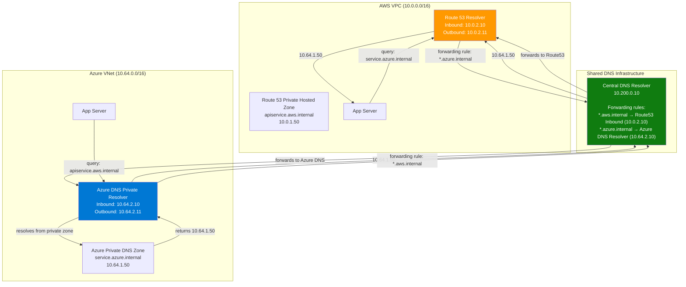
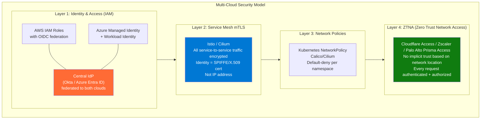
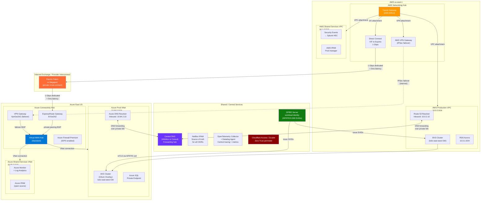

# Multi-Cloud Networking Patterns

## Table of Contents

- [Overview](#overview)
- [Why Multi-Cloud (Real Motivations)](#why-multi-cloud-real-motivations)
- [Routing Paradigm Differences](#routing-paradigm-differences)
  - [AWS Routing Model](#aws-routing-model)
  - [Azure Routing Model](#azure-routing-model)
  - [GCP Routing Model](#gcp-routing-model)
- [IPAM Strategy: Preventing CIDR Overlaps](#ipam-strategy-preventing-cidr-overlaps)
  - [Address Space Allocation Strategy](#address-space-allocation-strategy)
  - [Cloud-Native IPAM Tools](#cloud-native-ipam-tools)
- [Cross-Cloud Connectivity Options](#cross-cloud-connectivity-options)
  - [Option 1: Internet with Encryption (WireGuard / IPSec)](#option-1-internet-with-encryption-wireguard-ipsec)
  - [Option 2: Cloud Provider Interconnect via Exchange](#option-2-cloud-provider-interconnect-via-exchange)
  - [Option 3: SD-WAN Overlays](#option-3-sd-wan-overlays)
- [DNS Federation in Multi-Cloud](#dns-federation-in-multi-cloud)
  - [The Problem](#the-problem)
  - [Solution Architecture: Centralized DNS Resolver](#solution-architecture-centralized-dns-resolver)
- [Service Mesh Multi-Cluster](#service-mesh-multi-cluster)
  - [Istio Multi-Cluster](#istio-multi-cluster)
  - [Cilium Cluster Mesh](#cilium-cluster-mesh)
- [Security Perimeter in Multi-Cloud](#security-perimeter-in-multi-cloud)
- [Observability in Multi-Cloud](#observability-in-multi-cloud)
  - [Centralized Logging](#centralized-logging)
- [Multi-Cloud Architecture Diagram](#multi-cloud-architecture-diagram)
- [Real-World Production Scenario](#real-world-production-scenario)
  - ["Latency Spikes Between AWS and Azure Services — Diagnosis and Optimization"](#latency-spikes-between-aws-and-azure-services-diagnosis-and-optimization)
- [Failure Modes](#failure-modes)
- [Debugging Guide](#debugging-guide)
  - [Cross-Cloud Connectivity Testing](#cross-cloud-connectivity-testing)
  - [BGP Route Verification](#bgp-route-verification)
  - [Service Mesh Cross-Cluster Health](#service-mesh-cross-cluster-health)
- [Security Considerations](#security-considerations)
- [Interview Questions](#interview-questions)
  - [Basic](#basic)
  - [Intermediate](#intermediate)
  - [Advanced / Staff Level](#advanced-staff-level)

---

## Overview

Multi-cloud is not a technology choice — it's an operational posture that comes with significant networking complexity. When AWS and Azure each have their own routing paradigms, CIDR management assumptions, and DNS namespaces, the seams between clouds become the most likely place for production incidents to originate. Senior SREs in multi-cloud environments spend most of their networking time at these seams — understanding BGP propagation between AWS Transit Gateway and Azure Virtual WAN, diagnosing latency spikes on cross-cloud calls that pass through an internet exchange, or debugging IPAM conflicts that were invisible until two teams merged their address spaces.

This guide treats multi-cloud networking as a first-class operational problem, not a slide in an architecture deck.

---

## Why Multi-Cloud (Real Motivations)

Understanding the actual drivers matters because each driver produces different architectural constraints:

| Driver | Networking Implication |
|--------|----------------------|
| Avoid vendor lock-in | Services in both clouds must communicate; latency is real cost |
| Best-of-breed services | AWS ML (SageMaker) + Azure identity (Entra ID) requires cross-cloud API traffic |
| Regulatory / data residency | Data must stay in specific geographic region; cloud selection per data type |
| M&A integration | Acquired company uses different cloud; need connectivity without full migration |
| Disaster recovery (DR) | Primary on AWS, DR on Azure; requires synchronized state and network paths |
| Cost optimization | Spot/preemptible compute across clouds for burst workloads |

The honest reality: teams often end up in multi-cloud by accident (M&A, departmental choices) rather than deliberate strategy. The architecture challenge is making an ad-hoc reality operationally manageable.

---

## Routing Paradigm Differences

> Each major cloud provider implements network routing with a distinct architectural model. AWS uses explicit route tables with Transit Gateway as the hub for cross-VPC and hybrid connectivity. Azure uses system routes with optional UDR overrides and Azure Virtual WAN for managed hub-and-spoke transit. GCP uses a global VPC model with Cloud Router managing all BGP sessions. Understanding these paradigm differences is essential for designing cross-cloud connectivity.
> — [AWS Docs: VPC Routing](https://docs.aws.amazon.com/vpc/latest/userguide/VPC_Route_Tables.html) | [Azure Docs: Routing Overview](https://learn.microsoft.com/azure/virtual-network/virtual-networks-udr-overview) | [GCP Docs: Cloud Routes](https://cloud.google.com/vpc/docs/routes)

AWS and Azure have fundamentally different mental models for network routing:

### AWS Routing Model

```
VPC → Transit Gateway → VPC/VPN/Direct Connect
- TGW is the hub; routes must be propagated to/from TGW route tables
- BGP is used between TGW and Direct Connect (via Virtual Private Gateway or TGW attachment)
- Within VPC: route tables per subnet; VPC is flat (all subnets in a VPC can reach each other by default)
- ECMP for multiple VPN tunnels to TGW
```

### Azure Routing Model

```
VNet → Virtual WAN Hub / ExpressRoute Gateway / VPN Gateway
- Azure SDN handles intra-VNet routing automatically
- UDRs override for NVA scenarios
- Azure Route Server for BGP injection into VNet route tables
- vWAN handles transit between VNets, on-premises, and branches
```

### GCP Routing Model

```
VPC → Cloud Router (manages BGP) → Interconnect/VPN
- GCP VPC is global (subnets in any region are in the same VPC, connected by Google's backbone)
- No concept of "VPC peering within GCP" for same organization — use Shared VPC
- Cloud Router handles all dynamic routing; BGP is the only option for on-premises connectivity
```

**Implication for multi-cloud**: There is no universal abstraction. SD-WAN overlays (Cisco Meraki SD-WAN, Palo Alto Prisma) provide a common management plane but the underlying cloud routing still follows each provider's model.

---

## IPAM Strategy: Preventing CIDR Overlaps

> IP Address Management (IPAM) in multi-cloud environments requires careful pre-allocation of non-overlapping CIDR blocks across all cloud providers, on-premises networks, and environments. Overlapping address spaces prevent direct routing between networks and require NAT workarounds that break service mesh and zero-trust security assumptions. Establishing a centralized IPAM strategy before provisioning any cloud infrastructure is critical.
> — [AWS Docs: VPC IPAM](https://docs.aws.amazon.com/vpc/latest/ipam/what-it-is-ipam.html)

Overlapping CIDRs between clouds is the operational debt that kills multi-cloud connectivity. Once services are deployed with overlapping address spaces, you cannot create routing between them without NAT — and NAT breaks many service mesh and security assumptions.

### Address Space Allocation Strategy

Reserve non-overlapping RFC1918 address blocks per cloud and per environment:

```
AWS:   10.0.0.0/10   → 10.0.0.0 - 10.63.255.255    (AWS production + staging)
Azure: 10.64.0.0/10  → 10.64.0.0 - 10.127.255.255  (Azure production + staging)
GCP:   10.128.0.0/10 → 10.128.0.0 - 10.191.255.255 (GCP production + staging)
On-premises: 172.16.0.0/12 (traditional corporate)
```

Within each cloud, further subdivide by region and environment:
```
AWS us-east-1 prod:     10.0.0.0/14   (10.0.0.0 - 10.3.255.255)
AWS us-east-1 staging:  10.4.0.0/14
AWS eu-west-1 prod:     10.8.0.0/14
Azure East US prod:     10.64.0.0/14
Azure East US staging:  10.68.0.0/14
```

### Cloud-Native IPAM Tools

> AWS VPC IP Address Manager (IPAM) is a managed service that helps you plan, track, and monitor IP addresses for your AWS workloads. It integrates with AWS Organizations for multi-account management and enables you to allocate CIDRs to VPCs from centrally managed pools, preventing overlap and providing network topology visibility across accounts and regions.
> — [AWS Docs: VPC IPAM](https://docs.aws.amazon.com/vpc/latest/ipam/what-it-is-ipam.html)

**AWS VPC IP Address Manager (IPAM)**: Centralized IP address management for AWS. Creates IP pools, enforces CIDR assignments, tracks utilization, and generates alerts on overlap. Integrates with AWS Organizations.

**Azure IPAM**: Microsoft's open-source IPAM tool (deployed in Azure as a managed app). Manages Azure address space, integrates with Azure Resource Manager.

**HashiCorp Cloud Platform IPAM / NetBox**: Cloud-agnostic. NetBox (open-source) is widely used as the source of truth for IPAM across multi-cloud and on-premises. Integrates with Terraform for automated CIDR allocation.

```hcl
# Terraform using NetBox IPAM for CIDR allocation
data "netbox_prefix" "aws_prod_eastus" {
  prefix = "10.0.0.0/14"
  site   = "aws-us-east-1"
  role   = "production"
}

resource "aws_vpc" "prod" {
  cidr_block = cidrsubnet(data.netbox_prefix.aws_prod_eastus.prefix, 2, 0)
  # Allocates 10.0.0.0/16 from the /14 pool
}
```

---

## Cross-Cloud Connectivity Options

> Connecting workloads across multiple cloud providers requires selecting an appropriate connectivity model based on bandwidth requirements, latency sensitivity, cost constraints, and security requirements. Options range from simple encrypted tunnels over the public internet to dedicated private circuits through network exchange providers.
> — [AWS Docs: Network-to-Amazon VPC Connectivity](https://docs.aws.amazon.com/whitepapers/latest/aws-vpc-connectivity-options/network-to-amazon-vpc-connectivity-options.html)

### Option 1: Internet with Encryption (WireGuard / IPSec)

> WireGuard and IPSec are cryptographic tunneling protocols that encrypt traffic traversing the public internet between cloud providers. They provide a cost-effective connectivity option for scenarios where variable internet latency is acceptable, by establishing authenticated peer-to-peer tunnels between designated endpoints in each cloud.
> — [WireGuard Docs](https://www.wireguard.com/) | [AWS Docs: VPN FAQs](https://aws.amazon.com/vpn/faqs/)

The lowest-cost, highest-latency option. Cloud-to-cloud traffic traverses the public internet but is encrypted.

**WireGuard approach**:
```bash
# AWS instance (WireGuard endpoint)
[Interface]
PrivateKey = <aws-private-key>
Address = 10.250.0.1/30  # WG tunnel IP
ListenPort = 51820

[Peer]
PublicKey = <azure-public-key>
AllowedIPs = 10.64.0.0/10  # Azure CIDR
Endpoint = 20.x.x.x:51820  # Azure VM public IP

# Azure instance (WireGuard endpoint)
[Interface]
PrivateKey = <azure-private-key>
Address = 10.250.0.2/30
ListenPort = 51820

[Peer]
PublicKey = <aws-public-key>
AllowedIPs = 10.0.0.0/10  # AWS CIDR
Endpoint = 54.x.x.x:51820  # AWS EC2 public IP
```

**When to use**: Dev/test environments, low-bandwidth cross-cloud, cost-sensitive scenarios.

**Limitations**: Latency is internet-dependent (50-150ms for cross-continental). The WireGuard endpoints are a single point of failure without HA setup. No SLA from cloud providers.

### Option 2: Cloud Provider Interconnect via Exchange

> Network exchange providers such as Equinix Fabric, Megaport, and PacketFabric operate colocation facilities where multiple cloud providers have physical presence. By connecting AWS Direct Connect and Azure ExpressRoute circuits to the same exchange provider, organizations can establish private, high-bandwidth, low-latency connectivity between clouds without traversing the public internet.
> — [AWS Docs: Direct Connect](https://docs.aws.amazon.com/directconnect/latest/UserGuide/Welcome.html) | [Azure Docs: ExpressRoute Partners](https://learn.microsoft.com/azure/expressroute/expressroute-locations)

Equinix, Megaport, and PCCW operate network exchanges where both AWS and Azure have presence. You order connectivity from both clouds to the same exchange, and traffic flows: AWS Direct Connect → Exchange → Azure ExpressRoute. This avoids the public internet.

```mermaid
graph LR
    subgraph aws["AWS"]
        TGW["Transit Gateway"]
        DX["Direct Connect\n(1 Gbps)"]
    end

    subgraph exchange["Equinix / Megaport\n(Exchange Provider)"]
        EQ_AWS["AWS Cross-Connect\nPort"]
        EQ_AZ["Azure Cross-Connect\nPort"]
        VXLAN_BRIDGE["L2/L3 Exchange\nFabric"]
    end

    subgraph azure["Azure"]
        ER_GW["ExpressRoute Gateway\n(ErGw2AZ)"]
        VHUB["Virtual WAN Hub"]
    end

    TGW -->|BGP| DX
    DX -->|"Dedicated 1Gbps circuit"| EQ_AWS
    EQ_AWS --- VXLAN_BRIDGE
    VXLAN_BRIDGE --- EQ_AZ
    EQ_AZ -->|"Dedicated 1Gbps circuit"| ER_GW
    ER_GW --> VHUB

    style VXLAN_BRIDGE fill:#ff6b35,color:#fff
    style TGW fill:#ff9900,color:#fff
    style VHUB fill:#0078d4,color:#fff
```



**Latency vs internet**: Equinix fabric typically adds <2ms. Overall AWS-to-Azure latency within the same metro (e.g., both in Washington DC/Virginia area): 5-20ms vs 20-80ms via internet.

**Cost**: Exchange ports ($500-$2000/month per cross-connect port) + bandwidth charges from both cloud providers. For high-bandwidth scenarios (>1 Gbps sustained), interconnect is more cost-effective than internet.

**Provider options**:
- **Equinix Fabric**: Most locations globally, supports AWS, Azure, GCP, Oracle
- **Megaport**: Strong in APAC and US, cloud-neutral
- **PacketFabric**: US-focused, competitive pricing, API-first automation

### Option 3: SD-WAN Overlays

> Software-Defined WAN (SD-WAN) creates a managed overlay network that abstracts multiple underlying transport connections — including internet broadband, MPLS, and cloud provider interconnects — behind a unified management plane. SD-WAN controllers apply centralized routing policies, perform real-time path quality monitoring, and automatically failover between transport paths based on application SLA requirements.
> — [Cisco Docs: Catalyst SD-WAN](https://www.cisco.com/c/en/us/solutions/enterprise-networks/sd-wan/index.html)

SD-WAN (Software-Defined WAN) creates a managed overlay network across multiple underlying transports (internet, MPLS, cloud provider interconnect). The SD-WAN controller manages routing policy, failover, and performance monitoring.

**Cisco Catalyst SD-WAN (formerly Viptela)**: Integrated with Cisco Meraki for cloud management. Supports AWS, Azure, GCP native integrations. ISR/ASR SD-WAN routers can be deployed as VMs in each cloud.

**Palo Alto Prisma SD-WAN**: Cloud-native SD-WAN with integrated security (NGFW inspection on every path). Prisma Access provides a SASE architecture where SD-WAN paths terminate at Prisma's global PoPs.

**VMware VeloCloud**: Acquired by Broadcom. Strong enterprise adoption. Cloud Gateways deployed in AWS/Azure/GCP provide optimized paths.

```
Benefits of SD-WAN overlays:
- Application-aware routing (route Zoom traffic via best-latency path)
- Automatic failover between paths (internet primary, Direct Connect secondary)
- Unified management plane across all cloud connections
- Built-in WAN optimization (deduplication, compression)

Drawbacks:
- Additional hop/appliance in data path (2-5ms overhead)
- Vendor dependency (Cisco/Palo Alto/Broadcom)
- License costs ($100-500/Mbps/year depending on vendor)
- Operational complexity: another system to manage
```

---

## DNS Federation in Multi-Cloud

> DNS federation in multi-cloud environments involves configuring DNS forwarding between cloud-specific private DNS resolvers so that workloads in each cloud can resolve private domain names hosted in other clouds. This requires establishing conditional forwarding rules and ensuring that DNS traffic flows over private connectivity (not the internet) between cloud resolvers.
> — [AWS Docs: Resolver Outbound Endpoints](https://docs.aws.amazon.com/Route53/latest/DeveloperGuide/resolver-forwarding-outbound-queries.html) | [Azure Docs: DNS Private Resolver](https://learn.microsoft.com/azure/dns/dns-private-resolver-overview)

### The Problem

Each cloud has its own private DNS namespace:
- AWS: Route 53 Private Hosted Zones (e.g., `prod.internal`)
- Azure: Private DNS Zones (e.g., `prod.internal`)
- Same domain name in both clouds would cause split-brain at the DNS level

### Solution Architecture: Centralized DNS Resolver



**Implementation steps**:
1. Deploy Route 53 Resolver in AWS with inbound endpoint (VPC IP for on-premises → AWS queries)
2. Deploy Azure DNS Private Resolver with inbound endpoint (VNet IP for AWS → Azure queries)
3. Configure forwarding rules on each cloud's resolver to forward cross-cloud queries to the central DNS or directly to the other cloud's inbound endpoint
4. Ensure cross-cloud connectivity exists (VPN/interconnect) for DNS traffic (UDP/TCP 53)

---

## Service Mesh Multi-Cluster

> Service meshes provide a transparent infrastructure layer for secure, observable, and reliable service-to-service communication. In multi-cluster deployments, service meshes extend this layer across cluster boundaries, enabling mTLS encryption, traffic management, and service discovery between services running in different Kubernetes clusters across different cloud providers.
> — [Istio Docs: Multi-Cluster Installation](https://istio.io/latest/docs/setup/install/multicluster/) | [Cilium Docs: Cluster Mesh](https://docs.cilium.io/en/stable/network/clustermesh/clustermesh/)

### Istio Multi-Cluster

> Istio supports multi-cluster deployments where services across clusters can discover and communicate with each other through the service mesh. In multi-primary mode, each cluster runs its own Istio control plane and they share service discovery information, allowing transparent cross-cluster load balancing through east-west gateway services that expose cluster-local services to remote clusters.
> — [Istio Docs: Multi-Primary on Different Networks](https://istio.io/latest/docs/setup/install/multicluster/multi-primary_multi-network/)

Istio supports two multi-cluster models:

**Primary-remote (single control plane)**:
- One cluster hosts the Istio control plane
- Remote clusters connect to the primary control plane
- Works best when clusters have L3 connectivity (pods can directly reach each other's IPs)
- Cross-cloud is challenging because pods in AWS cannot directly reach pod IPs in Azure

**Multi-primary with gateway model**:
- Each cluster has its own Istio control plane
- Cross-cluster traffic goes through east-west gateways (dedicated Istio ingress gateways)
- Works without L3 connectivity between clusters — traffic is tunneled via gateway
- Required for multi-cloud where pod IPs are not mutually routable

```yaml
# East-west gateway service (installed in each cluster)
apiVersion: v1
kind: Service
metadata:
  name: istio-eastwestgateway
  namespace: istio-system
  labels:
    istio: eastwestgateway
    app: istio-eastwestgateway
    topology.istio.io/network: aws-network  # identifies this cluster's network
spec:
  type: LoadBalancer
  ports:
  - name: tls
    port: 15443
    targetPort: 15443
```

**Certificates**: All clusters share the same root CA (or use a common intermediate CA), enabling mTLS across clusters with mutual certificate validation.

### Cilium Cluster Mesh

> Cilium Cluster Mesh enables pod-to-pod connectivity and service discovery across multiple Kubernetes clusters without requiring a sidecar proxy. It extends Cilium’s eBPF-based networking to share service endpoints across clusters, enabling global load balancing, network policy enforcement spanning cluster boundaries, and mTLS authentication using SPIFFE identities.
> — [Cilium Docs: Cluster Mesh](https://docs.cilium.io/en/stable/network/clustermesh/clustermesh/)

Cilium Cluster Mesh extends Cilium's eBPF networking across multiple clusters. It requires L3 connectivity between clusters (pod CIDRs must be routable cross-cluster — which in multi-cloud means cross-cloud routing).

When pod CIDRs are not mutually routable (typical in multi-cloud), use Cilium's **ingress gateway** mode, similar to Istio's east-west gateway pattern.

**Key advantage over Istio**: Cilium enforces network policies at L3/L4 in the kernel without a sidecar proxy. Cross-cluster L7 policies still require Hubble/Envoy proxy but basic connectivity and network policy work without sidecars.

---

## Security Perimeter in Multi-Cloud

In a single-cloud deployment, you have a defined perimeter: VNet NSGs, AWS Security Groups, a firewall at the egress. In multi-cloud, the perimeter dissolves — you cannot place a single firewall between AWS and Azure workloads.

**Identity-based security becomes the perimeter**:



**Key principle**: Never trust a request because it came from "inside the network." In multi-cloud, there is no inside. Use SPIFFE/SPIRE to issue workload identities as X.509 SVIDs — both AWS workloads and Azure workloads present certificates that identify them, independent of which network they're on. Validate the certificate, not the source IP.

---

## Observability in Multi-Cloud

### Centralized Logging

The challenge: each cloud's native logging (CloudWatch, Azure Monitor) is cloud-specific. Correlation across clouds requires a common platform.

**Datadog**: Agent-based collection from both AWS (via Lambda forwarder or Agent) and Azure (via Azure Integration). All logs and metrics in a single query interface. Tag-based filtering allows multi-cloud dashboards.

**Splunk HEC (HTTP Event Collector)**: Widely used in enterprise environments. AWS Kinesis Firehose streams CloudWatch Logs to Splunk. Azure Event Hub streams to Splunk's Azure integration. On-premises Splunk Enterprise or Splunk Cloud as the central store.

**OpenTelemetry Collector**: Cloud-agnostic. Deploy as a sidecar or DaemonSet in each Kubernetes cluster. Collects traces, metrics, and logs. Ships to any backend (Jaeger, Prometheus, Datadog, Grafana Cloud). Use the W3C Trace Context (`traceparent` HTTP header) to correlate traces across clouds:

```python
# AWS Lambda → Azure Function call with trace propagation
import requests
from opentelemetry import trace
from opentelemetry.propagate import inject

tracer = trace.get_tracer(__name__)

def lambda_handler(event, context):
    with tracer.start_as_current_span("call-azure-function") as span:
        headers = {}
        inject(headers)  # Injects traceparent: 00-<trace-id>-<span-id>-01
        response = requests.post(
            "https://myfunc.azurewebsites.net/api/process",
            headers=headers,
            json=event
        )
        span.set_attribute("response.status_code", response.status_code)
```

The `traceparent` header propagates the same trace ID across clouds. A single Jaeger/Tempo query shows the complete request path: AWS Lambda → cross-cloud call → Azure Function → Azure SQL.

---

## Multi-Cloud Architecture Diagram



---

## Real-World Production Scenario

### "Latency Spikes Between AWS and Azure Services — Diagnosis and Optimization"

**The Situation**: A fintech company runs order processing on AWS EKS and risk scoring on Azure AKS. The risk scoring API must be called synchronously before order completion. P99 latency is 45ms (acceptable). During peak trading hours on certain days, P99 spikes to 800ms with P95 at 400ms. Only cross-cloud calls are affected — internal calls within each cloud remain stable.

**Monitoring Data Available**:
- Datadog APM shows increased duration in HTTP client spans for cross-cloud calls
- P99 latency spike correlates with US market open (9:30 AM EST)
- Not all clients are affected simultaneously — some orders complete normally
- Azure AKS risk scoring service shows normal response times from internal callers

**Step 1: Isolate the problem layer**

```bash
# From AWS EKS pod, measure raw latency to Azure endpoint
kubectl exec -n trading deploy/order-processor -- \
  curl -o /dev/null -s -w "DNS: %{time_namelookup}s Connect: %{time_connect}s SSL: %{time_appconnect}s Total: %{time_total}s\n" \
  https://risk-api.azure.internal/health

# Output during spike:
# DNS: 0.001s Connect: 0.002s SSL: 0.003s Total: 0.780s

# vs. normal:
# DNS: 0.001s Connect: 0.002s SSL: 0.003s Total: 0.040s
```

DNS and TCP connection times are near-identical. The latency is in the application response time (0.040s normal vs 0.780s during spike), not in the network path.

**Step 2: Check the cross-cloud connectivity path**

```bash
# Network path from AWS to Azure (traceroute via the Equinix interconnect)
kubectl exec -n trading deploy/debug-pod -- \
  traceroute -n 10.64.1.50  # Azure risk scoring service IP

# Output:
#  1  10.0.0.1  (AWS VPC gateway)
#  2  172.x.x.x  (TGW)
#  3  10.250.x.x  (Direct Connect POP)
#  4  10.250.y.y  (Equinix fabric)
#  5  10.64.0.1  (Azure ExpressRoute MSEE)
#  6  10.64.1.50  (Azure target)
# Latency: 4ms consistently
```

Network latency is stable at 4ms. The spike is not in the network.

**Step 3: Profile Azure AKS risk scoring service during spike**

```bash
# Check Azure AKS pod resource utilization during market open
kubectl top pods -n risk --sort-by=cpu

# Output during spike:
# NAME                    CPU(cores)   MEMORY(bytes)
# risk-scorer-xxxx        1800m/2000m  850Mi/1Gi   ← CPU throttled!
# risk-scorer-yyyy        1750m/2000m  870Mi/1Gi

# Check HPA status
kubectl get hpa -n risk
# MAXPODS=10, CURRENT=10, DESIRED=15 → can't scale further
```

**Root Cause**: The Azure AKS risk scoring pods are CPU-throttled during market open. The HPA has reached its maximum replica count (10 pods), and the CPU limit is too low for the request burst. The cross-cloud latency spike is caused by application queueing on the Azure side — not by network latency.

The confusion: teams assumed cross-cloud latency spikes are always a network problem. The Equinix interconnect was fine. The bottleneck was compute on the Azure side.

**Fix**:
```bash
# Increase HPA max replicas
kubectl patch hpa risk-scorer -n risk \
  --type='json' \
  -p='[{"op": "replace", "path": "/spec/maxReplicas", "value": 25}]'

# Increase CPU limits (after profiling actual CPU usage)
kubectl set resources deploy/risk-scorer -n risk \
  --limits=cpu=3000m,memory=1.5Gi \
  --requests=cpu=1000m,memory=512Mi

# Add KEDA for event-driven scaling based on request queue depth
# rather than CPU (CPU lags actual demand for bursty workloads)
```

**Network optimization done anyway** (separate from the bug fix):
- Enabled HTTP/2 and connection pooling for cross-cloud calls (reuse TCP connections instead of establishing new ones per request)
- Moved from synchronous cross-cloud call to async with Azure Service Bus → AWS SQS bridge (reduces tight coupling)
- Implemented circuit breaker (Resilience4j) in order processor: if Azure risk scoring P99 > 200ms, use cached risk score with 5-minute TTL as fallback

---

## Failure Modes

| Failure | Symptoms | Detection | Fix |
|---------|----------|-----------|-----|
| CIDR overlap between clouds | Cannot establish routing; BGP route rejected; connectivity fails silently for specific destination IPs | `ip route get <dest-ip>` — traffic takes wrong path; BGP shows route rejected | Re-IP one cloud's address space; short-term use NAT; long-term enforce IPAM from day 1 |
| Equinix/Megaport cross-connect down | High latency (internet path) or complete loss (if no internet failover) | Latency jump from 5ms to 80ms+; provider dashboard shows port down | Failover to internet IPSec VPN; escalate to provider |
| DNS forwarding loop in multi-cloud | DNS queries timeout; services unreachable by name | `dig @central-dns service.aws.internal +trace`; check for forwarding cycles | Review forwarding rules for circular references; add recursion guards |
| Service mesh mTLS certificate mismatch | Cross-cluster GRPC/HTTP calls return `CERTIFICATE_VERIFY_FAILED` | `istioctl proxy-config secret <pod> -n namespace`; check certificate issuer | Ensure all clusters use same root CA or trust bundle; rotate certificates with cross-cluster trust established first |
| BGP route leaking between clouds via on-premises | Traffic destined for Azure routes via on-premises router to AWS and vice versa | Traceroute shows unexpected on-premises hops; increased latency | Add BGP communities and route-maps to prevent route redistribution between cloud BGP sessions |
| Cross-cloud SNAT breaking service mesh | mTLS fails because source IP is SNAT'd; certificate-based auth fails with IP-based policy | Service mesh logs show unexpected source IP in certificates | Preserve source IP using network mode without SNAT; use identity-based policies (SPIFFE) not IP-based |
| Observability gap at cloud boundary | Traces break at cross-cloud API calls; no end-to-end visibility | Jaeger shows orphan spans; no correlation between AWS and Azure traces | Enforce W3C `traceparent` header propagation at all cross-cloud call sites |
| Clock skew causing TLS errors | TLS handshake failures on cross-cloud calls; certificate appears expired | `date` on pods in both clusters; compare with `timedatectl` | Ensure NTP sync in both clouds; AWS uses 169.254.169.123, Azure uses time.windows.com |

---

## Debugging Guide

### Cross-Cloud Connectivity Testing

```bash
# Systematic connectivity test from AWS EKS to Azure AKS
kubectl run cross-cloud-debug \
  --image=nicolaka/netshoot \
  --restart=Never \
  --command -- sleep 3600

# Test DNS
kubectl exec cross-cloud-debug -- dig @10.0.2.10 service.azure.internal

# Test TCP connectivity
kubectl exec cross-cloud-debug -- nc -zv 10.64.1.50 443 -w 5

# Full HTTP test with headers
kubectl exec cross-cloud-debug -- \
  curl -v --max-time 10 \
  -H "traceparent: 00-$(openssl rand -hex 16)-$(openssl rand -hex 8)-01" \
  https://service.azure.internal/health

# MTR for continuous path analysis
kubectl exec cross-cloud-debug -- mtr --report --report-cycles 100 10.64.1.50
```

### BGP Route Verification

```bash
# AWS: check TGW route tables
aws ec2 search-transit-gateway-routes \
  --transit-gateway-route-table-id tgw-rtb-xxxxx \
  --filters "Name=state,Values=active" \
  --query "Routes[?DestinationCidrBlock=='10.64.0.0/10']"

# Azure: check vWAN hub effective routes
az network vhub get-outbound-routes \
  -g prod-rg --name prod-vhub \
  --resource-type Microsoft.Network/virtualNetworks \
  --resource-id /subscriptions/.../virtualNetworks/prod-vnet \
  | jq '.value[] | select(.addressPrefixes[] | startswith("10.0."))'

# Check ExpressRoute BGP received routes
az network express-route list-route-tables \
  -g prod-rg -n prod-er-circuit \
  --peering-name AzurePrivatePeering \
  --path Primary \
  | grep "10.0."  # should see AWS prefixes
```

### Service Mesh Cross-Cluster Health

```bash
# Istio: check remote cluster connectivity
istioctl remote-clusters

# Verify east-west gateway endpoints
kubectl get endpoints istio-eastwestgateway -n istio-system

# Check cross-cluster service discovery
istioctl proxy-config endpoint \
  $(kubectl get pod -l app=order-processor -o jsonpath='{.items[0].metadata.name}') \
  | grep risk-scorer

# Test mTLS between clusters
istioctl authn tls-check \
  $(kubectl get pod -l app=order-processor -o jsonpath='{.items[0].metadata.name}').trading \
  risk-scorer.risk.svc.cluster.local
```

---

## Security Considerations

**No single trust boundary in multi-cloud**: The traditional network perimeter (firewall between trusted internal and untrusted external) doesn't map to multi-cloud. An attacker who compromises an AWS workload is "inside" the network from that cloud's perspective — but is untrusted from Azure's perspective. Treat cross-cloud traffic as untrusted: require mTLS for all service-to-service calls, validate SPIFFE X.509 SVIDs, and enforce least-privilege network policies in both clusters.

**Credential management across clouds**: Services in AWS needing to call Azure APIs (or vice versa) require credentials. Avoid long-lived secrets stored in Kubernetes secrets. Use OIDC federation: configure Azure to trust AWS's OIDC provider, allowing AWS pods to exchange their AWS OIDC tokens for Azure access tokens without storing Azure credentials anywhere.

```bash
# Configure Azure AD to trust AWS OIDC
az ad app federated-credential create \
  --id $APP_ID \
  --parameters '{
    "name": "aws-eks-trust",
    "issuer": "https://oidc.eks.us-east-1.amazonaws.com/id/CLUSTER_ID",
    "subject": "system:serviceaccount:production:order-processor",
    "audiences": ["api://AzureADTokenExchange"]
  }'
```

**Data sovereignty in transit**: Even if data is encrypted in transit, metadata about the communication (source/destination, volume, timing) may be sensitive. For regulated data flows, use private interconnect (Equinix/Megaport) rather than internet VPN — even encrypted internet traffic's metadata is visible to ISPs. The interconnect keeps the traffic within provider networks.

**Audit logging across clouds**: CSPM (Cloud Security Posture Management) tools like Wiz, Orca, or Prisma Cloud can correlate security events across AWS CloudTrail and Azure Activity Log. Ensure both clouds ship audit logs to a SIEM (Splunk, Microsoft Sentinel) with immutable retention. A cross-cloud privilege escalation attack that starts on AWS and laterals to Azure via a shared service account can only be detected if both clouds' audit logs are correlated.

---

## Interview Questions

### Basic

**Q: Why is CIDR overlap between clouds a critical failure to prevent from day one?**
A: Once services are deployed with overlapping CIDRs (e.g., both AWS and Azure using `10.0.0.0/16`), you cannot establish routing between them — routers cannot differentiate which `10.0.x.x` address belongs to which cloud. The only remediation is either re-IPing one environment (expensive, risky) or introducing NAT at the boundary (breaks service mesh, complicates security policies, adds latency). Prevention requires centralized IPAM before any cloud is provisioned, with reserved non-overlapping address blocks per cloud.

**Q: What is the difference between connecting AWS and Azure via internet VPN versus via Equinix/Megaport interconnect?**
A: Internet VPN (WireGuard/IPSec) is encrypted but traffic traverses the public internet — latency is variable (20-150ms cross-continent), bandwidth is shared, no SLA. Equinix or Megaport interconnect is a private circuit: Direct Connect on the AWS side connects to the exchange, ExpressRoute on the Azure side connects to the same exchange. Traffic stays on provider networks — latency is predictable (5-20ms in same metro), dedicated bandwidth, with carrier SLAs. The interconnect is more expensive but necessary for latency-sensitive or high-bandwidth production workloads.

**Q: Why can't you use a single firewall as the security perimeter in multi-cloud?**
A: A perimeter firewall assumes a defined inside/outside boundary. In multi-cloud, traffic flows between AWS VPCs, Azure VNets, on-premises, and the internet through multiple paths. You cannot place a single appliance in line with all possible paths. The modern approach is identity-based security: every workload has an identity (SPIFFE/X.509 certificate), all service-to-service communication requires mTLS with certificate validation, and network policies enforce least-privilege independently in each cluster/VNet. The security boundary is the identity, not the network.

### Intermediate

**Q: How do you implement cross-cloud DNS so that AWS services can resolve Azure hostnames and vice versa?**
A: Deploy a centralized DNS resolver (Route 53 Resolver in AWS with inbound/outbound endpoints, Azure DNS Private Resolver with inbound/outbound endpoints). Configure forwarding rules: on the Route 53 Resolver, forward `*.azure.internal` queries to the Azure DNS Resolver's inbound endpoint IP. On the Azure DNS Private Resolver, forward `*.aws.internal` queries to the Route 53 Resolver's inbound endpoint IP. The central DNS resolver (or direct peering between cloud resolvers) ensures queries are forwarded correctly. The DNS traffic itself flows over the private interconnect (Equinix/Megaport) or VPN. Each cloud's private DNS zones continue to manage their own records — the forwarding just routes queries to the right resolver.

**Q: A service in AWS EKS needs to call a service in Azure AKS. What are the networking layers that must be configured correctly for this to work?**
A: 1) Physical connectivity: Equinix interconnect (Direct Connect → Equinix → ExpressRoute) or VPN tunnel. 2) IP routing: AWS TGW must have a route to Azure's CIDR, Azure vWAN must have a route to AWS's CIDR, BGP must be exchanging these routes. 3) DNS: the AWS pod must be able to resolve the Azure service's hostname to its Azure IP (cross-cloud DNS forwarding or service mesh service discovery). 4) Network policies: Kubernetes NetworkPolicy in the AWS cluster must allow egress from the calling namespace to the Azure CIDR; Azure NSGs must allow inbound from the AWS CIDR on the service port. 5) Service mesh mTLS: if using Istio, the east-west gateways in both clusters must be configured and trust the other cluster's CA. 6) Application-level: the calling code must include W3C `traceparent` headers for distributed tracing across the cloud boundary.

### Advanced / Staff Level

**Q: Design the observability strategy for a multi-cloud application where a single user request might touch 3 AWS services and 2 Azure services. How do you get end-to-end trace visibility?**
A: The foundation is W3C Trace Context (`traceparent` / `tracestate` headers) propagated across ALL service calls including cross-cloud API calls. Every service — regardless of cloud — must extract the incoming trace context and propagate it outbound. Implementation: 1) Deploy OpenTelemetry SDK in all services (language-specific auto-instrumentation where available). 2) Deploy OpenTelemetry Collectors as DaemonSets in both EKS and AKS clusters. 3) Both collectors ship to a single backend — Grafana Tempo, Datadog APM, or Jaeger with a shared storage backend (S3 + Cassandra). 4) The key: the `traceparent` header carries a globally unique trace ID. Both AWS and Azure OTel collectors receive spans with the same trace ID and ship them to the same backend. The backend reconstructs the complete trace tree. For cross-cloud calls where you don't control the called service: at minimum, log the `traceparent` header on both sides — the trace won't be connected in the APM backend, but you can manually correlate by searching for the trace ID in both systems' logs. For deeper visibility on the network path itself, deploy eBPF-based tracing (Cilium Hubble on both clusters) to capture network-level events that don't require application instrumentation.

**Q: A large enterprise has AWS as primary and Azure as DR. Describe the multi-cloud networking design that enables sub-60-second RPO and sub-5-minute RTO during an AWS region failure.**
A: This requires active-passive with near-real-time replication: 1) **Data replication**: Aurora Global Database (AWS) replicating to Azure SQL Hyperscale with sub-second lag via a change data capture bridge (Debezium on AWS → Azure Event Hubs → Azure SQL). RPO = replication lag, typically < 1 second. 2) **Connectivity**: Equinix cross-connect as primary (for replication traffic), IPSec VPN as failover. The replication stream must be sized for the data change rate. 3) **DNS failover**: Route 53 with health checks on the primary endpoint. TTL set to 30 seconds. When health check fails (2 checks × 10-second intervals = 20 seconds to detect), Route 53 returns Azure endpoint. With 30-second TTL, clients resolve new endpoint within 30-60 seconds total. 4) **State synchronization**: Session tokens/JWT tokens are issued by a shared identity provider (Okta or Azure Entra ID with federation to both clouds). Sessions don't need re-authentication on failover. 5) **AKS readiness on Azure DR**: The AKS cluster runs a warm standby with minimal replicas (scaled down to save cost). Auto-scaling triggered when Azure Front Door starts receiving traffic. Pre-pull container images and keep node pools at minimum 1 node per pool. 6) **RTO decomposition**: DNS propagation = 30-60s. AKS HPA scale-out = 60-120s (with pre-warmed node pool and pre-pulled images). Database connections re-establish = 10-20s. Total RTO: 2-3 minutes realistically, 5 minutes conservatively. Sub-5-minute RTO is achievable; sub-1-minute RTO would require active-active, not active-passive.
