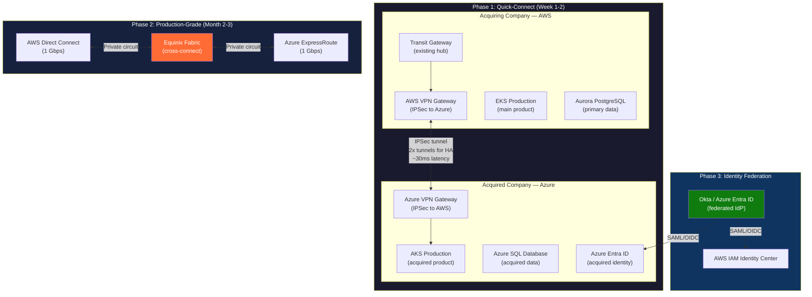
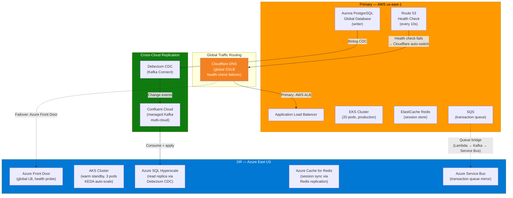
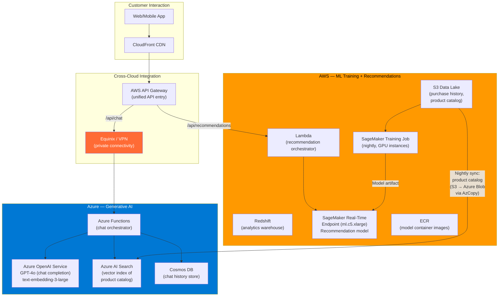
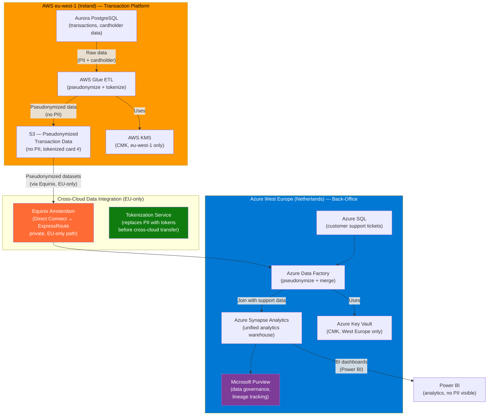
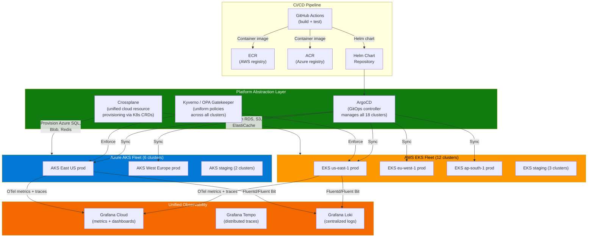

# Multi-Cloud Real-World Scenarios: AWS + Azure

## Table of Contents

- [Overview](#overview)
- [Scenario 1: M&A Integration — Connecting an Acquired Company's Azure Environment to Existing AWS Infrastructure](#scenario-1-ma-integration--connecting-an-acquired-companys-azure-environment-to-existing-aws-infrastructure)
- [Scenario 2: Cross-Cloud Disaster Recovery — Active-Passive with Automated Failover](#scenario-2-cross-cloud-disaster-recovery--active-passive-with-automated-failover)
- [Scenario 3: Best-of-Breed AI/ML Pipeline — AWS SageMaker + Azure OpenAI Service](#scenario-3-best-of-breed-aiml-pipeline--aws-sagemaker--azure-openai-service)
- [Scenario 4: Regulated Financial Services — Data Residency Compliance with Cross-Cloud Analytics](#scenario-4-regulated-financial-services--data-residency-compliance-with-cross-cloud-analytics)
- [Scenario 5: Unified Multi-Cloud Kubernetes Platform — EKS + AKS Under a Single Platform Team](#scenario-5-unified-multi-cloud-kubernetes-platform--eks--aks-under-a-single-platform-team)

---

## Overview

This document covers five real-world multi-cloud scenarios involving AWS and Azure. Each scenario is drawn from production patterns observed in enterprise environments — finance, healthcare, e-commerce, and SaaS platforms — where multi-cloud is not a theoretical exercise but an operational reality.

These scenarios build on the foundational knowledge from [01-multi-cloud-patterns.md](./01-multi-cloud-patterns.md), which covers routing paradigms, IPAM strategy, cross-cloud connectivity (Equinix/Megaport interconnects, WireGuard VPN, SD-WAN), DNS federation, service mesh multi-cluster, and observability pipelines. **Familiarity with those patterns is assumed here.**

| Scenario | Primary Driver | Complexity |
|----------|---------------|------------|
| 1. M&A Integration | Acquisition of Azure-native company | High — identity, networking, data |
| 2. Cross-Cloud DR | Regulatory resilience requirement | Very High — data sync, failover automation |
| 3. AI/ML Pipeline | Best-of-breed cloud services | Medium — API integration, data movement |
| 4. Regulated Data Residency | Compliance (GDPR, PCI-DSS) | High — data sovereignty, encryption |
| 5. Unified K8s Platform | Operational standardization | Very High — platform engineering at scale |

---

## Scenario 1: M&A Integration — Connecting an Acquired Company's Azure Environment to Existing AWS Infrastructure

### Description

A mid-size SaaS company (500 engineers, AWS-primary, ~200 AWS accounts) acquires a smaller company (80 engineers) that runs entirely on Azure. The acquired company has 15 Azure subscriptions, a production AKS cluster, Azure SQL databases, and Azure AD (Entra ID) as their identity provider. The acquiring company needs to:

1. Establish network connectivity within 2 weeks (business-critical API integration)
2. Federate identity so acquired engineers access both environments
3. Migrate shared data without downtime over 6-12 months
4. Eventually consolidate into a single cloud (AWS) — but "eventually" means 18-24 months

This is the most common real-world multi-cloud scenario. Over 60% of enterprises operating multi-cloud do so because of M&A, not deliberate architectural choice.

### What Problem It Solves

- **Immediate revenue integration**: The acquiring company's product must call the acquired company's API within days of close, not months
- **Engineer productivity**: Acquired engineers must retain access to their Azure environment without re-provisioning everything to AWS on day one
- **Data consolidation path**: Customer data in Azure SQL must be accessible from AWS services for unified analytics, without a risky "big bang" migration

### Architecture Design




### Cloud Services Used

| Service | Cloud | Purpose |
|---------|-------|---------|
| AWS Transit Gateway | AWS | Central routing hub for all VPC-to-VPC and hybrid traffic |
| AWS VPN Gateway | AWS | IPSec tunnel endpoint for Phase 1 connectivity |
| AWS Direct Connect | AWS | Dedicated 1 Gbps circuit to Equinix for Phase 2 |
| AWS IAM Identity Center (SSO) | AWS | Federated access for acquired engineers |
| Azure VPN Gateway (VpnGw2AZ) | Azure | IPSec tunnel endpoint, Azure side |
| Azure ExpressRoute | Azure | Dedicated circuit from Equinix to Azure |
| Azure Entra ID | Azure | Acquired company's existing identity provider |
| Equinix Fabric | Third-party | Network exchange connecting Direct Connect ↔ ExpressRoute |
| AWS DMS (Database Migration Service) | AWS | Continuous replication from Azure SQL → Aurora PostgreSQL |
| Okta (or Entra ID with federation) | Third-party/Azure | Unified identity across both clouds |
| Terraform | IaC | Manages infrastructure in both clouds from a single codebase |

### Implementation Phases

**Phase 1 — Quick Connect (Week 1-2):**

```bash
# AWS side: Create VPN Gateway and Customer Gateway pointing to Azure VPN public IP
aws ec2 create-vpn-gateway --type ipsec.1 --amazon-side-asn 64512
aws ec2 create-customer-gateway --type ipsec.1 \
  --bgp-asn 65515 \
  --public-ip <azure-vpn-gateway-public-ip>
aws ec2 create-vpn-connection \
  --vpn-gateway-id vgw-xxxxx \
  --customer-gateway-id cgw-xxxxx \
  --type ipsec.1

# Azure side: Create Local Network Gateway + VPN Connection
az network local-gateway create \
  --name aws-lgw \
  --resource-group prod-rg \
  --gateway-ip-address <aws-vpn-public-ip> \
  --local-address-prefixes 10.0.0.0/10  # AWS CIDR supernet

az network vpn-connection create \
  --name aws-azure-vpn \
  --resource-group prod-rg \
  --vnet-gateway1 /subscriptions/.../vpnGateways/prod-vpngw \
  --local-gateway2 /subscriptions/.../localNetworkGateways/aws-lgw \
  --shared-key "<pre-shared-key>" \
  --enable-bgp true
```

**Phase 2 — Private Interconnect (Month 2-3):**

Replace the VPN with Equinix cross-connect (see [01-multi-cloud-patterns.md, Cross-Cloud Connectivity Options](./01-multi-cloud-patterns.md#cross-cloud-connectivity-options)). The VPN becomes the failover path.

**Phase 3 — Identity Federation (Month 1-2, parallel):**

```bash
# Option A: Azure Entra ID as the hub IdP (if acquired company's AD is kept)
# Configure AWS to trust Entra ID via SAML
aws iam create-saml-provider \
  --saml-metadata-document file://entra-metadata.xml \
  --name AzureEntraID-Federation

# Option B: Okta as neutral IdP (recommended for long-term)
# Both AWS IAM Identity Center and Azure Entra ID federate to Okta
# Engineers sign in once → access both clouds
```

**Phase 4 — Data Consolidation (Month 3-18):**

```bash
# AWS DMS: continuous replication from Azure SQL → Aurora PostgreSQL
# Step 1: Set up DMS replication instance in the AWS VPC
# Step 2: Create source endpoint (Azure SQL via private link over the interconnect)
# Step 3: Create target endpoint (Aurora PostgreSQL)
# Step 4: Full load + CDC (Change Data Capture) for ongoing replication

# Applications gradually switch reads from Azure SQL to Aurora
# Once all reads are on Aurora, switch writes and decommission Azure SQL
```

### Points to Remember

> **CIDR conflicts are the #1 blocker.** Before establishing connectivity, verify that the acquired company's Azure address space doesn't overlap with any AWS VPC. If it does, introduce NAT at the boundary (AWS PrivateLink or Azure Private Link) for the immediate integration, and re-IP the Azure side as part of the migration plan.

> **Identity federation before network connectivity.** Engineers need to access the other cloud's console and CLI immediately. Federate identity (Okta, Entra ID, or AWS IAM Identity Center) in the first week — this is faster to set up than network connectivity and has immediate engineer productivity impact.

> **Don't force a "big bang" migration.** The 18-24 month consolidation timeline is realistic. Attempting to migrate all Azure workloads to AWS in 3 months typically results in production incidents, data loss, and engineer burnout. The interconnect (Equinix) makes the two clouds feel like one network — use that runway to migrate service by service.

> **Data egress costs add up.** Cross-cloud data transfer during the migration period can cost $0.08-0.12/GB. A continuous 100 Mbps replication stream (Azure SQL CDC to Aurora) costs ~$2,500/month in egress alone. Factor this into the business case.

> **Retain the acquired company's on-call processes initially.** Their SREs know their Azure environment. Don't merge on-call rotations until the team has cross-trained on both clouds. Shared observability (Datadog, Grafana Cloud) is the first step toward unified operations.

---

## Scenario 2: Cross-Cloud Disaster Recovery — Active-Passive with Automated Failover

### Description

A digital banking platform processes $2B in daily transactions on AWS. Regulatory requirements mandate that the platform can survive a **full AWS region failure** (not just AZ failure) with RPO < 60 seconds and RTO < 5 minutes. The regulator explicitly requires that the DR environment be on a **different cloud provider** — the logic being that a systemic issue at AWS (billing outage, IAM outage, control plane failure) would affect all AWS regions simultaneously.


The DR target is Azure. The platform must fail over to Azure AKS with minimal data loss and near-zero manual intervention.

### What Problem It Solves

- **Regulatory compliance**: Financial regulators (OCC, FCA, MAS) increasingly require multi-cloud DR for systemically important financial institutions
- **True provider-level resilience**: Protects against AWS-wide incidents (IAM outages, us-east-1 cascading failures, S3 control plane issues) — events that affect all regions simultaneously
- **Business continuity**: $2B/day in transactions means every minute of downtime costs ~$1.4M

### Architecture Design




### Cloud Services Used

| Service | Cloud | Purpose |
|---------|-------|---------|
| Aurora PostgreSQL Global Database | AWS | Primary transactional database with cross-region replication |
| EKS | AWS | Primary Kubernetes workload hosting |
| Route 53 Health Checks | AWS | Monitor primary endpoint health (10-second intervals) |
| ElastiCache Redis | AWS | Primary session store and caching |
| SQS | AWS | Transaction message queue |
| AKS | Azure | DR Kubernetes cluster (warm standby) |
| Azure SQL Hyperscale | Azure | DR database, populated by Debezium CDC |
| Azure Front Door | Azure | Global load balancer for DR traffic entry |
| Azure Cache for Redis | Azure | DR session store |
| Azure Service Bus | Azure | DR transaction queue |
| Confluent Cloud (Kafka) | Multi-cloud | CDC event stream between AWS and Azure |
| Cloudflare (GSLB) | Third-party | Global DNS with health-check-based failover |
| Debezium (Kafka Connect) | Open source | Change Data Capture from Aurora to Azure SQL |
| KEDA | Open source | Event-driven auto-scaling on AKS during failover |


## 🧠 1. High-Level Understanding

👉 This is an **Active-Passive DR setup**
* **Primary** → AWS (handles all traffic)
* **DR** → Azure (standby, ready to take over)

---

## 🌍 2. Global Traffic Routing (ENTRY POINT)

### 🔥 Components:

* **Cloudflare DNS (GSLB)** → global traffic controller
* **Route 53 Health Check (AWS)** → monitors AWS health

### 🔄 Flow:
1. User → hits DNS (Cloudflare)
2. DNS sends traffic → **AWS ALB (Primary)**
3. Route53 continuously checks AWS health

### 🚨 Failure scenario:

```text
AWS fails → Route53 detects → Cloudflare switches → Azure
```

👉 Traffic automatically goes to:

* **Azure Front Door (DR entry)**

---

## ☁️ 3. Primary (AWS) — Active Environment

### 🧩 Components:

* **ALB** → entry point
* **EKS (20 pods)** → application layer
* **Aurora PostgreSQL** → primary DB (writer)
* **ElastiCache Redis** → session store
* **SQS** → transaction queue

### 🔄 Flow:

```text
User → ALB → EKS → (DB / Redis / SQS)
```

👉 This is your **live production system**

---

## 🔁 4. Cross-Cloud Replication (MOST IMPORTANT)

### 🔥 This is what enables LOW RPO

### 🔄 Flow:
```text
Aurora (AWS)
   ↓ (WAL / binlog)
Debezium (CDC)
   ↓
Kafka (Confluent Cloud)
   ↓
Azure SQL (apply changes)
```

### 💡 Key idea:

* Changes are streamed **in real-time**
* Azure DB is always **almost in sync**

👉 Result:
* **RPO ≈ seconds**

---

## 📦 5. Queue Replication (ASYNC WORKLOADS)

```text
SQS (AWS) → Lambda → Kafka → Azure Service Bus
```

👉 Ensures:
* No message loss
* Queue state replicated

---

## ☁️ 6. DR (Azure) — Passive Environment

### 🧩 Components:
* **Azure Front Door** → entry point
* **AKS (warm standby)** → minimal pods running
* **Azure SQL (read replica)**
* **Azure Redis** → session sync
* **Service Bus** → queue mirror

### 🧠 Important:
👉 This is **NOT fully active**
* Runs with:
  * 3 pods (minimal)
  * Auto-scales on failover (KEDA)

---

## 🔄 7. Failover Flow (CRITICAL)

### 🚨 Step-by-step:
1. AWS fails ❌
2. Route53 health check fails
3. Cloudflare switches DNS
4. Traffic → Azure Front Door

### Then:
```text
AKS scales up
Azure SQL → promoted to write
Traffic served from Azure
```

### ⏱️ Timing:
* Detection → ~30s
* Data sync → ~30s
* Scale up → ~2 min

👉 **Total RTO ≈ 3–5 min**

---

## ⚠️ 8. Critical Design Decisions (VERY IMPORTANT)

### 🔐 1. Split-brain prevention

👉 Before failover:
* Stop AWS writes (if possible)

### 🔁 2. CDC instead of snapshots

👉 Why?
* Snapshots → high RPO ❌
* CDC → near real-time ✅

### 📦 3. Warm standby (not cold)

👉 Why?
* Cold start = 5–10 min ❌
* Warm = instant scale ✅

### 🔑 4. Stateless sessions (or replicated Redis)
👉 Otherwise:
* Users get logged out on failover

# 🎯 Final takeaway
👉 This architecture achieves:
* ✅ Multi-cloud resilience
* ✅ Near-zero data loss (low RPO)
* ✅ Fast recovery (low RTO)
* ✅ Automated failover

---

# 🧠 Interview One-liner
> This is an active-passive multi-cloud DR architecture where AWS serves as primary and Azure as standby, with CDC-based replication via Kafka and DNS-based failover using Cloudflare to achieve low RPO and RTO.

# ⚡ Pro insight (this is gold for you)
👉 This design combines **4 critical layers**:

1. **DNS (Cloudflare)** → traffic control
2. **Compute (EKS/AKS)** → application
3. **Data (CDC via Kafka)** → consistency
4. **Queues (SQS → Service Bus)** → async durability


### Data Replication Design

The core challenge is **continuous, low-latency data replication** from Aurora PostgreSQL to Azure SQL Hyperscale:

```
Aurora PostgreSQL (AWS)
    │
    ├── WAL (Write-Ahead Log) stream
    │
    ▼
Debezium PostgreSQL Connector (Kafka Connect, runs in AWS)
    │
    ├── Transforms row changes to Kafka events
    │
    ▼
Confluent Cloud Kafka Cluster (multi-cloud, dedicated cluster)
    │
    ├── Topic: banking.public.transactions
    ├── Topic: banking.public.accounts
    ├── Topic: banking.public.audit_log
    │
    ▼
Custom Sink Connector (runs in Azure AKS)
    │
    ├── Consumes Kafka events, applies to Azure SQL
    ├── Maintains exactly-once semantics via offset tracking
    │
    ▼
Azure SQL Hyperscale (Azure DR)
```

**RPO calculation:**
- Debezium captures WAL changes: ~100ms delay
- Kafka cross-cloud produce + consume: ~50-200ms (depends on Equinix latency)
- Sink connector apply: ~100ms
- **Total RPO: ~500ms in steady state, < 60 seconds under load spikes**

### Failover Automation

```python
"""
failover_orchestrator.py — Automated cross-cloud failover.

Triggered by: Cloudflare health check failure (3 consecutive failures × 10s = 30s detection)
Or: Manual trigger via PagerDuty runbook action
"""

FAILOVER_STEPS = [
    # Step 1: Verify the outage is real (avoid false positive failover)
    {
        "name": "Verify primary health from multiple vantage points",
        "action": "Check AWS ALB from 3 Cloudflare PoPs + direct Equinix probe",
        "timeout_seconds": 15,
        "rollback": "Abort failover if 2/3 probes succeed",
    },

    # Step 2: Stop writes to primary (prevent split-brain)
    {
        "name": "Fence primary database",
        "action": "Set Aurora cluster parameter: read_only = true (if reachable)",
        "timeout_seconds": 10,
        "rollback": "If AWS is completely unreachable, skip (Kafka will handle ordering)",
    },

    # Step 3: Wait for replication to drain
    {
        "name": "Drain Kafka consumer lag",
        "action": "Wait until Azure sink connector consumer lag = 0",
        "timeout_seconds": 30,
        "rollback": "If lag doesn't drain in 30s, proceed anyway (accept RPO = lag)",
    },

    # Step 4: Promote Azure SQL to read-write
    {
        "name": "Promote DR database",
        "action": "ALTER DATABASE SET READ_WRITE on Azure SQL",
        "timeout_seconds": 5,
    },

    # Step 5: Scale up AKS DR cluster
    {
        "name": "Scale AKS workloads",
        "action": "KEDA triggers on Service Bus queue depth; also kubectl scale --replicas=20",
        "timeout_seconds": 120,
    },

    # Step 6: Switch DNS
    {
        "name": "Update Cloudflare DNS",
        "action": "Cloudflare API: update A record to Azure Front Door IP (already automated by health check)",
        "timeout_seconds": 5,
    },

    # Step 7: Notify
    {
        "name": "Page SRE team + exec notification",
        "action": "PagerDuty incident + Slack #incident channel + StatusPage update",
        "timeout_seconds": 5,
    },
]

# Total automated RTO: 30s (detection) + 15s (verify) + 30s (drain) + 5s (promote)
#                      + 120s (scale) + 5s (DNS) = ~3.5 minutes
# Conservative RTO with manual approval gate: ~5 minutes
```

### Points to Remember

> **Split-brain is the nightmare scenario.** If both AWS and Azure accept writes simultaneously, data diverges and reconciliation is extremely painful. The failover orchestrator must fence the primary database (set read-only or revoke write permissions) before promoting the DR database. Use Kafka's ordered event stream as the reconciliation mechanism if fencing fails.

> **Test the failover monthly.** A DR system that hasn't been tested doesn't work. Schedule monthly "Game Days" where you actually fail over to Azure during a low-traffic window. Measure real RPO and RTO. Document everything that breaks.

> **Confluent Cloud as the replication backbone.** Managed Kafka handles the cross-cloud complexity (multi-region clusters, auto-scaling, exactly-once semantics). Self-managed Kafka across clouds is operationally brutal — broker coordination, ZooKeeper/KRaft across clouds, and cross-cloud topic replication are all failure-prone.

> **Warm standby, not cold standby.** The AKS DR cluster must have at least 1 node per node pool running, with container images pre-pulled and Kubernetes configs applied. A cold cluster (zero nodes) would add 5-10 minutes to spin up node pools, which blows the 5-minute RTO target.

> **Session handling during failover.** Use JWT tokens (not server-side sessions) for authentication. JWTs are self-contained and validated by any cluster with the signing key. If using server-side sessions (Redis), replicate the Redis keyspace from ElastiCache to Azure Cache for Redis using a CDC-like approach or shared session store (Confluent-backed session store).

---

## Scenario 3: Best-of-Breed AI/ML Pipeline — AWS SageMaker + Azure OpenAI Service

### Description

An e-commerce company wants to build a product recommendation and customer support system that:
- Uses **AWS SageMaker** for training custom recommendation models on purchase history data (stored in S3 + Redshift)
- Uses **Azure OpenAI Service** (GPT-4o, embeddings) for natural language product search and AI-powered customer support chat
- Needs real-time inference: when a customer browses, recommendations come from SageMaker, and chat support comes from Azure OpenAI — both must respond in < 200ms

Neither cloud has the best of both worlds: AWS SageMaker's training infrastructure and MLOps tooling is more mature, while Azure OpenAI Service provides exclusive access to GPT-4o with enterprise compliance (not available via public OpenAI API for certain regulated industries).

### What Problem It Solves

- **Access to exclusive capabilities**: Azure OpenAI Service provides GPT-4o with enterprise SLA, data residency guarantees, and content filtering that public OpenAI API doesn't offer
- **Leverage existing data infrastructure**: Training data lives in AWS (S3, Redshift, Glue) — moving petabytes of historical purchase data to Azure just for model training is impractical and expensive
- **Unified customer experience**: The customer sees one seamless interface — recommendations and chat — but the backend spans two clouds

### Architecture Design




### Cloud Services Used

| Service | Cloud | Purpose |
|---------|-------|---------|
| S3 | AWS | Data lake for training data and product catalog |
| Redshift | AWS | Analytics warehouse for feature engineering |
| SageMaker (Training + Endpoints) | AWS | Custom recommendation model training and real-time inference |
| Lambda | AWS | Orchestration layer for recommendation API |
| API Gateway | AWS | Unified API entry point for all client requests |
| CloudFront | AWS | CDN for static assets and API caching |
| Azure OpenAI Service | Azure | GPT-4o for chat, text-embedding-3-large for embeddings |
| Azure AI Search | Azure | Vector search index for product catalog (RAG pattern) |
| Azure Functions | Azure | Chat orchestration (prompt construction, RAG retrieval) |
| Cosmos DB | Azure | Chat conversation history storage |
| Azure Blob Storage | Azure | Mirror of product catalog for vector indexing |

### Data Flow for Product Catalog Sync

The product catalog must be available in both clouds — AWS for recommendation training and Azure for RAG-based chat:

```bash
# Nightly sync: S3 → Azure Blob Storage → Azure AI Search vector index

# Step 1: Export catalog from S3
aws s3 sync s3://product-catalog/latest/ /tmp/catalog/ --exclude "*.tmp"

# Step 2: Upload to Azure Blob Storage
azcopy copy "/tmp/catalog/*" \
  "https://prodstore.blob.core.windows.net/catalog/" \
  --recursive --overwrite true

# Step 3: Trigger Azure AI Search indexer to re-index with embeddings
az search indexer run \
  --name product-catalog-indexer \
  --service-name prod-search \
  --resource-group ai-rg

# Alternative: Event-driven sync
# S3 Event Notification → SQS → Lambda → Azure Blob (via REST API)
# Azure Blob → Event Grid → Azure Functions → AI Search indexer
```

### Latency Optimization

The < 200ms requirement for cross-cloud chat API calls is achievable with these optimizations:

```
Typical cross-cloud API call breakdown:
├── Client → CloudFront → API Gateway:     ~10ms
├── API Gateway → Equinix → Azure:          ~5-15ms (same metro)
├── Azure Functions cold start:             ~0ms (pre-warmed, Premium plan)
├── Azure OpenAI GPT-4o inference:          ~100-500ms (streaming reduces TTFB)
├── Azure AI Search vector query:           ~20-50ms
├── Return path (Azure → Equinix → AWS):    ~5-15ms
└── Total: ~150-600ms

Optimizations applied:
1. Azure Functions Premium plan (always-warm, no cold start)
2. GPT-4o streaming response (first token in ~100ms, stream to client)
3. Azure AI Search in same region as Azure OpenAI
4. API Gateway response streaming enabled
5. Equinix interconnect (not internet VPN) for predictable latency
```

### Points to Remember

> **Data residency for AI models.** Azure OpenAI Service processes data within the Azure region. If your compliance requires that customer queries never leave a specific geography, deploy Azure OpenAI in the region matching your compliance requirements (e.g., East US for US data, West Europe for EU data). The product catalog sync must also respect these boundaries.

> **Cost asymmetry between clouds.** SageMaker training on GPU instances (ml.p3.2xlarge) costs $3.825/hour. Azure OpenAI GPT-4o costs $5/1M input tokens + $15/1M output tokens. The cost drivers are completely different — track them separately in your FinOps tooling. A single poorly-optimized prompt can cost more than an hour of GPU training.

> **Fallback for Azure OpenAI outages.** If Azure OpenAI Service is unavailable, the chat feature must degrade gracefully. Options: (a) fall back to a smaller model self-hosted on SageMaker (Llama 3, Mistral), (b) serve pre-computed FAQ responses from a cache, or (c) route to a human agent queue. Never let a cross-cloud dependency become a single point of failure for the customer experience.

> **Embedding model consistency.** The product catalog must be embedded using the SAME model (text-embedding-3-large) in Azure AI Search that the query embedding uses at runtime. If you train embeddings with a different model in SageMaker, the vector similarity search in Azure AI Search will return incorrect results. Standardize on one embedding model and call it consistently from both clouds.

> **API key management across clouds.** Store the Azure OpenAI API key in AWS Secrets Manager, not in environment variables or code. Better: use OIDC federation (see [01-multi-cloud-patterns.md, Security Considerations](./01-multi-cloud-patterns.md#security-considerations)) so the AWS Lambda acquires an Azure Entra ID token without storing any Azure credentials.

---

## Scenario 4: Regulated Financial Services — Data Residency Compliance with Cross-Cloud Analytics

### Description

A pan-European payment processor operates across 12 EU countries. EU customer PII and transaction data must remain within the EU (GDPR Article 44 — no transfer to third countries without adequate protection). Additionally, PCI-DSS requires that cardholder data is encrypted at rest and in transit with strict key management.

The company runs its **transactional platform on AWS eu-west-1 (Ireland)** and its **enterprise back-office on Azure West Europe (Netherlands)**. The challenge: the business intelligence team needs to run analytics that join transaction data (AWS) with customer support data (Azure) — without moving PII outside the EU or violating data residency controls.

### What Problem It Solves

- **GDPR compliance**: PII must not leave the EU; analytics must not require PII movement to a "third-country" jurisdiction
- **PCI-DSS compliance**: Cardholder data must remain encrypted; analytics should operate on tokenized/pseudonymized data
- **Business intelligence**: The BI team needs unified reporting across AWS (transactions) and Azure (support interactions) without becoming a compliance violation

### Architecture Design




### Cloud Services Used

| Service | Cloud | Purpose |
|---------|-------|---------|
| Aurora PostgreSQL | AWS | Primary transactional database (contains PII + cardholder data) |
| AWS Glue | AWS | ETL: pseudonymize PII, tokenize cardholder data before export |
| AWS KMS | AWS | Customer-managed encryption key, restricted to EU region |
| S3 (eu-west-1) | AWS | Pseudonymized data staging for cross-cloud transfer |
| Azure Data Factory | Azure | ETL: ingest pseudonymized data from AWS, join with support data |
| Azure Synapse Analytics | Azure | Unified analytics warehouse for cross-cloud BI |
| Azure SQL | Azure | Customer support ticket data |
| Azure Key Vault | Azure | Customer-managed encryption key, restricted to EU region |
| Microsoft Purview | Azure | Data governance: classification, lineage, access audit |
| Power BI | Azure | Business intelligence dashboards |
| Equinix Amsterdam | Third-party | Private EU-only interconnect between AWS and Azure |

### Data Pseudonymization Pipeline

```python
"""
pseudonymizer.py — AWS Glue job that pseudonymizes PII before cross-cloud transfer.

PII fields (name, email, phone, card number) are replaced with:
- Deterministic tokens (for joinability across datasets)
- One-way hashes (for aggregation without re-identification)
- The tokenization mapping is stored ONLY in AWS, never transferred

GDPR compliance: Only pseudonymized data crosses the cloud boundary.
PCI-DSS compliance: Cardholder data is tokenized using format-preserving encryption.
"""
import hashlib
import hmac


def pseudonymize_record(record: dict, hmac_key: bytes) -> dict:
    """Pseudonymize a transaction record for cross-cloud analytics.

    Deterministic: same input always produces same token (enables JOIN across clouds).
    One-way: token cannot be reversed to original PII without the HMAC key.
    HMAC key stored in AWS KMS, never leaves eu-west-1.
    """
    return {
        # Preserved fields (non-PII)
        "transaction_id": record["transaction_id"],
        "amount": record["amount"],
        "currency": record["currency"],
        "timestamp": record["timestamp"],
        "merchant_category": record["merchant_category"],
        "country": record["country"],

        # Pseudonymized fields (PII replaced with deterministic tokens)
        "customer_token": hmac.new(
            hmac_key, record["customer_id"].encode(), hashlib.sha256
        ).hexdigest()[:16],

        "email_domain": record["email"].split("@")[1] if "@" in record["email"] else "unknown",

        # Cardholder data: format-preserving tokenization
        # Last 4 digits preserved for analytics, rest tokenized
        "card_token": f"tok_{hmac.new(hmac_key, record['card_number'].encode(), hashlib.sha256).hexdigest()[:12]}",
        "card_last4": record["card_number"][-4:],

        # Aggregatable fields (for BI without re-identification)
        "age_bucket": _age_bucket(record.get("date_of_birth")),
        "region": record.get("region", "unknown"),
    }


def _age_bucket(dob: str | None) -> str:
    """Convert exact date of birth to age bucket (k-anonymity)."""
    if not dob:
        return "unknown"
    # Calculate age and bucket into 10-year ranges
    # "18-27", "28-37", "38-47", "48-57", "58+"
    # This prevents re-identification from exact age
    return "28-37"  # Simplified
```

### Compliance Controls

```yaml
# AWS: S3 bucket policy — deny any transfer outside EU
{
  "Version": "2012-10-17",
  "Statement": [{
    "Sid": "DenyNonEUAccess",
    "Effect": "Deny",
    "Principal": "*",
    "Action": "s3:GetObject",
    "Resource": "arn:aws:s3:::pseudonymized-tx-data/*",
    "Condition": {
      "StringNotEquals": {
        "aws:RequestedRegion": ["eu-west-1", "eu-central-1", "eu-west-2"]
      }
    }
  }]
}

# Azure: Synapse workspace — geo-restriction
# Synapse workspace created in West Europe
# Network rules: deny access from non-EU IPs
# Purview: auto-classify any column containing PII patterns
#          alert if PII is detected in the analytics warehouse
```

### Points to Remember

> **Pseudonymization ≠ anonymization.** Pseudonymized data is still personal data under GDPR (Recital 26) because re-identification is possible with the HMAC key. The key difference: pseudonymized data can cross organizational boundaries within the same legal entity; fully anonymized data is not subject to GDPR at all. Keep the HMAC key strictly in AWS KMS with access audit logging.

> **Equinix Amsterdam keeps traffic EU-only.** The Equinix AMS1/AMS7 facilities host both AWS Direct Connect and Azure ExpressRoute. Traffic between AWS eu-west-1 and Azure West Europe flows through Amsterdam without touching any non-EU network segment. Document this data flow path for audit evidence.

> **Microsoft Purview for cross-cloud governance.** Purview can scan AWS S3 buckets (via Purview connectors) and classify data directly. This provides unified data governance visibility across both clouds — a single dashboard showing where PII exists, who accessed it, and the full data lineage from Aurora → Glue → S3 → Synapse.

> **Key management is separate per cloud.** AWS KMS keys stay in AWS eu-west-1. Azure Key Vault keys stay in Azure West Europe. Never replicate encryption keys cross-cloud. Each cloud encrypts its data with its own keys. The pseudonymized data transferred cross-cloud is encrypted in transit (TLS 1.3 over the Equinix circuit) and re-encrypted at rest in Azure with Azure-managed keys.

> **Audit trail is your compliance evidence.** Every cross-cloud data transfer must be logged: AWS CloudTrail captures S3 GetObject events, Azure Data Factory captures pipeline runs, and Equinix provides netflow logs. During a GDPR audit, you must demonstrate that no raw PII left the AWS environment — the pseudonymization Glue job logs are your evidence.

---

## Scenario 5: Unified Multi-Cloud Kubernetes Platform — EKS + AKS Under a Single Platform Team

### Description

A large SaaS company (2,000 engineers, 300 microservices) acquires customers on both AWS and Azure because different enterprise customers mandate different cloud providers. The platform team manages:

- **12 EKS clusters** (production, staging, per-region) on AWS
- **6 AKS clusters** (production, staging, per-region) on Azure
- Product engineering teams deploy their services to "the platform" via a unified CI/CD pipeline, without knowing or caring which cloud the workload runs on

The platform team needs to provide a consistent developer experience: same deployment manifests, same observability stack, same security policies, same incident response — regardless of whether the workload runs on EKS or AKS.

### What Problem It Solves

- **Customer mandates**: Enterprise customers in government and healthcare sectors often contractually require deployment on a specific cloud provider
- **Engineer cognitive load**: 300 microservice teams cannot maintain expertise in both AWS and Azure. The platform abstracts the cloud, exposing a standardized Kubernetes API
- **Operational consistency**: SRE on-call shouldn't need different runbooks for AWS incidents vs Azure incidents. Same alerts, same dashboards, same escalation paths

### Architecture Design




### Cloud Services Used

| Service | Cloud | Purpose |
|---------|-------|---------|
| EKS | AWS | Kubernetes clusters for AWS-mandated customers |
| AKS | Azure | Kubernetes clusters for Azure-mandated customers |
| ECR | AWS | Container registry (AWS-side) |
| ACR | Azure | Container registry (Azure-side) |
| ArgoCD | Open source | GitOps-based deployment to all clusters |
| Crossplane | Open source | Unified cloud resource provisioning via Kubernetes CRDs |
| Kyverno / OPA Gatekeeper | Open source | Policy enforcement across all clusters |
| Grafana Cloud | SaaS | Unified metrics, traces, and logs |
| GitHub Actions | SaaS | CI pipeline (build, test, push images) |
| Helm | Open source | Standardized application packaging |
| OpenTelemetry Collector | Open source | Vendor-neutral telemetry collection |
| Cert-Manager | Open source | Automated TLS certificate management (Let's Encrypt) |
| External Secrets Operator | Open source | Sync secrets from AWS Secrets Manager / Azure Key Vault |

### Platform Abstraction with Crossplane

The platform team uses Crossplane to expose cloud-agnostic resource types. Application teams request a "database" or "cache" — Crossplane provisions the correct cloud-native service:

```yaml
# Developer submits this. Same manifest works on EKS and AKS.
apiVersion: platform.company.io/v1alpha1
kind: Database
metadata:
  name: orders-db
  namespace: order-service
spec:
  engine: postgresql
  version: "15"
  size: medium  # Platform team maps to instance type per cloud
  highAvailability: true
  backup:
    retentionDays: 30

---
# Crossplane Composition resolves to:
# On EKS → RDS Aurora PostgreSQL (db.r6g.large, Multi-AZ)
# On AKS → Azure Database for PostgreSQL Flexible Server (Standard_D4s_v3, Zone-redundant)
```

```yaml
# Crossplane CompositeResourceDefinition (XRD)
apiVersion: apiextensions.crossplane.io/v1
kind: CompositeResourceDefinition
metadata:
  name: xdatabases.platform.company.io
spec:
  group: platform.company.io
  names:
    kind: XDatabase
    plural: xdatabases
  versions:
    - name: v1alpha1
      served: true
      referenceable: true
      schema:
        openAPIV3Schema:
          type: object
          properties:
            spec:
              type: object
              properties:
                engine:
                  type: string
                  enum: [postgresql, mysql]
                size:
                  type: string
                  enum: [small, medium, large]
                highAvailability:
                  type: boolean
```

### Uniform Policy Enforcement

```yaml
# Kyverno policy: applied to ALL 18 clusters via ArgoCD
# Enforces the same security baseline regardless of cloud
apiVersion: kyverno.io/v1
kind: ClusterPolicy
metadata:
  name: require-resource-limits
spec:
  validationFailureAction: Enforce
  rules:
    - name: require-limits
      match:
        any:
          - resources:
              kinds: [Pod]
      validate:
        message: "CPU and memory limits are required."
        pattern:
          spec:
            containers:
              - resources:
                  limits:
                    memory: "?*"
                    cpu: "?*"

---
apiVersion: kyverno.io/v1
kind: ClusterPolicy
metadata:
  name: deny-privileged-containers
spec:
  validationFailureAction: Enforce
  rules:
    - name: deny-privileged
      match:
        any:
          - resources:
              kinds: [Pod]
      validate:
        message: "Privileged containers are not allowed."
        pattern:
          spec:
            containers:
              - securityContext:
                  privileged: "false"
```

### Points to Remember

> **Container image replication is a solved problem.** Push images to both ECR and ACR from CI. Use [Skopeo](https://github.com/containers/skopeo) or registry mirroring to sync images automatically. ArgoCD's image updater can detect new tags in the registry appropriate for each cluster's cloud.

> **Helm values per cloud, not per service.** Maintain a single Helm chart per service with cloud-specific value overrides: `values-aws.yaml` and `values-azure.yaml`. Cloud-specific details (storage classes, node selectors, cloud provider annotations) live in the values files, not in the chart templates. The service team never writes cloud-specific YAML.

> **Crossplane eliminates the "two Terraform codebases" problem.** Without Crossplane, the platform team maintains separate Terraform modules for AWS and Azure resources. Crossplane lets them define cloud resources as Kubernetes CRDs — same API for developers, different backend providers. The platform team writes Crossplane Compositions (one for AWS, one for Azure) that implement the same XRD.

> **ArgoCD ApplicationSets for fleet management.** Use ArgoCD ApplicationSets with the cluster generator to deploy to all 18 clusters from a single Git source. The generator iterates over a list of cluster configurations, applying per-cluster customizations (region, cloud, environment) via Kustomize overlays.

> **Cost visibility across clouds.** Use [OpenCost](https://www.opencost.io/) (open-source, CNCF project) deployed in every cluster to expose per-namespace, per-service cost allocation. OpenCost natively supports both EKS (via AWS Cost & Usage Reports) and AKS (via Azure Cost Management APIs). Roll up to a unified dashboard in Grafana.

> **Incident response is cloud-aware, process-uniform.** The on-call engineer uses the same Grafana dashboards, same PagerDuty policies, and same runbook templates for all clusters. Cloud-specific runbook steps (e.g., "check AWS TGW routes" vs "check Azure vWAN routes") are branched within the same runbook, not maintained as separate documents.

---

> **Cross-reference:** For foundational multi-cloud networking patterns (IPAM, routing, connectivity, DNS, service mesh, observability, and debugging), see [01-multi-cloud-patterns.md](./01-multi-cloud-patterns.md).
