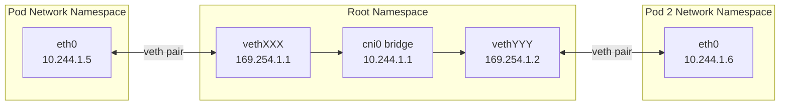
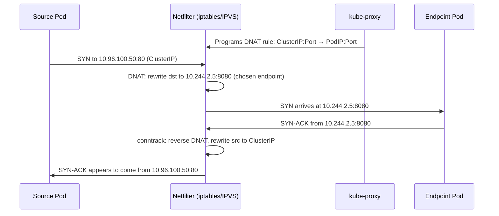
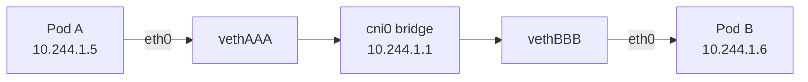
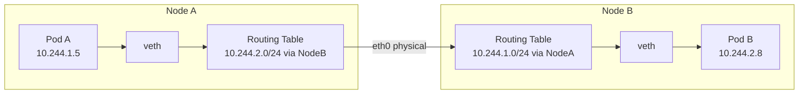
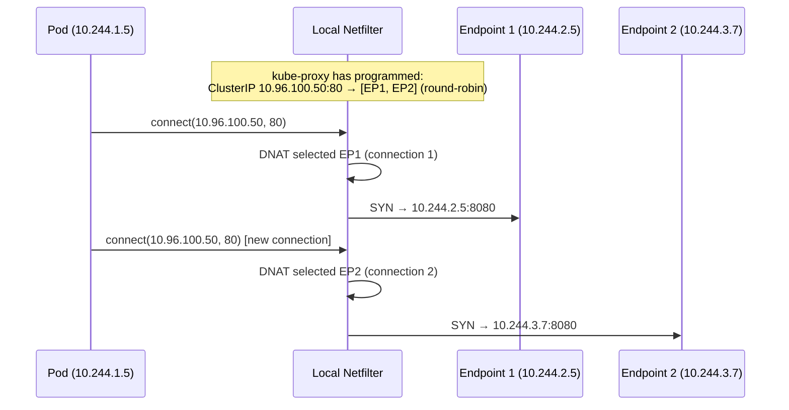

# Kubernetes Networking Model

## Table of Contents

- [Overview](#overview)
- [Pod Networking Mechanics](#pod-networking-mechanics)
  - [The veth Pair](#the-veth-pair)
  - [Node-Level Components](#node-level-components)
- [kube-proxy Modes](#kube-proxy-modes)
  - [iptables Mode (Default)](#iptables-mode-default)
  - [IPVS Mode (Recommended for 1000+ services)](#ipvs-mode-recommended-for-1000-services)
  - [nftables Mode (Beta, K8s 1.29+)](#nftables-mode-beta-k8s-129)
- [Service VIP Mechanics](#service-vip-mechanics)
- [Traffic Flows](#traffic-flows)
  - [Pod-to-Pod: Same Node](#pod-to-pod-same-node)
  - [Pod-to-Pod: Different Nodes](#pod-to-pod-different-nodes)
  - [Pod-to-Service](#pod-to-service)
- [Production Scenario: Service ClusterIP Not Reachable](#production-scenario-service-clusterip-not-reachable)
- [Failure Modes](#failure-modes)
- [Debugging Guide](#debugging-guide)
- [Security Considerations](#security-considerations)
- [Interview Questions](#interview-questions)
  - [Basic](#basic)
  - [Intermediate](#intermediate)
  - [Advanced / Staff Level](#advanced-staff-level)

---

## Overview

Kubernetes networking is built on three inviolable rules that distinguish it from Docker's historical link-based model. Every engineer operating production clusters must internalize these rules because every debugging session starts by verifying whether they hold.

**The Three Fundamental Rules:**
1. Every pod gets a unique, routable IP address within the cluster
2. Pods on the same node communicate with each other without NAT
3. Pods on different nodes communicate with each other without NAT — the pod IP a container sees is the same IP every other pod sees

These rules create a **flat L3 network** across the entire cluster. No NAT, no port mapping, no Docker-style link env vars. The consequence is that service discovery is simple: if you know a pod's IP, you can reach it directly.

**Why flat networking vs Docker links:**
- Docker links required manual wiring and leaked env vars into every container (`REDIS_PORT_6379_TCP_ADDR`)
- Links broke when containers restarted (IP changed, env vars stale)
- K8s flat networking means services use DNS (`redis.namespace.svc.cluster.local`) and rely on the network layer to route, not pre-wired env vars
- Any pod can reach any other pod IP without administrator intervention — simplifies health checks, service meshes, and observability tools

---

## Pod Networking Mechanics

### The veth Pair

When the CNI plugin creates a pod, it creates a virtual Ethernet pair: one end lives inside the pod's network namespace (`eth0`), the other lives in the root network namespace of the node (`vethXXXXXX`).



Traffic leaving the pod exits through `eth0`, enters the host through the node-side veth, then is forwarded by the kernel based on routing rules to the bridge (`cni0` or `cbr0`), and from there to the destination.

**With eBPF bypass (Cilium):** The bridge is eliminated. eBPF programs attached to the veth's TC hook intercept packets and redirect them directly to the destination veth using `bpf_redirect_peer()`, skipping the bridge entirely. This saves 2 context switches per packet.

### Node-Level Components

| Component | Role |
|-----------|------|
| `kubelet` | Creates pods, invokes CNI plugin for network setup, manages pod lifecycle |
| `kube-proxy` | Programs iptables/IPVS rules for Service ClusterIP → pod IP DNAT |
| CNI plugin | Creates veth pairs, assigns IPs, programs routes between nodes |
| `coredns` | Resolves `service.namespace.svc.cluster.local` to ClusterIP |

---

## kube-proxy Modes

kube-proxy watches the Kubernetes API for Service and EndpointSlice changes and programs the local node's network stack to implement Service load balancing.

### iptables Mode (Default)

kube-proxy creates a chain of iptables rules: `KUBE-SERVICES` → `KUBE-SVC-XXXX` → `KUBE-SEP-XXXX` (one rule per endpoint). For each new connection, netfilter traverses these chains linearly.

**Problem:** Rule count grows with O(services × endpoints). At 10,000 services with 5 pods each = 50,000 rules. Each new connection traverses all of them before matching. Measured overhead on large clusters: 5-10ms additional latency and 20-30% of a CPU core just for iptables traversal.

**iptables update atomicity:** kube-proxy does a full iptables-restore for each update, holding the netfilter lock. Frequent updates (pod churn) cause brief lock contention that can affect unrelated traffic.

### IPVS Mode (Recommended for 1000+ services)

IPVS (IP Virtual Server) is a Linux kernel load balancer in the netfilter stack. kube-proxy creates a virtual server per ClusterIP and adds real servers (pod IPs) as weighted members.

**Performance:** IPVS uses a hash table internally — O(1) lookup regardless of service count. Connection scheduling (round-robin, least-connection, source-hash) is handled in-kernel.

```bash
# Enable IPVS mode
# kube-proxy ConfigMap:
# mode: "ipvs"
# ipvs:
#   scheduler: "rr"   # round-robin (default), lc, sh, sed, nq

# Verify IPVS rules are populated
ipvsadm -Ln
# IP Virtual Server version 1.2.1 (size=4096)
# Prot LocalAddress:Port Scheduler Flags
#   -> RemoteAddress:Port           Forward Weight ActiveConn InActConn
# TCP  10.96.0.10:53 rr
#   -> 10.244.1.10:53               Masq    1      0          0
#   -> 10.244.2.10:53               Masq    1      0          0
```

**IPVS additional features over iptables:** Connection timeouts configurable per-protocol, sticky sessions via source hash, connection draining.

### nftables Mode (Beta, K8s 1.29+)

nftables replaces iptables in modern kernels. The kube-proxy nftables backend creates named sets for pod IPs and chain rules that reference these sets. Unlike iptables, updating a set is O(1) (atomic set swap) rather than full chain replacement. Expect this to become the default in K8s 1.32+.

---

## Service VIP Mechanics

A ClusterIP is a **virtual IP** — it is never assigned to any network interface anywhere in the cluster. It exists only in the minds of kube-proxy's rule tables.



The DNAT rewrite is tracked in conntrack. All packets belonging to the same connection use the same endpoint (connection pinning). Load balancing is per-new-connection, not per-packet.

---

## Traffic Flows

### Pod-to-Pod: Same Node



Purely in software, never touches the physical NIC. Latency: ~10-50μs (memory bandwidth limited).

### Pod-to-Pod: Different Nodes

This depends entirely on the CNI plugin:

- **Flannel VXLAN:** Pod A → veth → cni0 → VXLAN tunnel (flannel.1) → UDP encapsulation → physical NIC → remote node NIC → VXLAN decap → cni0 → veth → Pod B
- **Calico BGP:** Pod A → veth → node routing table (BGP-learned route: 10.244.2.0/24 via NodeB) → physical NIC → remote node NIC → node routing table → veth → Pod B (no encapsulation)
- **Cilium eBPF:** Pod A → veth TC hook (eBPF program) → direct redirect or VXLAN → remote node veth TC hook → Pod B



### Pod-to-Service



---

## Production Scenario: Service ClusterIP Not Reachable

**Alert:** `curl http://my-service.default.svc.cluster.local` times out from a pod. The service and pods exist and appear Ready.

**Diagnosis walkthrough:**

```bash
# Step 1: Verify DNS resolves the ClusterIP correctly
kubectl exec -it debug-pod -- nslookup my-service.default.svc.cluster.local
# If NXDOMAIN → CoreDNS issue (check CoreDNS logs, service name/namespace)
# If returns IP → DNS is fine, problem is in routing/kube-proxy

# Step 2: Try the ClusterIP directly (bypass DNS)
kubectl get svc my-service -o jsonpath='{.spec.clusterIP}'
kubectl exec -it debug-pod -- curl http://10.96.100.50/healthz
# If timeout → kube-proxy rule issue or endpoint not ready

# Step 3: Check if endpoints exist
kubectl get endpoints my-service
# If "No resources found" or empty subsets → no ready pods
# Fix: kubectl get pods -l app=my-service  (check pod readiness)

# Step 4: Verify kube-proxy rules on the node running the source pod
# First, find which node the pod is on
kubectl get pod debug-pod -o wide

# SSH to that node and check iptables (or IPVS)
# iptables mode:
sudo iptables -t nat -L KUBE-SERVICES -n | grep 10.96.100.50
# Should show: KUBE-SVC-XXXX  tcp  --  0.0.0.0/0  10.96.100.50  tcp dpt:80
# If missing → kube-proxy sync lag or crash

# IPVS mode:
sudo ipvsadm -Ln | grep -A5 10.96.100.50

# Step 5: Check kube-proxy health
kubectl logs -n kube-system -l k8s-app=kube-proxy --tail=50
# Look for: "Failed to sync" errors, "iptables-restore" failures

# Step 6: kube-proxy sync lag diagnosis
# If kube-proxy is running but rules are stale, check its sync period
kubectl get cm -n kube-system kube-proxy -o yaml | grep syncPeriod
# Default: 30s for full sync, near-realtime for incremental updates

# Step 7: Force kube-proxy to resync
kubectl rollout restart daemonset kube-proxy -n kube-system
```

**Root causes by symptom:**

| Symptom | Root Cause | Fix |
|---------|-----------|-----|
| DNS fails | CoreDNS crash/OOM, wrong service name | Check CoreDNS pods, verify namespace |
| DNS OK, ClusterIP unreachable | kube-proxy crash, iptables rules missing | Restart kube-proxy DaemonSet |
| ClusterIP reachable, pods don't respond | Pod not ready, wrong targetPort | Check pod readiness, service spec |
| Intermittent failures | EndpointSlice churn during rollout | Check rolling update max unavailable |
| Slow first connection | IPVS not installed, iptables scan | Enable IPVS mode |

---

## Failure Modes

| Failure | Symptoms | Detection | Fix |
|---------|----------|-----------|-----|
| kube-proxy crash | All new service connections fail; existing (conntrack) continue | `kubectl get pods -n kube-system kube-proxy`, check events | Restart DaemonSet; investigate OOM/panic |
| iptables corruption | Partial service reachability; some VIPs work, others don't | `iptables -t nat -L KUBE-SERVICES` missing entries | Restart kube-proxy to repopulate rules |
| CNI plugin failure | Pod gets no IP; pod stuck in ContainerCreating | `kubectl describe pod`; check CNI logs in `/var/log/pods` | Restart CNI daemonset; check CNI binary in `/opt/cni/bin` |
| Node IP forwarding disabled | Cross-node pod traffic fails silently | `sysctl net.ipv4.ip_forward` on node = 0 | `sysctl -w net.ipv4.ip_forward=1`; investigate who cleared it |
| MTU mismatch | Connections work for small packets but hang for large payloads | `ping -M do -s 1400` between pods; check PMTUD | Align CNI MTU with physical NIC MTU minus encap overhead |
| EndpointSlice lag | New pods not receiving traffic immediately after rollout | `kubectl get endpointslices` vs `kubectl get pods` timing | Verify kube-controller-manager health; check API server load |

---

## Debugging Guide

```bash
# Full networking diagnostic from within a pod
# Run a debug container with networking tools
kubectl run debug --image=nicolaka/netshoot --rm -it -- bash

# Inside the debug container:
# 1. Check pod's own networking
ip addr show eth0
ip route show
cat /etc/resolv.conf

# 2. Test DNS
nslookup kubernetes.default.svc.cluster.local
dig +short my-service.my-namespace.svc.cluster.local

# 3. Test connectivity layers
ping 10.244.x.x          # pod-to-pod
curl 10.96.x.x:port      # direct ClusterIP
curl my-service.ns:port  # via DNS

# 4. On the node: inspect CNI state
ls /var/lib/cni/networks/
cat /var/lib/cni/networks/cbr0/<pod-ip>

# 5. Trace packet path with conntrack
conntrack -L | grep <pod-ip>

# 6. Watch live kube-proxy sync
kubectl logs -n kube-system \
  $(kubectl get pods -n kube-system -l k8s-app=kube-proxy -o name | head -1) \
  -f | grep -E "sync|error|fail"
```

---

## Security Considerations

- **Flat networking is a lateral movement risk.** By default, any pod can reach any other pod IP in the cluster. Apply NetworkPolicy to create least-privilege isolation.
- **kube-proxy iptables rules are not authentication.** ClusterIPs are reachable from any pod. Use Kubernetes NetworkPolicy or a service mesh (mTLS) for service-to-service authentication.
- **Pod IP spoofing.** On cloud providers, disable source/destination checks on instances. On-prem, ensure physical network does not allow arbitrary source IPs from pod CIDRs. Cilium's identity-based policy prevents spoofing at the CNI level.
- **kube-proxy privilege.** kube-proxy runs with host network access and must modify iptables. It should run with the minimum required Linux capabilities. Consider Cilium's kube-proxy replacement which eliminates this host-privileged daemon.
- **Service account token theft via pod networking.** Pods can reach the metadata service on cloud providers (169.254.169.254) unless explicitly blocked by NetworkPolicy or cloud-level restrictions (IMDSv2 on AWS).

---

## Interview Questions

### Basic

**Q: What are the three Kubernetes networking rules?**
Every pod gets a unique IP. Pods on the same node communicate without NAT. Pods on different nodes communicate without NAT. The pod sees the same IP as the network sees.

**Q: What is kube-proxy and what does it do?**
kube-proxy is a DaemonSet on every node that watches Services and EndpointSlices and programs iptables (or IPVS) rules to implement Service load balancing. When a pod connects to a ClusterIP, kube-proxy's DNAT rules rewrite the destination to a real pod IP.

**Q: What is a veth pair?**
A pair of virtual Ethernet interfaces that act like two ends of a pipe. One end lives in the pod's network namespace (eth0), the other in the host's root namespace (vethXXX). Packets entering one end emerge from the other. Used by CNI plugins to connect pod namespaces to the host network.

### Intermediate

**Q: Why is IPVS preferred over iptables for large clusters?**
iptables uses a linear chain traversal — each new connection traverses all rules until it matches. At 10,000 services, that is O(50,000) rule evaluations per new connection. IPVS uses hash tables internally, providing O(1) lookups regardless of service count. Additionally, iptables updates require replacing entire chains (holding the netfilter lock), while IPVS can add/remove real servers atomically without locking.

**Q: A pod can reach the ClusterIP of a service but the actual pod backend is unreachable. DNS resolves correctly. What do you check?**
1. Verify endpoints exist: `kubectl get endpoints <service>` — empty means no ready pods
2. Check pod readiness: `kubectl get pods -l <selector>` — are they Running and Ready?
3. Verify targetPort matches the port the container actually listens on
4. Check NetworkPolicy — does the destination pod allow traffic from the source pod?
5. Check if the service's selector matches the pod labels exactly

**Q: What happens to existing connections when kube-proxy crashes?**
Existing connections survive because they are tracked in the kernel's conntrack table and the DNAT rules that apply to them are already installed. The conntrack entries hold the connection mapping without consulting kube-proxy. New connections to ClusterIPs will fail because new DNAT rules are not being added for newly scaled endpoints. kube-proxy is responsible only for programming rules, not for forwarding individual packets.

### Advanced / Staff Level

**Q: You have 500 services in a cluster. kube-proxy is in iptables mode. Describe the iptables rule structure and explain why a single kube-proxy pod restart briefly increases latency cluster-wide.**
kube-proxy builds: `KUBE-SERVICES` (entry chain, one rule per service ClusterIP), `KUBE-SVC-XXXX` (per-service chain for load balancing, one rule per endpoint with probability-based selection), `KUBE-SEP-XXXX` (per-endpoint chain with the actual DNAT rule). On restart, kube-proxy does a full `iptables-save`, computes the desired state, and runs `iptables-restore`. The restore replaces all KUBE-* chains atomically but holds the iptables lock for tens of milliseconds on large rule sets. During lock hold, all new connection attempts that traverse netfilter are queued. Additionally, the restore iterates through all 500+ services to rebuild rules, which on a busy cluster can take 200-400ms. This is why migrating to IPVS or Cilium kube-proxy replacement is critical at scale.

**Q: Cilium replaces kube-proxy. How does service load balancing work in Cilium without iptables DNAT rules?**
Cilium attaches a TC-BPF program to every pod's veth interface and to host network interfaces. When a packet with a ClusterIP destination exits a pod's veth, the BPF program intercepts it at the TC hook. It performs a BPF map lookup against the `cilium_lb4_services` map (hash map keyed by ClusterIP:port). The map stores the list of backend pod IPs and their weights. The BPF program selects a backend using a Maglev-consistent hash, rewrites the destination IP/port in the packet header, and uses `bpf_redirect()` to send the packet directly to the backend's veth. This is O(1) and never enters netfilter. For cross-node traffic, the BPF program either encapsulates in VXLAN/Geneve or forwards natively based on routing. No iptables rules exist at all — `iptables -L` returns empty KUBE-* chains.

**Q: A networking change in a deployment rollout causes intermittent 503s for 90 seconds. The deployment completes successfully and pods show Ready. Root-cause it.**
Likely EndpointSlice propagation lag. When the deployment controller replaces pods, the following sequential steps must all complete before a new pod receives traffic: (1) new pod passes readiness probe, (2) kubelet updates pod status in API server, (3) endpoint controller updates EndpointSlice, (4) kube-proxy on each node syncs iptables/IPVS rules. Steps 2-4 each involve API server watches and can lag 5-30 seconds under load. Meanwhile, the old pods are being terminated — their endpoints are removed from the slice before the new ones are consistently added across all nodes. The old pod's `terminationGracePeriodSeconds` provides a window where the pod is still responding but has been removed from endpoints. Fix: add `preStop` lifecycle hook with a sleep to drain connections before endpoint removal, tune `minReadySeconds` to ensure a pod is stable before being marked ready, and ensure kube-proxy's `iptables.syncPeriod` is not set too high.
