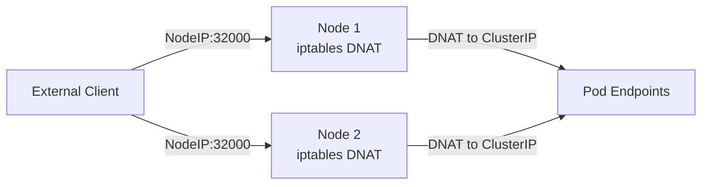
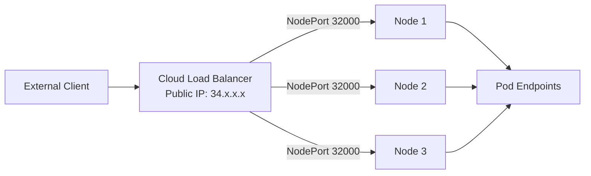
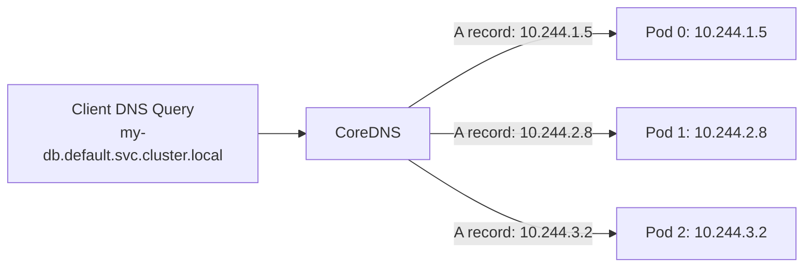
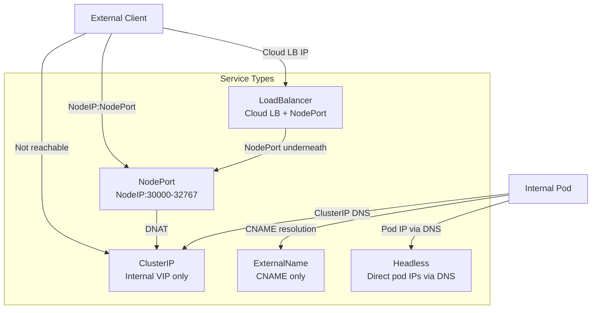

# Kubernetes Service Types

## Table of Contents

- [Overview](#overview)
- [ClusterIP](#clusterip)
- [NodePort](#nodeport)
- [LoadBalancer](#loadbalancer)
- [ExternalName](#externalname)
- [Headless Service (ClusterIP: None)](#headless-service-clusterip-none)
- [EndpointSlice](#endpointslice)
- [ExternalIPs](#externalips)
- [Session Affinity](#session-affinity)
- [Service Type Comparison](#service-type-comparison)
- [Production Scenario: StatefulSet DNS Not Resolving](#production-scenario-statefulset-dns-not-resolving)
- [Failure Modes](#failure-modes)
- [Debugging Guide](#debugging-guide)
- [Security Considerations](#security-considerations)
- [Interview Questions](#interview-questions)
  - [Basic](#basic)
  - [Intermediate](#intermediate)
  - [Advanced / Staff Level](#advanced-staff-level)

---

## Overview

A Kubernetes Service is a stable network identity for a set of pods selected by label. Pods are ephemeral — they come and go with rolling updates and node failures. Services provide the permanent ClusterIP, DNS name, and load-balancing endpoint that consumers depend on. Understanding each service type, its implementation, and its failure modes is foundational for production cluster operations.

---

## ClusterIP

The default service type. Creates a virtual IP (VIP) reachable only within the cluster. No external access.

**Implementation:** kube-proxy programs DNAT rules (iptables or IPVS) on every node. The ClusterIP is never assigned to a real network interface — it exists only as a rule match target.

**DNS:** `<service>.<namespace>.svc.cluster.local` → ClusterIP

```yaml
apiVersion: v1
kind: Service
metadata:
  name: my-api
  namespace: backend
spec:
  selector:
    app: my-api
  ports:
    - port: 80        # port clients connect to (the ClusterIP side)
      targetPort: 8080  # port on the pod
  type: ClusterIP     # default, can be omitted
```

**Production use:** Internal service-to-service communication. Pair with NetworkPolicy for access control.

---

## NodePort

Extends ClusterIP: additionally opens a port in the range 30000-32767 on every node's external interface. Traffic to `<any-node-ip>:<nodePort>` is forwarded to the ClusterIP, then load-balanced to pods.



**Source IP preservation problem:** When traffic hits NodePort, kube-proxy SNATs the source IP to the node's IP before forwarding to the pod. The pod sees the node IP as the client, not the actual client IP. This breaks IP-based access control and per-client rate limiting.

**Fix — `externalTrafficPolicy: Local`:** kube-proxy only routes to pods on the local node, skipping the extra hop and SNAT. The pod sees the real client IP. **Trade-off:** If no pods exist on the node receiving the packet, the connection is dropped — uneven load distribution.

```yaml
spec:
  type: NodePort
  externalTrafficPolicy: Local   # preserve source IP, only route to local pods
  ports:
    - port: 80
      targetPort: 8080
      nodePort: 32000   # optional: specify port, or let K8s assign
```

**Production use:** Simple external access without a cloud LB. Suitable for on-prem with an external LB in front (HAProxy/nginx targeting all node IPs).

---

## LoadBalancer

Provisions an external load balancer via the cloud controller manager. The LB gets a public IP that forwards to NodePorts on cluster nodes. This is the standard way to expose services externally in cloud environments.



**Standard architecture (NodePort underneath):** Cloud LB → all NodePorts → ClusterIP → pods. Two hops inside the cluster. Source IP is SNATed unless `externalTrafficPolicy: Local` is set.

**AWS LBC IP mode:** The AWS Load Balancer Controller can configure an NLB in IP target mode — the NLB registers pod IPs directly as targets, bypassing NodePort entirely. One hop to the pod, preserves client IP natively.

```yaml
metadata:
  annotations:
    service.beta.kubernetes.io/aws-load-balancer-type: "external"
    service.beta.kubernetes.io/aws-load-balancer-nlb-target-type: "ip"  # IP mode
    service.beta.kubernetes.io/aws-load-balancer-scheme: "internet-facing"
spec:
  type: LoadBalancer
```

**Provisioning lag:** External IP shows `<pending>` for 30-120 seconds while the cloud LB provisions. Normal in most clouds.

**Production use:** Production internet-facing services. Always prefer IP target mode on AWS to avoid double NAT.

---

## ExternalName

No proxying, no VIP, no kube-proxy rules. Returns a CNAME record pointing to an external DNS name. Used to give an external dependency a stable K8s service name inside the cluster.

```yaml
spec:
  type: ExternalName
  externalName: api.stripe.com   # CoreDNS returns CNAME to this
```

**DNS behavior:** `my-stripe.default.svc.cluster.local` → CNAME → `api.stripe.com` → A record resolution by client.

**Limitation:** Does not support port remapping. No health checking. If `api.stripe.com` changes IPs or goes down, K8s is unaware.

**Production use:** Abstracting third-party API hostnames so that switching providers requires only updating the ExternalName service rather than deploying config changes to all consumers.

---

## Headless Service (ClusterIP: None)

No VIP is assigned. DNS returns A records pointing directly to pod IPs instead of a single ClusterIP.

```yaml
spec:
  clusterIP: None   # headless
  selector:
    app: my-db
```

**DNS behavior:**
- `my-db.default.svc.cluster.local` → multiple A records (one per pod IP)
- For StatefulSets: `<pod-name>.<service>.<namespace>.svc.cluster.local` → specific pod IP



**StatefulSet pod addressing:**
- `mysql-0.mysql.default.svc.cluster.local` → always resolves to the IP of pod `mysql-0`
- This is stable across pod restarts (pod name is preserved by StatefulSet controller)
- Required for leader election, replication setup (MySQL primary/replica, Kafka broker IDs)

**Production use:** StatefulSets (databases, message queues), applications that need to enumerate all instances (Cassandra gossip, Elasticsearch cluster formation).

---

## EndpointSlice

The modern replacement for the Endpoints resource. Before EndpointSlices (added GA in K8s 1.21), a single Endpoints object held all pod IPs for a service. At 500+ pods, this became a large object written on every pod change, causing significant API server and etcd write amplification.

**EndpointSlice:** Each slice holds at most 100 endpoints. A service with 300 pods has 3 EndpointSlices. When a single pod changes, only its slice is updated — not all 300 entries.

```bash
kubectl get endpointslices -n backend
# NAME              ADDRESSTYPE   PORTS   ENDPOINTS                            AGE
# my-api-abc12      IPv4          8080    10.244.1.5,10.244.2.3,10.244.1.9    5d
# my-api-def34      IPv4          8080    10.244.3.1,10.244.4.2               5d
```

**kube-proxy watches EndpointSlices** (not Endpoints) in K8s 1.21+. Endpoints still exists for backwards compatibility but is mirrored from EndpointSlices by the endpoint slice mirroring controller.

---

## ExternalIPs

Allows mapping a ClusterIP service to specific external IPs that route to cluster nodes. Dangerous because anyone who controls the listed IP gains access to the service.

```yaml
spec:
  externalIPs:
    - 203.0.113.5   # must route to a cluster node externally
```

**Security risk:** If a tenant can create services with `externalIPs`, they can intercept traffic for any IP that the cluster nodes can route — including other services' IPs. Restrict with OPA/Kyverno admission policies.

---

## Session Affinity

By default, K8s load-balances each new connection independently (per-connection round-robin or random). Session affinity pins a client to the same pod for multiple requests.

```yaml
spec:
  sessionAffinity: ClientIP
  sessionAffinityConfig:
    clientIP:
      timeoutSeconds: 10800   # 3 hours (default: 300 seconds = 5 minutes)
```

**Implementation:** kube-proxy adds an extra iptables rule with `-m recent` to track source IPs and return the same DNAT target.

**Trade-offs for stateful apps:**
- Uneven load distribution: a single heavy client pins to one pod indefinitely
- The 5-minute default timeout is often too short for long-running sessions; applications reconnect and land on a different pod, losing in-memory session state
- Does not survive pod restarts (new pod IP, new DNAT target)
- Better alternatives: application-level sticky sessions via cookies (Ingress annotation), external session storage (Redis), or a service mesh for connection pinning

---

## Service Type Comparison



---

## Production Scenario: StatefulSet DNS Not Resolving

**Symptom:** MySQL replica fails to join the primary. The replication configuration uses `mysql-0.mysql.default.svc.cluster.local` as the primary hostname, but DNS lookup fails.

**Investigation:**

```bash
# Step 1: Verify the service exists and is headless
kubectl get svc mysql -n default
# NAME    TYPE        CLUSTER-IP   EXTERNAL-IP   PORT(S)    AGE
# mysql   ClusterIP   None         <none>        3306/TCP   10d
# ClusterIP = None confirms headless

# Step 2: Check the StatefulSet is using the correct serviceName
kubectl get statefulset mysql -o yaml | grep serviceName
# spec:
#   serviceName: mysql   # must match the headless service name

# Common mistake: serviceName points to a regular ClusterIP service
# e.g., serviceName: mysql-headless  but the service is named "mysql"

# Step 3: Verify pod-level DNS from inside a pod
kubectl exec -it mysql-1 -- nslookup mysql-0.mysql.default.svc.cluster.local
# Should return: Address: 10.244.x.y (pod IP)
# If NXDOMAIN: the StatefulSet serviceName doesn't match

# Step 4: Check if the pod is Ready
# Non-ready pods are NOT included in DNS records for headless services
kubectl get pods mysql-0 -o wide
# READY column must be 1/1

# Step 5: Test with a regular ClusterIP service (wrong approach)
kubectl exec -it mysql-1 -- nslookup mysql.default.svc.cluster.local
# This returns the ClusterIP, which routes to any pod - not suitable for replication
# The application must use the headless per-pod DNS

# Fix: ensure headless service and StatefulSet serviceName match
# headless service name: "mysql"
# StatefulSet: spec.serviceName: "mysql"
```

**Root cause patterns:**
1. `serviceName` in StatefulSet pointing to a ClusterIP service (not headless) — per-pod DNS records are not created
2. Pod not passing readiness probe — excluded from DNS until healthy
3. DNS cache TTL issue — old pod IP cached after restart; add `dnsPolicy: None` with low TTL or rely on proper TTL from CoreDNS (default 5 seconds for pod records)

---

## Failure Modes

| Failure | Symptoms | Detection | Fix |
|---------|----------|-----------|-----|
| Endpoint slice lag | New pods not receiving traffic for 5-30s | `kubectl get endpointslice` vs pod creation time | Tune controller-manager `--endpoint-updates-batch-period`; pre-warm replicas |
| NodePort SNAT hides client IP | IP-based rate limiting / logging broken | Logs show node IP instead of client IP | Set `externalTrafficPolicy: Local` or use LB IP mode |
| LoadBalancer stuck Pending | No external IP after minutes | Cloud LB controller logs; `kubectl describe svc` | Check cloud controller manager pod; IAM permissions for LB provisioning |
| Headless DNS returns stale IPs | Application connects to terminated pod IP | `dig +short svc-name.ns.svc.cluster.local` shows old IPs | Verify pod deletion triggers endpoint removal; check CoreDNS cache TTL |
| StatefulSet pod not DNS-reachable | Replication setup fails | `nslookup pod-0.svc.ns` NXDOMAIN | Ensure pod passes readiness; serviceName in StatefulSet matches headless service |
| Session affinity 5-min timeout | Stateful sessions randomly losing state | Client requests going to different pods; app logs show no session | Increase `timeoutSeconds` or move session state to external store |
| ExternalIPs hijacking | Service intercepts traffic for unrelated IP | Audit service specs for externalIPs field | Block via admission webhook (Kyverno/OPA); monitor with Falco |

---

## Debugging Guide

```bash
# Full service debugging workflow

# 1. Verify service config
kubectl get svc <name> -n <ns> -o yaml
# Check: selector, ports, clusterIP, type

# 2. Verify endpoints are populated
kubectl get endpoints <name> -n <ns>
kubectl get endpointslices -n <ns> -l kubernetes.io/service-name=<name>
# Addresses should list pod IPs

# 3. Verify pod readiness
kubectl get pods -l <selector> -n <ns>
# All pods should show 1/1 or n/n READY

# 4. Test DNS resolution
kubectl run dns-test --image=busybox --rm -it -- \
  nslookup <service>.<namespace>.svc.cluster.local

# 5. Test direct ClusterIP
kubectl run curl-test --image=curlimages/curl --rm -it -- \
  curl -v http://<clusterIP>:<port>/

# 6. Check iptables rules on a node
# (for iptables mode kube-proxy)
CLUSTER_IP=$(kubectl get svc <name> -o jsonpath='{.spec.clusterIP}')
sudo iptables -t nat -L KUBE-SERVICES -n | grep $CLUSTER_IP

# 7. Check IPVS (if IPVS mode)
sudo ipvsadm -Ln | grep -A 10 $CLUSTER_IP

# 8. Verify NodePort is reachable (if NodePort/LoadBalancer)
NODE_IP=$(kubectl get node <node> -o jsonpath='{.status.addresses[0].address}')
NODE_PORT=$(kubectl get svc <name> -o jsonpath='{.spec.ports[0].nodePort}')
curl http://$NODE_IP:$NODE_PORT/

# 9. For LoadBalancer: check cloud LB events
kubectl describe svc <name> -n <ns>
# Events: "Ensured load balancer" or error messages
```

---

## Security Considerations

- **Restrict NodePort range.** The range 30000-32767 is open on every node interface. Add `--service-node-port-range` to kube-apiserver to restrict to needed ports. Use cloud security groups to block NodePort traffic from the public internet.
- **Audit LoadBalancer services.** Each LoadBalancer service can create an internet-facing endpoint. Implement an admission policy that requires security review before allowing `type: LoadBalancer` in production namespaces.
- **ExternalIPs are dangerous.** A tenant who can create ExternalIP services can intercept traffic for arbitrary IPs. Block `spec.externalIPs` with OPA Gatekeeper or Kyverno. Monitor with: `kubectl get svc -A -o json | jq '.items[] | select(.spec.externalIPs)'`
- **Headless services expose pod IPs.** Any client that can query DNS and enumerate a headless service can discover all pod IPs. Combine with NetworkPolicy to restrict which pods can initiate connections even if they discover IPs.
- **Session affinity and CSRF.** ClientIP-based session affinity does not authenticate the client — it only pins the connection. It provides no security benefit, only performance/state benefits.

---

## Interview Questions

### Basic

**Q: What is the difference between ClusterIP, NodePort, and LoadBalancer?**
ClusterIP is a virtual IP only accessible within the cluster, used for internal service-to-service communication. NodePort opens a port (30000-32767) on every node, accessible externally. LoadBalancer provisions a cloud-managed load balancer with an external IP, which forwards traffic to NodePorts underneath (except in IP target mode). Each type is additive — LoadBalancer includes NodePort which includes ClusterIP.

**Q: What is a headless service and when do you use it?**
A headless service has `clusterIP: None`. No VIP is created. Instead, DNS returns the pod IPs directly as A records. StatefulSets require a headless service because each pod needs a stable DNS identity (`pod-name.service.namespace.svc.cluster.local`) for leader election, replication, and peer discovery. Regular services are inappropriate for these workloads because the ClusterIP would randomly route to any pod.

**Q: What is EndpointSlice and why does it exist?**
EndpointSlice replaces the Endpoints API. The old Endpoints object held all pod IPs in a single object — for a service with 500 pods, every pod change (scale up/down, rollout) would rewrite the entire 500-IP object. EndpointSlice shards this into slices of at most 100 endpoints. When one pod changes, only its slice is updated, reducing API server and etcd write amplification by ~5x.

### Intermediate

**Q: Why does `externalTrafficPolicy: Local` preserve client IP, and what is the trade-off?**
With `externalTrafficPolicy: Cluster` (default), kube-proxy SNATs the source IP to the node's IP before forwarding to pods. This allows forwarding to pods on any node, but hides the client IP. With `Local`, kube-proxy only forwards to pods on the same node, skipping SNAT (the packet goes directly to the pod without IP rewriting). The trade-off: if no pods exist on the receiving node, the connection is dropped. Load distribution becomes uneven — nodes with more pods handle more traffic. Health checks at the LB tier must ensure traffic only goes to nodes with ready local pods (cloud LBs with readiness probe support handle this automatically).

**Q: A MySQL primary/replica setup is failing to form. Primary is `mysql-0`, replica is `mysql-1`. DNS lookup for `mysql-0.mysql.default.svc.cluster.local` returns NXDOMAIN. What is the most likely cause?**
The StatefulSet's `spec.serviceName` field likely does not match the actual headless service name. Per-pod DNS records are only created when: (1) a headless service (`clusterIP: None`) exists, (2) the StatefulSet's `serviceName` exactly matches that service's name, and (3) the pod is Running and Ready. Check with `kubectl get statefulset mysql -o yaml | grep serviceName` and verify it matches `kubectl get svc -n default | grep mysql`. Also check pod readiness — non-ready pods are excluded from DNS.

**Q: A LoadBalancer service shows `EXTERNAL-IP: <pending>` for 5 minutes. How do you debug it?**
1. Check cloud controller manager: `kubectl logs -n kube-system -l k8s-app=cloud-controller-manager` — look for API permission errors or quota exhaustion. 2. Check IAM permissions: the controller needs create/describe/delete on cloud LB resources. 3. Check service events: `kubectl describe svc <name>` — events show LB creation attempts. 4. Check cloud console for LB provisioning errors. 5. Verify the cluster's cloud provider config is correctly mounted on the controller-manager. Common causes: IAM role missing LB permissions, subnet missing required tags, LB quota exceeded.

### Advanced / Staff Level

**Q: You need to migrate a stateful application from using ClusterIP session affinity to an external session store. Describe the migration strategy to avoid dropped sessions during the transition.**
Session affinity in K8s is limited: 5-minute default timeout, no pod-restart persistence, uneven load distribution. Migration strategy: (1) Enable the new session store alongside existing service, deploying Redis/Memcached with its own ClusterIP service. (2) Update application to read sessions from both the old in-memory store and the new external store (dual-read mode). (3) After a session TTL cycle (ensuring all sessions have been written to the external store), switch to write-only to external store. (4) Update service to remove `sessionAffinity: ClientIP`. (5) Remove dual-read code. This zero-downtime approach ensures no session is lost. During rollout, use `maxUnavailable: 0` and `maxSurge: 1` in the deployment strategy to avoid killing old pods before new ones are verified.

**Q: Explain how AWS NLB IP target mode changes the traffic path vs NodePort target mode for a LoadBalancer service. What are the operational implications?**
NodePort target mode: NLB → node security group (NodePort 32000) → kube-proxy iptables DNAT → pod (2 hops, SNAT applies, node must be added/removed from NLB on scale events). IP target mode: NLB registers pod IPs directly as targets → pod (1 hop, no SNAT, actual client IP visible in pod). Operational implications of IP mode: (1) Pod IPs must be routable from the NLB (required VPC CNI or overlay-aware NLB); (2) Pod registration/deregistration in NLB happens on pod create/delete — requires the AWS LBC deregistration delay to match pod terminationGracePeriodSeconds or connections drop during rollouts; (3) NLB health checks go to pod port directly, giving accurate health state vs NodePort mode which probes the node; (4) NLB has a 500 targets per LB limit in IP mode — services with 500+ pods need multiple LBs or NodePort mode.
