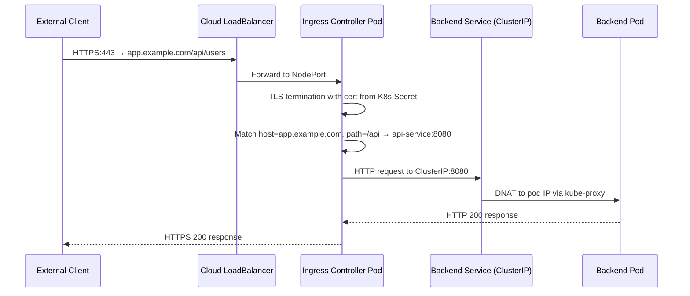
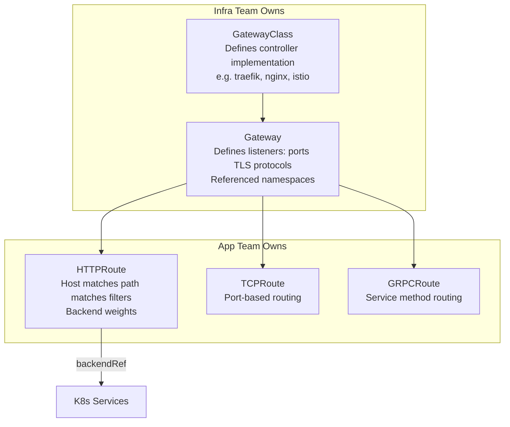
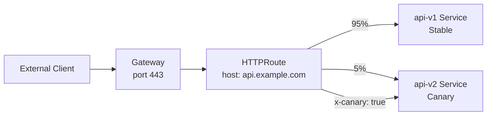

# Ingress and Gateway API

## Overview

Kubernetes Ingress is the north-south gateway for HTTP/HTTPS traffic entering the cluster. It decouples routing logic (host, path, TLS termination) from individual service LoadBalancers. However, the Ingress spec was intentionally minimal when designed in 2015, and the gaps drove an explosion of controller-specific annotations. Gateway API (SIG-Network, GA in K8s 1.28) is the structured evolution — role-based, expressive, and portable across controllers.

**Traefik in this context:** Traefik is a cloud-native ingress controller and Gateway API implementation with automatic service discovery, built-in ACME/Let's Encrypt, and a rich middleware pipeline. Unlike NGINX, it discovers services via provider APIs and updates routing dynamically without restarts.

---

## Ingress Spec

An Ingress resource instructs the ingress controller to route external HTTP traffic based on hostname and path to backend services.

```yaml
apiVersion: networking.k8s.io/v1
kind: Ingress
metadata:
  name: my-app
  annotations:
    nginx.ingress.kubernetes.io/rewrite-target: /  # controller-specific
spec:
  ingressClassName: nginx   # selects which controller handles this
  tls:
    - hosts:
        - app.example.com
      secretName: app-tls-cert   # TLS terminates here, not at backend
  rules:
    - host: app.example.com
      http:
        paths:
          - path: /api
            pathType: Prefix
            backend:
              service:
                name: api-service
                port:
                  number: 8080
          - path: /
            pathType: Prefix
            backend:
              service:
                name: frontend-service
                port:
                  number: 80
```

**Path types:**
- `Exact`: must match character-for-character
- `Prefix`: matches path prefix; `/api` matches `/api`, `/api/users`, `/api/v2`
- `ImplementationSpecific`: controller-defined semantics (avoid for portability)

### Ingress Traffic Flow



---

## Ingress Controllers: Feature Comparison

| Feature | NGINX Ingress | Traefik | HAProxy | Contour | Kong |
|---------|--------------|---------|---------|---------|------|
| Auto-discovery | No (requires reload) | Yes (dynamic, no reload) | No | No | No |
| Let's Encrypt built-in | No (needs cert-manager) | Yes (native ACME) | No | No | No |
| Gateway API support | Beta | Full (v1.4.0 conformance) | Limited | Full | Limited |
| Traffic weighting | Annotation-based | Native CRD + Gateway API | Annotation-based | HTTPRoute | Plugin |
| gRPC | Yes | Yes | Limited | Yes | Yes |
| TCP/UDP routing | Partial (extra ConfigMap) | Yes (TCPRoute/UDP Ingress) | Yes | Partial | Yes |
| WASM plugins | No | No | No | No | Yes |
| Middleware pipeline | Annotations only | Rich CRD-based | Annotations | No | Plugin-based |
| HA / Active-Passive | Yes | Yes (with Redis) | Yes | Yes | Yes |
| Observability | Prometheus | Prometheus + OpenTelemetry | Stats page | Prometheus | Kong Manager |

---

## Ingress Limitations

The Ingress spec has fundamental gaps that drove adoption of controller-specific annotations and eventually Gateway API:

1. **No traffic weighting in spec.** Canary deployments (route 10% to v2) require annotations like `nginx.ingress.kubernetes.io/canary-weight: "10"` — not portable to other controllers.

2. **No header-based routing in spec.** A/B testing by request header requires annotations — again, not portable.

3. **No TCP/UDP.** Ingress only handles HTTP/HTTPS. Exposing a database, MQTT broker, or gRPC streaming endpoint requires controller workarounds (NGINX's `tcp-services` ConfigMap).

4. **All annotations are controller-specific.** Migrating controllers requires rewriting all annotations. There is no standard for rate limiting, auth, request transformation.

5. **No role separation.** The same Ingress resource mixes infra concerns (TLS, load balancing algorithm) with app concerns (path routing, timeouts). In large orgs, infra teams own gateway config, app teams own routes — Ingress conflates both.

6. **Single owner.** An Ingress resource belongs to one namespace. Cross-namespace backends are not supported without controller-specific hacks.

---

## Gateway API

Gateway API separates concerns into three resource types with distinct ownership:



**Role-based separation:**
- **Cluster infra team:** Creates `GatewayClass` (which controller) and `Gateway` (listeners, TLS policy, allowed routes from which namespaces)
- **App team:** Creates `HTTPRoute` in their namespace, attaches to the gateway — no permission to touch gateway TLS config

### Canary Traffic Weighting with HTTPRoute



---

## HTTPRoute Deep Dive

HTTPRoute is the primary routing resource. It supports features that required proprietary annotations in Ingress:

```yaml
apiVersion: gateway.networking.k8s.io/v1
kind: HTTPRoute
metadata:
  name: api-route
  namespace: backend
spec:
  parentRefs:
    - name: main-gateway      # the Gateway this route attaches to
      namespace: infra
  hostnames:
    - "api.example.com"
  rules:
    # Header-based routing (not possible in standard Ingress spec)
    - matches:
        - headers:
            - name: x-canary
              value: "true"
      backendRefs:
        - name: api-v2
          port: 8080
          weight: 100

    # Traffic weighting for canary (not possible in standard Ingress spec)
    - matches:
        - path:
            type: PathPrefix
            value: /api
      backendRefs:
        - name: api-v1
          port: 8080
          weight: 90
        - name: api-v2
          port: 8080
          weight: 10

      # Filters: request transformation
      filters:
        - type: RequestHeaderModifier
          requestHeaderModifier:
            add:
              - name: x-forwarded-version
                value: "v1"
        - type: URLRewrite
          urlRewrite:
            path:
              type: ReplacePrefixMatch
              replacePrefixMatch: /
```

**Available HTTPRoute filters:**
- `RequestHeaderModifier`: add/remove/set request headers
- `ResponseHeaderModifier`: add/remove/set response headers
- `RequestRedirect`: 301/302 redirect to different host/path/scheme
- `URLRewrite`: rewrite path or hostname before forwarding
- `RequestMirror`: duplicate traffic to a secondary backend (for shadow testing)
- `ExtensionRef`: controller-specific extensions

---

## TLS Termination

### At Ingress (Traditional)

```yaml
spec:
  tls:
    - hosts:
        - app.example.com
      secretName: app-tls-cert   # cert-manager populates this Secret
```

**cert-manager flow:**
1. cert-manager watches for `Certificate` resources or `tls` annotations on Ingress
2. Requests certificate from Let's Encrypt via HTTP-01 (must control port 80) or DNS-01 challenge
3. Stores cert in the referenced Secret
4. Renews automatically before expiry (default 2/3 of cert lifetime)

### At Gateway (Gateway API)

```yaml
apiVersion: gateway.networking.k8s.io/v1
kind: Gateway
spec:
  listeners:
    - name: https
      port: 443
      protocol: HTTPS
      tls:
        mode: Terminate           # or Passthrough (forward TLS to backend)
        certificateRefs:
          - name: wildcard-cert   # K8s Secret with TLS cert/key
            namespace: infra
```

### Traefik-Specific: Built-in ACME

Traefik natively integrates with Let's Encrypt via the ACME protocol — no cert-manager needed:

```yaml
# traefik.yaml static config
certificatesResolvers:
  letsencrypt:
    acme:
      email: admin@example.com
      storage: /data/acme.json    # MUST be on a PersistentVolume
      dnsChallenge:
        provider: cloudflare      # DNS-01 for wildcards
        resolvers:
          - "1.1.1.1:53"
```

```yaml
# IngressRoute referencing the resolver
apiVersion: traefik.io/v1alpha1
kind: IngressRoute
spec:
  tls:
    certResolver: letsencrypt
```

**Production gotchas for Traefik ACME:**
- `acme.json` on ephemeral pod storage → certs lost on restart → rate limit hit (50 certs/week/domain)
- Single Traefik replica with ACME → cert issuance race if scaled
- Fix: PersistentVolumeClaim for `/data` + Redis or KV store for distributed cert storage in HA mode

---

## Traefik IngressRoute CRD

Traefik's proprietary `IngressRoute` CRD extends Ingress capabilities with a clean, annotation-free syntax:

```yaml
apiVersion: traefik.io/v1alpha1
kind: IngressRoute
metadata:
  name: api-route
spec:
  entryPoints:
    - websecure   # port 443
  routes:
    - match: Host(`api.example.com`) && PathPrefix(`/v2`)
      kind: Rule
      middlewares:
        - name: rate-limit-api
        - name: add-cors-headers
      services:
        - name: api-v2-svc
          port: 8080
          weight: 100
        - name: api-v2-canary
          port: 8080
          weight: 0   # start at 0, increase for canary
  tls:
    certResolver: letsencrypt
```

**IngressRoute match expressions:** `Host()`, `PathPrefix()`, `Path()`, `Headers()`, `HeadersRegexp()`, `Method()`, `Query()`, combined with `&&` and `||`. Far more expressive than Ingress `path`/`host` without annotations.

---

## Production Scenario: Canary Deployment Traffic Routing Failure

**Situation:** Team deploys a new version of the `payments` service. 5% canary traffic is configured. In practice, all traffic goes to the stable version, or all goes to canary — never 5%.

### Annotation Approach (NGINX Ingress) — Common Mistakes

```yaml
# WRONG: Two separate Ingress resources with same host but different canary annotation
# This can cause the NGINX to pick one arbitrarily
apiVersion: networking.k8s.io/v1
kind: Ingress
metadata:
  name: payments-stable
  annotations:
    nginx.ingress.kubernetes.io/canary: "false"
spec: ...
---
apiVersion: networking.k8s.io/v1
kind: Ingress
metadata:
  name: payments-canary
  annotations:
    nginx.ingress.kubernetes.io/canary: "true"
    nginx.ingress.kubernetes.io/canary-weight: "5"
spec:
  rules:
    - host: payments.example.com   # must match stable exactly
      http:
        paths:
          - path: /          # must match stable exactly
```

**Failure modes:**
- If `host` or `path` doesn't exactly match the stable Ingress, NGINX treats the canary as a separate route — either 0% or 100% goes to canary
- If canary Ingress has a different `ingressClassName`, it is ignored by the controller
- NGINX canary annotations only support weight, not header or cookie matching simultaneously on some older versions

**Debugging:**

```bash
# Check NGINX ingress controller logs
kubectl logs -n ingress-nginx \
  $(kubectl get pods -n ingress-nginx -l app.kubernetes.io/name=ingress-nginx -o name | head -1) \
  | grep payments

# Check the generated NGINX config directly
kubectl exec -n ingress-nginx \
  $(kubectl get pods -n ingress-nginx -l app.kubernetes.io/name=ingress-nginx -o name | head -1) \
  -- cat /etc/nginx/nginx.conf | grep -A5 canary

# Verify both ingresses have the same host/path
kubectl get ingress -n payments -o yaml
```

### Gateway API Approach (Canonical Solution)

```yaml
apiVersion: gateway.networking.k8s.io/v1
kind: HTTPRoute
metadata:
  name: payments-route
spec:
  parentRefs:
    - name: main-gateway
  hostnames: ["payments.example.com"]
  rules:
    - matches:
        - path:
            type: PathPrefix
            value: /
      backendRefs:
        - name: payments-stable
          port: 8080
          weight: 95
        - name: payments-canary
          port: 8080
          weight: 5   # exactly 5% without annotation magic
```

Gateway API weight splitting is part of the spec — every conformant controller implements it identically. No annotation differences between controllers.

```bash
# Monitor canary traffic with Hubble (Cilium) or access logs
kubectl logs -n gateway-system -l app=gateway-controller -f | grep payments

# Verify route is attached to gateway
kubectl get httproute payments-route -n payments -o yaml | grep -A5 status
# status.parents should show the gateway and "Accepted: True"
```

---

## Failure Modes

| Failure | Symptoms | Detection | Fix |
|---------|----------|-----------|-----|
| Ingress class missing | Ingress created but no external IP, no routing | `kubectl describe ingress` shows no address | Add `ingressClassName` matching installed controller |
| TLS cert not provisioned | HTTPS returns self-signed cert or HTTP 525 | Browser cert warning; `kubectl get cert` shows NotReady | Check cert-manager logs; verify ACME challenge can reach port 80 |
| Annotation misspelling | Feature not applied (rate limiting, auth bypass) | Behavior unchanged after annotation addition | `kubectl describe ingress` — check Events for warnings; validate annotation key spelling |
| HTTPRoute not attached | Route exists but traffic not routed | `kubectl get httproute -o yaml` status.parents | Check parentRef name/namespace match gateway; gateway allowedRoutes namespace policy |
| Canary weight 0/100 | Either no traffic to canary or all goes to canary | Access log sampling; Prometheus request rate | Verify both backendRefs are healthy; check weight values sum correctly |
| ACME rate limit | TLS cert renewal fails; HTTP 429 from Let's Encrypt | Traefik/cert-manager logs: "too many certificates" | Store certs persistently; use staging LE for testing; implement DNS-01 for wildcard |
| Traefik allowCrossNamespace | Middleware in different namespace ignored | Route applies without middleware | Set `allowCrossNamespace: true` in Traefik static config (carefully) |

---

## Debugging Guide

```bash
# Ingress debugging
kubectl describe ingress <name> -n <ns>
# Events section shows: "Successfully updated the load balancer"
# Address: field should show IP after controller processes it

# Check ingress controller is running
kubectl get pods -n ingress-nginx
kubectl logs -n ingress-nginx <controller-pod> --tail=100

# Verify NGINX config was generated correctly
kubectl exec -n ingress-nginx <controller-pod> -- \
  nginx -T | grep -A 20 "server_name app.example.com"

# Gateway API debugging
kubectl get gatewayclasses   # list available gateway implementations
kubectl get gateways -A      # status should show "Programmed: True"
kubectl get httproutes -A    # status.parents[0].conditions for attachment status

# Check specific HTTPRoute status
kubectl get httproute <name> -n <ns> -o jsonpath=\
'{.status.parents[0].conditions}' | python3 -m json.tool

# TLS debugging
kubectl get certificate -n <ns>   # cert-manager certificate resources
kubectl describe certificate <name> -n <ns>
# Check: Conditions, Events for ACME challenge failures

# curl with SNI for TLS testing
curl -v --resolve app.example.com:443:<ingress-ip> https://app.example.com/

# Traefik dashboard (check live routing table)
kubectl port-forward -n traefik svc/traefik 9000:9000
# Open http://localhost:9000/dashboard/
```

---

## Security Considerations

- **Restrict Ingress to specific namespaces.** Gateway API's `allowedRoutes.namespaces` on the Gateway resource prevents tenant namespaces from attaching routes to gateways they should not own. In Ingress, any namespace can create an Ingress for any hostname (no built-in scoping).
- **Traefik dashboard authentication is non-negotiable.** An unauthenticated dashboard exposes the full routing table, middleware config, and service topology. Always protect with `basicAuth` or `forwardAuth`. Set `api.insecure: false` in static config.
- **TLS minimum version.** Set `minVersion: VersionTLS12` in Traefik TLS options or equivalent in NGINX `ssl_protocols`. TLS 1.0 and 1.1 are deprecated (RFC 8996).
- **HSTS, CSP, and security headers.** Add via Traefik `headers` middleware or NGINX `add_header` — but enforce at the ingress controller, not in application code, for consistency.
- **Rate limiting at the edge.** Apply rate limiting at the ingress controller (Traefik `rateLimit` middleware, NGINX `limit_req`) before traffic reaches pods. This protects against application-layer DDoS.
- **Wildcard Ingress host is dangerous.** A rule with `host: *` or no host matches all traffic. Explicitly name hosts in all Ingress rules.
- **Traefik `allowCrossNamespace`.** Defaults to false. Enable only when explicitly needed and pair with RBAC limiting which service accounts can create IngressRoutes.

---

## Interview Questions

### Basic

**Q: What is the difference between Ingress and a LoadBalancer service?**
A LoadBalancer service provisions a cloud LB for a single service — each service gets its own external IP and LB cost. Ingress is a single L7 proxy that routes many services under one external IP, using hostname and path rules. Ingress is cost-effective for many HTTP services; LoadBalancer is better for non-HTTP or services that need dedicated external IPs.

**Q: What is an ingress controller and what is an IngressClass?**
Kubernetes Ingress resources are just configuration — they need an ingress controller to implement them. Popular controllers: NGINX Ingress, Traefik, HAProxy Ingress. `IngressClass` selects which controller handles an Ingress: `spec.ingressClassName: nginx` routes to the NGINX controller. Multiple controllers can coexist in one cluster serving different IngressClasses.

**Q: How does cert-manager integrate with Ingress?**
cert-manager watches for Ingress resources with TLS configuration and automatically creates `Certificate` resources. It then communicates with Let's Encrypt (or another CA) to obtain certificates, storing them in K8s Secrets. The Ingress controller reads these Secrets for TLS termination. cert-manager automates renewal before expiry, eliminating manual cert rotation.

### Intermediate

**Q: What are the limitations of Kubernetes Ingress that led to Gateway API?**
1. No traffic weighting — canary requires controller-specific annotations
2. No header/cookie-based routing in spec — A/B testing requires annotations
3. No TCP/UDP — only HTTP/HTTPS
4. Controller portability — annotations are not portable between controllers
5. No role separation — infra concerns (TLS, algorithms) mixed with app concerns (paths) in one resource
6. Single namespace ownership — no cross-namespace route delegation

**Q: Explain how Traefik implements canary deployments differently from NGINX Ingress.**
NGINX Ingress canary uses annotations (`canary-weight`, `canary-by-header`) and requires two separate Ingress resources with exactly matching host/path. The canary Ingress is annotated with `nginx.ingress.kubernetes.io/canary: "true"`. This is fragile — if the host/path doesn't match perfectly, routing breaks silently. Traefik's `IngressRoute` CRD supports weighted services natively in a single resource using `weight` on each service definition. No separate resources, no annotation interpretation — the weight is part of the routing spec and applied deterministically.

**Q: What is the HTTPRoute `RequestMirror` filter used for?**
RequestMirror duplicates traffic to a secondary backend without affecting the primary response. The primary backend's response is returned to the client; the mirrored copy goes to the secondary and its response is discarded. Use case: shadow testing a new service version with real production traffic before routing live users to it. The secondary service must handle the same request volume as the primary but failures are silently ignored. This is safer than canary for high-risk changes because the user experience is never affected.

### Advanced / Staff Level

**Q: Your team wants to migrate from NGINX Ingress to Traefik without downtime. Describe the migration strategy.**
1. Install Traefik alongside NGINX with a different IngressClass name (`traefik` vs `nginx`). Both controllers watch all Ingress resources but only process their own IngressClass. 2. Create parallel Traefik IngressRoutes for a subset of low-traffic services. Configure the same hosts. 3. Update DNS CNAME/A records at the LB layer (or use weighted DNS) to gradually shift traffic from the NGINX LB IP to the Traefik LB IP — 5% → 25% → 50% → 100%. 4. Monitor error rates and latency during each shift. 5. Convert remaining NGINX Ingresses to IngressRoutes progressively. 6. After 100% traffic on Traefik, remove NGINX. Key risks: annotation semantics differ (rate limiting, auth, rewrite behavior) — test each annotation equivalent in Traefik middleware before switching. Session affinity behavior may differ between controllers.

**Q: Gateway API uses a role-based model. How do you implement multi-tenant ingress where app teams can add routes but cannot modify TLS or gateway-level settings?**
1. Infra team creates `GatewayClass` and `Gateway` in the `infra` namespace. On the `Gateway`, set `spec.listeners[].allowedRoutes.namespaces.from: Selector` with a namespace label selector matching app namespaces. 2. Use RBAC: app teams get `create/update/delete` on `HTTPRoute` in their own namespace, but no access to `Gateway` or `GatewayClass` resources. 3. App teams create `HTTPRoute` in their namespace with `parentRefs[].namespace: infra` pointing to the shared gateway. The gateway only processes routes from allowed namespaces per the allowedRoutes selector. 4. For additional isolation, use separate `Gateways` per environment tier (prod, staging), each with different listener TLS certs. This provides infra-controlled TLS with app-team-controlled routing — exactly the separation Ingress cannot provide.
