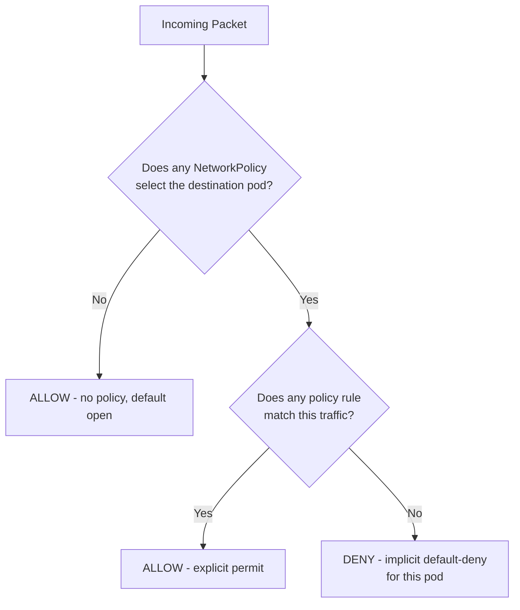
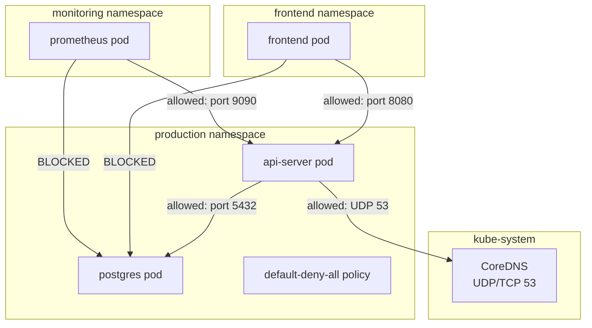

# Kubernetes Network Policies

## Table of Contents

- [Overview](#overview)
- [Default Behavior and Policy Model](#default-behavior-and-policy-model)
- [NetworkPolicy Spec Anatomy](#networkpolicy-spec-anatomy)
- [Default-Deny Patterns](#default-deny-patterns)
  - [Deny All Ingress (Default Deny Ingress)](#deny-all-ingress-default-deny-ingress)
  - [Deny All Egress](#deny-all-egress)
  - [Deny All (Both Directions)](#deny-all-both-directions)
  - [Namespace Isolation Architecture](#namespace-isolation-architecture)
- [Namespace Isolation Patterns](#namespace-isolation-patterns)
  - [Isolate Namespace (Allow Only Internal Traffic)](#isolate-namespace-allow-only-internal-traffic)
  - [Allow Monitoring Namespace to Scrape All Pods](#allow-monitoring-namespace-to-scrape-all-pods)
- [CNI Enforcement Reality](#cni-enforcement-reality)
- [Calico GlobalNetworkPolicy](#calico-globalnetworkpolicy)
- [Cilium L7 NetworkPolicy](#cilium-l7-networkpolicy)
  - [HTTP Path-Level Policy](#http-path-level-policy)
  - [DNS-Based Egress (toFQDNs)](#dns-based-egress-tofqdns)
- [Testing Network Policies](#testing-network-policies)
- [Production Scenario: Missing DNS Egress Rule](#production-scenario-missing-dns-egress-rule)
- [Failure Modes](#failure-modes)
- [Debugging Guide](#debugging-guide)
- [Security Considerations](#security-considerations)
- [Interview Questions](#interview-questions)
  - [Basic](#basic)
  - [Intermediate](#intermediate)
  - [Advanced / Staff Level](#advanced-staff-level)

---

## Overview

By default, Kubernetes allows all pod-to-pod traffic across the entire cluster — any pod can reach any other pod on any port. This is a deliberate design choice (flat networking model) but a significant security liability in multi-tenant clusters. Network Policies are the Kubernetes native mechanism for implementing microsegmentation at the pod level.

**Key insight:** NetworkPolicy is purely declarative specification. The actual packet filtering is performed by the CNI plugin. If your CNI does not support NetworkPolicy (Flannel by default), policies are silently ignored — pods communicate as if no policy exists.

---

## Default Behavior and Policy Model

NetworkPolicy is **additive and opt-in.** When no NetworkPolicy selects a pod, that pod has no firewall — all ingress and egress traffic is allowed.

The moment any NetworkPolicy selects a pod via `podSelector`, enforcement begins for the policy types specified. If an ingress policy selects a pod, only explicitly allowed ingress is permitted; egress remains open (and vice versa).



---

## NetworkPolicy Spec Anatomy

```yaml
apiVersion: networking.k8s.io/v1
kind: NetworkPolicy
metadata:
  name: api-policy
  namespace: backend           # policies are namespace-scoped
spec:
  podSelector:                 # which pods this policy applies to
    matchLabels:
      app: api-server

  policyTypes:                 # which directions are enforced
    - Ingress
    - Egress

  ingress:                     # allowed incoming traffic
    - from:
        - namespaceSelector:   # from pods in namespaces matching this label
            matchLabels:
              environment: prod
          podSelector:         # AND within those namespaces, pods matching this
            matchLabels:
              role: frontend
        - ipBlock:             # OR from this CIDR (external IP range)
            cidr: 10.0.0.0/8
            except:
              - 10.0.1.0/24   # but not this subnet
      ports:
        - protocol: TCP
          port: 8080

  egress:                      # allowed outgoing traffic
    - to:
        - podSelector:
            matchLabels:
              app: postgres
      ports:
        - protocol: TCP
          port: 5432
    - to:                      # allow DNS (always needed)
        - namespaceSelector:
            matchLabels:
              kubernetes.io/metadata.name: kube-system
          podSelector:
            matchLabels:
              k8s-app: kube-dns
      ports:
        - protocol: UDP
          port: 53
        - protocol: TCP
          port: 53
```

**Critical `from` / `to` selector semantics:**
- Multiple entries under `from` are **OR** conditions: `[A, B]` means "from A OR from B"
- `namespaceSelector` + `podSelector` in the same list item are **AND** conditions: "from pods matching podSelector in namespaces matching namespaceSelector"
- `namespaceSelector` and `podSelector` as separate list items are **OR**: "from any pod in matching namespaces OR from any pod matching podSelector in any namespace"

This AND vs OR distinction causes many misconfigured policies.

---

## Default-Deny Patterns

### Deny All Ingress (Default Deny Ingress)

```yaml
apiVersion: networking.k8s.io/v1
kind: NetworkPolicy
metadata:
  name: default-deny-ingress
  namespace: production
spec:
  podSelector: {}     # empty = selects ALL pods in namespace
  policyTypes:
    - Ingress
  # no ingress rules = deny all ingress
```

### Deny All Egress

```yaml
apiVersion: networking.k8s.io/v1
kind: NetworkPolicy
metadata:
  name: default-deny-egress
  namespace: production
spec:
  podSelector: {}
  policyTypes:
    - Egress
  # no egress rules = deny all egress (including DNS!)
```

**Warning:** If you apply default-deny egress without an explicit DNS allow rule, pods cannot resolve any DNS names. This is the most common NetworkPolicy mistake.

### Deny All (Both Directions)

```yaml
apiVersion: networking.k8s.io/v1
kind: NetworkPolicy
metadata:
  name: default-deny-all
  namespace: production
spec:
  podSelector: {}
  policyTypes:
    - Ingress
    - Egress
```

**Recommended baseline:** Apply `default-deny-all` to each namespace, then layer explicit allow policies. Start locked down, add permissions.

### Namespace Isolation Architecture



---

## Namespace Isolation Patterns

### Isolate Namespace (Allow Only Internal Traffic)

```yaml
# Allow all traffic between pods within the same namespace only
apiVersion: networking.k8s.io/v1
kind: NetworkPolicy
metadata:
  name: allow-same-namespace
  namespace: team-a
spec:
  podSelector: {}
  policyTypes:
    - Ingress
  ingress:
    - from:
        - podSelector: {}   # empty podSelector = all pods in same namespace
```

### Allow Monitoring Namespace to Scrape All Pods

```yaml
apiVersion: networking.k8s.io/v1
kind: NetworkPolicy
metadata:
  name: allow-prometheus-scrape
  namespace: production
spec:
  podSelector: {}    # all pods in production namespace
  policyTypes:
    - Ingress
  ingress:
    - from:
        - namespaceSelector:
            matchLabels:
              kubernetes.io/metadata.name: monitoring
          podSelector:
            matchLabels:
              app: prometheus
      ports:
        - port: 9090    # metrics port (varies by app)
        - port: 8080
        - port: 8443
```

---

## CNI Enforcement Reality

NetworkPolicy enforcement is entirely dependent on the CNI plugin:

| CNI Plugin | NetworkPolicy Support | Notes |
|-----------|----------------------|-------|
| Flannel | No (by default) | Policies silently ignored; requires Flannel + Calico policy-only daemon |
| Calico | Yes (full) | iptables or eBPF; also supports GlobalNetworkPolicy |
| Cilium | Yes (L3/L4/L7) | eBPF-based; extends with CiliumNetworkPolicy for L7 and FQDN |
| Weave | Yes | NaCl-encrypted overlay + NetworkPolicy |
| AWS VPC CNI | Yes (with Calico policy) | Need Calico network policy engine add-on; AWS VPC CNI alone does not enforce |
| kindnet | No | Dev/test only |

**Testing CNI enforcement:**

```bash
# Deploy a test pod and verify policy is enforced
kubectl run enforcer-test --image=busybox --rm -it \
  -- wget -O- --timeout=3 http://target-service:8080
# With proper default-deny in place: "Connection refused" or timeout
# Without CNI enforcement: succeeds even with deny policy
```

---

## Calico GlobalNetworkPolicy

Calico extends Kubernetes NetworkPolicy with cluster-wide (non-namespaced) policies that can target pods across all namespaces. `GlobalNetworkPolicy` is evaluated before namespaced NetworkPolicy and can express cross-namespace rules.

```yaml
apiVersion: projectcalico.org/v3
kind: GlobalNetworkPolicy
metadata:
  name: deny-all-egress-to-metadata
spec:
  order: 100              # lower order = higher priority
  selector: all()         # all workloads
  types:
    - Egress
  egress:
    - action: Deny
      destination:
        nets:
          - 169.254.169.254/32   # Block AWS/GCP metadata endpoint
```

**Calico precedence:** GlobalNetworkPolicy (lower order value = higher priority) → Kubernetes NetworkPolicy → GlobalNetworkPolicy (higher order value). The `order` field controls evaluation order within Calico policies.

**Calico HostEndpoint:** Calico can also protect the node itself (not just pods) with `HostEndpoint` resources + GlobalNetworkPolicy. This is how you implement host-level firewall rules that are consistent with pod-level policy.

---

## Cilium L7 NetworkPolicy

Cilium extends policy beyond L3/L4 with L7 awareness via `CiliumNetworkPolicy`:

### HTTP Path-Level Policy

```yaml
apiVersion: cilium.io/v2
kind: CiliumNetworkPolicy
metadata:
  name: api-l7-policy
  namespace: backend
spec:
  endpointSelector:
    matchLabels:
      app: api-server
  ingress:
    - fromEndpoints:
        - matchLabels:
            app: frontend
      toPorts:
        - ports:
            - port: "8080"
              protocol: TCP
          rules:
            http:
              - method: GET
                path: /api/v1/.*   # regex path matching
              - method: POST
                path: /api/v1/users
              # POST to /admin is implicitly denied
```

### DNS-Based Egress (toFQDNs)

```yaml
apiVersion: cilium.io/v2
kind: CiliumNetworkPolicy
metadata:
  name: allow-external-apis
spec:
  endpointSelector:
    matchLabels:
      app: payment-service
  egress:
    - toFQDNs:
        - matchName: api.stripe.com
        - matchPattern: "*.amazonaws.com"   # wildcards supported
      toPorts:
        - ports:
            - port: "443"
              protocol: TCP
```

**How toFQDNs works:** Cilium's DNS proxy intercepts DNS queries from pods. When a pod queries `api.stripe.com`, Cilium sees the response, extracts the IPs, and programs them into eBPF maps dynamically. The egress rule allows traffic to those IPs as long as they were resolved via the approved FQDN. New IPs from DNS updates are added automatically; stale IPs are removed after TTL.

---

## Testing Network Policies

```bash
# Method 1: kubectl exec with curl (simplest)
kubectl exec -n backend api-pod -- curl -s --max-time 3 \
  http://database-service:5432/
# Timeout = blocked; success = allowed

# Method 2: netcat for TCP connectivity
kubectl exec -n backend api-pod -- nc -zv database-service 5432
# "Connection to ... succeeded!" = allowed
# "Connection refused" or timeout = blocked

# Method 3: netshoot debug pod for comprehensive testing
kubectl run netshoot -n backend --image=nicolaka/netshoot --rm -it -- bash
# Inside: curl, nc, nmap, dig, ping all available

# Method 4: Automated policy validation
# Use the Network Policy Editor from Cilium or Calicoctl to validate
# before applying

# Method 5: Cilium policy trace (Cilium-specific)
kubectl exec -n kube-system <cilium-pod> -- \
  cilium policy trace \
  --src-identity <src-identity-id> \
  --dst-identity <dst-identity-id> \
  --dport 5432 --proto TCP
# Output: "Final verdict: ALLOWED" or "Final verdict: DENIED"
# Shows which rule made the decision
```

---

## Production Scenario: Missing DNS Egress Rule

**Alert:** Pods in the `payments` namespace fail to connect to `api.stripe.com` after NetworkPolicy rollout. The policy correctly whitelists stripe.com. But pods cannot resolve the name at all.

**Symptom:**
```
Error: dial tcp: lookup api.stripe.com on 10.96.0.10:53: read udp ... i/o timeout
```

**Root cause:** Default-deny egress was applied, blocking all outgoing traffic including DNS queries to CoreDNS.

**Investigation:**

```bash
# Verify DNS egress is blocked
kubectl exec -n payments <pod> -- nslookup api.stripe.com
# server can't find api.stripe.com: REFUSED or timeout

# vs internal service DNS (also broken)
kubectl exec -n payments <pod> -- nslookup kubernetes.default.svc.cluster.local
# also fails if DNS egress not allowed

# Check what policies apply
kubectl get networkpolicy -n payments -o yaml

# Look for DNS ports in egress rules
kubectl get networkpolicy -n payments -o yaml | grep -A5 "port: 53"
# If nothing: DNS rule is missing
```

**Fix — Add DNS egress rule:**

```yaml
apiVersion: networking.k8s.io/v1
kind: NetworkPolicy
metadata:
  name: allow-dns-egress
  namespace: payments
spec:
  podSelector: {}    # all pods
  policyTypes:
    - Egress
  egress:
    - to:
        - namespaceSelector:
            matchLabels:
              kubernetes.io/metadata.name: kube-system
      ports:
        - protocol: UDP
          port: 53
        - protocol: TCP
          port: 53   # TCP DNS for large responses/AXFR
```

**Why this happens every time:** Engineers test the new service NetworkPolicy in dev (where there is no default-deny), it works, they roll out to prod (which has default-deny), and DNS silently breaks. The connection error looks like a network routing issue, not a DNS issue.

**Additional commonly forgotten rules:**

```yaml
# Pods that call Kubernetes API (operators, controllers)
egress:
  - to:
      - ipBlock:
          cidr: <api-server-ip>/32
    ports:
      - protocol: TCP
        port: 6443

# Pods using AWS services with IMDS (if you want to allow it)
egress:
  - to:
      - ipBlock:
          cidr: 169.254.169.254/32
    ports:
      - protocol: TCP
        port: 80
```

---

## Failure Modes

| Failure | Symptoms | Detection | Fix |
|---------|----------|-----------|-----|
| CNI does not enforce policies | Policies appear to apply but traffic flows freely | `kubectl exec` curl works despite deny policy | Replace CNI with one that enforces: Calico, Cilium |
| Missing DNS egress | Pods cannot resolve any names after egress deny applied | nslookup/dig timeout from pod | Add UDP/TCP port 53 egress to kube-system CoreDNS |
| AND vs OR confusion in selectors | Policy allows more or less traffic than intended | Unexpected connectivity; policy trace shows wrong match | Reread selector semantics; use `cilium policy trace` or `calicoctl policy trace` |
| Default-deny applied to kube-system | System pods (CoreDNS, metrics-server) lose connectivity | Cluster-wide DNS failure | Never apply deny policies to kube-system without careful exemptions |
| Label mismatch | Policy selects no pods; traffic flows freely | `kubectl get pods --show-labels` vs policy selector | Verify exact label key/value match including case |
| Egress to API server blocked | Pods running controllers/operators fail | Controller logs: "connection refused to kube-apiserver" | Add egress rule for API server IP and port 6443 |
| New namespace not isolated | Multi-tenant clusters: new namespace has open traffic | Audit: `kubectl get networkpolicy -A` | Use namespace labels and admission webhook to auto-apply default-deny on namespace creation |

---

## Debugging Guide

```bash
# 1. List all network policies in all namespaces
kubectl get networkpolicy -A

# 2. Describe a specific policy (check selector and rules)
kubectl describe networkpolicy <name> -n <ns>

# 3. Check if any policy selects a specific pod
POD_LABELS=$(kubectl get pod <pod> -n <ns> \
  --show-labels -o jsonpath='{.metadata.labels}')
# Manually compare against policy podSelectors

# 4. Test connectivity from source to destination
kubectl exec -n <src-ns> <src-pod> -- \
  nc -zv <dst-service>.<dst-ns>.svc.cluster.local <port>

# 5. Calico: trace policy decision
calicoctl node status   # verify Calico is running
kubectl exec -n calico-system <calico-node-pod> -- \
  calicoctl policy trace -q \
  --source-ip <src-pod-ip> --dest-ip <dst-pod-ip> --port 8080

# 6. Cilium: real-time flow monitoring
kubectl exec -n kube-system <cilium-pod> -- \
  cilium monitor --type policy-verdict 2>&1 | grep -E "ALLOW|DENY"

# 7. Hubble (Cilium): search dropped flows
hubble observe --verdict DROPPED --namespace <ns>
hubble observe --from-pod <ns>/<pod> --to-pod <ns>/<pod>

# 8. Verify label on namespace (for namespaceSelector)
kubectl get namespace <ns> --show-labels
# K8s 1.21+: namespaces have automatic label:
# kubernetes.io/metadata.name: <ns>
```

---

## Security Considerations

- **Zero-trust baseline.** Apply `default-deny-all` NetworkPolicy to every namespace as the first step. This forces explicit documentation of all allowed communication paths. Security reviews become network policy audits.
- **Namespace labels for namespaceSelector.** K8s 1.21+ automatically labels namespaces with `kubernetes.io/metadata.name: <name>`. Use this label reliably instead of custom labels that teams may forget to apply.
- **Production namespace kube-system.** Never apply unreviewed policies to `kube-system`. CoreDNS, metrics-server, and the CNI plugin all live there. Misconfigured policies here break the entire cluster.
- **IP block rules are fragile.** CIDR-based rules break when IP ranges change. Prefer label-based pod/namespace selectors wherever possible. Use CIDR only for external IPs that cannot be selected by label (e.g., on-prem services, third-party APIs).
- **Calico GlobalNetworkPolicy for cluster-wide security.** Block metadata endpoint (`169.254.169.254`) with a GlobalNetworkPolicy to prevent credential theft via SSRF. Apply as a high-priority global rule so individual namespace policies cannot override it.
- **Cilium toFQDNs for external egress.** IP-based egress rules for external SaaS APIs are brittle (APIs change IPs regularly). Cilium's `toFQDNs` egress is more maintainable and provably correct — it only allows IPs that were actively returned by DNS for the approved domain name.
- **Audit annually.** Unused policies accumulate over time and create a false sense of security. Automate policy compliance checking with Falco NetworkPolicy rules or OPA.

---

## Interview Questions

### Basic

**Q: What happens if you create a NetworkPolicy but your CNI plugin doesn't support enforcement?**
The policy is accepted by the API server (it is just a Kubernetes object) but silently ignored at the network level. All traffic continues to flow freely. This is a critical operational risk — you think you have security controls but you don't. Flannel does not enforce NetworkPolicy by default. Always verify enforcement: create a deny policy, then test with `kubectl exec` that traffic is actually blocked.

**Q: What is the default traffic behavior for a pod with no NetworkPolicy?**
All ingress and egress traffic is allowed. Any pod in the cluster can reach it on any port, and it can initiate connections to any destination. This is the Kubernetes default for simplicity. You must explicitly apply NetworkPolicy to restrict traffic.

**Q: How do you create a default-deny policy for a namespace?**
Apply a NetworkPolicy with empty `podSelector: {}` (selects all pods) and the desired `policyTypes` (Ingress, Egress, or both), with no `ingress` or `egress` rules. The absence of rules with enforcement active means all traffic is denied. Apply both ingress and egress default-deny, then add explicit allow policies for required traffic.

### Intermediate

**Q: Explain the AND vs OR semantics in NetworkPolicy `from` selectors with a concrete example.**
In a `from` list, multiple items are ORed: `[{A}, {B}]` = "from A OR from B." However, within a single item, combining `namespaceSelector` and `podSelector` is ANDed: "from pods matching podSelector in namespaces matching namespaceSelector." Example: `from: [{namespaceSelector: {prod}, podSelector: {app:frontend}}]` = "from frontend pods only in prod namespaces." If you write `from: [{namespaceSelector: {prod}}, {podSelector: {app:frontend}}]` (two separate items), it means "from ANY pod in prod namespaces OR from any frontend pod in ANY namespace" — very different and often a misconfiguration.

**Q: You apply a default-deny egress policy to the `payments` namespace. What other policies must you add for pods to function normally?**
At minimum: (1) DNS egress — allow UDP/TCP port 53 to CoreDNS in kube-system. Without this, pods cannot resolve any service names. (2) Any service-to-service calls — allow egress to the specific pods/services that payment pods need. (3) API server access — if payment pods use the Kubernetes client (e.g., checking config maps), allow egress to the API server IP on port 6443. (4) Health check liveness/readiness probes — kubelet calls these over the pod's network namespace, but this uses localhost, so it is not affected by NetworkPolicy (NetworkPolicy does not affect loopback). (5) External API egress (Stripe, etc.) — allow HTTPS egress to the required external IPs or use Cilium toFQDNs.

**Q: How does Calico GlobalNetworkPolicy differ from standard Kubernetes NetworkPolicy?**
Kubernetes NetworkPolicy is namespace-scoped — it only applies to pods in the same namespace and cannot easily express cross-namespace rules. Calico GlobalNetworkPolicy is cluster-scoped: it can select any pod in any namespace, can target host endpoints (the nodes themselves), supports `order` for rule priority (lower number = higher priority), supports `Deny` action explicitly (K8s NetworkPolicy only has implicit deny via absence of allow), and can apply to all traffic entering/leaving the cluster. Use GlobalNetworkPolicy for cluster-wide security baselines (block metadata endpoint, enforce egress to corporate proxy) that must not be overrideable by namespace-level policies.

### Advanced / Staff Level

**Q: You're auditing a cluster and discover some pods in namespace `payments` can reach pods in namespace `accounting` despite a default-deny policy in `payments`. How do you investigate and fix this?**
Investigation: (1) Verify default-deny is actually applied: `kubectl get networkpolicy -n payments` — confirm `default-deny-all` exists with `podSelector: {}` and both policyTypes. (2) Check if there is a separate ALLOW policy that inadvertently permits the traffic: look for policies in `payments` with `namespaceSelector` that matches `accounting` or `podSelector: {}` (all pods). (3) Check for Calico GlobalNetworkPolicy with allow rules: `kubectl get globalnetworkpolicy` — a cluster-wide allow policy from infra team may override namespace policies. (4) Verify CNI is actually enforcing: test with a known-deny path. (5) Use Cilium policy trace: `cilium policy trace --src-identity <accounting-pod-identity> --dst-identity <payments-pod-identity>`. Fix: If a misconfigured ALLOW policy exists, update it to use specific pod selectors rather than broad selectors. If GlobalNetworkPolicy is overriding, work with the infra team to scope it correctly or add a Calico GlobalNetworkPolicy with lower order that denies the specific cross-namespace path.

**Q: Design a network policy architecture for a multi-tenant SaaS platform where tenants are isolated from each other but share cluster-wide infrastructure services (metrics, logging). How do you prevent tenant A from accidentally or maliciously reaching tenant B?**
Architecture: (1) Each tenant gets a dedicated namespace, labeled `tenant: <tenant-id>`. (2) Apply `default-deny-all` NetworkPolicy to every tenant namespace via a namespace admission webhook (OPA/Kyverno auto-applies it on namespace creation). (3) Apply a standard `allow-dns` policy to every tenant namespace (allow UDP/TCP 53 to kube-system). (4) Use Calico GlobalNetworkPolicy to allow the monitoring namespace to scrape all pods (this is a cluster-wide concern, not per-tenant). (5) Tenants can create their own NetworkPolicies within their namespace but cannot reference other tenant namespaces (enforce via OPA: deny NetworkPolicy with `namespaceSelector` matching other tenant labels unless it matches `monitoring` or `logging`). (6) For truly adversarial multi-tenancy (separate customers), pair NetworkPolicy with separate node pools (`nodeSelector` + taints) and consider mTLS (service mesh) for in-transit encryption, because NetworkPolicy without encryption can still be sniffed by a malicious container that root-escapes its network namespace.
