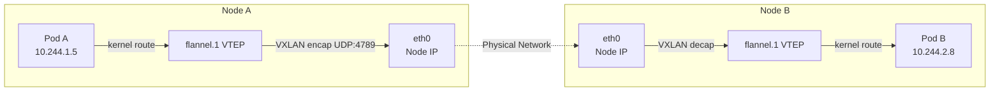
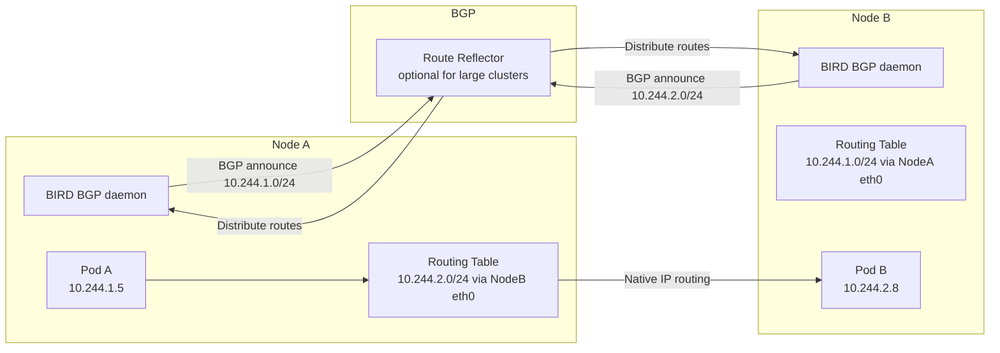
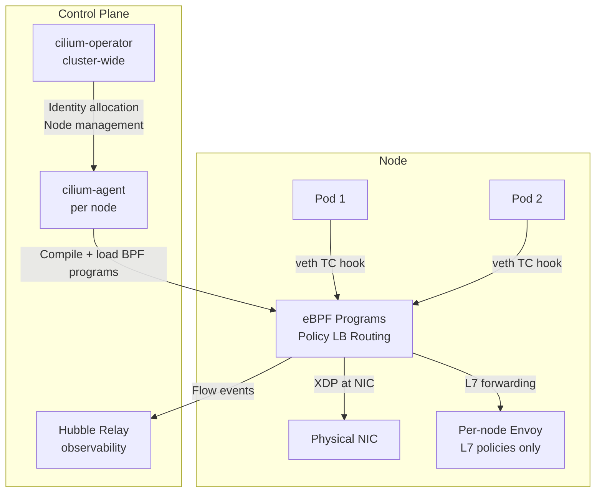

# CNI Plugin Comparison

## Overview

The Container Network Interface (CNI) is the plugin system that Kubernetes delegates all pod networking to. CNI plugins are responsible for: assigning IP addresses to pods, creating virtual interfaces, programming routes between pods on different nodes, and (for capable plugins) enforcing NetworkPolicy. The CNI choice is the single most consequential networking decision in a cluster — it is nearly impossible to change in production without full cluster drain.

---

## CNI Specification

A CNI plugin is an executable binary that responds to three commands from the runtime (`kubelet` via the CNI library):

| Command | Triggered When | Plugin Must |
|---------|---------------|------------|
| `ADD` | Pod created | Assign IP, create veth pair, configure routes, return IP in JSON |
| `DEL` | Pod deleted | Remove IP assignment, delete veth pair, clean up routes |
| `CHECK` | Periodic health check | Verify network config is correct; return error if broken |

**Config format:** JSON file in `/etc/cni/net.d/` that specifies the plugin binary name, IP range, and plugin-specific options. The binary itself lives in `/opt/cni/bin/`.

**Execution model:** When `kubelet` creates a pod, it reads the CNI config, finds the plugin binary, and invokes it with the pod's network namespace path and container ID as environment variables. The plugin does its work (create veth, assign IP, add routes) and returns the assigned IP as JSON. This is how pod IPs get assigned.

---

## Flannel

**Type:** Overlay network (VXLAN mode default, UDP mode legacy)
**NetworkPolicy enforcement:** None (silently ignores policies)
**Philosophy:** Simplicity above all else

### How it Works

Flannel allocates a subnet per node from a cluster-wide CIDR (e.g., node A gets `10.244.1.0/24`, node B gets `10.244.2.0/24`). Each pod gets an IP from its node's subnet.

**VXLAN mode:** Cross-node traffic is encapsulated in UDP/VXLAN packets (port 4789). The `flannel.1` VTEP (VXLAN Tunnel Endpoint) interface on each node handles encap/decap.



**MTU concern:** VXLAN adds 50 bytes of overhead. If physical NIC MTU is 1500, flannel MTU must be 1450. Misconfiguration causes silent packet fragmentation/loss for large payloads.

**When to use Flannel:** Dev/test clusters, situations where simplicity trumps all other concerns. Never for production clusters requiring NetworkPolicy.

---

## Calico

**Type:** BGP native routing (no overlay by default), optional VXLAN/IPIP
**NetworkPolicy enforcement:** Yes (iptables or eBPF data plane)
**Philosophy:** Performance via native routing, enterprise-grade policy

### BGP Mode (Recommended)

Calico runs a BGP daemon (BIRD) on each node. Each node announces its pod subnet CIDR via BGP to peers. All other nodes learn routes to each other's pod subnets directly. **No encapsulation overhead** — packets use native IP routing.



**Requirement:** The physical network must allow packets with pod CIDR source IPs. On cloud providers, disable source/destination check. On-prem, peer BIRD with ToR switches or ensure pod CIDRs are routable.

**BGP full mesh vs route reflectors:** With n nodes, full mesh BGP = O(n²) sessions. At 100+ nodes, use route reflectors (2+ for HA) where each node peers only with reflectors.

### IPIP / VXLAN Mode

When the underlay cannot route pod CIDRs (cloud providers with anti-spoofing), Calico can use IPIP (IP-in-IP, 20 bytes overhead) or VXLAN overlay. IPIP is commonly used for cross-subnet traffic while keeping native routing within the same subnet.

### Calico eBPF Data Plane

Calico 3.13+ supports an eBPF data plane that replaces iptables with BPF maps. Provides O(1) policy enforcement like Cilium but retains Calico's proven BGP control plane (Felix + BIRD). Enable with:
```bash
calicoctl patch felixconfiguration default \
  --patch='{"spec": {"bpfEnabled": true}}'
```

### Felix and BIRD Components

- **Felix:** The Calico agent on each node. Watches for NetworkPolicy and pod changes, programs iptables rules (or BPF maps) accordingly. Also manages IPIP tunnel endpoints.
- **BIRD:** The BGP routing daemon embedded in the `calico-node` container. Exchanges pod subnet routes with peers. If BIRD fails, BGP sessions drop and cross-node routing fails.
- **Calico operator / calico-kube-controllers:** Watches for node and endpoint changes, syncs to Calico's datastore.

---

## Cilium

**Type:** eBPF-native, no iptables, optional kube-proxy replacement
**NetworkPolicy enforcement:** Yes (L3/L4/L7 via BPF maps + per-node Envoy)
**Philosophy:** eBPF as the universal data plane for networking, security, and observability

### Architecture



**Identity-based security:** Cilium assigns each pod a numeric identity based on its labels. BPF maps encode allow/deny rules as identity pairs. When Pod A (identity 1234) sends a packet to Pod B (identity 5678), the TC BPF program on Pod B's veth looks up `(1234, 5678, port 8080)` in the BPF policy map — O(1) regardless of policy count.

**kube-proxy replacement:** Cilium can fully replace kube-proxy, handling ClusterIP DNAT via a BPF map lookup at the pod veth hook. No iptables rules at all. Service load balancing uses Maglev consistent hashing.

**XDP acceleration:** For certain traffic patterns (NodePort, ExternalIP), Cilium attaches BPF programs at the XDP hook — early packet processing at the NIC driver level, before sk_buff allocation. This provides near line-rate load balancing.

---

## Weave

**Type:** VXLAN overlay with optional NaCl encryption
**NetworkPolicy enforcement:** Yes
**Status:** Being deprecated (Weaveworks shutdown in 2023; community forks exist but not recommended for new deployments)

Weave is notable for its auto-discovery mechanism (peers find each other via gossip protocol, no external config) and built-in encryption. Not recommended for new clusters — use Cilium with WireGuard for encrypted networking.

---

## AWS VPC CNI

**Type:** Native VPC networking (no overlay)
**NetworkPolicy enforcement:** Requires Calico network policy engine add-on
**Philosophy:** Pod IPs are real VPC IPs — native AWS routing

### How it Works

The AWS VPC CNI assigns secondary IPs from the node's ENI (Elastic Network Interface) to pods. Each pod IP is a real VPC IP — pods appear as first-class VPC hosts. No encapsulation, no overlay. AWS routing tables handle pod-to-pod traffic natively.

**ENI warm pool:** The plugin pre-allocates IPs to minimize pod startup latency. Each EC2 instance type has a limit on ENIs and secondary IPs (e.g., m5.large: 3 ENIs × 10 IPs = 30 pods max).

**NetworkPolicy:** AWS VPC CNI does not enforce NetworkPolicy. For enforcement, install Calico network policy engine in policy-only mode (uses Calico's iptables/eBPF enforcement without Calico's networking).

---

## Feature Matrix

| Feature | Flannel | Calico (iptables) | Calico (eBPF) | Cilium | AWS VPC CNI |
|---------|---------|-------------------|---------------|--------|-------------|
| NetworkPolicy | No | Yes | Yes | Yes (L3/L4/L7) | No (needs Calico addon) |
| Overlay | VXLAN | Optional | Optional | Optional | No |
| Native routing | No | Yes (BGP) | Yes (BGP) | Yes (direct) | Yes (VPC) |
| BGP peering | No | Yes | Yes | No (Cilium routes) | No |
| kube-proxy replacement | No | No | Partial | Yes | No |
| L7 policies | No | No | No | Yes | No |
| FQDN-based egress | No | No | No | Yes | No |
| Built-in observability | No | No | No | Yes (Hubble) | No |
| WireGuard encryption | No | Yes | Yes | Yes | No |
| Kernel requirement | 3.x+ | 3.x+ | 5.3+ | 4.19+ (5.4+ recommended) | 4.14+ |
| Complexity | Low | Medium | High | High | Low |
| Production maturity | High | High | Medium | High | High (AWS) |

---

## CNI Packet Path Comparison

```mermaid
graph TB
    subgraph Flannel VXLAN
        FA[Pod A] -->|veth| FB[cni0 bridge]
        FB -->|VXLAN encap| FC[flannel.1 VTEP]
        FC -->|UDP 4789| FD[Physical NIC]
        FD -->|Physical| FE[Remote Node flannel.1]
        FE -->|VXLAN decap| FF[cni0 bridge]
        FF -->|veth| FG[Pod B]
    end

    subgraph Calico BGP
        CA[Pod A] -->|veth| CB[Routing Table\nBGP routes]
        CB -->|Native IP| CC[Physical NIC]
        CC -->|Physical network| CD[Remote Node NIC]
        CD -->|Routing Table| CE[veth]
        CE --> CF[Pod B]
    end

    subgraph Cilium eBPF
        XA[Pod A] -->|veth TC BPF\nPolicy check + DNAT| XB{Direct\nor VXLAN?}
        XB -->|Direct routing| XC[Physical NIC]
        XB -->|Geneve tunnel| XC
        XC --> XD[Remote Node\nveth TC BPF\nPolicy check]
        XD --> XE[Pod B]
    end
```



---

## Migration: Flannel to Calico (Zero-Downtime)

Migrating CNIs is risky because it changes pod networking cluster-wide. The safest path:

**Phase 1: Parallel Installation (Overlay Mode)**

```bash
# 1. Remove Flannel from the cluster (do NOT drain pods yet)
kubectl delete -f https://raw.githubusercontent.com/flannel-io/flannel/master/Documentation/kube-flannel.yml

# 2. Install Calico in VXLAN mode (same overlay as Flannel, compatible)
# This ensures existing pods keep connectivity during transition
kubectl create -f https://raw.githubusercontent.com/projectcalico/calico/v3.27.0/manifests/calico.yaml
# Set CALICO_IPV4POOL_VXLAN=Always in the calico-node DaemonSet

# 3. Wait for all Calico pods to be Running
kubectl rollout status daemonset/calico-node -n kube-system
```

**Phase 2: Node-by-Node Migration**

```bash
# For each node:
# 1. Cordon the node
kubectl cordon <node>

# 2. Drain the node (graceful pod migration)
kubectl drain <node> --ignore-daemonsets --delete-emptydir-data

# 3. Clean up Flannel artifacts on the node (SSH to node)
ip link delete flannel.1
rm -rf /var/lib/cni/flannel
rm -rf /var/lib/cni/networks/cbr0

# 4. Restart kubelet to reinitialize with Calico CNI
systemctl restart kubelet

# 5. Uncordon
kubectl uncordon <node>
# Pods rescheduled get Calico IPs; verify connectivity
```

**Phase 3: Enable BGP (After Full Migration)**

```bash
# Once all nodes run Calico in VXLAN mode, switch to BGP:
# 1. Disable VXLAN: update CALICO_IPV4POOL_VXLAN to Never
# 2. Enable BGP: ensure CALICO_IPV4POOL_IPIP is set appropriately
# 3. Calico will gracefully transition routing mode without pod restart
```

**Gotchas:**
- Pod CIDR range must be compatible between Flannel and Calico — both must use the same CIDR
- Existing pods retain Flannel IPs during transition; new pods after CNI swap get Calico IPs; brief period where both exist is fine
- NetworkPolicy enforcement begins immediately when Calico takes over — ensure you don't have default-deny policies waiting to activate
- Check for MTU differences between Flannel (1450) and Calico VXLAN (1450) — should be consistent

---

## Production Scenario: Migrating from Flannel to Calico

**Context:** 100-node production cluster running Flannel. Team needs NetworkPolicy enforcement for PCI compliance audit. Cannot afford scheduled downtime.

**Risk assessment:**
- Flannel removal breaks current pod networking briefly during CNI plugin swap on each node
- Calico VXLAN mode uses the same UDP port 4789 as Flannel — potential conflict during parallel run
- Mitigation: Remove Flannel DaemonSet first (so no new Flannel setup happens), then install Calico, then drain nodes one by one

**Verification at each step:**

```bash
# After installing Calico, verify new pods get Calico IPs
kubectl run test-pod --image=busybox --rm -it -- ip addr
# Should show 10.244.x.x from Calico IPAM, not Flannel IPAM

# Verify cross-node connectivity
kubectl exec test-pod-on-node-a -- ping <pod-ip-on-node-b>

# Verify no NetworkPolicy is accidentally blocking traffic
kubectl get networkpolicy -A
# If any policies exist, ensure they have explicit DNS allow rules
```

---

## Failure Modes

| Failure | Symptoms | Detection | Fix |
|---------|----------|-----------|-----|
| Flannel MTU mismatch | Large TCP transfers hang; ICMP ping works | `ping -M do -s 1400` fails; tcpdump shows fragmentation | Set flannel MTU to physical MTU minus 50 (VXLAN overhead) |
| Calico BGP session down | Cross-node pod connectivity fails; same-node works | `birdcl show protocols` status not "Established" | Check TCP 179 firewall rules; verify node IPs are reachable |
| Calico Felix crash | New pods get no NetworkPolicy rules | `kubectl get pods -n calico-system`; Felix pod CrashLoopBackoff | Investigate OOM: increase Felix memory limit; check for iptables lock contention |
| Cilium identity allocation failure | New pods stuck with "world" identity; policies don't match | `cilium endpoint list` shows identity 0 or "reserved:world" | Check CRD availability; cilium-operator health |
| AWS VPC CNI IP exhaustion | Pods stuck Pending: "failed to allocate IP" | `kubectl describe pod` shows IP allocation error | Add subnets/ENIs; check VPC IP limit per instance type |
| CNI binary missing | All pods fail ContainerCreating | `kubectl describe pod` CNI plugin not found | Deploy CNI DaemonSet; check binary in `/opt/cni/bin/` on node |

---

## Debugging Guide

```bash
# General CNI debugging
# 1. Check CNI config
cat /etc/cni/net.d/*.conflist

# 2. Check CNI binaries
ls /opt/cni/bin/

# 3. Check kubelet CNI logs
journalctl -u kubelet | grep -i cni | tail -50

# Flannel debugging
kubectl get pods -n kube-flannel
kubectl logs -n kube-flannel <flannel-pod>
ip route show  # check flannel.1 routes to other nodes

# Calico debugging
kubectl get pods -n calico-system
# Check Felix status
kubectl exec -n calico-system <calico-node-pod> -- \
  calico-node -felix-live   # check if Felix is healthy

# Check BIRD BGP status
kubectl exec -n calico-system <calico-node-pod> -c calico-node -- \
  birdcl show protocols
kubectl exec -n calico-system <calico-node-pod> -c calico-node -- \
  birdcl show route   # all BGP-learned routes

# Cilium debugging
kubectl get pods -n kube-system -l k8s-app=cilium
cilium status   # overall health
cilium endpoint list   # all endpoints with identity and policy status
cilium bpf lb list    # service load balancing BPF map entries

# Check Cilium connectivity test
cilium connectivity test
```

---

## Security Considerations

- **Flannel has no NetworkPolicy = no zero-trust possible.** If PCI-DSS, HIPAA, or SOC2 require network segmentation, Flannel is disqualifying. Choose Calico or Cilium.
- **Calico BGP TCP 179 must be secured.** BGP peers authenticate with a shared password. Ensure no node can BGP-peer without authentication: configure `BGPPeerPassword` in Calico. Unauthenticated BGP allows route injection attacks.
- **Cilium identity spoofing resistance.** Because policies are identity-based (label-derived), an attacker cannot bypass policy by spoofing an IP. However, if a container can modify its own pod labels (via K8s API access), it can change its identity. Restrict pod label-write RBAC.
- **WireGuard encryption.** Both Calico and Cilium support transparent pod-to-pod encryption via WireGuard. Enable for any cluster that must encrypt east-west traffic in transit (compliance, multi-tenant). Performance overhead is minimal (~5-10% throughput reduction) on modern hardware with kernel WireGuard module.
- **CNI binary integrity.** The CNI binary runs as root with access to host network namespaces. Ensure the binary is signed and stored on read-only storage. Compromising the CNI binary = full host network access.

---

## Interview Questions

### Basic

**Q: What is the CNI specification and why does Kubernetes use it?**
CNI (Container Network Interface) is a simple specification: a JSON config file and a binary that the container runtime invokes with ADD/DEL/CHECK commands. Kubernetes delegates all pod networking to CNI to remain agnostic about the specific networking implementation. Different CNI plugins can provide different capabilities (overlay vs native routing, with/without NetworkPolicy) while all conforming to the same interface that kubelet calls.

**Q: Why doesn't Flannel support NetworkPolicy?**
Flannel is purely a networking plugin — it sets up VXLAN tunnels and assigns IPs but does not implement any packet filtering. NetworkPolicy enforcement requires the CNI plugin to program iptables rules (or BPF programs) to allow/deny traffic between pods. Flannel doesn't do this. Policies are accepted by the API server but Flannel never reads them or acts on them.

**Q: What is the key advantage of Calico BGP mode over VXLAN/Flannel overlay?**
No encapsulation overhead. VXLAN adds 50 bytes per packet, reducing effective MTU and adding CPU work for encap/decap. Calico BGP uses native IP routing — packets travel from source to destination with pod IPs as the actual IP header, no outer wrapping. This provides better throughput, lower latency, and no MTU subtraction. The trade-off: the physical network must allow packets with pod CIDR source IPs, which requires disabling source/dest checks on cloud instances.

### Intermediate

**Q: A pod cannot reach another pod on a different node. Both pods can reach pods on their own node. You're running Calico BGP. Diagnose.**
1. Check BGP session health: `birdcl show protocols` on both nodes — sessions must be "Established." 2. Check routing tables: `ip route show | grep 10.244.x` on Node A — should show a route to Node B's pod CIDR via Node B's IP. 3. Check IP forwarding: `sysctl net.ipv4.ip_forward` = 1 on both nodes. 4. Check iptables FORWARD chain: `iptables -L FORWARD -n -v` — Calico adds accept rules for pod traffic; look for DROP rules that precede them. 5. Check anti-spoofing: on cloud providers (AWS), verify source/destination check is disabled on EC2 instances — cloud security groups drop packets with source IPs not belonging to the instance. 6. Test bidirectionality: if A→B works but B→A fails, check return route on Node B.

**Q: How does Cilium replace kube-proxy and what are the trade-offs?**
Cilium replaces kube-proxy by implementing ClusterIP DNAT in eBPF maps. When a pod connects to a ClusterIP, the TC BPF program intercepts the packet at the veth hook, performs a Maglev hash lookup in `cilium_lb4_services` BPF map, and rewrites the destination to a backend pod IP — all in O(1). Benefits: no iptables, no netfilter lock contention, much better scaling at 10,000+ services. Trade-offs: requires kernel 4.19+ (5.4+ for full feature support), higher operational complexity (new debugging toolchain: cilium CLI, Hubble), higher baseline memory per node (BPF maps + optional per-node Envoy for L7). Cannot use standard `iptables-save` debugging approach.

### Advanced / Staff Level

**Q: You need to choose a CNI for a 500-node cluster on bare metal. The requirements are: NetworkPolicy enforcement, native routing performance (no overlay), WireGuard encryption, and built-in observability. Compare Calico and Cilium for this scenario.**
Both support all requirements, but with different strengths. Calico BGP mode provides native routing through BIRD's BGP daemon peering with ToR switches — well-understood, battle-tested, integrates naturally with existing DC BGP infrastructure. Calico's control plane (Felix) is mature with predictable failure modes. WireGuard support is stable. However, Calico's observability requires additional tooling (no equivalent of Hubble). Calico eBPF mode can replace iptables but is less mature than Cilium's eBPF implementation. Cilium provides all requirements natively: eBPF-native data plane with O(1) policy lookups, WireGuard via `encryption.enabled=true`, and Hubble for real-time flow visibility with service maps. Cilium's kube-proxy replacement is a significant simplification. Trade-off: Cilium requires kernel 5.4+ — verify all bare metal nodes are on RHEL 8.4+ or Ubuntu 20.04+ equivalents. Cilium's control plane is more complex; the debugging toolchain (`cilium`, `hubble`) requires team training. For this scenario, Cilium is the better fit if the team can commit to the operational investment, because the combination of native routing + WireGuard encryption + Hubble observability in a single tool is unmatched. If the team already uses Calico and has BGP expertise, Calico eBPF mode is a valid middle ground.

**Q: Design the Flannel-to-Calico migration for a 200-node production cluster serving a financial application. What is your risk mitigation strategy?**
The migration must avoid any connectivity gap. Strategy: (1) Preparation — inventory all NetworkPolicy objects currently in the cluster (even though Flannel doesn't enforce them, Calico will). Review each policy for missing DNS egress rules. Prepare a rollback plan (reinstall Flannel DaemonSet). (2) Test in staging — perform full migration in a 20-node staging cluster first. Run integration tests and chaos tests (kill pods during migration). (3) Production phase 1 — install Calico in VXLAN mode (same overlay as Flannel, compatible transport). Remove Flannel DaemonSet (do NOT drain pods). Existing pods keep Flannel networking; new pods get Calico. Brief dual-CNI state is acceptable. (4) Node-by-node drain — cordon + drain during maintenance window. Each node takes ~5 minutes. 200 nodes × 5 min = ~16 hours, but can be parallelized 10-20 nodes at a time. After drain, clean up Flannel artifacts (`ip link delete flannel.1`, remove Flannel IPAM state), restart kubelet, uncordon. Verify: test pod on node can reach test pod on another node. (5) Enable NetworkPolicy — after full migration, validate all existing policies work as expected. Start with audit mode (Calico GlobalNetworkPolicy with `action: Log` instead of `action: Deny`) before enforcing. (6) Optional BGP migration — only after full VXLAN migration is stable and team is comfortable with Calico operations.
