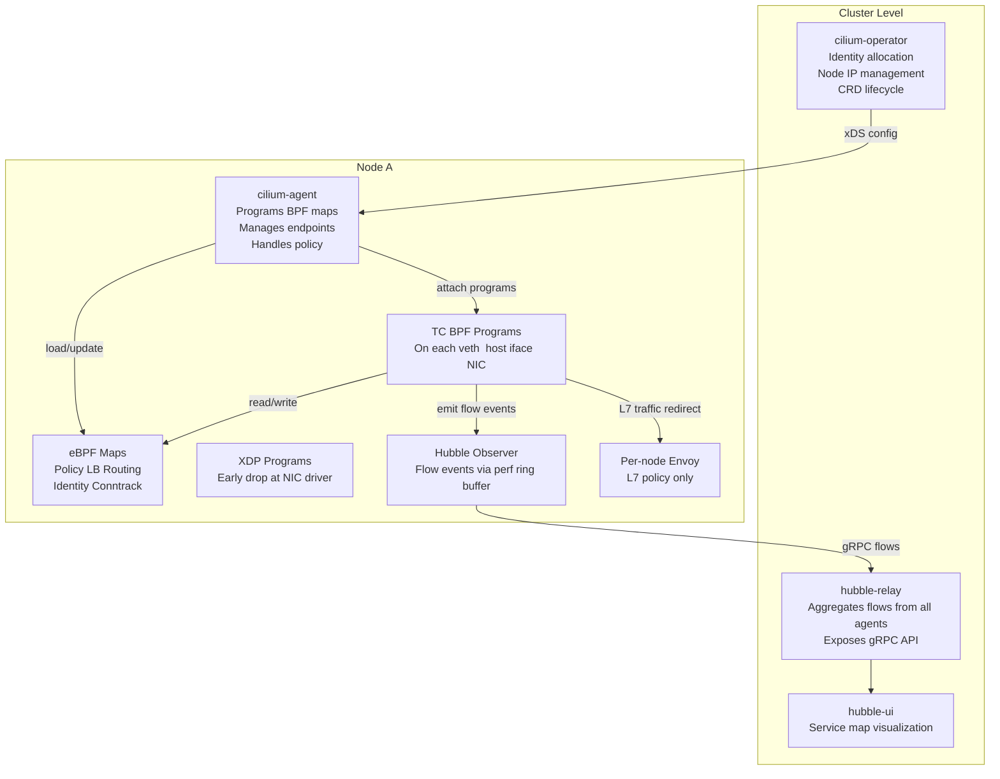
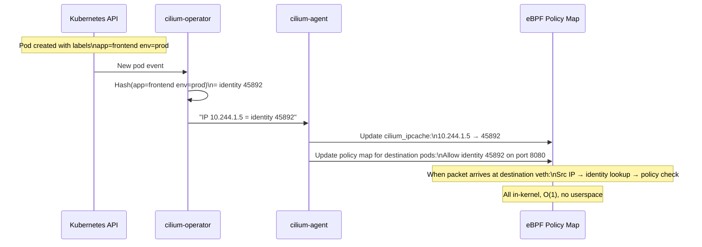

# Cilium and eBPF

## Table of Contents

- [Overview](#overview)
- [Cilium Architecture](#cilium-architecture)
- [eBPF Datapath](#ebpf-datapath)
  - [How Packets Move](#how-packets-move)
  - [XDP Integration](#xdp-integration)
  - [BPF Map Types Used](#bpf-map-types-used)
- [Identity-Based Security](#identity-based-security)
- [CiliumNetworkPolicy](#ciliumnetworkpolicy)
  - [L3/L4 Policy (pod-to-pod)](#l3l4-policy-pod-to-pod)
  - [L7 HTTP Policy](#l7-http-policy)
  - [DNS-Based Egress (toFQDNs)](#dns-based-egress-tofqdns)
- [Hubble: Built-in Observability](#hubble-built-in-observability)
  - [CLI Usage](#cli-usage)
  - [Hubble UI](#hubble-ui)
- [Tetragon: eBPF Runtime Security](#tetragon-ebpf-runtime-security)
- [Cilium Mesh: Sidecarless Service Mesh](#cilium-mesh-sidecarless-service-mesh)
- [Cluster Mesh: Multi-Cluster Networking](#cluster-mesh-multi-cluster-networking)
- [Production Scenario: Cilium Policy Silently Dropping Traffic](#production-scenario-cilium-policy-silently-dropping-traffic)
- [Failure Modes](#failure-modes)
- [Debugging Guide](#debugging-guide)
- [Security Considerations](#security-considerations)
- [Interview Questions](#interview-questions)
  - [Basic](#basic)
  - [Intermediate](#intermediate)
  - [Advanced / Staff Level](#advanced-staff-level)

---

## Overview

Cilium is a CNI plugin, network security enforcement engine, and observability platform built on eBPF (extended Berkeley Packet Filter). It represents a fundamental architectural shift from the traditional approach of using iptables + kube-proxy + a sidecar-based service mesh: Cilium replaces all three with eBPF programs that run in the Linux kernel at near line-rate without userspace overhead.

**The eBPF insight:** Instead of patching the kernel or loading kernel modules (both require kernel version coordination), eBPF lets you inject sandboxed programs into the kernel at runtime. These programs run in verified, JIT-compiled form with access to kernel data structures. Cilium exploits this to implement networking, security, and observability entirely in the kernel — no packet copies to userspace, no iptables rule scanning, no per-pod sidecars.

---

## Cilium Architecture



**cilium-agent:** Runs as a DaemonSet (one per node). Watches K8s API for pod, service, network policy changes. Compiles policy rules into eBPF maps. Attaches TC-BPF programs to pod veth interfaces when pods start. Programs service load balancing BPF maps.

**cilium-operator:** Runs once per cluster (2 replicas for HA). Manages identity allocation (assigns numeric IDs to pod label sets), garbage-collects stale identities, manages `CiliumNode` resources, handles CEL-based admission.

**hubble-relay:** Aggregates flow observations from all node-level Hubble observers into a single gRPC endpoint. The `hubble` CLI connects here for cluster-wide visibility.

---

## eBPF Datapath

### How Packets Move

When Pod A sends a packet to Pod B:

1. Packet exits Pod A's `eth0` into the veth pair
2. TC-BPF program attached to the veth's `tc egress` hook intercepts the packet
3. BPF program performs identity lookup: "What is Pod A's identity?" (BPF map lookup by IP)
4. BPF program checks destination: "Is 10.244.2.5 a service ClusterIP? A pod IP? External?"
5. If service: perform Maglev hash to select a backend pod, rewrite destination IP/port
6. BPF program uses `bpf_redirect_peer()` to forward packet directly to destination veth — bypasses bridge, bypasses the kernel stack, no memory copies
7. TC-BPF program on destination veth's `tc ingress` hook validates the packet identity against the policy map: "Is identity 1234 allowed to reach identity 5678 on port 8080?" — O(1) BPF hash map lookup
8. Packet forwarded to Pod B's `eth0`

For cross-node traffic (Cilium VXLAN or direct routing mode), step 6 sends to the physical NIC instead, and the remote node's TC-BPF program handles policy on arrival.

### XDP Integration

For node-level traffic (NodePort, ExternalIP, load-balanced traffic arriving from outside), Cilium attaches XDP programs at the NIC driver hook — before `sk_buff` allocation, before any kernel stack processing. This enables:
- Near line-rate load balancing (e.g., NodePort at 10Gbps with minimal CPU)
- Early packet drop for policy violations before consuming any CPU
- DDoS protection without userspace involvement

### BPF Map Types Used

| Map Type | Purpose |
|----------|---------|
| `cilium_lxc` | Endpoint (pod) metadata: identity, IP, MAC, interface |
| `cilium_lb4_services` | Service VIP → backend list for IPv4 |
| `cilium_lb4_backends` | Backend pod IP:port entries |
| `cilium_policy_*` | Per-endpoint policy maps: identity pairs → allow/deny |
| `cilium_ct_*` | Connection tracking tables (replaces conntrack for Cilium) |
| `cilium_ipcache` | IP → identity mapping for all pods across the cluster |

---

## Identity-Based Security



**Why identity over IP:** Pod IPs change on every restart. If policy was IP-based, every pod restart would require updating all policy rules across all nodes. With identity (label-hash), the identity is stable — the same label set always maps to the same identity. Policy rules reference identities, not IPs. The `cilium_ipcache` map tracks which IP is currently the holder of each identity.

**Special identities:**
- `reserved:world` (identity 2): traffic from outside the cluster
- `reserved:host` (identity 1): traffic from the node itself (kubelet health checks)
- `reserved:unmanaged` (identity 3): pods not managed by Cilium (rare edge case)
- `reserved:kube-apiserver`: the Kubernetes API server

---

## CiliumNetworkPolicy

### L3/L4 Policy (pod-to-pod)

```yaml
apiVersion: cilium.io/v2
kind: CiliumNetworkPolicy
metadata:
  name: backend-policy
  namespace: backend
spec:
  endpointSelector:
    matchLabels:
      app: api-server

  ingress:
    - fromEndpoints:
        - matchLabels:
            app: frontend
            env: prod
      toPorts:
        - ports:
            - port: "8080"
              protocol: TCP

    # Allow from monitoring namespace
    - fromEndpoints:
        - matchLabels:
            "k8s:io.kubernetes.pod.namespace": monitoring

  egress:
    # Allow to postgres in same namespace
    - toEndpoints:
        - matchLabels:
            app: postgres
      toPorts:
        - ports:
            - port: "5432"
              protocol: TCP

    # Allow DNS
    - toEndpoints:
        - matchLabels:
            "k8s:io.kubernetes.pod.namespace": kube-system
            k8s-app: kube-dns
      toPorts:
        - ports:
            - port: "53"
              protocol: UDP
```

### L7 HTTP Policy

```yaml
spec:
  endpointSelector:
    matchLabels:
      app: api-server
  ingress:
    - fromEndpoints:
        - matchLabels:
            app: frontend
      toPorts:
        - ports:
            - port: "8080"
              protocol: TCP
          rules:
            http:
              - method: GET
                path: /api/v1/.*     # regex
              - method: POST
                path: /api/v1/users
              # POST /admin is not listed = denied
              # Any non-GET/POST is denied
```

### DNS-Based Egress (toFQDNs)

```yaml
spec:
  endpointSelector:
    matchLabels:
      app: payment-service
  egress:
    - toFQDNs:
        - matchName: api.stripe.com
        - matchName: api.twilio.com
        - matchPattern: "*.amazonaws.com"
      toPorts:
        - ports:
            - port: "443"
              protocol: TCP
```

**toFQDNs mechanics:** Cilium runs a DNS proxy that intercepts all pod DNS queries. When `payment-service` queries `api.stripe.com`, Cilium records the response IPs and programs them into the BPF policy map. Traffic is only allowed to IPs that were legitimately returned by DNS for the approved domain name — more precise than static CIDR rules.

---

## Hubble: Built-in Observability

Hubble is Cilium's observability layer — it provides flow-level visibility into all network traffic in the cluster, using eBPF perf ring buffers to export packet metadata without copying the packet content.

### CLI Usage

```bash
# Observe all flows in a namespace
hubble observe --namespace production

# Filter to specific pod
hubble observe --from-pod production/frontend --to-pod production/api

# See only dropped traffic (policy denials)
hubble observe --verdict DROPPED

# HTTP layer visibility
hubble observe --namespace production --protocol http
# Output: flow: request GET /api/v1/users → 200 OK  latency=2.3ms

# Real-time monitoring
hubble observe --follow --namespace production

# Historical flows (if Hubble flow store enabled)
hubble observe --since 10m --verdict DROPPED --namespace production

# Export to JSON for SIEM/analysis
hubble observe -o json | jq '.flow | {src: .source.pod_name, dst: .destination.pod_name, verdict: .verdict}'
```

### Hubble UI

Hubble UI provides a real-time service map showing:
- All pod-to-pod flows as directed edges
- Traffic volume and latency as edge thickness/color
- Policy verdicts (green = allowed, red = dropped) per flow
- HTTP request/response visibility for L7 flows

This makes topology discovery automatic — you can visually confirm which services communicate with each other and identify unexpected connections.

---

## Tetragon: eBPF Runtime Security

Tetragon extends Cilium's eBPF approach to the runtime security domain — syscall-level visibility for detecting host-based attacks.

```yaml
# Example: Detect privileged binary execution
apiVersion: cilium.io/v1alpha1
kind: TracingPolicy
metadata:
  name: detect-sensitive-exec
spec:
  kprobes:
    - call: "sys_execve"
      syscall: true
      args:
        - index: 0
          type: string   # executable path
      selectors:
        - matchArgs:
            - index: 0
              operator: Prefix
              values:
                - "/bin/sh"
                - "/bin/bash"
                - "/usr/bin/python"
      returnCopy: true
```

**Tetragon capabilities:**
- **Process execution:** Alert on unexpected binary executions (shell spawned by web server = RCE indicator)
- **File access:** Alert on reads to `/etc/passwd`, `/etc/shadow`, SSH key files
- **Network connections:** Alert on containers making unexpected outbound connections
- **Capability changes:** Alert on `setuid`, `setgid`, privilege escalation attempts
- **Kill processes:** Tetragon can terminate malicious processes in-kernel before they complete

---

## Cilium Mesh: Sidecarless Service Mesh

Cilium provides service mesh capabilities without deploying Envoy sidecars into pods:

**Encryption:** WireGuard transparent encryption between nodes. All pod-to-pod traffic is encrypted at the network layer — no application changes needed.

```bash
# Enable WireGuard encryption
helm upgrade cilium cilium/cilium \
  --set encryption.enabled=true \
  --set encryption.type=wireguard
```

**mTLS via mutual TLS proxy (cilium-proxy mode):** For workloads needing mTLS with certificate identity rather than just encryption, Cilium can forward traffic through a per-node Envoy instance that performs TLS origination/termination with SPIFFE identities.

**Compared to Istio sidecar:** No per-pod memory overhead (50-100MB per pod saved), no sidecar startup ordering issues, no init container iptables manipulation. Trade-off: less feature-rich than Istio for L7 traffic management (no VirtualService retries, no fault injection via YAML).

---

## Cluster Mesh: Multi-Cluster Networking

Cilium Cluster Mesh connects multiple Kubernetes clusters into a single network:

```bash
# Enable Cluster Mesh (each cluster needs unique cluster ID 1-255)
cilium clustermesh enable --service-type LoadBalancer

# Connect clusters
cilium clustermesh connect --destination-context cluster-b-context

# After connection, services with global annotation are accessible cross-cluster
# annotation: service.cilium.io/global: "true"
```

**Use cases:**
- Active-active multi-cluster deployments (failover between regions)
- Shared services (auth, identity) accessed from multiple clusters
- Blue-green cluster upgrades (migrate traffic from old to new cluster gradually)

---

## Production Scenario: Cilium Policy Silently Dropping Traffic

**Symptom:** Payment service cannot reach the Stripe API. DNS resolves correctly. `curl` hangs after DNS resolution with no error — not "connection refused," just timeout. Recently applied a CiliumNetworkPolicy for the `payments` namespace.

**Investigation:**

```bash
# Step 1: Check if Hubble can see the drop
hubble observe \
  --from-pod payments/payment-service \
  --verdict DROPPED \
  --follow
# If drop appears: shows destination IP and reason code

# Step 2: If Hubble not showing drops, check if traffic exits the pod at all
kubectl exec -n payments payment-service-xxxx -- \
  curl -v --max-time 5 https://api.stripe.com/v1/charges
# Compare: does DNS resolve? Does TCP connect start? Hang at connect = policy drop

# Step 3: Find Stripe's IP to check in policy maps
kubectl exec -n payments payment-service-xxxx -- \
  nslookup api.stripe.com
# Note the IP: e.g., 18.234.32.100

# Step 4: Check if the IP is in Cilium's FQDN policy map
kubectl exec -n kube-system <cilium-pod-on-payments-node> -- \
  cilium bpf fqdn list | grep stripe
# Should show: api.stripe.com → 18.234.32.100
# If missing: FQDN policy isn't intercepting DNS, or DNS was resolved before policy applied

# Step 5: Check egress policy for the endpoint
ENDPOINT_ID=$(kubectl exec -n kube-system <cilium-pod> -- \
  cilium endpoint list | grep payment-service | awk '{print $1}')
kubectl exec -n kube-system <cilium-pod> -- \
  cilium bpf policy get $ENDPOINT_ID

# Step 6: Use policy trace
kubectl exec -n kube-system <cilium-pod> -- \
  cilium policy trace \
  --src-k8s-pod payments/payment-service \
  --dst-ip 18.234.32.100 \
  --dport 443 --proto tcp
# Output: "Final verdict: DROPPED" or "ALLOWED" with the matching rule
```

**Root cause found:** The `toFQDNs` policy exists, but the payment-service pod resolved `api.stripe.com` before the policy was applied (pod started before `CiliumNetworkPolicy` was created). Cilium's DNS proxy only records IPs for queries that pass through it after the policy is applied.

**Fix:**

```bash
# Option 1: Restart the pod so it re-resolves DNS through Cilium's proxy
kubectl rollout restart deployment/payment-service -n payments

# Option 2: Add static CIDR as fallback while FQDN propagates
# (temporary; remove after verifying FQDN policy works)
egress:
  - toCIDR:
      - 18.234.0.0/15   # Stripe's IP range (verify from their docs)
    toPorts:
      - ports:
          - port: "443"
```

**Prevention:** When deploying `toFQDNs` policies, always restart pods after policy application so DNS re-resolution flows through Cilium's DNS proxy. Document this in runbook.

---

## Failure Modes

| Failure | Symptoms | Detection | Fix |
|---------|----------|-----------|-----|
| BPF program not loaded | Policy not enforced; traffic flows freely | `cilium endpoint list` shows "not-ready"; `cilium status` | Restart cilium-agent; check kernel compat (`cilium status --all-controllers`) |
| Identity allocation stuck | New pods stuck with identity 0 or "reserved:world" | `cilium endpoint list` shows identity 0 | Check cilium-operator health; verify CRD API server access |
| FQDN policy miss | External traffic drops after new pod start | `hubble observe --verdict DROPPED` shows WORLD identity drops | Restart pods after applying toFQDNs policy; verify Cilium DNS proxy is intercepting |
| Hubble relay down | `hubble observe` no output | `kubectl get pods -n kube-system -l app.kubernetes.io/name=hubble-relay` | Restart hubble-relay; check connectivity to cilium-agent on each node |
| L7 policy + Envoy crash | HTTP connections accepted then immediately reset | `kubectl logs -n kube-system <cilium-pod>` Envoy errors | Increase Envoy memory limits; check for L7 policy syntax errors |
| WireGuard key rotation fail | Encrypted traffic drops during Cilium upgrade | `cilium node list` shows WireGuard key mismatch | Force WireGuard key refresh: `cilium endpoint regenerate` on affected nodes |
| Cilium upgrade BPF reload | Brief connectivity gap during upgrade | Monitor `hubble observe` during upgrade window | Use Cilium's rolling upgrade with `max_unavailable=1` on DaemonSet |

---

## Debugging Guide

```bash
# Health and status
cilium status                  # overall health
cilium status --all-controllers  # controller-level health (each BPF program)

# Endpoint inspection
cilium endpoint list           # all pods: IP, identity, policy mode
cilium endpoint get <id>       # detailed: labels, policy, BPF program state

# Policy debugging
cilium policy get              # all compiled policies
cilium policy trace \          # simulate policy evaluation
  --src-k8s-pod ns/pod \
  --dst-k8s-pod ns/pod \
  --dport 8080 --proto tcp

# BPF map inspection
cilium bpf lb list             # service load balancing entries
cilium bpf policy get <ep-id> # per-endpoint policy map
cilium bpf ct list global      # connection tracking table
cilium bpf ipcache list        # IP-to-identity cache
cilium bpf fqdn list           # FQDN → IP mappings from DNS proxy

# Hubble observability
hubble observe --namespace production
hubble observe --verdict DROPPED
hubble observe --from-pod ns/pod1 --to-pod ns/pod2 --follow

# Monitor live BPF events
cilium monitor                 # all events
cilium monitor --type drop     # only drops
cilium monitor --type policy-verdict  # policy allow/deny events

# Node-level inspection
cilium node list               # all nodes in cluster mesh
cilium connectivity test       # end-to-end connectivity check (runs test pods)
```

---

## Security Considerations

- **Hubble data sensitivity.** Hubble can expose request metadata (HTTP paths, headers, DNS queries) — treat Hubble access as privileged. Restrict Hubble relay RBAC to security/SRE teams. The Hubble UI should not be publicly exposed.
- **Tetragon for container escape detection.** Deploy Tetragon TracingPolicies to alert on shell execution from containers, file reads in `/proc/*/mem`, and `ptrace` syscalls — common indicators of container escape attempts.
- **CiliumClusterwideNetworkPolicy for security baselines.** Block metadata endpoint globally with a `CiliumClusterwideNetworkPolicy` at high priority. Block intra-cluster traffic to known dangerous targets. These are cluster-wide controls that individual namespace policies cannot override.
- **WireGuard in multi-tenant clusters.** Enable WireGuard encryption for clusters with multiple tenants sharing nodes. Even with NetworkPolicy isolation, without encryption, traffic can be sniffed by a container that has escaped to the host network namespace. WireGuard encrypts all inter-node pod traffic transparently.
- **BPF program pinning = persistence through agent restart.** Cilium's eBPF programs are pinned to `/sys/fs/bpf/`. A cilium-agent crash does not drop existing connections. However, a node reboot clears BPF filesystem mounts, and Cilium must re-load all programs on startup. Ensure node startup is properly ordered (Cilium agent ready before kubelet starts scheduling pods).

---

## Interview Questions

### Basic

**Q: What is eBPF and why does Cilium use it instead of iptables?**
eBPF (extended Berkeley Packet Filter) is an in-kernel virtual machine that runs sandboxed programs at kernel hookpoints. Cilium uses it instead of iptables because: (1) BPF map lookups are O(1) hash tables vs iptables O(n) chain traversal — critical at 10,000+ services/policies; (2) BPF programs attach at the TC hook (or XDP) before netfilter, reducing packet processing overhead; (3) BPF maps persist through agent restarts (pinned to `/sys/fs/bpf/`); (4) BPF enables L7 visibility without userspace copies — just metadata events via perf ring buffers; (5) No iptables lock contention on rule updates.

**Q: What is Hubble and how does it provide observability without overhead?**
Hubble is Cilium's observability layer. It hooks into the same TC-BPF programs that enforce policy. When a packet is processed, the BPF program emits a flow event (source/destination identity, port, verdict, latency) to a perf ring buffer — the packet itself is never copied to userspace. Hubble daemon on each node reads these events from the ring buffer and aggregates them. Flow metadata is available via `hubble observe` CLI or the Hubble UI service map. The overhead is approximately 1-2% CPU for the flow event emission, much less than tcpdump or sidecar-based observability.

**Q: What is Tetragon and how does it differ from traditional runtime security tools (Falco)?**
Tetragon uses eBPF kprobes to attach to kernel functions (execve, open, connect, etc.) and enforces security policies at the kernel level — it can kill a process or block a syscall before it completes. Traditional tools like Falco also use eBPF/kernel modules for visibility but are primarily alerting tools (they detect and notify, not enforce). Tetragon can both detect and prevent: it can terminate a shell spawned from a web container or block a container from connecting to an unexpected IP, in-kernel, without the process completing the action.

### Intermediate

**Q: Explain how Cilium's identity-based policy prevents IP spoofing attacks.**
A pod cannot claim a different identity by spoofing a source IP. The identity for a packet arriving at a destination is looked up from the `cilium_ipcache` BPF map, which maps IP addresses to their identity as tracked by the Cilium control plane. A pod cannot change what identity its IP maps to — that mapping is set by the cilium-agent based on the pod's actual labels in the Kubernetes API. Even if an attacker spoofs a source IP from a trusted pod, the attacker's own container's veth TC-BPF program would have already stamped the actual identity before the packet leaves. Cilium uses the identity embedded in the encapsulation header (VXLAN/Geneve) or verified via cryptographic means (WireGuard) for cross-node traffic, not just the IP.

**Q: A CiliumNetworkPolicy with `toFQDNs` for `api.stripe.com` is applied, but payments still fail. `nslookup` resolves correctly from the pod. Diagnose.**
Cilium's `toFQDNs` requires that DNS queries pass through Cilium's DNS proxy so it can record the IP-to-FQDN mapping. If the pod resolved `api.stripe.com` before the policy was applied (e.g., pod started before policy, or policy was re-applied after DNS was cached), Cilium never saw the DNS response and hasn't added the resolved IP to the allowed set. Fix: (1) Check `cilium bpf fqdn list | grep stripe` — if empty, the DNS proxy hasn't seen the query. (2) Restart the pod to force re-resolution through the proxy. (3) Verify Cilium's DNS proxy is actually intercepting: `kubectl exec pod -- dig api.stripe.com @10.96.0.10` and check `cilium monitor --type dns` for the intercept event.

### Advanced / Staff Level

**Q: Compare Cilium's kube-proxy replacement with traditional kube-proxy in terms of failure modes and observability.**
Traditional kube-proxy: iptables rules are in the kernel. kube-proxy crash leaves existing rules intact (existing connections work) but new rules aren't added (scaling/rollouts break). Rules are stored in iptables chains — inspectable via `iptables-save`. Failures are often visible as missing iptables entries. kube-proxy's `syncPeriod` means there's always a window where rules lag behind reality. Cilium kube-proxy replacement: BPF maps are updated atomically by cilium-agent. No iptables rules — debugging requires `cilium bpf lb list` and understanding BPF map formats. Cilium agent crash leaves BPF programs/maps in place (pinned), so existing connections and existing LB state survive agent restart. New service changes are queued and applied when agent recovers. Observability: `cilium service list` shows all services and their BPF backends. `cilium bpf lb list` shows the actual map state. Hubble can trace individual packets through the LB decision. Failure mode difference: Cilium failure is usually "agent is down, can't apply new changes" vs kube-proxy failure which can cause partial rule sets on specific nodes due to iptables lock contention during high churn.

**Q: Design the observability strategy for a 1000-pod Cilium-based cluster to detect both network anomalies and runtime security incidents.**
Layer 1 — Flow-level network observability (Hubble): Export all Hubble flows to a SIEM (Splunk/Elastic) via Hubble relay's gRPC API. Alert on: new unexpected source→destination pairs (lateral movement detection), sustained DROPPED flows (misconfigured policies), DNS queries to newly registered domains (beaconing), high-volume flows to external IPs (data exfiltration). Use Hubble UI for interactive investigation. Layer 2 — Policy compliance monitoring: Run `cilium monitor --type policy-verdict` log stream; alert on unexpected DENY verdicts from services that should have access (indicates policy regression). Layer 3 — Runtime security (Tetragon): Deploy TracingPolicies for: shell execution in containers (`execve` with path prefix `/bin/sh`), reads of sensitive files (`/etc/shadow`, `~/.ssh/`), network connections from non-network processes (e.g., python interpreter connecting out), privilege escalation (`setuid`). Feed Tetragon events to the SIEM with pod/namespace context for correlation. Layer 4 — Performance metrics: Expose Cilium Prometheus metrics (`cilium_endpoint_count`, `cilium_policy_enforcement_status`, BPF map fill ratios) to Grafana. Alert on identity allocation failures, BPF map near-full conditions. This provides defense-in-depth: Hubble catches network anomalies, Tetragon catches host-level attacks, metrics catch infrastructure health issues.
