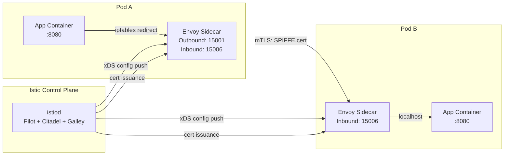
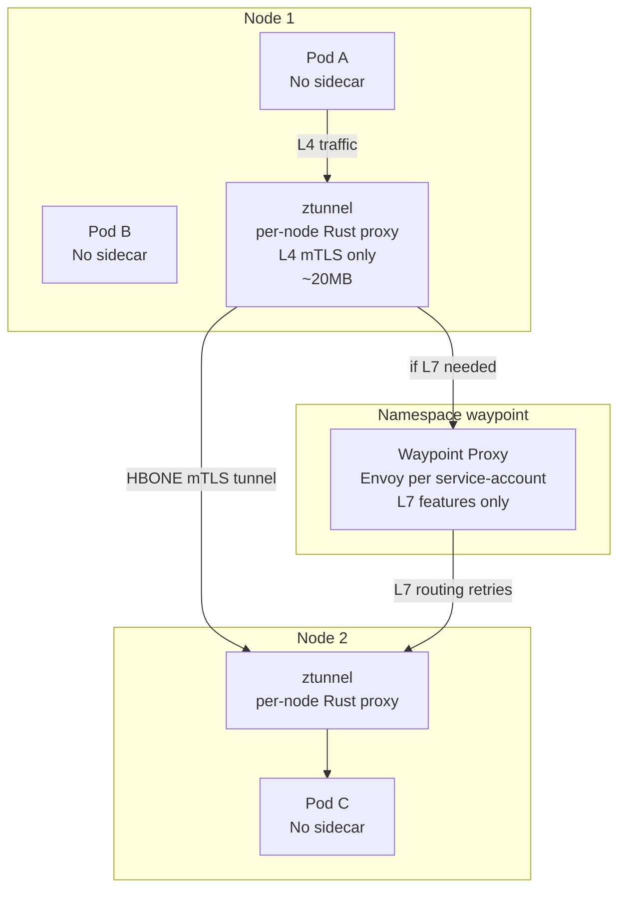
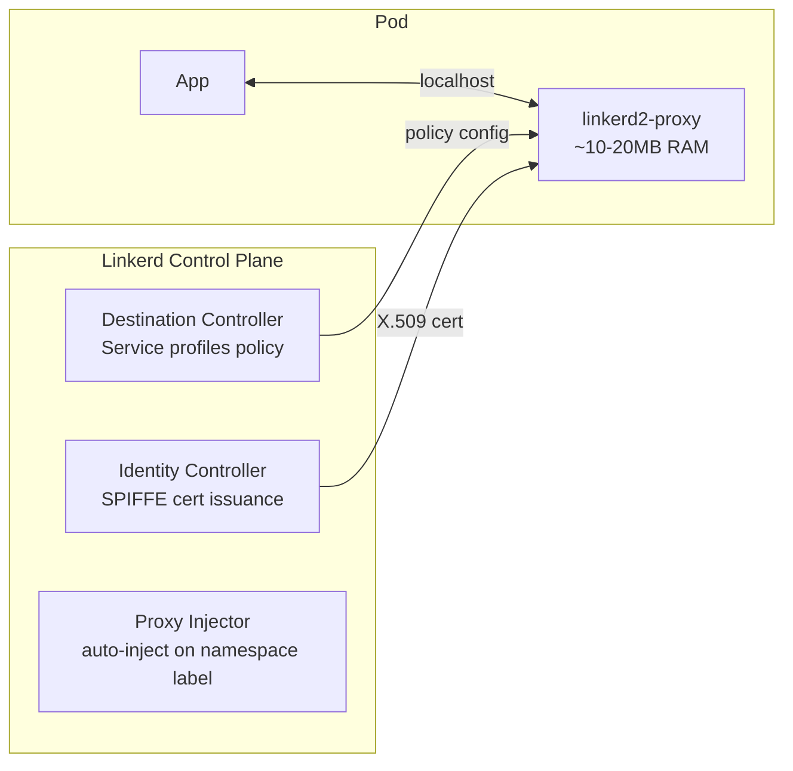

# Service Mesh

## Overview

A service mesh solves a specific problem: as organizations decompose monoliths into microservices, the cross-cutting concerns that were once handled by a single runtime (retries, timeouts, circuit breaking, encryption, distributed tracing) become distributed across dozens or hundreds of services. Embedding this logic in every service via language-specific libraries creates versioning hell and language lock-in.

**The service mesh answer:** Externalize these concerns into an infrastructure layer that intercepts all service-to-service traffic transparently, without application code changes.

**Why now:** In 2025, 47% of K8s production organizations use a service mesh (up from 28% in 2023). The primary drivers are: (1) zero-trust security mandates requiring mTLS everywhere, (2) observability requirements for distributed tracing without instrumentation, (3) canary and progressive delivery workflows requiring fine-grained traffic splitting.

---

## The Sidecar Model

The traditional service mesh intercepts traffic by injecting an Envoy proxy as a sidecar container into every application pod. iptables rules redirect all traffic through the sidecar.



**Traffic interception mechanics:** An init container (`istio-init`) runs before the application container and sets iptables rules:
- All outbound traffic (except control plane) is redirected to Envoy's outbound listener on port 15001
- All inbound traffic is redirected to Envoy's inbound listener on port 15006
- The application pod is completely unaware — it connects to `service-b:8080` as normal

**Sidecar resource overhead:**
- Envoy (Istio): ~50-100MB memory, 0.1-0.5 vCPU per pod
- linkerd2-proxy (Linkerd): ~10-20MB memory, 0.01-0.1 vCPU per pod
- At 500 pods: Istio adds 25-50GB cluster RAM; Linkerd adds 5-10GB

**Sidecar lifecycle issues:**
- **Startup race:** Application starts, tries to connect before Envoy is ready → fix: `holdApplicationUntilProxyStarts: true`
- **Shutdown race:** Pod gets SIGTERM, Envoy exits, application tries to close connections → in-flight requests dropped → fix: `terminationDrainDuration` (default 5s, set to match longest request timeout)
- **Job/batch:** Sidecar keeps pod Running after main container exits → fix: Istio's ambient mode, or use `shareProcessNamespace: true` + lifecycle hook to kill Envoy when job exits

---

## Istio Architecture

### Control Plane: Istiod

Istiod is a unified binary that combines three previously separate components:

| Original Component | Function | Now in Istiod |
|-------------------|----------|--------------|
| Pilot | Traffic management: translates VirtualService/DestinationRule to xDS | Yes |
| Citadel | Certificate management: SPIFFE/X.509 cert issuance and rotation | Yes |
| Galley | Configuration validation and distribution | Yes |

Istiod communicates with proxies via the xDS (x Discovery Service) protocol — a gRPC-based API where proxies subscribe to configuration streams (LDS, CDS, EDS, RDS) and receive updates pushed by the control plane.

### Data Plane: Envoy

Envoy's internal structure is critical for debugging Istio issues:

| Envoy Concept | Maps to Istio | Debug Command |
|--------------|--------------|--------------|
| Listeners | Entrypoints for traffic (15001 outbound, 15006 inbound) | `istioctl proxy-config listener` |
| Routes | HTTP routing rules from VirtualService | `istioctl proxy-config route` |
| Clusters | Backend service groups from DestinationRule | `istioctl proxy-config cluster` |
| Endpoints | Individual pod IPs from EndpointSlices | `istioctl proxy-config endpoint` |

---

## Istio Traffic Management

### VirtualService

VirtualService defines routing rules for traffic to a service. It is applied at the source-side Envoy proxy.

```yaml
apiVersion: networking.istio.io/v1
kind: VirtualService
metadata:
  name: reviews
  namespace: bookinfo
spec:
  hosts:
    - reviews.bookinfo.svc.cluster.local
  http:
    # Header-based routing (canary users)
    - match:
        - headers:
            x-canary-user:
              exact: "true"
      route:
        - destination:
            host: reviews.bookinfo.svc.cluster.local
            subset: v3
          weight: 100

    # Weighted traffic splitting (5% canary)
    - route:
        - destination:
            host: reviews.bookinfo.svc.cluster.local
            subset: v2
          weight: 95
        - destination:
            host: reviews.bookinfo.svc.cluster.local
            subset: v3
          weight: 5
      timeout: 5s
      retries:
        attempts: 3
        perTryTimeout: 2s
        retryOn: 5xx,reset,connect-failure
```

### DestinationRule

DestinationRule defines policies applied to traffic after routing — connection pool limits, circuit breaking, TLS mode, and load balancing algorithm.

```yaml
apiVersion: networking.istio.io/v1
kind: DestinationRule
metadata:
  name: reviews
spec:
  host: reviews.bookinfo.svc.cluster.local
  trafficPolicy:
    loadBalancer:
      simple: LEAST_REQUEST
    connectionPool:
      tcp:
        maxConnections: 100
      http:
        http2MaxRequests: 1000
        maxRequestsPerConnection: 10
    outlierDetection:           # circuit breaker
      consecutiveGatewayErrors: 5
      interval: 30s
      baseEjectionTime: 30s
      maxEjectionPercent: 50
  subsets:
    - name: v2
      labels:
        version: v2
    - name: v3
      labels:
        version: v3
      trafficPolicy:
        connectionPool:
          http:
            http2MaxRequests: 200   # override for canary
```

**Critical ordering rule:** When adding subsets, always update DestinationRule first, wait for propagation, then update VirtualService to reference the new subsets. If VirtualService references a subset before it exists in DestinationRule, Envoy returns 503.

### ServiceEntry

ServiceEntry adds external services (outside the mesh) to the mesh's service registry, enabling traffic management and mTLS to external endpoints.

```yaml
apiVersion: networking.istio.io/v1
kind: ServiceEntry
metadata:
  name: stripe-external
spec:
  hosts:
    - api.stripe.com
  ports:
    - number: 443
      name: https
      protocol: HTTPS
  location: MESH_EXTERNAL
  resolution: DNS
```

---

## Istio Security

### PeerAuthentication (mTLS)

PeerAuthentication configures the mTLS mode for the mesh.

```yaml
# Mesh-wide strict mTLS (apply to istio-system namespace for global effect)
apiVersion: security.istio.io/v1
kind: PeerAuthentication
metadata:
  name: default
  namespace: istio-system
spec:
  mtls:
    mode: STRICT   # reject plaintext connections

# Per-namespace, with port-level exception for health checks
---
apiVersion: security.istio.io/v1
kind: PeerAuthentication
metadata:
  name: backend-mtls
  namespace: backend
spec:
  mtls:
    mode: STRICT
  portLevelMtls:
    8080:
      mode: PERMISSIVE   # health check endpoint allows plaintext (from kubelet)
```

**Modes:**
- `STRICT`: only mTLS connections accepted; plaintext rejected
- `PERMISSIVE`: both mTLS and plaintext accepted (migration mode)
- `DISABLE`: plaintext only; mTLS disabled

**Migration strategy:** Start `PERMISSIVE` → monitor Kiali for plaintext connections → fix non-mesh services → switch to `STRICT`.

### AuthorizationPolicy

AuthorizationPolicy is Istio's L7 firewall — allow/deny based on source service identity, HTTP method, path, and custom headers.

```yaml
# Deny-all baseline (apply first to every namespace)
apiVersion: security.istio.io/v1
kind: AuthorizationPolicy
metadata:
  name: deny-all
  namespace: backend
spec: {}   # empty spec = deny all to this namespace

---
# Allow frontend to call API
apiVersion: security.istio.io/v1
kind: AuthorizationPolicy
metadata:
  name: allow-frontend-api
  namespace: backend
spec:
  selector:
    matchLabels:
      app: api-server
  action: ALLOW
  rules:
    - from:
        - source:
            principals:
              - "cluster.local/ns/frontend/sa/frontend-service-account"
            namespaces:
              - frontend
      to:
        - operation:
            methods: ["GET", "POST"]
            paths: ["/api/v1/*"]
      when:
        - key: request.headers[x-request-id]
          notValues: [""]   # require trace header
```

**SPIFFE principals:** The `principals` field references the service account's SPIFFE ID in the format `cluster.local/ns/<namespace>/sa/<service-account>`. Istio's Citadel issues X.509 certs with this SPIFFE URI as the Subject Alternative Name. This is cryptographic identity — not IP-based.

---

## Istio Ambient Mode: Sidecarless

Ambient mode eliminates sidecars while preserving mesh capabilities by splitting the data plane into two layers:



**ztunnel (zero-trust tunnel):** Lightweight per-node Rust proxy (~20MB) that handles:
- mTLS for all pod-to-pod traffic on the node (HBONE: HTTP/2-based overlay)
- L4 AuthorizationPolicy enforcement
- Basic telemetry (L4 metrics, connection metadata)

**Waypoint proxy:** Optional per-namespace or per-service-account Envoy deployment for L7 features:
- HTTP routing (VirtualService-style)
- L7 AuthorizationPolicy (method/path filtering)
- Retries, timeouts, circuit breaking
- Deploy only for services that need L7: `istioctl waypoint apply --namespace <ns>`

**Resource comparison (500-pod cluster):**

| Mode | Additional Memory | Additional CPU |
|------|-----------------|----------------|
| Sidecar | 25-50GB (50-100MB × 500 pods) | 50-250 vCPU |
| Ambient | ~1GB (ztunnel × nodes + waypoints) | ~5-10 vCPU |

---

## Linkerd

Linkerd is the lightweight alternative to Istio. It uses a purpose-built Rust proxy (`linkerd2-proxy`) rather than Envoy:



**Key differences from Istio:**

| Aspect | Istio | Linkerd |
|--------|-------|---------|
| Proxy | Envoy (C++) | linkerd2-proxy (Rust) |
| Memory per proxy | 50-100MB | 10-20MB |
| Config CRDs | VirtualService, DestinationRule, etc. | ServiceProfile (simpler) |
| L7 features | Extensive | Retries, timeouts, splitting |
| Debug interface | `istioctl`, Kiali | `linkerd viz`, Buoyant Cloud |
| mTLS default | Opt-in | On by default |
| Multi-cluster | Primary-Remote, Multi-Primary | Service mirroring |
| WASM extensions | Yes | No |

**When to choose Linkerd:** Teams that want "the mesh just works" — mTLS by default, zero configuration security, minimal overhead. Linkerd's opinionated simplicity is a feature.

---

## SPIFFE / SPIRE

SPIFFE (Secure Production Identity Framework For Everyone) is the identity standard underlying all modern service meshes.

**Core concepts:**
- **SPIFFE ID:** `spiffe://trust-domain/path` — e.g., `spiffe://example.com/ns/frontend/sa/frontend-sa`
- **SVID (SPIFFE Verifiable Identity Document):** The credential carrying the SPIFFE ID — either an X.509 certificate (X509-SVID) or a JWT (JWT-SVID)
- **SPIRE:** The reference SPIRE implementation: SPIRE Server (CA) + SPIRE Agent (per node, attests workloads)

**How Istio uses SPIFFE:**
1. Istiod's Citadel component acts as the CA
2. When a pod starts, the sidecar requests a cert via the local Citadel agent
3. The cert's Subject Alternative Name (SAN) contains the SPIFFE ID: `spiffe://cluster.local/ns/frontend/sa/frontend-sa`
4. mTLS handshakes exchange these certs; the receiving Envoy validates the SAN against AuthorizationPolicy `principals`

**External SPIRE for multi-cluster:**
```yaml
# Istio can delegate cert issuance to an external SPIRE server
# This enables cross-cluster mTLS with a unified trust root
# spire-server issues certs for both clusters; Istio's Citadel is bypassed
```

**Certificate rotation:** Istio rotates leaf certificates every 24 hours (default). The root CA is 10 years. Rotation is automatic and transparent to applications. Verify with:
```bash
istioctl proxy-config secret deploy/frontend -n frontend
# Shows cert expiry and rotation status
```

---

## Production Scenario: Istio AuthorizationPolicy Blocking Legitimate Traffic

**Symptom:** After deploying a deny-all + allow-specific AuthorizationPolicy in the `backend` namespace, the payment processing workflow breaks. Frontend shows 403 errors. The same request worked in staging.

**Investigation:**

```bash
# Step 1: Enable access logging on the destination service
kubectl annotate pod -n backend -l app=payment-api \
  "proxy.istio.io/config={\"accessLogFile\": \"/dev/stdout\"}"

# Step 2: Check the actual request being rejected
kubectl logs -n backend payment-api-xxxx -c istio-proxy --tail=50
# Look for: grpc-status, rbac_access_denied, upstream_host

# Step 3: Verify the source pod's service account and namespace
kubectl get pod -n frontend frontend-pod-xxxx -o yaml | grep serviceAccountName
kubectl get pod -n frontend frontend-pod-xxxx -o yaml | grep namespace

# Step 4: Check what Envoy thinks the policy is
istioctl proxy-config listener deploy/payment-api -n backend -o json \
  | jq '.[] | select(.name == "virtualInbound") | .filterChains[0].filters'

# Step 5: Check AuthorizationPolicy is correctly configured
kubectl get authorizationpolicy -n backend -o yaml
# Compare: spec.rules[].from.source.principals
# Format must be: cluster.local/ns/<namespace>/sa/<service-account>

# Step 6: Analyze with Kiali (if available)
# Kiali > namespace backend > payment-api
# Click on incoming edge from frontend
# Shows: mTLS status, policy decision, response code distribution

# Step 7: Use Istio's authorization policy analyzer
istioctl analyze -n backend
# Detects misconfigurations like: principal format errors, missing service entries
```

**Common root causes of 403 in AuthorizationPolicy:**

1. **Wrong principal format.** Must be `cluster.local/ns/frontend/sa/frontend-sa`, not `frontend/frontend-sa` or `spiffe://cluster.local/ns/frontend/sa/frontend-sa`. The `spiffe://` prefix is NOT used in the `principals` field.

2. **Service account mismatch.** The frontend Deployment uses `serviceAccountName: default` but the policy allows `principals: ["cluster.local/ns/frontend/sa/frontend-sa"]`. Fix: create dedicated service account for frontend.

3. **Namespace not enrolled in mesh.** If the frontend namespace doesn't have `istio-injection: enabled`, the frontend pod has no sidecar, sends plaintext, and Istio STRICT mode rejects it. Check: `kubectl get pods -n frontend` — should show 2/2 containers (app + istio-proxy).

4. **Propagation lag.** Policy was applied but Istiod hasn't pushed updated xDS config to destination Envoy yet. Check: `istioctl proxy-status` — shows sync status for each proxy.

**Fix for propagation lag:**
```bash
# Force sync check
istioctl proxy-status | grep payment-api
# SYNCED = config applied; STALE = still propagating

# Manually trigger sync (last resort)
kubectl rollout restart deployment/payment-api -n backend
```

---

## Failure Modes

| Failure | Symptoms | Detection | Fix |
|---------|----------|-----------|-----|
| Sidecar injection not enabled | mTLS fails; pods send plaintext | `kubectl get pods` 1/1 instead of 2/2 | `kubectl label namespace <ns> istio-injection=enabled`; rollout restart |
| istiod down | Proxy config stale; cert rotation fails; new policies not applied | `kubectl get pods -n istio-system`; `istioctl proxy-status` shows stale | Restore istiod; existing connections continue with cached certs |
| xDS sync stale | Policy applied but not taking effect | `istioctl proxy-status` shows STALE | Wait for sync; check istiod to envoy network connectivity |
| 503 during canary rollout | VirtualService references undefined subset | Envoy logs: no healthy upstream | Update DestinationRule before VirtualService; check subset label match |
| AuthorizationPolicy 403 | Legitimate traffic blocked after policy deploy | Envoy access log: `rbac_access_denied` | Check principal format, service account names, namespace enrollment |
| Circuit breaker ejecting too aggressively | Large % of pods ejected; service unavailable | `istioctl proxy-config cluster` shows outlier ejections | Tune `maxEjectionPercent` (default 10%); review error threshold |
| Ambient mode ztunnel crash | Cross-node mTLS fails; intra-node still works | `kubectl get pods -n istio-system -l app=ztunnel` | Restart ztunnel DaemonSet; investigate OOM/crash reason |

---

## Debugging Guide

```bash
# Check Istio installation health
istioctl verify-install
istioctl analyze --all-namespaces   # detect configuration issues

# Check proxy sync status
istioctl proxy-status   # show sync state for all proxies

# Inspect proxy configuration
istioctl proxy-config listener deploy/<name> -n <ns>
istioctl proxy-config route deploy/<name> -n <ns>
istioctl proxy-config cluster deploy/<name> -n <ns>
istioctl proxy-config endpoint deploy/<name> -n <ns>
istioctl proxy-config secret deploy/<name> -n <ns>   # TLS certs

# Trace a request path (what would happen to a specific request)
istioctl x describe pod <pod>.<ns>   # policy analysis for a pod

# Enable Envoy debug logging temporarily
kubectl exec -n <ns> <pod> -c istio-proxy -- \
  curl -X POST "localhost:15000/logging?level=debug"
# Then check logs: kubectl logs <pod> -c istio-proxy -f
# Remember to reset: curl -X POST "localhost:15000/logging?level=warning"

# Check mTLS status in Kiali (if installed)
kubectl port-forward -n istio-system svc/kiali 20001:20001
# Open http://localhost:20001

# Linkerd debugging
linkerd check             # health check
linkerd viz stat deploy   # traffic stats per deployment
linkerd viz top deploy    # live request-level stats
linkerd viz tap deploy/<name>  # live request streaming (like tcpdump for HTTP)
```

---

## Security Considerations

- **Start PERMISSIVE, then STRICT.** Never flip a namespace to mTLS STRICT without first verifying all services in that namespace have sidecars. Use Kiali's security graph view to identify plaintext connections before switching.
- **Deny-all as default.** Apply `AuthorizationPolicy: spec: {}` (deny all) to every namespace at creation time. Then add explicit ALLOW rules. This prevents accidental access during the window between namespace creation and policy application.
- **Certificate rotation.** Istio's default root CA is valid for 10 years — this is dangerous. Rotate the root CA before this window. Leaf certs rotate every 24h automatically. Set up alerting for certificates within 30 days of expiry using `istio_agent_cert_expiry_seconds` Prometheus metric.
- **SPIFFE cross-cluster identity.** For multi-cluster deployments, use SPIRE as the external CA shared across clusters. This enables mTLS between services in different clusters with cryptographic identity, not just IP-based rules.
- **Audit AuthorizationPolicies.** Run `istioctl analyze` in CI/CD pipelines to catch policy misconfigurations before production. Policies with broad principals (`*`) or missing `from` clauses silently allow more than intended.
- **Ambient mode security note.** In ambient mode, ztunnel handles mTLS for all pods on a node. A ztunnel compromise affects all pods on that node — the blast radius is per-node, not per-pod as in sidecar mode. Protect ztunnel pods with PodSecurityPolicy/PSA enforcement (must run privileged).

---

## Interview Questions

### Basic

**Q: What problem does a service mesh solve that Kubernetes networking alone doesn't?**
Kubernetes networking provides connectivity (flat L3 network) and basic load balancing (Services). It does not provide: mTLS between pods, distributed tracing, retries/timeouts/circuit breaking, or fine-grained traffic routing (canary, A/B testing). A service mesh adds these capabilities transparently — without changing application code — by intercepting all traffic through a proxy that the application is unaware of.

**Q: What is the difference between VirtualService and DestinationRule in Istio?**
VirtualService defines WHERE traffic goes — routing rules: "5% to subset v2, 95% to subset v1, header x=y always goes to canary." DestinationRule defines HOW traffic reaches its destination — load balancing, connection limits, circuit breaking, TLS settings, and subset definitions. VirtualService is applied at the source proxy (determines routing decision). DestinationRule is applied at the destination-side policy and defines the subset label selectors.

**Q: What is mTLS and how does Istio implement it?**
mTLS (mutual TLS) is TLS where both the client and server present certificates, authenticating each other. Istio implements it via Envoy sidecars: each sidecar holds a SPIFFE X.509 certificate issued by Istiod's CA. When two services communicate, their sidecars negotiate mTLS — the receiving sidecar validates the caller's SPIFFE identity. The application sees plain HTTP/gRPC on localhost; the sidecar handles TLS transparently. Certificates rotate automatically every 24h.

### Intermediate

**Q: Describe the xDS protocol and why it matters for Istio operations.**
xDS (x Discovery Service) is a gRPC-based API that Envoy uses to receive dynamic configuration from the control plane. It comprises: LDS (Listener Discovery Service), RDS (Route Discovery Service), CDS (Cluster Discovery Service), EDS (Endpoint Discovery Service). Istiod pushes xDS updates to Envoy sidecars whenever K8s resources change (new pod, new VirtualService). If the istiod → Envoy connection is disrupted, Envoys cache their last-known state and continue routing, but new policies/routes don't apply. This is why `istioctl proxy-status` shows SYNCED vs STALE — it tells you whether each proxy has received the latest config. Stale proxies can be routing traffic based on outdated policies, causing incidents during service rollouts.

**Q: A VirtualService is configured with a 5% canary split, but after deployment, the canary pods receive either 0% or 100% of traffic, never 5%. What's wrong?**
The most common cause: the canary subset is not defined in DestinationRule, or the subset label doesn't match the canary pods. Diagnosis: (1) `kubectl get destinationrule reviews -n bookinfo -o yaml` — verify both `v1` and `v2` subsets are defined with correct labels. (2) `kubectl get pods -l version=v2 -n bookinfo` — verify canary pods have the exact label `version: v2`. (3) `istioctl proxy-config endpoint deploy/reviews -n bookinfo` — verify canary pod IPs appear in the v2 cluster. If subset is defined but empty (no matching pods), Envoy has no backends for the canary → either 0% (route skipped) or 503. Second cause: VirtualService references a subset before DestinationRule is propagated — always update DR first.

**Q: What is Istio Ambient mode and why was it created?**
Ambient mode is Istio's sidecarless architecture, created to address sidecar limitations: per-pod memory overhead (50-100MB × 500 pods = 25-50GB), startup ordering issues, batch job complications, and the operational burden of managing sidecar injection across the cluster. Ambient splits the data plane: ztunnel (per-node, Rust proxy, ~20MB) handles L4 mTLS and basic policy for all pods on the node. Waypoint proxies (per-namespace Envoy) handle L7 features only when needed. Resource savings: 95%+ reduction in data plane memory vs sidecar mode, while maintaining the same security and observability guarantees.

### Advanced / Staff Level

**Q: Design the security architecture for a K8s cluster that must achieve PCI-DSS zone isolation between the cardholder data environment (CDE) and other services, using Istio.**
PCI-DSS requires: encryption in transit, strong access controls, audit logging, and network segmentation. Architecture: (1) Dedicated namespace `cde` for all cardholder data services. (2) STRICT mTLS in `cde` namespace via PeerAuthentication — no plaintext. (3) Deny-all AuthorizationPolicy in `cde`. (4) Explicit ALLOW rules for only the payment service account to access CDE APIs, with path restrictions. (5) Dedicated node pool for CDE pods (nodeSelector + taints) — physical separation from non-CDE workloads. (6) Network policy blocking non-mesh-managed traffic. (7) Istio access logging to immutable log sink (S3 with object lock) for audit trail. (8) Separate Istio root CA for CDE (different trust domain) — even mesh internal services in other namespaces cannot forge CDE identities. (9) PeerAuthentication with certificate pinning for CDE-external communications. (10) Regular `istioctl analyze` runs in CI to validate no policy regressions. Quarterly: rotate root CA, audit all AuthorizationPolicies, validate mTLS is STRICT using `istioctl x describe pod`.

**Q: Compare the failure blast radius of Istio sidecar mode vs Ambient mode. How does this affect your on-call response when istiod goes down?**
Sidecar mode — istiod down impact: Envoy proxies cache their last-known xDS state and continue to enforce cached policies. Existing connections work. New policies (AuthorizationPolicy, VirtualService changes) are not applied until istiod recovers. Cert rotation fails after ~24h (default cert lifetime), so extended outage eventually causes mTLS failures cluster-wide. Blast radius of istiod crash: all policy changes halt, eventually all certs expire. Blast radius of single sidecar crash: only that one pod's traffic is affected (other pods unaffected). Ambient mode — istiod down: same xDS caching behavior at the ztunnel level. However, ztunnel processes ALL pods on a node (not just one pod). Ztunnel crash blast radius: all pods on that node lose mTLS + L4 policy enforcement simultaneously. Waypoint proxy crash: only L7 features for that namespace's services fail. On-call response difference: sidecar mode you triage individual pod proxy crashes relatively confidently. Ambient mode a ztunnel crash requires immediate node-level attention — `kubectl rollout restart daemonset/ztunnel -n istio-system` — and potentially draining the node if the crash is systematic.
