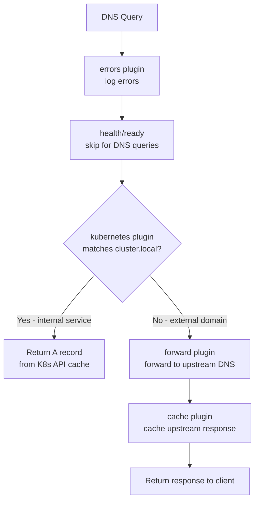
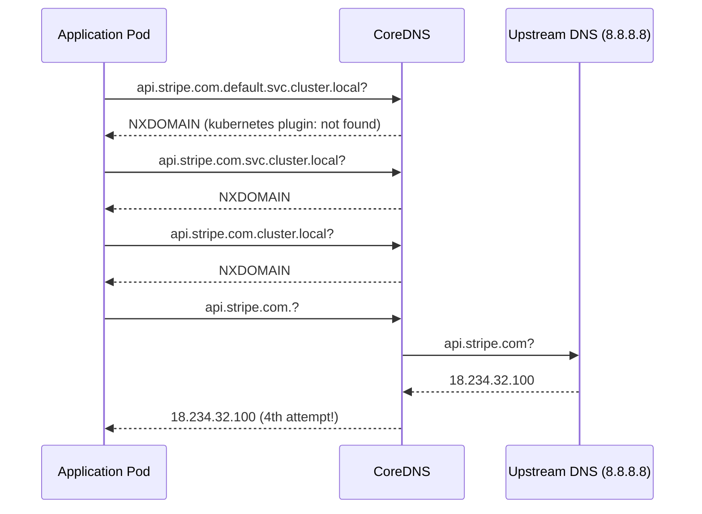
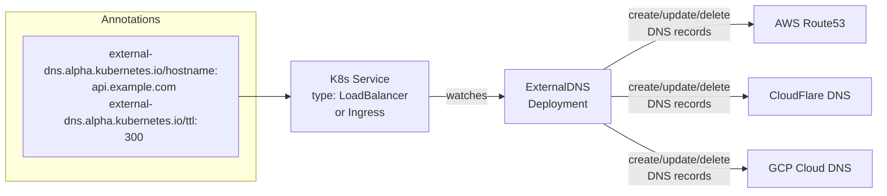

# CoreDNS and ExternalDNS

## Overview

DNS is the nervous system of a Kubernetes cluster. Every service discovery call, every pod-to-pod connection, every external API request starts with a DNS lookup. CoreDNS replaced kube-dns as the default cluster DNS in Kubernetes 1.13 and has become the standard. A misbehaving CoreDNS causes cascading failures across the entire cluster — understanding its architecture is not optional for production SREs.

ExternalDNS complements CoreDNS by synchronizing K8s service/ingress resources to external DNS providers, automating the last mile of DNS management for public-facing services.

---

## CoreDNS Architecture

CoreDNS is a plugin-based DNS server written in Go. Each DNS query is processed through a configurable plugin chain defined in the `Corefile`. Unlike kube-dns (which was a collection of separate processes), CoreDNS is a single binary with modular functionality.

### Corefile Plugin Chain

```
.:53 {
    errors          # log errors to stderr
    health          # /health HTTP endpoint (for K8s liveness probe)
    ready           # /ready HTTP endpoint (ready when all plugins are initialized)
    kubernetes cluster.local in-addr.arpa ip6.arpa {
        pods insecure
        fallthrough in-addr.arpa ip6.arpa
    }
    forward . /etc/resolv.conf {
        max_concurrent 1000
    }
    cache 30         # cache TTL in seconds
    loop             # detect forwarding loops, crash on detection
    reload           # hot-reload Corefile without restart
    loadbalance      # randomize order of A/AAAA/MX records
}
```

**Plugin evaluation:** Plugins are evaluated in order. If a plugin handles the query (e.g., `kubernetes` handles `.cluster.local`), it returns a response and further plugins are skipped. If it cannot handle the query, execution falls through to the next plugin.



---

## Service DNS Naming

### ClusterIP Services

```
<service-name>.<namespace>.svc.cluster.local → ClusterIP
```

Examples:
- `redis.cache.svc.cluster.local` → `10.96.50.100`
- `api.backend.svc.cluster.local` → `10.96.80.200`

The `kubernetes` plugin maintains an in-memory cache (via a shared informer watching K8s API) of all services and their ClusterIPs. Lookups return sub-millisecond responses without hitting the API server.

### Pod DNS

```
<pod-ip-dashed>.<namespace>.pod.cluster.local → pod IP
```

Example: `10-244-1-5.default.pod.cluster.local` → `10.244.1.5`

Pod DNS records are created only when `spec.hostname` is set or when the pod is part of a StatefulSet. Standard pods do not get a resolvable DNS name by default.

### Headless Service DNS (StatefulSets)

For a headless service (`clusterIP: None`), CoreDNS returns multiple A records — one per ready pod:

```
mysql.default.svc.cluster.local → 10.244.1.5, 10.244.2.8, 10.244.3.2
```

For StatefulSet pods, individual pod DNS:
```
<pod-name>.<service>.<namespace>.svc.cluster.local → specific pod IP
mysql-0.mysql.default.svc.cluster.local → 10.244.1.5  (always pod 0)
mysql-1.mysql.default.svc.cluster.local → 10.244.2.8  (always pod 1)
```

This stable per-pod DNS is why StatefulSets require headless services — the `<pod-name>.<service>` format provides the persistent identity that databases and message queues need for cluster formation.

---

## The ndots:5 Problem

This is one of the most common performance issues in Kubernetes DNS and the root cause of many mysterious 5-second latency spikes.

### How ndots Works

Every pod in Kubernetes gets a `resolv.conf` like:

```
nameserver 10.96.0.10       # CoreDNS ClusterIP
search default.svc.cluster.local svc.cluster.local cluster.local
options ndots:5
```

The `ndots:5` setting means: if a DNS name has fewer than 5 dots, try all search domains before assuming it's an FQDN.

When a pod queries `api.stripe.com` (2 dots < 5):

```
Attempt 1: api.stripe.com.default.svc.cluster.local   → NXDOMAIN
Attempt 2: api.stripe.com.svc.cluster.local           → NXDOMAIN
Attempt 3: api.stripe.com.cluster.local               → NXDOMAIN
Attempt 4: api.stripe.com.                            → ANSWER (finally!)
```

**The cost:** 3 extra DNS round trips before the actual resolution. Each takes ~1-2ms normally, but under load or with conntrack issues, each can take 5 seconds. A service making 100 external API calls per second generates 300 NXDOMAIN queries per second extra load on CoreDNS — amplification factor of 4x.



### Mitigation 1: Use FQDNs (Trailing Dot)

```go
// Application code: append trailing dot to external hostnames
url := "https://api.stripe.com./"  // trailing dot = skip search domains
```

### Mitigation 2: Pod dnsConfig

Reduce search domain attempts or increase ndots threshold:

```yaml
spec:
  dnsConfig:
    options:
      - name: ndots
        value: "1"   # only 1 dot needed to skip search domains
      - name: single-request-reopen
        value: ""    # mitigates UDP conntrack race (separate connections for A/AAAA)
```

**Trade-off:** With `ndots:1`, short internal service names like `redis` (0 dots) are not searched across domains — you must use FQDNs for all internal service names (`redis.cache.svc.cluster.local`). This may break existing apps that rely on short names.

### Mitigation 3: autopath Plugin

```
kubernetes cluster.local in-addr.arpa ip6.arpa {
    pods insecure
    fallthrough in-addr.arpa ip6.arpa
}
autopath @kubernetes   # add this line
```

With autopath: CoreDNS detects that a pod is querying a name with `ndots:5` search domains. It checks all search domains server-side in one request and returns the first match — the client only sees one round trip. This reduces the amplification from 4x to 1x while keeping full compatibility with short names.

**autopath caveat:** Increases CoreDNS memory usage (~20MB extra per 1000 pods) because it needs to track which pod is making which query (requires `pods verified` mode which is heavier).

---

## Corefile Plugins Reference

| Plugin | Purpose | Production Config |
|--------|---------|------------------|
| `errors` | Log errors to stderr | Always include |
| `health` | HTTP /health endpoint on port 8080 | Always include |
| `ready` | HTTP /ready endpoint on port 8181 | Always include |
| `kubernetes` | Resolve K8s service/pod names from API | Core plugin |
| `forward` | Forward non-cluster queries to upstream DNS | Use `max_concurrent 5000` under load |
| `cache` | Cache upstream responses | TTL 30-300s depending on stability |
| `autopath` | Short-circuit ndots:5 search amplification | Include in high-query environments |
| `hosts` | Static host entries (like `/etc/hosts`) | Useful for overriding specific records |
| `rewrite` | Rewrite DNS queries/responses | Migration: alias old names to new |
| `log` | Log all DNS queries (verbose, for debugging) | Temporarily enable; remove in production |
| `prometheus` | Expose metrics at :9153/metrics | Always include; alert on `coredns_dns_request_duration_seconds` |
| `loop` | Detect and crash on forwarding loops | Always include |
| `reload` | Hot-reload Corefile on ConfigMap change | Always include |

---

## CoreDNS Tuning

### Scaling CoreDNS

```yaml
# Increase replicas for large clusters
kubectl scale deployment coredns -n kube-system --replicas=5
# Or use Cluster Proportional Autoscaler (recommended)
# Scales CoreDNS replicas based on cluster node/pod count
```

### Forward Plugin Concurrency

```
forward . /etc/resolv.conf {
    max_concurrent 5000   # default 1000; increase for high query rate clusters
    policy round_robin    # or sequential, random
    health_check 5s
}
```

### Cache Tuning

```
cache {
    success 9984 30    # cache successful responses for 30s
    denial 9984 5      # cache NXDOMAIN for 5s (shorter for dynamic services)
    prefetch 10 1m 10% # prefetch records accessed 10+ times in 1m when 10% of TTL remains
}
```

### NodeLocal DNSCache

NodeLocal DNSCache is the production-recommended solution for high-query-rate clusters. It deploys a DNS cache daemon on each node that listens on a link-local IP (`169.254.20.10`). Pods use this local cache as their DNS server.

**Benefits:**
- No DNAT (no kube-proxy rules) → eliminates UDP conntrack race condition
- Cache hits never leave the node (sub-millisecond)
- CoreDNS load reduced dramatically (only cache misses reach CoreDNS)

```bash
# Enable NodeLocal DNSCache
kubectl apply -f https://k8s.io/examples/admin/dns/nodelocaldns.yaml

# Pods automatically get the local cache in resolv.conf
# nameserver 169.254.20.10  (instead of 10.96.0.10)
```

### The UDP Conntrack Race Condition

This is the root cause of intermittent DNS failures in clusters under load:

1. Pod makes DNS query (A + AAAA queries simultaneously, default behavior)
2. Both UDP packets hit kube-proxy's DNAT iptables rules simultaneously
3. Both packets try to create a conntrack entry for the same 5-tuple
4. One insertion fails (`insert_failed`) — that query is silently dropped
5. Application retries after 5 seconds (default DNS retry timeout)

```bash
# Verify if this is happening
conntrack -S | grep insert_failed
# If incrementing rapidly: this is the root cause

# Mitigation 1: NodeLocal DNSCache (eliminates DNAT)
# Mitigation 2: Disable conntrack for DNS traffic
iptables -t raw -A PREROUTING -p udp --dport 53 -j NOTRACK
iptables -t raw -A OUTPUT -p udp --dport 53 -j NOTRACK

# Mitigation 3: Force sequential A/AAAA queries (pod dnsConfig)
spec:
  dnsConfig:
    options:
      - name: single-request-reopen
        value: ""
```

---

## ExternalDNS

ExternalDNS watches K8s Services and Ingresses and automatically creates/updates DNS records in external DNS providers.

### Architecture



### Configuration

```yaml
# ExternalDNS Deployment
apiVersion: apps/v1
kind: Deployment
metadata:
  name: external-dns
  namespace: external-dns
spec:
  containers:
    - name: external-dns
      image: registry.k8s.io/external-dns/external-dns:v0.14.0
      args:
        - --source=service
        - --source=ingress
        - --domain-filter=example.com          # only manage records in this zone
        - --provider=aws
        - --aws-zone-type=public               # public or private hosted zone
        - --policy=sync                        # sync: delete removed records too
        # --policy=upsert-only                # only create/update, never delete
        - --interval=1m
        - --txt-owner-id=my-cluster-name       # prevents multi-cluster conflicts
```

### Annotation-Based DNS

```yaml
apiVersion: v1
kind: Service
metadata:
  name: payment-api
  annotations:
    external-dns.alpha.kubernetes.io/hostname: "payment.example.com"
    external-dns.alpha.kubernetes.io/ttl: "300"
    external-dns.alpha.kubernetes.io/cloudflare-proxied: "true"  # provider-specific
spec:
  type: LoadBalancer
```

```yaml
apiVersion: networking.k8s.io/v1
kind: Ingress
metadata:
  name: api-ingress
  annotations:
    external-dns.alpha.kubernetes.io/hostname: "api.example.com"
spec:
  rules:
    - host: api.example.com
      ...
```

### Policy Modes

| Policy | Creates | Updates | Deletes |
|--------|---------|---------|---------|
| `sync` | Yes | Yes | Yes (removes orphaned records) |
| `upsert-only` | Yes | Yes | No (safer for shared DNS zones) |
| `create-only` | Yes | No | No |

**TXT ownership records:** ExternalDNS creates a TXT record alongside each managed record:
```
api.example.com.    A     203.0.113.5
api.example.com.    TXT   "heritage=external-dns,external-dns/owner=my-cluster"
```

This prevents ExternalDNS from deleting records it doesn't own (from other clusters or manually created).

---

## Production Scenario: 5-Second DNS Latency in Pods

**Situation:** Developers report intermittent 5-second delays when services call external APIs (Stripe, Twilio). Internal service-to-service calls work instantly. The pattern is inconsistent — most calls are fast, but 10-20% have exactly 5 seconds of added latency.

**"Exactly 5 seconds" is a smoking gun:** DNS client retry timeout. The first query timed out; the 5-second wait is the DNS retry interval.

**Investigation:**

```bash
# Step 1: Confirm it's DNS latency (not network latency)
kubectl exec -n payments payment-pod -- \
  time nslookup api.stripe.com
# If: nslookup takes 5s → DNS issue
# If: nslookup is fast but curl is slow → TCP connection issue (not DNS)

# Step 2: Check for conntrack race condition on nodes
# Get the node where the payment pod is running
NODE=$(kubectl get pod payment-pod -n payments -o jsonpath='{.spec.nodeName}')
# SSH to the node and check:
conntrack -S | grep insert_failed
# If the counter is incrementing: UDP conntrack race confirmed

# Step 3: Verify the ndots amplification
kubectl exec -n payments payment-pod -- cat /etc/resolv.conf
# Look for: options ndots:5
# Count the search domains: default.svc.cluster.local svc.cluster.local cluster.local

# Step 4: Run multiple DNS lookups and time each
for i in {1..20}; do
  kubectl exec -n payments payment-pod -- \
    time nslookup api.stripe.com 2>&1 | grep real
done
# Look for: some ~0.001s (fast), some ~5.000s (timeout + retry)

# Step 5: Measure CoreDNS query processing time
kubectl top pods -n kube-system -l k8s-app=kube-dns
# If CPU is throttled: CoreDNS is overloaded
# If memory is near limit: cache eviction causing slow lookups

# Step 6: Check CoreDNS error logs
kubectl logs -n kube-system -l k8s-app=kube-dns --tail=100 | \
  grep -E "ERROR|timeout|SERVFAIL"

# Step 7: Enable CoreDNS query logging temporarily
kubectl edit cm coredns -n kube-system
# Add "log" plugin to Corefile:
# .:53 {
#     log        <-- add this
#     errors
#     ...
# }
# This shows every query — disable in production after diagnosis
```

**Root cause confirmed:** UDP conntrack race condition causing ~15% of simultaneous A/AAAA queries to be dropped. Combined with ndots:5, each external query generates 3 extra NXDOMAIN queries, tripling the chance of hitting the race.

**Fix — Deploy NodeLocal DNSCache:**

```bash
# Download and apply NodeLocal DNSCache
curl -o nodelocaldns.yaml \
  https://k8s.io/examples/admin/dns/nodelocaldns.yaml

# Update the local DNS IP if needed (default 169.254.20.10)
kubectl apply -f nodelocaldns.yaml

# Verify pods are running on all nodes
kubectl get pods -n kube-system -l k8s-app=node-local-dns

# Update kubelet config to use NodeLocal DNSCache
# (set clusterDNS to 169.254.20.10 in kubelet configuration)
# Pods created after this change will use the local cache
kubectl rollout restart deployment/payment-service -n payments
```

**Fix — Reduce ndots amplification (immediate):**

```yaml
# Add to all Deployments that make external calls
spec:
  template:
    spec:
      dnsConfig:
        options:
          - name: ndots
            value: "2"       # external names with 2+ dots skip search
          - name: single-request-reopen
            value: ""        # sequential A/AAAA queries (mitigates race)
```

---

## Failure Modes

| Failure | Symptoms | Detection | Fix |
|---------|----------|-----------|-----|
| CoreDNS OOMKilled | All DNS fails cluster-wide; pods can't resolve anything | `kubectl get pods -n kube-system` CoreDNS CrashLoopBackoff | Increase CoreDNS memory limit; reduce cache size if cache bloated |
| conntrack race | 5-second DNS latency for ~15% of external queries | `conntrack -S insert_failed` incrementing | Deploy NodeLocal DNSCache; or disable conntrack for UDP 53 |
| ndots:5 amplification | External DNS queries take 3-4x longer | `time nslookup external.api.com` shows 3-4 NXDOMAIN before A record | Add `ndots:2` dnsConfig; deploy autopath plugin |
| forward plugin unreachable | External DNS fails; internal (.cluster.local) works | `kubectl exec coredns -- nslookup 8.8.8.8` fails | CoreDNS pod network issue; check CNI, NetworkPolicy for CoreDNS egress |
| CoreDNS ConfigMap misconfigured | CoreDNS crashes on restart; all DNS fails | CoreDNS pod logs: "Corefile parse error" | `kubectl describe cm coredns -n kube-system`; fix syntax; `kubectl rollout restart` |
| ExternalDNS multi-cluster conflict | Two clusters create/delete same DNS record | DNS record flapping; ExternalDNS logs: "record modified by other owner" | Set unique `--txt-owner-id` per cluster; use separate hosted zones per cluster |
| DNS negative cache | NXDOMAIN cached too long; new service not resolvable | `dig svc.ns.svc.cluster.local` returns NXDOMAIN right after service creation | Reduce denial cache TTL: `cache { denial 9984 5 }` |
| ExternalDNS IAM permission | Records not created; new LoadBalancer has no DNS | ExternalDNS logs: AccessDenied for Route53 | Grant `route53:ChangeResourceRecordSets` permission to ExternalDNS IAM role |

---

## Debugging Guide

```bash
# CoreDNS health
kubectl get pods -n kube-system -l k8s-app=kube-dns
kubectl describe pod -n kube-system <coredns-pod>
kubectl logs -n kube-system <coredns-pod>

# Inspect CoreDNS ConfigMap
kubectl get cm coredns -n kube-system -o yaml

# Test DNS resolution from inside a pod
kubectl run dns-debug --image=busybox --rm -it -- sh
# Inside pod:
nslookup kubernetes.default.svc.cluster.local   # internal service
nslookup api.stripe.com                          # external FQDN
nslookup api.stripe.com.                         # FQDN with trailing dot (skip search)
cat /etc/resolv.conf                             # check ndots and search domains

# Test DNS resolution from a specific namespace
kubectl run dns-debug -n production --image=busybox --rm -it -- \
  nslookup my-service.production.svc.cluster.local

# CoreDNS metrics (if Prometheus installed)
kubectl port-forward -n kube-system svc/coredns 9153:9153
curl localhost:9153/metrics | grep coredns_dns

# Key metrics to watch:
# coredns_dns_request_duration_seconds_bucket — latency distribution
# coredns_dns_requests_total{rcode="NXDOMAIN"} — negative cache misses
# coredns_forward_requests_total — upstream forwarding rate
# coredns_cache_hits_total / coredns_cache_misses_total — cache effectiveness

# ExternalDNS debugging
kubectl logs -n external-dns deployment/external-dns --tail=100
# Look for: "Desired change: CREATE api.example.com A"
# Or: "Skipping record ... not owned by this controller"
kubectl get events -n external-dns

# Verify DNS record was created
dig @8.8.8.8 api.example.com
# Check TXT ownership record
dig @8.8.8.8 TXT api.example.com
```

---

## Security Considerations

- **CoreDNS as an attack surface.** CoreDNS runs on every cluster node (as a Deployment, not DaemonSet). A compromised CoreDNS can respond with malicious IPs for any service name — redirecting traffic to attacker-controlled servers. Protect: read-only root filesystem for CoreDNS pods, network policy restricting CoreDNS pod access, admission control to prevent CoreDNS ConfigMap modification without approval.
- **DNS exfiltration.** DNS queries are visible to CoreDNS and forwarded to upstream servers. Attackers can exfiltrate data by encoding it in DNS query names (DNS tunneling). Monitor for: unusually long query names (>100 chars), high-frequency queries to single external domain, or base32/base64-encoded subdomains. Cilium's DNS-aware NetworkPolicy can help detect and block this pattern.
- **ndots:5 and SSRF amplification.** In multi-tenant clusters, `ndots:5` search domain expansion may cause pods to query internal service names before external names — a misconfigured tenant app could accidentally resolve an internal service it shouldn't know about. Consider namespace-specific `dnsConfig` with reduced ndots for untrusted tenants.
- **ExternalDNS least-privilege IAM.** ExternalDNS only needs `route53:ChangeResourceRecordSets`, `route53:ListHostedZones`, `route53:ListResourceRecordSets`. Scope the IAM role to specific hosted zone ARNs, not `*`. Use `--domain-filter` to prevent ExternalDNS from accidentally managing unintended zones.
- **DNS-01 challenge security.** cert-manager (or Traefik) with DNS-01 challenge requires write access to the DNS zone. Scope the API credentials to a specific zone and use a service account with minimal permissions. Compromised DNS-01 credentials = ability to issue certs for any name in the zone.
- **DNS cache poisoning.** CoreDNS with default settings is resistant to cache poisoning (QNAME randomization, port randomization). Ensure `dnssec` plugin is enabled for zones that publish DNSSEC records. For critical internal service names, pin them in a `hosts` plugin block to prevent forward DNS from being poisoned.

---

## Interview Questions

### Basic

**Q: How does CoreDNS resolve `redis.cache.svc.cluster.local` inside a pod?**
The pod's `/etc/resolv.conf` points to CoreDNS's ClusterIP (e.g., 10.96.0.10). The query arrives at CoreDNS on UDP port 53. The `kubernetes` plugin matches the `.cluster.local` suffix and looks up `redis` in the `cache` namespace from its in-memory cache of K8s Service objects (populated by a shared informer watching the K8s API). It returns the Service's ClusterIP in an A record. No external DNS server is involved — sub-millisecond resolution.

**Q: What is the ndots:5 setting and what problem does it cause?**
`ndots:5` in `/etc/resolv.conf` means: if a query name has fewer than 5 dots, attempt all search domains before treating it as an FQDN. For `api.stripe.com` (2 dots), this generates 3 NXDOMAIN queries for `.default.svc.cluster.local`, `.svc.cluster.local`, `.cluster.local` before the actual query. This quadruples DNS query rate for external names. Under load (conntrack race condition), each failed attempt can take 5 seconds — causing latency spikes that look like network problems.

**Q: What is the conntrack race condition in Kubernetes DNS?**
Pods send A (IPv4) and AAAA (IPv6) DNS queries simultaneously. Both UDP packets hit kube-proxy's DNAT rules for CoreDNS at nearly the same time. If both packets arrive at the same conntrack entry creation point, one `insert_failed` silently drops one packet. The DNS client waits 5 seconds for the response before retrying on a new socket. Monitor with `conntrack -S | grep insert_failed`. Fix: NodeLocal DNSCache (avoids DNAT entirely) or `single-request-reopen` option (forces sequential A/AAAA queries).

### Intermediate

**Q: Explain how NodeLocal DNSCache works and why it solves multiple DNS problems simultaneously.**
NodeLocal DNSCache deploys a DNS cache daemon (using a link-local IP `169.254.20.10`) on every node. Pods use this local address as their DNS server (no kube-proxy DNAT, no iptables). Benefits: (1) No conntrack race — traffic goes directly to the local process, no DNAT rules traversed; (2) Cache hits never leave the node (~10μs response); (3) CoreDNS load reduced to only cache misses; (4) Per-node cache means faster TTL-based updates; (5) NodeLocal DNS uses TCP for upstream queries to CoreDNS (bypassing UDP conntrack issues for that hop too). Limitation: NodeLocal DNSCache is a DaemonSet — a daemon crash on a node means all pods on that node lose DNS until the pod restarts (usually <30s with liveness probe).

**Q: You apply a default-deny NetworkPolicy to the `production` namespace. Two minutes later, all pods start failing with DNS resolution errors. What happened and how do you fix it?**
The default-deny egress policy is blocking pods from sending DNS queries to CoreDNS on UDP/TCP port 53. CoreDNS runs in `kube-system` namespace. Fix: add an explicit egress NetworkPolicy that allows UDP/TCP port 53 to CoreDNS pods in kube-system. In K8s 1.21+, use the automatic namespace label: `namespaceSelector: {matchLabels: {kubernetes.io/metadata.name: kube-system}}` combined with `podSelector: {matchLabels: {k8s-app: kube-dns}}`. Apply immediately: `kubectl apply -f allow-dns-egress.yaml`. Prevention: Always include the DNS egress rule as part of the default-deny template applied to namespaces.

**Q: How does ExternalDNS prevent conflicts between two clusters both managing the same DNS zone?**
ExternalDNS creates TXT records alongside each managed DNS record containing the cluster's `--txt-owner-id`. When ExternalDNS evaluates a record, it checks the TXT record's owner ID. If the owner ID doesn't match its own, it does not modify or delete the record. This prevents cluster A from deleting records that cluster B created. The `--policy=sync` mode will clean up records owned by the current controller when the corresponding K8s resource is deleted, but leaves foreign-owned records intact. For complete isolation, use separate hosted zones per cluster or subdomains (cluster-a.example.com vs cluster-b.example.com).

### Advanced / Staff Level

**Q: Your cluster processes 500,000 DNS queries per second. CoreDNS is at 90% CPU. Walk through the full optimization strategy.**
Phase 1 — immediate: Scale CoreDNS: `kubectl scale deployment coredns -n kube-system --replicas=10`. Check if CPU is from cache misses: `coredns_cache_hits_total / (coredns_cache_hits_total + coredns_cache_misses_total)` — hit rate should be >90%. If not, increase cache size (`cache 10000 300`). Phase 2 — structural: Deploy NodeLocal DNSCache. This alone can reduce CoreDNS load by 80-90% because cache hits stay on the node. After deployment, CoreDNS only receives cache misses from all nodes. Phase 3 — query reduction: Deploy autopath plugin to eliminate ndots:5 amplification. Add `ndots:2` dnsConfig to all Deployments that make external calls. This reduces 4x query multiplication to 1x. Phase 4 — upstream optimization: Increase `forward max_concurrent` from 1000 to 5000. Enable `prefetch` in cache plugin to pre-warm hot records. Phase 5 — monitoring: Set Prometheus alert on `coredns_dns_request_duration_seconds` p99 > 10ms. Alert on `coredns_cache_hits_total` ratio drop. Alert on `coredns_forward_request_duration_seconds` p99 (upstream DNS slow). This combination should handle 500k/s without CPU saturation.

**Q: Design the DNS architecture for a multi-cluster setup (3 clusters in different AWS regions) where services in cluster A need to discover services in cluster B, and all clusters use ExternalDNS for public DNS management.**
Internal service discovery: Options are (1) Istio multi-cluster with service mirroring — remote services appear as local services, DNS resolves to local gateway that tunnels to remote cluster; (2) Cilium Cluster Mesh — cross-cluster service discovery where `svc.namespace.svc.cluster.local` resolves to the closest healthy backend across all clusters; (3) DNS-based via ExternalDNS with private hosted zones — each cluster exports service records to a private Route53 zone accessible from all clusters via VPC peering. Architecture for option 3: Each cluster has ExternalDNS writing to a shared private Route53 zone (`internal.example.com`). Services are annotated: `external-dns.alpha.kubernetes.io/hostname: payment-api.us-east.internal.example.com`. Clients query their local CoreDNS which forwards `.internal.example.com` to Route53. Use Route53 health checks + failover routing for HA. For public DNS: each cluster has ExternalDNS with unique `--txt-owner-id` (cluster-a, cluster-b, cluster-c). Use separate hosted zones or subdomain delegation (use-east.example.com, eu-west.example.com) to eliminate ownership conflicts. For global load balancing across regions, use Route53 latency routing with health checks pointing to each cluster's LoadBalancer.
