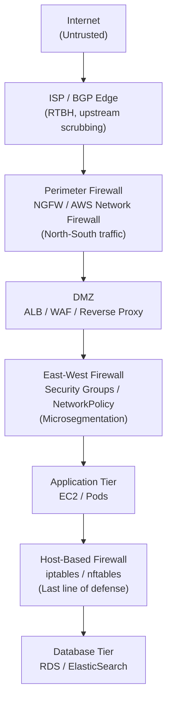

# Firewall Architectures

## Table of Contents

- [Overview](#overview)
- [Stateless vs Stateful Firewalls](#stateless-vs-stateful-firewalls)
  - [Stateless Firewalls (ACLs)](#stateless-firewalls-acls)
  - [Stateful Firewalls (Connection Tracking)](#stateful-firewalls-connection-tracking)
  - [Next-Generation Firewalls (NGFW)](#next-generation-firewalls-ngfw)
- [Firewall Placement Patterns](#firewall-placement-patterns)
  - [Defense-in-Depth Architecture](#defense-in-depth-architecture)
  - [Perimeter (North-South) Firewalls](#perimeter-north-south-firewalls)
  - [East-West (Microsegmentation) Firewalls](#east-west-microsegmentation-firewalls)
  - [Host-Based Firewalls (iptables / nftables)](#host-based-firewalls-iptables-nftables)
- [Cloud Firewalls](#cloud-firewalls)
  - [AWS Security Groups](#aws-security-groups)
  - [AWS NACLs (Network Access Control Lists)](#aws-nacls-network-access-control-lists)
  - [AWS Network Firewall](#aws-network-firewall)
  - [Azure Firewall](#azure-firewall)
- [Firewall Rule Ordering](#firewall-rule-ordering)
- [Real-World Production Scenario](#real-world-production-scenario)
- [Failure Modes](#failure-modes)
- [Debugging Guide](#debugging-guide)
- [Security Considerations](#security-considerations)
- [Interview Questions](#interview-questions)
  - [Basic](#basic)
  - [Intermediate](#intermediate)
  - [Advanced / Staff Level](#advanced-staff-level)

---

## Overview

Firewalls enforce network access control by inspecting and filtering traffic based on defined rules. Understanding how firewalls work at each layer — from stateless ACLs to next-generation deep packet inspection — is fundamental for Senior SREs designing secure, observable infrastructure.

The key mental model: a firewall is a policy enforcement point. Every firewall decision is "allow or deny based on some observable property of the packet or flow." The sophistication of what you can observe determines whether you have a stateless filter, a stateful firewall, or an NGFW.

---

## Stateless vs Stateful Firewalls

### Stateless Firewalls (ACLs)

Stateless firewalls evaluate each packet in isolation against a set of rules matching header fields: source IP, destination IP, protocol, source port, destination port. They have no memory of prior packets and no concept of a connection.

**How it works:**
- Each packet matched against rules top-to-bottom (first match wins in most implementations)
- Rules check: `src_ip, dst_ip, proto, src_port, dst_port, TCP flags`
- No flow table, no connection tracking
- Extremely fast — O(n) rule lookup, no state memory

**What stateless can't do:**
- Can't distinguish a reply packet from an attack packet — a SYN-ACK from an external host looks identical whether it's a reply or an unsolicited attack
- Can't track TCP connection state (half-open, established, closing)
- Requires explicit rules for return traffic (e.g., `ephemeral port 1024-65535 from internet` — a wide-open rule)

**AWS NACLs are stateless.** You must add explicit inbound AND outbound rules for each flow. A NACL allows port 443 inbound but blocks the return ephemeral ports outbound would silently break HTTPS.

### Stateful Firewalls (Connection Tracking)

Stateful firewalls maintain a **conntrack table** — a hash table of active flows keyed by the 5-tuple (src_ip, src_port, dst_ip, dst_port, proto). When a new connection is established, an entry is created. Subsequent packets for that flow are matched against the conntrack entry rather than rule-evaluated from scratch.

**Linux conntrack states:**
| State | Meaning |
|---|---|
| `NEW` | First packet of a new connection (SYN) |
| `ESTABLISHED` | Connection is active (both sides have sent data) |
| `RELATED` | Related to an existing connection (e.g., ICMP error, FTP data channel) |
| `INVALID` | Packet doesn't match any connection state |

**Key implication:** A stateful firewall only needs one rule — "allow ESTABLISHED,RELATED" — and automatically permits return traffic. This is cleaner and more secure than stateless rules.

**Failure mode:** Conntrack table exhaustion. Default Linux `nf_conntrack_max` is often 262144. Under DDoS or high connection rates, the table fills and the kernel drops packets with `nf_conntrack: table full, dropping packet` in dmesg.

```bash
# Check conntrack table usage
cat /proc/sys/net/netfilter/nf_conntrack_count
cat /proc/sys/net/netfilter/nf_conntrack_max

# View active connections
conntrack -L | head -20

# Tune: double the table size and reduce timeout on TIME_WAIT
sysctl -w net.netfilter.nf_conntrack_max=524288
sysctl -w net.netfilter.nf_conntrack_tcp_timeout_time_wait=30
```

### Next-Generation Firewalls (NGFW)

NGFWs add Layer 7 awareness to stateful inspection:

| Feature | How It Works |
|---|---|
| **Deep Packet Inspection (DPI)** | Reassembles TCP streams, parses application protocols (HTTP, DNS, TLS) |
| **Application awareness** | Identifies apps by behavior, not just port (e.g., BitTorrent on port 443) |
| **IPS/IDS integration** | Matches traffic against attack signatures (Snort/Suricata rules) |
| **SSL inspection** | MITM decrypts TLS to inspect encrypted traffic |
| **User identity** | Integrates with AD/LDAP, applies per-user or per-group rules |
| **URL filtering** | Blocks categories (malware, adult content) via reputation databases |

**SSL inspection trade-off:** The firewall terminates TLS (acting as a CA-trusted MITM), inspects plaintext, re-encrypts to the destination. This breaks certificate pinning and requires distributing the firewall's CA cert to all clients. Privacy concern: all encrypted traffic is readable by the firewall operator.

---

## Firewall Placement Patterns

### Defense-in-Depth Architecture



### Perimeter (North-South) Firewalls

Positioned at the internet boundary. Blocks known-bad sources, enforces protocol restrictions, terminates DDoS attacks. In AWS, this is the combination of AWS Shield + AWS Network Firewall deployed in the VPC inspection layer.

**What it defends against:** External attackers, port scans, known malicious IPs, volumetric attacks.
**What it cannot defend against:** Attacks that originate from legitimate-looking traffic, insider threats, compromised internal services.

### East-West (Microsegmentation) Firewalls

Between internal services. Zero-trust assumption: compromise of any one service is possible, so no service trusts another by default. Traffic between `api-server` and `auth-service` is restricted even though both are "inside" the network.

**Why it matters:** The 2020 SolarWinds breach propagated laterally for months because east-west traffic between internal services was unrestricted. Attackers with a foothold in one system could reach any other.

**Implementation options:**
- AWS Security Groups (per-instance, stateful)
- Kubernetes NetworkPolicy (per-pod, L3/L4)
- Istio AuthorizationPolicy (per-service, L7)

### Host-Based Firewalls (iptables / nftables)

Running on the Linux host itself. Last line of defense if network-level controls are misconfigured or bypassed.

**iptables architecture:**
- **Tables:** `filter` (packet filtering), `nat` (address translation), `mangle` (packet modification), `raw` (connection tracking bypass)
- **Chains:** `INPUT` (to local process), `OUTPUT` (from local process), `FORWARD` (transit traffic)
- **Rule ordering:** First match wins. A REJECT rule before an ACCEPT rule for the same traffic will reject it.

```bash
# View current rules with line numbers
iptables -L -n -v --line-numbers

# Allow established connections first (most traffic hits this rule)
iptables -A INPUT -m conntrack --ctstate ESTABLISHED,RELATED -j ACCEPT

# Allow specific port
iptables -A INPUT -p tcp --dport 443 -j ACCEPT

# Default deny (append to chain after all allows)
iptables -A INPUT -j DROP

# Trace a specific packet through iptables rules (debugging)
iptables -t raw -A PREROUTING -p tcp --dport 8080 -j TRACE
iptables -t raw -A OUTPUT -p tcp --sport 8080 -j TRACE
# Then monitor: dmesg | grep "TRACE:"
```

**nftables** is the modern replacement — more expressive syntax, better performance for large rule sets, atomic rule updates.

```bash
# nftables equivalent
nft add table inet filter
nft add chain inet filter input { type filter hook input priority 0 \; policy drop \; }
nft add rule inet filter input ct state established,related accept
nft add rule inet filter input tcp dport 443 accept
```

---

## Cloud Firewalls

### AWS Security Groups

Security Groups are **stateful, allow-only** firewalls applied at the ENI (Elastic Network Interface) level.

**Key properties:**
- Stateful: return traffic is automatically allowed (no need for explicit outbound rules for inbound-initiated connections)
- Allow-only: you cannot create a deny rule. All traffic not explicitly allowed is denied.
- Applied to ENI, not subnet — every instance can have a different security group
- All matching allow rules are evaluated — no first-match ordering (unlike NACLs)
- Can reference other Security Group IDs as sources (dynamic, survives IP changes)

**Production design principles:**
```
- One SG per application tier (alb-sg, app-sg, db-sg)
- app-sg inbound: allow from alb-sg on port 8080 (reference SG, not CIDR)
- db-sg inbound: allow from app-sg on port 5432
- No 0.0.0.0/0 inbound except on ALB SG for ports 80/443
- Restrict outbound: don't leave 0.0.0.0/0 outbound open on sensitive tiers
```

### AWS NACLs (Network Access Control Lists)

NACLs are **stateless, ordered rules** at the subnet level. They are the only AWS construct that supports explicit deny.

| Property | Security Group | NACL |
|---|---|---|
| State | Stateful | Stateless |
| Level | ENI (instance) | Subnet |
| Rule type | Allow only | Allow and Deny |
| Evaluation | All rules | First match (by rule number) |
| Return traffic | Automatic | Must be explicit |
| Use case | Primary workload firewall | Subnet-level block of known-bad CIDRs |

**When to use NACLs:** Blocking a known attack source CIDR quickly. Adding a DENY rule in a NACL blocks all traffic from that CIDR before it reaches any Security Group evaluation.

### AWS Network Firewall

Managed stateful + stateless + IDS/IPS engine deployed inline in your VPC.

**Rule types:**
1. **Stateless rules** (evaluated first): Classic ACL — header fields only, no connection tracking. Good for high-rate filtering of obvious attack traffic.
2. **Stateful rules** (Suricata-compatible): Full Suricata IDS rule syntax. Application-aware, can match on TLS SNI, HTTP Host header, DNS query names.
3. **Managed rule groups:** AWS-maintained threat intelligence lists (malware, botnet C2 IPs, Tor exit nodes).

**Deployment modes:**
- **Distributed:** Firewall endpoint in each AZ, inline in the route table. Traffic must route through the firewall endpoint.
- **Centralized:** Single inspection VPC with Transit Gateway, all spoke VPCs route through it.

```
# Suricata rule example — block known C2 domain
alert dns any any -> any any (msg:"Known C2 DNS Query"; dns.query; content:"evil-c2.com"; nocase; sid:1000001; rev:1;)

# Block TLS traffic to specific SNI
alert tls any any -> any any (msg:"Block specific domain TLS"; tls.sni; content:"badactor.com"; nocase; sid:1000002; rev:1;)
```

### Azure Firewall

Azure's managed NGFW, deployed in a hub VNet, with DNAT rules (for inbound), network rules (L3/L4), and application rules (FQDN filtering).

**Key feature — FQDN filtering:** Application rules can allow/deny by FQDN, resolved at evaluation time, handling dynamic IPs for SaaS services without needing to maintain IP lists.

---

## Firewall Rule Ordering

This is a critical operational concept that differs between implementations:

| Implementation | Ordering Model |
|---|---|
| iptables / nftables | First match wins — order matters |
| AWS NACLs | First match wins (by rule number 1–32766) |
| NGFW (Palo Alto, Fortinet) | First match wins |
| AWS Security Groups | All-match, allow-only — order irrelevant |
| Azure NSG | Priority-based, first match wins |

**Common iptables gotcha:** Putting a generic DROP rule before specific ACCEPT rules causes all traffic to be dropped. Always order: most specific ACCEPT rules → default DROP at the end.

---

## Real-World Production Scenario

**Scenario:** A new microservice (`payment-processor`) is deployed to EKS. It needs to call an internal `fraud-check` service on port 8443 and receive callbacks from an external payment gateway on port 443. After deployment, all payment transactions fail with timeout errors. The service pod is running and healthy.

**Diagnosis workflow:**

**Step 1: Check VPC Flow Logs for the traffic**
```bash
# Query Flow Logs in CloudWatch Logs Insights
fields @timestamp, srcAddr, dstAddr, srcPort, dstPort, protocol, action, logStatus
| filter dstAddr = "10.0.5.23" and dstPort = 8443
| sort @timestamp desc
| limit 50
```
Look for `REJECT` in the `action` field. If packets are arriving but being rejected, it's a firewall rule issue.

**Step 2: Check Security Group rules**
```bash
aws ec2 describe-security-groups --group-ids sg-fraud-check \
  --query 'SecurityGroups[0].IpPermissions'
# Verify: inbound rule allows traffic from payment-processor's SG on port 8443
```

**Step 3: Verify the source Security Group is attached to payment-processor pods**
```bash
kubectl describe pod payment-processor-xxx -n payments | grep Security
# EKS with Security Groups for Pods uses the SecurityGroupPolicy CRD
kubectl get securitygrouppolicy -n payments
```

**Step 4: Test with iptables TRACE on the worker node**
```bash
# SSH to the worker node hosting the payment-processor pod
# Enable tracing for traffic from the pod's veth interface
nsenter -t <pod-pid> -n -- iptables -t raw -A OUTPUT -p tcp --dport 8443 -j TRACE
# Watch dmesg for trace output
journalctl -f | grep TRACE
# This reveals exactly which chain and rule is matching the packet
```

**Step 5: Check NetworkPolicy**
```bash
kubectl get networkpolicy -n payments
# Default-deny NetworkPolicy may be blocking egress from payment-processor
# to fraud-check. Add explicit egress rule.
```

**Root cause found:** The `payments` namespace had a default-deny NetworkPolicy. The `payment-processor` pod lacked an egress rule allowing traffic to the `fraud-check` service's pod CIDR on port 8443. VPC Flow Logs showed the traffic reaching the worker node but being dropped by the host-level iptables rules enforced by the CNI plugin (Calico/Cilium).

---

## Failure Modes

| Failure | Symptoms | Detection | Fix |
|---|---|---|---|
| Conntrack table full | `nf_conntrack: table full` in dmesg, new connections dropped | `cat /proc/sys/net/netfilter/nf_conntrack_count` vs `nf_conntrack_max` | Increase `nf_conntrack_max`, reduce timeouts, consider stateless bypass for trusted flows |
| iptables rule ordering wrong | Traffic blocked or allowed unexpectedly | `iptables -L -n -v --line-numbers`, packet tracing with TRACE target | Reorder rules — specific ACCEPT before generic DROP |
| Security Group SG reference stale | Traffic suddenly blocked after SG rotation | VPC Flow Logs show REJECT for expected flows | Update SG rules to reference new SG ID |
| NACL missing return traffic rule | Outbound TCP works, inbound replies blocked | Flow Logs show accept outbound, reject inbound | Add explicit inbound rule for ephemeral port range 1024-65535 |
| AWS Network Firewall routing gap | Traffic bypasses firewall | VPC route table inspection | Ensure route tables send 0.0.0.0/0 to firewall endpoint before IGW |
| NetworkPolicy namespace isolation | Pods can't communicate across namespaces | `kubectl exec` connectivity test, pod-level flow logs | Add explicit ingress/egress rules in NetworkPolicy |
| iptables ACCEPT before rate limit | Rate limiting rules never match | `iptables -L -n -v` shows high packet count on ACCEPT rule above hashlimit rule | Move rate limit rule above broad ACCEPT |

---

## Debugging Guide

**VPC Flow Logs — the first tool to reach for in AWS:**
```bash
# CloudWatch Logs Insights — find rejected flows to a specific instance
fields @timestamp, srcAddr, srcPort, dstAddr, dstPort, action
| filter dstAddr like "10.0.1." and action = "REJECT"
| stats count(*) by srcAddr
| sort count desc
```

**iptables debugging on Linux:**
```bash
# Count packets per rule (useful to see which rules are matching)
iptables -L -n -v

# Log packets to dmesg before a DROP rule
iptables -I INPUT -p tcp --dport 8080 -j LOG --log-prefix "FW_BLOCK_8080: " --log-level 4

# Full TRACE — shows every chain/rule the packet traverses
iptables -t raw -I PREROUTING -p tcp --dport 8080 -s 10.1.2.3 -j TRACE
dmesg | grep TRACE | tail -50

# Find which process owns a port
ss -tlnp | grep 8080
```

**Test connectivity without disabling firewalls:**
```bash
# Test if TCP port is reachable (does not need HTTP)
nc -zv 10.0.5.23 8443

# Test from inside a pod
kubectl exec -it debug-pod -- nc -zv fraud-check-service 8443

# Trace the route with MTR
mtr --report --tcp --port 443 10.0.5.23
```

---

## Security Considerations

**Least-privilege rule design:** Every firewall rule is an attack surface. A rule `0.0.0.0/0 → port 22` is an SSH brute-force invitation. Use bastion hosts or AWS Systems Manager Session Manager instead.

**Egress filtering:** Most organizations focus on inbound. Outbound filtering is equally important — it prevents data exfiltration and C2 callback from compromised instances. A compromised EC2 instance with unrestricted egress can exfiltrate your entire database to an external server.

**Security Group sprawl:** Over time, Security Groups accumulate stale rules referencing deleted resources. A quarterly audit using AWS Config rules or a tool like Steampipe is essential. Stale rules are a latent security risk — an attacker who compromises a deleted resource's IP range (via elastic IP reassignment) could exploit them.

**Firewall bypass via misconfigured routing:** In AWS, a firewall only works if traffic routes through it. A misconfigured VPC route table that sends traffic directly to the IGW instead of through the Network Firewall endpoint completely bypasses the firewall silently.

**iptables FORWARD chain:** In Kubernetes, the CNI uses iptables FORWARD rules extensively. Manually flushing iptables (`iptables -F`) on a Kubernetes node destroys all CNI rules and breaks pod networking immediately.

---

## Interview Questions

### Basic

**Q: What is the difference between a stateless and stateful firewall?**
A: A stateless firewall evaluates each packet independently based on header fields (IPs, ports, protocol). It has no memory of prior packets and cannot distinguish a reply packet from an attack. A stateful firewall maintains a connection tracking table (conntrack). When a connection is established, an entry is created and subsequent packets are matched to that entry. Return traffic is automatically permitted without explicit rules. Stateless firewalls are faster but require more rules and have higher risk of misconfiguration.

**Q: What is the difference between an AWS Security Group and a NACL?**
A: Security Groups are stateful, applied at the ENI level, allow-only, and all matching rules are evaluated (no ordering). NACLs are stateless, applied at the subnet level, support both allow and deny rules, and use first-match-wins ordering by rule number. Because NACLs are stateless, you must add explicit rules for both directions of a flow, including ephemeral return ports. Security Groups are the primary control; NACLs are used for explicit CIDR-level blocking.

**Q: Why should you reference Security Group IDs rather than IP addresses in SG rules?**
A: IP addresses change — instances are replaced, auto-scaling launches new IPs, you can't predict the IP of the next instance. A Security Group rule referencing another SG ID automatically applies to any instance that is a member of that SG, regardless of IP. This is dynamic, scalable, and survives instance replacement. Hard-coding IPs creates maintenance burden and fails when instances are replaced.

### Intermediate

**Q: A service is intermittently dropping connections. conntrack shows the table is at 90% capacity. What are your options beyond simply increasing nf_conntrack_max?**
A: First, understand why the table is full. Use `conntrack -L | awk '{print $4}' | sort | uniq -c | sort -rn` to see which states are consuming entries. Options:

1. Reduce timeouts — `nf_conntrack_tcp_timeout_established` defaults to 5 days, reduce to 1 hour for most workloads.
2. For traffic between trusted internal services, bypass conntrack entirely with `iptables -t raw -A PREROUTING -p tcp --dport 8080 -j NOTRACK`.
3. Use iptables hashlimit to rate-limit new connections from untrusted sources.
4. If traffic is UDP-heavy, reduce `nf_conntrack_udp_timeout` which defaults to 30 seconds. Simply raising the max increases kernel memory usage (each entry is ~300 bytes) — at 10M entries that's 3GB of kernel memory.

**Q: You have a multi-tier app: ALB → app tier → database tier. Design the Security Group rules using least-privilege.**
A: Three security groups: `alb-sg`, `app-sg`, `db-sg`. ALB-SG: inbound 443 from 0.0.0.0/0 (and 80 for redirect), outbound to `app-sg` on port 8080. App-SG: inbound from `alb-sg` on port 8080 (no open internet access), outbound to `db-sg` on 5432, outbound to VPC endpoints for AWS services, outbound 443 for external API calls if needed. DB-SG: inbound from `app-sg` on 5432 only, outbound restricted (databases should not initiate outbound). No SG has 0.0.0.0/0 inbound except the ALB. Reference SGs not CIDRs everywhere possible.

### Advanced / Staff Level

**Q: Your AWS Network Firewall is deployed but your security team says it's not catching all expected threats. Walk through how you'd verify the firewall is actually inspecting traffic end-to-end.**
A: This is a routing problem as much as a firewall problem.

**Step 1:** Verify VPC route tables. Every subnet's default route (0.0.0.0/0) must point to the firewall endpoint, not the IGW. The IGW itself should only be in the route table of the firewall subnet.
**Step 2:** Check for asymmetric routing — if outbound goes through the firewall but return traffic bypasses it (direct to IGW), the stateful firewall drops the return traffic.
**Step 3:** Verify the firewall policy is associated with the correct firewall.
**Step 4:** Generate test traffic that should match a rule — use Suricata's own test tool or send a DNS query for a known-blocked domain. Check AWS Network Firewall metrics in CloudWatch: `PassedPackets`, `DroppedPackets`, `AlertedPackets`.
**Step 5:** Check TLS inspection configuration — if the traffic is encrypted and SSL inspection is not configured, the firewall can only inspect the TLS SNI/metadata, not the payload. Suricata rules matching on HTTP body content will not fire against TLS traffic without SSL termination.

**Q: You're asked to implement zero-trust east-west security in a Kubernetes cluster. Compare NetworkPolicy, Istio AuthorizationPolicy, and Cilium's eBPF-based enforcement — when do you use each?**
A: These operate at different layers. Kubernetes NetworkPolicy is L3/L4 — you can control which pods can communicate by IP/port, but not by HTTP method or path. It's implemented by the CNI plugin (Calico, Cilium) in iptables or eBPF. Use it as the baseline — enforce it everywhere with a default-deny. Istio AuthorizationPolicy operates at L7 — it can restrict `service-A` to call only `GET /api/v1/users` on `service-B`, not `DELETE /admin`. This requires the Istio sidecar, which adds ~50MB memory overhead per pod. Use it for services where fine-grained HTTP-level control is required (payment flows, admin APIs). Cilium's network policies in eBPF mode bypass iptables entirely for native eBPF enforcement — lower latency, higher throughput, and Cilium Layer 7 policies can do HTTP-aware enforcement without a sidecar. At staff level: the right answer is all three in concert — NetworkPolicy as the default baseline enforced by Cilium eBPF, Istio AuthorizationPolicy for services requiring L7 control, and Cilium Hubble for observability to validate that policies are enforced correctly.
