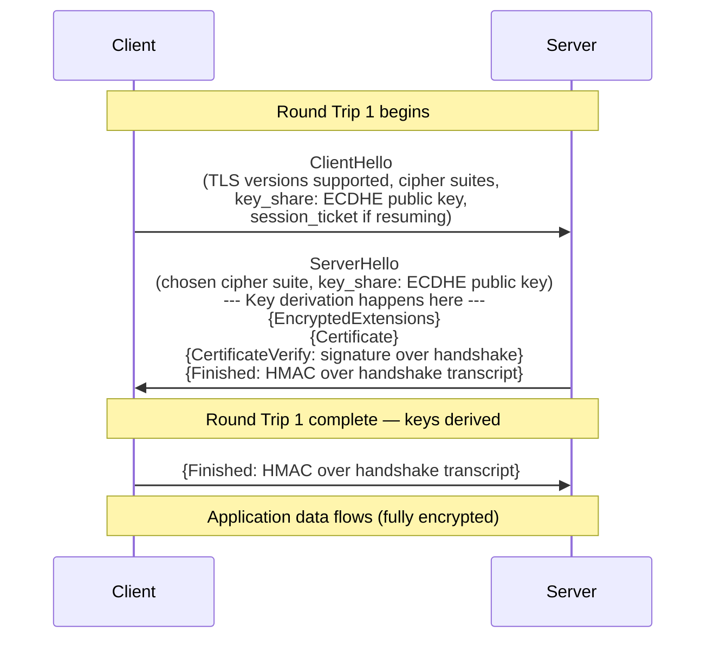
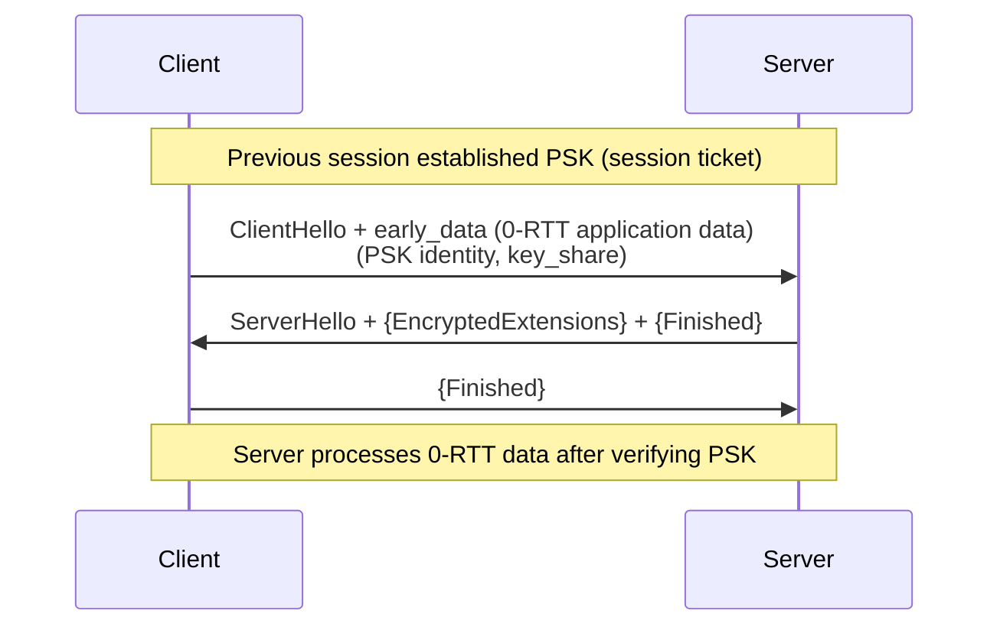
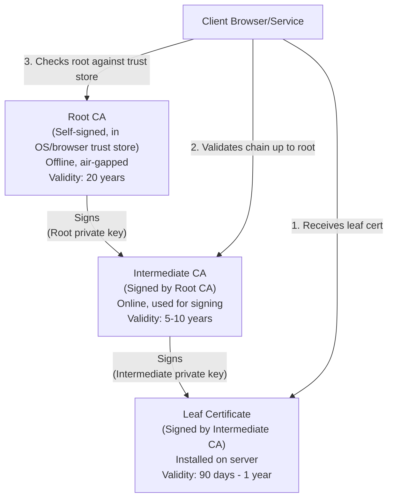
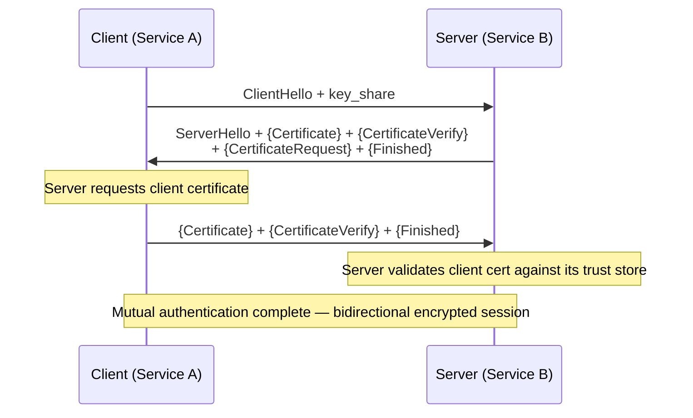
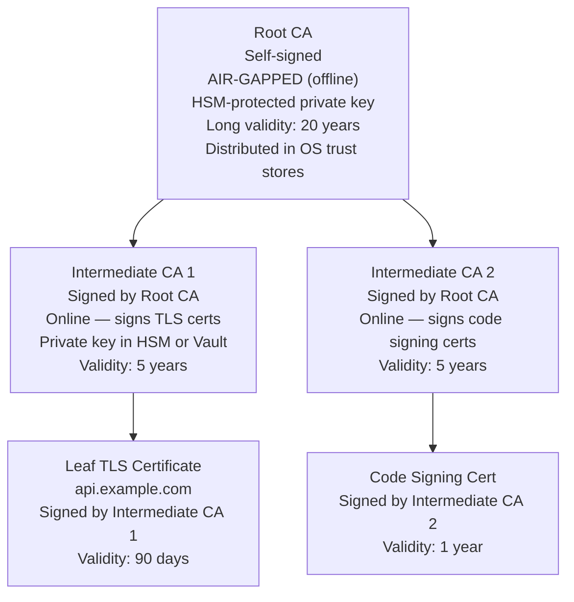
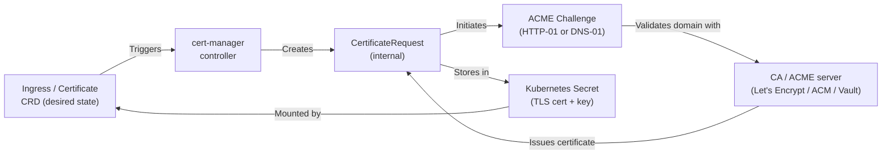

# TLS, mTLS, and PKI

## Overview

TLS (Transport Layer Security) is the protocol that provides encrypted, authenticated, and integrity-protected communication. It is the foundation of HTTPS, mTLS service mesh communication, VPN tunnels, and certificate-based authentication.

This file extends the core TLS/SSL study notes with deep dives into TLS 1.3 internals, PKI hierarchy design, mTLS in zero-trust architectures, certificate automation with cert-manager, and production failure scenarios that are common interview topics for Senior SRE roles.

The key mental model: TLS is fundamentally a key agreement protocol. The handshake is a negotiation to derive a shared secret that neither side knew before, using asymmetric cryptography to bootstrap symmetric encryption.

---

## TLS 1.3 Handshake (1-RTT)

TLS 1.3 (RFC 8446) reduced the handshake from 2 round trips (TLS 1.2) to 1 round trip. The client sends its key share in the very first message, enabling the server to derive session keys and send encrypted data in its first response.



**What happens at each step:**

1. **ClientHello:** Client sends its supported cipher suites, TLS version (1.3), and — critically — a Diffie-Hellman key share (ECDHE public key). In TLS 1.2, the key share only came after the server's Hello. In TLS 1.3, it's included upfront, which is why the server can derive keys immediately.

2. **ServerHello + encrypted payload:** Server picks a cipher suite, sends its ECDHE public key, and both sides can now independently derive the same shared secret (ECDHE). The server's Certificate, CertificateVerify (proving it owns the private key by signing the handshake transcript), and Finished are all sent **encrypted** using the derived handshake keys. This means the certificate is never visible in plaintext on the wire — TLS 1.3 encrypts the certificate.

3. **Client Finished:** Client verifies the server's certificate chain, checks the CertificateVerify signature, and sends its own Finished message. Application data begins.

**1-RTT summary:** Client → Server = 1 flight. Server → Client = 1 flight. Application data starts after the second flight. This is exactly 1 RTT.

### TLS 1.3 0-RTT (Session Resumption with PSK)

In 0-RTT, a client that previously connected can send application data in the very first message, before completing the handshake.



**0-RTT replay attack risk:** 0-RTT data has no forward secrecy — it is encrypted with the PSK derived from the previous session, not from a fresh ECDHE exchange. More critically, 0-RTT data can be **replayed** by an attacker who captures it. If an attacker replays the ClientHello + early_data, the server may process the request twice.

**When to disable 0-RTT:**
- Any non-idempotent request (POST, PUT, DELETE, financial transactions, state mutations)
- APIs where replay would cause harm (payment initiation, order creation)
- Enable only for GET requests on endpoints where replay is harmless (static content)
- CloudFront and most CDNs disable 0-RTT replay for POST by default

---

## Cipher Suite Anatomy

A TLS cipher suite is a combination of algorithms for each phase of the connection:

**TLS 1.3 cipher suites (only 5 — vs 300+ in TLS 1.2):**
```
TLS_AES_256_GCM_SHA384
└── Encryption: AES-256-GCM (AEAD — authenticated encryption with associated data)
└── Hash/PRF: SHA-384 (for HKDF key derivation)

TLS_CHACHA20_POLY1305_SHA256
└── Encryption: ChaCha20-Poly1305 (faster on CPUs without AES-NI hardware)
└── Hash/PRF: SHA-256
```

**In TLS 1.2, cipher suites had four components:**
```
TLS_ECDHE_RSA_WITH_AES_256_GCM_SHA384
     │        │        │           │
     │        │        │           └── Hash function (MAC/PRF)
     │        │        └── Bulk encryption (symmetric)
     │        └── Authentication (who signs the key exchange)
     └── Key exchange algorithm
```

**TLS 1.3 eliminated the key exchange and authentication from the cipher suite.** Key exchange is always ECDHE (PFS mandatory). Authentication is determined by the certificate type (RSA or ECDSA). This was a deliberate simplification to remove the long tail of insecure combinations.

**ECDHE vs RSA key exchange — why it matters:**
- RSA key exchange: client generates pre-master secret, encrypts with server's RSA public key, sends it. If the private key is ever compromised, all past sessions can be decrypted.
- ECDHE: both sides generate fresh ephemeral key pairs, exchange public keys, derive shared secret via ECDH. Even if the server's long-term key is compromised later, past sessions cannot be decrypted. This is **Perfect Forward Secrecy (PFS)**.

---

## Certificate Chain Validation

When a client receives a server certificate, it must validate a chain of trust from the leaf certificate back to a trusted root CA.



**Validation steps the client performs:**
1. Verify each certificate's signature using the issuer's public key
2. Check that the leaf certificate's `Subject Alternative Names` (SAN) or `CN` matches the hostname being connected to
3. Check validity dates (`notBefore`, `notAfter`) on each certificate in the chain
4. Check revocation status (CRL or OCSP)
5. Verify root CA is in the trusted store

**OCSP Stapling:** Instead of the client making a real-time HTTP request to the CA's OCSP responder (which leaks which domains the client visits and adds latency), the server fetches the OCSP response, caches it, and staples it into the TLS handshake. The client receives the signed OCSP response as part of the handshake.

```bash
# Check if a server provides OCSP stapling
openssl s_client -connect example.com:443 -status 2>/dev/null | grep -A 10 "OCSP Response"
# Look for: OCSP Response Status: successful (0x0)
```

---

## mTLS (Mutual TLS)

In standard TLS, only the server authenticates itself. In mTLS, both sides present and validate certificates.



**SPIFFE SVID (Secure Production Identity Framework for Everyone):**

SPIFFE defines a standard for workload identity. A SPIFFE SVID is an X.509 certificate with the identity encoded in the URI SAN field:

```
Subject Alternative Name:
  URI: spiffe://cluster.local/ns/payments/sa/payment-processor

This encodes:
  - Trust domain: cluster.local
  - Namespace: payments
  - Service account: payment-processor
```

SPIRE (SPIFFE Runtime Environment) is the reference implementation. It provisions SVIDs to workloads via a Unix domain socket, rotates them automatically, and enforces short TTLs (1 hour by default). Istio's Citadel/istiod uses SPIFFE SVIDs under the hood.

**mTLS in service meshes (Istio):**
```yaml
# STRICT mode — all traffic must be mTLS, reject plain HTTP
apiVersion: security.istio.io/v1
kind: PeerAuthentication
metadata:
  name: default
  namespace: istio-system  # Applies cluster-wide
spec:
  mtls:
    mode: STRICT

# AuthorizationPolicy — restrict which services can call which endpoints
apiVersion: security.istio.io/v1
kind: AuthorizationPolicy
metadata:
  name: payment-processor-policy
  namespace: payments
spec:
  selector:
    matchLabels:
      app: payment-processor
  rules:
  - from:
    - source:
        principals: ["cluster.local/ns/api-gateway/sa/api-gateway"]
    to:
    - operation:
        methods: ["POST"]
        paths: ["/api/v1/payments"]
```

---

## PKI Hierarchy



**Why the hierarchy exists:**
1. **Root CA protection:** If the root CA private key is compromised, every certificate it has ever signed is untrusted. Keeping the root offline and air-gapped means it is only brought online to sign intermediate CA certificates — an event that happens once every few years.
2. **Intermediate CA compartmentalization:** Different intermediates can sign different types of certificates. If one intermediate is compromised, only its issued certificates need to be revoked, not everything signed by the root.
3. **Revocation scope:** You can revoke an intermediate CA certificate (which invalidates all its descendants) without touching the root.

**HashiCorp Vault as PKI:**
```bash
# Mount PKI secrets engine
vault secrets enable -path=pki pki
vault secrets tune -max-lease-ttl=87600h pki  # 10 years for root

# Generate root CA
vault write pki/root/generate/internal \
  common_name="my-organization.com" ttl="87600h"

# Mount intermediate CA
vault secrets enable -path=pki_int pki
vault write -format=json pki_int/intermediate/generate/internal \
  common_name="my-organization.com Intermediate Authority" | jq -r '.data.csr' > pki_int.csr

# Sign intermediate with root
vault write -format=json pki/root/sign-intermediate \
  csr=@pki_int.csr format=pem_bundle ttl="43800h" | jq -r '.data.certificate' > intermediate.cert.pem

# Issue leaf certificate via role
vault write pki_int/issue/example-dot-com \
  common_name="api.example.com" alt_names="api-v2.example.com" ttl="720h"
```

---

## cert-manager in Kubernetes

cert-manager automates the full certificate lifecycle using Kubernetes CRDs.

**Flow:**


**HTTP-01 vs DNS-01 challenges:**

| Property | HTTP-01 | DNS-01 |
|---|---|---|
| How it works | CA fetches a token from `http://domain/.well-known/acme-challenge/TOKEN` | CA looks up a TXT record `_acme-challenge.domain = TOKEN` |
| Requires | Port 80 accessible from internet | DNS API access (Route53, CloudDNS) |
| Wildcard certs | Cannot issue `*.example.com` | Can issue wildcards |
| Private domains | Cannot use (CA can't reach internal domains) | Works for internal domains if you control DNS |
| Rate limiting risk | Ingress pod must be reachable | Less infra dependency |

**When HTTP-01 fails in production:** The most common cause is an Ingress controller that strips the ACME challenge path, or a Network Policy blocking the CA's validation requests to the Ingress. cert-manager creates a temporary Ingress resource for the challenge; if the Ingress class annotation doesn't match, the challenge never responds.

```bash
# Debug a stuck ACME challenge
kubectl describe certificate api-tls -n production
kubectl describe certificaterequest api-tls-xxxxx -n production
kubectl describe challenge api-tls-xxxxx-0 -n production
# Look for: "Error: Failed to create challenge solver pod"
# or: "Waiting for HTTP-01 challenge propagation"

# Check if the challenge endpoint is reachable
curl -v http://api.example.com/.well-known/acme-challenge/<token>
```

---

## Certificate Transparency (CT)

Certificate Transparency is a public, append-only log of all certificates issued by participating CAs. Every TLS certificate issued by a public CA must be logged in at least two independent CT logs before it can be trusted by browsers.

**Why this matters for security:**
- **Unauthorized certificate detection:** If an attacker compromises a CA (or social-engineers a CA into issuing a certificate for your domain), the certificate will appear in CT logs. You can monitor CT logs for any certificate issued for your domain that you didn't request.
- **Mis-issuance detection:** Google's discovery of Symantec mis-issuance (2017) was enabled by CT log monitoring, leading to Symantec's CA distrust.

**How to monitor:**
```bash
# crt.sh — search CT logs for your domain
curl "https://crt.sh/?q=%.example.com&output=json" | jq '.[].name_value' | sort -u

# Automate: set up alerting with certspotter or Facebook's CT monitor
# certspotter sends email/webhook when new certs are logged for your domain
```

**DNS CAA records — prevent unauthorized issuance at the CA level:**
```dns
# Only allow Let's Encrypt and DigiCert to issue for example.com
example.com  CAA  0 issue "letsencrypt.org"
example.com  CAA  0 issue "digicert.com"
example.com  CAA  0 iodef "mailto:security@example.com"  # Alert on violation attempts
```

---

## Common TLS Failures

| Failure | Error Message | Root Cause | Fix |
|---|---|---|---|
| Expired certificate | `SSL_ERROR_RX_RECORD_TOO_LONG` or `certificate has expired` | `notAfter` date passed | Renew certificate; automate with cert-manager/ACM |
| Hostname mismatch | `SSL: CERTIFICATE_VERIFY_FAILED hostname mismatch` | SNI doesn't match cert's CN or SANs | Re-issue cert with correct SANs, or fix SNI configuration |
| Incomplete chain | `unable to verify the first certificate` | Server sends leaf cert but not intermediate | Configure server to send full chain (leaf + intermediate) |
| Self-signed in production | `SELF_SIGNED_CERT_IN_CHAIN` | Root CA not in client trust store | Replace with publicly trusted CA or distribute root CA to clients |
| Cipher mismatch | `SSL_ERROR_NO_CYPHER_OVERLAP` | Client and server share no common cipher suites | Update server to support modern ciphers; update client TLS library |
| TLS version mismatch | `UNSUPPORTED_PROTOCOL` | Server requires TLS 1.2+ but client only supports 1.0 | Update client; if client can't be updated, temporary exception with monitoring |
| SNI not sent | Wrong certificate served | Client doesn't send SNI (old clients, IP-direct connections) | Use separate IPs per certificate, or upgrade client to support SNI |
| Missing OCSP staple | Slow handshakes, CA OCSP timeouts | OCSP responder unreachable, stapling disabled | Enable OCSP stapling, cache OCSP responses |

---

## Real-World Production Scenario

**Scenario:** An API gateway serves hundreds of tenant subdomains (`tenant1.api.example.com`, `tenant2.api.example.com`) using SNI-based routing to tenant-specific backends. After scaling the gateway to multiple instances, approximately 3% of requests fail with `TLS handshake timeout` or clients receiving the wrong certificate.

**Diagnosis:**

**Step 1: Reproduce the error with openssl**
```bash
# Test SNI routing explicitly
openssl s_client -connect api.example.com:443 -servername tenant42.api.example.com

# Verify which certificate is returned
echo | openssl s_client -connect api.example.com:443 -servername tenant42.api.example.com 2>/dev/null \
  | openssl x509 -noout -subject -ext subjectAltName
```

**Step 2: Compare certificate returned from different backend instances**
```bash
# If you can route to specific instances via IP:
for ip in 10.0.1.{1..5}; do
  echo -n "$ip: "
  echo | openssl s_client -connect $ip:443 -servername tenant42.api.example.com 2>/dev/null \
    | openssl x509 -noout -subject 2>/dev/null
done
# If different instances return different subjects — certificate sync problem
```

**Step 3: Identify the root cause**

The issue: the API gateway uses a certificate cache keyed by SNI hostname. During a cert rotation, new certificates were loaded on some instances but not others. Requests load-balanced to instances with stale certificates failed SNI validation.

**Step 4: Verify certificate loading and SNI handler**
```bash
# Check nginx SNI configuration
nginx -T | grep -A5 "server_name"

# Look for missing ssl_certificate directives for tenant subdomains
# A wildcard cert *.api.example.com should work for all subdomains

# Check NGINX error log for SSL errors
tail -f /var/log/nginx/error.log | grep SSL
```

**Root cause confirmed:** The gateway was using per-tenant individual certificates (not a wildcard) stored in a shared secrets store. A rolling restart of pods resulted in some pods loading stale certificate versions from a local cache. The fix: use cert-manager to store the wildcard `*.api.example.com` cert in a single Kubernetes Secret and mount it to all gateway pods, eliminating per-tenant certificate complexity.

---

## Failure Modes

| Failure | Symptoms | Detection | Fix |
|---|---|---|---|
| Certificate expiry | `certificate has expired` errors, user-visible browser warning | Alert on `notAfter - now < 14 days`; `openssl x509 -enddate` | Automate renewal; cert-manager auto-renews at 2/3 of cert lifetime |
| OCSP responder unavailable | Slow handshakes (1-5s added latency), occasional handshake failure | Monitor OCSP URL in cert; time the OCSP response | Enable OCSP stapling to eliminate client-side OCSP calls |
| Intermediate CA not sent | Chain validation fails on non-browser clients (curl, Java) | `openssl s_client` shows incomplete chain | Configure server/LB to send full chain including intermediate |
| Cert rotation not applied | Some requests fail after cert rotation | Check cert returned from each backend instance | Coordinate cert rotation with rolling restarts; use shared secret store |
| mTLS cert rotation failure | Service-to-service calls fail after cert rotation | Mutual handshake failures in service mesh proxy logs | Ensure both sides rotate certs atomically; grace period where both old and new certs are accepted |
| Key pinning violation | Clients reject new certificate | Mobile app reports pinning failure | Coordinate key rotation with app release cycle; pin to CA not leaf cert |

---

## Debugging Guide

```bash
# Full TLS inspection
openssl s_client -connect host:443 -servername host -showcerts 2>/dev/null

# Check certificate details
openssl s_client -connect host:443 -servername host 2>/dev/null | openssl x509 -text -noout

# Check expiry
echo | openssl s_client -connect host:443 -servername host 2>/dev/null \
  | openssl x509 -noout -dates

# Verify certificate chain
openssl verify -CAfile /etc/ssl/certs/ca-certificates.crt -untrusted intermediate.crt leaf.crt

# Test specific TLS version
openssl s_client -connect host:443 -tls1_3
openssl s_client -connect host:443 -tls1_2
openssl s_client -connect host:443 -no_tls1_3  # Force TLS 1.2

# Check cipher suites offered by server
nmap --script ssl-enum-ciphers -p 443 host

# curl with verbose TLS info
curl -v --tlsv1.3 https://host/path 2>&1 | grep -E "TLS|SSL|cert|issuer"

# Test mTLS — client presents certificate
curl --cert client.crt --key client.key --cacert ca.crt https://service:8443/health

# Decode a certificate from a Kubernetes secret
kubectl get secret tls-secret -n production -o jsonpath='{.data.tls\.crt}' \
  | base64 -d | openssl x509 -text -noout
```

---

## Security Considerations

**TLS 1.0/1.1 are deprecated.** PCI DSS 3.2 mandated disabling TLS 1.0 by June 2018. Known attacks: POODLE (CBC padding oracle against TLS 1.0/SSL 3.0), BEAST (CBC IV predictability in TLS 1.0).

**Weak cipher suites to explicitly disable:** RC4 (biased keystream), 3DES/SWEET32 (birthday attack against 64-bit block ciphers), export-grade ciphers (FREAK, Logjam), DHE without sufficient parameters (Logjam against DHE-512/768).

**Certificate pinning in mobile apps:** Pinning the leaf certificate provides the highest security but breaks on every cert rotation. Pinning the intermediate CA is the recommended approach — it survives leaf cert rotation while still providing protection against unauthorized CAs.

**Private key security:** The private key is the crown jewel. Store in HSM or HashiCorp Vault. Never log it, commit it to git, or transmit it over unencrypted channels. cert-manager never exposes the private key outside the Kubernetes Secret it creates.

**TLS interception (SSL inspection) risks:** NGFWs performing SSL inspection create a corporate CA signed certificate for every TLS session. This breaks certificate pinning, makes the corporate CA a critical security asset (if the CA key is compromised, an attacker can impersonate any server), and may violate employee privacy regulations in some jurisdictions.

---

## Interview Questions

### Basic

**Q: What is the difference between TLS 1.2 and TLS 1.3?**
A: TLS 1.3 requires only 1 round trip vs 2 in TLS 1.2. TLS 1.3 mandates ECDHE for key exchange (forward secrecy is mandatory, not optional). TLS 1.3 reduced cipher suites from 300+ to 5 AEAD-only options, eliminating all weak options. TLS 1.3 encrypts the certificate in the handshake (TLS 1.2 sends it in plaintext). TLS 1.3 removed RSA key exchange, which lacked forward secrecy.

**Q: What is the difference between mTLS and standard TLS?**
A: In standard TLS, only the server presents a certificate — the client verifies the server is who it claims to be. In mTLS, both the client and server present certificates — the server also verifies the client's identity. This is used in service-to-service communication and zero-trust architectures where you need cryptographic proof of the calling service's identity, not just a bearer token or API key.

**Q: What is OCSP stapling and why does it matter?**
A: Without stapling, when a client receives a certificate it makes a real-time HTTP request to the CA's OCSP responder to check if the certificate has been revoked. This adds latency (one extra round trip to a CA server) and leaks browsing activity (the CA sees every domain the client visits). With OCSP stapling, the server periodically fetches and caches the signed OCSP response, then includes it in the TLS handshake. The client gets the revocation status without an external call. Production servers should always enable OCSP stapling.

### Intermediate

**Q: A microservice's TLS handshake fails with "certificate signed by unknown authority." Walk through your debugging approach.**
A: First, use `openssl s_client -connect service:port -showcerts` to see the full certificate chain being presented. The most common cause: the server is presenting only the leaf certificate without the intermediate CA certificate — any client that doesn't already have the intermediate in its trust store will fail. Fix: configure the server to send the full chain. Second possibility: the server is using a self-signed or internal CA cert that is not in the client's trust store. Fix: either add the CA cert to the client's trust store (in Kubernetes, add to the pod's `/etc/ssl/certs/` or use a custom CA bundle in the application config) or replace with a publicly trusted certificate. Third possibility: the intermediate CA was signed by a root that was removed from the OS trust store (e.g., Let's Encrypt's old cross-signed chain expired in 2021). Check the `Issuer` field to identify the CA chain.

**Q: How does cert-manager's ACME HTTP-01 challenge actually work end-to-end in Kubernetes?**
A: cert-manager creates a `Certificate` resource → controller creates a `CertificateRequest` → controller creates an `Order` with the ACME CA → CA returns a `Challenge` token → cert-manager creates a temporary Ingress resource that routes `/.well-known/acme-challenge/<token>` to a cert-manager solver pod → the ACME CA makes an HTTP request to that URL → cert-manager solver pod responds with the token → CA verifies and issues the certificate → cert-manager stores the certificate and private key in the specified Kubernetes Secret. Common failure: the temporary Ingress has the wrong `ingressClassName` annotation, so the Ingress controller doesn't pick it up and the challenge URL is unreachable.

### Advanced / Staff Level

**Q: You're designing the PKI for a large organization with multiple product teams, different security zones, and a mix of internal microservices and public-facing APIs. What is your PKI architecture?**
A: Start with an offline root CA — a dedicated HSM appliance kept in a physically secure location, only brought online to sign intermediate CA certificates. The root CA certificate is distributed to all organization-managed trust stores. Create at minimum three intermediate CAs signed by the root: one for public TLS (used by cert-manager to issue leaf certs for public-facing services, with short validity of 90 days), one for internal mTLS (integrated with SPIRE to issue SVIDs to workloads, 1-hour TTL with automated rotation), and one for code signing (used in CI/CD pipeline to sign artifacts). Each intermediate CA is backed by a HashiCorp Vault PKI secrets engine in a dedicated Vault cluster with strict audit logging. For cross-team access, teams request certificates via their own Vault roles with appropriate CN constraints (they can only issue certs for their subdomains). Revocation: maintain OCSP responders for the public TLS intermediate. For internal mTLS, rely on short-lived certs (1 hour) rather than revocation — there's no need to check revocation if the cert expires in an hour. Certificate transparency: all public certs are logged automatically by the public CA; for internal certs, run a private CT log instance. Monitor crt.sh for any unauthorized certs issued for your public domains.

**Q: A service mesh upgrade causes intermittent mTLS failures between services. The failures are transient — retrying succeeds. What is happening and how do you prevent it?**
A: This is almost certainly a certificate rotation race condition. When Istio/SPIRE rotates certificates (typically every hour for SVIDs), there is a brief window where the calling service has the new certificate but the called service's proxy hasn't yet loaded it into its trust bundle. During this window, the called service rejects the new cert because it doesn't trust the new issuer yet. Similarly, if the called service's cert is rotated first, the caller may reject it. Prevention: (1) Use a grace period — configure SPIRE to issue new certs 30 minutes before the old ones expire, so both old and new certs are valid simultaneously. (2) Configure the mesh's trust bundle to include both the current and next intermediate CA certificates before beginning rotation. (3) Use Istio's `ProxyConfig` to configure a `holdApplicationUntilProxyStarts` option ensuring pods don't receive traffic until the proxy has loaded the initial certificate. (4) Monitor with Istio's `xds_config_staleness` metric — high staleness indicates proxies are not receiving cert updates promptly, which can lead to rotation failures. At staff level: design for zero-downtime rotation by treating certs as having two distinct validity windows — the issuance window and the trust window — and ensuring the trust window always overlaps across rotation events.
