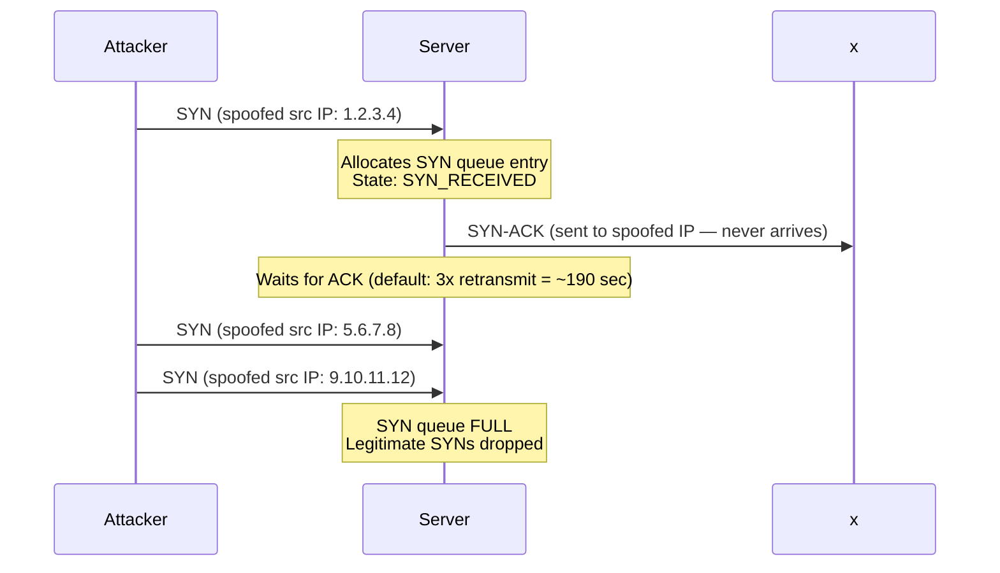
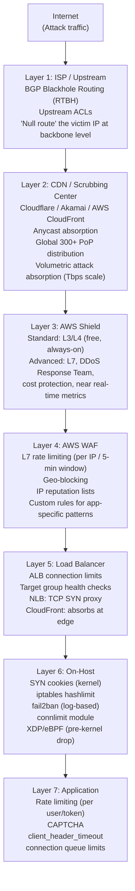

# DDoS Mitigation

## Table of Contents

- [Overview](#overview)
- [DDoS Taxonomy](#ddos-taxonomy)
  - [Volumetric Attacks (Exhaust Bandwidth)](#volumetric-attacks-exhaust-bandwidth)
  - [Protocol Attacks (Exhaust Connection State)](#protocol-attacks-exhaust-connection-state)
  - [Application-Layer Attacks (Exhaust App Resources)](#application-layer-attacks-exhaust-app-resources)
- [Mitigation Layers](#mitigation-layers)
  - [ISP / Upstream: BGP Blackhole (RTBH)](#isp-upstream-bgp-blackhole-rtbh)
  - [CDN / Scrubbing: Anycast Distribution](#cdn-scrubbing-anycast-distribution)
  - [AWS Shield](#aws-shield)
  - [On-Host: eBPF/XDP for DDoS Mitigation](#on-host-ebpfxdp-for-ddos-mitigation)
- [Rate Limiting Algorithms](#rate-limiting-algorithms)
- [Real-World Production Scenario](#real-world-production-scenario)
- [Failure Modes](#failure-modes)
- [Debugging Guide](#debugging-guide)
- [Security Considerations](#security-considerations)
- [Interview Questions](#interview-questions)
  - [Basic](#basic)
  - [Intermediate](#intermediate)
  - [Advanced / Staff Level](#advanced-staff-level)

---

## Overview

Distributed Denial of Service (DDoS) attacks attempt to exhaust a resource — bandwidth, connection state, application threads, or CPU — to make a service unavailable to legitimate users. Modern DDoS attacks are multi-vector, combining volumetric bandwidth saturation with application-layer exhaustion.

This file extends the SYN flood kernel defense material with a complete taxonomy of DDoS attacks, a layered mitigation architecture, and production scenario walkthroughs. The key mental model: DDoS defense is always a **layered response** — no single tool stops all attack types.

---

## DDoS Taxonomy

### Volumetric Attacks (Exhaust Bandwidth)

These attacks flood the target with raw traffic volume, saturating the uplink or transit bandwidth.

**UDP Flood:** Attacker sends UDP packets (often with spoofed source IPs) to random or specific ports. Target spends CPU on ICMP port-unreachable responses. No handshake to exploit, so filtering requires rate limiting or source validation (uRPF — Unicast Reverse Path Forwarding).

**ICMP Flood (Ping flood):** Sends massive volumes of ICMP Echo Requests. Simple to filter but still consumes bandwidth.

**DNS Amplification:** Attacker sends DNS queries with the target's IP as the spoofed source to open DNS resolvers. The query asks for a large record type (DNSKEY, ANY, TXT). The DNS server sends the large response to the victim.

```
Amplification factor = Response size / Query size
Typical DNS amplification: 2-3KB response / 40-byte query = 75x
DNS ANY query response: ~4KB / 40B = 100x
NTP monlist response: ~200 UDP packets per request = 300-700x amplification
```

**Amplification math:** Attacker with 1 Gbps upload can generate 300 Gbps of DNS amplification traffic at the target. This is why 1 Tbps+ DDoS attacks are common — the attacker needs only 1/300th of the attack bandwidth.

**Defense against amplification:** BCP38 (network ingress filtering) prevents source IP spoofing at ISP level. Without spoofing, amplification attacks don't work — the attacker would receive the amplified responses themselves. Unfortunately, BCP38 is not universally deployed.

**NTP Amplification:** The NTP `monlist` command (disabled by default since NTPd 4.2.7p26) returns up to 600 recent client IPs — ~200 UDP packets per request. Factor of 300-700x.

```bash
# Check if your NTP server has monlist enabled (should return error)
ntpdc -c monlist <your-ntp-server>

# Disable in ntp.conf:
# restrict default kod nomodify notrap nopeer noquery
# restrict -6 default kod nomodify notrap nopeer noquery
```

### Protocol Attacks (Exhaust Connection State)

These attacks exploit stateful protocol behavior to exhaust the server's ability to track connections.

**SYN Flood (TCP Half-Open Attack):**



Linux defenses (from Q13 source material — extended):
```bash
# SYN cookies — stateless defense against backlog exhaustion
sysctl net.ipv4.tcp_syncookies=1
# The kernel encodes connection state into the ISN of the SYN-ACK.
# No queue entry allocated. When ACK arrives, state is reconstructed.
# Cost: SACK disabled during SYN cookie mode, window scaling limited.

# Increase SYN backlog (buys time before cookies needed)
sysctl -w net.ipv4.tcp_max_syn_backlog=65536
sysctl -w net.core.somaxconn=65536

# Reduce SYN-ACK retransmission (default 5 = 190 sec wait)
sysctl -w net.ipv4.tcp_synack_retries=2  # 3 retransmits total = ~45 sec

# Rate limit SYNs per source IP
iptables -A INPUT -p tcp --syn -m hashlimit \
  --hashlimit-above 50/sec --hashlimit-burst 100 \
  --hashlimit-mode srcip --hashlimit-name syn_limit \
  -j DROP

# Monitor SYN cookie activation
nstat -z | grep TcpExtTCPReqQFullDoCookies
# Rising counter = SYN cookies are being issued (attack in progress)
```

**SYN cookie trade-offs:**
- SACK (Selective ACK) is disabled — TCP performance degrades during attack
- Window scaling encoded in 3 bits — limited to 8 values
- TCP Fast Open (TFO) is incompatible with SYN cookies
- Acceptable trade-off: degraded performance is better than no connectivity

**RST/ACK Floods:** Send RST or ACK packets to established connections or random ports. Less effective with conntrack state (INVALID packets dropped), but can be used in combination.

### Application-Layer Attacks (Exhaust App Resources)

**HTTP Flood:** Valid HTTP requests, indistinguishable from legitimate traffic. Uses botnets of real IPs to avoid rate limiting per IP. Targets expensive endpoints (search, auth, complex DB queries).

**Slowloris:** Opens many HTTP connections and sends headers very slowly — one header per 10-15 seconds. Apache's thread-per-connection model exhausts threads waiting for complete headers. Nginx's event-driven model is not vulnerable.

```python
# Slowloris attack pattern:
# 1. Open hundreds of HTTP connections
# 2. Send partial HTTP headers (never send "\r\n\r\n" to complete the request)
# 3. Every 15 seconds, send another partial header to keep connection alive
# 4. Apache thread pool exhausted — legitimate requests queued indefinitely
```

**RUDY (R U Dead Yet):** Sends very slow HTTP POST bodies, keeping server connections open by trickling data byte-by-byte. Targets endpoints that read POST body before processing.

**Defense against application-layer attacks:**
- Nginx connection/request limits:
```nginx
limit_conn_zone $binary_remote_addr zone=conn_limit:10m;
limit_req_zone $binary_remote_addr zone=req_limit:10m rate=10r/s;

server {
    limit_conn conn_limit 20;        # Max 20 concurrent connections per IP
    limit_req zone=req_limit burst=20 nodelay;
    client_header_timeout 10s;       # Kill slowloris at header level
    client_body_timeout 10s;         # Kill RUDY at body level
    keepalive_timeout 15s;
}
```
- WAF with rate limiting and behavioral analysis
- CAPTCHA for suspected bots
- AWS WAF rate-based rules

---

## Mitigation Layers



### ISP / Upstream: BGP Blackhole (RTBH)

Remotely Triggered Black Hole routing (RTBH) is the nuclear option — you announce the victim IP as unreachable to your ISP, which propagates via BGP to upstream providers. All traffic to that IP is dropped at the ISP backbone.

**When to use:** When the attack bandwidth (e.g., 500 Gbps) exceeds your ISP's capacity to clean, or when scrubbing center capacity is overwhelmed. The trade-off is total service unavailability vs. network saturation harming other customers on the same link.

**Flowspec (RFC 5575):** More surgical than RTBH — allows you to inject specific BGP route policies (block source IP range, block UDP port 53, rate-limit protocol) into the ISP backbone.

### CDN / Scrubbing: Anycast Distribution

Cloudflare and similar CDNs use **anycast** routing: the same IP address is announced from hundreds of PoPs globally. BGP routes attack traffic to the nearest PoP, which absorbs and filters it. The clean traffic is proxied to the origin.

**Why anycast is effective against volumetric attacks:** A 1 Tbps attack against a single datacenter overwhelms it. A 1 Tbps attack spread across 300 PoPs (each receiving ~3 Gbps) is easily absorbed. The attacker would need 300 Tbps to overwhelm the anycast network.

**Cloudflare Magic Transit:** Extends anycast protection to your own IP space — Cloudflare announces your prefixes via BGP, absorbs attacks, and uses GRE tunnels to forward clean traffic back to your infrastructure.

### AWS Shield

| Feature | Standard | Advanced |
|---|---|---|
| Cost | Free (always on) | $3,000/month + data transfer charges |
| L3/L4 protection | Yes — SYN floods, UDP floods, reflection | Yes |
| L7 protection | No | Yes — integration with WAF |
| DDoS Response Team | No | Yes (24/7 on-call support during active attack) |
| Cost protection | No | Yes — credits for scaling costs during attack |
| Near real-time metrics | No | Yes — attack detection within seconds |
| Proactive engagement | No | Yes — AWS contacts you when attack detected |

**AWS Shield Advanced with Route53:** Protects your DNS infrastructure itself. Route53 is inherently anycast and absorbs DNS-layer DDoS globally.

### On-Host: eBPF/XDP for DDoS Mitigation

XDP (eXpress Data Path) allows eBPF programs to run in the NIC driver before the packet reaches the kernel network stack. This enables:
- Sub-microsecond packet drop decisions (vs. iptables which processes at kernel network layer)
- Line-rate packet filtering (can drop 20+ Mpps on a modern NIC)
- Stateless filtering without conntrack overhead

```c
// XDP program: drop packets from known attack source CIDRs
SEC("xdp")
int ddos_filter(struct xdp_md *ctx) {
    void *data_end = (void *)(long)ctx->data_end;
    void *data     = (void *)(long)ctx->data;
    struct ethhdr *eth = data;

    if ((void *)(eth + 1) > data_end) return XDP_PASS;
    if (eth->h_proto != htons(ETH_P_IP)) return XDP_PASS;

    struct iphdr *ip = (void *)(eth + 1);
    if ((void *)(ip + 1) > data_end) return XDP_PASS;

    // Check source IP against blocklist map (O(1) hash lookup)
    __u32 src_ip = ip->saddr;
    __u32 *verdict = bpf_map_lookup_elem(&blocklist, &src_ip);
    if (verdict && *verdict == 1) return XDP_DROP;  // Drop before sk_buff allocation

    return XDP_PASS;
}
```

**Performance comparison:**
| Method | Packets/sec (drop) | Kernel involvement |
|---|---|---|
| Application-level | ~100K pps | Full stack |
| iptables | ~3-5M pps | Kernel netfilter |
| nftables | ~5-8M pps | Kernel netfilter |
| XDP native | ~20-30M pps | NIC driver level |
| XDP offloaded | Line rate (unlimited) | SmartNIC hardware |

---

## Rate Limiting Algorithms

**Token Bucket:** A bucket holds up to N tokens. Each request consumes one token. Tokens refill at a constant rate. Allows bursting (send N requests instantly if bucket is full) up to the bucket size.

```
Use case: API rate limiting where short bursts are acceptable
Example: 100 req/sec with burst of 500 — client can send 500 requests instantly,
then is limited to 100/sec until bucket refills.
```

**Leaky Bucket:** Requests enter a queue (bucket) and are processed at a constant rate. Overflow is dropped or queued. Smooths bursty traffic into a constant output rate.

```
Use case: Traffic shaping where output must be constant
Network QoS, traffic policing
```

**Sliding Window:** Count requests in the last N seconds using a rolling window. More accurate than fixed windows but requires storing per-client timestamps.

```
AWS WAF rate-based rules: count requests per IP in the last 5-minute window.
Action triggers when count exceeds threshold within any 5-minute period.
```

**Fixed Window:** Count requests per fixed time period (e.g., per minute). Allows 2x the allowed rate at window boundaries (burst at end of one window + start of next).

---

## Real-World Production Scenario

**Scenario:** At 14:00 UTC, network monitoring shows uplink saturation. The 10Gbps WAN link to the datacenter is at 100% utilization. Service is degraded. Upon investigation: inbound UDP traffic is 95% of total, sourced from thousands of IPs, all destined for port 123 (NTP) on a server that is a public NTP time source.

This is an **NTP reflection/amplification attack** — attackers are sending NTP `monlist` queries with the victim's server IP as the source, and hundreds of NTP servers are sending large responses to the victim.

**Mitigation sequence:**

**Minute 0-5: Emergency triage**
```bash
# Identify the attack traffic characteristics
tcpdump -i eth0 -c 1000 -nn 'udp port 123' | awk '{print $3}' | cut -d. -f1-4 | sort | uniq -c | sort -rn | head -20
# You'll see thousands of unique source IPs — these are the NTP servers reflecting traffic

# Confirm it's amplification (not your NTP server generating traffic)
iftop -i eth0 -f 'udp port 123'
# Should show inbound >> outbound

# Check attack volume
ifstat -i eth0 1 5
```

**Minute 5-10: Null route the attacked IP at ISP level (RTBH)**
```bash
# Contact NOC or use automated BGP blackhole trigger
# Announce attacked IP with community string that triggers upstream null route
# ip route 203.0.113.50/32 null0 tag 666  (on router — example)
# This drops all traffic to that IP at ISP backbone — service goes down but network saturation ends
```

**Minute 10-20: Implement iptables filter as backup while coordinating**
```bash
# Rate limit inbound UDP on port 123 (NTP)
iptables -A INPUT -p udp --dport 123 -m limit --limit 100/sec --limit-burst 200 -j ACCEPT
iptables -A INPUT -p udp --dport 123 -j DROP

# Block amplification by dropping UDP packets larger than 512 bytes (small NTP queries are fine)
iptables -A INPUT -p udp --dport 123 -m length --length 512:65535 -j DROP
```

**Minute 20-60: Disable NTP monlist if your server is the source**
```bash
# If your server was misconfigured to allow monlist:
# /etc/ntp.conf — add restrictions to disable monlist
# restrict default noquery
# systemctl restart ntp

# Verify monlist is disabled:
ntpdc -c monlist 127.0.0.1
# Should return: "***Server reports data not found"
```

**Hour 1+: Longer-term mitigation**
- Move the NTP service behind AWS Shield Advanced
- Deploy CloudFront or AWS Global Accelerator as the public IP (shields origin)
- Implement upstream scrubbing by routing prefixes through Cloudflare or Akamai
- Automate BGP RTBH trigger: if inbound traffic on port 123 > 5 Gbps for 60 seconds, automatically announce blackhole route

**Post-incident analysis:**
```bash
# Analyze VPC Flow Logs for attacker IP patterns
# Build CIDR blocklist from attack source analysis
# Look for ASN clusters — amplification attacks often cluster on hosting providers with open resolvers

aws logs start-query \
  --log-group-name '/aws/vpc/flowlogs' \
  --start-time $(date -d '1 hour ago' +%s) \
  --end-time $(date +%s) \
  --query-string '
    fields @timestamp, srcAddr, dstPort, bytes
    | filter dstPort = 123 and bytes > 1000
    | stats sum(bytes) as totalBytes, count() as packets by srcAddr
    | sort totalBytes desc
    | limit 100
  '
```

---

## Failure Modes

| Failure | Symptoms | Detection | Fix |
|---|---|---|---|
| SYN cookie with SACK degradation | Legitimate TCP connections slow during attack | `nstat TcpExtTCPReqQFullDoCookies` rising; retransmission rate up | Escalate to upstream mitigation; tune SYN backlog first to delay cookie activation |
| iptables rate limit overwhelmed | Rate limit rules dropping legitimate traffic | `iptables -L -n -v` shows DROP rule byte counter rising fast; customer complaints | Move to XDP for higher-rate filtering; route attack through scrubbing |
| AWS Shield Advanced miss | L7 attack bypasses Shield (Shield covers L3/L4 automatically) | CloudWatch: high 5xx errors with normal bandwidth | Enable WAF rate-based rules; confirm Shield Advanced WAF integration is configured |
| BGP blackhole collateral damage | All traffic to the IP blocked, not just attack | Intentional trade-off | Accept: service down is better than network saturation affecting other services |
| fail2ban false positives | Legitimate IPs banned after log-based detection | fail2ban.log shows bans; users report access denied | Review fail2ban regex; add whitelist for known-good IPs (monitoring probes, office IPs) |
| CDN absorbs attack but origin hit | CDN cache miss on dynamic content forwards attack requests to origin | Origin error rate rises despite CDN in front | Enable CDN-level rate limiting; cache aggressively; add WAF rules at CDN layer |

---

## Debugging Guide

```bash
# Identify attack type from traffic characteristics
tcpdump -i eth0 -nn -c 5000 2>/dev/null | awk '{print $NF}' | cut -d. -f5 | sort | uniq -c | sort -rn
# High count of SYN = SYN flood
# High count on port 53 with large packets = DNS amplification
# High count on port 123 = NTP amplification
# Diverse ports, large UDP = volumetric UDP flood

# Check SYN queue overflow (SYN flood indicator)
nstat -z | grep -E "TcpExt(TCPReqQFull|SyncookiesFailed|SyncookiesSent|SyncookiesRecv)"
# TcpExtTCPReqQFullDoCookies: SYN cookies issued (under attack)
# TcpExtTCPReqQFullDrop: SYNs dropped (cookies not helping, queue still full)

# Check conntrack table fullness
conntrack -S | grep insert_failed
# insert_failed rising = conntrack table full = new connections dropped

# Monitor bandwidth per protocol
nload -u M eth0
iftop -i eth0

# Count connections by state
ss -s
# High SYN_RECV count = SYN flood
# High CLOSE_WAIT = application not closing connections (slowloris-like)

# Check AWS Shield metrics
aws cloudwatch get-metric-statistics \
  --namespace AWS/DDoSProtection \
  --metric-name DDoSDetected \
  --dimensions Name=ResourceArn,Value=<your-resource-arn> \
  --start-time $(date -d '1 hour ago' -u +%Y-%m-%dT%H:%M:%SZ) \
  --end-time $(date -u +%Y-%m-%dT%H:%M:%SZ) \
  --period 60 --statistics Sum
```

---

## Security Considerations

**BCP38 / uRPF (Unicast Reverse Path Forwarding):** If you operate network infrastructure, implement BCP38 to prevent IP spoofing from your network. Amplification attacks are only possible because ISPs don't all implement egress filtering. Enable `net.ipv4.conf.all.rp_filter=1` on Linux to drop packets with impossible source IPs.

**Attack traffic analysis for intelligence:** Don't just block and forget. Analyze attack source IPs, ASNs, and timing patterns. Attacks from Tor exit nodes, cloud hosting ASNs (DigitalOcean, Linode), and specific geographic clusters indicate botnet composition. Feed this into threat intelligence feeds.

**Rate limiting as a double-edged sword:** Too aggressive rate limiting (blocks > 1k IPs) during an attack can cause false positives blocking legitimate users behind NAT (an office with 200 employees sharing one IP). Use rate limits that are high enough for legitimate human traffic patterns (realistic: 100 req/5min for authenticated users, 10 req/5min for anonymous).

**Amplification remediation — fix open resolvers:** If you run DNS resolvers, restrict them to known clients. Open resolvers (`dig @your-resolver any isc.org`) are weapons that attackers use against others. AWS Route53 Resolver is private by default — only your VPC can use it.

---

## Interview Questions

### Basic

**Q: What are the three categories of DDoS attacks and how do they differ?**
A: Volumetric attacks flood the network with raw traffic (UDP floods, DNS/NTP amplification) to saturate the uplink — measured in Gbps/Tbps. Protocol attacks exploit stateful protocol behavior (SYN floods exhaust the TCP SYN queue, connection state attacks exhaust conntrack) — measured in packets per second. Application-layer attacks send legitimate-looking requests that are expensive to serve (HTTP floods, slowloris, RUDY) — measured in requests per second. Each requires different mitigation: volumetric needs upstream scrubbing, protocol attacks need kernel-level defenses (SYN cookies), application attacks need WAF and application-level rate limiting.

**Q: How do SYN cookies work and what is their trade-off?**
A: SYN cookies eliminate the need to allocate a SYN queue entry for each incoming SYN packet. Instead, the server encodes the connection state (MSS, window scale, timestamp) into the initial sequence number of the SYN-ACK response. When the client completes the handshake with an ACK, the server reconstructs the connection state from the ACK number. This means a SYN flood cannot exhaust the SYN queue. The trade-off: SACK (Selective ACK) is disabled because the connection state encoded in the ISN cannot store SACK options, window scaling is limited to 3 bits (8 values), and TCP Fast Open is incompatible. Performance degrades but the service remains available.

### Intermediate

**Q: How does DNS amplification work and what defenses exist at each layer?**
A: Attacker sends DNS queries to open resolvers with the victim's IP as the spoofed source. A 40-byte query returns a 4KB DNSKEY response — 100x amplification. Defenses layered:

1. ISP layer: BCP38 prevents IP spoofing — without spoofing, the attacker receives the amplified traffic themselves.
2. DNS resolver layer: restrict recursion to known clients, disable `ANY` query type (Response Rate Limiting in BIND/Unbound).
3. Scrubbing center: Cloudflare/Akamai identify amplification patterns (response > query) and filter upstream.
4. Target network: rate limit inbound UDP from known DNS servers, block UDP > 512 bytes on port 53 if you don't need DNSSEC.
5. AWS: Shield Standard detects UDP reflection automatically; Shield Advanced provides near-real-time detection and automated mitigation with DRT support.

### Advanced / Staff Level

**Q: You're the on-call SRE at 3am. Your monitoring shows the uplink is at 100% and the service is down. Walk me through your first 30 minutes of incident response for a suspected DDoS attack.**
A: Minutes 0-2: Verify it's a DDoS, not a configuration issue. Check `ifstat` / `iftop` for inbound vs outbound traffic ratio — DDoS shows asymmetric inbound. Check `ss -s` for connection state distribution — high SYN_RECV indicates SYN flood. Check error logs for patterns. Minutes 2-5: Identify attack type. `tcpdump -i eth0 -c 1000 -nn` to sample traffic — port 123 = NTP amplification, port 53 = DNS amplification, SYN-only = SYN flood, diverse UDP = volumetric. Minutes 5-10: Immediate triage response based on type. SYN flood: verify `tcp_syncookies=1`, check `nstat TcpExtTCPReqQFullDoCookies`. Volumetric: rate limit the attacked protocol with iptables, contact NOC for RTBH if link is saturated. Minutes 10-20: If link is at 100% saturation and no upstream mitigation available, trigger BGP blackhole routing (acceptable: service down vs network down for all customers). Simultaneously, if CloudFront or Shield Advanced is available, route traffic through it. Minutes 20-30: Page the team, create incident ticket, notify stakeholders. Gather attack forensics (source IP patterns, ASNs, timing). If using Shield Advanced, contact DDoS Response Team. Begin post-incident timeline for retrospective. At 30 minutes: you should have either mitigated the attack, engaged upstream scrubbing, or escalated to Shield Advanced DRT with full attack documentation.

**Q: Design a DDoS-resilient architecture for a global e-commerce platform that serves 10M users during peak events like Black Friday.**
A: Layered architecture from outermost to innermost. DNS layer: Route53 with health checks and failover routing; anycast DNS is inherently resistant to DNS-layer attacks. CDN layer: CloudFront as the public-facing endpoint for all traffic — static assets cached, dynamic APIs proxied. CloudFront absorbs volumetric attacks across 400+ PoPs; enable AWS WAF with rate-based rules at CloudFront. Shield Advanced enrolled on all internet-facing resources (CloudFront distributions, ALBs, Route53). Origin layer: ALBs are not public-facing — they are targets of CloudFront only, protected by Security Groups allowing only CloudFront's managed prefix list as source. Connection limits at ALB: `max_connection_per_target` tuning. WAF layer: AWS WAF on CloudFront with rate-based rules per IP (threshold tuned for peak traffic patterns), AWS Managed Rules for OWASP Top 10 and IP reputation lists, custom rules for known attack patterns on your API (Bot Control). Application layer: async processing for expensive operations (search, inventory) to prevent resource exhaustion; circuit breakers to prevent cascade failures during partial outage. Pre-event: run AWS DDoS Resiliency Review with Shield Advanced team; scale out horizontally before peak event to have excess capacity that absorbs attack traffic without degradation; pre-warm CloudFront cache for static assets.
