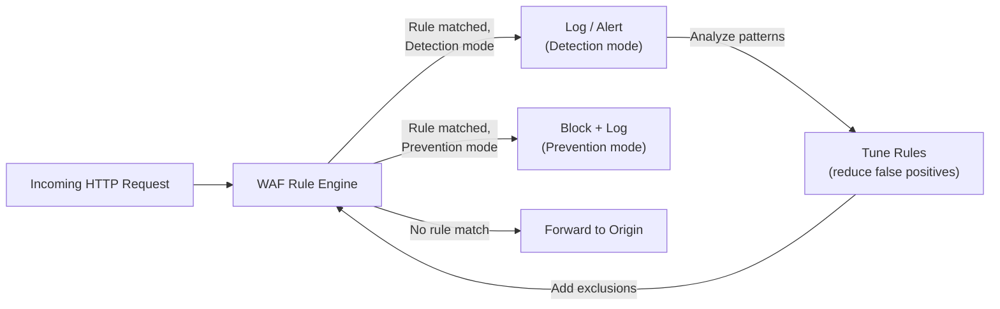
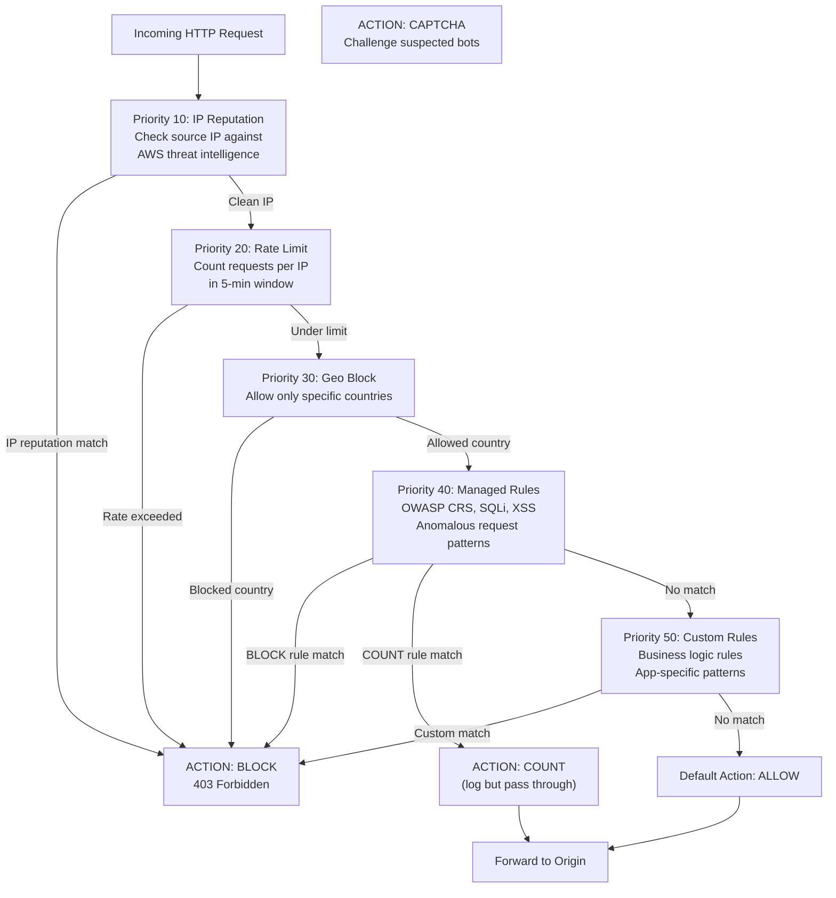
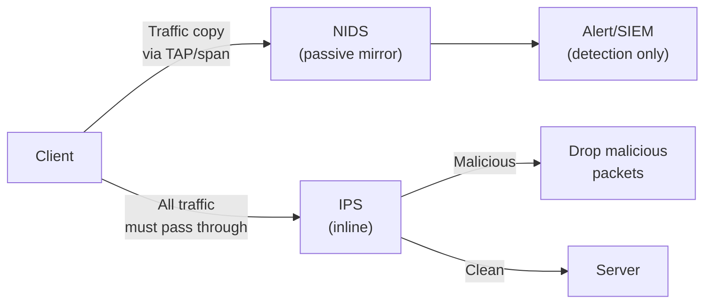
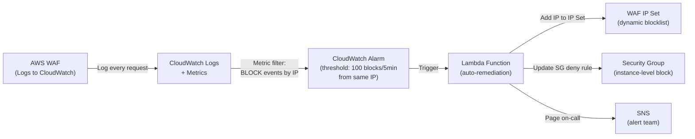

# WAF, IDS, and IPS

## Table of Contents

- [Overview](#overview)
- [WAF (Web Application Firewall)](#waf-web-application-firewall)
  - [WAF Modes](#waf-modes)
- [Rule Sets](#rule-sets)
  - [OWASP ModSecurity Core Rule Set (CRS)](#owasp-modsecurity-core-rule-set-crs)
  - [AWS WAF Rule Groups](#aws-waf-rule-groups)
- [AWS WAF Configuration](#aws-waf-configuration)
  - [Web ACL with Rate Limiting](#web-acl-with-rate-limiting)
  - [WAF Rate Limiting](#waf-rate-limiting)
- [WAF Request Evaluation Flow](#waf-request-evaluation-flow)
- [False Positive Management](#false-positive-management)
- [WAF Bypass Techniques](#waf-bypass-techniques)
- [IDS (Intrusion Detection System)](#ids-intrusion-detection-system)
- [IPS (Intrusion Prevention System)](#ips-intrusion-prevention-system)
- [WAF + IDS/IPS Integration](#waf-idsips-integration)
  - [CloudWatch + Lambda Auto-Response](#cloudwatch-lambda-auto-response)
- [Real-World Production Scenario](#real-world-production-scenario)
- [Failure Modes](#failure-modes)
- [Debugging Guide](#debugging-guide)
- [Security Considerations](#security-considerations)
- [Interview Questions](#interview-questions)
  - [Basic](#basic)
  - [Intermediate](#intermediate)
  - [Advanced / Staff Level](#advanced-staff-level)

---

## Overview

Web Application Firewalls (WAF), Intrusion Detection Systems (IDS), and Intrusion Prevention Systems (IPS) operate at Layer 7 to defend against application-level attacks that network firewalls cannot see. While firewalls control which traffic reaches your application, WAF/IDS/IPS controls what that traffic is allowed to do once it arrives.

The key distinction: a network firewall says "can this IP reach port 443?" — a WAF says "is this HTTP request attempting SQL injection?" These are complementary, not interchangeable.

---

## WAF (Web Application Firewall)

A WAF operates at Layer 7, parsing HTTP requests and responses. It understands HTTP methods, headers, paths, bodies, cookies, and parameters — the full application context that a network firewall cannot see.

**What WAFs protect against (OWASP Top 10):**
- SQL injection (`' OR 1=1 --`)
- Cross-site scripting (XSS) (`<script>alert(1)</script>`)
- Command injection (`;ls -la`)
- Path traversal (`../../../etc/passwd`)
- Remote file inclusion
- Protocol anomalies (malformed HTTP headers, oversized cookies)
- Credential stuffing (high-rate login attempts)
- API abuse

**What WAFs do NOT protect against:**
- Logic flaws in the application (WAF can't understand business logic)
- Encrypted payload attacks (WAF only sees what it can decode)
- Zero-day attacks without signatures
- Attacks from authenticated, legitimate-looking requests

### WAF Modes

Always start in **detection mode** (log only), tune until false positive rate is acceptable, then switch to **prevention mode** (block).



**Rule of thumb for production WAF deployment:**
1. Deploy in COUNT mode (log, never block) — 2 weeks minimum
2. Analyze false positive patterns: which rule IDs fire on legitimate traffic?
3. Add exclusions for confirmed false positives
4. Move to BLOCK mode rule by rule, starting with highest-confidence rules
5. Monitor customer error rates after each rule moves to BLOCK

---

## Rule Sets

### OWASP ModSecurity Core Rule Set (CRS)

The industry-standard open-source WAF rule set. Over 200 rules covering the OWASP Top 10. Uses a paranoia level system (1-4) where higher levels catch more attacks but produce more false positives.

```
Paranoia Level 1: Low false positives, high-confidence rules only — good for most production sites
Paranoia Level 2: Adds rules for less common attack patterns
Paranoia Level 3: Aggressive rules — may block legitimate complex applications
Paranoia Level 4: Maximum — for high-security environments with careful tuning
```

**Anomaly scoring:** CRS uses a scoring system rather than immediate block. Each matched rule adds to an anomaly score. Only when the score exceeds a threshold (e.g., 5) is the request blocked. This reduces false positives — one quirky header doesn't block the request; it takes multiple indicators.

### AWS WAF Rule Groups

AWS WAF organizes rules into **rule groups** within a **Web ACL (Access Control List)**.

```
Web ACL
├── Rule Group: AWS-AWSManagedRulesCommonRuleSet (OWASP basics)
│   ├── SizeRestrictions_BODY
│   ├── NoUserAgent_HEADER
│   ├── SQLi_BODY
│   └── XSS_BODY
├── Rule Group: AWS-AWSManagedRulesKnownBadInputsRuleSet
├── Rule Group: AWS-AWSManagedRulesAmazonIpReputationList
├── Rule Group: AWSManagedRulesBotControlRuleSet (paid add-on)
├── Custom Rule: Rate-based (IP rate limiting)
├── Custom Rule: Geo-block (block specific countries)
└── Default Action: ALLOW
```

**Rule capacity (WCU — WAF Capacity Units):** AWS WAF limits Web ACLs to 1500 WCU. Complex regex rules cost more WCU than simple string matches. Rate-based rules cost 2 WCU.

---

## AWS WAF Configuration

### Web ACL with Rate Limiting

```hcl
# Terraform: AWS WAF Web ACL with rate limiting and managed rules
resource "aws_wafv2_web_acl" "main" {
  name  = "production-waf"
  scope = "REGIONAL"  # or "CLOUDFRONT" for CloudFront distributions

  default_action {
    allow {}
  }

  # Rule 1: AWS IP Reputation List (block known malicious IPs)
  rule {
    name     = "AWSManagedRulesAmazonIpReputationList"
    priority = 10

    override_action { none {} }  # Use managed rule's default action

    statement {
      managed_rule_group_statement {
        name        = "AWSManagedRulesAmazonIpReputationList"
        vendor_name = "AWS"
      }
    }
    visibility_config {
      cloudwatch_metrics_enabled = true
      metric_name                = "AWSManagedRulesAmazonIpReputationList"
      sampled_requests_enabled   = true
    }
  }

  # Rule 2: Rate limiting — block IPs sending > 2000 req/5 min
  rule {
    name     = "RateLimitPerIP"
    priority = 20

    action {
      block {}
    }

    statement {
      rate_based_statement {
        limit              = 2000
        aggregate_key_type = "IP"
      }
    }
    visibility_config {
      cloudwatch_metrics_enabled = true
      metric_name                = "RateLimitPerIP"
      sampled_requests_enabled   = true
    }
  }

  # Rule 3: OWASP Core Rule Set
  rule {
    name     = "AWSManagedRulesCommonRuleSet"
    priority = 30

    override_action { none {} }

    statement {
      managed_rule_group_statement {
        name        = "AWSManagedRulesCommonRuleSet"
        vendor_name = "AWS"

        # Override a specific rule to COUNT instead of BLOCK (for tuning)
        rule_action_override {
          name = "SizeRestrictions_BODY"
          action_to_use {
            count {}  # Log but don't block — tune first
          }
        }
      }
    }
    visibility_config {
      cloudwatch_metrics_enabled = true
      metric_name                = "AWSManagedRulesCommonRuleSet"
      sampled_requests_enabled   = true
    }
  }

  visibility_config {
    cloudwatch_metrics_enabled = true
    metric_name                = "ProductionWAF"
    sampled_requests_enabled   = true
  }
}
```

### WAF Rate Limiting

AWS WAF rate-based rules count requests over a **5-minute sliding window**. If an IP exceeds the threshold within any 5-minute window, it is blocked for a period.

```
Rate limit = 2000 requests per 5 minutes = ~6.7 req/sec sustained
Burst behavior: A client can send 2000 requests in the first minute and
then be blocked for the remainder of the 5-minute window.
```

**Granular rate limiting (AWS WAF v2):**
```hcl
# Rate limit based on custom header (e.g., per API key)
statement {
  rate_based_statement {
    limit              = 100
    aggregate_key_type = "CUSTOM_KEYS"
    custom_keys {
      header {
        name               = "X-Api-Key"
        text_transformation {
          priority = 0
          type     = "NONE"
        }
      }
    }
  }
}
```

---

## WAF Request Evaluation Flow



---

## False Positive Management

False positives are legitimate requests that match WAF rules. This is the primary operational challenge of WAF management.

**Common false positive scenarios:**
- Marketing content with `<script>` tags in the body (XSS rule fires)
- GraphQL queries with deeply nested structures (body size rules fire)
- Rich text editors sending HTML content (XSS rules fire)
- Developer tools POSTing JSON with SQL field names (`SELECT` in a product name)
- Monitoring probes with unusual User-Agent headers

**Identification workflow:**
```bash
# 1. Query WAF logs in CloudWatch Logs Insights
fields @timestamp, httpRequest.clientIp, httpRequest.uri, terminatingRuleId, action
| filter action = "BLOCK"
| stats count(*) as blockCount by terminatingRuleId, httpRequest.uri
| sort blockCount desc
| limit 50

# 2. Find specific blocked requests to a known-good endpoint
fields @timestamp, httpRequest.clientIp, httpRequest.uri, terminatingRuleId, httpRequest.headers
| filter httpRequest.uri = "/api/v1/products" and action = "BLOCK"
| limit 20
```

**Adding rule exclusions in AWS WAF:**
```hcl
managed_rule_group_statement {
  name        = "AWSManagedRulesCommonRuleSet"
  vendor_name = "AWS"

  # Exclude XSS body rule for specific path where HTML content is expected
  managed_rule_group_configs {
    # Not available for all managed rules — use rule_action_override instead
  }

  rule_action_override {
    name = "CrossSiteScripting_BODY"
    action_to_use {
      count {}  # Count but don't block — monitor the false positive
    }
  }
}
```

**Scope-down statements:** Apply a rule only to specific URIs or methods, reducing false positive scope:
```hcl
statement {
  rate_based_statement {
    limit              = 100
    aggregate_key_type = "IP"
    # Only apply rate limit to the login endpoint
    scope_down_statement {
      byte_match_statement {
        field_to_match { uri_path {} }
        positional_constraint = "STARTS_WITH"
        search_string         = "/auth/login"
        text_transformation { priority = 0; type = "NONE" }
      }
    }
  }
}
```

---

## WAF Bypass Techniques

Understanding bypass techniques is essential for SREs — you need to know how attackers evade detection to properly configure WAF rules.

**URL Encoding bypass:**
```
Normal:    /api?id=1' OR '1'='1
Encoded:   /api?id=1%27%20OR%20%271%27%3D%271
Double-encoded: /api?id=1%2527%2520OR%2520%25271%2527%253D%25271

Defense: Configure WAF to decode URL encoding before matching.
AWS WAF text transformations: URL_DECODE, HTML_ENTITY_DECODE, BASE64_DECODE
```

**Unicode normalization bypass:**
```
Normal:    <script>
Unicode:   ＜ｓｃｒｉｐｔ＞  (fullwidth characters, map to ASCII after normalization)
Unicode escape: \u003cscript\u003e

Defense: Apply LOWERCASE and URL_DECODE transformations before matching.
```

**Case manipulation:**
```
SQLi: SELECT → SeLeCt → sElEcT
XSS: <SCRIPT> → <sCrIpT> → <ScRiPt>

Defense: Apply LOWERCASE transformation before string matching.
```

**HTTP parameter pollution:**
```
/search?q=legitimate&q=<script>evil</script>
Some frameworks use the first value, others use the last.
If WAF checks first param but app uses second, WAF is bypassed.

Defense: Normalize parameter handling; WAF should evaluate all parameter occurrences.
```

**Chunked transfer encoding:**
```
Attacker sends request with Transfer-Encoding: chunked
Splits malicious payload across multiple HTTP chunks
Some WAFs analyze each chunk independently instead of reassembling

Defense: WAF must reassemble chunked bodies before analysis.
```

**Why this matters operationally:** When tuning WAF rules, verify your rules apply all relevant text transformations. A rule that matches `SELECT` but not `sElEcT` is trivially bypassed.

---

## IDS (Intrusion Detection System)

IDS passively monitors network traffic, comparing it against signatures or behavioral baselines, and generates alerts. It does not block traffic — it only detects and logs.

**Signature-based IDS:** Maintains a database of known attack patterns (Snort rules, Suricata rules). Fast and low false-positive rate for known attacks. Cannot detect zero-days.

**Anomaly-based IDS:** Builds a baseline of normal traffic patterns. Alerts when behavior deviates significantly. Higher false positive rate but can detect novel attacks.

```
Snort rule syntax example:
alert tcp any any -> $HOME_NET 22 (msg:"SSH Brute Force Attempt"; \
  flow:to_server,established; content:"SSH"; \
  detection_filter:track by_src, count 10, seconds 30; \
  sid:1000100; rev:1;)

This rule: alerts when a source IP sends 10+ SSH authentication attempts to port 22
in 30 seconds — classic brute force pattern.
```

**IDS placement:**
- **Network IDS (NIDS):** Span port or TAP on a network switch, receives a copy of all traffic without being in the data path. No latency impact. Cannot decrypt TLS without key material.
- **Host-based IDS (HIDS):** Runs on the individual host, monitors system calls, file access, process behavior. Auditd, OSSEC, Falco (Kubernetes), osquery.

---

## IPS (Intrusion Prevention System)

IPS is IDS deployed inline — it can drop packets. This adds latency (inline processing) but enables active defense.

**IPS vs IDS deployment:**


**AWS Network Firewall as IPS:**

AWS Network Firewall supports Suricata-compatible stateful rules for IDS/IPS functionality:

```yaml
# Suricata rule: detect and block Log4Shell exploitation attempt
alert http any any -> $HTTP_SERVERS any (
  msg:"ET EXPLOIT Apache Log4j RCE Attempt (jndi)";
  flow:established,to_server;
  http.request_body;
  content:"jndi:";
  nocase;
  pcre:"/jndi\s*:/i";
  sid:2034647;
  rev:2;
)

# Suricata rule: block C2 beaconing (periodic connections to unusual external IPs)
alert tcp $HOME_NET any -> $EXTERNAL_NET !$COMMON_PORTS (
  msg:"Possible C2 Beaconing - HTTP to non-standard port";
  flow:established,to_server;
  content:"GET ";
  http.method;
  detection_filter:track by_src, count 10, seconds 3600;
  sid:1000200;
  rev:1;
)
```

**IPS latency consideration:** An inline IPS adds 1-5ms latency to every packet. For latency-sensitive applications (financial trading, real-time communication), the trade-off must be evaluated. Options: offload IPS to a dedicated inline appliance with DPDK, deploy IPS at the perimeter only (not on every service-to-service path).

---

## WAF + IDS/IPS Integration

### CloudWatch + Lambda Auto-Response



```python
# Lambda: auto-add attacker IP to WAF IP set
import boto3
import json

wafv2 = boto3.client('wafv2')

def handler(event, context):
    # Parse CloudWatch alarm — extract attacker IP
    attacker_ip = extract_attacker_ip(event)

    # Get current IP set
    response = wafv2.get_ip_set(
        Name='dynamic-blocklist',
        Scope='REGIONAL',
        Id='xxxxxxxx-xxxx-xxxx-xxxx-xxxxxxxxxxxx'
    )

    current_addresses = response['IPSet']['Addresses']
    lock_token = response['LockToken']

    # Add new IP (CIDR notation required)
    new_addresses = current_addresses + [f'{attacker_ip}/32']

    wafv2.update_ip_set(
        Name='dynamic-blocklist',
        Scope='REGIONAL',
        Id='xxxxxxxx-xxxx-xxxx-xxxx-xxxxxxxxxxxx',
        Addresses=new_addresses,
        LockToken=lock_token
    )

    print(f"Blocked {attacker_ip} in WAF IP set")
```

---

## Real-World Production Scenario

**Scenario:** After deploying AWS WAF with managed rule groups on the API Gateway, your engineering team reports that `POST /api/v1/products` is returning HTTP 403 for all product creation requests since the WAF was enabled. Product creation requires sending HTML-formatted descriptions in the request body, which is triggering XSS rules.

**Diagnosis workflow:**

**Step 1: Identify the blocking rule**
```bash
# CloudWatch Logs Insights — find blocking rule for this endpoint
fields @timestamp, httpRequest.uri, terminatingRuleId, terminatingRuleMatchDetails
| filter httpRequest.uri = "/api/v1/products" and action = "BLOCK"
| limit 20
```
Result: `terminatingRuleId: CrossSiteScripting_BODY` — the XSS body inspection rule is matching the HTML content field.

**Step 2: Confirm it's a false positive**
```bash
# Look at the matched request details
fields terminatingRuleMatchDetails
| filter terminatingRuleId = "CrossSiteScripting_BODY"
| limit 5
```
The matched data shows `<p>Product description</p>` — legitimate HTML content from a rich text editor, not an XSS attack.

**Step 3: Scope the exclusion precisely**

Option A: Override the XSS rule to COUNT only on this specific endpoint (still logs, doesn't block):
```hcl
rule_action_override {
  name = "CrossSiteScripting_BODY"
  action_to_use {
    count {}
  }
}
```

Option B: More precise — apply the XSS rule but exclude the `description` field:
In AWS WAF, this requires a custom rule with a negative match condition, or using WAF Labels to handle the exception.

Option C: Best practice — require the HTML to be Base64-encoded by the client and decode server-side. The WAF no longer sees HTML in the body. Update the API contract and mobile/web clients to encode the description field.

**Step 4: Validate the fix**
```bash
# Test the endpoint directly
curl -X POST https://api.example.com/api/v1/products \
  -H "Content-Type: application/json" \
  -d '{"name":"Test","description":"<p>Test product</p>"}' \
  -w "%{http_code}\n"
# Should return 200, not 403

# Monitor COUNT rule to ensure XSS attacks are still being detected
# (even if they pass through for this endpoint, they are logged)
```

---

## Failure Modes

| Failure | Symptoms | Detection | Fix |
|---|---|---|---|
| WAF false positives | Legitimate requests blocked (403), user complaints | WAF logs show BLOCK for known-good traffic patterns | Override rule to COUNT for affected paths; add scope-down statement |
| WAF in COUNT mode never moved to BLOCK | Security posture theater — WAF present but not blocking | AWS Config rule checking WAF default action; security audit | Migrate rules to BLOCK incrementally, starting with highest-confidence |
| Rate limit too aggressive | Office IP range blocked (NAT with many users) | Customer reports, IP in WAF blocked list is a corporate NAT | Add IP whitelist for corporate ranges; increase rate limit threshold |
| IPS generating too many false positives | Legitimate traffic dropped, alerts storm | High alert volume, service degradation | Tune Suricata rules; use IDS mode (alert only) first, then tune to block |
| WAF log ingestion lag | Slow detection of active attacks | CloudWatch Logs ingestion latency (can be 5-10 min) | Use WAF sampled requests for near real-time inspection; consider WAF Kinesis Firehose for near real-time logs |
| Managed rule group update causes regression | New block after AWS updates managed rules | Sudden increase in 403 errors after rule group version update | Pin managed rule groups to a specific version; use override to COUNT before new rules; test in staging |

---

## Debugging Guide

```bash
# AWS WAF: Query blocked requests in last hour
aws wafv2 get-sampled-requests \
  --web-acl-arn arn:aws:wafv2:us-east-1:123456789:regional/webacl/production/xxxxx \
  --rule-metric-name AWSManagedRulesCommonRuleSet \
  --scope REGIONAL \
  --time-window StartTime=$(date -d '1 hour ago' +%s),EndTime=$(date +%s) \
  --max-items 500

# List all Web ACLs and their associations
aws wafv2 list-web-acls --scope REGIONAL
aws wafv2 list-resources-for-web-acl --web-acl-arn <arn>

# CloudWatch Logs Insights — top blocked IPs
fields @timestamp, httpRequest.clientIp, terminatingRuleId
| filter action = "BLOCK"
| stats count(*) as blocks by httpRequest.clientIp
| sort blocks desc
| limit 20

# Test a WAF rule without deploying (use AWS WAF console Test function)
# or use the API:
aws wafv2 check-capacity --scope REGIONAL \
  --rules file://test-rules.json

# Snort/Suricata rule testing
suricata -T -c /etc/suricata/suricata.yaml  # Test config validity
suricata --runmode=single -r test.pcap -c /etc/suricata/suricata.yaml  # Test rules against pcap
```

---

## Security Considerations

**WAF is not a substitute for secure code.** A WAF is a compensating control — it reduces the attack surface but cannot fix application vulnerabilities. A WAF protecting a SQL-injectable application is a race between attackers finding bypasses and your WAF team tuning rules. The correct fix is parameterized queries in the application.

**WAF bypass persistence:** Attackers actively research WAF bypass techniques for popular WAF products (AWS WAF, ModSecurity). AWS regularly updates managed rules, but custom rules require manual maintenance. Subscribe to AWS Security bulletins and update rules proactively.

**IPS and latency SLAs:** Every millisecond of latency matters in customer-facing applications. Measure the latency added by your IPS with `ab` or `wrk` before and after deployment. If latency impact exceeds your SLA budget, consider sampling (inspect 10% of traffic) or deploying IPS only at the perimeter, not inline on every service.

**Log retention for forensics:** WAF logs are essential post-incident forensic material. Retain WAF logs for at least 90 days (PCI DSS requires 1 year with 3 months immediately available). Use S3 lifecycle policies to move logs to Glacier after 90 days.

---

## Interview Questions

### Basic

**Q: What is the difference between a WAF and a network firewall?**
A: A network firewall operates at L3/L4 and makes decisions based on IP addresses, ports, and protocols. It can't understand the content of HTTP requests. A WAF operates at L7 and understands the HTTP protocol — it can inspect URL parameters, request bodies, headers, and cookies. A WAF can detect SQL injection in a query parameter because it parses the HTTP request; a network firewall only sees that port 443 traffic arrived from an IP address. They are complementary — network firewalls control which traffic reaches the application, WAFs control what that traffic can do.

**Q: Why should you always deploy a WAF in detection mode first?**
A: WAF rules generate false positives — legitimate traffic that looks like an attack. A new WAF in prevention mode will immediately block legitimate users, causing a production incident. Starting in detection (COUNT) mode lets you observe which rules fire on your actual traffic pattern for 1-4 weeks, identify and tune away false positives, then switch to prevention mode rule by rule with confidence. Rushing to prevention mode is a common mistake that results in late-night pages from engineers unable to use the admin console because the WAF blocked their request.

### Intermediate

**Q: How would you configure AWS WAF to rate limit login attempts specifically, without affecting other API endpoints?**
A: Use a rate-based rule with a `scope_down_statement` that restricts the rate limit to only the login endpoint. Configure `aggregate_key_type = "IP"` with `limit = 50` (50 attempts per 5 minutes — stricter than general rate limiting). The scope-down statement matches `httpRequest.uri starts_with "/auth/login"` — the rate limit counter only increments for requests to that specific path. Additionally, consider using `aggregate_key_type = "CUSTOM_KEYS"` with the `X-Forwarded-For` header if you're behind a proxy (to count per real client IP, not proxy IP). Set the action to BLOCK for the rate-limited requests, and separately set a CAPTCHA action at a lower threshold (e.g., 10 attempts) before blocking.

**Q: An attacker is sending SQL injection attempts but bypassing your WAF using double URL encoding. How do you fix this?**
A: Add URL_DECODE text transformation to the WAF rule that checks for SQLi patterns. AWS WAF text transformations are applied before the rule matching: `text_transformation { priority = 0; type = "URL_DECODE" }`. For double encoding, chain transformations: apply `URL_DECODE` twice. In ModSecurity/CRS, transformation are configured with `t:urlDecodeUni` or `t:urlDecodeRecursive`. The root cause is that the WAF was matching against the raw encoded string, which didn't match the SQLi pattern. The application decodes the URL first, sees the SQLi payload, and executes it. WAF must decode input the same way the application does before matching.

### Advanced / Staff Level

**Q: You're the WAF owner for a large SaaS platform with 500 APIs across 20 teams. How do you manage WAF rules at scale without becoming a bottleneck?**
A: The organizational challenge is as important as the technical one. Architecture: central Web ACL owned by the security/platform team with global managed rule groups (IP reputation, bot control, OWASP CRS). Per-team rule groups with delegate ownership — each team can add/modify rules in their rule group via IaC (Terraform modules), subject to code review. Governance: enforce WAF rule changes through a GitOps pipeline — no direct console access to WAF. Policy-as-code with OPA (Open Policy Agent) to validate rule syntax and ensure all rules follow the exclusion documentation standard (every exclusion needs a bug ticket reference). Monitoring: centralized CloudWatch dashboard showing block rates, false positive trends, and rule coverage per team. Weekly review: teams review their WAF block logs in a shared Grafana dashboard. Escalation path: team proposes an exclusion → security team reviews → merged in 24 hours for breaking issues, 1 week for non-urgent tuning. The key failure mode to avoid: teams start bypassing the WAF by adding custom headers that trigger rule exclusions, effectively self-exempting from security rules. Prevent this with periodic WAF coverage audits using automated scanning (OWASP ZAP against staging) to verify rules actually catch attacks.

**Q: Walk through the complete post-incident forensic analysis you would perform after a confirmed WAF bypass and successful SQL injection attack.**
A: Phase 1 — Scope the breach. Query WAF logs for the attacker IP across the full retention window — was this the first attempt or were there prior probing attempts? Use CloudWatch Logs Insights to find all requests from the attacker IP. Identify which parameter was exploited and whether the bypass used encoding. Phase 2 — Determine what data was accessed. Correlate WAF timestamps with database query logs. If using RDS, check `general_log` (should only be enabled temporarily during forensics — significant performance impact). Check Aurora's `aws_audit_log` which captures all queries. Identify the specific SQL commands that were injected and what tables/rows were accessed. Phase 3 — Assess the bypass technique. Decode the request exactly as the WAF and application would decode it. Identify which text transformation was missing in the WAF rule. Write a test case that reproduces the bypass. Phase 4 — Remediate. Fix the application vulnerability (parameterized queries) — WAF fix is secondary. Add the missing text transformation to the WAF rule. Write a custom WAF rule that catches the specific bypass pattern observed. Add the attacker's IP range to the WAF IP blocklist. Phase 5 — Prevent recurrence. Add the bypass technique to your WAF test suite — run OWASP ZAP against staging with custom payloads. Enable WAF Bot Control to catch future probing attempts. Review all other API endpoints for the same vulnerability pattern. File a security incident report with timeline, impact scope (number of records accessed), regulatory notification requirements (GDPR 72-hour window, HIPAA, PCI DSS).
