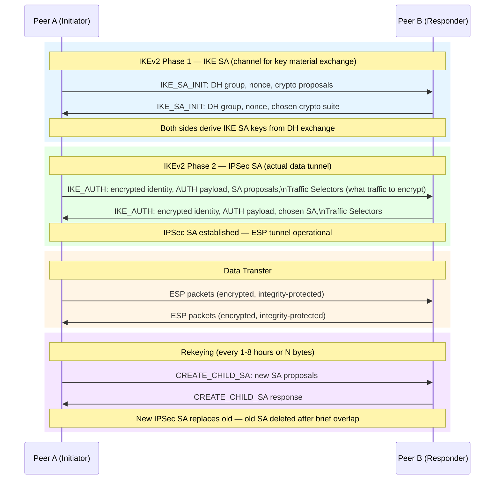
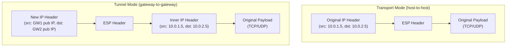
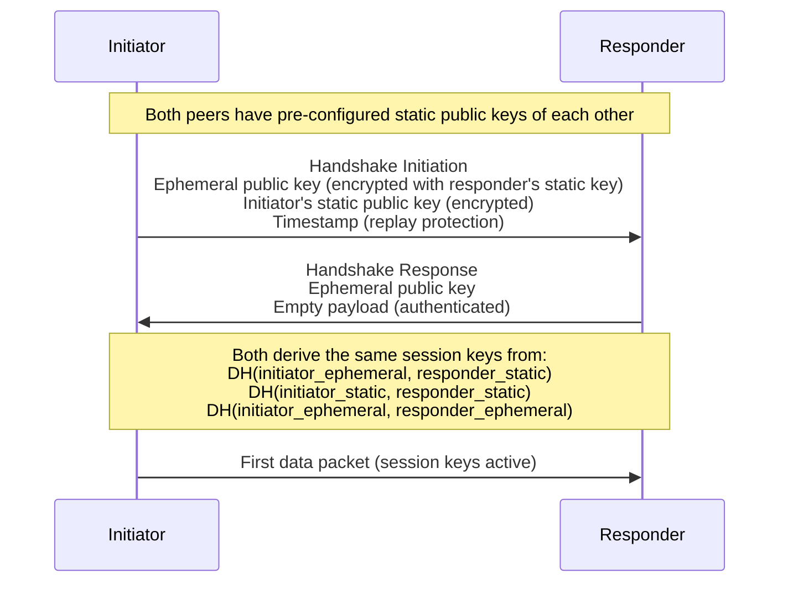
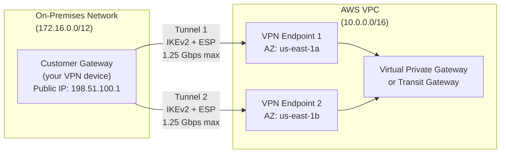
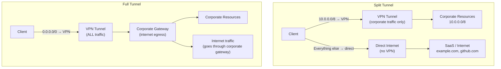

# VPN Technologies

## Table of Contents

- [Overview](#overview)
- [IPSec Architecture](#ipsec-architecture)
  - [IKE (Internet Key Exchange) — Phase-Based Architecture](#ike-internet-key-exchange-phase-based-architecture)
  - [IKEv1 vs IKEv2](#ikev1-vs-ikev2)
  - [ESP vs AH](#esp-vs-ah)
  - [Transport vs Tunnel Mode](#transport-vs-tunnel-mode)
- [WireGuard](#wireguard)
  - [WireGuard Cryptography (Noise Protocol Framework)](#wireguard-cryptography-noise-protocol-framework)
  - [WireGuard Configuration](#wireguard-configuration)
- [WireGuard vs OpenVPN vs IPSec Comparison](#wireguard-vs-openvpn-vs-ipsec-comparison)
- [AWS Site-to-Site VPN](#aws-site-to-site-vpn)
- [Split Tunneling vs Full Tunnel](#split-tunneling-vs-full-tunnel)
- [Perfect Forward Secrecy (PFS)](#perfect-forward-secrecy-pfs)
- [WireGuard in Kubernetes](#wireguard-in-kubernetes)
  - [Cilium WireGuard Node-to-Node Encryption](#cilium-wireguard-node-to-node-encryption)
  - [Calico WireGuard Encryption](#calico-wireguard-encryption)
- [Real-World Production Scenario](#real-world-production-scenario)
- [Failure Modes](#failure-modes)
- [Debugging Guide](#debugging-guide)
- [Security Considerations](#security-considerations)
- [Interview Questions](#interview-questions)
  - [Basic](#basic)
  - [Intermediate](#intermediate)
  - [Advanced / Staff Level](#advanced-staff-level)

---

## Overview

Virtual Private Networks (VPNs) create encrypted tunnels between endpoints over untrusted networks. For Senior SREs, VPN knowledge spans from kernel-level protocol mechanics to cloud site-to-site connectivity and Kubernetes node encryption.

The fundamental problem VPNs solve: you need encrypted, authenticated connectivity between two points that don't share a physical network. The key design decisions are: which key exchange protocol, which encryption, transport vs tunnel mode, and how to handle key rotation and high availability.

---

## IPSec Architecture

IPSec (RFC 4301) is a suite of protocols that provides authentication, integrity, and encryption at the IP layer. It is the foundation of most site-to-site VPNs.

### IKE (Internet Key Exchange) — Phase-Based Architecture

IPSec key management is done by IKE, which negotiates Security Associations (SAs).



### IKEv1 vs IKEv2

| Property | IKEv1 | IKEv2 |
|---|---|---|
| Messages for Phase 1 | 9 (main mode) or 6 (aggressive mode) | 4 |
| Messages for Phase 2 | 3 | 2 (CREATE_CHILD_SA) |
| EAP authentication | No | Yes (supports user credentials, certificates) |
| MOBIKE (IP mobility) | No | Yes (reconnect after IP change — mobile clients) |
| Built-in liveness check | No (DPD added as extension) | Yes (IKE_KEEPALIVE) |
| Amplification vulnerability | Yes (aggressive mode) | No |
| RFC | 2407, 2408, 2409 | 7296 |

**IKEv2 MOBIKE (RFC 4555):** When a mobile client changes network (e.g., Wi-Fi to LTE), the IP address changes. MOBIKE allows the IKEv2 tunnel to survive IP changes without renegotiating Phase 1, enabling seamless VPN reconnection for mobile devices.

### ESP vs AH

| Protocol | IP Protocol | What it protects | NAT traversal |
|---|---|---|---|
| **ESP** (Encapsulating Security Payload) | 50 | Payload encryption + integrity + optionally IP header | Works with NAT-T (UDP encapsulation port 4500) |
| **AH** (Authentication Header) | 51 | Integrity of entire IP packet including header | Does NOT work with NAT (NAT changes IP headers which AH covers) |

**In practice:** Almost all deployments use ESP. AH is rarely used because it breaks NAT, which is ubiquitous. ESP with null encryption provides authentication without encryption (useful for integrity-only tunnel at high speed).

### Transport vs Tunnel Mode



**Transport mode:** Used for host-to-host IPSec (both endpoints are the IPSec endpoints). The original IP header is not encrypted — only the payload. Lower overhead, but exposes source/destination IPs.

**Tunnel mode:** Used for VPN gateways. The entire original IP packet (header + payload) is encapsulated inside a new IP packet. The inner packet's source and destination IPs are hidden. Standard for site-to-site VPNs — the gateway adds a new outer IP header for transit across the internet.

---

## WireGuard

WireGuard is a modern VPN protocol built into the Linux kernel (5.6+, March 2020). It is designed to be cryptographically opinionated (no negotiation — fixed algorithms), simple (~4,000 lines of code vs OpenVPN's ~400,000), and fast.

### WireGuard Cryptography (Noise Protocol Framework)

WireGuard uses the **Noise protocol framework** (specifically `Noise_IKpsk2_25519_ChaChaPoly_BLAKE2s`):

| Component | Algorithm | Purpose |
|---|---|---|
| Key exchange | Curve25519 (ECDH) | Ephemeral key agreement |
| Symmetric encryption | ChaCha20-Poly1305 | AEAD encryption (fast without AES-NI) |
| Hash / PRF | BLAKE2s | Key derivation, MAC |
| Identity | Static Curve25519 keys | Peer authentication (no PKI) |

**WireGuard handshake (simplified):**


**Key design choices:**
- **No certificate hierarchy:** Peers authenticate each other using pre-configured Curve25519 public keys. Simple and fast, but key distribution is manual (or handled by a management plane like Tailscale).
- **Silent drop of unknown packets:** If a packet arrives from an IP not associated with any known peer's public key, it is silently dropped. No unauthenticated response is sent — WireGuard is dark to unauthorized probers.
- **Stateless packet processing:** No connection state beyond the session keys. A new handshake occurs every 5 minutes (rekeying) or after 180 seconds of silence.
- **Roaming support:** Packets from a known peer key are accepted regardless of source IP — enables mobile clients to switch networks.

### WireGuard Configuration

```ini
# /etc/wireguard/wg0.conf — Server
[Interface]
Address = 10.10.0.1/24
ListenPort = 51820
PrivateKey = <server_private_key>

# Enable IP forwarding and NAT for internet access through the VPN
PostUp = iptables -A FORWARD -i %i -j ACCEPT; iptables -t nat -A POSTROUTING -o eth0 -j MASQUERADE
PostDown = iptables -D FORWARD -i %i -j ACCEPT; iptables -t nat -D POSTROUTING -o eth0 -j MASQUERADE

# Peer: client laptop
[Peer]
PublicKey = <client_public_key>
AllowedIPs = 10.10.0.2/32   # Only this IP is routed through the tunnel

# Peer: remote office gateway
[Peer]
PublicKey = <office_gw_public_key>
AllowedIPs = 10.10.0.3/32, 192.168.1.0/24  # VPN IP + office subnet
Endpoint = office.example.com:51820
PersistentKeepalive = 25  # Send keepalive every 25s (needed when behind NAT)
```

```bash
# Start/stop interface
wg-quick up wg0
wg-quick down wg0

# Show WireGuard status
wg show wg0
# Shows: peers, latest handshake time, transfer bytes, allowed IPs

# Test connectivity
ping 10.10.0.1  # From client, ping server VPN IP
```

---

## WireGuard vs OpenVPN vs IPSec Comparison

| Property | WireGuard | OpenVPN | IPSec (IKEv2) |
|---|---|---|---|
| Code size | ~4,000 LoC | ~400,000 LoC | Complex (many RFCs) |
| Protocol layer | L3 (IP) | L3 (IP) via TUN or L2 via TAP | L3 (IP) |
| Key exchange | Noise protocol (static + ephemeral Curve25519) | TLS (OpenSSL) | IKEv2 |
| Cipher flexibility | Fixed (ChaCha20-Poly1305 / AES-256-GCM) | Highly configurable | Negotiated |
| Throughput | Highest (~10 Gbps on modern hardware) | Medium (~1-2 Gbps) | High (hardware acceleration available) |
| Latency | Lowest (kernel path) | Higher (userspace TLS) | Low (hardware offload) |
| OS support | Linux 5.6+ native; macOS/Windows via userspace | Cross-platform (userspace) | Universal (all OS, routers, firewalls) |
| PKI required | No (public key exchange out-of-band) | Yes (TLS certificates) | Optional (pre-shared keys or certs) |
| Forward secrecy | Yes (ephemeral keys per session) | Yes (TLS ECDHE) | Yes (IKEv2 + PFS) |
| Mobile/roaming | Excellent (key-based, not IP-based auth) | Good | Excellent (MOBIKE) |
| Kubernetes integration | Cilium, Calico (node encryption) | Less common | Less common |
| Auditability | Easy (small codebase) | Hard | Hard (spec complexity) |
| Enterprise features | Limited (no user auth natively) | Good | Good (EAP user auth) |

---

## AWS Site-to-Site VPN

AWS VPN uses IKEv2 with BGP for dynamic routing. Each VPN connection consists of two tunnels (for redundancy) to two different AWS endpoints in different Availability Zones.



**AWS VPN limitations:**
- **1.25 Gbps per tunnel** (hard limit — not configurable)
- **Max 2 tunnels** per VPN connection (max 2.5 Gbps effective if both tunnels active)
- For higher bandwidth: use AWS Direct Connect (dedicated 1-100 Gbps circuit)
- ECMP (Equal-Cost Multi-Path) requires Transit Gateway (not Virtual Private Gateway) to use both tunnels simultaneously for load balancing

**BGP failover detection:**
```
Default BGP hold time: 90 seconds (AWS uses 30 seconds)
AWS recommendation: configure BFD (Bidirectional Forwarding Detection) for sub-second failover
BFD detects tunnel failure in <1 second vs BGP hello timer (up to 30 seconds)
```

**AWS VPN monitoring:**
```bash
# Check VPN tunnel status
aws ec2 describe-vpn-connections \
  --filters Name=state,Values=available \
  --query 'VpnConnections[].VgwTelemetry'

# CloudWatch metrics for VPN tunnel health
# TunnelState: 1 = UP, 0 = DOWN
# TunnelDataIn / TunnelDataOut: bytes transferred
```

---

## Split Tunneling vs Full Tunnel



**Split tunneling security risk:** An attacker on the same public network (coffee shop) can potentially pivot from the unprotected internet interface to the VPN interface if the client machine is compromised. If the endpoint has malware, split tunneling allows that malware to contact C2 over the unprotected interface while appearing to be a trusted corporate device on the VPN.

**Full tunnel security benefit:** All traffic passes through corporate security controls (proxy, DLP, WAF). Malware must use the VPN tunnel for C2 — detectable by corporate security tools.

**Full tunnel performance trade-off:** Adds latency for internet traffic (routes through corporate datacenter, then out to internet). A request to `github.com` from a Tokyo employee through a New York corporate gateway adds 200ms round-trip.

**Always-on VPN for zero-trust:** Every device, at all times, routes all traffic through the corporate VPN. Device must maintain VPN connection to receive any network access. Enforced by endpoint management (MDM). This is the zero-trust access model — no device is trusted unless its identity is continuously verified.

---

## Perfect Forward Secrecy (PFS)

PFS ensures that compromise of long-term private keys does not compromise past session keys.

**Without PFS (RSA key exchange):** If an attacker records encrypted sessions today and later obtains the server's RSA private key (via breach, court order, or key theft), they can decrypt all previously recorded sessions.

**With PFS (ECDHE / DHE key exchange):** Each session generates fresh ephemeral key pairs. The session key is derived from the ephemeral keys, which are discarded after the session. Even with the long-term private key, past sessions cannot be decrypted — the ephemeral keys no longer exist.

**IPSec PFS configuration:**
```
IKEv2 Phase 2 rekeying WITH PFS:
- CREATE_CHILD_SA includes a new DH exchange
- New IPSec SA keys are derived from the new DH + Phase 1 keying material
- Even if Phase 1 keys are compromised, Phase 2 PFS ensures each SA has independent key material

IKEv2 Phase 2 WITHOUT PFS:
- Rekeyed SAs derive from existing Phase 1 keying material only
- If Phase 1 keys are compromised, ALL Phase 2 SAs can be decrypted
```

---

## WireGuard in Kubernetes

### Cilium WireGuard Node-to-Node Encryption

Cilium (CNI plugin) can encrypt all pod-to-pod traffic crossing node boundaries using WireGuard.

```yaml
# Cilium values.yaml — enable WireGuard encryption
encryption:
  enabled: true
  type: wireguard
  nodeEncryption: true  # Encrypt node-level communication too
```

**How it works:**
1. Each Cilium node generates a WireGuard key pair on startup
2. Cilium distributes node public keys via Kubernetes CiliumNode objects
3. Cilium configures a WireGuard interface (`cilium_wg0`) on each node
4. Pod traffic destined for another node is routed through the WireGuard interface
5. WireGuard handles key exchange and encryption transparently

**Observability:**
```bash
# Check WireGuard encryption status in Cilium
kubectl exec -n kube-system cilium-xxxxx -- cilium encrypt status
# Should show: Mode: Wireguard, Interfaces: cilium_wg0, Peers: N

# Check WireGuard peers on a node
kubectl exec -n kube-system cilium-xxxxx -- wg show cilium_wg0
```

### Calico WireGuard Encryption

```bash
# Enable WireGuard encryption in Calico
kubectl patch felixconfiguration default \
  --type='merge' \
  --patch='{"spec":{"wireguardEnabled":true}}'

# Verify encryption on a node
kubectl get node <node-name> -o yaml | grep wireguard
# Should show: projectcalico.org/WireguardPublicKey: <key>
```

---

## Real-World Production Scenario

**Scenario:** A site-to-site IPSec VPN between on-premises (strongSwan) and AWS VPC has been stable for 6 months. After a routine `strongSwan` upgrade to version 5.9.8, the tunnel shows as UP in `ipsec statusall` but traffic intermittently fails — about 20% of connections fail with timeouts, the rest work normally. The failure is not correlated with time of day.

**This is an IPSec SA rekey race condition.**

**What is happening:**

IPSec Phase 2 SAs have a lifetime (typically 1 hour or 1GB of data). When a SA approaches expiration, the initiator begins rekeying by sending `CREATE_CHILD_SA`. There is a brief window during rekeying where:
1. The old SA is expiring (being deleted)
2. The new SA has been negotiated by one side
3. The peer has not yet installed the new SA

Traffic sent with the old SA SPI (Security Parameter Index) is rejected by the peer as a replay or unknown SPI. Traffic sent with the new SA SPI is rejected by the peer if it hasn't installed the new SA yet. This window causes a brief packet loss — normally milliseconds, but it can be prolonged by:
- Version mismatch: old and new strongSwan have different rekeying window behavior
- Margin timing: the `margintime` and `rekeyfuzz` settings control when rekeying starts relative to expiration
- Simultaneous rekey: both sides try to rekey at the same time (both are in initiator role)

**Diagnosis:**
```bash
# Check strongSwan SA rekeying events
journalctl -u strongswan | grep -E "rekeying|CHILD_SA|expired|deleting"

# Check SA lifetimes
ipsec statusall | grep -E "life:|rekey:|margin"

# Monitor SA state during the failure window
watch -n1 'ipsec statusall | grep CHILD_SA'

# Packet capture at IPSec layer — look for ESP with unknown SPIs
tcpdump -i eth0 -nn esp
# If you see ESP with SPI values that don't match current ipsec statusall, it's a rekey race
```

**Root cause confirmed:** The strongSwan upgrade changed the default `rekeyfuzz` from 100% to 50%, causing more deterministic rekey timing. When both the AWS VGW and strongSwan started rekeying at approximately the same time (within the rekeyfuzz window), both became initiators simultaneously, resulting in redundant CREATE_CHILD_SA exchanges. In a race condition, both create different new SAs. One side installs SA-A, the other installs SA-B. Traffic from side 1 (with SA-A) is rejected by side 2 (which installed SA-B). After the conflict is resolved (one SA times out), traffic resumes — but during the conflict window, 20% of connections fail.

**Fix:**
```bash
# /etc/strongswan.conf or /etc/ipsec.conf
# Increase margintime so AWS VGW (always initiator) starts rekeying first
# strongSwan on-prem becomes responder-only during rekeying
connections:
  aws-vpn:
    rekey_time: 3600s      # SA lifetime
    margin_time: 540s      # Start rekeying 9 min before expiry
    rand_time: 60s         # +/- 1 min of jitter to avoid synchronized rekey
    # Set this host as responder-only for CHILD_SA rekeying
    # AWS VGW always initiates, so this avoids simultaneous-rekey race
    rekey_initiator: false  # strongSwan-specific: only respond, don't initiate rekey
```

---

## Failure Modes

| Failure | Symptoms | Detection | Fix |
|---|---|---|---|
| IKE SA expiry during traffic | Tunnel down for 1-10 seconds per hour | `ipsec statusall` shows 0 established SAs; traffic counters drop to 0 | Ensure rekeying starts before expiry with adequate margin; check `rekey_time` |
| IPSec SA rekey race | Intermittent packet loss during SA lifetime | Both peers show different SA SPIs for same tunnel | Set one peer as responder-only for CHILD_SA; increase `rand_time` jitter |
| AWS VPN tunnel 2 inactive (only 1 tunnel used) | No redundancy; single tunnel failure causes outage | AWS VPN metrics show only one tunnel with data | Configure BGP on both tunnels; use Transit Gateway for ECMP load balancing |
| WireGuard handshake stale | No data transfer after network change | `wg show` shows `latest handshake: 3 minutes ago` (should be <2min) | Set `PersistentKeepalive = 25`; check firewall allows UDP 51820 |
| MTU issues in IPSec tunnel | Large packets dropped (>1400 bytes), small packets work | `ping -s 1400 <remote-ip>` fails, `ping -s 500` works | Set interface MTU to 1400; configure TCP MSS clamping: `iptables -t mangle -A FORWARD -p tcp --tcp-flags SYN,RST SYN -j TCPMSS --clamp-mss-to-pmtu` |
| BGP not propagating routes over VPN | Tunnel UP but no routes learned | `ip route show` missing remote subnets; BGP session down | Check BGP peering with `birdc show proto`; verify ASN configuration |

---

## Debugging Guide

```bash
# strongSwan (IKEv2) debugging
ipsec statusall              # Show all SAs, their states, and lifetimes
ipsec statusall | grep ESTABLISHED
ipsec stroke up <conn-name>  # Force initiate SA
ipsec stroke down <conn-name>  # Tear down SA
journalctl -u strongswan -f  # Follow logs during rekey

# WireGuard debugging
wg show                     # All WireGuard interfaces and peers
wg show wg0 latest-handshakes  # Time since last handshake (should be < 3 min)
wg show wg0 transfer         # Bytes tx/rx per peer
ip route show table main | grep wg0  # Routes through WireGuard interface

# IPSec packet capture
tcpdump -i eth0 -nn 'esp or (udp and port 500) or (udp and port 4500)'
# esp = IPSec data
# port 500 = IKE negotiation
# port 4500 = IKE + NAT-T (IKE over UDP for NAT traversal)

# AWS VPN diagnostics
aws ec2 describe-vpn-connections --query 'VpnConnections[].VgwTelemetry'
# Check: Status (UP/DOWN), StatusMessage, OutsideIpAddress per tunnel

# Test tunnel connectivity end-to-end
# From on-prem, ping an AWS instance in the VPC
ping 10.0.1.5
# From AWS, ping on-prem device
# (traceroute to verify traffic goes through VPN, not internet)
traceroute -T -p 80 10.0.1.5
```

---

## Security Considerations

**Pre-shared key (PSK) security:** If using PSK authentication with IPSec (instead of certificates), the PSK must be at least 32 random characters. PSK brute-force is possible offline if an attacker captures the IKE exchange. Certificate-based authentication (RSA/ECDSA) is strongly preferred for production.

**IKEv1 aggressive mode is dangerous:** IKEv1 aggressive mode sends the identity in plaintext and the hash in the second message — an attacker can capture the exchange and perform offline dictionary attacks against the PSK. Never use IKEv1 aggressive mode. Use IKEv2 exclusively.

**WireGuard key rotation:** WireGuard session keys rotate automatically every 5 minutes (ReKey). However, static peer public keys must be rotated manually and require coordinating key distribution to all peers. Plan a key rotation process before you need it.

**Split tunneling as a zero-trust anti-pattern:** Zero-trust networks treat the device as untrusted until verified. Split tunneling undermines this — corporate access is granted via VPN, but the device can simultaneously be compromised via the unprotected internet interface. Zero-trust VPN architectures use full tunnel with continuous device health attestation (device posture check).

---

## Interview Questions

### Basic

**Q: What is the difference between IPSec transport mode and tunnel mode?**
A: In transport mode, IPSec encrypts only the payload of the original IP packet. The original IP header remains in plaintext — source and destination IPs are visible. This is used for host-to-host communication where both endpoints are the IPSec endpoints. In tunnel mode, the entire original IP packet (header + payload) is encapsulated inside a new IP packet. The inner IP header with the actual source and destination is encrypted. This is used for VPN gateways — the outer IP header routes between gateway public IPs, while the inner IP header contains the private network addresses. Almost all site-to-site VPNs use tunnel mode.

**Q: Why is WireGuard considered more secure than OpenVPN despite being far simpler?**
A: Simplicity is a security property. WireGuard has ~4,000 lines of code vs OpenVPN's ~400,000. Fewer lines of code means a smaller attack surface, fewer potential vulnerabilities, and easier auditing. WireGuard also uses cryptographically opinionated design — you can't configure weak algorithms. The cipher suite is fixed: Curve25519 for key exchange, ChaCha20-Poly1305 for encryption, BLAKE2s for hashing. OpenVPN's configurability means operators can misconfigure weak ciphers. Additionally, WireGuard is in the Linux kernel and benefits from kernel security reviews and continuous fuzzing.

### Intermediate

**Q: An AWS site-to-site VPN tunnel is showing as UP but traffic is failing. Walk through your diagnosis.**
A: Check in order: (1) VPN tunnel state in AWS console — both tunnels UP or only one? (2) Route propagation — does the VGW have the on-prem routes in the route table? Check VGW route propagation is enabled and BGP is exchanging routes (`aws ec2 describe-vpn-connections`). (3) Security Groups — the EC2 instances in the VPC have Security Group rules allowing traffic from the on-prem CIDR? (4) NACLs — subnet-level NACLs might be blocking traffic (remember NACLs are stateless — need explicit inbound AND return traffic rules). (5) On-prem routing — does the on-prem router have a route for the VPC CIDR via the VPN gateway? (6) MTU — try pinging with large packets (`ping -M do -s 1400 <vpc-ip>`) to check for MTU issues. IPSec adds overhead and may require TCP MSS clamping. (7) IKE/IPSec SA status on the on-prem device — are SAs establishing or continuously renegotiating? Check for Phase 2 SA mismatches.

**Q: What is Perfect Forward Secrecy and why does it matter for VPN security?**
A: PFS ensures that compromise of long-term private keys does not allow decryption of previously recorded sessions. Without PFS (e.g., RSA key exchange in old TLS 1.2), an attacker can record encrypted sessions today and decrypt them later if they obtain the private key. With PFS (ECDHE in TLS 1.3, or IKEv2 with `pfs = yes`), each session generates fresh ephemeral key pairs. The session key is derived from the ephemeral keys + long-term authentication, and the ephemeral keys are discarded after the session. Even if the long-term private key is compromised, recorded sessions cannot be decrypted because the ephemeral keys no longer exist anywhere.

### Advanced / Staff Level

**Q: You're designing VPN connectivity for 50 remote offices connecting to AWS, with requirements for sub-second failover, BGP route exchange, and throughput up to 5 Gbps per site. What architecture do you use?**
A: AWS Site-to-site VPN is limited to 1.25 Gbps per tunnel and 2.5 Gbps per connection — insufficient for 5 Gbps. Use AWS Transit Gateway with ECMP and multiple VPN connections: create 4 VPN connections per site (each with 2 tunnels = 8 tunnels total, but TGW supports ECMP across tunnels), configure Transit Gateway with equal-cost multipath routing to load balance across all tunnels. With 4 connections × 2 tunnels × 1.25 Gbps = 10 Gbps theoretical maximum (realistic: 5-6 Gbps with ECMP). For sub-second failover: enable BFD (Bidirectional Forwarding Detection) on the BGP sessions — BFD detects failure in <1 second vs BGP hold timer of 30 seconds. For 50 sites at scale: use Transit Gateway route tables with separate domains (hub-and-spoke routing) to prevent each site from having routes to every other site (that's 50×50 = 2,500 route entries). Segment into regional Transit Gateways peered together. Alternative: For sites requiring >2.5 Gbps, use AWS Direct Connect with a hosted connection — dedicated fiber to AWS with guaranteed bandwidth and lower latency than internet VPN. Direct Connect + VPN as backup is the production HA pattern.

**Q: Describe how Cilium uses WireGuard for pod-to-pod encryption and what the operational trade-offs are vs. a service mesh approach.**
A: Cilium's WireGuard integration encrypts all pod traffic that crosses node boundaries at the network layer (L3). Each Cilium node generates a WireGuard key pair. Cilium distributes public keys via Kubernetes CRDs (CiliumNode objects). Traffic between pods on different nodes is routed through the `cilium_wg0` WireGuard interface — encryption is transparent to pods. Trade-offs vs service mesh (Istio mTLS): WireGuard operates at L3/L4 — it encrypts everything between nodes but provides no per-connection identity or authorization at the application layer. You can't write a policy that says "service A can call /api but not /admin" — that's L7. Istio mTLS with AuthorizationPolicy provides L7 identity-aware access control using SPIFFE SVIDs, but at the cost of sidecar overhead (~50MB per pod, ~2ms added latency per request). The right architecture: use Cilium WireGuard for defense in depth (network-layer encryption even if sidecar is missing or misconfigured) + Istio for L7 authorization policies on services that need fine-grained control. Operational cost of WireGuard: key rotation when nodes are replaced (handled automatically by Cilium), performance impact is low (~5% overhead), and observability with Cilium Hubble shows encrypted vs unencrypted flows. Operational cost of service mesh: certificate rotation (SPIRE handles this), sidecar injection failures, Istio control plane as a failure domain. The CNI-level WireGuard approach is simpler to operate for the majority of services where L3/L4 encryption is sufficient.
