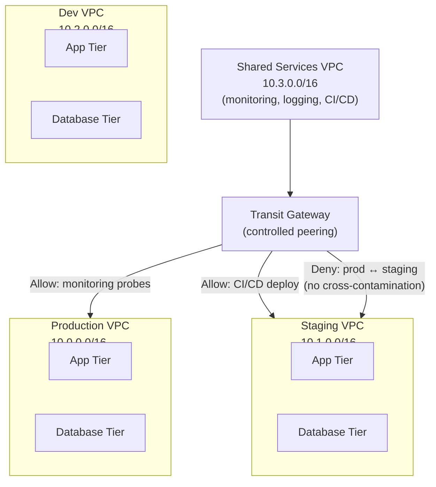
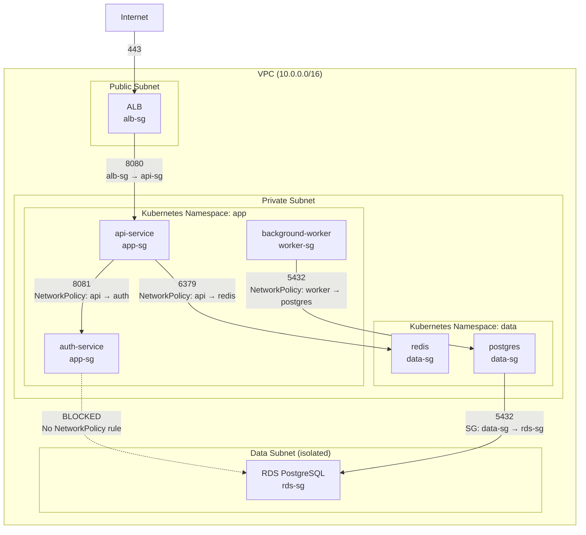
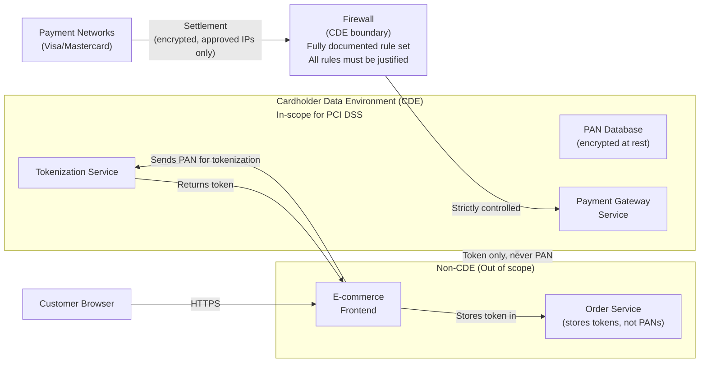
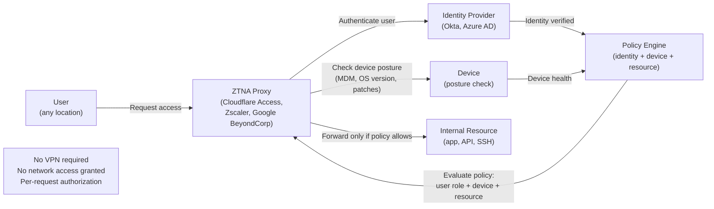

# Network Segmentation

## Table of Contents

- [Overview](#overview)
- [Why Segmentation Matters](#why-segmentation-matters)
- [Macro-Segmentation](#macro-segmentation)
  - [VLANs (Virtual LANs)](#vlans-virtual-lans)
  - [VPC Subnets](#vpc-subnets)
  - [Separate VPCs per Environment](#separate-vpcs-per-environment)
- [Micro-Segmentation](#micro-segmentation)
  - [Kubernetes NetworkPolicy](#kubernetes-networkpolicy)
- [PCI-DSS Network Segmentation](#pci-dss-network-segmentation)
- [Zero-Trust Network Access (ZTNA)](#zero-trust-network-access-ztna)
- [Istio Service Mesh as L7 Segmentation](#istio-service-mesh-as-l7-segmentation)
- [Segmentation Validation](#segmentation-validation)
  - [Penetration Testing](#penetration-testing)
  - [Automated Validation with NetworkPolicy](#automated-validation-with-networkpolicy)
  - [Blast Radius Simulation](#blast-radius-simulation)
- [Real-World Production Scenario](#real-world-production-scenario)
- [Failure Modes](#failure-modes)
- [Debugging Guide](#debugging-guide)
- [Security Considerations](#security-considerations)
- [Interview Questions](#interview-questions)
  - [Basic](#basic)
  - [Intermediate](#intermediate)
  - [Advanced / Staff Level](#advanced-staff-level)

---

## Overview

Network segmentation divides a network into isolated zones to limit the blast radius of a security breach. If an attacker compromises one segment, they should not be able to reach others. This is the foundational principle behind zero-trust architectures: "never trust, always verify, and assume breach."

The evolution of segmentation: VLAN-based macro-segmentation (coarse, 1990s) → Security Group-based workload isolation (medium, 2010s) → Kubernetes NetworkPolicy per pod (fine, 2015+) → L7 service mesh authorization policy (finest, 2018+).

---

## Why Segmentation Matters

**Blast radius limitation:** Without segmentation, an attacker with a foothold in one service can enumerate and pivot to all other services on the network. With segmentation, a compromised `web-frontend` pod cannot establish connections to the `database` pod or `payment-service` — even within the same VPC.

**PCI-DSS compliance:** PCI DSS Requirement 1 mandates network segmentation to isolate the Cardholder Data Environment (CDE). Without demonstrated segmentation, the entire network is considered in-scope, requiring all systems to meet PCI DSS controls. With validated segmentation (demonstrated via penetration test), only the CDE-segment requires full PCI compliance.

**Regulatory isolation:** HIPAA Protected Health Information (PHI), SOC 2 data, and GDPR personal data often require isolation. Segmentation provides the technical enforcement of these isolation requirements.

**Operational separation:** Dev/staging/prod isolation is not just security — it prevents developer mistakes in staging from affecting production databases, or staging load tests from saturating production network bandwidth.

---

## Macro-Segmentation

Macro-segmentation provides coarse-grained isolation at the network or subnet level.

### VLANs (Virtual LANs)

VLANs segment a physical network at Layer 2. Traffic between VLANs must route through a Layer 3 device (router or Layer 3 switch), where firewall rules can be applied.

```
VLAN 10: Web tier (192.168.10.0/24)
VLAN 20: App tier (192.168.20.0/24)
VLAN 30: Database tier (192.168.30.0/24)
VLAN 40: Management (192.168.40.0/24)

Traffic from VLAN 10 to VLAN 30 (web to database) must transit the Layer 3 firewall.
Firewall rule: deny VLAN 10 → VLAN 30 (web servers should not directly access DB)
Firewall rule: allow VLAN 20 → VLAN 30 on port 5432 (app tier → database)
```

**VLAN hopping attack:** An attacker on VLAN 10 can potentially reach VLAN 20 by sending double-tagged 802.1Q frames. The outer tag (VLAN 10) is stripped by the first switch, and the inner tag (VLAN 20) routes the frame to the target VLAN. Mitigation: ensure native VLAN is not used on trunk ports, and trunk ports are only configured where needed.

### VPC Subnets

AWS VPCs use subnets for macro-segmentation. Each subnet is associated with a route table and can have NACLs applied.

```
Production VPC: 10.0.0.0/16

Public subnets (10.0.1.0/24, 10.0.2.0/24):
  - Route table: 0.0.0.0/0 → Internet Gateway
  - ALB, NAT Gateway (no application workloads)

Private app subnets (10.0.10.0/24, 10.0.11.0/24):
  - Route table: 0.0.0.0/0 → NAT Gateway (outbound only)
  - EC2 instances, ECS tasks, EKS nodes

Private data subnets (10.0.20.0/24, 10.0.21.0/24):
  - Route table: no internet route (completely isolated)
  - RDS, ElastiCache, OpenSearch

Management subnet (10.0.30.0/24):
  - Bastion hosts (or replaced with Systems Manager Session Manager)
  - Monitoring agents, deployment agents
```

### Separate VPCs per Environment



**VPC separation rationale:** VPCs provide hard network isolation — there is no route between VPCs without explicit peering or Transit Gateway configuration. A misconfigured Security Group in staging cannot accidentally expose production databases. A developer with full IAM access to dev VPC has zero access to production VPC.

---

## Micro-Segmentation

Micro-segmentation applies access controls at the individual workload level — per pod, per container, per process.



### Kubernetes NetworkPolicy

NetworkPolicy is the Kubernetes primitive for pod-level L3/L4 segmentation. It is enforced by the CNI plugin (Calico, Cilium, Weave).

**Critical: Default behavior without NetworkPolicy is ALLOW ALL.** NetworkPolicy only takes effect once a NetworkPolicy object exists in the namespace — then the "default deny" behavior applies only to pods selected by the policy.

**Production pattern — namespace-level default deny:**
```yaml
# Apply to every namespace: default-deny all ingress and egress
apiVersion: networking.k8s.io/v1
kind: NetworkPolicy
metadata:
  name: default-deny-all
  namespace: payments
spec:
  podSelector: {}   # Selects ALL pods in the namespace
  policyTypes:
  - Ingress
  - Egress
  # No ingress or egress rules = deny all traffic
```

**Explicit allow rules for each service:**
```yaml
# Allow api-service to receive traffic from ingress-nginx on port 8080
apiVersion: networking.k8s.io/v1
kind: NetworkPolicy
metadata:
  name: allow-ingress-to-api
  namespace: payments
spec:
  podSelector:
    matchLabels:
      app: api-service
  policyTypes:
  - Ingress
  ingress:
  - from:
    - namespaceSelector:
        matchLabels:
          kubernetes.io/metadata.name: ingress-nginx
      podSelector:
        matchLabels:
          app.kubernetes.io/name: ingress-nginx
    ports:
    - protocol: TCP
      port: 8080
---
# Allow api-service to call auth-service on port 8081
apiVersion: networking.k8s.io/v1
kind: NetworkPolicy
metadata:
  name: allow-api-to-auth
  namespace: payments
spec:
  podSelector:
    matchLabels:
      app: auth-service
  policyTypes:
  - Ingress
  ingress:
  - from:
    - podSelector:
        matchLabels:
          app: api-service
    ports:
    - protocol: TCP
      port: 8081
---
# Allow api-service to reach external services (DNS + specific external APIs)
apiVersion: networking.k8s.io/v1
kind: NetworkPolicy
metadata:
  name: api-service-egress
  namespace: payments
spec:
  podSelector:
    matchLabels:
      app: api-service
  policyTypes:
  - Egress
  egress:
  # Allow DNS
  - ports:
    - port: 53
      protocol: UDP
    - port: 53
      protocol: TCP
  # Allow calls to auth-service
  - to:
    - podSelector:
        matchLabels:
          app: auth-service
    ports:
    - port: 8081
  # Allow calls to redis
  - to:
    - podSelector:
        matchLabels:
          app: redis
    ports:
    - port: 6379
```

**Common NetworkPolicy gotchas:**
- Forgetting to allow DNS (UDP 53) in egress rules — pods can't resolve service names
- Using `podSelector: {}` in `from`/`to` — this means "any pod in the namespace," not "any pod in the cluster" (use `namespaceSelector: {}` for cluster-wide)
- Not including both `namespaceSelector` AND `podSelector` when restricting cross-namespace traffic — either alone has broader scope than intended

---

## PCI-DSS Network Segmentation

PCI-DSS Requirement 1 requires isolation of the Cardholder Data Environment (CDE). The CDE includes any system that stores, processes, or transmits cardholder data (PANs, CVVs, PINs).



**PCI DSS segmentation requirements:**
- All traffic into the CDE must pass through a firewall with a justified, documented rule
- No direct connectivity between the internet and the CDE (must pass through at minimum a DMZ)
- Quarterly penetration testing to verify segmentation is effective ("can an attacker reach the CDE from the non-CDE?")
- All rules on CDE-boundary firewalls must be documented and reviewed every 6 months
- No inbound connections from the CDE to less-secure zones (data exfiltration control)

---

## Zero-Trust Network Access (ZTNA)

Traditional VPN model: users connected to VPN are "inside" the network and implicitly trusted to reach resources. ZTNA eliminates this — access to each resource is evaluated independently based on identity, device posture, and context.



**ZTNA vs VPN:**
| Property | Traditional VPN | ZTNA |
|---|---|---|
| Access model | Network access (all resources once connected) | Per-resource access (evaluated per request) |
| Device trust | Trusted once connected | Continuous device posture check |
| Network exposure | Internal network routable | Resources not exposed on network |
| Lateral movement risk | High (access to full network) | Low (access only to approved resources) |
| User experience | VPN client required | Browser-based or lightweight agent |

---

## Istio Service Mesh as L7 Segmentation

Istio AuthorizationPolicy enables L7 segmentation — controlling access by HTTP method, path, and SPIFFE identity.

```yaml
# Deny all service-to-service traffic by default
apiVersion: security.istio.io/v1
kind: AuthorizationPolicy
metadata:
  name: deny-all
  namespace: payments
spec: {}  # Empty spec = deny all (different from missing spec which = allow all!)

---
# Allow api-gateway to call payment-service on POST /api/v1/payments only
apiVersion: security.istio.io/v1
kind: AuthorizationPolicy
metadata:
  name: allow-payment-api
  namespace: payments
spec:
  selector:
    matchLabels:
      app: payment-service
  rules:
  - from:
    - source:
        principals:
          - "cluster.local/ns/api-gateway/sa/api-gateway"  # SPIFFE identity
  - to:
    - operation:
        methods: ["POST"]
        paths: ["/api/v1/payments", "/api/v1/payments/*"]
  # Implicitly: GET /api/v1/payments, DELETE /api/v1/payments, /admin/* are all denied
  # Even from the api-gateway service account
```

**Why L7 matters:** NetworkPolicy can prevent `admin-tool` from reaching `payment-service:8080`. But it cannot prevent `payment-service` from calling `GET /admin/delete-all` on `auth-service:8081`. Only L7 authorization (AuthorizationPolicy) can restrict HTTP method and path combinations.

---

## Segmentation Validation

Segmentation only provides security if it works. Regular validation is required.

### Penetration Testing

**Quarterly external pen test:** Test whether an attacker on the internet can reach the CDE or internal services. Compliance requirement for PCI DSS.

**Assumed-breach internal testing:** Start with a foothold in one service (e.g., compromise a web server), attempt lateral movement. Document: "I compromised `web-frontend`. Can I reach `payment-db`?"

### Automated Validation with NetworkPolicy

```bash
# Test that a pod in namespace A cannot reach a pod in namespace B
# (validates NetworkPolicy default-deny is working)
kubectl run test-pod --image=busybox --rm -it --restart=Never \
  -n app-namespace \
  -- wget -T 5 http://payment-service.payments.svc.cluster.local:8080
# Expected: timeout/connection refused (not success)

# Test that allowed path works
kubectl run test-pod --image=busybox --rm -it --restart=Never \
  -n api-namespace \
  -- wget -T 5 http://auth-service.auth.svc.cluster.local:8081/health
# Expected: 200 OK

# Use Cilium's network policy editor for visual validation
kubectl exec -n kube-system cilium-xxxxx -- cilium policy get
```

### Blast Radius Simulation

"If service X is compromised, what can it reach?" Map this out before a breach, not after.

```bash
# Using Cilium Hubble for observability
hubble observe --pod payments/payment-service --follow
# Shows all connections from payment-service: destination IPs, ports, verdicts
# "verdict: DROPPED" = segmentation working
# "verdict: FORWARDED" = allowed connection
# Unexpected FORWARDED connections reveal segmentation gaps
```

---

## Real-World Production Scenario

**Scenario:** Post-breach analysis at a fintech company reveals an attacker gained access to the `shipping-service` (via a deserialization vulnerability in a third-party library). From `shipping-service`, the attacker moved laterally to `payment-service`, then to the payment database, and exfiltrated card data. The breach went undetected for 6 weeks. The post-incident mandate: implement micro-segmentation retrospectively without disrupting production traffic.

**The challenge:** Implementing default-deny NetworkPolicy on a live production system without knowing all existing traffic flows will break traffic. You cannot simply apply default-deny and figure out what broke.

**Implementation approach:**

**Phase 1: Traffic discovery (2 weeks — no policy enforcement)**
```bash
# Enable Cilium Hubble flow logging (if using Cilium)
# Or use Calico flow logs, or VPC Flow Logs for VMs

# Capture all east-west traffic flows for 2 weeks
# Build a service dependency map from observed flows
hubble observe --output json --last 100000 \
  | jq '{src: .source.namespace+"/"+.source.pod_name, dst: .destination.namespace+"/"+.destination.pod_name, port: .l4.TCP.destination_port}' \
  | sort -u > observed_flows.json
```

**Phase 2: Generate NetworkPolicy from observed flows**
```python
# Use a tool like Cilium's policy editor, Tufin, or a custom script
# to generate NetworkPolicy YAML from observed flow data
# Each unique (src_namespace/src_app → dst_namespace/dst_app:port) becomes a rule

# Validate generated policies cover ALL observed legitimate flows
# before applying them
```

**Phase 3: Apply in LOG/AUDIT mode first**
```bash
# Calico: apply policy in "Log" action (doesn't block, just logs matches)
# Cilium: use "Audit" mode before enforcement

# Apply default-deny in audit mode
kubectl apply -f default-deny-audit.yaml

# Monitor for 1 week — any traffic that would have been denied is logged
# Review logs daily for unexpected denied traffic
kubectl logs -n kube-system cilium-xxxxx | grep "policy-verdict.*denied"
```

**Phase 4: Fix gaps, then enforce**
```bash
# For each unexpected denied flow found in audit mode:
# - Verify it's legitimate (not attacker traffic)
# - Add explicit NetworkPolicy rule for it
# - Re-deploy with updated policies

# Switch to enforcement mode
kubectl patch ciliumnetworkpolicy default-deny -n production \
  --type='merge' --patch='{"spec":{"egressDeny":[{}],"ingressDeny":[{}]}}'
```

**Phase 5: Add L7 AuthorizationPolicy (service mesh)**
```yaml
# Now that L3/L4 is locked down with NetworkPolicy,
# add L7 Istio AuthorizationPolicy to restrict HTTP methods and paths
# shipping-service should NEVER be able to call payment-service
# Even if NetworkPolicy allows it (defense in depth)
apiVersion: security.istio.io/v1
kind: AuthorizationPolicy
metadata:
  name: payment-service-allow
  namespace: payments
spec:
  selector:
    matchLabels:
      app: payment-service
  rules:
  - from:
    - source:
        principals:
        # Only api-gateway and internal reconciliation service
        - "cluster.local/ns/api/sa/api-gateway"
        - "cluster.local/ns/billing/sa/reconciliation"
  # shipping-service's SPIFFE identity NOT in this list = DENIED at L7
```

**Result:** Segmentation is implemented. Verify with: `kubectl exec -n shipping shipping-service-xxx -- curl -v payment-service.payments.svc.cluster.local:8080` → connection refused (NetworkPolicy) or 403 Forbidden (AuthorizationPolicy).

---

## Failure Modes

| Failure | Symptoms | Detection | Fix |
|---|---|---|---|
| NetworkPolicy missing DNS egress rule | Pods can't resolve service names, intermittent failures | `kubectl exec pod -- nslookup kubernetes.default.svc.cluster.local` fails | Add egress rule: allow UDP/TCP port 53 to kube-dns namespace |
| Default-deny applied without allow rules | All pods in namespace unable to communicate | All service calls return connection refused/timeout | Apply service-specific allow rules before or simultaneously with default-deny |
| Istio AuthorizationPolicy empty spec | All traffic denied (empty spec = deny all, not allow all) | 403 on all requests in namespace | Add explicit allow rules or use `allow-all` spec |
| NACL blocking return traffic | Outbound connections succeed, responses don't arrive | Flow logs show accept outbound, reject inbound | Add NACL inbound rule for ephemeral ports 1024-65535 |
| SG rule references deleted SG | Traffic suddenly blocked after service teardown | VPC Flow Logs show REJECT from expected source | Update SG rules to reference new SG; audit for stale SG references quarterly |
| NetworkPolicy too broad `podSelector: {}` | Intended to select specific pods but selects all | All pods in namespace affected by policy | Use specific `matchLabels` in podSelector |
| Cross-namespace NetworkPolicy missing namespaceSelector | Policy allows traffic from "any pod" in a specific namespace but namespaceSelector not set | `from.podSelector` without `from.namespaceSelector` = same namespace only | Add `namespaceSelector` with matching labels for cross-namespace rules |

---

## Debugging Guide

```bash
# Test NetworkPolicy enforcement
kubectl exec -n <source-ns> <source-pod> -- nc -zv <target-service>.<target-ns>.svc.cluster.local <port>
# Timeout = blocked by NetworkPolicy
# Connection refused = NetworkPolicy allows but port not listening
# 200 OK = allowed

# View NetworkPolicies in a namespace
kubectl get networkpolicy -n payments -o yaml

# Visualize policies (Cilium)
kubectl exec -n kube-system cilium-xxxxx -- cilium policy trace \
  --src-k8s-pod payments/api-service-xxx \
  --dst-k8s-pod payments/payment-db-xxx \
  --dport 5432
# Shows: "Verdict: Allowed/Denied" with explanation

# Calico: test policy with calicoctl
calicoctl policy get
calicoctl ipam show

# Check AWS Security Group allow/deny with VPC Flow Logs
aws logs filter-log-events \
  --log-group-name "/vpc/flowlogs" \
  --filter-pattern "REJECT" \
  --start-time $(date -d '10 minutes ago' +%s000)

# Validate CDE segmentation with nmap from non-CDE host
nmap -sT -p 5432 <cde-db-ip>
# Expected: filtered (no response) — completely dark from non-CDE

# Check Istio AuthorizationPolicy denials
kubectl logs -n istio-system <istiod-pod> | grep "authorization"
kubectl exec <pod> -c istio-proxy -- curl localhost:15000/stats | grep authz
```

---

## Security Considerations

**The "flat network" is the enemy:** Many organizations have strong perimeter security but completely flat internal networks. Once an attacker breaches the perimeter, they can enumerate and attack every internal system. Every Senior SRE should be able to answer: "If `service-X` is compromised, what is the blast radius?" If the answer is "everything," the network is flat.

**Segmentation does not stop exfiltration without egress control:** NetworkPolicy restricting east-west traffic is not enough. If a compromised service can make outbound HTTPS connections to arbitrary external hosts, data can be exfiltrated despite east-west segmentation. Pair east-west segmentation with egress control (allow only specific external endpoints via FQDN-based policies).

**Kubernetes labels are not a security boundary alone:** NetworkPolicy uses pod labels as selectors. If a developer can modify pod labels (e.g., add `app: payment-service` to a malicious pod), they can gain access to resources restricted to that label. Use `namespaceSelector` in combination with `podSelector`, and enforce label immutability with admission controllers (OPA Gatekeeper, Kyverno).

**Policy drift:** Segmentation policies degrade over time as services evolve. A new service is added with a broad NetworkPolicy "allow all" rule to fix a production incident, and it's never tightened. Implement policy-as-code with continuous compliance scanning (Falco, Tetragon, or OPA) to detect and alert on policy drift.

---

## Interview Questions

### Basic

**Q: What is the difference between macro-segmentation and micro-segmentation?**
A: Macro-segmentation divides the network into broad zones — separate VLANs for web/app/database tiers, separate VPCs per environment. The controls are coarse-grained: "anything in the web tier can talk to anything in the app tier." Micro-segmentation applies controls at the individual workload level — each service, pod, or container has its own access policy. In Kubernetes, a NetworkPolicy that says "only `api-service` pods can call `payment-service` on port 8080, no other pods" is micro-segmentation. Macro-segmentation limits the attack surface to a zone; micro-segmentation limits it to specific services. Zero-trust requires micro-segmentation — macro zones are too coarse to limit lateral movement within a tier.

**Q: What happens if you apply a Kubernetes NetworkPolicy with an empty spec?**
A: An empty spec (`spec: {}`) creates a deny-all policy for the selected pods. This is a common gotcha — it looks like "no rules" but actually means "no rules = deny all." This is different from having no NetworkPolicy at all (which means allow all). The `spec.podSelector: {}` selects all pods in the namespace. Combined with `policyTypes: [Ingress, Egress]` and no `ingress`/`egress` rules, it denies all traffic in both directions. The first time an engineer applies a default-deny policy without simultaneously applying allow rules, they break all traffic in that namespace.

### Intermediate

**Q: A new engineering team asks why they need separate Security Groups for each tier (ALB, app, database) instead of one shared Security Group. How do you explain it?**
A: Separate Security Groups per tier enable the Security Group reference model — instead of writing "allow traffic from 10.0.1.0/24" (the app subnet CIDR), you write "allow traffic from `app-sg`." The difference: if the app tier scales up or scales out to different subnets, or if you add a new instance type, the Security Group rule automatically applies. No rule maintenance. More importantly: separate SGs enforce the separation principle. If the database SG has inbound rules only from the app SG, no other resource in the VPC (regardless of which subnet it's in) can reach the database — even if someone misconfigures another service in the app subnet. The Security Group is the policy unit, not the subnet.

**Q: How do you implement default-deny NetworkPolicy in Kubernetes without breaking production traffic?**
A: Use a phased approach. Phase 1: deploy observability first. Use Cilium Hubble or Calico flow logs to capture all current east-west traffic flows. Run for 2 weeks to capture all traffic patterns including scheduled jobs. Phase 2: generate NetworkPolicy from observed flows. Use tooling to create explicit allow rules for every observed legitimate flow. Phase 3: apply in audit mode (Calico audit mode, or Cilium with policy-verdict logging) — policies are evaluated but not enforced, denied traffic is logged. Monitor for 1 week, fix any gaps. Phase 4: enable enforcement. Monitor application error rates closely for the first 24 hours. Have a rollback plan: `kubectl delete networkpolicy default-deny` is instant rollback.

### Advanced / Staff Level

**Q: Post-breach analysis shows an attacker moved laterally from a compromised `recommendation-service` to `payment-service` within minutes. You have NetworkPolicy already applied. How did they bypass it, and how do you prevent it in the future?**
A: If NetworkPolicy was applied and the attacker still moved laterally, there are several possible explanations. First: NetworkPolicy only applies to pod-to-pod traffic at L3/L4 — if `recommendation-service` had a legitimate NetworkPolicy allowing it to call `payment-service` on port 443 for a valid use case, the attacker exploited that allowed path. Solution: add Istio AuthorizationPolicy to restrict HTTP methods and paths — allow `GET /recommendations` but not `POST /payments`. Second: the attacker may have used a different attack vector — not pod-to-pod TCP, but an injectable payload through a shared message queue or database. NetworkPolicy cannot stop attacks through shared infrastructure (Redis, Kafka). Solution: per-service isolated queues, or message-level signing/authentication. Third: the `recommendation-service` had an overly broad NetworkPolicy (`podSelector: {}`) that allowed it to reach any pod in the cluster. Solution: audit all NetworkPolicy rules quarterly using automated scanners; flag any `podSelector: {}` as a policy violation. Fourth: the attacker pivoted through the Kubernetes API server (via a service account token that was over-privileged). NetworkPolicy doesn't control Kubernetes API access. Solution: RBAC least-privilege for service accounts, disable auto-mount of service account tokens (`automountServiceAccountToken: false`), and audit service account permissions. The root lesson: segmentation requires defense-in-depth — NetworkPolicy (L3/L4) + AuthorizationPolicy (L7) + RBAC + secrets management all simultaneously.

**Q: Design a segmentation architecture for a SaaS platform that must simultaneously satisfy PCI DSS (card data), HIPAA (health data), and SOC 2 requirements across a Kubernetes platform shared by multiple product teams.**
A: The fundamental constraint: different compliance requirements mean different data cannot coexist in the same network segment. Architecture: separate Kubernetes clusters per compliance domain. PCI cluster: isolated VPC, dedicated node pools (no shared nodes with non-PCI workloads), Kubernetes NetworkPolicy default-deny with explicit allow per service, Istio STRICT mTLS with AuthorizationPolicy for L7 control, network logs retained 1 year. HIPAA cluster: separate VPC, HIPAA-compliant regions only, encryption at rest + in transit, audit logging for all data access. SOC 2 cluster: standard production cluster with macro-segmentation (separate namespaces per team, NetworkPolicy between namespaces). Cross-cluster communication: via well-defined APIs only, not direct pod-to-pod. Payment services expose a tokenization API; product teams call the API to tokenize, they never touch PANs directly. For Kubernetes multi-tenancy within the SOC 2 cluster: one namespace per team with default-deny, team-specific RBAC (teams cannot see other teams' resources), admission policies (OPA Gatekeeper) to enforce that NetworkPolicy exists before any deployment, and network egress control via Cilium FQDN policy to prevent data exfiltration. Validation: automated quarterly pen testing using a "assume breach" scenario for each compliance boundary, with test results documented for auditor review.
