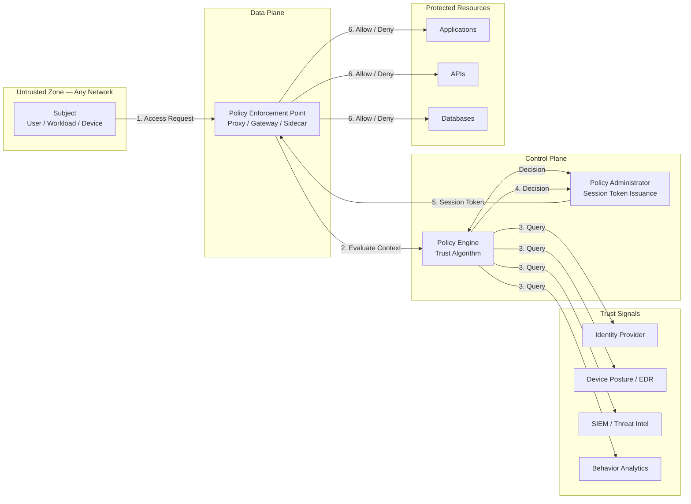
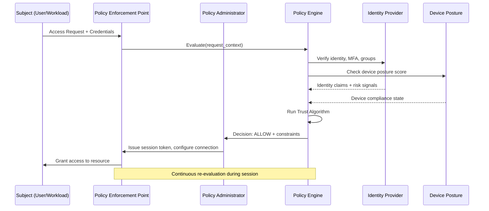
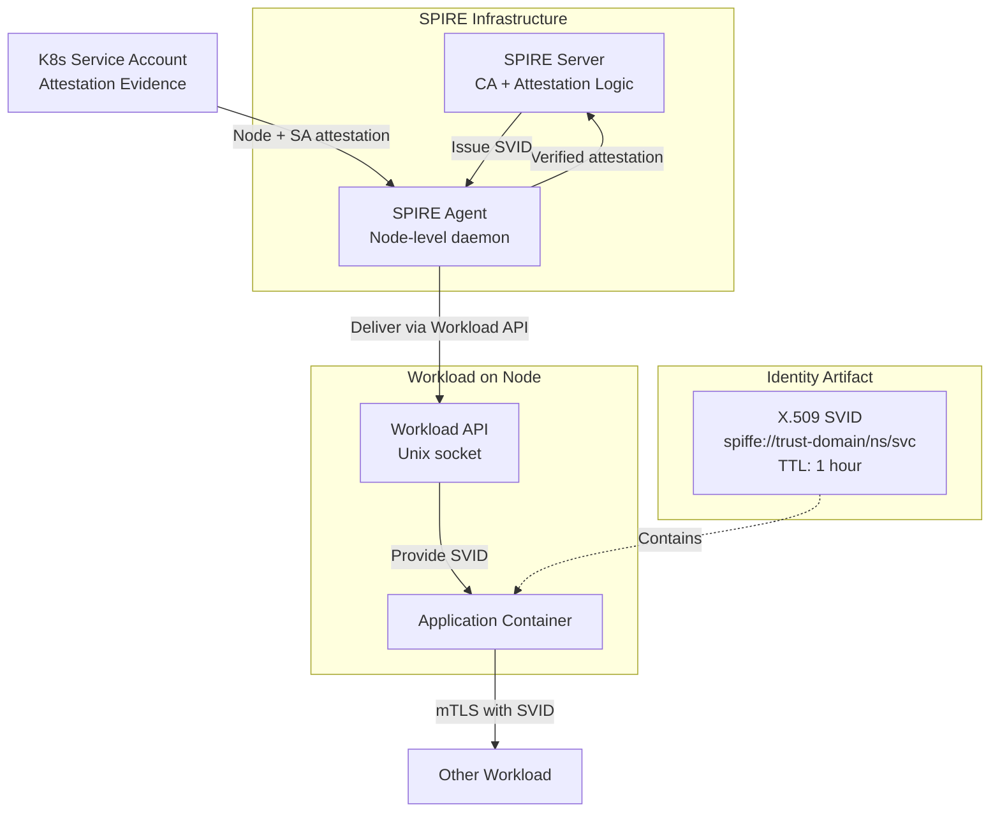
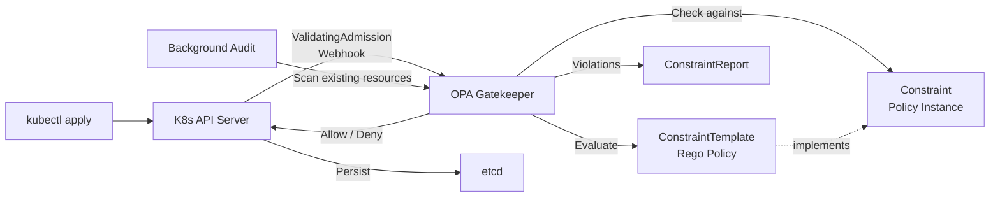
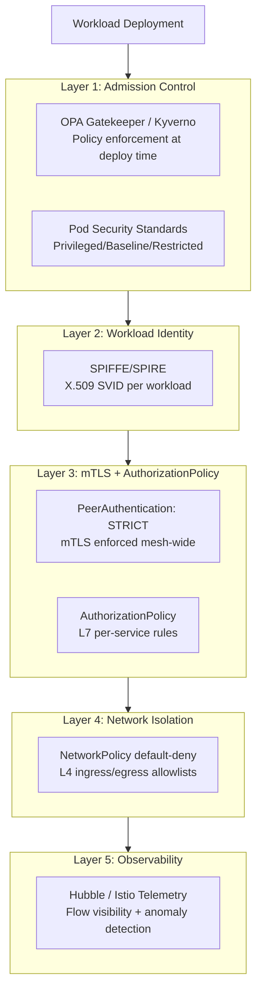
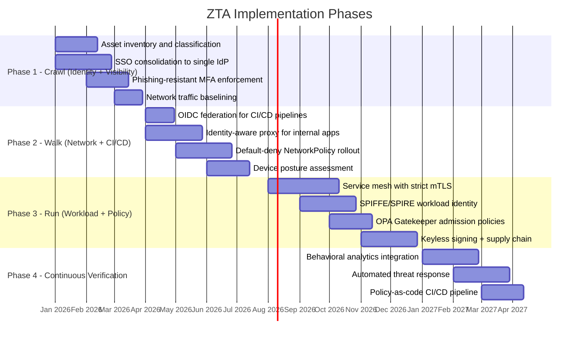

# Zero Trust Architecture

## Table of Contents

- [Overview](#overview)
- [NIST SP 800-207: Seven Tenets](#nist-sp-800-207-seven-tenets)
  - [Tenet 1: All data sources and computing services are resources](#tenet-1-all-data-sources-and-computing-services-are-resources)
  - [Tenet 2: All communication is secured regardless of network location](#tenet-2-all-communication-is-secured-regardless-of-network-location)
  - [Tenet 3: Access is granted on a per-session basis](#tenet-3-access-is-granted-on-a-per-session-basis)
  - [Tenet 4: Access is determined by dynamic policy](#tenet-4-access-is-determined-by-dynamic-policy)
  - [Tenet 5: Enterprise monitors and measures the integrity of all assets](#tenet-5-enterprise-monitors-and-measures-the-integrity-of-all-assets)
  - [Tenet 6: Authentication and authorization are strictly enforced before access](#tenet-6-authentication-and-authorization-are-strictly-enforced-before-access)
  - [Tenet 7: Enterprise collects telemetry and uses it to improve security posture](#tenet-7-enterprise-collects-telemetry-and-uses-it-to-improve-security-posture)
- [NIST ZTA Components: PE, PA, PEP](#nist-zta-components-pe-pa-pep)
- [BeyondCorp: Google's Production ZTA](#beyondcorp-googles-production-zta)
- [SPIFFE/SPIRE: Workload Identity](#spiffespire-workload-identity)
- [OPA/Rego: Policy as Code](#oparego-policy-as-code)
- [ZTA for Kubernetes: Layered Architecture](#zta-for-kubernetes-layered-architecture)
- [Implementation Roadmap: Crawl → Walk → Run](#implementation-roadmap-crawl-walk-run)
- [Anti-Patterns](#anti-patterns)
- [Real-World Production Scenario](#real-world-production-scenario)
  - [Implementing ZTA Incrementally Without Downtime](#implementing-zta-incrementally-without-downtime)
- [Failure Modes](#failure-modes)
- [Debugging Guide](#debugging-guide)
- [Security Considerations](#security-considerations)
- [Interview Questions](#interview-questions)
  - [Basic](#basic)
  - [Intermediate](#intermediate)
  - [Advanced / Staff Level](#advanced-staff-level)

---

## Overview

Zero Trust Architecture (ZTA) is the security paradigm that eliminates implicit trust from every layer of the stack. The traditional perimeter model assumed that anything inside the corporate network was trustworthy — a flat network where lateral movement was trivial once perimeter defenses fell. ZTA replaces this with a single governing principle: **never trust, always verify**. Every access request — regardless of source network, prior authentication state, or user identity — is evaluated against current signals before access is granted.

The shift is not merely philosophical. Google eliminated VPNs for 100,000+ employees (BeyondCorp, 2014). The SolarWinds breach demonstrated that attackers who breach perimeter controls enjoy months of unconstrained lateral movement. NIST codified the architecture in SP 800-207 (2020). U.S. Executive Order 14028 (2021) mandated federal agencies adopt Zero Trust by 2024. The threat model has changed; the architecture must follow.



---

## NIST SP 800-207: Seven Tenets

NIST 800-207 defines ZTA through seven tenets. Each has concrete production implications.

### Tenet 1: All data sources and computing services are resources

**Principle:** SaaS applications, CI/CD runners, IoT devices, employee laptops, and cloud workloads are all resources regardless of ownership or location.

**Production implication:** You must inventory every resource before you can protect it. A GitHub Actions runner is a resource. A Datadog agent is a resource. Treat CI/CD infrastructure with the same access controls as production databases — attackers increasingly target build systems to inject code at source.

### Tenet 2: All communication is secured regardless of network location

**Principle:** Internal east-west traffic is encrypted and authenticated, not just north-south external traffic.

**Production implication:** mTLS between microservices is non-negotiable. A service mesh (Istio, Linkerd) enforces this transparently without application changes. An attacker on the internal network segment should gain nothing from traffic interception.

### Tenet 3: Access is granted on a per-session basis

**Principle:** No persistent trust tokens. Every new session requires re-evaluation.

**Production implication:** Short-lived credentials. SPIFFE X.509 SVIDs with 1-hour TTLs auto-rotate. AWS STS tokens expire in 15 minutes to 12 hours. OAuth access tokens should expire in 5-15 minutes. Persistent API keys that never expire violate this tenet.

### Tenet 4: Access is determined by dynamic policy

**Principle:** Policy considers identity, device state, behavioral signals, location, time, and real-time risk indicators — not just static group membership.

**Production implication:** An employee accessing the payroll system from an unmanaged device at 3 AM from a foreign country should trigger step-up authentication or be denied entirely. Policy engines (OPA, Cedar) encode this logic in version-controlled, testable code.

### Tenet 5: Enterprise monitors and measures the integrity of all assets

**Principle:** Continuous posture assessment, not periodic point-in-time scans.

**Production implication:** Device trust score must be evaluated at every access request, not just at login. If an endpoint's EDR agent stops reporting, its trust score degrades. Vulnerability scanners must run continuously, and findings must feed back into access policy.

### Tenet 6: Authentication and authorization are strictly enforced before access

**Principle:** No access before verification. No grace periods for legacy systems.

**Production implication:** The hardest tenet to implement in brownfield environments. Legacy systems with password-only authentication must be placed behind an identity-aware proxy (Cloudflare Access, Pomerium) that handles the verification layer externally. "We'll fix the app later" is not a ZTA strategy.

### Tenet 7: Enterprise collects telemetry and uses it to improve security posture

**Principle:** The feedback loop is architectural — access decisions feed threat intelligence which feeds future access decisions.

**Production implication:** Log every access decision (allow AND deny) to your SIEM. Anomaly detection on access patterns (unusual resource combinations, off-hours access, geographic anomalies) drives policy refinement. ZTA without comprehensive logging is a control plane with no feedback.

---

## NIST ZTA Components: PE, PA, PEP



**Policy Engine (PE):** The brain. Ingests all trust signals and runs a trust algorithm to compute an allow/deny decision with a trust score. Decisions are per-session. The PE is the most critical HA component — a PE outage can either block all access (fail-closed) or grant all access (fail-open), both catastrophic in different ways.

**Policy Administrator (PA):** Translates decisions into action. Issues session tokens, configures the PEP, and can revoke sessions mid-flight if risk signals change (a device goes offline, a threat intel feed flags the source IP). The PA communicates with the PEP via the control plane, separate from the data plane carrying actual traffic.

**Policy Enforcement Point (PEP):** The gatekeeper at the data plane. Every access request flows through the PEP, which opens, monitors, and terminates connections per PA instructions. In Kubernetes, this is the Istio sidecar proxy. For human access, it is an identity-aware proxy. For cloud APIs, it is an API gateway with fine-grained IAM policies.

---

## BeyondCorp: Google's Production ZTA

Google's BeyondCorp (2014-2017) is the most influential production Zero Trust deployment. Key architectural decisions:

- **No VPN.** All internal applications accessed over the public internet through the Access Proxy (AP). The AP is the internet-facing PEP.
- **Device inventory as a first-class resource.** Every device is registered in a Device Inventory Database. Devices without a valid certificate get zero access — not reduced access, zero access.
- **Trust tiers.** Devices classified into tiers based on OS patch state, disk encryption, management agent presence, and certificate health. Trust tier directly gates resource sensitivity level.
- **Access Control Engine (ACE).** The PE: evaluates `(user identity + group membership + device trust tier + resource policy)` per request.
- **Access Proxy (AP).** The PEP: internet-facing reverse proxy providing coarse-grained authorization. All employee traffic, including to internal tools, flows through it.
- **BeyondProd extension.** Applied the same principles to production microservices: ALTS (Application Layer Transport Security) for mTLS, binary authorization for code provenance.

**What Google proved:** ZTA at scale (100,000+ employees) is operationally feasible and improves user experience (no VPN client to manage) while improving security posture.

---

## SPIFFE/SPIRE: Workload Identity

Human identity providers (Okta, Entra ID) solve the human access problem. SPIFFE/SPIRE solves the workload identity problem — 10x more identities, no humans in the loop.



**SPIFFE ID format:** `spiffe://trust-domain/path/to/workload` — e.g., `spiffe://prod.example.com/ns/payments/sa/api-server`

**X.509 SVID:** A standard X.509 certificate where the Subject Alternative Name (SAN) URI contains the SPIFFE ID. Compatible with standard TLS libraries — no application changes required.

**Attestation:** SPIRE proves a workload's identity before issuing an SVID. On Kubernetes, the SPIRE Agent attests using the pod's service account JWT token. The SPIRE Server verifies this against the Kubernetes API. No static secrets required for identity bootstrapping.

**Key production properties:**
- Certificates are short-lived (default 1 hour) and auto-rotated — no manual certificate management
- Trust federation across clusters and clouds via trust bundles
- Eliminates static service account tokens — a rotated, expiring certificate replaces a long-lived password

---

## OPA/Rego: Policy as Code

Open Policy Agent is the de facto standard for unified policy enforcement. It decouples policy from application code — policies are written in Rego (declarative query language), loaded into OPA, and evaluated against structured JSON input.

**OPA Gatekeeper: K8s Admission Control**



**ConstraintTemplate** (the policy definition):
```yaml
apiVersion: templates.gatekeeper.sh/v1
kind: ConstraintTemplate
metadata:
  name: k8srequiredlabels
spec:
  crd:
    spec:
      names:
        kind: K8sRequiredLabels
      validation:
        openAPIV3Schema:
          type: object
          properties:
            labels:
              type: array
              items:
                type: string
  targets:
    - target: admission.k8s.gatekeeper.sh
      rego: |
        package k8srequiredlabels
        violation[{"msg": msg}] {
          provided := {label | input.review.object.metadata.labels[label]}
          required := {label | label := input.parameters.labels[_]}
          missing := required - provided
          count(missing) > 0
          msg := sprintf("Missing required labels: %v", [missing])
        }
```

**Constraint** (the policy instantiation):
```yaml
apiVersion: constraints.gatekeeper.sh/v1beta1
kind: K8sRequiredLabels
metadata:
  name: require-app-owner
spec:
  enforcementAction: deny
  match:
    kinds:
      - apiGroups: [""]
        kinds: ["Pod"]
  parameters:
    labels: ["app", "owner", "cost-center"]
```

---

## ZTA for Kubernetes: Layered Architecture

Zero Trust in Kubernetes requires controls at every layer — network, workload identity, application policy, and admission.



**NetworkPolicy (default-deny foundation):**
```yaml
apiVersion: networking.k8s.io/v1
kind: NetworkPolicy
metadata:
  name: default-deny-all
  namespace: payments
spec:
  podSelector: {}
  policyTypes: [Ingress, Egress]
---
apiVersion: networking.k8s.io/v1
kind: NetworkPolicy
metadata:
  name: allow-api-to-postgres
  namespace: payments
spec:
  podSelector:
    matchLabels:
      app: postgres
  policyTypes: [Ingress]
  ingress:
    - from:
        - podSelector:
            matchLabels:
              app: payments-api
      ports:
        - protocol: TCP
          port: 5432
```

**Istio strict mTLS + AuthorizationPolicy:**
```yaml
apiVersion: security.istio.io/v1
kind: PeerAuthentication
metadata:
  name: default
  namespace: istio-system
spec:
  mtls:
    mode: STRICT
---
apiVersion: security.istio.io/v1
kind: AuthorizationPolicy
metadata:
  name: payments-api-policy
  namespace: payments
spec:
  selector:
    matchLabels:
      app: payments-api
  action: ALLOW
  rules:
    - from:
        - source:
            principals: ["cluster.local/ns/payments/sa/checkout-service"]
      to:
        - operation:
            methods: ["POST"]
            paths: ["/api/v1/payments/*"]
```

---

## Implementation Roadmap: Crawl → Walk → Run



---

## Anti-Patterns

| Anti-Pattern | Why It Fails | Correct Approach |
|---|---|---|
| **VPN = Zero Trust** | VPN grants network-level access, not per-resource authorization. Once on the VPN, lateral movement is unrestricted. | Replace VPN with identity-aware proxy per application; ZTNA solutions (Zscaler, Cloudflare Access) |
| **Implicit trust within VPC** | Flat VPC networks allow any pod/VM to reach any other. East-west attacks happen inside the perimeter. | Default-deny NetworkPolicy + service mesh mTLS for all east-west traffic |
| **Assuming internal == trusted** | The SolarWinds and Log4Shell attacks both leveraged trusted-internal positions. | Treat every request from internal networks with the same skepticism as external |
| **MFA as the only ZTA control** | MFA authenticates users but does not authorize per-resource, does not assess device posture, and does not evaluate behavioral risk | MFA + RBAC/ABAC + device trust + short-lived tokens + continuous verification |
| **Big-bang microsegmentation** | Applying default-deny to an unmapped network causes widespread application outages | Map all flows first (via network observability tools like Hubble/Retina), then segment incrementally |
| **Static machine credentials** | Long-lived service account passwords and API keys cannot be easily rotated and accumulate as attack surface | SPIFFE SVIDs (1-hour TTL), OIDC federation for CI/CD, Vault dynamic secrets |
| **One-time ZTA compliance** | ZTA is a continuous posture, not a migration project | Continuous monitoring, automated policy testing in CI/CD, quarterly access reviews |

---

## Real-World Production Scenario

### Implementing ZTA Incrementally Without Downtime

**Context:** A fintech company running 40 microservices on Kubernetes with a flat internal network. Requirement: implement ZTA without disrupting payment processing SLOs.

**Phase 1 — Crawl (Weeks 1-6):** Deploy Hubble (Cilium's network observability) in observe-only mode. Map all actual east-west flows. Result: discovered 12 services communicating that the architecture diagrams did not show. Output: accurate flow map.

**Phase 2 — Walk (Weeks 7-12):** Apply `default-deny` NetworkPolicy to the lowest-risk namespace (logging) first. Validate no broken connectivity. Roll out to staging, then production namespaces incrementally, one namespace per week. Rollback plan: NetworkPolicy deletion is instant.

**Phase 3 — mTLS (Weeks 13-20):** Deploy Istio in permissive mode (allows both mTLS and plaintext). Observe which services support mTLS vs which fall back to plaintext. Fix the plaintext services. Switch to STRICT mode one namespace at a time.

**Phase 4 — AuthorizationPolicy (Weeks 21-28):** With mTLS established, SPIFFE IDs are available. Write AuthorizationPolicy rules allowing only known service-to-service paths. Start with audit mode using `action: AUDIT`.

**Key insight:** The crawl-walk-run approach prevents the "big bang" outage. Observability precedes enforcement at every step.

---

## Failure Modes

| Failure | Symptoms | Detection | Fix |
|---|---|---|---|
| Policy Engine (PE) outage | All access blocked (fail-closed) or all access granted (fail-open) | PE health check alerts, sudden access denial spike | HA PE cluster (3 replicas minimum); define fail-open vs fail-closed per resource sensitivity |
| SPIRE Server unavailable | SVIDs cannot be renewed; services fail mTLS after cert TTL expires | SPIRE Server health metrics, cert expiry alerts | SPIRE HA with multiple servers; emergency cert TTL extension via break-glass procedure |
| Stale device posture | High-risk device granted access based on cached posture | Posture score staleness alert | Max posture cache TTL = 5 minutes for sensitive resources; require fresh attestation on session creation |
| NetworkPolicy misconfiguration | Service connectivity broken after policy deploy | HTTP 5xx spike on service, kubectl describe networkpolicy | Deploy in audit mode first; use `kubectl exec curl` test suite |
| mTLS cert expiry cascade | Multiple services lose connectivity simultaneously | mTLS failure metrics, 503 errors at service mesh layer | Automated cert rotation with 5x safety buffer before expiry; alert at 20% TTL remaining |
| JWT algorithm confusion attack | RS256 tokens validated as HS256, attacker forges tokens | Anomalous access patterns, tokens from unexpected issuers | Explicitly configure accepted algorithms; never accept `alg: none` |

---

## Debugging Guide

**Debugging PEP access denials:**
```bash
# Istio: check authorization policy decision
kubectl exec -n istio-system deploy/istiod -- \
  pilot-discovery request GET /debug/authorizationz

# Check Envoy access log for deny decision
kubectl logs -n payments deploy/payments-api -c istio-proxy | \
  grep "\"response_code\":403"

# Verify SPIFFE identity of calling workload
istioctl proxy-config endpoint -n payments deploy/checkout-service | \
  grep payments-api
```

**Debugging SPIRE attestation failures:**
```bash
# Check SPIRE Agent logs for attestation errors
kubectl logs -n spire-system daemonset/spire-agent | grep ERROR

# List registered workloads and their SVID status
kubectl exec -n spire-system deploy/spire-server -- \
  spire-server entry show -registrationUDSPath /tmp/spire-server/private/api.sock

# Verify SVID delivery to a workload
kubectl exec -n payments deploy/payments-api -c spire-agent -- \
  /opt/spire/bin/spire-agent api fetch x509 \
  -socketPath /run/spire/sockets/agent.sock
```

**Debugging OPA Gatekeeper policy rejections:**
```bash
# Check constraint violations
kubectl get constraints -A
kubectl describe k8srequiredlabels require-app-owner

# Test policy locally before applying
cat resource.yaml | opa eval -d policy.rego -I "data.k8srequiredlabels.violation"

# Check Gatekeeper audit results
kubectl get clusterpolicyreport -o yaml
```

---

## Security Considerations

- **Fail-closed vs fail-open:** Define per resource. Payment APIs fail-closed (deny on PE outage). Internal dashboards may fail-open with enhanced logging. Document the decision.
- **Policy engine availability is a security-critical SLO.** The PE must be treated with the same reliability investment as your authentication infrastructure.
- **Machine identities outnumber humans 10:1** in most production environments. Workload identity (SPIFFE) is not optional in a serious ZTA implementation.
- **Short-lived credentials are the core control.** Any credential with a TTL longer than 24 hours is a security smell. Target 1 hour for workloads, 15 minutes for CI/CD.
- **Log access decisions, not just events.** ZTA telemetry must capture both allow and deny decisions with full context for anomaly detection and incident investigation.

---

## Interview Questions

### Basic

**Q: What is the difference between Zero Trust and a VPN?**
A: VPN grants network-level access — once connected, the user can reach any internal resource with no further authorization. Zero Trust grants per-resource, per-session access based on identity, device posture, and context. ZTA evaluates every access request independently; VPN evaluates once at connection time. VPN assumes internal network == trusted; ZTA never assumes trust.

**Q: What are the three core components of NIST 800-207 ZTA?**
A: Policy Engine (PE) — computes trust decisions using a trust algorithm. Policy Administrator (PA) — translates PE decisions into session tokens and PEP configuration. Policy Enforcement Point (PEP) — the gatekeeper that enforces PA decisions at the data plane, closest to the protected resource.

**Q: What is a SPIFFE ID and why does it matter?**
A: A SPIFFE ID is a URI in the format `spiffe://trust-domain/path` that serves as a cryptographically verifiable workload identity. It matters because it replaces static service account passwords with short-lived X.509 certificates — workloads can prove identity to each other without managing passwords, enabling automatic mTLS without application code changes.

### Intermediate

**Q: How would you implement mTLS between microservices without modifying application code?**
A: Deploy a service mesh (Istio or Linkerd). Istio's sidecar injection intercepts all network traffic at the pod network namespace level before it reaches the application. SPIRE issues X.509 SVIDs to each sidecar. Configure `PeerAuthentication` with `mode: STRICT` mesh-wide. The application code is unaware of mTLS — the sidecar handles handshake, certificate verification, and encrypted transport. Add `AuthorizationPolicy` to restrict which SPIFFE principals can call which endpoints and HTTP methods.

**Q: How do you implement default-deny NetworkPolicy without causing an outage?**
A: Start with observability — deploy Hubble or similar to map all actual flows. Create allow rules for every observed flow before applying the default-deny. Deploy default-deny to the lowest-risk namespace first and validate with integration tests. Use a canary approach: apply to one pod using a test label before applying to all pods. Have a rollback plan (NetworkPolicy deletion is instantaneous). Maintain a runbook mapping each policy to the application flow it permits.

**Q: What is the JWT algorithm confusion attack and how do you prevent it?**
A: If a server validates RS256-signed JWTs but the attacker changes the `alg` header to HS256 and signs the token with the server's public key (treating it as the HMAC secret), a naive JWT library will accept it. Prevention: explicitly configure the expected algorithm and reject any token with a different `alg` value. Never accept `alg: none`. Use a JWT library that requires the algorithm to be specified at verification time, not read from the token header.

### Advanced / Staff Level

**Q: Your team wants to adopt Zero Trust for a legacy monolith that cannot be modified to support OIDC. How do you approach this?**
A: Deploy an identity-aware proxy (Cloudflare Access, Pomerium, or AWS IAM Identity Center) in front of the monolith. The proxy handles all identity verification, MFA enforcement, and device posture assessment externally. The proxy passes verified identity claims (user email, groups, device trust tier) to the monolith via trusted headers (e.g., `X-Auth-User`, `X-Auth-Groups`) — the monolith trusts these headers only from the proxy's IP. Network-level controls (Security Groups or NetworkPolicy) ensure the monolith is only reachable from the proxy, not directly. The monolith gets ZTA protections without code changes.

**Q: How would SPIFFE/SPIRE have limited the blast radius of the SolarWinds attack?**
A: SolarWinds attack vector was a compromised build system inserting a backdoor into the Orion software. After deployment, the backdoored Orion communicated with C2 servers and performed lateral movement using the high-trust access Orion was granted (often domain admin equivalents via static credentials). With SPIFFE:

1. Orion's workload identity would be a short-lived SVID scoped to specific resources, not a static long-lived credential.
2. AuthorizationPolicy would restrict which services Orion could reach — unexpected lateral movement to domain controllers would be denied.
3. mTLS telemetry would reveal anomalous connection patterns quickly. The backdoor would still be deployed, but its ability to move laterally and exfiltrate data would be severely constrained by the identity-aware network controls.

**Q: Design a ZTA implementation for a multi-cloud environment (AWS + GCP) with 200 microservices. What are the key design decisions?**
A: Key decisions:

1. **Workload identity:** SPIFFE/SPIRE with federated trust between clouds — SPIRE Server in each cloud, trust bundle exchange for cross-cloud mTLS. SPIFFE IDs encode the trust domain, enabling cross-cloud authorization.
2. **Human identity:** Single IdP (Okta or Entra ID) federating to both cloud providers via OIDC — one identity plane.
3. **Policy engine:** OPA deployed as a distributed cluster in each cloud, with policy bundles synchronized via OCI registry. Single source of truth for policy, distributed evaluation for latency.
4. **Network segmentation:** AWS Transit Gateway + GCP VPC Peering for inter-cloud, but default-deny from day 1 with explicit service mesh cross-cluster routing.
5. **Observability:** Centralized SIEM with agents in both clouds collecting mTLS metadata, access decisions, and anomaly signals.
6. **Failure modes:** Each cloud must be self-sufficient — PE availability in AWS must not depend on GCP. Design for independent operation with eventual consistency for cross-cloud policies.
