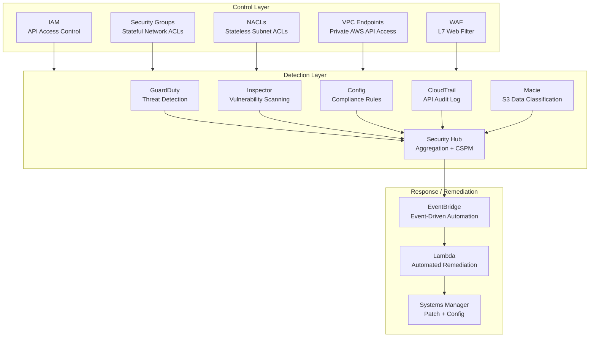
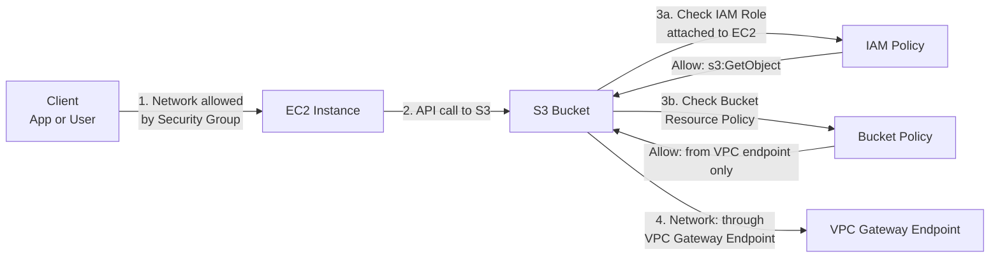
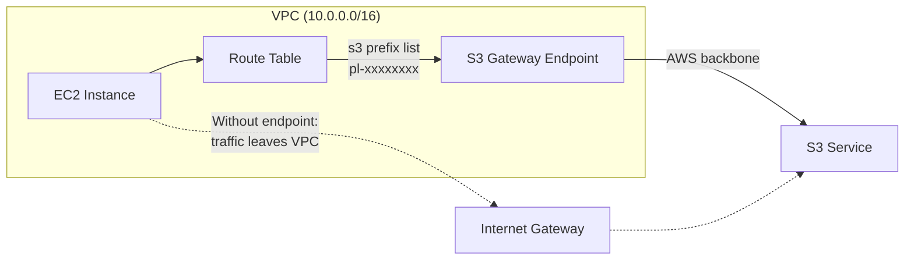
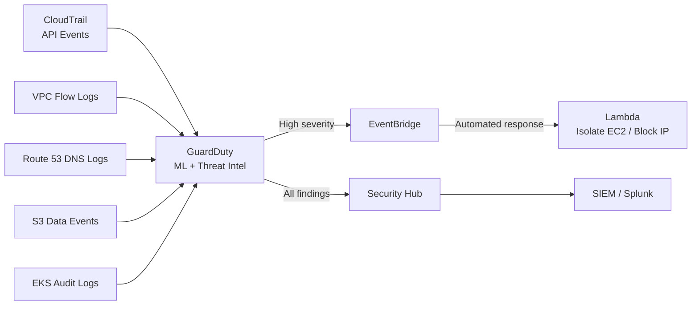
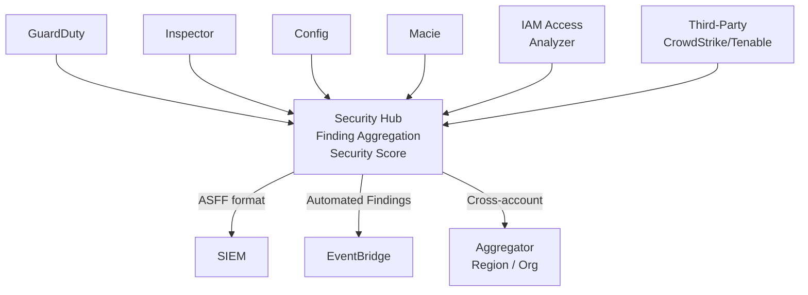

# AWS Security

## Table of Contents

- [Overview](#overview)
- [IAM and Networking: The Two-Layer Access Model](#iam-and-networking-the-two-layer-access-model)
  - [Resource-Based Policies](#resource-based-policies)
- [VPC Endpoints: Keeping Traffic Off the Internet](#vpc-endpoints-keeping-traffic-off-the-internet)
  - [Gateway Endpoints (S3 and DynamoDB)](#gateway-endpoints-s3-and-dynamodb)
  - [Interface Endpoints (PrivateLink)](#interface-endpoints-privatelink)
- [Security Groups: Stateful Network Enforcement](#security-groups-stateful-network-enforcement)
- [AWS GuardDuty: Threat Detection](#aws-guardduty-threat-detection)
- [AWS Security Hub: CSPM Aggregation](#aws-security-hub-cspm-aggregation)
- [AWS Inspector: Vulnerability Scanning](#aws-inspector-vulnerability-scanning)
- [AWS Config: Compliance Rules](#aws-config-compliance-rules)
- [AWS CloudTrail: API Audit Logging](#aws-cloudtrail-api-audit-logging)
- [IAM Access Analyzer](#iam-access-analyzer)
- [Real-World Production Scenario](#real-world-production-scenario)
  - [S3 Bucket Data Exfiltration: CloudTrail Investigation Workflow](#s3-bucket-data-exfiltration-cloudtrail-investigation-workflow)
- [Failure Modes](#failure-modes)
- [Debugging Guide](#debugging-guide)
- [Security Considerations](#security-considerations)
- [Interview Questions](#interview-questions)
  - [Basic](#basic)
  - [Intermediate](#intermediate)
  - [Advanced / Staff Level](#advanced-staff-level)

---

## Overview

AWS security is a layered discipline where IAM controls *who can call which APIs*, Security Groups control *which network traffic flows*, and a set of native detection and compliance services (GuardDuty, Security Hub, Inspector, Config, CloudTrail) continuously monitor for threats and drift. The Shared Responsibility Model defines the boundary: AWS secures the cloud infrastructure; you secure everything you deploy in the cloud. A common mistake is treating these layers as independent. In practice, a complete attack requires both IAM control (to assume a role or access secrets) and network access (to reach the service endpoint) — securing both layers forces attackers to chain multiple vulnerabilities.



---

## IAM and Networking: The Two-Layer Access Model

IAM policies control **API-level access** — can this principal call `s3:GetObject`? Security Groups control **network-level access** — can traffic reach port 443 on this EC2 instance? Both must permit access for a request to succeed.



**Key insight:** A Security Group opening port 443 outbound does not allow S3 access if the IAM role lacks `s3:GetObject`. An IAM policy granting `s3:GetObject` does not allow access if traffic must flow through a Gateway Endpoint with an endpoint policy restricting to specific buckets.

### Resource-Based Policies

Resource-based policies attach directly to resources (S3 buckets, SQS queues, KMS keys, Lambda functions). They can restrict access to requests originating from a specific VPC Endpoint:

```json
{
  "Version": "2012-10-17",
  "Statement": [{
    "Sid": "AllowVPCEndpointOnly",
    "Effect": "Deny",
    "Principal": "*",
    "Action": "s3:*",
    "Resource": ["arn:aws:s3:::prod-sensitive-bucket", "arn:aws:s3:::prod-sensitive-bucket/*"],
    "Condition": {
      "StringNotEquals": {
        "aws:SourceVpce": "vpce-0a1b2c3d4e5f6a7b8"
      }
    }
  }]
}
```

This bucket policy denies all S3 access that does not come through the specific VPC endpoint — even if the caller has valid IAM credentials. Combined with a VPC endpoint policy restricting to specific actions and principals, this creates defense-in-depth for sensitive data.

---

## VPC Endpoints: Keeping Traffic Off the Internet

### Gateway Endpoints (S3 and DynamoDB)

Gateway Endpoints route traffic to S3 and DynamoDB through the AWS backbone network, bypassing the public internet entirely. Traffic never traverses NAT Gateway or Internet Gateway. No additional cost.



**Security benefit:** Block all internet-bound S3 traffic by removing the Internet Gateway route. All S3 access forces through the gateway endpoint where endpoint policies apply.

### Interface Endpoints (PrivateLink)

Interface Endpoints create ENIs (Elastic Network Interfaces) in your VPC subnets with private IPs. Services communicate with AWS APIs using private IP addresses. Supported for 100+ AWS services: Secrets Manager, SSM, ECR, KMS, STS, and more.

**Production security pattern:**
```bash
# Create a Secrets Manager VPC endpoint
aws ec2 create-vpc-endpoint \
  --vpc-id vpc-0abc123 \
  --service-name com.amazonaws.us-east-1.secretsmanager \
  --vpc-endpoint-type Interface \
  --subnet-ids subnet-0def456 subnet-0ghi789 \
  --security-group-ids sg-0jkl012 \
  --private-dns-enabled    # Overrides public DNS resolution

# Endpoint policy: restrict to specific secrets
aws ec2 modify-vpc-endpoint \
  --vpc-endpoint-id vpce-0mno345 \
  --policy-document '{
    "Statement": [{
      "Effect": "Allow",
      "Principal": {"AWS": "arn:aws:iam::123456789012:role/AppRole"},
      "Action": "secretsmanager:GetSecretValue",
      "Resource": "arn:aws:secretsmanager:us-east-1:123456789012:secret:prod/*"
    }]
  }'
```

With `--private-dns-enabled`, `secretsmanager.us-east-1.amazonaws.com` resolves to the private ENI IP. Applications use the same SDK/API calls; traffic stays private.

---

## Security Groups: Stateful Network Enforcement

Security Groups are stateful instance-level firewalls — return traffic for allowed connections is automatically permitted. Key properties:

- **No DENY rules** — only ALLOW rules. If traffic is not explicitly allowed, it is denied.
- **Stateful** — unlike NACLs, no need for bidirectional rules. Allow port 443 inbound; the response is automatic.
- **Referenced by ID** — SGs can reference other SGs as sources/destinations, enabling tier-based access control.

**SG chaining pattern (three-tier application):**
```
Internet → ALB-SG (allows 443 from 0.0.0.0/0)
         → App-SG  (allows 8080 from ALB-SG only)
         → DB-SG   (allows 5432 from App-SG only)
```

No hardcoded IP ranges. As EC2 instances scale in and out of the App tier, they inherit App-SG membership and DB-SG automatically permits them.

**Gotcha:** Security Groups have an implicit deny-all. Forgetting to add an outbound rule (for instance, to allow EC2 to reach VPC Endpoints on port 443) causes silent connection failures that manifest as timeout errors in application logs.

---

## AWS GuardDuty: Threat Detection

GuardDuty is a managed threat detection service analyzing three log sources: CloudTrail (API calls), VPC Flow Logs (network traffic), and Route 53 DNS logs. It uses machine learning, anomaly detection, and threat intelligence to produce findings.



**Key finding categories:**
| Finding Type | Example | Severity |
|---|---|---|
| `CryptoCurrency:EC2/BitcoinTool.B` | EC2 querying Bitcoin nodes | High |
| `UnauthorizedAccess:EC2/SSHBruteForce` | SSH brute force from external IP | Medium |
| `Recon:EC2/PortProbeUnprotectedPort` | Port scanning against EC2 | Low |
| `CredentialAccess:IAMUser/AnomalousBehavior` | API calls from unusual region | High |
| `Exfiltration:S3/ObjectRead.Unusual` | Unusual S3 read volume | High |
| `Persistence:IAMUser/NetworkPermissions` | IAM policy change granting broad network access | High |

**Automated response to high severity findings:**
```python
# Lambda triggered by EventBridge on GuardDuty High finding
import boto3

def lambda_handler(event, context):
    finding = event['detail']
    severity = finding['severity']

    if severity >= 7.0:  # High
        instance_id = finding['resource']['instanceDetails']['instanceId']
        ec2 = boto3.client('ec2')

        # Isolate: move to quarantine Security Group (no inbound/outbound)
        ec2.modify_instance_attribute(
            InstanceId=instance_id,
            Groups=['sg-quarantine-id']
        )

        # Create forensic snapshot
        ec2.create_snapshot(
            VolumeId=get_root_volume(instance_id),
            Description=f"Forensic: GuardDuty finding {finding['id']}"
        )
```

---

## AWS Security Hub: CSPM Aggregation

Security Hub aggregates findings from GuardDuty, Inspector, Macie, Config, IAM Access Analyzer, and third-party tools into a single normalized view. It provides a Security Score and maps findings to security standards (CIS AWS Foundations Benchmark, AWS Foundational Security Best Practices, PCI DSS).



**Security Hub as CSPM:** The Foundational Security Best Practices standard includes 350+ controls covering EC2, S3, RDS, IAM, Lambda, EKS, and more. Each failed control includes a remediation recommendation and maps to compliance frameworks.

---

## AWS Inspector: Vulnerability Scanning

Inspector continuously scans EC2 instances and ECR container images for OS-level CVEs and software vulnerabilities.

- **EC2 scanning:** Uses the SSM Agent to scan installed packages without needing to install an Inspector agent separately. Runs continuously, not just on demand.
- **ECR scanning:** Triggered on image push; also rescans when new CVEs are published. Enhanced scanning uses the Inspector engine (vs basic scanning which uses Clair).
- **Lambda function scanning:** Scans Lambda function code and layer packages.

**Integration with CI/CD:** ECR enhanced scanning findings can block deployments by querying the Inspector API in the CD pipeline before deployment:
```bash
# Check image for CRITICAL CVEs before deploying
FINDINGS=$(aws inspector2 list-findings \
  --filter-criteria '{
    "ecrImageRepositoryName":[{"comparison":"EQUALS","value":"my-app"}],
    "severity":[{"comparison":"EQUALS","value":"CRITICAL"}],
    "findingStatus":[{"comparison":"EQUALS","value":"ACTIVE"}]
  }' \
  --query 'findings | length(@)')

if [ "$FINDINGS" -gt 0 ]; then
  echo "CRITICAL CVEs found. Blocking deployment."
  exit 1
fi
```

---

## AWS Config: Compliance Rules

Config records configuration changes to AWS resources over time and evaluates them against rules. When a resource configuration violates a rule, Config marks it as NON_COMPLIANT and can trigger automated remediation.

**Useful managed rules:**
| Rule | What it Checks |
|---|---|
| `s3-bucket-public-read-prohibited` | No S3 bucket allows public read access |
| `restricted-ssh` | No Security Group allows unrestricted SSH (0.0.0.0/0 on port 22) |
| `vpc-flow-logs-enabled` | VPC Flow Logs enabled on all VPCs |
| `cloud-trail-enabled` | CloudTrail multi-region trail is active |
| `iam-root-access-key-check` | Root account has no active access keys |
| `rds-instance-deletion-protection-enabled` | All RDS instances have deletion protection |
| `ebs-snapshot-public-restorable-check` | No EBS snapshot is publicly restorable |

**Automated remediation:** Config rules can trigger SSM Automation documents to auto-remediate violations. For example, automatically enable VPC Flow Logs on any new VPC that does not have them enabled within 5 minutes of creation.

---

## AWS CloudTrail: API Audit Logging

CloudTrail records every API call made to AWS services — who called what, from where, and when. It is the primary forensic data source for incident investigation.

**Key configuration for security:**
- **Multi-region trail:** Single trail capturing events in all regions, stored in a centralized logging account
- **Log file integrity validation:** SHA-256 hash chain makes log tampering detectable
- **Data events:** Additional logging for S3 object reads/writes and Lambda invocations (high volume; selective enabling)
- **Organization trail:** Single trail capturing events across all accounts in an AWS Organization

**CloudTrail investigation workflow (S3 data exfiltration scenario):**
```bash
# 1. Find suspicious GetObject events from unusual principals
aws cloudtrail lookup-events \
  --lookup-attributes AttributeKey=EventName,AttributeValue=GetObject \
  --start-time "2026-03-01T00:00:00Z" \
  --end-time "2026-03-02T00:00:00Z" \
  | jq '.Events[] | select(.CloudTrailEvent | fromjson | .userIdentity.type == "AssumedRole")
        | {time: .EventTime, user: .Username, bucket: (.CloudTrailEvent | fromjson | .requestParameters.bucketName)}'

# 2. Investigate a specific IAM principal's activity
aws cloudtrail lookup-events \
  --lookup-attributes AttributeKey=Username,AttributeValue=compromised-role \
  --query 'Events[*].{Time:EventTime,Name:EventName,Resources:Resources}'

# 3. Check for IAM changes (privilege escalation attempts)
aws cloudtrail lookup-events \
  --lookup-attributes AttributeKey=EventSource,AttributeValue=iam.amazonaws.com \
  --query 'Events[?EventName==`CreateAccessKey` || EventName==`AttachUserPolicy`]'
```

---

## IAM Access Analyzer

IAM Access Analyzer identifies resources (S3 buckets, IAM roles, KMS keys, Lambda functions, SQS queues) that are accessible from outside your AWS Organization or account — the blast radius of an accidental public exposure.

**Key capabilities:**
- **External access findings:** Identifies resources with policies granting access to external principals
- **Unused access findings:** Detects IAM roles/users with permissions they have not used in 90 days (least privilege violation)
- **Policy validation:** Analyzes new IAM policies before applying, flagging overly permissive statements
- **Policy generation:** Generates a minimum-privilege policy from CloudTrail activity logs

```bash
# Generate a least-privilege policy from 90 days of CloudTrail activity
aws iam generate-service-last-accessed-details --arn arn:aws:iam::123456789012:role/MyRole
DETAILS_JOB=$(aws iam generate-service-last-accessed-details --arn arn:aws:iam::123456789012:role/MyRole | jq -r .JobId)
aws iam get-service-last-accessed-details --job-id $DETAILS_JOB | \
  jq '.ServicesLastAccessed[] | select(.TotalAuthenticatedEntities > 0) | .ServiceName'
```

---

## Real-World Production Scenario

### S3 Bucket Data Exfiltration: CloudTrail Investigation Workflow

**Alert:** Security Hub finding — `Exfiltration:S3/ObjectRead.Unusual` for the `prod-customer-pii` bucket.

**Step 1: Triage (< 5 minutes)**
```bash
# Identify the GuardDuty finding details
aws guardduty get-findings \
  --detector-id $DETECTOR_ID \
  --finding-ids $FINDING_ID \
  | jq '.Findings[0] | {
      severity: .Severity,
      role: .Resource.AccessKeyDetails.UserName,
      ip: .Service.Action.AwsApiCallAction.RemoteIpDetails.IpAddressV4,
      country: .Service.Action.AwsApiCallAction.RemoteIpDetails.Country.CountryName
    }'
```

**Step 2: Contain (< 10 minutes)**
```bash
# Immediately revoke the compromised credential session
aws iam put-role-policy \
  --role-name $COMPROMISED_ROLE \
  --policy-name EmergencyDeny \
  --policy-document '{"Statement":[{"Effect":"Deny","Action":"*","Resource":"*"}]}'

# Block the source IP at the VPC level with a NACL deny rule
aws ec2 create-network-acl-entry \
  --network-acl-id $NACL_ID \
  --rule-number 50 --protocol -1 \
  --rule-action deny --egress false \
  --cidr-block "$ATTACKER_IP/32"
```

**Step 3: Investigate (< 60 minutes)**
```bash
# How did the role get compromised? Check CloudTrail for AssumeRole calls
aws cloudtrail lookup-events \
  --lookup-attributes AttributeKey=EventName,AttributeValue=AssumeRole \
  --start-time "$(date -d '24 hours ago' --iso-8601=seconds)" \
  | jq '.Events[] | select(.CloudTrailEvent | fromjson | .requestParameters.roleArn | contains("COMPROMISED_ROLE"))'

# What did the attacker access?
aws cloudtrail lookup-events \
  --lookup-attributes AttributeKey=Username,AttributeValue=$COMPROMISED_ROLE \
  | jq '.Events[] | {time: .EventTime, action: .EventName, resource: .Resources}'
```

**Step 4: Scope (determine blast radius)**
- Query CloudTrail for all `GetObject` calls against `prod-customer-pii` in the last 24 hours
- Cross-reference object keys with PII classification from Macie
- Determine notification obligations under GDPR/CCPA

**Step 5: Remediate**
- Rotate all credentials associated with the compromised role
- Review IAM Access Analyzer findings for over-permissive policies
- Apply bucket policy requiring VPC endpoint access only
- Enable S3 Object Lock on sensitive buckets

---

## Failure Modes

| Failure | Symptoms | Detection | Fix |
|---|---|---|---|
| Overly permissive Security Group | Unexpected inbound connections, port scanning findings in GuardDuty | GuardDuty `Recon` findings, Config `restricted-ssh` rule NON_COMPLIANT | Restrict SG to minimum required ports/sources; use SG chaining |
| Missing VPC Flow Logs | No network forensics available during incident | Config rule `vpc-flow-logs-enabled` NON_COMPLIANT | Enable Flow Logs on all VPCs; store in centralized S3 + Athena |
| CloudTrail disabled or tampered | Gaps in API audit log; log file integrity validation failure | CloudWatch alarm on `CloudTrailChanges`, integrity validation failure | Organization trail with CloudTrail Lake; cross-account log storage |
| IAM credential exfiltration | API calls from unexpected IP/region, GuardDuty `CredentialAccess` | GuardDuty anomaly detection on API call patterns | Least-privilege IAM, VPC endpoint conditions on policies, short STS TTLs |
| S3 bucket accidentally made public | Customer data exposed; Macie findings on public bucket | Macie, S3 Block Public Access account-level setting, Config rules | Enable S3 Block Public Access at account and organization level |
| ECS task with overprivileged task role | Container compromise → IAM privilege escalation | Inspector, periodic IAM Access Analyzer review | Scope task roles to minimum required actions/resources |

---

## Debugging Guide

**SG connectivity debugging:**
```bash
# Test connectivity and identify which SG is blocking
aws ec2 describe-network-interfaces --filters Name=vpc-id,Values=$VPC_ID \
  | jq '.NetworkInterfaces[] | {id: .NetworkInterfaceId, sg: [.Groups[].GroupId]}'

# VPC Reachability Analyzer (traces path between two resources)
aws ec2 create-network-insights-path \
  --source $SOURCE_ENI --destination $DEST_ENI \
  --protocol tcp --destination-port 5432
aws ec2 start-network-insights-analysis --network-insights-path-id $PATH_ID
aws ec2 describe-network-insights-analyses --network-insights-analysis-ids $ANALYSIS_ID
```

**IAM permission debugging:**
```bash
# Simulate an IAM call to identify which policy is denying
aws iam simulate-principal-policy \
  --policy-source-arn arn:aws:iam::123456789012:role/MyRole \
  --action-names s3:GetObject \
  --resource-arns arn:aws:s3:::my-bucket/sensitive-file.txt \
  | jq '.EvaluationResults[0] | {decision: .EvalDecision, matched: .MatchedStatements}'
```

---

## Security Considerations

- **Enable GuardDuty in every region and account** — threats in us-ap-southeast-1 affect your organization even if your workloads are in us-east-1. Use AWS Organizations to enable GuardDuty organization-wide.
- **Treat the logging account as highest-security** — if attackers can delete CloudTrail logs, they can cover their tracks. The logging account should have tight SCPs: no CloudTrail modification, no S3 object deletion.
- **IMDSv2 is mandatory** — SSRF attacks targeting the metadata endpoint (`169.254.169.254`) are the most common cloud credential theft vector. IMDSv2 requires a PUT request with a session token before metadata queries, blocking naive SSRF.
- **SCP (Service Control Policies) as the final backstop** — use SCPs to enforce guardrails that cannot be overridden by account administrators: deny GuardDuty disable, deny CloudTrail stop, deny leaving AWS Organization, deny root account key creation.

---

## Interview Questions

### Basic

**Q: What is the difference between IAM policies and Security Groups?**
A: IAM policies control API-level access — can this principal call `ec2:DescribeInstances` or `s3:GetObject`. Security Groups control network-level access — can TCP traffic reach port 443 on this resource. Both must allow access for a request to succeed. Security Groups are stateful (return traffic automatic) and have no DENY rules — only ALLOW. IAM policies support both Allow and Deny with precedence (explicit Deny wins).

**Q: What is the difference between Gateway Endpoints and Interface Endpoints?**
A: Gateway Endpoints (S3 and DynamoDB only) are route table entries that direct traffic through the AWS backbone — no ENI, no additional cost, traffic stays in AWS. Interface Endpoints (PrivateLink) create ENIs in your subnets with private IPs, supporting 100+ AWS services. Interface Endpoints support endpoint policies and work with `--private-dns-enabled` to transparently intercept all SDK calls to supported services.

**Q: What does GuardDuty analyze and what does it not cover?**
A: GuardDuty analyzes CloudTrail (API calls), VPC Flow Logs (network traffic), Route 53 DNS logs, S3 data events, and EKS audit logs. It does NOT scan for vulnerabilities (that's Inspector), does NOT check configuration compliance (that's Config), and does NOT classify sensitive data (that's Macie). GuardDuty detects threats in progress; the others detect posture weaknesses.

### Intermediate

**Q: How would you restrict S3 access to originate only from within your VPC?**
A: Two-layer approach: (1) Create an S3 Gateway Endpoint in the VPC — traffic routes through the backbone. (2) Add a bucket policy with a `Deny` statement that has a condition `StringNotEquals: aws:SourceVpce: vpce-xxx` — any request not originating from the specific VPC endpoint is denied. Additionally, add `aws:SourceVpc` condition for defense-in-depth. At the account level, enable S3 Block Public Access to prevent any accidental public access configuration.

**Q: How do you investigate an IAM credential compromise with CloudTrail?**
A: (1) Identify the compromised principal — GuardDuty finding provides the access key and source IP. (2) Look up `AssumeRole` and `GetSessionToken` events for that principal in CloudTrail to understand how they acquired credentials. (3) Enumerate all API calls from that principal in the incident window — sort by EventName to identify data access, IAM changes, and resource creation. (4) Use `GetCallerIdentity` calls to understand which accounts were accessed. (5) Check for `CreateAccessKey` calls indicating the attacker created persistence. Containment: add an inline Deny policy to immediately revoke all sessions (AWS IAM revoke-sessions-last-used pattern).

### Advanced / Staff Level

**Q: Design a defense-in-depth strategy for a multi-account AWS organization handling PCI-DSS data.**
A: (1) **Account isolation:** Dedicated AWS account for cardholder data environment (CDE) — total account isolation limits blast radius. (2) **SCPs:** Deny CloudTrail disable, GuardDuty disable, VPC Flow Log disable, root key creation across all accounts. Deny any action not required for PCI workloads in the CDE account. (3) **Network:** CDE VPC with no Internet Gateway. All AWS API access via Interface Endpoints with endpoint policies. Transit Gateway to a shared services account for controlled connectivity. No VPC peering to non-CDE accounts. (4) **IAM:** Session policies on all assumed roles. Require MFA for console access. IAM Access Analyzer continuous monitoring. Unused permission detection and automatic remediation. (5) **Detective controls:** GuardDuty + Security Hub + Config all enabled in every region. All logs to immutable logging account with CloudTrail Lake. Macie scanning CDE S3 buckets. (6) **Continuous compliance:** Config Conformance Pack for PCI DSS standard. Failed rules trigger automated remediation via SSM Automation. Security Hub custom insights for PCI control evidence collection.
