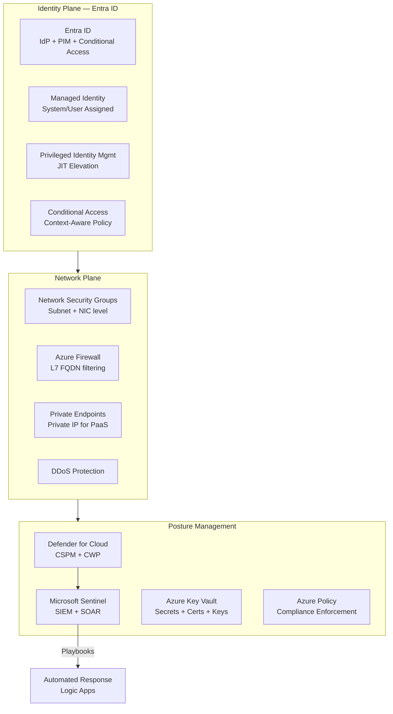
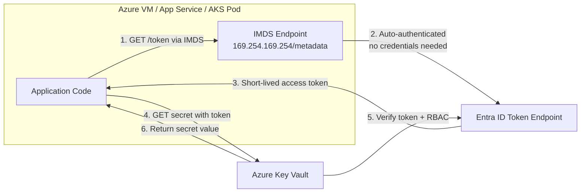
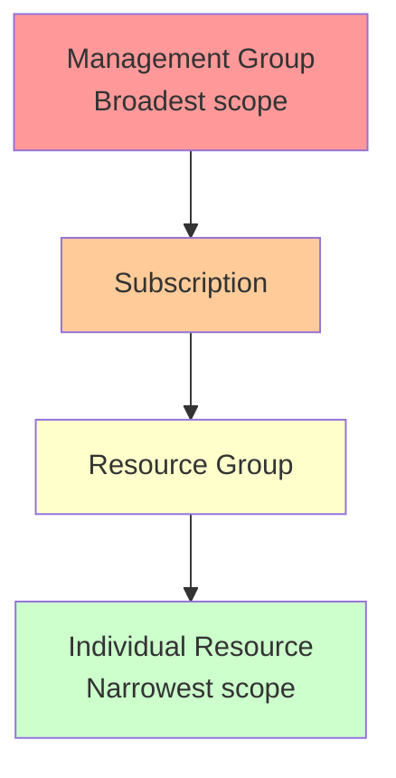
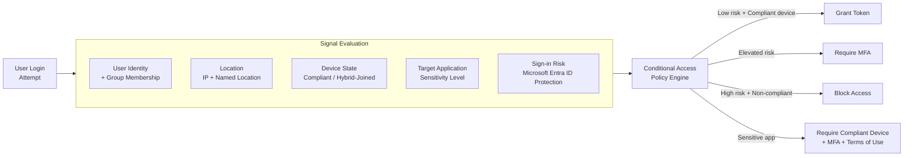
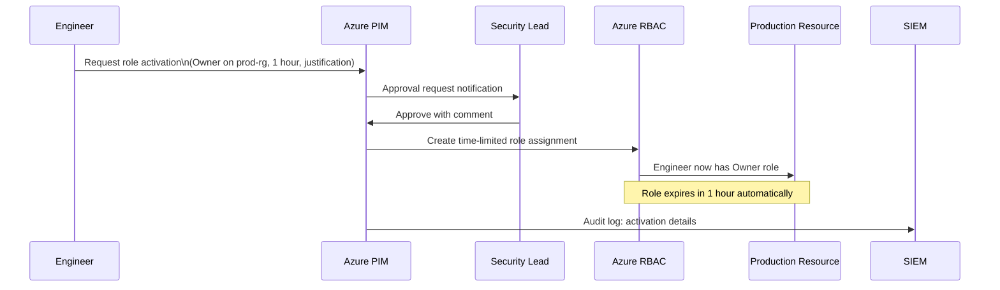
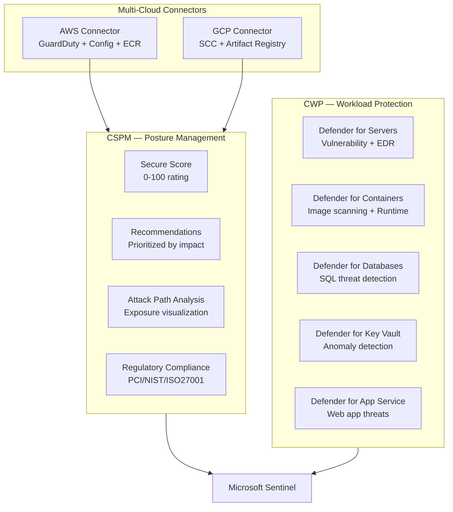
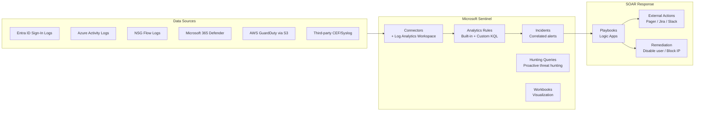
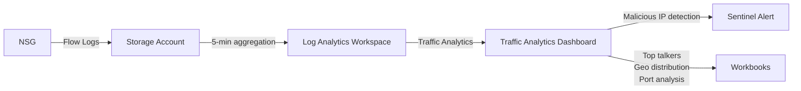
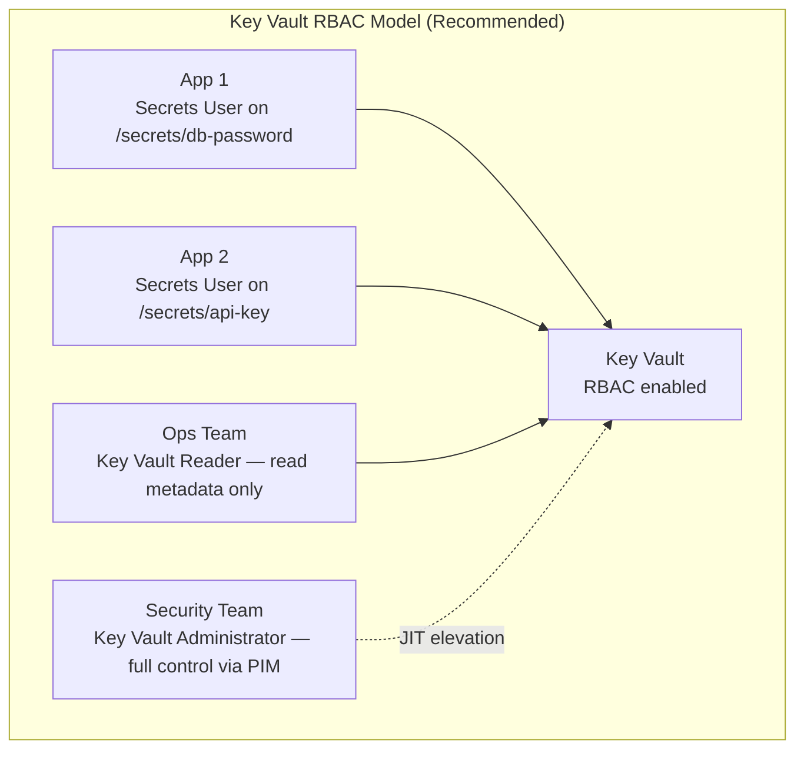

# Azure Security

## Table of Contents

- [Overview](#overview)
- [Azure AD (Entra ID) and Managed Identity](#azure-ad-entra-id-and-managed-identity)
  - [Managed Identity: The Azure Identity Primitive](#managed-identity-the-azure-identity-primitive)
  - [RBAC Scope Hierarchy](#rbac-scope-hierarchy)
- [Conditional Access: Context-Aware Identity Policy](#conditional-access-context-aware-identity-policy)
- [Azure PIM: Just-in-Time Privilege](#azure-pim-just-in-time-privilege)
- [Microsoft Defender for Cloud](#microsoft-defender-for-cloud)
- [Microsoft Sentinel: SIEM + SOAR](#microsoft-sentinel-siem-soar)
- [Azure Policy: Compliance Enforcement](#azure-policy-compliance-enforcement)
- [NSG Flow Logs and Traffic Analytics](#nsg-flow-logs-and-traffic-analytics)
- [Azure Key Vault](#azure-key-vault)
- [Real-World Production Scenario](#real-world-production-scenario)
  - [Lateral Movement Detected in Azure: Sentinel Alert to Containment](#lateral-movement-detected-in-azure-sentinel-alert-to-containment)
- [Failure Modes](#failure-modes)
- [Debugging Guide](#debugging-guide)
- [Security Considerations](#security-considerations)
- [Interview Questions](#interview-questions)
  - [Basic](#basic)
  - [Intermediate](#intermediate)
  - [Advanced / Staff Level](#advanced-staff-level)

---

## Overview

Azure security spans three interconnected planes: **identity** (Entra ID / Azure AD), **network** (NSGs, Azure Firewall, Private Endpoints), and **posture management** (Microsoft Defender for Cloud). The defining characteristic of Azure security versus AWS is the depth of Entra ID integration — identity is the control plane for both human access and workload identity through Managed Identities. A compromised Managed Identity with overly broad RBAC assignments is the Azure equivalent of AWS's overprivileged IAM role. Defender for Cloud provides unified CSPM across Azure, AWS, and GCP. Microsoft Sentinel serves as the SIEM/SOAR layer that operationalizes all security signals into detections and automated responses.



---

## Azure AD (Entra ID) and Managed Identity

### Managed Identity: The Azure Identity Primitive

Managed Identities eliminate static credentials for Azure workloads. Instead of storing a client secret, a VM, App Service, or AKS pod authenticates to Azure services using an auto-managed certificate issued and rotated by Azure.



**System-assigned vs User-assigned:**

| Property | System-Assigned | User-Assigned |
|---|---|---|
| Lifecycle | Tied to the resource | Independent resource |
| Scope | One resource | Multiple resources can share |
| Rotation | Automatic | Automatic |
| Use case | Single VM/App needing its own identity | Multiple resources needing same access (e.g., all VMs in a scale set) |
| Risk | Identity deleted with resource | Must track and govern separately |

**Production pattern — AKS Workload Identity:**
```yaml
# AKS pod annotation for Workload Identity (OIDC federation)
apiVersion: v1
kind: ServiceAccount
metadata:
  name: payments-sa
  namespace: production
  annotations:
    azure.workload.identity/client-id: "12345678-abcd-efgh-ijkl-mnopqrstuvwx"
---
apiVersion: apps/v1
kind: Deployment
metadata:
  name: payments-api
spec:
  template:
    metadata:
      labels:
        azure.workload.identity/use: "true"
    spec:
      serviceAccountName: payments-sa
```

### RBAC Scope Hierarchy

Azure RBAC assignments are inherited downward through the scope hierarchy:



**Least privilege principle:** Assign roles at the narrowest applicable scope. A data engineer needing read access to one Storage Account should not receive `Storage Blob Data Reader` at the subscription scope.

**Built-in roles for common patterns:**
| Role | Scope | Use Case |
|---|---|---|
| `Contributor` | RG or below | Service teams managing their own resources |
| `Reader` | Any | Read-only audit/monitoring access |
| `Key Vault Secrets User` | Key Vault | Applications reading secrets |
| `AcrPull` | Container Registry | AKS nodes pulling images |
| `Storage Blob Data Reader` | Storage Account or container | Read-only blob access |

---

## Conditional Access: Context-Aware Identity Policy

Conditional Access (CA) is Azure's Policy Engine for human access. It evaluates signals and enforces controls before granting access tokens.



**Example: Block access from non-approved countries**
```json
{
  "displayName": "Block access from non-approved countries",
  "state": "enabled",
  "conditions": {
    "users": { "includeUsers": ["All"], "excludeRoles": ["62e90394-69f5-4237-9190-012177145e10"] },
    "locations": {
      "includeLocations": ["All"],
      "excludeLocations": ["approved-countries-named-location-id"]
    }
  },
  "grantControls": { "operator": "OR", "builtInControls": ["block"] }
}
```

**Token binding / DPoP:** Conditional Access can enforce token binding, requiring the access token to be bound to a specific device key — token theft from one device cannot be replayed on another.

---

## Azure PIM: Just-in-Time Privilege

Privileged Identity Management (PIM) enforces time-limited elevation for high-privilege roles. Users are **eligible** for a role but must actively **activate** it with justification, duration, and optionally an approval workflow.



**Key PIM settings for production:**
- **Activation duration:** Maximum 4 hours for owner-equivalent roles; 1 hour for critical resources
- **Require justification:** Mandatory business justification for every activation
- **Require approval:** Two-person approval for Global Administrator and security-sensitive roles
- **Activation requires MFA:** Fresh MFA required at activation time, not just at sign-in
- **Alert on permanent assignments:** PIM alerts when roles are directly assigned (bypassing JIT)

---

## Microsoft Defender for Cloud

Defender for Cloud provides unified CSPM (Cloud Security Posture Management) and CWP (Cloud Workload Protection) across Azure, AWS, and GCP.



**Secure Score improvement workflow:**
1. Defender for Cloud identifies a recommendation: "Enable just-in-time VM access (30 points impact)"
2. Engineer reviews affected VMs in the recommendation detail
3. Click "Fix" → Defender auto-creates the JIT policy
4. Secure Score increases after compliance verification

---

## Microsoft Sentinel: SIEM + SOAR

Sentinel is Azure's cloud-native SIEM and SOAR platform. It ingests data from 200+ connectors, applies analytics rules to detect threats, and automates response via Playbooks (Logic Apps).



**Example KQL analytics rule — impossible travel:**
```kql
let timeframe = 1h;
let travelSpeed = 900; // km/h (roughly max commercial aviation)
SigninLogs
| where TimeGenerated > ago(timeframe)
| where ResultType == "0" // successful sign-in
| project UserId, UserPrincipalName, TimeGenerated, Location, IPAddress
| sort by UserId, TimeGenerated asc
| extend prevTime = prev(TimeGenerated, 1), prevLocation = prev(Location, 1), prevUser = prev(UserId, 1)
| where UserId == prevUser and Location != prevLocation
| extend timeDiff = datetime_diff('minute', TimeGenerated, prevTime)
| where timeDiff < 60 // sign-ins within 60 minutes from different countries
| project-away prevUser
```

---

## Azure Policy: Compliance Enforcement

Azure Policy applies to Azure Resource Manager operations — enforcing and auditing resource configurations across subscriptions.

**Policy effects (ordered by strictness):**

| Effect | Behavior | Use Case |
|---|---|---|
| `Audit` | Creates a compliance finding, allows operation | Detection without enforcement |
| `AuditIfNotExists` | Audit if a related resource doesn't exist | Check if diagnostic settings exist |
| `Modify` | Adds/removes resource tags or properties | Auto-tag resources with environment |
| `DeployIfNotExists` | Deploys a related resource if absent | Auto-deploy Log Analytics workspace |
| `Deny` | Blocks the operation | Prevent non-compliant resource creation |
| `Disabled` | Policy exists but does not evaluate | Temporarily disable without deletion |

**Initiative (policy set) for AKS security:**
```json
{
  "displayName": "AKS Security Baseline",
  "policyDefinitions": [
    {"policyDefinitionId": "/providers/Microsoft.Authorization/policyDefinitions/47a1ee2f..."},
    {"policyDefinitionId": "/providers/Microsoft.Authorization/policyDefinitions/95edb821..."},
    {"policyDefinitionId": "/providers/Microsoft.Authorization/policyDefinitions/febd0533..."}
  ]
}
```

Policies cover: AKS authorized IP ranges required, Azure Policy add-on required, Defender for Containers enabled, HTTPS-only ingress.

---

## NSG Flow Logs and Traffic Analytics

NSG Flow Logs capture TCP/UDP flows at the subnet and NIC level. Traffic Analytics (built on top of Flow Logs) provides aggregated insights and anomaly detection.



**Useful Traffic Analytics insights for security:**
- Top 10 source IPs by volume — identifies scanning or exfiltration
- Flow count to unusual destination ports — detects lateral movement
- Geographic distribution of allowed flows — detects unexpected foreign traffic
- Blocked flow analysis — identifies misconfigurations or attack attempts

---

## Azure Key Vault

Key Vault stores secrets, certificates, and cryptographic keys with HSM-backed protection and comprehensive audit logging.

**Access model: RBAC vs Access Policies**

The legacy Access Policy model grants vault-level access to all secrets/keys/certificates of a given type. The RBAC model supports fine-grained per-object access and integrates with PIM for JIT elevation. **Use RBAC for new deployments.**



**Critical security settings:**
- **Soft delete:** 7-90 day retention after deletion; prevents accidental permanent deletion
- **Purge protection:** Disables purge until retention period expires; even owners cannot purge immediately
- **Private Endpoint:** Removes public endpoint; Key Vault accessible only from within VNet
- **Diagnostic logging:** All operations logged to Log Analytics — mandatory for SOC 2 and PCI compliance

**Key rotation with Event Grid:**
```json
// Event Grid subscription triggers rotation Lambda/Function when key nears expiry
{
  "eventType": "Microsoft.KeyVault.CertificateNearExpiry",
  "daysBeforeExpiry": 30,
  "action": "trigger-certificate-rotation-pipeline"
}
```

---

## Real-World Production Scenario

### Lateral Movement Detected in Azure: Sentinel Alert to Containment

**Alert:** Sentinel incident — `Lateral Movement via Pass-the-Hash on Azure VM` — Medium severity.

**Step 1: Triage (< 5 minutes)**
```kql
// In Sentinel Hunting: check all events for affected entity
SecurityEvent
| where Computer == "prod-vm-003"
| where TimeGenerated > ago(1h)
| where EventID in (4624, 4625, 4648, 4672)  // Logon events
| project TimeGenerated, EventID, Account, LogonType, IpAddress, ProcessName
| order by TimeGenerated desc
```

**Step 2: Understand scope**
```kql
// Identify all resources the compromised identity accessed
AuditLogs
| where TimeGenerated > ago(4h)
| where InitiatedBy.user.userPrincipalName == "compromised-user@corp.com"
| project TimeGenerated, OperationName, TargetResources, ResultDescription
| order by TimeGenerated desc
```

**Step 3: Contain — Playbook auto-execution**
The Sentinel incident triggers a Logic App Playbook automatically:
1. **Disable Entra ID user account** — blocks new authentications
2. **Revoke all active refresh tokens** — blocks existing sessions
3. **Isolate VM** — move to quarantine NSG (deny all inbound/outbound)
4. **PIM alert** — notify Security Lead for escalation
5. **Create Jira incident** — auto-populate with Sentinel incident details

```json
// Logic App action: Disable Entra ID user
{
  "type": "ApiConnection",
  "inputs": {
    "method": "PATCH",
    "path": "/users/@{triggerBody()?['entities'][0]?['userPrincipalName']}",
    "body": { "accountEnabled": false }
  }
}
```

**Step 4: Investigate**
- Check Defender for Servers findings on `prod-vm-003` — any exploitable vulnerability?
- Review Entra ID sign-in logs for impossible travel or risky sign-in that preceded the lateral movement
- Query Azure Activity Log for any RBAC changes made by compromised identity
- Check Key Vault diagnostic logs for secret access by compromised identity

**Step 5: Recover**
- Password reset + MFA re-enrollment for compromised user
- Rotate any secrets the compromised identity had access to
- Review and reduce RBAC assignments (least privilege)
- Enable JIT VM access to prevent direct RDP/SSH exposure
- Apply Conditional Access policy requiring compliant device for future access

---

## Failure Modes

| Failure | Symptoms | Detection | Fix |
|---|---|---|---|
| Overly broad Managed Identity RBAC | Compromised VM/App → full subscription access | Defender for Cloud recommendations, IAM review | Scope role assignments to resource group or individual resource |
| PIM bypass via direct assignment | Elevated access without approval workflow | PIM alert "Permanent assignment detected", Sentinel rule | Governance policy: only eligible assignments allowed for privileged roles |
| NSG allows RDP/SSH from internet | VM exposed to brute-force attacks | Defender for Cloud "Just-in-time VM access should be applied" | Enable JIT access; deny 3389/22 from 0.0.0.0/0 |
| Key Vault without Private Endpoint | Secrets accessible over public internet | Defender for Key Vault, Network policy check | Deploy Private Endpoint; add network rules to deny public access |
| Conditional Access policy excluded critical service accounts | Service accounts bypass MFA and location controls | CA policy gap analysis | Separate service account policies; use dedicated Workload Identities |
| Sentinel connector misconfigured | Missing events → missed detections | Coverage gap analysis in Sentinel | Verify connector health in Sentinel data connectors dashboard |

---

## Debugging Guide

**Diagnose Conditional Access block:**
```bash
# Sign-in log with CA results
az monitor log-analytics query \
  --workspace $WORKSPACE_ID \
  --analytics-query "SigninLogs
    | where UserPrincipalName == 'user@corp.com'
    | where TimeGenerated > ago(1h)
    | project TimeGenerated, ResultType, ResultDescription,
              ConditionalAccessPolicies, DeviceDetail
    | order by TimeGenerated desc
    | take 10"
```

**Diagnose RBAC permission denied:**
```bash
# Check effective permissions for a principal
az role assignment list --assignee $PRINCIPAL_ID --all \
  | jq '.[] | {role: .roleDefinitionName, scope: .scope}'

# Verify Key Vault RBAC assignments
az keyvault show --name $KV_NAME --query "properties.enableRbacAuthorization"
az role assignment list --scope $(az keyvault show --name $KV_NAME --query id -o tsv)
```

**Diagnose NSG blocking traffic:**
```bash
# Effective security rules for a NIC
az network nic show-effective-nsg --name $NIC_NAME --resource-group $RG \
  | jq '.effectiveSecurityRules[] | select(.access == "Deny") | {name, protocol, srcPort: .sourcePortRange, dstPort: .destinationPortRange, src: .sourceAddressPrefix}'
```

---

## Security Considerations

- **Entra ID is the highest-value target** — an attacker who compromises a Global Administrator account owns the entire tenant. Use PIM for all privileged roles, enforce MFA with FIDO2, and continuously review eligible/active assignments.
- **Managed Identity scope creep** — review all Managed Identity RBAC assignments quarterly with Azure Policy initiatives. Scope assignments to the minimum required resource.
- **Conditional Access policy gaps** — every Conditional Access policy has exclusion lists for break-glass accounts and service accounts. Audit exclusions regularly; they are a primary bypass vector.
- **Key Vault purge protection** — once soft delete is enabled and purge protection is off, a compromised admin account can permanently destroy cryptographic material in seconds. Enable purge protection on all vaults before anyone has operational access.
- **Cross-tenant attacks** — Azure multi-tenant applications can have identity confusion vulnerabilities. Always validate the `tid` (tenant ID) claim in JWT tokens to prevent cross-tenant impersonation.

---

## Interview Questions

### Basic

**Q: What is a Managed Identity and why is it preferred over service principals with secrets?**
A: A Managed Identity is an automatically managed identity in Entra ID for Azure resources. The Azure platform creates and rotates the underlying certificate automatically — there are no static credentials to manage, store, or rotate manually. Service principals with client secrets require secret management: the secret must be stored somewhere (creating a secret sprawl problem), rotated periodically, and the rotation can cause outages if not synchronized. Managed Identity eliminates all of this: the VM or App Service simply calls the IMDS endpoint to get an access token, and Azure handles authentication to the target service.

**Q: What is the scope hierarchy for Azure RBAC and why does it matter?**
A: Management Group → Subscription → Resource Group → Resource. Assignments are inherited downward — a role assigned at the subscription scope is effective for all resource groups and resources within. It matters because assigning broad roles at high scopes is a common over-privilege mistake. A developer needing write access to a dev storage account should get the role at the storage account scope, not at the subscription scope which would grant access to production resources.

**Q: How does Azure PIM differ from regular RBAC assignment?**
A: Regular RBAC is a permanent assignment — the user always has the role. PIM creates an eligible assignment — the user can request activation with a time limit, justification, and optionally an approval requirement. During normal operations, the user has no elevated access. They activate only when needed, reducing the window of privilege exposure. PIM also generates detailed audit logs of every activation, making privileged access visible and reviewable.

### Intermediate

**Q: How would you prevent lateral movement from a compromised AKS pod in Azure?**
A: Multiple layers: (1) **Network:** AKS with Calico NetworkPolicy default-deny; pods can only reach explicitly allowed endpoints. Azure CNI with Network Policy enforced at the node level. (2) **Identity:** Workload Identity with a dedicated Managed Identity per workload scoped to minimum RBAC. If a pod's identity is compromised, the blast radius is limited to that identity's narrow permissions. (3) **Runtime:** Defender for Containers running in the cluster — detects anomalous process execution and network connections in real-time. (4) **API restrictions:** AKS authorized IP ranges limiting which networks can reach the Kubernetes API server. (5) **Admission:** Azure Policy add-on enforcing Pod Security Standards.

**Q: A Sentinel alert fires for "impossible travel." Walk through your response.**
A: (1) **Validate:** Check if the user is on a VPN or using a proxy — common false positive. Query the sign-in log for device details, conditional access results, and risk score. (2) **Correlate:** Look at all other activity from that user in the same timeframe — did they access sensitive resources, create service principals, or modify RBAC assignments? (3) **Contain if confirmed:** Disable the Entra ID account immediately (blocks new sign-ins). Revoke refresh tokens (`revokeSignInSessions` Microsoft Graph API). If evidence of privilege abuse, activate PIM break-glass to investigate with elevated access. (4) **Investigate:** Check all Azure Activity Log entries for the account. Review Key Vault access logs. Check for new service principal creation or RBAC assignments. (5) **Recover:** Password reset with MFA re-enrollment. Review CA policies that might have allowed the sign-in.

### Advanced / Staff Level

**Q: Design a Sentinel detection strategy for detecting Azure AD compromise before an attacker achieves persistence.**
A: Focus on the attack progression timeline: (1) **Initial access indicators:** Sign-in risk elevation (Entra ID Protection feeds Sentinel), impossible travel, unfamiliar sign-in properties (new ASN, new device). Analytics rule correlating sign-in risk + new device + sensitive app access within 30 minutes. (2) **Persistence indicators:** New service principal creation, new OAuth app consent, new directory role assignment, new Conditional Access named location added. Any of these within 2 hours of a risky sign-in should fire a High incident. (3) **Privilege escalation indicators:** PIM activation outside business hours, PIM activation for Global Admin without prior pattern, direct RBAC assignment bypassing PIM. (4) **Lateral movement indicators:** Service principal signing in from new IP, Managed Identity used from unexpected network source (compare against baseline using ML-based analytics), new Azure resource deployment in unexpected regions/subscriptions. (5) **Fusion rules:** Sentinel's ML Fusion engine correlates signals across these stages to detect multi-stage attacks that individual rules would miss. Tune fusion sensitivity based on your baseline noise level.
