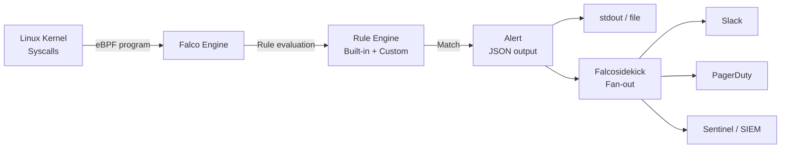

# Container Security

## Overview

Container security is defense-in-depth across the entire artifact lifecycle. The threat model is straightforward: if an attacker exploits a vulnerability in a container running as root with no seccomp profile and a writable filesystem, they may achieve host escape and full node compromise. The controls at each layer directly constrain the blast radius. Build-time controls reduce the attack surface (minimal images, no CVEs). Deploy-time controls limit privilege (non-root, no capabilities, seccomp). Admission controls enforce these at the cluster gate. Runtime controls detect when something that bypassed all other layers is actively executing.

```mermaid
flowchart LR
    subgraph Build["Build Phase"]
        SRC[Source Code] --> MSTG[Multi-Stage Build]
        MSTG --> DLESS[Distroless / Chainguard\nBase Image]
        DLESS --> SCAN[Trivy / Grype Scan\nBlock on CRITICAL]
    end

    subgraph Sign["Sign + Attest"]
        SCAN --> SIGN[Cosign Keyless Sign\nvia Fulcio + Rekor]
        SIGN --> SBOM[SBOM Attestation\nCycloneDX]
    end

    subgraph Deploy["Deploy Phase"]
        SBOM --> ADM[Admission Controller\nKyverno / OPA Gatekeeper]
        ADM --> PSA[Pod Security Admission\nRestricted Profile]
        PSA --> SEC[seccomp + AppArmor\nKernel-level restriction]
    end

    subgraph Runtime["Runtime Phase"]
        SEC --> FALCO[Falco\nSyscall monitoring]
        FALCO --> RESP[Alert + Kill Pod\nTetragon enforcement]
    end

    Build --> Sign --> Deploy --> Runtime
```



---

## Image Hardening: The Attack Surface Reduction Stack

### Base Image Comparison

Every package in a base image is a potential CVE. The goal: minimize what is present.

| Image | Size | Shell | Pkg Manager | Typical CVEs | Best For |
|---|---|---|---|---|---|
| `ubuntu:24.04` | ~77 MB | bash | apt | High (100+ packages) | Development only |
| `debian:bookworm-slim` | ~74 MB | bash | apt | Medium | General workloads needing glibc |
| `alpine:3.21` | ~7 MB | sh (BusyBox) | apk | Low | Go/Python with musl awareness |
| `gcr.io/distroless/static-debian12` | ~2 MB | None | None | Near-zero | Go/Rust static binaries |
| `gcr.io/distroless/static-debian12:nonroot` | ~2 MB | None | None | Near-zero | Same, user 65532 pre-set |
| `cgr.dev/chainguard/static:latest` | ~1 MB | None | None | Zero-CVE target | Hardened alternative, daily rebuild |
| `scratch` | 0 MB | None | None | None | Fully static CGO_ENABLED=0 binaries |

**Distroless vs Chainguard:** Both eliminate shells and package managers. Chainguard additionally rebuilds images daily to pick up OS patches immediately — CVE window measured in hours vs the distroless rebuild cadence. Chainguard images ship with SBOM attestations and Cosign signatures out of the box.

**Multi-stage build pattern:**
```dockerfile
# Stage 1: Build — fat image with all build tools
FROM golang:1.23-alpine AS builder
WORKDIR /app
COPY go.mod go.sum ./
RUN go mod download
COPY . .
# CGO_ENABLED=0: static binary, no glibc dependency
RUN CGO_ENABLED=0 GOOS=linux go build -trimpath -ldflags="-s -w" -o /app/server ./cmd/server

# Stage 2: Runtime — only the binary, nothing else
FROM gcr.io/distroless/static-debian12:nonroot
# nonroot tag: runs as UID 65532, not root
COPY --from=builder /app/server /server
# No USER directive needed: nonroot tag pre-sets it
ENTRYPOINT ["/server"]
```

**Production implication:** The final image has no shell, no package manager, no curl, no wget. An attacker who achieves code execution in the container cannot install tools or run arbitrary commands — they are limited to what the binary itself can do.

---

## Image Scanning: Trivy vs Grype vs Snyk vs ECR

| Tool | Type | Speed | Key Strength | Weakness |
|---|---|---|---|---|
| **Trivy** (Aqua) | OSS | Fast (15-30s) | All-in-one: images, IaC, secrets, SBOM generation | Some false positives |
| **Grype** (Anchore) | OSS | Fast | Pairs perfectly with Syft for SBOM; CI-first | Narrower scope than Trivy |
| **Snyk Container** | Commercial | Moderate | Base image upgrade recommendations, auto-fix PRs | Cost, requires license |
| **ECR Basic Scanning** | Managed | On push | Zero setup for ECR users | Uses Clair, less accurate than enhanced |
| **ECR Enhanced** (Inspector) | Managed | Continuous | Rescans on new CVEs, Inspector integration | Cost per image |

**CI integration pattern:**
```yaml
# GitHub Actions: block merge on CRITICAL CVEs
- name: Scan image with Trivy
  uses: aquasecurity/trivy-action@master
  with:
    image-ref: ${{ env.IMAGE }}
    format: sarif
    output: trivy-results.sarif
    severity: HIGH,CRITICAL
    exit-code: 1
    ignore-unfixed: false

- name: Upload results to GitHub Security tab
  uses: github/codeql-action/upload-sarif@v3
  with:
    sarif_file: trivy-results.sarif
```

**The scanning gap:** CI scanning only covers the image at build time. New CVEs are published daily. Use the Trivy Operator (in-cluster) or ECR Enhanced Scanning to continuously rescan images running in production, triggering alerts when a deployed image receives a new CRITICAL finding.

---

## Runtime Security: Falco and Tetragon

### Falco: Kernel Syscall Monitoring

Falco monitors the kernel using eBPF (or a kernel module) and evaluates events against a rule engine. A match generates an alert.



**Critical Falco rules:**
```yaml
# Shell spawned in production container — almost always malicious
- rule: Terminal shell in container
  desc: A shell process was spawned in a container
  condition: >
    spawned_process and container and
    proc.name in (shell_binaries) and
    container.image.repository not in (allowed_shell_images) and
    not proc.pname in (runc, cri-o, containerd-shim)
  output: >
    Shell spawned (user=%user.name container=%container.name
    image=%container.image.repository:%container.image.tag
    pod=%k8s.pod.name ns=%k8s.ns.name cmd=%proc.cmdline)
  priority: CRITICAL
  tags: [container, shell, T1059]

# Cryptominer detection: outbound to known mining pools
- rule: Outbound connection to C2 servers
  desc: Attempt to reach known mining pool or C2
  condition: >
    outbound and
    fd.sip in (known_miner_ips) or
    fd.sport in (3333, 4444, 14444, 45700)
  output: >
    Outbound connection to miner/C2 (container=%container.name
    ip=%fd.sip port=%fd.sport)
  priority: CRITICAL
  tags: [network, cryptominer, T1071]

# Sensitive file access — service account token theft
- rule: Read sensitive file untrusted
  desc: An attempt to read sensitive files outside expected processes
  condition: >
    open_read and container and
    sensitive_files and
    not proc.name in (trusted_processes)
  output: >
    Sensitive file opened (user=%user.name file=%fd.name
    container=%container.name pod=%k8s.pod.name)
  priority: HIGH
```

### Tetragon: eBPF Enforcement

Tetragon goes beyond detection to enforcement — it can kill processes or drop network connections in real-time at the eBPF layer. Kubernetes-aware: it knows pod labels, namespaces, and service accounts.

```yaml
# Tetragon TracingPolicy: kill any process writing to /etc in a container
apiVersion: cilium.io/v1alpha1
kind: TracingPolicy
metadata:
  name: block-etc-writes
spec:
  kprobes:
    - call: "security_file_permission"
      syscall: false
      args:
        - index: 0
          type: "file"
        - index: 1
          type: "int"
      selectors:
        - matchArgs:
            - index: 1
              operator: "Equal"
              values:
                - "2"  # MAY_WRITE
          matchNamespaces:
            - namespace: Pid
              operator: NotIn
              values:
                - "host_pid_ns"
          matchActions:
            - action: Sigkill  # Kill the process immediately
```

**Falco vs Tetragon:**
| Dimension | Falco | Tetragon |
|---|---|---|
| Mode | Detect and alert | Detect and enforce (kill/drop) |
| K8s awareness | Via metadata enrichment | Native (Cilium integration) |
| Network enforcement | Via NetworkPolicy integration | Direct: drop connections at eBPF |
| Overhead | ~1-3% CPU | ~1-2% CPU |
| Rule language | YAML rules | CRD-based TracingPolicy |
| Response time | Seconds (alert) | Microseconds (eBPF enforcement) |

---

## Pod Security Standards (PSA)

PSA replaced Pod Security Policies (deprecated in K8s 1.21, removed in 1.25). Three levels, enforced via namespace labels.

| Level | What it Restricts | Use Case |
|---|---|---|
| `privileged` | Nothing — same as no policy | System namespaces (kube-system) |
| `baseline` | Blocks known privilege escalations: hostPID, hostIPC, hostNetwork, privileged containers, host ports, dangerous capabilities | Most application workloads |
| `restricted` | Baseline + requires non-root, no privilege escalation, drops ALL capabilities, read-only root FS, seccomp RuntimeDefault | Security-sensitive production workloads |

```bash
# Apply restricted PSA to a production namespace
kubectl label namespace production \
  pod-security.kubernetes.io/enforce=restricted \
  pod-security.kubernetes.io/enforce-version=latest \
  pod-security.kubernetes.io/warn=restricted \
  pod-security.kubernetes.io/audit=restricted
```

**Migration from PSP:** PSP was namespace-scoped but had complex binding semantics. PSA is simpler — namespace labels define the level, and the built-in admission controller enforces it. For granular exceptions not supported by PSA, use Kyverno with PolicyExceptions.

---

## seccomp: System Call Filtering

seccomp restricts which system calls a container can make. The `RuntimeDefault` profile blocks ~300 of ~450 available syscalls (the most dangerous ones: `ptrace`, `unshare`, `kexec_load`, etc.).

```yaml
# Pod spec with seccomp RuntimeDefault
spec:
  securityContext:
    seccompProfile:
      type: RuntimeDefault   # Let container runtime choose (containerd's default profile)
  containers:
    - name: app
      securityContext:
        seccompProfile:
          type: RuntimeDefault   # Override at container level if needed
```

**Custom seccomp profile for audit/discovery:**
```yaml
# First, run in audit mode to discover which syscalls the app actually uses
spec:
  securityContext:
    seccompProfile:
      type: Localhost
      localhostProfile: profiles/audit.json   # logs all syscalls to syslog

# audit.json
{
  "defaultAction": "SCMP_ACT_LOG",
  "architectures": ["SCMP_ARCH_X86_64"],
  "syscalls": []
}
```

Collect the audit logs for 48-72 hours of production traffic, then build a tight allowlist profile from only the observed syscalls.

---

## AppArmor: Mandatory Access Control

AppArmor is a Linux Security Module providing path-based Mandatory Access Control. It restricts what files, capabilities, and network operations a process can perform, even if it runs as root.

```bash
# AppArmor profile for a container
#include <tunables/global>

profile container-app flags=(attach_disconnected) {
  #include <abstractions/base>

  # Allow reading app binaries
  /app/server r,

  # Allow writing to /tmp only
  /tmp/** rw,

  # Allow network connections
  network inet tcp,
  network inet udp,

  # Explicitly deny sensitive paths
  deny /etc/shadow r,
  deny /proc/kcore r,
  deny /sys/kernel/debug/** rw,
}
```

**K8s AppArmor (v1.30+ GA):**
```yaml
spec:
  securityContext:
    appArmorProfile:
      type: Localhost
      localhostProfile: container-app   # Profile must be loaded on nodes
```

**Profile discovery:** Use `aa-genprof` on a test system to generate a starting profile, then refine it. Run in complain mode first (`aa-complain /path/to/binary`) to log violations without blocking, then switch to enforce mode.

---

## Kyverno: Policy Enforcement

### Core Security Policies

**Require non-root and no privilege escalation:**
```yaml
apiVersion: kyverno.io/v1
kind: ClusterPolicy
metadata:
  name: require-nonroot-no-escalation
spec:
  rules:
    - name: check-nonroot
      match:
        any:
          - resources:
              kinds: [Pod]
      validate:
        failureAction: Enforce
        message: "Containers must run as non-root and disallow privilege escalation."
        pattern:
          spec:
            containers:
              - securityContext:
                  runAsNonRoot: true
                  allowPrivilegeEscalation: "false"
```

**Disallow privileged containers:**
```yaml
apiVersion: kyverno.io/v1
kind: ClusterPolicy
metadata:
  name: disallow-privileged-containers
spec:
  rules:
    - name: deny-privileged
      match:
        any:
          - resources:
              kinds: [Pod]
      validate:
        failureAction: Enforce
        message: "Privileged containers are not permitted."
        pattern:
          spec:
            containers:
              - =(securityContext):
                  =(privileged): "false"
```

**Restrict image registries:**
```yaml
apiVersion: kyverno.io/v1
kind: ClusterPolicy
metadata:
  name: restrict-image-registries
spec:
  rules:
    - name: allowed-registries
      match:
        any:
          - resources:
              kinds: [Pod]
      validate:
        failureAction: Enforce
        message: "Images must come from approved registries: ecr.aws or ghcr.io/myorg."
        pattern:
          spec:
            containers:
              - image: "123456789.dkr.ecr.us-east-1.amazonaws.com/* | ghcr.io/myorg/*"
```

**Mutate: inject securityContext defaults:**
```yaml
apiVersion: kyverno.io/v1
kind: ClusterPolicy
metadata:
  name: add-default-security-context
spec:
  rules:
    - name: add-seccomp-profile
      match:
        any:
          - resources:
              kinds: [Pod]
      mutate:
        patchStrategicMerge:
          spec:
            securityContext:
              +(seccompProfile):
                type: RuntimeDefault
            containers:
              - (name): "*"
                securityContext:
                  +(allowPrivilegeEscalation): false
                  +(readOnlyRootFilesystem): true
                  +(runAsNonRoot): true
                  capabilities:
                    +(drop): ["ALL"]
```

### OPA Gatekeeper Alternative

OPA Gatekeeper uses Rego for policy logic, offering more expressive power for complex cross-object policies:

```yaml
# ConstraintTemplate: enforce image digest pinning (no :latest tags)
apiVersion: templates.gatekeeper.sh/v1
kind: ConstraintTemplate
metadata:
  name: k8sblocklatestimage
spec:
  crd:
    spec:
      names:
        kind: K8sBlockLatestImage
  targets:
    - target: admission.k8s.gatekeeper.sh
      rego: |
        package k8sblocklatestimage
        violation[{"msg": msg}] {
          container := input.review.object.spec.containers[_]
          endswith(container.image, ":latest")
          msg := sprintf("Container %q uses ':latest' tag. Pin to a specific digest.", [container.name])
        }
        violation[{"msg": msg}] {
          container := input.review.object.spec.containers[_]
          not contains(container.image, "@sha256:")
          not contains(container.image, ":")
          msg := sprintf("Container %q has no tag or digest.", [container.name])
        }
```

---

## Real-World Production Scenario

### Cryptominer Detected: Falco Alert to Kill Pod Workflow

**T+0:** Falco detects outbound connection from `payments-api-7d4b9f8-xk2p9` to known mining pool IP.

**T+10 seconds:** Falcosidekick forwards JSON alert to EventBridge:
```json
{
  "rule": "Outbound connection to C2 servers",
  "priority": "CRITICAL",
  "output_fields": {
    "k8s.pod.name": "payments-api-7d4b9f8-xk2p9",
    "k8s.ns.name": "payments",
    "container.image.repository": "123456789.dkr.ecr.us-east-1.amazonaws.com/payments-api",
    "fd.sip": "192.0.2.100",
    "fd.sport": "3333"
  }
}
```

**T+15 seconds:** Lambda/Kubernetes Job auto-response:
```bash
#!/bin/bash
# Auto-response: cordon node + delete pod + capture forensic snapshot
POD_NAME="${EVENT_POD_NAME}"
NAMESPACE="${EVENT_NAMESPACE}"
NODE=$(kubectl get pod $POD_NAME -n $NAMESPACE -o jsonpath='{.spec.nodeName}')

# 1. Cordon the node (prevent new scheduling)
kubectl cordon $NODE

# 2. Capture pod logs before deletion
kubectl logs $POD_NAME -n $NAMESPACE --all-containers > /forensics/${POD_NAME}-logs.txt

# 3. Delete the compromised pod
kubectl delete pod $POD_NAME -n $NAMESPACE --grace-period=0 --force

# 4. Annotate the event for SIEM correlation
kubectl create event --reason=SecurityIncident \
  --message="Cryptominer detected and pod killed by Falco automation" \
  --namespace=$NAMESPACE
```

**T+30 seconds:** Alert sent to PagerDuty + Slack with pod name, node, image, and suspicious connection details.

**T+5 minutes:** SRE investigates:
- Pull Trivy scan for the image — which CVE was exploited?
- Review Rekor transparency log — was this image signed? Was it from the expected CI pipeline?
- Check Git history — was a malicious dependency recently merged?
- Run `docker history` on the image layers — look for unexpected packages.

**Root cause (typical):** A compromised npm dependency was included in a Docker build. The dependency, once executed, attempted to mine cryptocurrency. The Kyverno policy for image signing was bypassed because the attacker pushed a signed image (the malicious code was in a legitimate build). Resolution: pin transitive dependencies in lockfile, add Trivy FS scan in CI for dependency tree CVEs.

---

## Failure Modes

| Failure | Symptoms | Detection | Fix |
|---|---|---|---|
| Container running as root | Container escape risk; privilege escalation to host | Kyverno audit policy, PSA enforce=restricted | `runAsNonRoot: true` + `runAsUser: 1000` in securityContext |
| Distroless image with no debug access | Cannot exec into running container for troubleshooting | Operations friction; delayed incident response | Use `:debug` variant in staging; ephemeral debug containers (`kubectl debug`) in prod |
| Missing seccomp profile | Container can invoke dangerous syscalls (ptrace, kexec) | Falco rule for dangerous syscalls | `seccompProfile.type: RuntimeDefault` minimum; custom profile for security-critical workloads |
| Image with embedded secrets | AWS keys / passwords in image layers | Trivy secret scanning, git-secrets in pre-commit | Multi-stage build; secrets via ESO/CSI driver; pre-commit hooks |
| Falco kernel module not loaded | Falco runs but has no data | Falco pod `0 events/second` metric | Use eBPF driver; verify kernel headers on nodes; test with `falco --dry-run` |
| ReadOnlyRootFilesystem without writable mounts | Application crashes on `/tmp` write | CrashLoopBackOff, EROFS errors in logs | Add `emptyDir` volumes for `/tmp`, `/var/cache`, `/var/log` |
| Kyverno in Enforce without pre-existing compliance | Breaks all existing workloads on policy apply | Immediate deployment failures | Always start in Audit; remediate violations; switch to Enforce |

---

## Debugging Guide

```bash
# Check which pod security violations exist
kubectl get policyreport -A -o json | jq '.items[] | select(.summary.fail > 0) |
  {name: .metadata.name, namespace: .metadata.namespace, fails: .summary.fail}'

# Check Falco alert history
kubectl logs -n falco daemonset/falco | grep CRITICAL | tail -20

# Debug admission rejection
kubectl describe pod $POD_NAME -n $NAMESPACE | grep -A5 "Warning\|Error"

# Inspect seccomp profile status
crictl inspect $CONTAINER_ID | jq '.info.runtimeSpec.linux.seccomp.defaultAction'

# Verify Kyverno policy is active and check violations
kubectl get clusterpolicy disallow-privileged-containers -o yaml | grep failureAction
kyverno test . --detailed-results
```

---

## Security Considerations

- **Image digest pinning is mandatory in production.** `:latest` is a mutable tag — the image it points to can change between pulls. `image: myapp@sha256:abc123` is immutable and reproducible. Kyverno policy can enforce this.
- **Never use privileged containers unless absolutely necessary.** A privileged container has all Linux capabilities, can mount the host filesystem, and can trivially escape the container boundary. If a container legitimately needs a capability (e.g., NET_ADMIN for a CNI plugin), add only that specific capability.
- **The container runtime is not an isolation boundary for hostile workloads.** Container isolation is not equivalent to VM isolation. Kernel exploits (Dirty Pipe, runc vulnerabilities) can break out of containers. Use gVisor (runsc) or Kata Containers for workloads that require stronger isolation boundaries.
- **Runtime security is not optional.** Admission controls prevent known-bad configurations, but zero-days and supply chain attacks will bypass them. Falco/Tetragon provides the detection layer for what admission controls miss.

---

## Interview Questions

### Basic

**Q: Why is running a container as root a security risk?**
A: If an attacker exploits a vulnerability in the application (RCE, deserialization, path traversal), they operate with the same privilege as the container process. If the container runs as root (UID 0), they inherit root privileges. Root inside a container, combined with other misconfigurations (privileged mode, mounted host filesystem, writable `/proc`), can enable escape to the host OS. Running as a non-privileged UID (e.g., 1000) means even a full container compromise only yields that limited UID's privileges, preventing most escalation paths.

**Q: What is the difference between distroless and Alpine images?**
A: Alpine includes a shell (BusyBox sh), a package manager (apk), and common utilities (~7 MB). Distroless images contain only the application runtime and its dependencies — no shell, no package manager, no curl or wget. Distroless is more secure because attackers cannot execute shell commands or install tools after compromising the container. Alpine is useful when debugging tools or shell access is occasionally needed (dev/staging). The trade-off: distroless containers cannot be exec'd into for debugging — use `kubectl debug` with an ephemeral container instead.

**Q: What does Falco detect that admission controllers cannot?**
A: Admission controllers evaluate resource *configuration* at deploy time — they can detect a privileged pod being created. Falco monitors runtime *behavior* — it detects a shell being spawned in a container that was deployed legitimately, a service account token being read from `/var/run/secrets/kubernetes.io/serviceaccount`, an outbound connection to a known C2 IP, or a file being written to an unexpected path. These are runtime events that bypass all admission controls.

### Intermediate

**Q: How would you implement a zero-trust container security policy for a production Kubernetes cluster?**
A: Four layers: (1) **Build:** Distroless base images, multi-stage builds, Trivy scanning in CI blocking on CRITICAL, Cosign keyless signing of all images. (2) **Admission:** Kyverno ClusterPolicies enforcing non-root, no privilege escalation, drop ALL capabilities, seccomp RuntimeDefault, read-only root FS. Separate Kyverno `verifyImages` policy requiring valid Cosign signature from the CI OIDC issuer. OPA Gatekeeper for complex policies (e.g., no `:latest` tag). (3) **Network:** Default-deny NetworkPolicy per namespace, Istio strict mTLS between services. (4) **Runtime:** Falco with Falcosidekick for alerting, Tetragon TracingPolicy to enforce kill on critical violations. PSA `restricted` mode at namespace level as a final backstop.

**Q: A developer says they need `CAP_NET_ADMIN` in their container. How do you evaluate this request?**
A: First, understand why — what specific operation requires it? `CAP_NET_ADMIN` covers a broad range: creating network interfaces, modifying routing tables, configuring firewalls. Usually the actual need is narrower. Ask: (1) Is this a legitimate system-level operation (e.g., a CNI plugin, a VPN client) or an application-level operation that should be restructured? (2) Can the functionality be moved to an init container that runs with the capability and sets up the network state, allowing the main container to run without it? (3) Is there a Kubernetes mechanism (e.g., HostNetwork: true for specific cases) that satisfies the need more safely? If it's genuinely required, add only `CAP_NET_ADMIN` (not broader capabilities), document the justification, create a PolicyException in Kyverno scoped to this specific workload, and review quarterly.

### Advanced / Staff Level

**Q: Design a container security pipeline that achieves SLSA Level 3 compliance for all production images.**
A: SLSA L3 requires: non-falsifiable provenance, isolated build environment, no credential access in build. Implementation: (1) **Hermetic builds on GitHub Actions:** Use `ubuntu-latest` ephemeral runners. Pin all GitHub Actions to commit SHAs. `permissions: contents: read` only — no write access during build. (2) **Provenance generation:** `actions/attest-build-provenance@v2` generates signed SLSA provenance (L2 built-in, approaching L3 with additional controls). For L3: use SLSA GitHub Generator with `generator_container_slsa3.yml` which runs in an isolated GHA job with `id-token: write` only. (3) **Signing:** Cosign keyless sign using the GitHub OIDC token — recorded in Rekor. (4) **SBOM:** Syft generates CycloneDX SBOM; cosign attests it to the image. (5) **Verification at admission:** Kyverno `verifyImages` policy validates: (a) Cosign signature with expected OIDC issuer and subject pattern, (b) SBOM attestation exists, (c) SLSA provenance attestation exists and `builder.id` matches the expected GitHub Actions workflow URL. Any image without all three attestations is rejected at the admission gate. (6) **Continuous rescan:** Trivy Operator in-cluster rescans all running images daily; CRITICAL findings trigger a PagerDuty alert and a deployment restart to force a new build.
