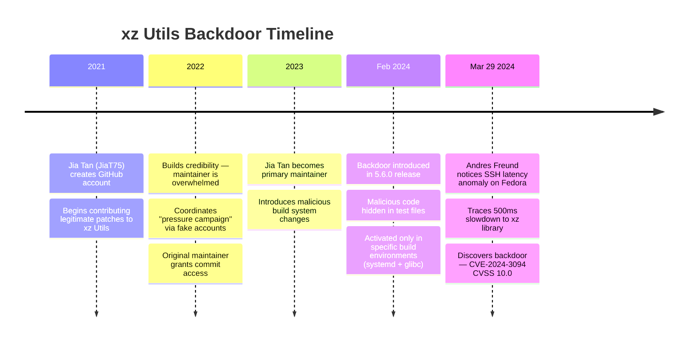
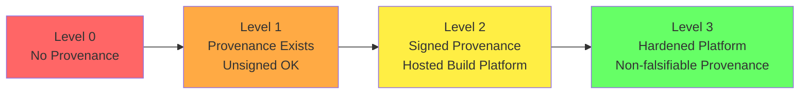
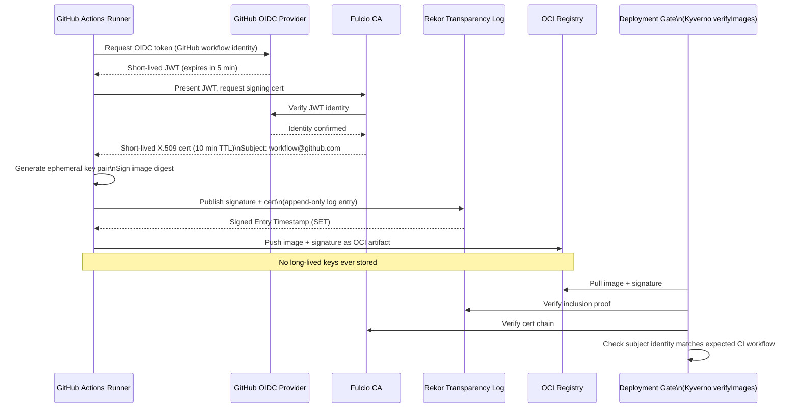
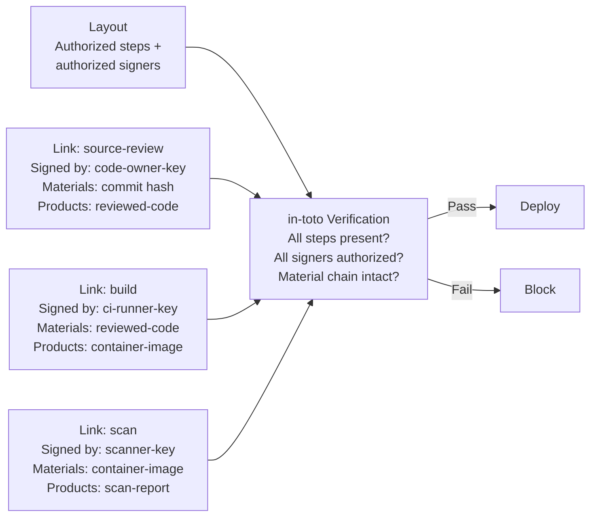
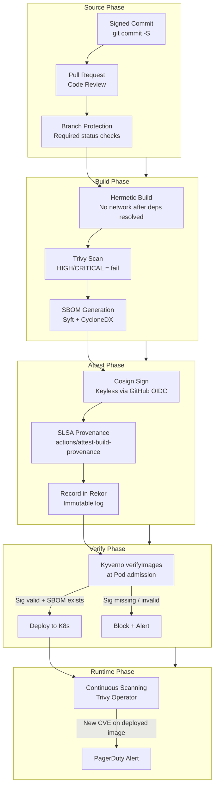

# Supply Chain Security

## Table of Contents

- [Overview](#overview)
- [Attack Vector Deep Dives](#attack-vector-deep-dives)
  - [Dependency Confusion](#dependency-confusion)
  - [Typosquatting](#typosquatting)
  - [xz Utils Backdoor (CVE-2024-3094) — Detailed Analysis](#xz-utils-backdoor-cve-2024-3094-detailed-analysis)
- [SLSA Framework (v1.1)](#slsa-framework-v11)
- [Sigstore Ecosystem: Keyless Signing](#sigstore-ecosystem-keyless-signing)
- [SBOM: Software Bill of Materials](#sbom-software-bill-of-materials)
  - [CycloneDX vs SPDX](#cyclonedx-vs-spdx)
  - [VEX: Vulnerability Exploitability Exchange](#vex-vulnerability-exploitability-exchange)
- [In-toto: Cryptographic Supply Chain Attestation](#in-toto-cryptographic-supply-chain-attestation)
- [Kyverno verifyImages: Enforce Signatures at Admission](#kyverno-verifyimages-enforce-signatures-at-admission)
- [Dependency Management: Renovate vs Dependabot](#dependency-management-renovate-vs-dependabot)
- [Secure CI/CD Pipeline: End-to-End](#secure-cicd-pipeline-end-to-end)
- [Real-World Production Scenario](#real-world-production-scenario)
  - [xz Utils Backdoor: How SLSA L3 Would Have Changed the Outcome](#xz-utils-backdoor-how-slsa-l3-would-have-changed-the-outcome)
- [Failure Modes](#failure-modes)
- [Debugging Guide](#debugging-guide)
- [Security Considerations](#security-considerations)
- [Interview Questions](#interview-questions)
  - [Basic](#basic)
  - [Intermediate](#intermediate)
  - [Advanced / Staff Level](#advanced-staff-level)

---

## Overview

Software supply chain security addresses a fundamental shift in the attack surface: adversaries increasingly target the build process, dependencies, and tools used to produce software rather than attacking the software directly in production. When a build pipeline is compromised (SolarWinds), a dependency is backdoored (xz Utils 2024), or a package registry is poisoned (dependency confusion), the attack is injected before the software ever reaches your defenses. The response requires cryptographic provenance at every stage: sign the commit, attest the build, verify at deployment.

```mermaid
flowchart LR
    subgraph Threat["Attack Vectors"]
        DEP[Dependency Confusion\nPrivate package squatting]
        TYPO[Typosquatting\nloadsh vs lodash]
        MAL[Malicious Maintainer\nxz Utils 2024]
        CICD2[CI/CD Compromise\nSolarWinds 2020]
        REPO[Repo Jacking\nAbandoned GitHub names]
    end

    subgraph Defense["Defense Stack"]
        PIN[Dependency Pinning\nLockfiles + hashes]
        SCAN2[Scanning\nTrivy / Grype / osv-scanner]
        SIGN2[Signing\nCosign + Fulcio + Rekor]
        PROV[Provenance\nSLSA L1 → L3]
        SBOM2[SBOM\nCycloneDX / SPDX]
        ADMC[Admission Control\nKyverno verifyImages]
    end

    Threat --> Defense
```



---

## Attack Vector Deep Dives

### Dependency Confusion

Alex Birsan's 2021 research demonstrated that if an organization uses a private npm/pip/gem package (e.g., `@mycompany/internal-lib`), an attacker can publish a package with the same name to the public registry. Package managers that check public registries before private ones resolve the malicious public version. Affected: Apple, Microsoft, PayPal, Shopify, and others.

**How to defend:**
```bash
# npm: scope all internal packages to your org namespace
# @mycompany/internal-lib — npm treats @scope as private by default

# pip: use --index-url to always prefer your private registry
pip install --index-url https://private.pypi.mycompany.com/simple/ internal-lib

# Configure pip.conf to prevent public fallback
[global]
index-url = https://private.pypi.mycompany.com/simple/
extra-index-url =   # Empty: no public fallback
no-index = true     # Only use index-url

# Register your internal package names on PyPI as decoys
# (empty package with a warning message)
```

### Typosquatting

Packages with names nearly identical to popular ones: `requestss` (requests), `loadsh` (lodash), `colorsjs` (colors). Attackers publish hundreds of these hoping for mistyped `pip install` commands.

**Defense:** Automated dependency review via Renovate/Dependabot with scorecard integration. Verify package download counts and contributor history. Use `pip-audit` and `osv-scanner` to check against the OSV database.

### xz Utils Backdoor (CVE-2024-3094) — Detailed Analysis

The most sophisticated supply chain attack ever publicly documented. Timeline:



**Technical mechanism:** The backdoor was injected via a malicious build script (`m4/build-to-host.m4`) that extracted and executed code embedded in binary test files (`.xz` test archives). The code patched the IFUNC resolver for `RSA_public_decrypt` in OpenSSH via `LD_PRELOAD` — allowing authentication bypass with a specific private key. Only activated when: systemd is present, the binary is linked with glibc, and the CPU architecture is x86-64.

**What SLSA L3 + Sigstore would have revealed:**
1. **SLSA L3 build isolation:** The malicious `m4` script executed during build, producing an artifact different from what a clean build would produce. A reproducible build system would have flagged the divergence.
2. **Provenance attestation:** SLSA provenance records the exact source commit and build inputs. The binary test files are recorded as materials — a binary diff would show they contain executable code.
3. **SBOM analysis:** A CycloneDX SBOM generated from the built artifact would list all libraries and their hashes. Comparing SBOMs across versions would highlight new binary additions in `tests/`.
4. **Transparency log:** Rekor records every signing event. Anomalous signing patterns (different build machine, different CI identity) are immediately visible.
5. **Reality:** SLSA L3 would not have prevented the attack from being introduced, but would have made it detectable earlier through reproducibility failures and provenance anomalies.

---

## SLSA Framework (v1.1)

SLSA provides progressively stronger guarantees about build integrity.



| Level | Requirements | Prevents |
|---|---|---|
| **L0** | None | Nothing |
| **L1** | Provenance document exists | Accidental mistakes, basic tampering |
| **L2** | Hosted build platform, signed provenance | Malicious build scripts run by humans |
| **L3** | Ephemeral isolated build environment, non-falsifiable provenance | Build system compromise, insider tampering |

**SLSA L3 in GitHub Actions:**
```yaml
# Uses the SLSA GitHub Generator: runs provenance generation in isolated GHA job
jobs:
  build:
    runs-on: ubuntu-latest
    outputs:
      digest: ${{ steps.build.outputs.digest }}
    steps:
      - uses: actions/checkout@v4
      - name: Build and push image
        id: build
        uses: docker/build-push-action@v6
        with:
          push: true
          tags: ghcr.io/myorg/myapp:${{ github.sha }}

  # SLSA provenance: runs in a separate, hardened job
  provenance:
    needs: build
    permissions:
      id-token: write
      packages: write
    uses: slsa-framework/slsa-github-generator/.github/workflows/generator_container_slsa3.yml@v2.0.0
    with:
      image: ghcr.io/myorg/myapp
      digest: ${{ needs.build.outputs.digest }}
```

**Verify SLSA provenance before deploy:**
```bash
slsa-verifier verify-image ghcr.io/myorg/myapp@sha256:abc123 \
  --source-uri github.com/myorg/myapp \
  --source-tag v1.2.3 \
  --builder-id https://github.com/slsa-framework/slsa-github-generator/.github/workflows/generator_container_slsa3.yml@refs/tags/v2.0.0
```

---

## Sigstore Ecosystem: Keyless Signing



**Why keyless signing eliminates key management:**
- No signing key to generate, store, rotate, or protect
- Every signature is cryptographically bound to a specific OIDC identity (GitHub Actions workflow, Google Cloud Build, GitLab CI)
- The Rekor transparency log provides non-repudiation — signatures cannot be retroactively removed
- Identity checking is the verification: `--certificate-identity-regexp https://github.com/myorg/.*@refs/heads/main`

---

## SBOM: Software Bill of Materials

### CycloneDX vs SPDX

| Dimension | CycloneDX (OWASP) | SPDX (Linux Foundation) |
|---|---|---|
| Primary focus | Security + vulnerability tracking | License compliance |
| VEX support | Native, built-in | External document required |
| Current version | v1.7 | v2.3 / v3.0 |
| Formats | JSON, XML, Protobuf | JSON, RDF, YAML, tag-value |
| Tooling | Syft, Trivy, CycloneDX CLI | SPDX Tools, FOSSology |
| Best for | DevSecOps, CSPM, vulnerability management | Legal/compliance, procurement |

**Generating and attesting SBOMs:**
```bash
# Generate SBOM with Syft
syft ghcr.io/myorg/myapp:v1.2.3 \
  -o cyclonedx-json=sbom.cdx.json \
  -o spdx-json=sbom.spdx.json

# Alternatively with Trivy
trivy image --format cyclonedx --output sbom.cdx.json myapp:v1.2.3

# Attest SBOM to image (links SBOM to specific image digest)
cosign attest --yes \
  --predicate sbom.cdx.json \
  --type cyclonedx \
  ghcr.io/myorg/myapp@sha256:abc123

# Verify SBOM attestation
cosign verify-attestation \
  --type cyclonedx \
  --certificate-identity-regexp "https://github.com/myorg/.*" \
  --certificate-oidc-issuer "https://token.actions.githubusercontent.com" \
  ghcr.io/myorg/myapp@sha256:abc123 | jq '.payload | @base64d | fromjson'
```

### VEX: Vulnerability Exploitability Exchange

VEX reduces alert fatigue by communicating whether a known CVE is actually exploitable in a specific product:

```json
{
  "document": {
    "category": "csaf_vex",
    "title": "VEX for myapp v1.2.3"
  },
  "vulnerabilities": [{
    "cve": "CVE-2024-1234",
    "notes": [{
      "category": "description",
      "text": "CVE-2024-1234 affects libfoo. myapp uses libfoo but calls only the non-vulnerable API path."
    }],
    "product_status": {
      "known_not_affected": ["myapp-1.2.3"]
    }
  }]
}
```

---

## In-toto: Cryptographic Supply Chain Attestation

In-toto provides end-to-end cryptographic guarantees for the entire supply chain. Three components:

- **Layout:** Defines the expected steps, authorized performers, and materials/products for each step
- **Link metadata:** Signed evidence that a specific step was performed (signed by the key of the authorized performer)
- **Verification:** Validates that all steps were performed by authorized performers on correct materials



SLSA provenance uses the in-toto attestation format (`Statement` + `Subject` + `Predicate`) — SLSA is built on in-toto's cryptographic foundation.

---

## Kyverno verifyImages: Enforce Signatures at Admission

```yaml
apiVersion: kyverno.io/v1
kind: ClusterPolicy
metadata:
  name: verify-image-signatures
spec:
  validationFailureAction: Enforce
  background: false   # Only evaluate at admission, not retrospectively
  rules:
    - name: verify-cosign-signature
      match:
        any:
          - resources:
              kinds: [Pod]
      verifyImages:
        - imageReferences:
            - "ghcr.io/myorg/*"
            - "123456789.dkr.ecr.us-east-1.amazonaws.com/*"
          mutateDigest: true   # Rewrite tag references to digest references
          verifyDigest: true   # Require digest in image ref
          attestors:
            - entries:
                - keyless:
                    subject: "https://github.com/myorg/*"
                    issuer: "https://token.actions.githubusercontent.com"
                    rekor:
                      url: https://rekor.sigstore.dev
          # Also require SBOM attestation
          attestations:
            - type: https://cyclonedx.org/bom
              attestors:
                - entries:
                    - keyless:
                        subject: "https://github.com/myorg/*"
                        issuer: "https://token.actions.githubusercontent.com"
```

---

## Dependency Management: Renovate vs Dependabot

| Feature | Renovate | Dependabot |
|---|---|---|
| Platform | Multi-platform (GitHub, GitLab, Bitbucket, Azure) | GitHub native |
| Configuration | `renovate.json` — highly configurable | `.github/dependabot.yml` — simpler |
| Grouping | Advanced: group all `@types/*` or all patch updates | Basic: per ecosystem |
| Auto-merge | Configurable per update type | Basic support |
| Monorepo | Excellent | Limited |
| Private registries | Extensive support | Limited |
| Lockfile updates | Comprehensive | Good |

**Renovate configuration for security-first dependency management:**
```json
{
  "$schema": "https://docs.renovatebot.com/renovate-schema.json",
  "extends": ["config:recommended", "security:openssf-scorecard", ":pinAllExceptPeerDependencies"],
  "vulnerabilityAlerts": {
    "enabled": true,
    "labels": ["security", "dependencies"]
  },
  "osvVulnerabilityAlerts": true,
  "packageRules": [
    {
      "matchUpdateTypes": ["patch"],
      "matchCurrentVersion": "!/^0/",
      "automerge": true,
      "automergeType": "pr"
    },
    {
      "matchUpdateTypes": ["major"],
      "dependencyDashboardApproval": true,
      "labels": ["breaking-change"]
    },
    {
      "matchDepTypes": ["devDependencies"],
      "automerge": true
    }
  ],
  "lockFileMaintenance": {"enabled": true},
  "pinDigests": true   // Pin GitHub Actions to full SHAs
}
```

**Additional scanning tools:**
```bash
# Python: audit installed packages against PyPI advisories
pip-audit --requirement requirements.txt --format json

# Node.js: check for known vulnerabilities
npm audit --audit-level=high

# Go: check for known vulnerabilities in modules
govulncheck ./...

# Cross-ecosystem: query OSV database
osv-scanner --lockfile package-lock.json --lockfile requirements.txt

# Filesystem scan (catches secrets and misconfigs too)
trivy fs . --scanners vuln,secret,config
```

---

## Secure CI/CD Pipeline: End-to-End



---

## Real-World Production Scenario

### xz Utils Backdoor: How SLSA L3 Would Have Changed the Outcome

**Without supply chain security (actual outcome):** The backdoor was present in the 5.6.0 release for 14 days before discovery. Detection was accidental — a performance-curious engineer noticed SSH latency. Organizations using affected distros (Fedora Rawhide, some Debian testing packages) were exposed for the full window.

**With SLSA L3 + Sigstore in the ecosystem:**

1. **SLSA L3 build isolation:** The malicious `m4/build-to-host.m4` script extracted and executed code from binary test files during the build. In a SLSA L3 hermetic build, the build environment has no network access after dependency resolution, and the build is reproducible. Running the build twice on independent infrastructure would produce different binaries (the malicious code changes non-deterministically based on environment) — a reproducibility failure would flag the release.

2. **Provenance materials list:** SLSA provenance records all build inputs (materials). The binary test files (`.xz` archives containing the malicious payload) would appear in the materials list. An SBOM comparison tool would flag that new binary blobs appeared in the `tests/` directory between versions 5.4.x and 5.6.0 — a large binary in a test directory is anomalous.

3. **Transparency log anomaly:** If the signing identity changed between 5.4.x (signed by the original maintainer's key/identity) and 5.6.0 (signed by JiaT75's new identity), monitoring of the Rekor transparency log for the project's signing identity would detect the change.

4. **Conclusion:** SLSA L3 + Sigstore would not have *prevented* the attack from being attempted, but would have likely *detected* it within hours of the first build, not 14 days after release. Organizations with Kyverno `verifyImages` enforcing provenance attestation requirements would have blocked the compromised version from deploying even if it was signed.

---

## Failure Modes

| Failure | Symptoms | Detection | Fix |
|---|---|---|---|
| Unsigned image deployed to production | Kyverno `verifyImages` failure | Admission webhook rejection | Ensure all images go through CI signing pipeline |
| Dependency confusion via scoped package names | Malicious public package installed during build | `pip-audit` / `npm audit` / `osv-scanner` | Explicit private registry configuration; empty `extra-index-url` |
| Stale SBOM (not updated after dependencies change) | SBOM does not reflect actual deployed components | SBOM diff between build time and runtime scan | Regenerate SBOM on every build, not just periodically |
| Rekor verification timeout | Kyverno image verification adds >10s to pod creation | Pod creation latency spike | Private Rekor instance for high-throughput clusters; Kyverno cache |
| Break-glass unsigned deployment | CI outage forces manual image push without signing | PolicyException not audited | Monitor PolicyException activations; require SRE approval + audit trail |
| Typosquatted dependency merged via Dependabot PR | Malicious package code executed in CI build | `osv-scanner` on Dependabot PR | Require human review for any dependency not in known-good list |

---

## Debugging Guide

```bash
# Verify an image's Cosign signature
cosign verify \
  --certificate-identity-regexp "https://github.com/myorg/.*" \
  --certificate-oidc-issuer "https://token.actions.githubusercontent.com" \
  ghcr.io/myorg/myapp@sha256:abc123 | jq .

# Check what attestations exist for an image
cosign verify-attestation \
  --type cyclonedx \
  --certificate-identity-regexp "https://github.com/myorg/.*" \
  --certificate-oidc-issuer "https://token.actions.githubusercontent.com" \
  ghcr.io/myorg/myapp@sha256:abc123 | jq '.payload | @base64d | fromjson | .predicate'

# Query Rekor for all signatures from a specific identity
rekor-cli search --email builder@github.com --output json | jq .

# Debug Kyverno verifyImages failure
kubectl describe pod $POD_NAME -n $NAMESPACE | grep -A20 "Error\|Warning"
kubectl logs -n kyverno deploy/kyverno-admission-controller | grep "verifyImages"

# Scan for secrets in repository history
trivy repo --scanners secret https://github.com/myorg/myapp

# Audit installed packages for vulnerabilities
trivy fs --scanners vuln --format json . | jq '.Results[] | select(.Vulnerabilities | length > 0)'
```

---

## Security Considerations

- **The public Rekor instance records your signing identity** — organizations with sensitive pipelines should run a private Rekor instance to avoid exposing internal CI workflow URLs in the public transparency log.
- **Kyverno `verifyImages` needs a break-glass procedure** — if the signing infrastructure (Fulcio, Rekor, GitHub OIDC) becomes unavailable during an incident, you need a documented and audited procedure for deploying without signature verification. This should require two-person approval.
- **SBOMs are not a silver bullet** — an SBOM lists components but does not guarantee they are uncompromised. An SBOM generated from a build with a backdoored dependency will faithfully list the backdoored dependency. Use SBOMs for *inventory and CVE correlation*, not as proof of security.
- **Lockfile pinning prevents dependency confusion but not typosquatting** — both `npm ci` (uses `package-lock.json`) and `pip install --require-hashes` pin to specific versions and hashes. But if the lockfile itself references a typosquatted package (introduced via an attacker's PR), pinning will reproduce the malicious package reliably.
- **GitHub Actions SHA pinning is mandatory** — `uses: actions/checkout@v4` is mutable (the v4 tag can be force-pushed). `uses: actions/checkout@11bd71901bbe5b1630ceea73d27597364c9af683` pins to an immutable commit hash. Renovate `pinDigests: true` automates this.

---

## Interview Questions

### Basic

**Q: What is dependency confusion and how do you defend against it?**
A: Dependency confusion exploits package manager resolution order: when both a private registry and the public registry have a package with the same name, some configurations prefer the public version (which may have a higher version number). Attackers publish malicious packages with high version numbers to public registries using names of known internal packages. Defense: (1) Always configure your package manager to prefer the private registry with no public fallback (`--no-index` or empty `extra-index-url` for pip). (2) Use scoped/namespaced packages (`@mycompany/internal-lib`) that cannot be claimed on public registries without the namespace. (3) Register your internal package names as decoys on public registries.

**Q: What is the difference between SLSA Level 1, 2, and 3?**
A: L1: provenance document exists — the build records what produced the artifact, even if unsigned. Prevents accidental mistakes but not intentional tampering. L2: signed provenance from a hosted build platform — a verifiable signature links the build platform (GitHub Actions, Cloud Build) to the artifact. Much harder to forge. L3: hardened build platform with non-falsifiable provenance — builds run in ephemeral isolated environments (not reused between builds), provenance is generated by a trusted control plane that the build itself cannot access, and the build is reproducible. Prevents even a compromised build script from falsifying provenance.

**Q: What is Rekor and why is it important?**
A: Rekor is an immutable, append-only transparency log (Merkle tree-based) that records all Sigstore signing events. When Cosign signs an artifact, the signature + certificate are recorded in Rekor. This provides: (1) Non-repudiation — signatures cannot be retroactively removed. (2) Auditability — anyone can query Rekor to see what artifacts were signed by which identities. (3) Detection — you can monitor Rekor for unexpected signing events against your organization's identity. It is the "certificate transparency" concept applied to software signing.

### Intermediate

**Q: How would you implement supply chain security for a Python microservice in GitHub Actions?**
A: Pipeline steps: (1) `pip install --require-hashes -r requirements.txt` — pin dependencies to exact hashes, blocks substitution attacks. (2) `pip-audit --requirement requirements.txt` — check against PyPI advisory database. (3) `trivy fs . --scanners vuln,secret` — scan for CVEs and any accidentally committed secrets. (4) Build distroless Python container image with multi-stage build. (5) `trivy image --severity HIGH,CRITICAL --exit-code 1 $IMAGE` — block if CRITICAL CVEs in image. (6) `cosign sign --yes $IMAGE@$DIGEST` — keyless sign with GitHub OIDC. (7) `cosign attest --predicate sbom.cdx.json --type cyclonedx $IMAGE@$DIGEST` — attach SBOM. In the cluster: Kyverno `verifyImages` policy requiring valid signature from the expected GitHub Actions OIDC issuer and repository subject.

**Q: A new transitive dependency vulnerability (Log4Shell equivalent) is announced. How quickly can you determine if you are affected?**
A: If you have a mature supply chain security posture: (1) Query your SBOM inventory — SBOMs attached to all deployed images contain the full dependency tree. A single query against your SBOM store (GUAC, Dependency-Track, or an OCI registry query) returns all running containers that include the affected package within minutes. (2) Cross-reference with your container registry — if SBOMs are stored as OCI attestations, `cosign verify-attestation --type cyclonedx` retrieves them per image. (3) ECR/Artifact Registry enhanced scanning — rescans all images against the new CVE automatically; findings appear in Security Hub/Inspector within hours of the CVE being published. Without this posture: days of manual inventory work.

### Advanced / Staff Level

**Q: Design a supply chain security strategy for a company shipping on-premise software to enterprise customers (not SaaS).**
A: Key differences from SaaS: you don't control the runtime environment, so customers must be able to verify provenance independently. (1) **SLSA L3 provenance:** All release artifacts include SLSA L3 provenance signed with a stable organizational key (not keyless — customers need a stable root of trust). Publish the public key and Rekor instance URL in your security documentation. (2) **SBOMs in release bundle:** Every release ships a CycloneDX SBOM as a signed attachment. Customers can feed this into their SBOM management tools (Dependency-Track) for continuous CVE monitoring. (3) **VEX documents:** For each major CVE that affects components in your SBOM, publish a VEX document stating whether your specific usage is exploitable. Reduces customer false-positive noise. (4) **Reproducible builds:** Customers should be able to re-run the build from the published source + build inputs and obtain the same binary (hash-identical output). This is the gold standard for on-premise trust. (5) **Update verification:** The software update mechanism verifies the SLSA provenance and signature of the update package before installing — preventing a compromised update server from pushing malicious updates. (6) **Notary v2 / Notation:** For on-premise customers who cannot reach the public Rekor instance, use Notation (Notary v2) with an enterprise-managed signing key and private TSA (Timestamp Authority).
